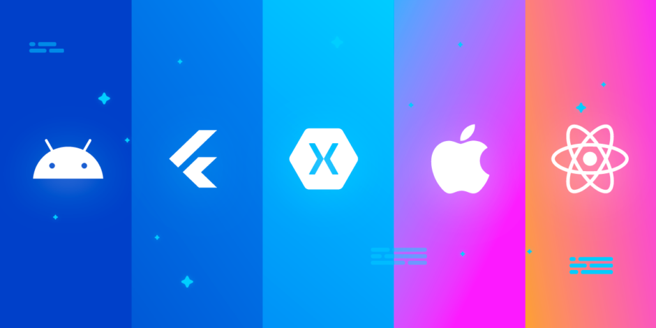
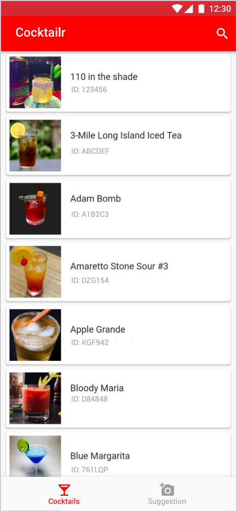
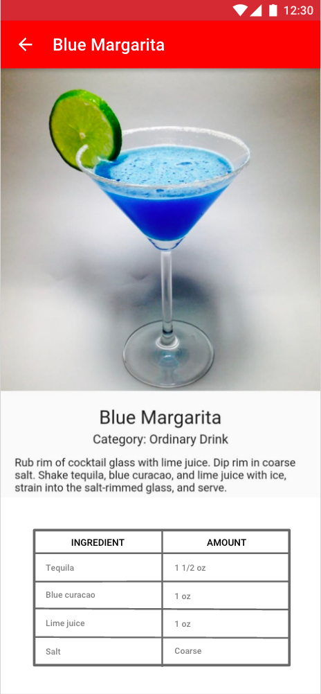
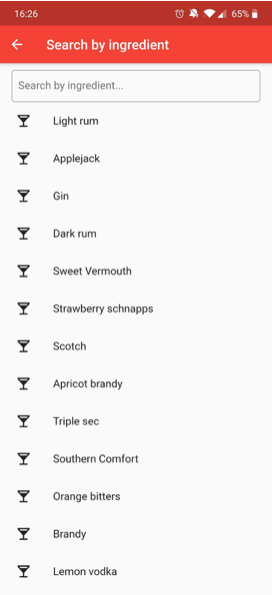
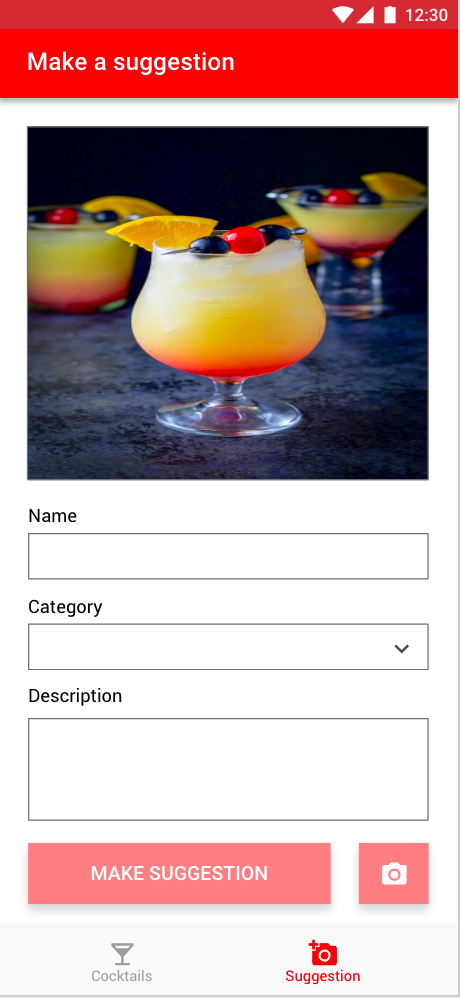
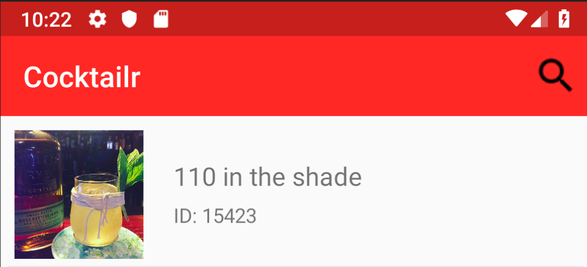
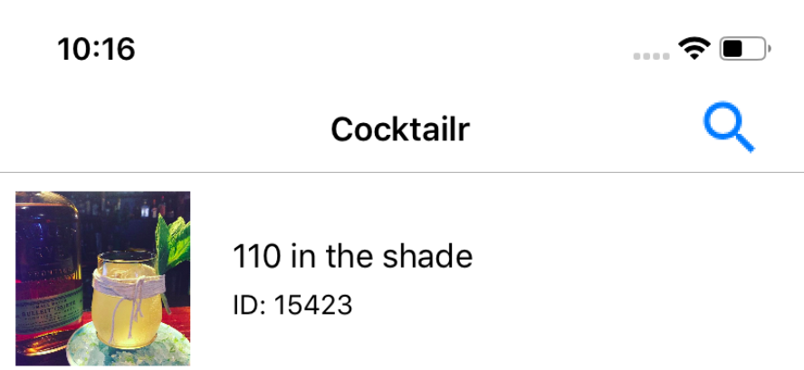

Flutter Versus Other Mobile Development Frameworks: A UI And Performance Experiment. Part 1 - Codemagic blog

# Flutter Versus Other Mobile Development Frameworks: A UI And Performance Experiment. Part 1

Dec 29, 2019
> Written by **> Bram De Coninck**

I’ve already read a lot of articles about how Flutter compares to other mobile development frameworks, but most of them were written from a theoretical point of view. It’s already been well established that Flutter is a solid choice for creating mobile applications and that it’s a worthy opponent to frameworks like React Native and Xamarin Forms.

> Everyone agrees that Flutter looks good on paper, but how can companies who still doubt Flutter be convinced that they should at least consider using it? Theories and opinions are one thing, but what we really need more of is proof of Flutter’s capabilities and performance.

This year I graduated in Applied Computer Sciences at University College Ghent in Belgium. During my last year I was given the opportunity to write a thesis around a topic of my choice. I decided to write my thesis around Flutter because I hoped it would be one of the first of its kind. In the first section I discussed how Flutter works, what Dart is and why it’s ideal for Flutter and I also discussed a couple of state management techniques. In the second section I performed two experiments.

During the first experiment I created the same app five times, each time with a different framework. The frameworks I used were native Android, native iOS, Flutter, Xamarin Forms and React Native. During the second experiment I measured the CPU usage of the apps I created in the first experiment. In this article I will share the results of these experiments.

## Creating the same application five times

I’m going to be honest with you, this first experiment wasn’t really fair. I don’t have the same amount of experience with every framework I used. If I were to make a ranking of the amount of experience I had with each framework from highest to lowest, it would probably look like this:

- Android
- Flutter
- Xamarin Forms
- iOS
- React Native

I do however want to point out that I had already created mock-ups of the application so I wouldn’t have to mess around with thinking about the UI during the development of the first app. I also knew enough about every framework to create the application without Googling a lot, so there wasn’t much of a learning curve.

The name of the application I created is **Cocktailr**. As the name indicates, this app is for cocktail lovers who want to discover new cocktails and also search for cocktails they can make with ingredients they have or want to use. The application exists out of four screens: a cocktail list screen, a cocktail detail screen, an ingredient list screen and a cocktail creation screen. The images underneath are the mock-ups I created before developing the applications. I don’t think I have to show you the screens of the five apps I created because, spoiler alert, they all look nearly identical to the mock-ups (apart from some minor inconsistencies which I’ll discuss later).

> Instead, I’m going to discuss what it was like to develop the app with each framework and also point out some of the difficulties I encountered. I’m also going to compare the amount of time it took to create the apps per framework.

## Creating the native Android application

To create the native Android application I used **Android Studio** as IDE and **Kotlin** as programming language. The 3rd party packages I relied on were **Glide** for fetching network images, **Retrofit** for consuming HTTP requests and GSON to convert JSON objects into POJOs (Plain Old Java Objects). I also used something called the **Navigation Component**, which is a part of Android Jetpack, a suite of libraries, tools, and guidance to help developers write high-quality apps easier. It was still in alpha at the time, but I loved it and I felt comfortable using it.

To create layouts on Android you can either use a visual layout builder or you can create it in XML. Usually you’ll work with both to get the best of both worlds.

The main problem I had (and still have) with Android development is that there are too many ways to accomplish a certain task. If you were to Google how to make network requests on Android you would discover all kinds of different packages and documentation. That’s why the Android developers at Google are currently working on **Android Jetpack**, the set of tools I mentioned earlier. This will make finding the right tools to solve your problems more straightforward. Since both Java and Kotlin are supported for Android development, you’re sometimes going to find code samples or tutorials written in the language you’re not using.

> Android Studio does have support for turning Java code into Kotlin code but the ‘translation’ isn’t always 100% accurate.

Another difficult problem is that it can be quite hard to add elements to your layout dynamically (Jetpack Compose, which allows you to create layouts declaratively like with Dart,wasn’t around when I created this project). On the cocktail detail screen I wanted to add a table with the names of the ingredients of the cocktail and also a measurement per ingredient. I found it quite difficult to add rows to a table programmatically. There isn’t a lot of information about it in the official Android documentation, so when you have a problem like this you’re probably going to have to look for a solution on websites like StackOverflow.

I was eventually able to add the rows programmatically but the solution was, in my opinion, quite cumbersome. The Kotlin code underneath is the function I wrote to create table rows programmatically.

	private fun createTableRows() {
	    tl_cocktail_detail_ingredients.removeAllViews()

	    val params = TableRow.LayoutParams(0, TableRow.LayoutParams.WRAP_CONTENT, 1f)

	    val tv1 = TextView(this.context)
	    tv1.text = "INGREDIENT"
	    tv1.background = ContextCompat.getDrawable(context!!, R.drawable.grid_border)
	    tv1.setPadding(6, 6, 6, 6)
	    tv1.layoutParams = params
	    tv1.gravity = Gravity.CENTER
	    tv1.setTextColor(ContextCompat.getColor(this.context!!, R.color.black))
	    tv1.typeface = Typeface.DEFAULT_BOLD

	    val tv2 = TextView(this.context)
	    tv2.text = "AMOUNT"
	    tv2.setPadding(6, 6, 6, 6)
	    tv2.layoutParams = params
	    tv2.gravity = Gravity.CENTER
	    tv2.setTextColor(ContextCompat.getColor(this.context!!, R.color.black))
	    tv2.typeface = Typeface.DEFAULT_BOLD

	    val tr = TableRow(this.context)
	    tr.background = ContextCompat.getDrawable(context!!, R.drawable.grid_border)

	    tr.addView(tv1)
	    tr.addView(tv2)

	    tl_cocktail_detail_ingredients.addView(tr)

	    if (!cocktail?.ingredients.isNullOrEmpty() && !cocktail?.measurements.isNullOrEmpty()) {
	        cocktail!!.ingredients.forEachIndexed { index, ingredient ->
	            val tv1 = TextView(this.context)
	            tv1.text = ingredient
	            tv1.background = ContextCompat.getDrawable(context!!, R.drawable.grid_border)
	            tv1.setPadding(32, 6, 6, 6)
	            tv1.layoutParams = params

	            val tv2 = TextView(this.context)
	            if (index >= cocktail!!.measurements.count()) {
	                tv2.text = ""
	            } else {
	                tv2.text = cocktail!!.measurements[index]
	            }
	            tv2.setPadding(32, 6, 6, 6)
	            tv2.layoutParams = params

	            val tr = TableRow(this.context)
	            tr.background = ContextCompat.getDrawable(context!!, R.drawable.grid_border)

	            tr.addView(tv1)
	            tr.addView(tv2)

	            tl_cocktail_detail_ingredients.addView(tr)
	        }
	    }
	}

Something that isn’t really an issue but I also find quite cumbersome is how certain styling has to be done. Let’s say you want to create a text field with a border around it. To accomplish this, you’ll have to add the text field to the layout of your screen but you’ll also have to create a separate XML file to define the border. Then, you need to set that separate file as the background of the text field. It isn’t difficult at all, it just feels like a lot of work for such a simple task. The XML code underneath is set as background of the textfield to create a border around it.

	<?xml version="1.0" encoding="utf-8"?>
	<shape xmlns:android="http://schemas.android.com/apk/res/android" android:shape= "rectangle">
	    <solid android:color="#ffffff"/>
	    <corners android:radius="5dp" />
	    <stroke android:width="1dp" android:color="#000000"/>
	</shape>

## Creating the native iOS application

To create the native iOS application I used **Xcode** as IDE and **Swift** as programming language. No 3rd party packages were used. I based my way of working on the book **“App Development with Swift”**, which is an official book by Apple.

Even though I’m an Android developer at heart, I must say it’s a lot easier to find the best way to tackle a certain problem. There are for example less ways to add functionality like consuming HTTP requests, which makes it easier to find the solution that fits best for the needs of your project.

Something that I had to figure out that wasn’t described in the book was how to subscribe to changes happening in the cocktail repository, the class were all cocktail objects are stored. I didn’t want to refetch all cocktails every time the cocktail list screen was opened. To solve this problem I used something called the **NotificationCenter**.

Thanks to the book I mentioned earlier I hardly had to google anything. In fact, the article I found on NotificationCenter was the only source of information I used apart from the book. I was lucky that the article had an example on how to use it in Swift, but during the development of other applications I encountered the same issue I had on Android. Older articles or StackOverflow answers might have solutions provided in **Objective-C**, the language used for iOS development before Swift was introduced. Even though I didn’t have this issue during the development of the native iOS application for Cocktailr, I thought it was worth mentioning that it exists.

My main issue with iOS development is that a **Storyboard**, the visual layout builder for iOS apps, can be more complex than necessary. For example, finding a setting to add a border around a text field can be very difficult. Luckily, it’s a lot easier to do this programmatically than it is in Android. **SwiftUI**, a way to create layouts declaratively with Swift, wasn’t around when I created this app by the way. It’s also possible to make changes to your layout in the XML file of a Storyboard, but unlike Android, the XML is a mess. The XML code underneath is the cocktail list screen, which actually only contains a list when you think about it.

	<scene sceneID="aud-0C-1Pk">
	    <objects>
	        <tableViewController id="3Sf-E8-Zfo" customClass="CocktailTableViewController" customModule="Cocktailr_iOS" customModuleProvider="target" sceneMemberID="viewController">
	            <tableView key="view" clipsSubviews="YES" contentMode="scaleToFill" alwaysBounceVertical="YES" dataMode="prototypes" style="plain" separatorStyle="default" rowHeight="-1" estimatedRowHeight="-1" sectionHeaderHeight="28" sectionFooterHeight="28" id="9Np-nI-tQC">
	                <rect key="frame" x="0.0" y="0.0" width="414" height="896"/>
	                <autoresizingMask key="autoresizingMask" widthSizable="YES" heightSizable="YES"/>
	                <color key="backgroundColor" white="1" alpha="1" colorSpace="custom" customColorSpace="genericGamma22GrayColorSpace"/>
	                <prototypes>
	                    <tableViewCell clipsSubviews="YES" contentMode="scaleToFill" preservesSuperviewLayoutMargins="YES" selectionStyle="default" indentationWidth="10" reuseIdentifier="CocktailCell" id="qUV-tm-57K" customClass="CocktailTableViewCell" customModule="Cocktailr_iOS" customModuleProvider="target">
	                        <rect key="frame" x="0.0" y="28" width="414" height="44"/>
	                        <autoresizingMask key="autoresizingMask"/>
	                        <tableViewCellContentView key="contentView" opaque="NO" clipsSubviews="YES" multipleTouchEnabled="YES" contentMode="center" preservesSuperviewLayoutMargins="YES" insetsLayoutMarginsFromSafeArea="NO" tableViewCell="qUV-tm-57K" id="4Hj-H9-rtF">
	                            <rect key="frame" x="0.0" y="0.0" width="414" height="43.5"/>
	                            <autoresizingMask key="autoresizingMask"/>
	                        </tableViewCellContentView>
	                        <connections>
	                            <segue destination="IYp-bk-shv" kind="show" identifier="CocktailDetailSegue" id="bjc-Sd-8ni"/>
	                        </connections>
	                    </tableViewCell>
	                </prototypes>
	                <connections>
	                    <outlet property="dataSource" destination="3Sf-E8-Zfo" id="Arh-Wp-anV"/>
	                    <outlet property="delegate" destination="3Sf-E8-Zfo" id="qJE-tE-xa7"/>
	                </connections>
	            </tableView>
	            <navigationItem key="navigationItem" title="Cocktailr" id="0Li-fu-c3B">
	                <barButtonItem key="backBarButtonItem" title=" " id="4vq-K8-peJ"/>
	                <barButtonItem key="rightBarButtonItem" title="Search" image="Search Icon" id="fCh-D0-Tws">
	                    <connections>
	                        <action selector="searchBarButtonClick:" destination="3Sf-E8-Zfo" id="0Pk-I0-Hsb"/>
	                    </connections>
	                </barButtonItem>
	            </navigationItem>
	            <connections>
	                <segue destination="UPM-k4-dYF" kind="show" identifier="SearchTableViewSegue" id="e9G-mk-bUI"/>
	            </connections>
	        </tableViewController>
	        <placeholder placeholderIdentifier="IBFirstResponder" id="dkZ-bW-bEE" userLabel="First Responder" sceneMemberID="firstResponder"/>
	    </objects>
	    <point key="canvasLocation" x="886" y="-457"/>
	</scene>

I encountered a problem during the creation of the cocktail list page. The list, or **TableView** as it’s called on iOS, exists out of custom **cells**. Each cell contains the information of one cocktail: an image, its name and its ID. When you scroll through the list of cocktails you’ll see that all of a sudden the cocktail names don’t match with the images anymore. This happens because the cells of the list are reused when you scroll through the list and it takes a bit longer to load an image than it does to load text. Some iOS developers have told me this is an issue all junior iOS developers encounter and that it’s quite easy to fix. I thought it was still worth mentioning, as I didn’t have a similar problem with any of the other frameworks.

I also had to use a TableView to create the table on the cocktail detail page, as there isn’t an iOS component to create tables. The name ‘TableView’ can be quite misleading.

## Creating the Flutter application

To create the Flutter application I used **Visual Studio Code** as IDE and **Dart** as programming language. The 3rd party packages I relied on were **Image_picker** for taking photos, **Http** for consuming HTTP requests and **RxDart** to use **Observables** for data streams. I used the **BLoC** state management technique for this application, but I didn’t use the 3rd party package. I found all of the information I needed to create this application in **the official Flutter docs** and in articles about BLoC written by **Didier Boelens**.

Flutter doesn’t have a visual layout builder. You also don’t need an additional language like XML to create your layout. You use Dart to create widgets which together will form your layouts, and you build these layouts declaratively.

The biggest problem I faced during the development of this application was state management. I didn’t have a lot of experience with BLoC at the time and the **Provider** package wasn’t around when I created this application. BLoC is, in my opinion and as regularly stated by Google, the superior state management technique. It has a huge learning curve to it though. I didn’t have any experience with **Redux** or **Scoped_Model** either, and only using **setState()** wasn’t going to suffice, so I had to resort to BLoC.

Flutter provides its own widgets, and it has a lot of them! One of them is a Table widget, which made it really easy to create the table on the cocktail detail page. I had problems creating this table with both Android and iOS, so this was a nice change of pace. The code underneath is the function to create all the table rows.

	List<TableRow> _createTable(Cocktail cocktail) {
	  List<TableRow> tableList = [];
	  tableList.add(
	    TableRow(
	      children: [
	        Padding(
	          child: Text(
	            "INGREDIENT",
	            textAlign: TextAlign.center,
	            style: TextStyle(fontWeight: FontWeight.bold),
	          ),
	          padding: EdgeInsets.all(4),
	        ),
	        Padding(
	          child: Text(
	            "MEASUREMENT",
	            textAlign: TextAlign.center,
	            style: TextStyle(fontWeight: FontWeight.bold),
	          ),
	          padding: EdgeInsets.all(4),
	        )
	      ],
	    ),
	  );
	  for (int i = 0; i < cocktail.ingredients.length; i++) {
	    tableList.add(
	      TableRow(
	        children: [
	          Padding(
	            child: Text(cocktail.ingredients[i]),
	            padding: EdgeInsets.all(4),
	          ),
	          Padding(
	            child: Text(i < cocktail.measurements.length
	                ? cocktail.measurements[i]
	                : ''),
	            padding: EdgeInsets.all(4),
	          )
	        ],
	      ),
	    );
	  }
	  return tableList;
	}

The only other ‘issue’ I encountered is that the iOS app doesn’t have a native look-and-feel. I used the **Material widgets** to create the application. Native Android apps implement **Material design**, but native iOS apps implement **Cupertino design** instead. A lot of widgets do look native on both platforms though, like the List widget for example. Other widgets like the AppBar widget don’t. Some widgets like the Switch widget have an adaptive constructor, which allows you to create a switch that look native on both platforms. It’s possible to create separate widgets for Android and iOS for widgets without an adaptive constructor, but unfortunately that costs more time.

## Creating the React Native application

To create the React Native application I used **Visual Studio Code** as IDE and **TypeScript** as programming language. I relied on a lot of 3rd party packages to create this application:

- **Expo** to make the development of the application easier and because it has picture taking support built-in.
- **React-native-easy-toasts** for showing a toast on the cocktail creation screen.
- **React-native-elements** because it has a lot of beautiful UI components.
- **React-native-svg-transformer** to be able to use SVG icons.
- **React-navigation** for the navigation of the app.
- **Styled-components** to make it easier to style components.

React Native doesn’t have a visual layout builder. You use a language called **JSX** to create your layouts declaratively.

Managing state was one of the biggest challenges I encountered during the creation of this application. I didn’t know Redux, and learning it would have been a big time investment. This was not the fault of React Native, it was my own fault.

The only styling issue I encountered was during the creation of the cards used in the list of the cocktail list screen. To create shadows on this card for Android I had to use the ‘elevation’ property. To have the same effect on iOS I had to use the ’shadow-color’, ’shadow-radius’, ’shadow-opacity’ and ’shadow-offset’ properties. Having to do styling in two different ways to have the same result on both Android and iOS isn’t really great when your goal is to make a cross-platform app. The code underneath shows the style I created for iOS and the elevation property I used for Android. It also shows the CocktailCard as a whole, written in JSX.

	const styles = StyleSheet.create({
	    cardWrapper: {
	        shadowColor: '#000000',
	        shadowOffset: {
	            width: 0,
	            height: 3,
	        },
	        shadowRadius: 2,
	        shadowOpacity: 0.3,
	    },
	})

	export default class CocktailCard extends React.PureComponent {
	    render() {
	        const { id, image, name, onPress } = this.props

	        return (
	            <CocktailCardWrapper elevation={5} style={styles.cardWrapper} onPress={onPress}>
	                <CocktailImage source={{ uri: image }} />
	                <CocktailText>
	                    <CocktailName>{name}</CocktailName>
	                    <CocktailId>{`ID: ${id}`}</CocktailId>
	                </CocktailText>
	            </CocktailCardWrapper>
	        )
	    }
	}

The Android and iOS app created with React Native did have a native look-and-feel. That’s because React Native uses widgets of the platform it’s running on instead of providing its own widgets like Flutter does.

Both Flutter and React Native support **Stateful Hot Reload**, but I have to say that it’s faster on Flutter than on React Native. On React Native it took longer to reload the app and sometimes it wouldn’t even work at all. The fact that it took longer might have something to do with the use of **Expo**.

## Creating the Xamarin Forms application

To create the Xamarin Forms application I used **Visual Studio for Mac** as IDE and **C#** as programming language. The only 3rd party packages I relied on was **Xam.Plugin.Media** for taking pictures.

Xamarin Forms has a visual layout builder, but it isn’t as good as the ones you use for native Android and native iOS development. You’ll do most of the layout building with the **XAML** language, which is very similar to XML.

When I created this application, Xamarin Forms didn’t support Hot Reload. At the time of writing this article it’s either in beta or already supported. I don’t know how well it performs in comparison to the Hot Reload of Flutter and React Native though.

Xamarin Forms is a cross-platform framework but when it comes to styling it doesn’t seem to be as straightforward as Flutter or React Native. I wanted to change the colour of the app bar to red. Apparently this isn’t a change you can make in the shared codebase, you need to change the colour of the app bar on Android and iOS separately. This is also the case for the colour of the selected item in the bottom navigation bar. Because you have to do the same styling twice, you might end up with inconsistencies between your Android and iOS applications if you’re not careful.

Now that we’re on the topic of colours, I was unable to change the colour of the search icon in the app bar on the cocktail list screen and the camera icon of the cocktail detail screen. There is probably a way to change these colours, but it’s not straightforward at all. The images underneath illustrate the colour inconsistencies between Android and iOS.

The biggest issue I encountered was, again, the table on the cocktail detail screen. The styling of the table wasn’t the issue though. I have to iterate over the list of ingredients and the list of measurements, but iterating over two lists isn’t possible to create your layout. I had to create a new model which contains the ingredient and its measurement. Then I was able to iterate over a list of those objects. This is the only framework where I had to change the models in such a way and it’s very cumbersome.

## Conclusion of the first experiment

The table below shows how much time it took to create every screen per framework. As you can see, I was able to build the Flutter application and the React Native application faster than either one of the native applications. You also have to keep in mind that because these are both cross-platform frameworks I was able to make an Android and iOS application in less time than one native application.

Creating the Flutter application only took approximately ⅓ of the time it took to create both native applications combined. This proves how much time you save by using cross-platform frameworks. Their Hot Reload functionality also sped up the development cycle a lot.

Both the Flutter and the React Native applications look nearly identical to the mock-ups. The Xamarin Forms application has some minor yet visible differences.

I was able to create the Flutter app faster than the React Native app, but that’s because I had more experience with Flutter than with React Native. I also didn’t know how to manage state properly in the React Native. That’s why declare both Flutter and React Native the winners of this experiment.

| Screen | Native Android | Native iOS | Flutter | Xamarin Forms | React Native |
| --- | --- | --- | --- | --- | --- |
| Cocktail list | 5h 34m | 6h 17m | 4h 39m | 6h 29m | 6h 14m |
| Cocktail detail | 7h 08m | 5h 23m | 3h 24m | 6h 55m | 3h 54m |
| Ingredient list | 3h 58m | 3h 23m | 2h 27m | 5h 04m | 3h 10m |
| Create cocktail | 5h35m | 4h 56m | 3h 39m | 5h 55m | 4h 31m |
| **Total** | 22h 15m | 19h 59m | 14h 09m | 24h 23m | 17h 49m |

Continue with the second part of the experiment. **How Flutter performance compares to native Android, native iOS, React Native and Xamarin Forms**  [here >>](https://blog.codemagic.io/flutter-vs-android-ios-xamarin-reactnative/)

* * *

**Bram De Coninck** is a Mobile App Developer (Android, Xamarin & Flutter) born in Belgium. He recently graduated at University College Ghent in Applied Computer Science. He’s been passionate about Flutter since it was in Beta and his current mission is to start using Flutter at his workplace.

- Website: https://bramdeconinck.com/
- GitHub: https://github.com/BramDC3?tab=repositories
- LinkedIn: https://www.linkedin.com/in/bramdc/
- Twitter: https://twitter.com/BramDC3

[**](https://twitter.com/intent/tweet?text=%22Flutter%20Versus%20Other%20Mobile%20Development%20Frameworks%3a%20A%20UI%20And%20Performance%20Experiment.%20Part%201%22%20by%20%40codemagicio%0ahttps%3a%2f%2fblog.codemagic.io%2fflutter-vs-ios-android-reactnative-xamarin%2f)[**](http://www.facebook.com/sharer/sharer.php?u=https%3a%2f%2fblog.codemagic.io%2fflutter-vs-ios-android-reactnative-xamarin%2f)[**](https://blog.codemagic.io/flutter-vs-ios-android-reactnative-xamarin/mailto:?subject=Flutter%20Versus%20Other%20Mobile%20Development%20Frameworks%3a%20A%20UI%20And%20Performance%20Experiment.%20Part%201&body=https%3a%2f%2fblog.codemagic.io%2fflutter-vs-ios-android-reactnative-xamarin%2f)[**]()