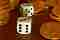
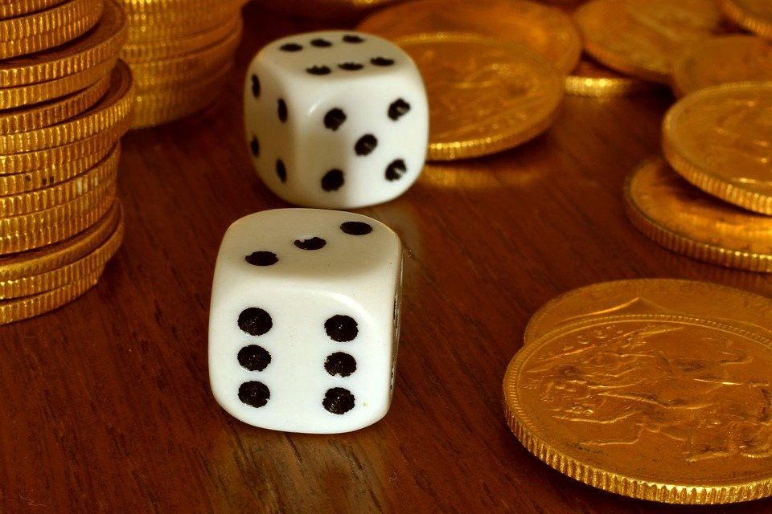

Focus on decisions, not outcomes! - Towards Data Science

# Focus on decisions, not outcomes!

## The terrible price that society pays for outcome bias

[Cassie Kozyrkov](https://towardsdatascience.com/@kozyrkov?source=post_page-----bf6e99cf5e4f----------------------)

[May 17](https://towardsdatascience.com/focus-on-decisions-not-outcomes-bf6e99cf5e4f?source=post_page-----bf6e99cf5e4f----------------------) · 3 min read

*(For added flavor, take *[*my quick quiz*](http://bit.ly/quaesita_outcomebias)* before you read on.)*

Learning is a good thing, but don’t learn the wrong lessons by misdiagnosing your mistakes. Sometimes, life throws you a random curveball you couldn’t have anticipated no matter your level of [decision](http://bit.ly/quaesita_di) genius. When that happens, adjusting your decision process is bad thinking.

Let me explain with an example.

Imagine that you’re about to observe the simultaneous flip of a fair coin and roll of a fair six-sided die. Before it happens, you are offered the choice between two gambles:

1. *Gamble on the coin, ignore the die: get $100 if it’s heads, nothing otherwise.*

2. *Gamble on the die, ignore the coin: get $100 if it’s a 6, nothing otherwise.*

Which do you choose?

Image: [SOURCE](https://pixabay.com/photos/dice-gambling-gold-pounds-game-4499089/)

The better decision appears to be the coin, which has a 1/2 chance of giving you money compared with the 1/6 chance on the die. Right? Right. If you’re motivated by the $100, it should be a no-brainer.

Now the action happens and we see the outcomes: the coin lands tails up while the die shows a 6. Dang, you should have chosen the die!

No. No, you shouldn’t have. Definitely not. That’s ***outcome bias*** and it’s a habit you should kick as soon as you can — especially if you have any hopes of being a good leader or decision-maker.

> Always evaluate decision quality based only on what was known at the time the decision was made.

If we look at outcomes, you got $0 when you could have had $100. Can we fix that? Nope, that decision is over. What should you learn from it? Nothing, I hope. Otherwise, you might choose a fair die instead of a fair coin next time. That would be a stupid choice if you like money. No matter how you slice it, 50% to win is a better gamble than 17% for the same prize.

# A menace to society

Perhaps more alarmingly, outcome bias threatens society’s ability to promote and retain competent leaders. Suppose the decision between betting on the coin and the die wasn’t yours to make. Instead, you watched [Heather](http://bit.ly/quaesita_heather) make it. Like Heather, you would have chosen the coin, but you’re not thinking about that. You’re too busy focusing on the bad outcome she got: tails+6 = missed opportunity for $100. If you’re outcome-biased, you’ll blame *her *for the outcome — forgetting that she made the decision wisely — and you’ll clamor for her to be replaced with another decision-maker who is doesn’t have bad outcomes to their name because:

- They’re less experienced than Heather, so they have a spotless track record.
- They’ve been lucky. (Look up [***survivorship bias***](https://twitter.com/quaesita/status/1233041495407636482) when you get a moment.)

Either way, you’ve just voted to shrink society’s pool of competent decision-makers, punishing Heather for randomness (***outcome***) when you should have celebrated her wise action in light of what she knew at the time (***decision***).

> Outcome bias exerts a terrible price on society.

Outcome bias exerts a terrible price on society. Our wise decision-makers are our best asset, yet many people are willing to sacrifice them as scapegoats when the real culprit is randomness. If you have reason to believe that someone’s decision process is top notch, don’t hold a bad outcome against them.

# ***Practical advice***

*When evaluating the skill of a decision-maker, ignore outcomes. Look only at what was known at the time of the decision. In our example, that was 50% versus 17% chance to win. The decision-maker chose 50%? Good. I hope they’ll choose the same way next time too.*

# Footnote

Outcome bias is not an argument about moral philosophy.*  *[*Here’s why.*](https://bit.ly/quaesita_consequentialism)

# Thanks for reading!

If you’re curious to learn about the role that outcome bias plays in perpetuating prejudice, check of the last section of my related article:

[ ## Are you a bad decision-maker?   ### The golden rule of decision analysis: avoid outcome bias    #### medium.com](https://medium.com/@kozyrkov/are-you-a-bad-decision-maker-34690deae223)