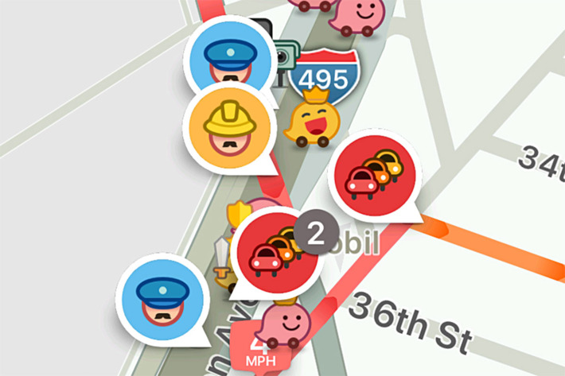

For the Good of Society — and Traffic! — Delete Your Map App

   December 11, 2017  8:00 am

# For the Good of Society — and Traffic! — Delete Your Map App

 By   [Rick Paulas](http://nymag.com/author/Rick%20Paulas/)

## Share

- [  Share](http://www.facebook.com/sharer/sharer.php?u=http://nymag.com/selectall/2017/12/waze-and-google-maps-create-traffic-in-cities.html%3Futm_source=fb%26utm_medium=s3%26utm_campaign=sharebutton-t)

- [  Tweet](https://twitter.com/share?text=For%20the%20Good%20of%20Society%20%E2%80%94%C2%A0and%20Traffic!%20%E2%80%94%C2%A0Delete%20Your%20Map%20App&url=http://nymag.com/selectall/2017/12/waze-and-google-maps-create-traffic-in-cities.html%3Futm_source=tw%26utm_medium=s3%26utm_campaign=sharebutton-t&via=selectall)

- [  Share](http://www.linkedin.com/shareArticle?mini=true%26utm_source=lin%26utm_medium=s3%26utm_campaign=sharebutton-t&url=http%3A%2F%2Fnymag.com%2Fselectall%2F2017%2F12%2Fwaze-and-google-maps-create-traffic-in-cities.html&title=For%20the%20Good%20of%20Society%20%E2%80%94%C2%A0and%20Traffic!%20%E2%80%94%C2%A0Delete%20Your%20Map%20App&summary=Cities%20and%20citizens%20alike%20are%20waging%20war%20against%20map%20apps.&source=http%3A%2F%2Fnymag.com%2Fselectall%2F2017%2F12%2Fwaze-and-google-maps-create-traffic-in-cities.html)

- [  Email](http://nymag.com/selectall/2017/12/waze-and-google-maps-create-traffic-in-cities.html?utm_source=nextdraft&utm_medium=emailmailto:?subject=For%20the%20Good%20of%20Society%20%E2%80%94%C2%A0and%20Traffic!%20%E2%80%94%C2%A0Delete%20Your%20Map%20App&body=I%20saw%20this%20on%20Select%20All%20and%20thought%20you%20might%20be%20interested...%0A%0AFor%20the%20Good%20of%20Society%20%E2%80%94%C2%A0and%20Traffic!%20%E2%80%94%C2%A0Delete%20Your%20Map%20App%0ACities%20and%20citizens%20alike%20are%20waging%20war%20against%20map%20apps.%0Ahttp%3A%2F%2Fnymag.com%2Fselectall%2F2017%2F12%2Fwaze-and-google-maps-create-traffic-in-cities.html%3Futm_source=eml%26utm_medium=e1%26utm_campaign=sharebutton-t)

- [  Comment](http://nymag.com/selectall/2017/12/waze-and-google-maps-create-traffic-in-cities.html?utm_source=nextdraft&utm_medium=email#comments)

- [  Print](#)

 

 Photo: Waze

I live on an obnoxiously quaint block in South Berkeley, California, lined with trees and two-story houses. There’s a constant stream of sidewalk joggers before and after work, and plenty of (good) dogs in the yards. Trick-or-treaters from distant regions of the East Bay invade on Halloween.

Once a week, the serenity is interrupted by the sound of a horrific car crash. Sometimes, it’s a tire screech followed by the faint dint of metal on metal. Other times, a boom stirs the neighbors outside to gawk. It’s always at the intersection of Hillegass, my block, and Ashby, one of the city’s thoroughfares. It generally happens around rush hour, when the street is clogged with cars.

It wasn’t always this way. In 2001, the city designated the street as [Berkeley’s first “bicycle boulevard,”](https://www.cityofberkeley.info/ContentDisplay.aspx?id=6748) presumably due to some combination of it being relatively free of traffic *and* its offer of a direct route from the UC Berkeley campus down into Oakland. But since that designation, another group has discovered the exploit. Here, for the hell of it, are other events that have occurred since 2001:

2005: Google Maps is launched.
2006: Waze is launched.
2009: Uber is founded.
2012: Lyft is founded.

“The phenomenon you’re experiencing is happening all over the U.S.,” says Alexandre Bayen, director of transportation studies at UC Berkeley.

Pull up a [simple Google search for “neighborhood” and “Waze,”](https://www.google.com/search?client=safari&channel=iphone_bm&source=hp&ei=spUPWomSLKKh0wKn94fABA&q=neighborhood+waze&oq=neighborhood+waze&gs_l=psy-ab.3..0i22i30k1l3.1962.4338.0.4847.20.14.0.0.0.0.325.2433.0j2j7j1.11.0....0...1.1.64.psy-ab..9.11.2622.6..0j35i39k1j0i67k1j0i131i67k1j0i20i264k1j0i10k1.192.SE4ewNaOs8Y) and you’re bombarded with local news stories about similar once-calm side streets now the host of rush-hour jams and late-night speed demons. It’s not only annoying as hell, it’s a scenario ripe for accidents; among the top causes of accidents are [driver distraction](https://www.ncbi.nlm.nih.gov/pmc/articles/PMC4435680/) (say, by looking at an app), [unfamiliarity with the street](https://books.google.com/books?hl=en&lr=&id=-RpdDgAAQBAJ&oi=fnd&pg=PA317&dq=traffic+accidents+unfamiliar&ots=7Goew29KDG&sig=yPsXgIHOmF3fEzQL50S8MFXqTcg#v=onepage&q=traffic%20accidents%20unfamiliar&f=false) (say, because an app took you down a new side street), and an increase in overall traffic.

“The root cause is the use of routing apps,” says Bayen, “but over the last two to three years, there’s the second layer of ride-share apps.”

It’s worth breaking down the layers. The first is the large number of drivers that utilize the apps, a percentage that grows by the day. In 2011, Waze had [7 million downloads](https://www.forbes.com/sites/tomiogeron/2011/10/18/waze-nabs-30m-from-kleiner-perkins-li-ka-shing-mary-meeker-to-advise/#6cb8a9a14fd6); that number climbed to [50 million by 2013](https://www.forbes.com/sites/petercohan/2013/06/11/four-reasons-for-google-to-buy-waze/#6a0b6a55726f), and [65 million in 185 countries by 2016](https://www.forbes.com/sites/petercohan/2013/06/11/four-reasons-for-google-to-buy-waze/#6a0b6a55726f). Meanwhile, Google Maps has well over [1 billion monthly users](https://techcrunch.com/2016/02/01/gmail-now-has-more-than-1b-monthly-active-users/).

The second, newer layer is the fleet of ride-share vehicles. There are [an estimated 45,000 Uber and Lyft drivers](http://www.ktvu.com/news/clogged-streets-45000-uber-and-lyft-drivers-in-san-francisco-grab-lawmakers-attention) in San Francisco, compared to 1,500 cab drivers. The two ride-sharing titans have each designed their own mapping apps — Lyft Navigation and Uber Driver — but [Navigation was built using Google Maps](https://blog.lyft.com/posts/announcing-lyft-navigation), and [Uber’s app has yet to be fully rolled out](http://mashable.com/2017/03/15/uber-driver-navigation-feature/#SCsjrjwm6qqS). (Anecdotally, I have yet to ride in a car whose driver doesn’t use Waze.) Whatever the device, it’s one dictated on concrete route efficiency, as opposed to the whims of cab drivers, who use thoroughfares or “their own” shortcuts.

All that extra traffic down previously empty streets has created an odd situation in which cities are constantly playing defense against the algorithms.

“Typically, the city or county, depending on their laws, doesn’t have a way to fight this,” says Bayen, “other than by doing infrastructure upgrades.”

Fremont, California, has lobbed some of the harshest resistance, instituting rush-hour restrictions, and adding stop signs and traffic lights at points of heavy congestion. San Francisco is considering marking designated areas where people can [be picked up or dropped off](http://money.cnn.com/2017/11/16/technology/uber-lyft-designated-pickup-spots/index.html) by ride-shares (which, hmm, [seems familiar](https://twitter.com/anildash/status/928414038161281024)). Los Angeles has tinkered [with speed bumps](http://www.lamag.com/driver/dozens-speed-humps-coming-l-streets/) and changing two-way streets into one-ways. (Berkeley has finally decided to play defense on my block by installing a warning system that will slow cars at the crash-laden intersection; it will be funded by taxpayers.)

My favorite coalition of grumps have been the residents of Takoma Park, Maryland, who actually [spent time falsifying accident reports](https://www.washingtonpost.com/local/traffic-weary-homeowners-and-waze-are-at-war-again-guess-whos-winning/2016/06/05/c466df46-299d-11e6-b989-4e5479715b54_story.html) to Waze in order to prompt the algorithm to shift the route elsewhere. But all of the actions, either infrastructure changes performed by the city or hacks by community groups, have the same intended purpose: “I will make driving through our neighborhoods more difficult, so you will not use the street,” says Jeff Ban, a professor of civil and environmental engineering at the University of Wisconsin.

Perhaps you see the problem. If cities thwart map apps and ride-share services through infrastructure changes with the intent to *slow traffic down*, it has the effect of *slowing down traffic*. So, the algorithm may tell drivers to go down another side street, and the residents who’ve been griping to the mayor may be pleased, but traffic, on the city whole, has been negatively affected, making *everyone’s* travel longer than before. “It’s nuts,” says Bayen, “but this is the reality of urban planning.”

Bayen points out that this is sort of a gigantic version of the [prisoner’s dilemma](https://www.youtube.com/watch?v=t9Lo2fgxWHw). “If everybody’s doing the selfish thing, it’s bad for society,” says Bayen. “That’s what’s happening here.” Even though the app makes the route quicker for the user, that’s only in relation to other drivers not using the app, not to their previous drives. Now, because *everyone* is using the app, *everyone’s* drive-times are longer compared to the past. “These algorithms are not meant to improve traffic, they’re meant to steer motorists to their fastest path,” he says. “They will give hundreds of people the shortest paths, but they won’t compute for the consequences of those shortest paths.”

Outside parties disrupting a city’s infrastructure is nothing new. In the past, they’d solve that problem by placing fees on whoever was the cause. If a grocery chain wants to build a supermarket, the city calculates how much extra traffic is expected, and imposes an “impact fee” for the strain caused by the extra traffic on public thoroughfares. But in the odd case of map apps and ride-shares, who gets the fee? The “disruptive” apps? The ride-share services physically clogging the streets? The users, the state, the cities themselves? Are a bunch of class-action lawsuits — like [the one directed at Waze from an Israeli suburb](http://forward.com/news/israel/356487/israelis-sue-waze-navigation-app-for-creating-neighborhood-traffic-jam/) — the future?

There is, of course, another obvious solution available that’d avoid the messy nature of fees and litigation, put the halt on city-waged infrastructure resistance, and also end the new traffic jams.

“If you make an app where some of the users’ travel time is 20 percent higher than it was before, to improve overall traffic by diverting flow, for the greater good of society,” says Bayen, “the first thing you’d do is delete it.”

## Tags:

-

- [maps](http://nymag.com/tags/maps/)
- [apps](http://nymag.com/tags/apps/)
- [uber](http://nymag.com/tags/uber/)
- [lyft](http://nymag.com/tags/lyft/)

   [Share on Facebook](http://www.facebook.com/sharer/sharer.php?u=http://nymag.com/selectall/2017/12/waze-and-google-maps-create-traffic-in-cities.html%3Futm_source=fb%26utm_medium=s3%26utm_campaign=sharebutton-b)      [Tweet this Story](https://twitter.com/share?text=For%20the%20Good%20of%20Society%20%E2%80%94%C2%A0and%20Traffic!%20%E2%80%94%C2%A0Delete%20Your%20Map%20App&url=http://nymag.com/selectall/2017/12/waze-and-google-maps-create-traffic-in-cities.html%3Futm_source=tw%26utm_medium=s3%26utm_campaign=sharebutton-b&via=selectall)