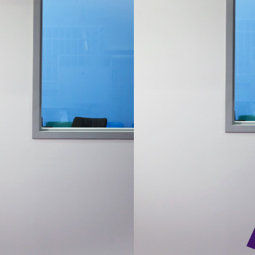

Forget X-Ray Vision. You Can See Through Walls With Radio

Forget X-Ray Vision. You Can See Through Walls With Radio

https://www.wired.com/story/forget-x-ray-vision-you-can-see-through-walls-with-radio/

Researchers at MIT, actualizers of all things science fiction, have taken a different tack to seeing through walls: radio waves.