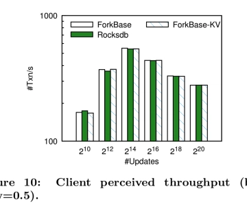

ForkBase: an efficient storage engine for blockchain and forkable applications

ForkBase: an efficient storage engine for blockchain and forkable applications

https://blog.acolyer.org/2018/06/01/forkbase-an-efficient-storage-engine-for-blockchain-and-forkable-applications/

ForkBase: an efficient storage engine for blockchain and forkable applications Wang et al., arXiv’18 ForkBase is a data storage system designed to support applications that need a combination…