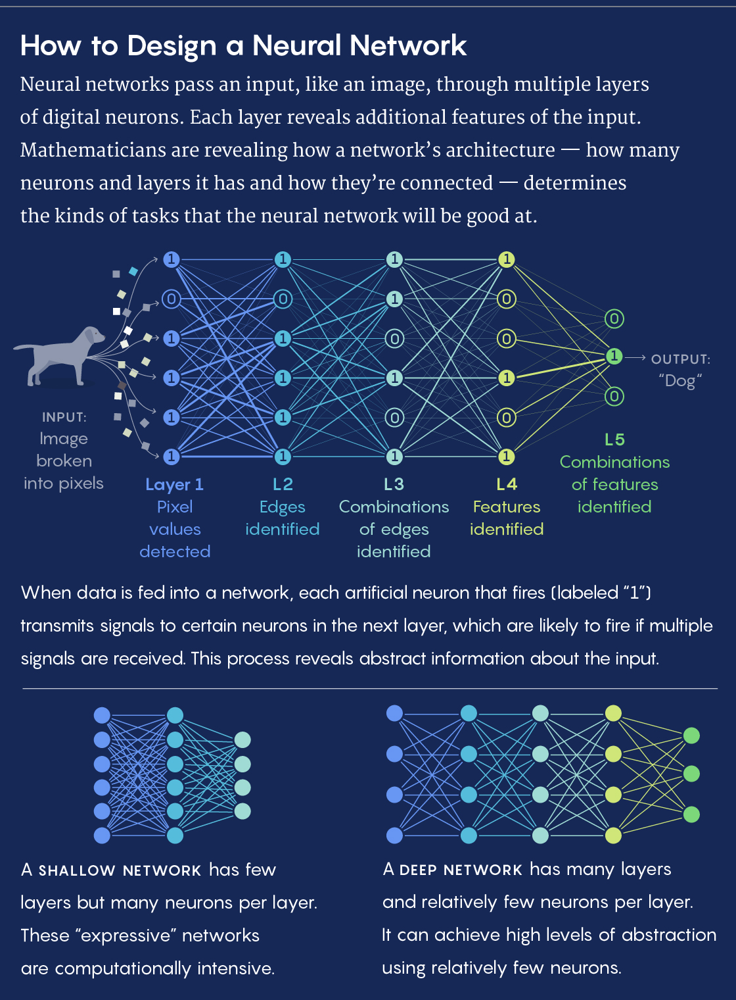

Foundations Built for a General Theory of Neural Networks | Quanta Magazine

###### [artificial intelligence](https://www.quantamagazine.org/tag/artificial-intelligence/)

# Foundations Built for a General Theory of Neural Networks

Neural networks can be as unpredictable as they are powerful. Now mathematicians are beginning to reveal how a neural network’s form will influence its function.

[ 22](https://www.quantamagazine.org/foundations-built-for-a-general-theory-of-neural-networks-20190131#comments)

[Koma Zhang](https://www.instagram.com/komaciel/) for Quanta Magazine

[     ### Kevin Hartnett  *Senior Writer*](https://www.quantamagazine.org/authors/kevin-hartnett/)

* * *

*January 31, 2019*

* * *

[View PDF/Print Mode](https://www.quantamagazine.org/foundations-built-for-a-general-theory-of-neural-networks-20190131#)

[artificial intelligence](https://www.quantamagazine.org/tag/artificial-intelligence/)[computer science](https://www.quantamagazine.org/tag/computer-science/)[machine learning](https://www.quantamagazine.org/tag/machine-learning/)[mathematics](https://www.quantamagazine.org/tag/mathematics/)[neural networks](https://www.quantamagazine.org/tag/neural-networks/)

When we design a skyscraper we expect it will perform to specification: that the tower will support so much weight and be able to withstand an earthquake of a certain strength.

But with one of the most important technologies of the modern world, we’re effectively building blind. We play with different designs, tinker with different setups, but until we take it out for a test run, we don’t really know what it can do or where it will fail.

This technology is the neural network, which underpins today’s most advanced artificial intelligence systems. Increasingly, neural networks are moving into the core areas of society: They determine what we learn of the world through our social media feeds, they help [doctors diagnose illnesses](https://svn.bmj.com/content/2/4/230), and they even [influence](https://epic.org/algorithmic-transparency/crim-justice/) whether a person convicted of a crime will spend time in jail.

Yet “the best approximation to what we know is that we know almost nothing about how neural networks actually work and what a really insightful theory would be,” said [Boris Hanin](http://www.math.tamu.edu/~bhanin/), a mathematician at Texas A&M University and a visiting scientist at Facebook AI Research who studies neural networks.

He likens the situation to the development of another revolutionary technology: the steam engine. At first, steam engines weren’t good for much more than pumping water. Then they powered trains, which is maybe the level of sophistication neural networks have reached. Then scientists and mathematicians developed a theory of thermodynamics, which let them understand exactly what was going on inside engines of any kind. Eventually, that knowledge took us to the moon.

“First you had great engineering, and you had some great trains, then you needed some theoretical understanding to go to rocket ships,” Hanin said.

Within the sprawling community of neural network development, there is a small group of mathematically minded researchers who are trying to build a theory of neural networks — one that would explain how they work and guarantee that if you construct a neural network in a prescribed manner, it will be able to perform certain tasks.

This work is still in its very early stages, but in the last year researchers have produced several papers which elaborate the relationship between form and function in neural networks. The work takes neural networks all the way down to their foundations. It shows that long before you can certify that neural networks can drive cars, you need to prove that they can multiply.

## The Best Brain Recipe

Neural networks aim to mimic the human brain — and one way to think about the brain is that it works by accreting smaller abstractions into larger ones. Complexity of thought, in this view, is then measured by the range of smaller abstractions you can draw on, and the number of times you can combine lower-level abstractions into higher-level abstractions — like the way we learn to distinguish dogs from birds.

“For a human, if you’re learning how to recognize a dog you’d learn to recognize four legs, fluffy,” said [Maithra Raghu](http://maithraraghu.com/), a doctoral student in computer science at Cornell University and a member of [Google Brain](https://ai.google/research/teams/brain). “Ideally we’d like our neural networks to do the same kinds of things.”

Maithra Raghu, a member of Google Brain, has been identifying principles that explain how neural networks operate.

Arun Chaganty

Abstraction comes naturally to the human brain. Neural networks have to work for it. As with the brain, neural networks are made of building blocks called “neurons” that are connected in various ways. (The neurons in a neural network are inspired by neurons in the brain but do not imitate them directly.) Each neuron might represent an attribute, or a combination of attributes, that the network considers at each level of abstraction.

When joining these neurons together, engineers have many choices to make. They have to decide how many layers of neurons the network should have (or how “deep” it should be). Consider, for example, a neural network with the task of recognizing objects in images. The image enters the system at the first layer. At the next layer, the network might have neurons that simply detect edges in the image. The next layer combines lines to identify curves in the image. Then the next layer combines curves into shapes and textures, and the final layer processes shapes and textures to reach a conclusion about what it’s looking at: woolly mammoth!

“The idea is that each layer combines several aspects of the previous layer. A circle is curves in many different places, a curve is lines in many different places,” said [David Rolnick](https://scholar.google.com/citations?user=P_luG3cAAAAJ&hl=en), a mathematician at the University of Pennsylvania.

Engineers also have to decide the “width” of each layer, which corresponds to the number of different features the network is considering at each level of abstraction. In the case of image recognition, the width of the layers would be the number of types of lines, curves or shapes it considers at each level.

Beyond the depth and width of a network, there are also choices about how to connect neurons within layers and between layers, and how much weight to give each connection.

So if you have a specific task in mind, how do you know which neural network architecture will accomplish it best? There are some broad rules of thumb. For image-related tasks, engineers typically use “convolutional” neural networks, which feature the same pattern of connections between layers repeated over and over. For natural language processing — like speech recognition, or language generation — engineers have found that “recurrent” neural networks seem to work best. In these, neurons can be connected to non-adjacent layers.

Lucy Reading-Ikkanda/Quanta Magazine

Beyond those general guidelines, however, engineers largely have to rely on experimental evidence: They run 1,000 different neural networks and simply observe which one gets the job done.

“These choices are often made by trial and error in practice,” Hanin said. “That’s sort of a tough [way to do it] because there are infinitely many choices and one really doesn’t know what’s the best.”

A better approach would involve a little less trial and error and a little more upfront understanding of what a given neural network architecture gets you. A few papers published recently have moved the field in that direction.

“This work tries to develop, as it were, a cookbook for designing the right neural network. If you know what it is that you want to achieve out of the network, then here is the recipe for that network,” Rolnick said.

## To Rope a Red Sheep

One of the earliest important theoretical guarantees about neural network architecture came three decades ago. In 1989, computer scientists proved that if a neural network has only a single computational layer, but you allow that one layer to have an unlimited number of neurons, with unlimited connections between them, the network will be capable of performing any task you might ask of it.

It was a sweeping statement that turned out to be fairly intuitive and not so useful. It’s like saying that if you can identify an unlimited number of lines in an image, you can distinguish between all objects using just one layer. That may be true in principle, but good luck implementing it in practice.

Researchers today describe such wide, flat networks as “expressive,” meaning that they’re capable in theory of capturing a richer set of connections between possible inputs (such as an image) and outputs (such as descriptions of the image). Yet these networks are extremely difficult to train, meaning it’s almost impossible to teach them how to actually produce those outputs. They’re also more computationally intensive than any computer can handle.

Boris Hanin, a mathematician at Texas A&M University, has studied the tradeoff between depth and width in neural networks.

Intel AI One Tree Studio

More recently, researchers have been trying to understand how far they can push neural networks in the other direction — by making them narrower (with fewer neurons per layer) and deeper (with more layers overall). So maybe you only need to pick out 100 different lines, but with connections for turning those 100 lines into 50 curves, which you can combine into 10 different shapes, which give you all the building blocks you need to recognize most objects.

In a [paper](https://arxiv.org/abs/1705.05502) completed last year, Rolnick and [Max Tegmark](http://web.mit.edu/physics/people/faculty/tegmark_max.html) of the Massachusetts Institute of Technology proved that by increasing depth and decreasing width, you can perform the same functions with exponentially fewer neurons. They showed that if the situation you’re modeling has 100 input variables, you can get the same reliability using either 2100 neurons in one layer or just 210 neurons spread over two layers. They found that there is power in taking small pieces and combining them at greater levels of abstraction instead of attempting to capture all levels of abstraction at once.

“The notion of depth in a neural network is linked to the idea that you can express something complicated by doing many simple things in sequence,” Rolnick said. “It’s like an assembly line.”

Rolnick and Tegmark proved the utility of depth by asking neural networks to perform a simple task: multiplying polynomial functions. (These are just equations that feature variables raised to natural-number exponents, for example *y* = *x*3 + 1.) They trained the networks by showing them examples of equations and their products. Then they asked the networks to compute the products of equations they hadn’t seen before. Deeper neural networks learned the task with far fewer neurons than shallower ones.

And while multiplication isn’t a task that’s going to set the world on fire, Rolnick says the paper made an important point: “If a shallow network can’t even do multiplication then we shouldn’t trust it with anything else.”

David Rolnick, a mathematician at the University of Pennsylvania, proved that increasing a network’s depth allowed a network to accomplish tasks with exponentially fewer neurons.

[Stephanie Ku](http://slaiku.com/)

Other researchers have been probing the minimum amount of width needed. At the end of September, [Jesse Johnson](http://www.jessejohnson.me/), formerly a mathematician at Oklahoma State University and now a researcher with the pharmaceutical company Sanofi, proved that at a certain point, [no amount of depth can compensate for a lack of width](https://arxiv.org/abs/1810.00393).

To get a sense of his result, imagine sheep in a field, except these are punk-rock sheep: Their wool has been dyed one of several colors. The task for your neural network is to draw a border around all sheep of the same color. In spirit, this task is similar to image classification: The network has a collection of images (which it represents as points in higher-dimensional space), and it needs to group together similar ones.

Johnson proved that a neural network will fail at this task when the width of the layers is less than or equal to the number of inputs. So for our sheep, each can be described with two inputs: an *x* and a *y* coordinate to specify its position in the field. The neural network then labels each sheep with a color and draws a border around sheep of the same color. In this case, you will need three or more neurons per layer to solve the problem.

More specifically, Johnson showed that if the width-to-variable ratio is off, the neural network won’t be able to draw closed loops — the kind of loops the network would need to draw if, say, all the red sheep were clustered together in the middle of the pasture. “If none of the layers are thicker than the number of input dimensions, there are certain shapes the function will never be able to create, no matter how many layers you add,” Johnson said.

### Related:

* * *

1. 1 "."

##### [Machine Learning Confronts the Elephant in the Room](https://www.quantamagazine.org/machine-learning-confronts-the-elephant-in-the-room-20180920/)

2. 2 "."

##### [New AI Strategy Mimics How Brains Learn to Smell](https://www.quantamagazine.org/new-ai-strategy-mimics-how-brains-learn-to-smell-20180918/)

3. 3 "."

##### [Mapping the Brain to Build Better Machines](https://www.quantamagazine.org/mapping-the-brain-to-build-better-machines-20160406/)

Papers like Johnson’s are beginning to build the rudiments of a theory of neural networks. At the moment, researchers can make only very basic claims about the relationship between architecture and function — and those claims are in small proportion to the number of tasks neural networks are taking on.

So while the theory of neural networks isn’t going to change the way systems are built anytime soon, the blueprints are being drafted for a new theory of how computers learn — one that’s poised to take humanity on a ride with even greater repercussions than a trip to the moon.

### Share this article

[ ![](data:image/svg+xml,%3csvg xmlns='http://www.w3.org/2000/svg' class='absolute fit-x mxa c-1a1a1a js-evernote-checked' x='0px' y='0px' viewBox='0 0 50 50' enable-background='new 0 0 50 50' xml:space='preserve' data-reactid='303' data-evernote-id='212'%3e%3cg data-reactid='304' data-evernote-id='649' class='js-evernote-checked'%3e%3c!-- react-text: 305 --%3e %3c!-- /react-text --%3e%3cpath fill='currentColor' d='M20.6%2c38.5c-0.8%2c0-1.6%2c0.3-2.2%2c0.8L16%2c41.9c-1.1%2c1-2.4%2c1.6-3.9%2c1.6c-1.5%2c0-2.8-0.5-3.9-1.6c-0.5-0.5-0.9-1.1-1.2-1.8 c-0.3-0.7-0.4-1.4-0.4-2.1c0-0.7%2c0.1-1.4%2c0.4-2.1c0.3-0.7%2c0.7-1.2%2c1.2-1.8l9.1-9c1-0.9%2c2.2-1.8%2c3.8-2.7s3-0.7%2c4.3%2c0.7 c0.6%2c0.6%2c1.3%2c0.8%2c2.2%2c0.8s1.5-0.3%2c2.1-0.9c0.6-0.6%2c0.9-1.3%2c0.9-2.2s-0.3-1.6-0.9-2.2c-2.2-2.2-4.8-3.1-7.8-2.7 c-3%2c0.4-5.9%2c2-8.8%2c4.8l-9.2%2c9c-1.1%2c1.1-1.9%2c2.4-2.5%2c3.8C0.7%2c35%2c0.4%2c36.5%2c0.4%2c38c0%2c1.6%2c0.3%2c3%2c0.9%2c4.4c0.6%2c1.4%2c1.4%2c2.7%2c2.5%2c3.8 c1.1%2c1.1%2c2.4%2c2%2c3.8%2c2.5c1.4%2c0.6%2c2.9%2c0.8%2c4.4%2c0.8s2.9-0.3%2c4.3-0.8c1.4-0.6%2c2.7-1.4%2c3.8-2.5l2.5-2.5c0.6-0.6%2c0.9-1.3%2c0.9-2.1 s-0.3-1.6-0.9-2.2C22.1%2c38.8%2c21.4%2c38.5%2c20.6%2c38.5z' data-reactid='306' data-evernote-id='650' class='js-evernote-checked'%3e%3c/path%3e%3c!-- react-text: 307 --%3e %3c!-- /react-text --%3e%3cpath fill='currentColor' d='M48.7%2c7.9c-0.6-1.4-1.4-2.7-2.5-3.8c-2.4-2.4-5.1-3.6-8-3.7c-3-0.1-5.5%2c0.9-7.7%2c3.1l-3.1%2c3.1c-0.6%2c0.6-0.9%2c1.3-0.9%2c2.1 s0.3%2c1.6%2c0.9%2c2.2s1.3%2c0.9%2c2.2%2c0.9s1.6-0.3%2c2.2-0.8l3.1-3.1c1.2-1.1%2c2.4-1.5%2c3.7-1.3c1.3%2c0.3%2c2.5%2c0.9%2c3.4%2c1.9 c0.5%2c0.5%2c0.9%2c1.1%2c1.2%2c1.8c0.3%2c0.7%2c0.4%2c1.4%2c0.4%2c2.1c0%2c0.7-0.1%2c1.4-0.4%2c2.1c-0.3%2c0.7-0.7%2c1.2-1.2%2c1.8l-9.7%2c9.6 c-2.2%2c2.2-3.9%2c3.1-5.1%2c2.7s-2-0.8-2.4-1.3c-0.6-0.6-1.3-0.8-2.2-0.8s-1.5%2c0.3-2.1%2c0.9c-0.6%2c0.6-0.9%2c1.3-0.9%2c2.2s0.3%2c1.5%2c0.9%2c2.1 c1%2c1%2c2.1%2c1.8%2c3.2%2c2.3s2.4%2c0.7%2c3.6%2c0.7c1.5%2c0%2c3-0.4%2c4.6-1.1c1.6-0.7%2c3.1-1.9%2c4.6-3.4l9.8-9.6c1.1-1.1%2c1.9-2.4%2c2.5-3.8 c0.6-1.4%2c0.9-2.9%2c0.9-4.4C49.6%2c10.8%2c49.3%2c9.3%2c48.7%2c7.9z' data-reactid='308' data-evernote-id='651' class='js-evernote-checked'%3e%3c/path%3e%3c!-- react-text: 309 --%3e %3c!-- /react-text --%3e%3c/g%3e%3c/svg%3e)](https://www.quantamagazine.org/foundations-built-for-a-general-theory-of-neural-networks-20190131#0)[ ](https://www.quantamagazine.org/foundations-built-for-a-general-theory-of-neural-networks-20190131mailto:?subject=Foundations%20Built%20for%20a%20General%20Theory%20of%20Neural%20Networks&body=Neural%20networks%20can%20be%20as%20unpredictable%20as%20they%20are%20powerful.%20Now%20mathematicians%20are%20beginning%20to%20reveal%20how%20a%20neural%20network%E2%80%99s%20form%20will%20influence%20its%20function.%0A%0Ahttps://www.quantamagazine.org/foundations-built-for-a-general-theory-of-neural-networks-20190131/)

[ ![](data:image/svg+xml,%3csvg xmlns='http://www.w3.org/2000/svg' class='absolute fit-x mxa c-1a1a1a js-evernote-checked' viewBox='0 0 30 30' enable-background='new 0 0 30 30' data-reactid='325' data-evernote-id='215'%3e%3cpath fill='currentColor' d='M9.1%2c11v9.4h2.5c0.2%2c0%2c0.3-0.1%2c0.3-0.3c0%2c0%2c0%2c0%2c0%2c0v-9.2H9.3C9.2%2c10.8%2c9.1%2c10.9%2c9.1%2c11z' data-reactid='326' data-evernote-id='662' class='js-evernote-checked'%3e%3c/path%3e%3cpath fill='currentColor' d='M11.9%2c8.8V7.1H9.3C9.2%2c7.1%2c9%2c7.2%2c9%2c7.4c0%2c0%2c0%2c0%2c0%2c0v1.7h2.5c0.2%2c0%2c0.3-0.1%2c0.4-0.3C11.9%2c8.9%2c11.9%2c8.9%2c11.9%2c8.8 z' data-reactid='327' data-evernote-id='663' class='js-evernote-checked'%3e%3c/path%3e%3cpath fill='currentColor' d='M13.4%2c11v9.3h4.8v1.3h-4.4c-0.2%2c0-0.3%2c0.1-0.3%2c0.3c0%2c0%2c0%2c0%2c0%2c0v1.7h7.2c0.2%2c0%2c0.3-0.1%2c0.3-0.3c0%2c0%2c0%2c0%2c0-0.1 V10.7h-7.2C13.5%2c10.7%2c13.4%2c10.8%2c13.4%2c11C13.4%2c11%2c13.4%2c11%2c13.4%2c11z M16.1%2c13.1c0-0.2%2c0.1-0.3%2c0.3-0.3c0%2c0%2c0%2c0%2c0%2c0h1.7V18 c0%2c0.2-0.1%2c0.3-0.3%2c0.3c0%2c0%2c0%2c0%2c0%2c0h-1.7V13.1z' data-reactid='328' data-evernote-id='664' class='js-evernote-checked'%3e%3c/path%3e%3cpath fill='currentColor' d='M22.7%2c10.7c-0.2%2c0-0.3%2c0.1-0.3%2c0.3c0%2c0%2c0%2c0%2c0%2c0v9.3h4.8v1.3h-4.5c-0.2%2c0-0.3%2c0.1-0.3%2c0.3c0%2c0%2c0%2c0%2c0%2c0v1.7h7.3 c0.2%2c0%2c0.3-0.1%2c0.3-0.3c0%2c0%2c0%2c0%2c0%2c0V10.7H22.7z M27.2%2c18c0%2c0.2-0.1%2c0.3-0.3%2c0.4c0%2c0%2c0%2c0%2c0%2c0h-1.7v-5.2c0-0.2%2c0.1-0.3%2c0.3-0.3 c0%2c0%2c0%2c0%2c0%2c0h1.7V18z' data-reactid='329' data-evernote-id='665' class='js-evernote-checked'%3e%3c/path%3e%3cpath fill='currentColor' d='M5.1%2c7.1c-0.2%2c0-0.3%2c0.1-0.3%2c0.3c0%2c0%2c0%2c0%2c0%2c0v3.3H0.3C0.1%2c10.7%2c0%2c10.8%2c0%2c11c0%2c0%2c0%2c0%2c0%2c0v9.3h7.2 c0.2%2c0%2c0.3-0.1%2c0.3-0.3c0%2c0%2c0%2c0%2c0%2c0V7.1L5.1%2c7.1z M4.8%2c18c0%2c0.2-0.1%2c0.3-0.3%2c0.3c0%2c0%2c0%2c0%2c0%2c0H2.7v-5.2c0-0.2%2c0.1-0.3%2c0.3-0.3 c0%2c0%2c0%2c0%2c0%2c0h1.7L4.8%2c18z' data-reactid='330' data-evernote-id='666' class='js-evernote-checked'%3e%3c/path%3e%3c/svg%3e)](http://digg.com/submit?url=https://www.quantamagazine.org/foundations-built-for-a-general-theory-of-neural-networks-20190131/)

* * *

### Newsletter

*Get Quanta Magazine delivered to your inbox*

[(L)](https://www.quantamagazine.org/foundations-built-for-a-general-theory-of-neural-networks-20190131#newsletter)

[Most recent newsletter](http://us1.campaign-archive2.com/home/?u=0d6ddf7dc1a0b7297c8e06618&id=f0cb61321c)