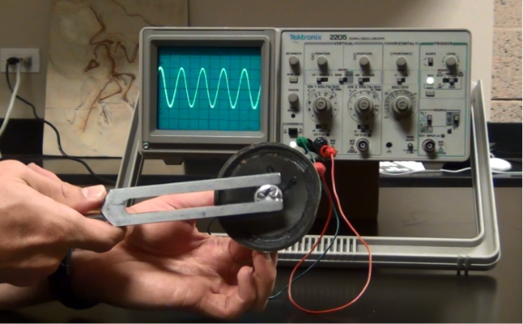
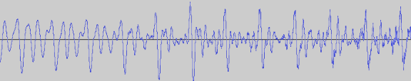
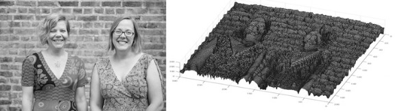
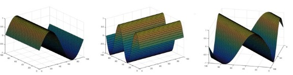
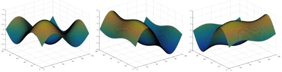
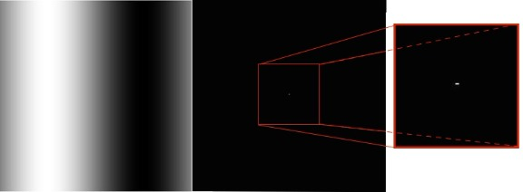
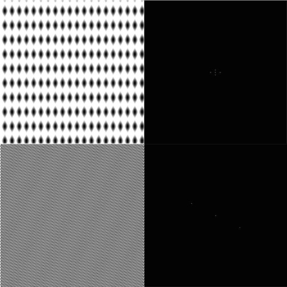
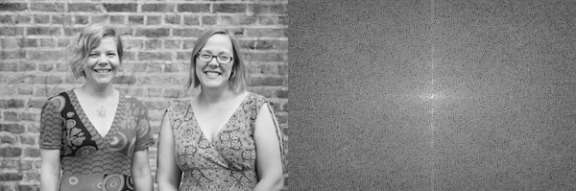
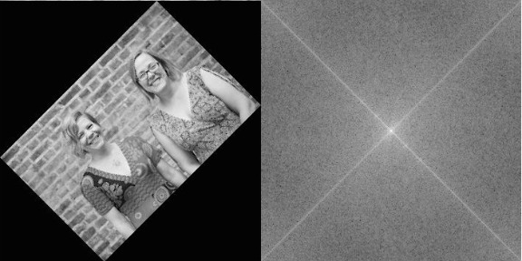

Fourier transforms of images | plus.maths.org

# Fourier transforms of images

The sounds we hear – whether music, speech, or background noise – are the result of vibrations of our ear drum, stimulated by sound waves travelling through the air, created by our headphones, musical instruments, people's voice boxes, or that annoying person behind you in the cinema opening their sweets. These vibrations can be plotted (the intensity, or pressure, of the wave plotted over time) giving us a visual representation of the sound.

The sound wave from a tuning fork (top), compared with that of human speech (bottom).

The sound wave of the middle A on a tuning fork, is a perfect example of a *sine wave*, written mathematically as *sin(x)*. The sound wave of speech is more complicated. But any sound wave, indeed any repeating function, can be broken up into a number of sine waves of various frequencies and amplitudes (intensities). This is the result of work that started with the French mathematician, Joseph Fourier, who lived through the French revolution in the eighteenth century. The expression of a sound wave, or any signal varying over time, as the sum of its constituent sine waves, is known as the *Fourier transform* of that signal. (You can read a more detailed explanation of the maths involved [here](https://plus.maths.org/content/os/issue47/features/budd/maths)– the maths is quite complicated but the mathematical ideas involved are lovely!)

The function *f* varies in time – representing a sound wave. The Fourier transform process takes *f* and decomposes it into its constituent sine waves, with particular frequencies and amplitudes. The Fourier transform is represented as spikes in the frequency domain, the height of the spike showing the amplitude of the wave of that frequency.

You can also think of an image as a varying function, however, rather than varying in time it varies across the two-dimensional space of the image. In a grey scale digital image the pixels each have a value between 0 and 255 representing the darkness of that pixel. So the darkness, or intensity, of that pixel, is a function of the horizontal and vertical coordinates giving the location of that pixel. You can think of the image as an undulating landscape, with the height of the landscape given by the value of the pixel.

A digital photograph of the *Plus* editors, each pixel has a value between 0 and 255, representing the greyness of that pixel. And on the right, the image function of the same digital photograph is shown, with the grey value *u(x, y)* plotted as the height of the surface over the *(x, y)*-plane.

Images can also be expressed as a sum of sine waves, but this time, instead of one-dimensional waves, they are waves that vary in two-dimensions, like ripples on a sheet.

Two-dimensional sine waves are written as
*z = a sin(hx+ky)*

where *x* and *y* give the coordinates for points on the "sheet", *z* is the height, or intensity, of the wave at that point, *a* gives the amplitude (the maximum height) of the wave, and *h* and *k* give the number of times the wave repeats in the *x* and *y* directions respectively (they are the *x* and *y* frequencies).

The waves *sin(x), sin(2y)* and *sin(x+y)*.

When *k=0*, the sine wave only fluctuates along the *x*-axis. When *h=0*, it only fluctuates along the *y*-axis. But if both *k*and *h* are nonzero, the sine wave moves diagonally across the sheet, with the waves travelling in direction (perpendicular to wave fronts) angled with the slope*h/k*.

Adding these waves together just involves adding the respective values, or heights, of the waves at each pixel. The waves can constuctively interfere creating a final wave with a higher value at that point. And the waves can destructively interfere and cancel out. If the amplitude of one of the constituent waves is much larger than the others, it will dominate.

The waves *sin(x)+sin(y), 5sin(x)+sin(y)* and *sin(x)+5sin(y)*. You can see how the larger amplitude wave – *5sin(x)* in the middle image and *5sin(y)* in the image on the right – dominate the resulting wave.

The Fourier transform of an image breaks down the image function (the undulating landscape) into a sum of constituent sine waves. Just as for a sound wave, the Fourier transform is plotted against frequency. But unlike that situation, the frequency space has two dimensions, for the frequencies*h* and *k*of the waves in the *x* and *y* dimensions. So it is plotted not as a series of spikes, but as an image with (roughly) the same dimensions in pixels as the original image.

Each pixel in the Fourier transform has a coordinate (*h*,*k*) representing the contribution of the sine wave with *x*-frequency *h*, and*y*-frequency *k* in the Fourier transform. The centre point represents the (0,0) wave – a flat plane with no ripples – and its intensity (its brightness in colour in the grey scale) is the average value of the pixels in the image. The points to the left and right of the centre, represent the sine waves that vary along the *x*-axis, (ie *k=0*). The brightness of these points represent the intensity of the sine wave with that frequency in the Fourier transform (the intensity is the amplitude of the sine wave, squared). Those vertically above and below the centre point represent those sine waves that vary in *y*, but remain constant in *x* (ie *h=0*). And the other points in the Fourier transform represent the contributions of the diagonal waves.

The wave *sin(x)* represented as a grayscale image, and the Fourier transform of that image.

For example, consider the image above, on the left. This is the two-dimensional wave *sin(x)* (which we saw earlier) viewed as a grayscale image. Next to it is the Fourier transform of this grayscale image. It has the same dimensions in pixels as the original, and is entirely black except for a few bright pixels at the very centre. If we zoom into the centre of the Fourier transform (which you can see above, on the right) you can see there are exactly three pixels which are not black. One is the bright centre point, with coordinates (0,0), representing the contribution of the (0,0) wave to the image. The bright pixel on either side, with coordinates (1,0) and its reflection (-1,0), represents the contribution of the (1,0) wave (the sine wave in our original image). All the rest of the pixels in the Fourier transform are black, as the original image is exactly described using just the original (1,0) wave.

Top: The wave *sin(20x)+sin(10y)* and its Fourier transform, showing two pairs of bright pixels (at the coordinates (20,0) and (0,10) and their reflections) representing these contributions of these two waves.

Bottom: The wave *sin(100x+50y)* and its Fourier transform, showing just the pair of bright pixels at the coordinates (100,50) and its reflection.

The Fourier transforms of simple combinations of waves have only a few bright spots. But for more complex images, such as digital photos, there are many many bright spots in its Fourier transform, as it takes many waves to express the image.

In the Fourier transform of many digital photos we'd normally take, there is often a strong intensity along the *x* and *y* axis of the Fourier transform, showing that the sine waves that only vary along these axes play a big part in the final image. This is because there are many horizontal or vertical features and symmetries in the world around us – walls, table tops, even bodies are symmetrical around the vertical axes. You can see this by rotating an image a little (say by 45%). Then its Fourier transform will have a strong intensity along a pair of perpendicular lines that are rotated by the same amount.

*Plus* editors and their Fourier transform, showing a series of contributions of vertical wave represented by bright points along the vertical axis.

The *Plus* editors rotated by 45 degrees, and their Fourier transform.

Fourier transforms are incredibly useful tools for the analysis and manipulation of sounds and images. In particular for images, it's the mathematical machinery behind image compression (such as the JPEG format), filtering images and reducing blurring and noise.

*The images of 2D sine waves, surfaces and Fourier transforms were made in [MATLAB](https://uk.mathworks.com/products/matlab.html) – in case you'd like to try it yourself you can see the commands we used [here](https://plus.maths.org/content/sites/plus.maths.org/files/articles/2017/carola/MATLAB.TXT).*

### About this article

[Rachel Thomas](https://plus.maths.org/content/people/index.html#rachel) is Editor of *Plus*.