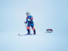
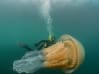
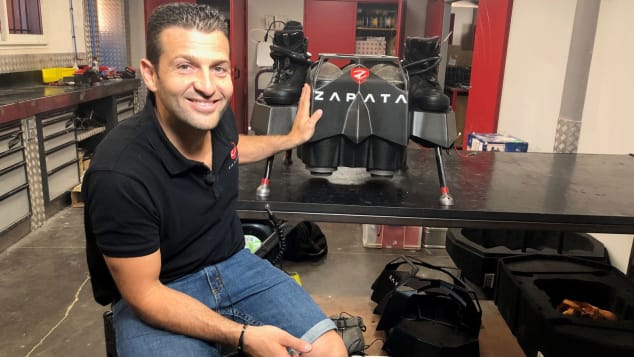
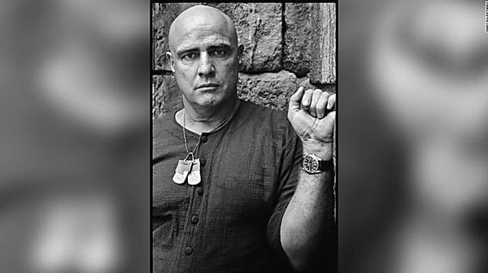

French inventor whose flying board wowed the world

[Play](https://edition.cnn.com/travel/play)

# French inventor whose flying board wowed the world

Saskya Vandoorne and Melissa Bell, CNN • Updated 17th July 2019
FacebookTwitterEmail



Up next

Franky Zapata, inventor of the flying board which wowed Paris
02:46

The accidental Antarctic record-breaker
04:22

These are the top cruise destinations in the world
02:04

Japan seniors travel the world through VR
01:37

Spotted: A giant jellyfish the size of a human
01:01

Paris pastry tour with chef Nina Metayer
02:31

'Bent Pyramid' opens for first time in more than 50 years
01:28

Can you stand the 9 inversions on this new coaster?
01:51

How many UNESCO World Heritage sites are there?
01:55

Record-breaking coaster opening near Chicago
01:16

(CNN) — Franky Zapata has been driven by a single dream since he was little: being able to fly. Not in an airplane, he says, since the windows function like a screen, but like a bird.

As the French inventor and entrepreneur was born colorblind, that ruled out learning to fly helicopters. So after several years spent racing jet skis, he invented hydrojets which allowed him to at least hover above the water.

Sponsor content by Thailand Board of Investment

How this country is targeting sustainability

Inside the plan to transform the Thai economy and tackle climate change.

Then improvements in technology allowed him to go further, cutting the hydrojet from its tether and taking to the air.

"When you fly with your body," says Zapata, "even your hands affect the direction you want to go in. You feel the turbulence and the air through your fingers. It's like becoming a bird. But it's also very hard. I have to fight against the wind with my legs so there's pain too. It's not as peaceful as it looks."

Last Sunday the 40-year-old former jet-ski champion took to the skies above [Paris](https://cnn.com/travel/destinations/paris) at the Bastille day parade, capturing the world's imagination with a board that can reach an altitude of nearly 500 feet -- with the potential to go much higher -- and a speed of 140 kilometers per hour.

### 'The best thing is the freedom'

Zapata's next mission is to fly over the English channel.
Saskya Vandoorne

Back in his workshop near Marseille, Zapata says while he enjoys showing his creation off to a crowd what he really loves is flying alone.

"It's amazing when I'm flying around the Arizona desert, through the mountains. That's why I built this machine," he says. "In my heart the best thing is the freedom".

Already, the father of one has worked with the US and French militaries, with the French investing 1.4 million dollars in tests of the board.

"If the question is do I think I will sell this to special forces all over the world, the answer is yes. When? I don't know," says Zapata.

Zapata spent three years creating Flyboard Air, a jet-powered personal aerial vehicle. The key he says, was being able to place five turbine engines over conventional electric propellers to allow intuitive flight controls designed around the human body.

As for commercial uses, he says that regulations need to be worked out and safety issues looked at before the technology can be put to wider, recreational use.

Related content

[A man on a flying board soars above Bastille Day crowds in Paris](https://edition.cnn.com/2019/07/14/europe/flyboard-bastille-day/index.html)

### 'Flying machine'

"The problem with this machine is if you're not calm you can break your neck," Zapata says. "You have to be focused. It's not a skateboard. It's a flying machine."

For now what thrills Zapata though is just being able to fly.

"If you want to build a flying machine you need to want to fly," he says. "You can't be chasing fame or money. You have to have that crazy dream to justify spending all that money on something that only you believe in".

Zapata's next "crazy dream" is to fly from France to England with his Flyboard Air to mark the 110th anniversary of the first crossing of the English Channel.

If he succeeds, the ride will blow away his previous record when he traveled 2,200 meters in the south of France in 2016.

The crossing would require Zapata to refuel several times but it would offer him what he craves, a real bird's eye view of the channel.

"It'll be the flight of my life", he says.

[A year of the world'sBest BeachesThere's a perfect beach for every week of the year. Join us on a 12-month journey to see them all Go to the best beaches    ](https://www.cnn.com/interactive/travel/best-beaches)

Advertisement

More from CNN

- [

 [eyJpdSI6IjE2OWUxNDQxYTg3NzNjMjVhZDE1N2YxYWIwMTBmYjliMmRjYjFkYmQxZWRiYjM5MzFhZmM0NWRhZTk0NmU4MDUiLCJ3Ijo0MDAsImgiOjIyNCwiZCI6MS41LCJjcyI6MCwiZiI6NH0.webp](../_resources/8d96ff11cf520b1be0c429a5d47853a2.webp)    A man on a flying board soars above Bastille Day crowds in Paris](http://edition.cnn.com/2019/07/14/europe/flyboard-bastille-day/index.html?obOrigUrl=true)

- [

 [eyJpdSI6ImE3YjY1ZjdlNjA1NGEwMGQ2NWY3ODEwODAxZjE0YzE3YzFmMWE3MWQ4MWEwNjdmNzI5ZDNjZGYzZmM0YjkyYjIiLCJ3Ijo0MDAsImgiOjIyNCwiZCI6MS41LCJjcyI6MCwiZiI6NH0.webp](../_resources/c8e42f5adc1252aab07972fd612b23eb.webp)    A small plane crashed into the Atlantic Ocean…](http://edition.cnn.com/2019/07/17/us/plane-crash-ocean-video-trnd/index.html?obOrigUrl=true)

- [

 [eyJpdSI6ImE2NjExMzNlMjZjMmYwNWE4MDRhMjIyNzEwYzU3NjM1MmU0NzU0NjliZjQwNGVkZGNlNzFiOWY1OGJmNzBmZjkiLCJ3Ijo0MDAsImgiOjIyNCwiZCI6MS41LCJjcyI6MCwiZiI6NH0.webp](../_resources/a1275a9edbc74449b6522b66a808eac3.webp)    How did Kim get his Mercedes-Benzes? New…](http://edition.cnn.com/style/article/north-korea-luxury-vehicles-intl-hnk/index.html?obOrigUrl=true)

- [

 [eyJpdSI6ImY1OGE2MzQzZjk1M2VhZTMyYWQ1YjM0NGIyZjk0MjZhZjNhNDk4ZmMwNzk2NWY5NTkzMjQ4OWQ0ZDI4MDlhZTYiLCJ3IjoyMDAsImgiOjExMywiZCI6MS41LCJjcyI6MCwiZiI6NH0.webp](../_resources/624d197a3de0aacf7f7fda473514cf76.webp)    There's a reason the pastry in Paris is so darn good](http://edition.cnn.com/travel/article/best-pastry-shops-paris/index.html?obOrigUrl=true)

- [       Marlon Brando's watch from 'Apocalypse…](http://edition.cnn.com/style/article/watch-marlon-brando-intl-scli/index.html?obOrigUrl=true)

[(L)](https://www.outbrain.com/what-is/default/en)

Paid Content

- [

 [eyJpdSI6IjJlYWJkMTYxN2NjNDIzY2QwNTY4NzQ1NDFlYzBmYjM2NDY2MzY1YzZkNzYwN2Y3YTQ0YzA2ZTUxZTk1OTJhM2EiLCJ3Ijo0MDAsImgiOjIyNiwiZCI6MS41LCJjcyI6MCwiZiI6NH0.webp](../_resources/1fe933ed79695492d510a35c2043cbe1.webp)    Chiropractors Baffled: Simple Stretch Relieves Years of Back Pain (Try Tonight)  *healthtoday.online*](https://adoclk.com/www/delivery/clk.php?zoneid=18851&pub_clickid=$ob_click_id$&pub_siteid=001e875570ccd795a83820ef8152da2e00|006302a749e40512481e10a139d62f9b6e|$section_id$&obOrigUrl=true)

- [

 [eyJpdSI6IjVhMTM4NDQ5MWM1Y2ZmZTExMGRiZWY1NmFjMDE5ZmUyZmNhZDg4YTQ1ZTVlZDYzOWE0NDE0NDQ4YmZhYmYxNjkiLCJ3Ijo0MDAsImgiOjIyNCwiZCI6MS41LCJjcyI6MCwiZiI6NH0.webp](../_resources/2f083a7868418eda0e188aa1158cab07.webp)    A Paris Canal Was Drained After 200 Years. These Photos Show What They Found  *KnowledgeDish*](https://knowledgedish.com/you-wont-believe-what-was-found-after-this-200-year-old-canal-was-drained/?utm_source=outbrain&utm_campaign=uk-dt-kdsh-canal-t1chng-ob&utm_medium=$publisher_name$&utm_content=A+Paris+Canal+Was+Drained+After+200+Years.+These+Photos+Show+What+They&utm_term=$section_name$&layout=gallery&lp=1&obOrigUrl=true)

- [

 [eyJpdSI6Ijk1M2FmMTRmODYwMWE5MGM1NDhkNDk5MGU1ZjNiNTNkN2ExOTNjZGUyMjU5M2I5M2FmODg3MDlmZjk1NDhkMDciLCJ3Ijo0MDAsImgiOjIyNiwiZCI6MS41LCJjcyI6MCwiZiI6NH0.webp](../_resources/61299d3280e2e72ce1a47835271800c7.webp)    Six things to consider before you retire.  *Fidelity (Capital at Risk)*](https://www.fidelity.co.uk/pension-drawdown/are-you-retirement-ready?utm_source=outbrain&utm_medium=native_content&utm_campaign=pi_drawdown&utm_content=11_00e09f93d9214185cae9944656aa32a854_Six+things+to+consider+before+you+retire.&utm_term=$section_id$_$publisher_name$&obOrigUrl=true)

[By](https://www.outbrain.com/what-is/default/en)

More from CNN

 [         Vintage photos capture the passion and…      *  *](http://edition.cnn.com/style/article/arles-restless-bodies-east-germany/index.html?iid=ob_article_organicsidebar_expansion&obOrigUrl=true)  [

 [eyJpdSI6IjcwMWU0ZDUyOGU4MzQxYjZjMzUxZWI4YWQ4NzFmNjI1ODg2OGFjYjYwMGQ3YjRmNzg5N2Y4OGY4MzA4ZmI3ZjkiLCJ3Ijo0MDAsImgiOjIyNiwiZCI6MS41LCJjcyI6MCwiZiI6NH0.webp](../_resources/68f05f2f574a4001d2c4c2a066fe902a.webp)       A mom whose 3-year-old son peed in a parking lot…      *  *](http://edition.cnn.com/2019/07/11/us/mom-son-peeing-citation-trnd/index.html?iid=ob_article_organicsidebar_expansion&obOrigUrl=true)  [

 [eyJpdSI6IjEyMmNjNzFhYjc4NjBmZjBlMjBmNDcxMmEzNzY0YmMyNjdkNmJiYjNjOWJkZGJhYTBjMGYzNmQzOWYzZGFjMDciLCJ3IjoyMDAsImgiOjExMywiZCI6MS41LCJjcyI6MCwiZiI6NH0.webp](../_resources/94c5dddbfd5a5be0d1b33c324b590bc7.webp)       A shark was swallowed whole during a rarely seen…      *  *](http://edition.cnn.com/2019/07/09/us/sharks-feeding-south-carolina-trnd/index.html?iid=ob_article_organicsidebar_expansion&obOrigUrl=true)  [

 [eyJpdSI6IjUzMzc4NGZkOTg0MGZjMTVhYzdlMDkwNWU5ZjY0MTkyZGZhM2MzZTJhYjIyNDcwM2JkMTEyMWZiNWQzZmI3ZTciLCJ3IjoyMDAsImgiOjExMywiZCI6MS41LCJjcyI6MCwiZiI6NH0.webp](../_resources/dc824fd7e4ccdaf463265bbd5823e2d8.webp)       This material could make parts of Mars habitable…      *  *](http://edition.cnn.com/2019/07/15/world/mars-habitability-scn-trnd/index.html?iid=ob_article_organicsidebar_expansion&obOrigUrl=true)

Advertisement