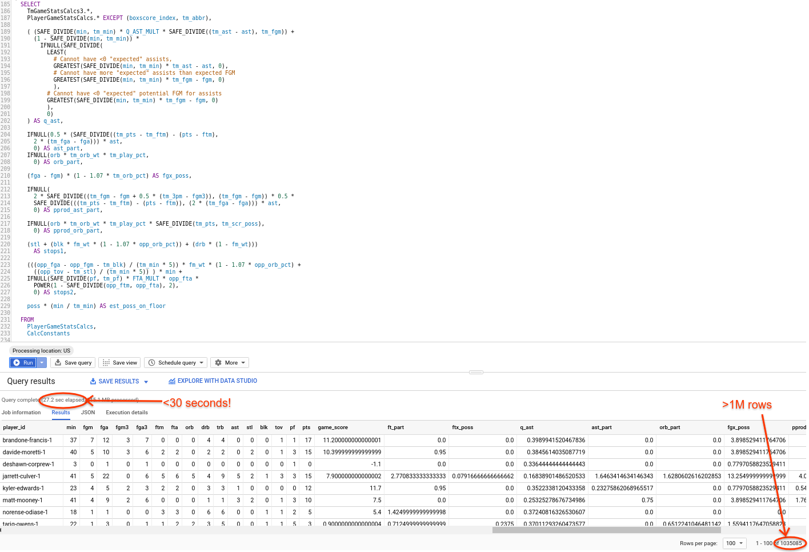
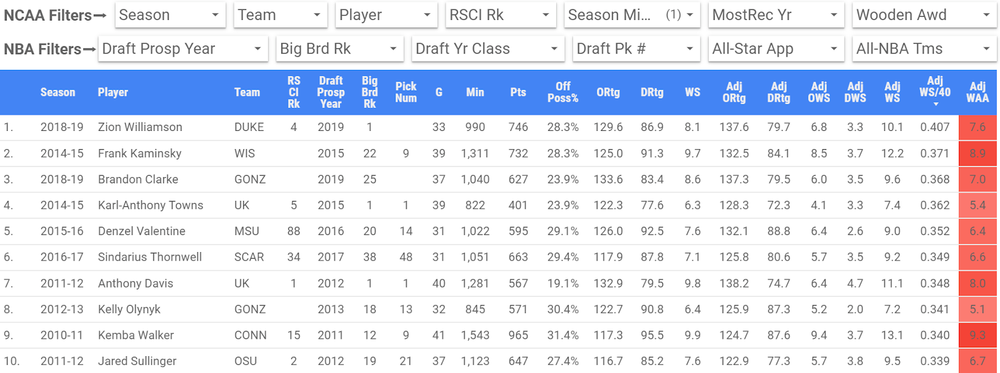
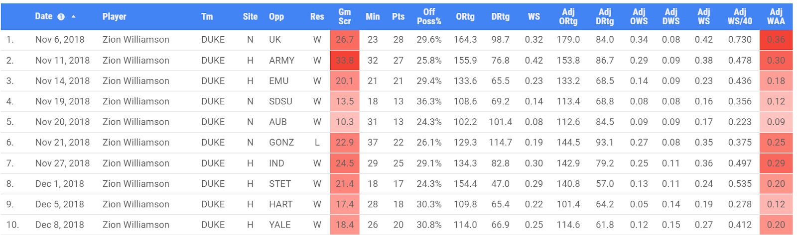
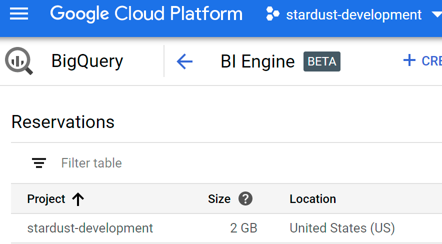
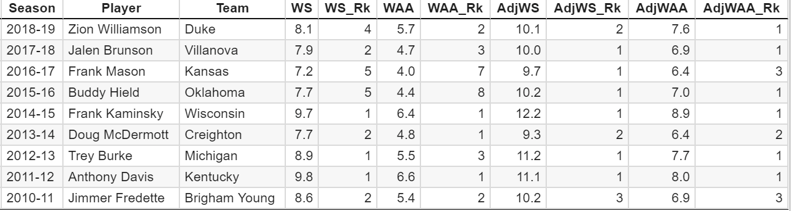

From College to the Pros with Google Cloud Platform (Part 1)

# From College to the Pros with Google Cloud Platform (Part 1)

[Alok Pattani](https://medium.com/@alokpattani)

Jun 19·10 min read

We know, we know. School is basically out for the summer. But for NCAA basketball fans, there’s perhaps one more milestone coming up to cap off this season: the [2019 NBA Draft](https://www.nba.com/draft/2019/) on Thursday!

Key draft picks have powered championship teams from [the 1950s](https://www.boston.com/sports/boston-celtics/2016/06/22/bill-russell) to [today](https://www.businessinsider.com/steph-curry-contract-draft-free-agency-built-warriors-dynasty-2019-5), so attempts to project how college prospects will perform in the NBA have been vital to draft-related decision-making for nearly as long. But using data to inform these projections and influence NBA Draft decisions has been a much more recent trend. Statistical analysis helped push [the Thunder to pick Russell Westbrook in 2008](http://grantland.com/features/the-thunder-almost-drafted-brook-lopez-instead-of-russell-westbrook/), for example, and [some NBA teams have employed analytics significantly](https://www.espn.com/nba/story/_/id/23762871/rockets-spurs-celtics-most-analytical-draft-teams-nba) in the Draft process over the last decade.

As data-loving sports fans at Google Cloud who have had the pleasure of partnering with the [NCAA](https://cloud.google.com/blog/topics/inside-google-cloud/turning-data-into-ncaa-march-madness-insights) and the [Golden State Warriors](https://cloud.google.com/blog/topics/customers/golden-state-warriors-power-data-analytics-and-fan-experiences-with-google-cloud), we saw the Draft as an interesting opportunity to demonstrate how data science can help bring unique insights to a very high-profile real-world decision-making process. Besides, if we have great GCP tools to work with data at our disposal, why not use them to help answer a burning question on many fans’ minds: just how great is [Zion Williamson](https://www.google.com/search?ei=1BEIXcj2CrHS9AP_l6QY&q=zion+williamson+greatness), last season’s NCAA Player of the Year and a generational talent, going to be in the NBA?! (Can’t wait? Take a [peek at some results](https://datastudio.google.com/u/1/reporting/1BfPIfB9k_4y3qQ2va4Weok1EJ2bU5DEW/page/Tmer) before reading on.)

There’s quite a bit of work to do to get from all men’s college basketball prospects to any meaningful insights around how they might perform in their professional careers. In part 1 of this post, we’ll cover how we rate college players with data, how to adjust for schedule strength and why that’s important, and how this frames our understanding of college players’ skill. We’ll need all that groundwork before getting to [part 2](https://medium.com/analyzing-ncaa-college-basketball-with-gcp/from-college-to-the-pros-with-google-cloud-platform-part-2-9e35566103b3), where we focus more specifically on projecting to the NBA.

### How to Rate College Basketball Players Using Data

Most of [our NCAA basketball analysis](https://medium.com/analyzing-ncaa-college-basketball-with-gcp) during the past couple Tournaments has revolved around teams, but going from college to the pros is about individual players. To start painting this picture, we gathered player game box score information, meaning each player’s points, rebounds, shooting percentage, etc. in each game, which was part of the [NCAA analytics warehouse we built in BigQuery](https://cloud.google.com/blog/products/data-analytics/let-the-queries-begin-how-we-built-our-analytics-pipeline-for-ncaa-march-madness) a few months ago. However, we realized we’d need another data source for two main reasons:

1) to get more seasons of college player data

2) to demonstrate how someone with data science skills can build such a pipeline and data product *without* any proprietary data

To that end, the sports data world is immensely fortunate to have [Sports Reference](https://www.sports-reference.com/), a company that lives up to its goal of being “the easiest-to-use, fastest, most complete sources for sports statistics anywhere.” For NCAA basketball, they have player game-level stats going back to 2010–11 (a few more seasons than we had), as well as some other team and player information that we thought might be helpful.

With non-proprietary data in hand, we could start preparing it for analysis. As many who do data analysis for a living [can tell you](https://www.theanalysisfactor.com/preparing-data-analysis/), preparing data can often be the biggest, most time-consuming, and hardest part of the process, and going from no data to a functional warehouse is no mean feat. Fortunately, as the desire for data grows, so does the amount of tooling for it in given verticals, including some that is open-source. We used [this well-written Python API](https://sportsreference.readthedocs.io/en/stable/index.html) to easily get Sports Reference stats into [Colab](https://colab.sandbox.google.com/) (player and team, game and season, for all Division I teams over the last 9 seasons), and then store it in some tables in BigQuery.

From there, we relied heavily on previously developed and fairly well-understood advanced stats that rate players, specifically basketball analytics pioneer [Dean Oliver](https://twitter.com/DeanO_Lytics)’s [individual offensive and defensive ratings](https://www.basketball-reference.com/about/ratings.html). These are complex formulas that take into account player box-score stats (e.g., points, assists, field goal percentage, rebounds, blocks, and steals), the player’s team’s rates and pace, and league averages to rate a players’ overall offensive and defensive contributions on a per-possession basis. These can be further translated into metrics like “win shares” (again, [thanks to Sports Reference](https://www.sports-reference.com/cbb/about/ws.html)), which measures the player’s total contribution on the scale of wins in a game or across a season.

This may sound extremely detailed, but with many well-constructed [WITH clauses](https://cloud.google.com/bigquery/docs/reference/standard-sql/query-syntax#with-clause) and [views](https://cloud.google.com/bigquery/docs/views), we can build these calculations up iteratively in SQL and then use BigQuery to scale the calculations relatively easily. Here’s a snippet of the code and output from running the query on all player games. We’re looking at over a million player-games run through several subqueries, joins, and computations, all in less than 30 seconds!

BigQuery code and output for looking at all NCAA player games in our data set

You may be wondering why we go through all this work for advanced stats when we could just aggregate traditional basketball statistics — points per game, total rebounds, etc. Without going into a lengthy basic-vs.-advanced-stats discussion (though do bear in mind that we’re looking at 353 D-I teams in 32 conferences with more than 4,500 players throughout the league — there’s bound to be a pretty wide range in skill), let’s just consider the aforementioned Zion Williamson.

Looking at basic stats [here](https://www.sports-reference.com/cbb/seasons/2019-leaders.html), the consensus Player of the Year didn’t rank in the top 10 in D-I in *any* of points, rebounds, assists, steals or blocks (total or per-game). However, he *did* rank in the top 5 or top 10 in many advanced stats, including player efficiency, offensive and defensive rating, win shares, and box plus/minus. Overall, the advanced stats do a better job of summarizing a player’s overall value on a rate or total basis, and have generally been found to be better for projecting forward (in machine learning terms, they are better [features](https://developers.google.com/machine-learning/glossary/#feature) than the basic stats). Keep this in mind for [part 2](https://medium.com/analyzing-ncaa-college-basketball-with-gcp/from-college-to-the-pros-with-google-cloud-platform-part-2-9e35566103b3) of this post.

### Adjusting Player Stats for Schedule

Having player game-level ratings and win shares available in our database is a nice result, but the goal wasn’t simply to aggregate to the season-level or otherwise replicate advanced stats that can be found on [Sports-Reference](https://www.sports-reference.com/cbb/players/zion-williamson-1.html) or [KenPom](https://kenpom.com/player.php?p=42110). If you’ve followed our work before, you know that one of the tenets of our college basketball analysis is to [adjust for schedule](https://medium.com/analyzing-ncaa-college-basketball-with-gcp/fitting-it-in-adjusting-team-metrics-for-schedule-strength-4e8239be0530): whom you play (and where you play them) affects what kind of stats you might put up. This is where the player game-level data becomes essential — in order to get a better handle on the meaning of a player’s skill, we needed to know the opponent and site of each player’s stats to turn those into schedule-adjusted ratings for players (and opponents).

The opponent adjustment is based on assuming that a player’s game performance is a function of his ability, his opponent’s ability, and home-court advantage (plus variance). In very loose model terms:

player_game_stat ~ intercept + player_rating + opp_rating + home_advantage + (error)

Ridge regression using player and opponent dummy variables (and some grouping to handle the many players with small sample sizes) “automatically” gives us the opponent adjustment — a similar procedure to what we used for the team stats adjustment. Once we adjusted offensive and defensive ratings, we used the same formulas as described above to calculate adjusted win shares (and related stats).

An important technical note: we initially tried to run these adjusted player ratings in Colab, as we’d done in the past. But because fitting a ridge regression with many dummy variables to account for the thousands of D-I basketball players that take the floor each season is memory intensive, the Colab kernel would often crash. Even when running just one season at a time, we often had to start over or use higher minimums to reduce the number of players entering the regression. This is where [AI Platform Notebooks on GCP](https://cloud.google.com/ai-platform-notebooks/) really shone. Within minutes, we were able to [create a Python notebook instance](https://cloud.google.com/ml-engine/docs/notebooks/create-new) with much more memory than Colab (see below).

Creating a Python notebook instance in AI Platform Notebooks on GCP

From there, we could create a JupyterLab notebook and proceed as we would with Colab (or any other interactive Python environment) to run our code. With the notebook specifications above, we were able to generate the schedule-adjusted ratings for all nine seasons, without any crashes or having to modify our thresholds, and in much less time than in Colab.

We also used the ridge regression site and opponent coefficients to generate player game-level adjusted stats along with season-level ones. This produced a cool feature that allowed us to look at top player games, a single player’s trends over time, and more. Both player game and season adjusted stats were then written back to BigQuery, where we could use them in other views or queries.

### Making the Results Accessible and Easy to Play With

The ultimate destination for our results was [this Data Studio dashboard](https://datastudio.google.com/u/1/reporting/1BfPIfB9k_4y3qQ2va4Weok1EJ2bU5DEW/page/Tmer), which has raw and adjusted advanced stats for *all* D-I players going back to 2010–11 (season-level on Page 1, game-level on Page 2). The season-level page has filters for season, team, player, and some other NCAA-specific information like recruiting ranks and Wooden award winners (we’ll get to the NBA-related filters later), and the table has several stats to sort by (with the glossary below to help). For example, here are the top 10 player-seasons by adjusted win shares per 40 minutes, among those who played at least 500 minutes (a good filter to have on for rate stats):

Top 10 NCAA player seasons by adjusted win shares (min. 500 minutes) since 2010–11

Going back to Zion Williamson, we can see that his freshman season stands above all others in our data set with an adjusted win share rate above 0.4, meaning he generated wins at a rate more than *four times that of an average D-1 player* (~0.100)! We can also see how the adjustment works in Zion’s case — given Duke’s generally tough schedule, adjusting improves his offensive rating by eight points and his defensive rating by more than seven (compared to the “raw” versions). He went from 8.1 raw win shares all the way up to 10.1 adjusted win shares in less than 1000 minutes (keep in mind that he missed basically 6 entire games with a late-season injury).

On [Page 2](https://datastudio.google.com/c/u/0/reporting/1BfPIfB9k_4y3qQ2va4Weok1EJ2bU5DEW/page/SbGs), we can filter to any season, team, player, or specific matchup in question and see similar advanced player stats on the game-level. This allows us to look at Zion’s game log. For example, his first 10 games are shown below:

Zion Williamson’s advanced stats game logs for his first 10 games in 2018–19

We can see how schedule-adjusting does what we might expect. It improves his stats in the games Duke played against tough opponents like Kentucky, Auburn, and Gonzaga, while diminishing them in games against lower competition like Army, Stetson, and Hartford.

While this dashboard may not be as flashy as Zion’s stats, it does at least one rather amazing thing: it allows us to manipulate these big tables (one with tens of thousands of player seasons, the other with more than a million player games, both reasonably wide) in a matter of seconds. Our dashboard can do this because of [BigQuery BI Engine](https://cloud.google.com/bi-engine/docs/getting-started-data-studio), a relatively new, fast, in-memory analysis service that can greatly accelerate data exploration. With an easy-to-setup 2GB BI Engine reservation in our project (see below), all users can look at their favorite players or teams in our dashboard without large latency between sorts and filters.

Creating a BigQuery BI Engine reservation to accelerate data exploration in Data Studio

### The Impact of Schedule Adjustment

We saw with Zion Williamson that schedule adjustment seems to offer some data that supports some intuitive insights, and seems logical given the vastly differing levels of competition different teams play in college sports. But how do we know if schedule-adjusted player metrics highlight meaningful differences in player skills, or are “right” only in this specific context? We’ll save the NBA perspective (read: if predictive modeling with adjusted stats help projecting NBA success beyond what raw stats alone can provide) for [part 2](https://medium.com/analyzing-ncaa-college-basketball-with-gcp/from-college-to-the-pros-with-google-cloud-platform-part-2-9e35566103b3) of this post, but we can at least offer some of the college perspective for now.

One way we can look at if adjusting helps evaluate college players is to look at the Wooden Award winners in our dataset. Let’s compare the raw and adjusted stats and ranks of the nine players who were voted to be the best player in Division I in their award-winning seasons.

Raw & adjusted win shares (WS) & wins above average (WAA), with ranks, for recent Wooden Award winners

The table above shows a couple things:

- •Every Wooden Award winner saw a big increase when adjusting win shares (WS) and wins above average (WAA; like win shares, but compares to a higher baseline of an average player) for schedule, including those who played in non-power conferences (McDermott and Fredette).
- •Eight of the nine ranked at least as high in adjusted win shares and wins above average as in the raw version of each stat — the adjusted versions “liked” them as much or better.
- •Each of those eight ranked first in at least one of the adjusted stats in the given season, compared to only four of eight taking the top spot in one of the raw stats.

From here, it’s pretty clear that the adjusted stats are picking up something important about how well players perform in college basketball — at least for these recent NCAA stars.

If you’re *only* a college basketball fan, feel free to stop here and continue playing with the NCAA portions of [the dashboard](https://datastudio.google.com/c/u/0/reporting/1BfPIfB9k_4y3qQ2va4Weok1EJ2bU5DEW/page/Tmer) — it’s a great way to look back at the players who have mattered in the current decade of college hoops. But we wanted to go from college to the pros, so in [part 2](https://medium.com/analyzing-ncaa-college-basketball-with-gcp/from-college-to-the-pros-with-google-cloud-platform-part-2-9e35566103b3), we’ll cover how to do that with more GCP tools to help us better understand the college prospects who will hear their names called on Thursday.