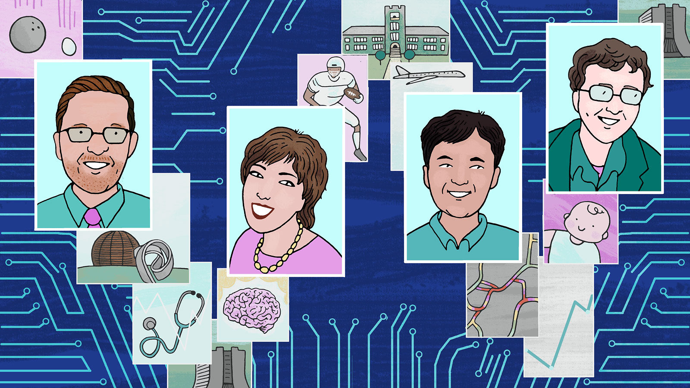
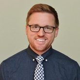
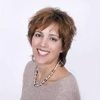
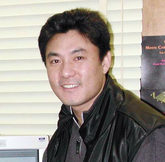
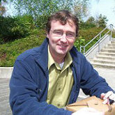
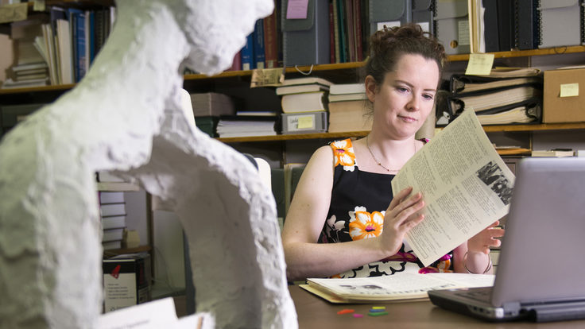
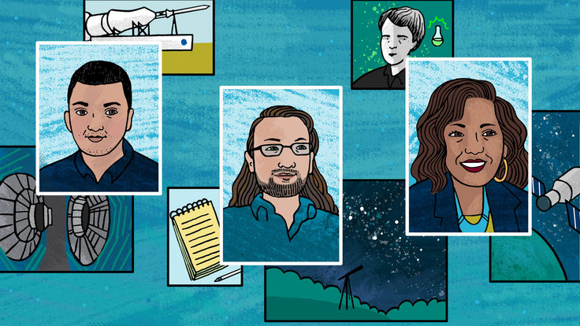
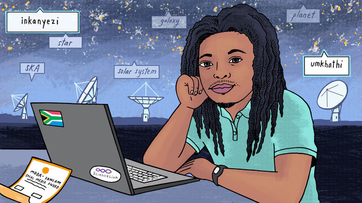

From physics to data science

 [Skip to main content](https://www.symmetrymagazine.org/article/from-physics-to-data-science#content)

 
Illustration by Sandbox Studio, Chicago with Corinne Mucha

# From physics to data science

05/21/19

|By Sarah Charley

Four physicists share their journeys through academia into industry and offer words of wisdom for those considering making a similar move.

Throughout his higher education, Jamie Antonelli had always envisioned himself as one day becoming a physics professor. All of his role models were professors; all of his peers were working to become professors; all of his research was preparing him for a career as a professor.

“I was living in a bubble,” Antonelli says. “I was keeping my head down and following the same path as everyone around me instead of taking an honest look at my future.”

Every year, a few hundred students like Antonelli graduate with PhDs in particle physics. And every year, only about a dozen permanent positions open up at universities and research institutions. As Antonelli and his peers navigated cycles of applications and rejections, he was hit with a hard truth: Most PhD physicists will leave academia.

Like many of those physicists, Antonelli found his way to a career in data science. It can be a challenging transition to make, especially when students like Antonelli find themselves building a large part of their identity on the idea of staying in basic research or academia.

*Symmetry *checks in with Antonelli and three other physicists who made the leap to data science.

 

### Jamie Antonelli

As a junior in high school in 1999, Antonelli watched as his physics teacher dropped a bowling ball and an egg simultaneously, expecting the heavier object to land first. They smashed into the ground at the same time.

“It was like the scales had fallen from my eyes,” he says. “It opened a new realm of understanding that was not accessible by intuition alone.”

From that class forward, Antonelli was hooked. He pursued physics with dogged persistence.

“I wanted to dive as deep as I could,” he says. “No other subject held my interest as much. I wanted to do everything I could to one day become a physics professor.”

As a talented student, Antonelli was a big fish in a small pond. But when he started a particle physics PhD program at the University of Notre Dame and began doing research on the CMS experiment at the Large Hadron Collider, he became acutely aware that he had entered the ocean.

“By the time I got to CERN, I was no longer the best at physics,” he says. “I was surprised how hard it got. The depth of the mathematics pushed me to the limits of my intelligence. It was a great and humbling life experience, understanding where I fit in the world.”

Antonelli pushed through the challenges toward the goal he had set for himself in high school. But as he entered his fifth year as a postdoc, he began to question his choices.

“At the beginning, the competitive culture motivated me,” he says. “It was a blast: working all day and into the evening with all these brilliant people, trying to shine.”

But in the later stages, he says, he started to see how that same culture was driving him and his colleagues to neglect other parts of their lives. “There was also the subconscious awareness that we were all competing for the same small pool of permanent jobs, and this became a huge source of stress.”

Antonelli says that competition started eating away at the camaraderie within his community of physics friends and coworkers. “I’d watch friends get interviews at places where I had also applied, and it was really difficult to celebrate their achievements,” he says. “Within the academic job market, there are real challenges, real disappointments and real jealousies between friends. It can really bring out the worst in everybody.”

Antonelli started looking for another option, but he had never considered how his skills might apply outside academia. Even thinking about it felt like abandoning a dream.

“Because the field draws people who are motivated and intelligent, it fosters a culture of giving your whole self to your job,” he says. “And I was no exception. I had spent my whole life on this path and had invested so much that I felt like I would be a failure if I went in a different direction. So much of my personal identity was wrapped up in becoming a professor that it was painful for me to give that up.”

Then Antonelli attended a job panel at a physics conference that gave him a new window into the world outside of physics. The moderator for the panel said she found it unconscionable that students in physics were not aware that their peers who had left the field were generally very happy with their work—and making two to three times as much money.

“I had never compared the academic career lifestyle with that outside academia,” Antonelli says. “And it turns out, 70% of the job description for a professor did not interest me at all. It had been my goal for so long that I had never evaluated if it was a good fit for me.”

In 2017 he participated in the Insight Data Science Fellows Program, a seven-week program run by a former member of the ATLAS experiment at the LHC that helps scientists transition from academia to data science. Immediately afterward he found a job in health care.

Antonelli reviews data from hospitals to compare their performance and identify opportunities to improve their quality of care. One of his latest projects involves helping hospitals understand if they are giving equal treatment to different socio-economic groups.

To physics students and postdocs considering making the move to data science, he says, “The world and your career opportunities are so much broader than what they are inside academia. You have highly valued tech skills, and you can take your favorite part of your job and find someone that will pay you to do just that.”

 

### Jennifer Hobbs

Jennifer Hobbs remembers sitting in science class as an elementary school student, feeling crestfallen.

“Everything seemed like it had already been done,” she says. “Outside of medicine, it seemed like we really understood everything about how the world worked. I remember thinking, ‘This must be all that exists.’”

But in 1995, when Hobbs was in the third grade, something new happened: Scientists at the US Department of Energy’s Fermi National Accelerator Laboratory discovered a fundamental particle, the top quark. “Here was this real, new science,” she says. “It made me realize that there’s still a lot we can learn about the world.”

Even though, not surprisingly, Hobbs knew nothing about particle physics as a third grader, the top quark discovery stuck with her. She pursued a STEM-heavy program throughout high school and enrolled in an integrated sciences program at Northwestern University. Through Northwestern’s physics department, Hobbs found a way to become part of the laboratory that had captured her imagination so many years before.

“I’d go out to Fermilab every summer and one to two times a week during the school year,” Hobbs says. “I absolutely loved circuits and classical electrodynamics, and these are the skills I used while building detector components for the MINERvA [neutrino] experiment. I felt like I was making a real difference.”

She decided to pursue her PhD at Northwestern so that she could continue working with the same professor on MINERvA, Heidi Schellman.

But as her graduate school classes started, things felt different. “I can’t really explain it,” she says. “I didn’t have that same passion for physics research that I did for the engineering side of things.”

She kept thinking back to the last time she felt a bubbling excitement for scientific research: during an undergraduate neuroscience class, when a professor had demonstrated how to predict brain activity using Gauss's law—a formula that relates electric charge to electric fields.

“Here were my favorite physics subjects—circuits and electrodynamics—and we were using them in a biology class,” she says. “It totally blew my mind.”

Hobbs says she felt torn between her expectations for herself and where her passions were pulling her. “Physics was something I had enjoyed and thought about since I was a little kid,” she says. “To walk away seemed crazy. What if I choose something I like less? What if I switch labs and then hate it?”

On top of those fears, Hobbs says, she felt like walking away from physics, even to go to a field as challenging as neuroscience, would make her a failure. “There’s this idea that particle physics is the one true hard science,” she says. “As a woman in science, I always felt like I needed to overperform and push myself harder because of an explicit expectation that I would fail. I felt like switching to neuroscience was admitting defeat, like I’m not good enough to keep up with the guys.”

After months weighing her options, Hobbs says she finally came to a realization: “Following my passion doesn’t make me less qualified than someone else. It’s not in anyone else’s court to decide what my passions are and what qualifies as my success.”

Hobbs switched into neuroscience. She examined how touch is processed and encoded by the brain. Her research introduced her to machine learning, giving her the skills to become a data scientist before data science was a well known profession.

Hobbs says she struggled to communicate her skills to potential employers outside of academia, but eventually she found a position evaluating risks at an insurance company.

Within a year, she transferred to her current job at STATS, LLC in Chicago, where she uses sports data to analyze player performance and make predictions. “Sports matches are essentially hundreds of controlled experiments that produce all sorts of data,” she says. “We can learn about how people move, make decisions and behave in different situations. As a scientist, this is a dream dataset.”

As a third grader dreaming about fundamental particles, Hobbs could never have guessed where her path would eventually lead her. The advice she gives to others who are considering leaving what they know to try something new is to just go for it.

“It’s OK to feel uncomfortable,” she says. “When you’re too comfortable, you’re not learning as much as you can. Look for opportunities to follow your passion and expand your skillset.”

 

### Dongwook Jang

As a student, Dongwook Jang had a knack for math, but not a clear idea about how he could apply it professionally.

“When I graduated from college with an undergraduate degree, I still didn’t have a picture of a future career,” he says. “I went into a master’s program in physics to give me more time to decide.”

It was during his master’s program at Yonsei University in South Korea that Jang discovered high-energy particle physics. In 1999, he moved to the United States to pursue a physics PhD at Rutgers University.

“I felt protected inside academia,” he says. “I didn’t have a solid plan or know my future, but I had a rough vision of eventually getting a faculty position and doing my own research.”

After completing his PhD and working for five years as a postdoc, Jang found his vision of being a staff scientist had not yet materialized. “There are not many options inside academia,” he says. “The competition was very intense, and I had the realization that I would have to leave the field.”

However, Jang had only a vague idea what his options were.

“Most of the people I knew who had left academia landed in the financial world,” he says. “During my postdoc, I tried applying to financial companies, but the entrance barrier was very high. They required a deep understanding of computer science, statistics, and a high proficiency in several programming languages. It was like they wanted some kind of superhero.”

Jang was also not a citizen of the United States, a place that was beginning to feel like home. His lack of citizenship or a green card weakened his chances of finding a job in the US.

“I had some friends at CERN who were in a similar situation, but I believe they all went back to South Korea,” he says. Applying for the National Interest Waiver, a waiver that allows an individual to obtain a US green card without the support of a specific employer,  “requires a lot of documents, high fees and time. I had to hire a lawyer who is specialized in this process.”

After two years of effort, during which he continued to conduct his physics research, Jang finally received the green light to work in the US. Jang applied to more than 100 jobs, had 50 phone interviews and 10 onsite interviews. But he felt there was still a mismatch between his qualifications and employers’ expectations.

“Most of the time the interviews were not positive,” he says. “They asked difficult questions about computer science, algorithms, data structure and programming concepts. They were not interested in my physics career, for sure.”

It dawned on Jang that he needed to change his approach. He talked with friends who had left high-energy physics, and one of them told him about an opening in his office. Jang got the job.

“Networking works,” Jang says. “The company already had some employees who came from high-energy physics, and I think they saw how useful we are and that we add value.”

Jang’s transition into industry coincided with the start of the machine-learning boom and presented him with new ways to apply the skills he had cultivated inside academia. Today, he uses machine learning to identify driving patterns and predict future traffic.

“My work is completely aligned with what I had been doing as a postdoc,” he says. “I’m performing the same kind of data analyses, but instead of using momentum and energy, I’m dealing with location and speed.”

He says he was surprised at the level of challenge and fulfillment that he finds from his work. “I was uncertain when I left physics if I would be happy working in industry,” he says. “But after a few months, I completely changed my mind. There is another life outside academia. And the work-life balance is great.”

Even though Jang has moved away from both his home country and academia, he feels like he’s found a place where he belongs.

“I feel like the United States is my new home now,” he says. “I got married here and have a son who gets his education here. I work here. Where else should I call home?”

 

### Thomas Gadfort

By all measures of physics success, Thomas Gadfort had made it: In 2012 he made the jump from a postdoctoral position at Brookhaven National Laboratory to an Associate Scientist position at Fermilab. And then, he and his wife decided to have their first child.

“The minute you have a child, things change, whether you want them to or not,” Gadfort says. “I had to do some grand thinking about my life and its direction.”

That direction had seemed clear for most of Gadfort’s life. When he was five years old, his family emigrated from Copenhagen to Oak Ridge, Tennessee, for his dad’s job as a nuclear physicist. “I had posters up in my room of the Standard Model of particle physics before I even knew what it was,” he says. “Physics was a natural home for me.”

Gadfort excelled as a researcher. But as he climbed the physics hierarchy, he saw that his path was pulling him away from his scientific passions. “The next natural step in my career was to lead efforts and manage projects,” he says. “And to be honest, it was not something that I wanted. I just wanted to continue being a postdoc, making plots and trying to understand the details.”

On top of these sentiments, Gadfort started thinking about how he could juggle a successful career in physics and a fulfilling family life. “I wanted to be more of a family man and not work on weekends or travel as much,” he says. “But if I don’t travel, would that make it possible to have the physics career I want, at the level I want?”

After two years working at Fermilab and several months of mulling over his future, Gadfort decided to take a leap of faith and step into the data-science world.

“There was a lot of uncertainty at the beginning,” he says. Four years later, he says, it is clear to him that it was the right decision. “But immediately afterward, I really wasn’t sure.”

As Gadfort started his first job in the private sector, he found that he had the raw abilities of a data scientist—but not the skills. “I didn’t know how to code in Python and had to learn it on the fly,” he says. “Much of my work also involved extracting datasets with unknown and cryptic formats, which was not something that I did as a physicist.”

Gadfort also had to adjust to a structured work culture with deadlines and deliverables. “When I was a postdoc, it was up to me to manage my time,” he says. “If I wanted to spend my day on some random problem or rewriting code, it was not much of problem. Things don’t work like that in industry.”

Another reason the transition was so awkward, he says, is that he wasn’t sure what leaving academia meant to him as a physicist.

“When I was studying physics, I was very proud that I was part of that community,” he says. “I would read about famous physicists and follow all the latest results because the work was meaningful to me.”

But now that he works outside academia, he still does all of those things. “My fears of losing that part of my identity were completely unfounded. The fact that I’m no longer making plots of Z bosons and top quarks doesn’t really matter.

“I still think if myself as a physicist, and physics is always going to be one of the loves of my life.”

As Gadfort settled into his new career, he was pleasantly surprised that his work as a data scientist was centered on the same activities that he had excelled at as a postdoc—making plots and analyzing data. He uses data to analyze the behavior of drivers to understand why accidents happen and how to make the roads safer.

Leaving physics also allowed Gadfort to pursue another goal: a healthy work-life balance.

“This past year, I coached my daughter’s soccer team,” he says. “There’s joy and fulfillment outside your career as well.”

[Follow+](https://www.symmetrymagazine.org/subscribe)

- [Print](#)
- [Facebook](https://www.facebook.com/sharer.php?u=https://www.symmetrymagazine.org/article/from-physics-to-data-science)
- [Twitter](http://twitter.com/share)
- [Reddit](https://www.reddit.com/submit)
- [Hacker News](http://news.ycombinator.com/submit)

## [Profiles](https://www.symmetrymagazine.org/collection/profiles)

### Meet some of the people who make up the world of physics.

05/21/19

#### [From physics to data science](https://www.symmetrymagazine.org/article/from-physics-to-data-science)

Four physicists share their journeys through academia into industry and offer words of wisdom for those considering making a similar move.

04/25/19

#### [It takes a village](https://www.symmetrymagazine.org/article/it-takes-a-village)

Building a particle physics laboratory requires more than physicists.

04/02/19

#### [Considering the whole student](https://www.symmetrymagazine.org/article/considering-the-whole-student)

Meet three scientists connected by the Fisk-Vanderbilt Master’s-to-PhD Bridge Program.

03/12/19

#### [Decolonizing science through sci comm](https://www.symmetrymagazine.org/article/decolonizing-science-through-sci-comm)

Science writer Sibusiso Biyela aims to bring science back to South Africa’s Zulu communities.

[view full collection](https://www.symmetrymagazine.org/collection/profiles)

An online magazine about particle physics.

- [Subscribe](https://www.symmetrymagazine.org/subscribe)
- [Contact](https://www.symmetrymagazine.org/contact-us)
- [About](https://www.symmetrymagazine.org/about)
- [Archive](https://www.symmetrymagazine.org/archive)

Copyright 2018 Symmetry Magazine
A joint Fermilab/SLAC publication
[Terms of Use](https://www.symmetrymagazine.org/node/48371)

