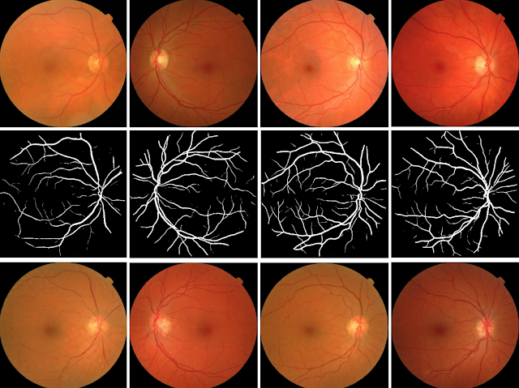
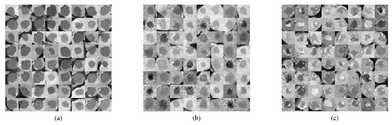
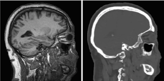
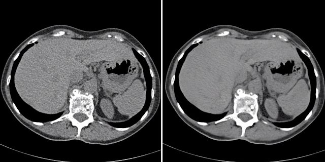
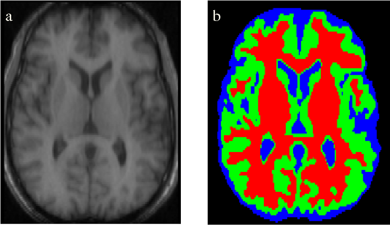

GANs and Medical Imaging

[February 03, 2020](https://ml-and-me.blogspot.com/2020/02/gans-and-medical-imaging.html)

### GANs and Medical Imaging

—

|     |
| --- |
|  |
| Generated images of retina using the blood vessel trees. The first row is the real retinal scan, the second is the vessel tree map and the third is the generated retinal image.https://arxiv.org/pdf/1701.08974v1.pdf |

In my previous [post](https://ml-and-me.blogspot.com/2020/01/generative-adversarial-networks-primer.html), we took a quick tour through the framework and mathematics behind general adversarial networks (GANs). Just recapping, GANs are basically a partnership between a generator and a discriminator network, with its main purpose being "Can I generate some artificial data that looks real?". It's like a counterfeit job, where the generator acts like the "counterfeit-er", trying to produce realistic-looking(but actually synthetic!) data out of some random noise input. The discriminator is like the "security guard", trying to spot differences between real and synthetic data. If the security guard struggles to tell the difference between real and synthetic material, then it means the counterfeiter did a good job at producing something that passes off as real and gets a sort of reward signal. But if the guard can easily spot what's fake, then the counterfeiter clearly has done a crappy job.

Now how is this concept beneficial to the medical imaging field? Well, we first need to to understand what the the current state of imaging research is like. Particularly, two common themes crop up:

### **Medical Imaging is data scarce**

Compared to fields like genomics which have developed so much over the past decade and have an abundance of well-annotated information, medical imaging is relatively data scarce. Here are some of the reasons why:

1. Cost - It's really expensive to acquire these images so the datasets are small.

2. Annotation - In order to use the data for running ML algorithms, it needs to be manually annotated/labelled by experts, which takes hours and hours.

3. Privacy - Medical imaging data is proprietary so there are data privacy concerns, making it difficult to get access to.

4. Rare diseases - With rare diseases, because they are not so common in populations, the data that is available to work with is limited. This is common especially in fields like ophthalmology...

### **Data Analysis is error-prone**

Not only is data acquisition a problem, but even with the data available, there can be issues in analysis. Because image analysis is performed by human physicians, interpretations can be slightly biased based on what training they have undergone. Some images may have particular details which may be ignored so the wrong diagnosis could potentially be made if not examined properly. So there a high scope of error with image data interpretation as well.

Putting these two main points together, medical imaging faces a GENERATIVE problem i.e. not enough data and a DISCRIMINATIVE problem i.e detecting disease vs normal or disease-1 vs disease-2. GANs can be extremely beneficial for tackling both these issues, because we can train models that create realistic images, but also train good detectors to spot disease. So with that, let's look at some of the amazing medical imaging research with GANs that has happened so far...

**Image Synthesis**

A lot of research is available where GANs are used to produce new images. This helps overcome the data scarcity issues. Image synthesis can be classified into 3 types:

Unconditional Synthesis: This is basically normal image generation, where the GAN is given noisy input and it creates the image required, using a supervised learning approach. Different variations of the GAN like WGAN and PGGAN have been used to create realistic images. For example, one study created images of 3 types of liver lesions (cysts, metastases and hemangiomas) by inputting 182 liver CT scans into 3 separate DCGANs. This is what the data looked like, where (a) is the liver cyst, (b) is the metastasis and (c) is the hemangiomas.

Cross-modality Synthesis: I found this one quite amazing...cross-modality synthesis is where an MRI scan for example is inputted and the GAN will generate what the CT scan would look like i.e. it creates a different imaging modality out of the first imaging modality, hence cross-modality synthesis. Imagine how beneficial this would be! It would decrease the time to acquire the image and the cost of doing it as well. Especially with CT scans, they use ionizing radiation to create the image, which isn't good for the patient so this AI could eliminate the need for the patient to also go through a CT scan.

Conditional Synthesis: This is where you create the new image, but you give the GAN some constraints/conditions. It's like telling the GAN "I want you to create an MRI scan of a lung cancer for me where the cancer is located slightly near the border of the lung"...you don't see a cancer like that normally but the GAN can still do it! So the benefit of this kind of synthesis is that you can provide any conditions on location/shape/size and create images which are not very commonly seen. But for designing GANs like this, it's important that it has learnt the complex distributions in the training data well.

**Image Reconstruction**

When an image is being acquired in a clinical setting, there are various factors like the patient's comfort, the radiation dose or patient's fidgeting etc due to which noise comes in which disrupts the image quality. GANs can be used to repair the image by de-noising it. A very popular GAN called "pix2pix" has been used to do this on PET, CT and MRI data. Below is an image of a denoised CT scan; you can see that it's really grainy in the left and smoothened out on the right.

Another form of reconstruction is reproducing the same image again, but highlighting/enhancing certain elements of the image. This can be done by manipulating loss functions within the network to reweight each pixels contribution to the output. What I mean by this is, suppose I'd want to highlight the blood vessels more in the image, I'd fine-tune the GAN to give a higher weight to the image pixels that correspond to the blood vessels, so that the GAN will learn to give a higher priority to those pixels.

The challenge with these image reconstruction techniques though, is that there's no way to validate if the results are good other than to show it to an expert. Furthemore, there aren't any standard image analysis techniques used in practice which makes it difficult to evaluate these reconstructed images.

**Image Segmentation**

This is a technique where the image creates a map showing the different structures/anatomical regions of the image, like in the image below. Normally, for image segmentation tasks, we use a UNet, which is a type of Convolutional Neural Network, but the segmentation maps produced may not be perfect. What makes GANs interesting for image segmentation is that the discriminator of the network can act like a "shape regulator" - meaning it can make the shape of the segmentation map more compact and well-defined, which enhances the quality of the output.

**Abnormality Detection**

This exploits the discriminator aspect of the GAN. Anomalies can be found in images, by first learning the probability distribution of normal images, which it then uses to flag out abnormal images which are from completely different distributions. Making this simpler, if I showed a child a picture of a cat all the time, then he/she would become such a pro at identifying cats that one day, if I showed him a dog, he could pick that out as an anomaly and say "That's not a cat!".

A [study](https://spie.org/Publications/Proceedings/Paper/10.1117/12.2254487) in 2017 applied this concept to brain lesion detection. In the study, a GAN was trained with MRIs of normal brain patches without lesions. The generator learnt the complex features of normal brain patches and generated images so realistic that the discriminator started to give random predictions for what's real or fake. During model testing, when the images of normal patches were fed to the discriminator, as expected, it gave random predictions. However, when given images of patches *with* lesions(the anomalies!), the discriminator gave much lower scores, because the lesioned patches were from a completely different distribution.

So these are just some of the popular applications of GANs in medical imaging! There are tons of research papers that have come out on this topic and more research is happening as we speak. These ideas I've discussed have come from an amazing review article which I've put the link for below, do have a read if you're interested to go in further in depth!

**Link to article:**
https://arxiv.org/pdf/1809.07294.pdf