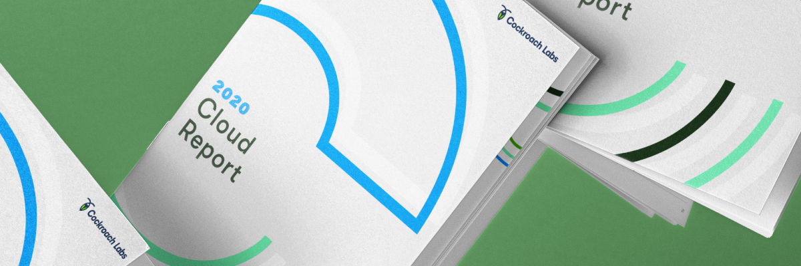
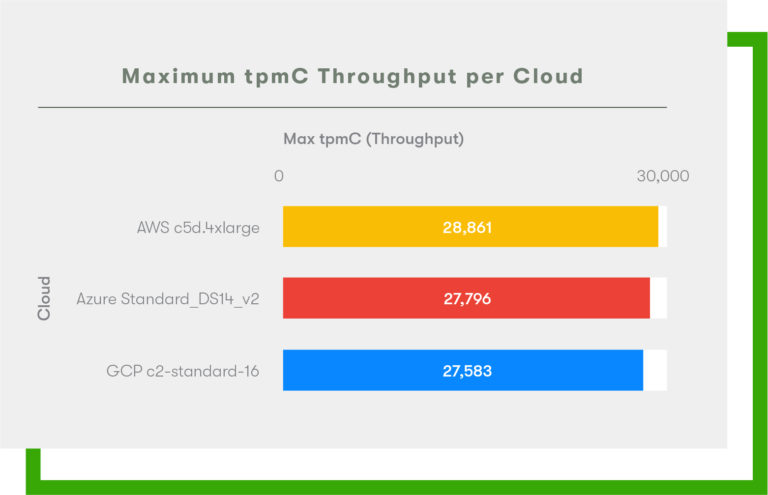
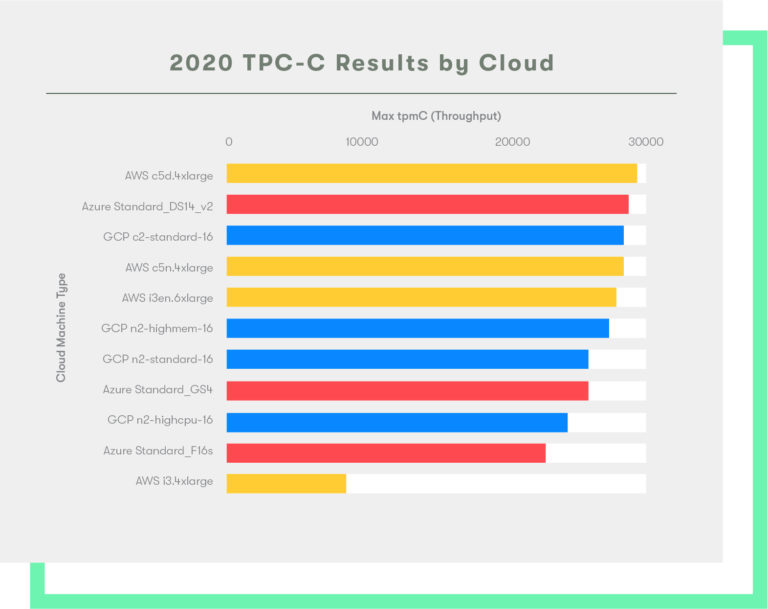
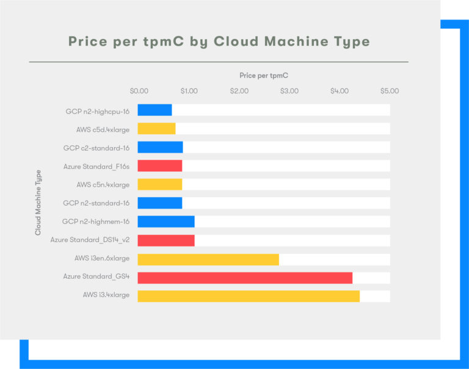

GCP Comes Out Swinging Against AWS and Azure in 2020 Cloud Report | Cockroach Labs

performance

# GCP Comes Out Swinging Against AWS and Azure in 2020 Cloud Report

- Written by [Andy Woods](https://www.cockroachlabs.com/blog/author/andy-woods/), [Charlotte Dillon](https://www.cockroachlabs.com/blog/author/charlotte-dillon/), [Nathan VanBenschoten](https://www.cockroachlabs.com/blog/author/nathan-vanbenschoten/) and [Paul Bardea](https://www.cockroachlabs.com/blog/author/paul-bardea/)
- on December 11, 2019

[' fill='%23A2A2A2' data-evernote-id='774' class='js-evernote-checked'%3e%3cg id='EMAIL-SIGN-UP' transform='translate(30.000000%2c 525.000000)' data-evernote-id='775' class='js-evernote-checked'%3e%3cg id='Group-7' transform='translate(22.000000%2c 221.000000)' data-evernote-id='776' class='js-evernote-checked'%3e%3cpath d='M5.72455227%2c18 L1.90740659%2c18 L1.90740659%2c8.99886392 L0%2c8.99886392 L0%2c5.8973744 L1.90740659%2c5.8973744 L1.90740659%2c4.03534461 C1.90740659%2c1.50530169 2.983858%2c0 6.04410556%2c0 L8.59120186%2c0 L8.59120186%2c3.1026256 L6.99926667%2c3.1026256 C5.80793935%2c3.1026256 5.72921729%2c3.53603888 5.72921729%2c4.34492552 L5.72396915%2c5.8973744 L8.60869565%2c5.8973744 L8.27106544%2c8.99886392 L5.72396915%2c8.99886392 L5.72396915%2c18 L5.72455227%2c18 Z' id='Facebook' data-evernote-id='777' class='js-evernote-checked'%3e%3c/path%3e%3c/g%3e%3c/g%3e%3c/g%3e%3c/g%3e%3c/svg%3e)](https://www.facebook.com/sharer.php?u=https://www.cockroachlabs.com/blog/2020-cloud-report/)[' fill='%23A2A2A2' data-evernote-id='783' class='js-evernote-checked'%3e%3cg id='EMAIL-SIGN-UP' transform='translate(30.000000%2c 525.000000)' data-evernote-id='784' class='js-evernote-checked'%3e%3cg id='Group-7' transform='translate(22.000000%2c 221.000000)' data-evernote-id='785' class='js-evernote-checked'%3e%3cpath d='M64.1151611%2c4.16817647 C64.7932148%2c3.740286 65.3134942%2c3.06180227 65.5576686%2c2.25356472 C64.922815%2c2.65075009 64.2212831%2c2.93799137 63.4727945%2c3.09349786 C62.8755063%2c2.41996657 62.0218348%2c2 61.0770676%2c2 C59.2645419%2c2 57.7957387%2c3.55011246 57.7957387%2c5.46175275 C57.7957387%2c5.73314624 57.8229735%2c5.99760632 57.8793215%2c6.25018056 C55.1520808%2c6.10556943 52.7338146%2c4.72879222 51.1138111%2c2.63292132 C50.8311322%2c3.14599369 50.6696015%2c3.740286 50.6696015%2c4.37419781 C50.6696015%2c5.57466829 51.2490462%2c6.63448959 52.1299525%2c7.25651555 C51.5918295%2c7.23868678 51.0856371%2c7.08119931 50.6423666%2c6.82367264 L50.6423666%2c6.86626359 C50.6423666%2c8.5441489 51.7730821%2c9.94370731 53.2766332%2c10.2606632 C53.0005283%2c10.3418832 52.7112755%2c10.3824931 52.4107531%2c10.3824931 C52.1994483%2c10.3824931 51.9928391%2c10.3616929 51.793743%2c10.3210829 C52.2107178%2c11.6958792 53.4231379%2c12.6982522 54.8600106%2c12.7249954 C53.735869%2c13.6540723 52.3205963%2c14.2067642 50.7832365%2c14.2067642 C50.5184011%2c14.2067642 50.2563832%2c14.1919069 50%2c14.1592208 C51.4528379%2c15.1407936 53.1780243%2c15.7142857 55.0318718%2c15.7142857 C61.0704936%2c15.7142857 64.3706052%2c10.4389509 64.3706052%2c5.86389055 C64.3706052%2c5.7133365 64.3687269%2c5.56377293 64.362153%2c5.41619034 C65.0035804%2c4.92788015 65.5614251%2c4.31774004 66%2c3.62340851 C65.4111639%2c3.89876395 64.7781886%2c4.08497555 64.1151611%2c4.16817647 Z' id='twitter' data-evernote-id='786' class='js-evernote-checked'%3e%3c/path%3e%3c/g%3e%3c/g%3e%3c/g%3e%3c/g%3e%3c/svg%3e)](https://twitter.com/share?url=https://www.cockroachlabs.com/blog/2020-cloud-report/)[' fill='%23A2A2A2' data-evernote-id='792' class='js-evernote-checked'%3e%3cg id='EMAIL-SIGN-UP' transform='translate(30.000000%2c 525.000000)' data-evernote-id='793' class='js-evernote-checked'%3e%3cg id='Group-7' transform='translate(22.000000%2c 221.000000)' data-evernote-id='794' class='js-evernote-checked'%3e%3cpath d='M107.473124%2c6.74693461 L104.189081%2c6.74693461 L104.189081%2c16.6090147 L107.473124%2c16.6090147 L107.473124%2c6.74693461 Z M107.682109%2c3.70173128 C107.672157%2c2.73642172 106.975542%2c2 105.851006%2c2 C104.736422%2c2 104%2c2.73642172 104%2c3.70173128 C104%2c4.64713754 104.706567%2c5.40346255 105.811199%2c5.40346255 L105.831103%2c5.40346255 C106.975542%2c5.40346255 107.69206%2c4.64713754 107.682109%2c3.70173128 Z M112.558415%2c8.14867524 L112.558415%2c6.74693461 L109.284323%2c6.74693461 C109.284323%2c6.74693461 109.32413%2c7.67243759 109.284323%2c16.6090147 L112.558415%2c16.6090147 L112.558415%2c11.1057551 C112.558415%2c10.8072057 112.58827%2c10.518608 112.667883%2c10.2996718 C112.906722%2c9.71252479 113.444111%2c9.10547445 114.349711%2c9.10547445 C115.533956%2c9.10547445 116.011635%2c10.0110741 116.011635%2c11.3346429 L116.011635%2c16.6090147 L119.285727%2c16.6090147 L119.285727%2c10.9564804 C119.285727%2c7.93118035 117.67356%2c6.51804678 115.514053%2c6.51804678 C113.769783%2c6.51804678 112.990435%2c7.47332091 112.558415%2c8.14867524 L112.558415%2c8.14867524 Z' id='linkedin' data-evernote-id='795' class='js-evernote-checked'%3e%3c/path%3e%3c/g%3e%3c/g%3e%3c/g%3e%3c/g%3e%3c/svg%3e)](https://www.linkedin.com/shareArticle?mini=true&url=https://www.cockroachlabs.com/blog/2020-cloud-report/)

' fill-rule='nonzero' fill='%23A2A2A2' data-evernote-id='800' class='js-evernote-checked'%3e%3cg id='EMAIL-SIGN-UP' transform='translate(30.000000%2c 525.000000)' data-evernote-id='801' class='js-evernote-checked'%3e%3cg id='Group-7' transform='translate(22.000000%2c 221.000000)' data-evernote-id='802' class='js-evernote-checked'%3e%3cpath d='M158.9%2c9 C158.9%2c7.29 160.29%2c5.9 162%2c5.9 L166%2c5.9 L166%2c4 L162%2c4 C159.24%2c4 157%2c6.24 157%2c9 C157%2c11.76 159.24%2c14 162%2c14 L166%2c14 L166%2c12.1 L162%2c12.1 C160.29%2c12.1 158.9%2c10.71 158.9%2c9 Z M163%2c10 L171%2c10 L171%2c8 L163%2c8 L163%2c10 Z M172%2c4 L168%2c4 L168%2c5.9 L172%2c5.9 C173.71%2c5.9 175.1%2c7.29 175.1%2c9 C175.1%2c10.71 173.71%2c12.1 172%2c12.1 L168%2c12.1 L168%2c14 L172%2c14 C174.76%2c14 177%2c11.76 177%2c9 C177%2c6.24 174.76%2c4 172%2c4 Z' id='Link' data-evernote-id='803' class='js-evernote-checked'%3e%3c/path%3e%3c/g%3e%3c/g%3e%3c/g%3e%3c/g%3e%3c/svg%3e)

' fill='%23A2A2A2' data-evernote-id='808' class='js-evernote-checked'%3e%3cg id='SOCIAL' transform='translate(30.000000%2c 525.000000)' data-evernote-id='809' class='js-evernote-checked'%3e%3cpath d='M33.571454%2c235.928591 L33.571454%2c227.35715 C33.3370787%2c227.625008 33.0803819%2c227.870544 32.8013637%2c228.093758 C31.2053794%2c229.321439 29.5982343%2c230.57144 28.0468929%2c231.866085 C27.2098382%2c232.569211 26.1718903%2c233.428587 25.0111744%2c233.428587 L24.988853%2c233.428587 C23.8281371%2c233.428587 22.7901893%2c232.569211 21.9531345%2c231.866085 C20.4017931%2c230.57144 18.7946481%2c229.321439 17.1986637%2c228.093758 C16.9196455%2c227.870544 16.6629487%2c227.625008 16.4285734%2c227.35715 L16.4285734%2c235.928591 C16.4285734%2c236.118323 16.5959843%2c236.285734 16.7857167%2c236.285734 L33.2143107%2c236.285734 C33.4040431%2c236.285734 33.571454%2c236.118323 33.571454%2c235.928591 Z M33.571454%2c224.198664 C33.571454%2c223.919645 33.6384184%2c223.428573 33.2143107%2c223.428573 L16.7857167%2c223.428573 C16.5959843%2c223.428573 16.4285734%2c223.595984 16.4285734%2c223.785717 C16.4285734%2c225.05804 17.064735%2c226.162952 18.0692006%2c226.955364 C19.5647384%2c228.127241 21.0602762%2c229.310278 22.5446532%2c230.493315 C23.1361719%2c230.973227 24.2076019%2c232.000014 24.988853%2c232.000014 L25.0111744%2c232.000014 C25.7924255%2c232.000014 26.8638555%2c230.973227 27.4553742%2c230.493315 C28.9397513%2c229.310278 30.435289%2c228.127241 31.9308268%2c226.955364 C32.6562742%2c226.386167 33.571454%2c225.147326 33.571454%2c224.198664 Z M35.0000274%2c223.785717 L35.0000274%2c235.928591 C35.0000274%2c236.910735 34.1964549%2c237.714307 33.2143107%2c237.714307 L16.7857167%2c237.714307 C15.8035725%2c237.714307 15%2c236.910735 15%2c235.928591 L15%2c223.785717 C15%2c222.803573 15.8035725%2c222 16.7857167%2c222 L33.2143107%2c222 C34.1964549%2c222 35.0000274%2c222.803573 35.0000274%2c223.785717 Z' id='email' data-evernote-id='810' class='js-evernote-checked'%3e%3c/path%3e%3c/g%3e%3c/g%3e%3c/g%3e%3c/svg%3e)

Since 2017, Cockroach Labs has run thousands of benchmark tests across dozens of machine types with the goal of better understanding performance across cloud providers. If there’s one thing we’ve learned in our experiments, it’s this: benchmarking the clouds is a continuous process. Since results fluctuate as the clouds adopt new hardware, it’s important to regularly re-evaluate your configuration (and cloud vendor).

In 2017, our internal testing suggested near equitable outcomes between AWS and GCP. Only a year later, in 2018, AWS outperformed GCP by 40%, which we attributed to AWS’s [Nitro System](https://docs.aws.amazon.com/AWSEC2/latest/UserGuide/instance-types.html#ec2-nitro-instances) present in c5 and m5 series. So: did those results hold for another year?

Decidedly not. Each year, we’re surprised and impressed by the improvements made across cloud performance, and this year was no exception.

[**DOWNLOAD THE 2020 CLOUD REPORT**](https://www.cockroachlabs.com/guides/2020-cloud-report)

We completed over 1,000 benchmark tests (including CPU, Network Throughput, Network Latency, Storage Read Performance, Storage Write Performance, and TPC-C), and found that the playing field looks a lot more equitable than it did last year. Most notably, we saw that GCP has made noticeable improvements in the TPC-C benchmark such that all three clouds fall within the same relative zone for top-end performance.

[The 2020 Cloud Report](https://www.cockroachlabs.com/guides/2020-cloud-report) report expands upon learnings from last year’s work, comparing the performance of AWS, GCP, and new-to-the-report Azure on a series of microbenchmarks and customer-like-workloads to help our customers understand the performance tradeoffs present within each cloud and its machine types.

## **What’s New in the 2020 Cloud Report?**

In the 2020 report, we’ve expanded our research. We:

- Added Microsoft Azure to our tests
- Expanded the machine types tested from AWS and GCP
- Open-sourced Roachprod, a microbenchmarking tool that makes it easy to reproduce all microbenchmarks

You might be wondering, why the jump from 2018 to 2020? Did we take a year off? We’ve rebranded the report to focus on the upcoming year. So, like the fashion or automobile industries, we will be reporting our findings as of Fall 2019 for 2020 in the 2020 Cloud Report.

## How We Benchmark Cloud Providers

CockroachDB is an OLTP database, which means we’re primarily concerned with transactional workloads when benchmarking cloud providers. Our approach to benchmarking largely centers around TPC-C. This year, we ran three sets of microbenchmark experiments (also using open-source tools) in the build-up to our TPC-C tests.

In our full report, you can find all our test results, (and details on the open-source tools we used to benchmark them), including:

- CPU (stress-ng)
- Network throughput and latency (iPerf and ping)
- Storage I/O read and write (sysbench)
- Overall workload performance (TPC-C)

## TPC-C Performance

We test workload performance by using [TPC-C](http://www.tpc.org/tpcc/), a popular OLTP benchmark tool that simulates an e-commerce business, [given our familiarity with this workload](https://www.cockroachlabs.com/blog/cockroachdb-2dot1-performance/). TPC-C is an OLTP benchmark tool that simulates an e-commerce business with a number of different warehouses processing multiple transactions at once. It can be explained through the above microbenchmarks, including CPU, network, and storage I/O (more details on those [in the full report](https://www.cockroachlabs.com/guides/2020-cloud-report)).

TPC-C is measured in two different ways. One is a throughput metric, throughput-per-minute type C (tpmC) (also known as the number of orders processed per minute). The other metric is the total number of warehouses supported. Each warehouse is a fixed data size and has a max amount of tpmC it’s allowed to support, so the total data size of the benchmark is scaled proportionally to throughput. For each metric, TPC-C places latency bounds that must be adhered to in order to consider a run “passing”. Among others, a limiting passing criteria is that the p90 latency on transactions must remain below 5 seconds. This allows an operator to take throughput and latency into account in one metric. Here, we consider the maximum tpmC supported by CockroachDB running on each system before the latency bounds are exceeded.

In 2020, we see a return to similar overall performance in each cloud.

Each result above is the maximum tpmC produced by that cloud and machine type when holding the p90 latency below 5 seconds. This is the passing criteria for TPC-C and has been applied throughout any run of TPC-C data in this report.

#### TPC-C Performance per Dollar

Efficiency matters as much as performance. If you can achieve top performance but have to pay 2x or 3x, it may not be worth it. For this reason, TPC-C is typically measured in terms of price per tpmC. This allows for fair comparisons across clouds as well as within clouds. In this analysis, we use the default on-demand pricing available for each cloud because pricing is an extremely complex topic. GCP, in particular, was keen to note that a true pricing comparison model would need to take into account on-demand pricing, sustained use discounts, and committed use discounts. While it’s true that paying up-front costs is expensive, we applied this evenly across all three clouds.

We recommend exploring various permutations of these pricing options depending upon your workload requirements. Producing a complex price comparison across each cloud would be a gigantic undertaking in and of itself, and we believe that Cockroach Labs is not best positioned to offer this kind of analysis.

To calculate these metrics we divided max tpmC observed by 3 years of running each cloud’s machine type (i.e., on-demand hourly price * 3 *365 *24).

It’s also important to note that these are list prices for all cloud providers. Depending upon the size of your organization–and what your spend is with each provider overall–you may be able to negotiate off-menu discounts.

Again, all three clouds come close on the cheapest price per tpmC. However, this year we see that the GCP n2-highcpu-16 offers the best performance per dollar in the tested machine types. If price is less of a concern, AWS is the best performer on throughput alone, but when is price not a factor?

## **Reproduction Steps for the 2020 Cloud Report**

All benchmarks in this report are open source so that anyone can run these tests themselves. As an open source product, we believe in the mission of open source and will continue to support this mission. We also vetted our results with the major cloud providers to ensure that we properly set up the machines and benchmarks.

All reproduction steps for the 2020 Cloud Report can be found in this [public repository](https://github.com/cockroachlabs/cloud-report-2020). These results will always be free and easy to access and we encourage you to review the specific steps used to generate the data in this blog post and report.

*Note: If you wish to provision nodes exactly the same as we do, you can use *[*this repo*](https://github.com/cockroachdb/cockroach/tree/master/pkg/cmd/roachprod)* to access the source code for Roachprod, our open source provisioning system.*

## **Read the Full 2020 Cloud Report **

You can download the full report [here](https://www.cockroachlabs.com/guides/2020-cloud-report), which includes all the results, including the lists of the highest performing machines, more details on TPC-C performance, and microbenchmarks for:

- CPU
- Network Throughput
- Network Latency
- Storage Read Performance
- Storage Write Performance

Happy reading!

[**DOWNLOAD THE 2020 CLOUD REPORT**](https://www.cockroachlabs.com/guides/2020-cloud-report)

## Subscribe to our blog

[performance](https://www.cockroachlabs.com/tags/performance/)[tpcc](https://www.cockroachlabs.com/tags/tpcc/)[latency](https://www.cockroachlabs.com/tags/latency/)[benchmarking](https://www.cockroachlabs.com/tags/benchmarking/)[aws](https://www.cockroachlabs.com/tags/aws/)[gcp](https://www.cockroachlabs.com/tags/gcp/)[cloud platforms](https://www.cockroachlabs.com/tags/cloud-platforms/)[azure](https://www.cockroachlabs.com/tags/azure/)