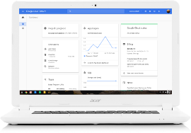
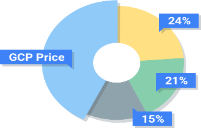

GCP Free Tier - Free Extended Trials and Always Free  |  Google Cloud Platform

 

#  Google Cloud Platform Free Tier

Learn and build on GCP for free.

 [Try It Free](https://console.cloud.google.com/freetrial)

12 Months

$300 free trial to get started with any GCP product.

+

Always Free

Free usage limits on participating products for eligible customers, during and after the free trial. Offer is subject to change.

 [Read the FAQ](https://cloud.google.com/free/docs/frequently-asked-questions)

Always Free Products

Use these products for free up to the specified usage limits during and past the free trial. These usage limits do not expire, but are subject to change. Available for eligible customers. [View details](https://cloud.google.com/free/docs/frequently-asked-questions)

   Google App Engine

Platform for building scalable web applications and mobile backends.

28

Instance hours per day

5 GB

Cloud Storage

 *expand_more*

   Google App Engine

**28** instance hours per day

**5** GB Cloud Storage

Shared memcache

**1000** search operations per day, 10 MB search indexing

**100** emails per day

 [Learn More](https://cloud.google.com/appengine/pricing)

   Google Cloud Datastore

Highly-scalable NoSQL database.

1 GB

Storage

 *expand_more*

   Google Cloud Datastore

**1** GB storage

**50,000** reads, **20,000** writes, **20,000** deletes per day

 [Learn More](https://cloud.google.com/datastore/pricing)

   Google Compute Engine

Scalable, high-performance virtual machines.

1

f1-micro instance per month

30

GB-months HDD

 *expand_more*

   Google Compute Engine

**1** f1-micro instance per month (US regions only)

**30** GB-months HDD, **5** GB-months snapshot

**1** GB network egress from North America to all region destinations per month (excluding China and Australia)

   Google Cloud Storage

Best in class performance, reliability, and pricing for all your storage needs.

5 GB-Months

Regional storage

 *expand_more*

   Google Cloud Storage

**5** GB-months of Regional Storage (US regions only)

**5000** Class A Operations per month

**50000** Class B Operations per month

**1** GB network egress from North America to all region destinations per month (excluding China and Australia)

   Google Cloud Pub/Sub

A global service for real-time and reliable messaging and streaming data.

10 GB

Messages per month

 *expand_more*

   Google Cloud Pub/Sub

**10** GB of messages per month

 [Learn More](https://cloud.google.com/pubsub/pricing)

   Google Cloud Functions

A serverless environment to build and connect cloud services with code.

2 million

Invocations per month

 *expand_more*

   Google Cloud Functions

**2 million** invocations per month (includes both background and HTTP invocations)

**400,000** GB-seconds memory, **200,000** GHz-seconds of compute time

**5** GB network egress per month

 [Learn More](https://cloud.google.com/functions/pricing)

   Google Container Engine

One-click container orchestration via Kubernetes clusters, managed by Google.

Basic Cluster

Sized 5 nodes or fewer

 *expand_more*

   Google Container Engine

Basic cluster of **5** nodes or fewer

The basic cluster is free but each node is charged at standard Compute Engine pricing

 [Learn More](https://cloud.google.com/container-engine/pricing)

   Google Stackdriver

Monitoring, logging, and diagnostics for applications on Cloud Platform and AWS.

5 GB

Logs with 7 day retention

 *expand_more*

   Google Stackdriver

**5** GB of logs with **7** day retention

Read access API

Basic email alerting

 [Learn More](https://cloud.google.com/stackdriver/pricing)

   Google BigQuery

Fully managed, petabyte scale, analytics data warehouse.

1 TB

Queries per month

 *expand_more*

   Google BigQuery

**1** TB of querying per month

 [Learn More](https://cloud.google.com/bigquery/public-data/)

   Google Cloud Vision API

Label detection, OCR, facial detection and more.

1000

Units per month

 *expand_more*

   Google Cloud Vision API

**1,000** units per month

 [Learn More](https://cloud.google.com/vision/pricing)

   Google Cloud Speech API

Speech to text transcription, the same that powers Google’s own products.

60

Minutes per month

 *expand_more*

   Google Cloud Speech API

**60** minutes per month

 [Learn More](https://cloud.google.com/speech/pricing)

   Google Cloud Natural Language API

Derive insights from unstructured text using Google machine learning.

5000

Units per month

 *expand_more*

   Google Cloud Natural Language API

**5,000** units per month

 [Learn More](https://cloud.google.com/natural-language/pricing)

   Google Cloud Shell

Manage your infrastructure and applications from the command-line in any browser.

Free

Access to Cloud Shell

5 GB

Persistent Disk

 *expand_more*

   Google Cloud Shell

Free access to Cloud Shell, including **5** GB of persistent disk storage

 [Learn More](https://cloud.google.com/shell/)

   Google Cloud Container Builder

Fast, consistent, reliable container builds on Google Cloud Platform.

120

Build-minutes per day

 *expand_more*

   Google Cloud Container Builder

**120** build-minutes per day

 [Learn More](https://cloud.google.com/container-builder/pricing)

   Google Cloud Source Repositories

Multiple private Git repositories hosted on Google Cloud Platform.

1 GB

Private hosting

 *expand_more*

   Google Cloud Source Repositories

Private hosting of up to **1** GB of storage

 [Learn More](https://cloud.google.com/source-repositories/pricing)

[View All Usage Limits](https://cloud.google.com/free/docs/always-free-usage-limits)

.
 

Getting Started

Already signed up? Start building what’s next using Google Cloud Platform
 [Learn More](https://cloud.google.com/getting-started/)
 .

Pricing that’s as smart as our products

Looking past the free tier? Google’s technical infrastructure is built to let you to do more with less. Our customer-friendly pricing is on average 60% less for many compute workloads compared to other cloud providers.

 [Learn More](https://cloud.google.com/pricing/)

 

Up to 60% savings

Sustained use discount

List price difference

Right sizing recommendations

Join the GCP Community

View step-by-step tutorials contributed by the GCP community.

 [View GCP Community](https://cloud.google.com/community/)

 [(L)](http://stackoverflow.com/questions/tagged/google-cloud-platform)  [(L)](https://plus.google.com/+googlecloud)  [(L)](https://twitter.com/googlecloud)  

GCP Free Tier

12 month, $300 free trial to get you started. Always Free* products to keep you going.

*Subject to change

 [Try It Free](https://console.cloud.google.com/freetrial)