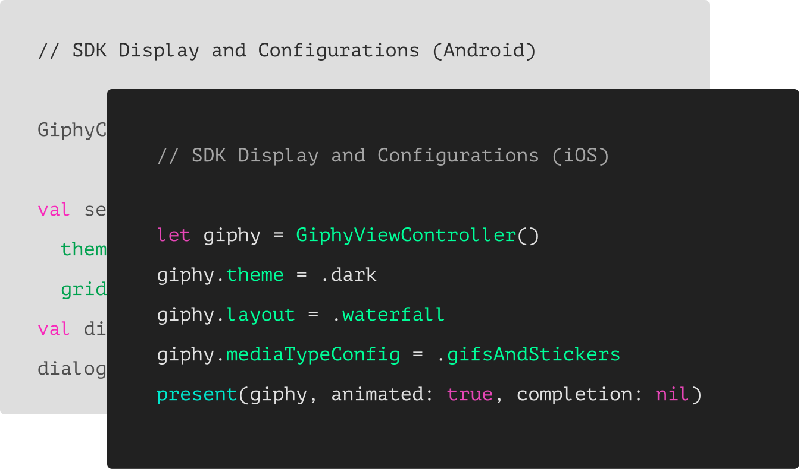

GIPHY Developers

# Start building with the power of GIPHY

GIPHY SDK helps you integrate the world's largest GIF library, customize a suite of powerful features, and boost engagement with just a few lines of code.

[Get Started](https://developers.giphy.com/docs/sdk)

' fill='%23FFFFFF'%3e%3cpath d='M161.155644%2c22.0219165 C161.052312%2c22.525036 160.874582%2c22.9641657 160.624105%2c23.3413054 C160.371976%2c23.718845 160.042967%2c24.0255959 159.63584%2c24.2587586 C159.229953%2c24.493921 158.723214%2c24.6119021 158.116863%2c24.6119021 C157.527872%2c24.6119021 157.025679%2c24.493921 156.610699%2c24.2587586 C156.194478%2c24.0255959 155.86175%2c23.718845 155.610033%2c23.3413054 C155.359971%2c22.9641657 155.17728%2c22.525036 155.064442%2c22.0219165 C154.952017%2c21.5195969 154.895804%2c21.0076788 154.895804%2c20.4897616 C154.895804%2c19.9518477 154.949123%2c19.4323308 155.052455%2c18.9308111 C155.155787%2c18.4276916 155.333931%2c17.9837626 155.584821%2c17.5966245 C155.835297%2c17.212286 156.165132%2c16.8979363 156.571846%2c16.6555751 C156.97732%2c16.412414 157.484472%2c16.2896337 158.091236%2c16.2896337 C158.679814%2c16.2896337 159.177047%2c16.412414 159.583348%2c16.6555751 C159.991715%2c16.8979363 160.323616%2c17.2154855 160.584013%2c17.6098224 C160.844822%2c18.0041593 161.030819%2c18.4528875 161.142831%2c18.9552072 C161.256909%2c19.4579267 161.311882%2c19.9698448 161.311882%2c20.4897616 C161.311882%2c21.0076788 161.259389%2c21.5195969 161.155644%2c22.0219165 Z M164.636272%2c17.9365701 C164.393649%2c17.0911054 164.021655%2c16.3488242 163.518635%2c15.7121261 C163.016443%2c15.0754279 162.385706%2c14.5639098 161.623944%2c14.1787714 C160.861355%2c13.7928331 159.951209%2c13.6008639 158.895158%2c13.6008639 C158.065197%2c13.6008639 157.302608%2c13.7592385 156.610699%2c14.0779875 C155.917549%2c14.3967365 155.346331%2c14.9078547 154.895804%2c15.6117421 L154.845378%2c15.6117421 L154.845378%2c13.9520077 L151.338297%2c13.9520077 L151.338297%2c31.5 L155.025589%2c31.5 L155.025589%2c25.3409854 L155.078081%2c25.3409854 C155.528195%2c25.9784834 156.104786%2c26.4596065 156.805376%2c26.7851544 C157.506379%2c27.1119021 158.273514%2c27.2766757 159.104715%2c27.2766757 C160.090913%2c27.2766757 160.951874%2c27.0907055 161.688836%2c26.7227644 C162.423732%2c26.3548232 163.039589%2c25.8597024 163.532275%2c25.2394017 C164.027028%2c24.6191009 164.393649%2c23.9076148 164.636272%2c23.1029435 C164.879722%2c22.2982723 165%2c21.4604063 165%2c20.5889458 C165%2c19.6674932 164.879722%2c18.7836346 164.636272%2c17.9365701 Z M146.45649%2c22.0219165 C146.351505%2c22.525036 146.173361%2c22.9641657 145.922885%2c23.3413054 C145.671995%2c23.718845 145.342987%2c24.0255959 144.934619%2c24.2587586 C144.529146%2c24.493921 144.02158%2c24.6119021 143.416055%2c24.6119021 C142.826651%2c24.6119021 142.326525%2c24.493921 141.910718%2c24.2587586 C141.494497%2c24.0255959 141.161769%2c23.718845 140.910466%2c23.3413054 C140.659163%2c22.9641657 140.477713%2c22.525036 140.364874%2c22.0219165 C140.251623%2c21.5195969 140.19665%2c21.0076788 140.19665%2c20.4897616 C140.19665%2c19.9518477 140.247076%2c19.4323308 140.350821%2c18.9308111 C140.45622%2c18.4276916 140.63271%2c17.9837626 140.884427%2c17.5966245 C141.134076%2c17.212286 141.463911%2c16.8979363 141.872279%2c16.6555751 C142.278166%2c16.412414 142.783252%2c16.2896337 143.390429%2c16.2896337 C143.978594%2c16.2896337 144.478306%2c16.412414 144.88378%2c16.6555751 C145.290494%2c16.8979363 145.624876%2c17.2154855 145.884032%2c17.6098224 C146.143188%2c18.0041593 146.329185%2c18.4528875 146.442024%2c18.9552072 C146.555275%2c19.4579267 146.609834%2c19.9698448 146.609834%2c20.4897616 C146.609834%2c21.0076788 146.559822%2c21.5195969 146.45649%2c22.0219165 Z M148.818655%2c15.7121261 C148.317289%2c15.0754279 147.684485%2c14.5639098 146.92231%2c14.1787714 C146.160135%2c13.7928331 145.252055%2c13.6008639 144.196417%2c13.6008639 C143.363976%2c13.6008639 142.602628%2c13.7592385 141.910718%2c14.0779875 C141.216328%2c14.3967365 140.64635%2c14.9078547 140.19665%2c15.6117421 L140.143744%2c15.6117421 L140.143744%2c13.9520077 L136.63625%2c13.9520077 L136.63625%2c31.5 L140.326848%2c31.5 L140.326848%2c25.3409854 L140.376861%2c25.3409854 C140.826561%2c25.9784834 141.403979%2c26.4596065 142.105808%2c26.7851544 C142.805158%2c27.1119021 143.57188%2c27.2766757 144.403494%2c27.2766757 C145.390933%2c27.2766757 146.251893%2c27.0907055 146.987615%2c26.7227644 C147.723751%2c26.3548232 148.338369%2c25.8597024 148.831881%2c25.2394017 C149.325807%2c24.6191009 149.692015%2c23.9076148 149.936705%2c23.1029435 C150.176848%2c22.2982723 150.299606%2c21.4604063 150.299606%2c20.5889458 C150.299606%2c19.6674932 150.176848%2c18.7836346 149.936705%2c17.9365701 C149.692015%2c17.0911054 149.320847%2c16.3488242 148.818655%2c15.7121261 Z M124.560484%2c20.0110382 L126.975967%2c13.4240921 L127.027633%2c13.4240921 L129.365825%2c20.0110382 L124.560484%2c20.0110382 Z M124.949424%2c9 L117.937742%2c26.9491281 L122.041254%2c26.9491281 L123.494926%2c22.9517677 L130.430556%2c22.9517677 L131.831735%2c26.9491281 L136.066685%2c26.9491281 L129.132295%2c9 L124.949424%2c9 Z M117.625267%2c21.2552392 C117.383057%2c20.8449048 117.062315%2c20.5013598 116.664281%2c20.2242041 C116.266247%2c19.9482483 115.810761%2c19.7258839 115.301128%2c19.5571109 C114.789429%2c19.3907375 114.265744%2c19.2495601 113.728832%2c19.1315789 C113.209693%2c19.0135978 112.699647%2c18.9048152 112.197455%2c18.8040314 C111.695262%2c18.7028475 111.248456%2c18.5900656 110.858688%2c18.4652856 C110.469334%2c18.3389058 110.154792%2c18.1765318 109.911756%2c17.9737642 C109.668719%2c17.7733963 109.548854%2c17.5142377 109.548854%2c17.1950888 C109.548854%2c16.9267317 109.616227%2c16.7131659 109.755518%2c16.5539914 C109.894396%2c16.3956167 110.063447%2c16.2736362 110.262257%2c16.1888498 C110.461894%2c16.1056631 110.680957%2c16.0516717 110.924407%2c16.0256759 C111.166617%2c16.0008799 111.392293%2c15.9892817 111.59937%2c15.9892817 C112.2578%2c15.9892817 112.829432%2c16.1100624 113.315091%2c16.3532235 C113.798684%2c16.5959846 114.06776%2c17.0611102 114.119013%2c17.7482003 L117.625267%2c17.7482003 C117.555828%2c16.943929 117.344205%2c16.2780355 116.988743%2c15.7489202 C116.634522%2c15.2218045 116.187715%2c14.7982723 115.65163%2c14.4803231 C115.115545%2c14.1619741 114.50506%2c13.9360102 113.819764%2c13.8016317 C113.136121%2c13.6672532 112.430985%2c13.6008639 111.704769%2c13.6008639 C110.976486%2c13.6008639 110.265977%2c13.6640538 109.575307%2c13.7884339 C108.880918%2c13.9144137 108.258034%2c14.1331787 107.704588%2c14.4427292 C107.149903%2c14.7526796 106.70475%2c15.175012 106.366235%2c15.7121261 C106.028133%2c16.2480403 105.859496%2c16.9359303 105.859496%2c17.7733963 C105.859496%2c18.3433051 105.981427%2c18.8260278 106.224051%2c19.2191649 C106.464607%2c19.6139018 106.786589%2c19.9394497 107.183383%2c20.1994081 C107.582657%2c20.4589666 108.037317%2c20.6693329 108.547776%2c20.8273076 C109.058648%2c20.9880819 109.582747%2c21.1256599 110.118419%2c21.2432411 C111.435693%2c21.5115981 112.461984%2c21.7787554 113.197293%2c22.0479123 C113.933429%2c22.3158695 114.30129%2c22.7178052 114.30129%2c23.2545193 C114.30129%2c23.5728683 114.223998%2c23.8356263 114.06776%2c24.0451928 C113.911522%2c24.255959 113.717259%2c24.4223324 113.483729%2c24.5483123 C113.248546%2c24.674692 112.988563%2c24.7670773 112.704194%2c24.8246681 C112.418171%2c24.8838586 112.144962%2c24.9134538 111.885393%2c24.9134538 C111.521665%2c24.9134538 111.171163%2c24.8710606 110.834302%2c24.787474 C110.495787%2c24.7034874 110.197365%2c24.5735082 109.937795%2c24.3975364 C109.678639%2c24.2215645 109.464949%2c23.9960006 109.300858%2c23.718845 C109.137594%2c23.4416893 109.053688%2c23.1121421 109.053688%2c22.7258039 L105.547847%2c22.7258039 C105.58298%2c23.5972644 105.785924%2c24.3223484 106.159158%2c24.900256 C106.529913%2c25.4785634 107.005652%2c25.9432891 107.58679%2c26.2956327 C108.166688%2c26.6471765 108.829665%2c26.8991361 109.575307%2c27.050312 C110.318469%2c27.2006879 111.080645%2c27.2766757 111.858526%2c27.2766757 C112.620702%2c27.2766757 113.369651%2c27.2046873 114.1062%2c27.0635098 C114.841922%2c26.9207327 115.495805%2c26.6731723 116.067437%2c26.3204287 C116.639895%2c25.9692849 117.101168%2c25.5041593 117.457043%2c24.9254519 C117.811264%2c24.3467445 117.988582%2c23.6304591 117.988582%2c22.7753959 C117.988582%2c22.1714926 117.867477%2c21.6659734 117.625267%2c21.2552392 Z M102.380108%2c10.056231 L98.691163%2c10.056231 L98.691163%2c13.9520077 L96.4583696%2c13.9520077 L96.4583696%2c16.3400256 L98.691163%2c16.3400256 L98.691163%2c24.0075988 C98.691163%2c24.662294 98.8048279%2c25.1894097 99.0292646%2c25.5913454 C99.2545279%2c25.9928811 99.56163%2c26.3048312 99.9509842%2c26.5223964 C100.340752%2c26.7399616 100.791278%2c26.8863382 101.302151%2c26.9615262 C101.81137%2c27.0367141 102.354895%2c27.074708 102.924873%2c27.074708 C103.289841%2c27.074708 103.661009%2c27.0655095 104.042923%2c27.050312 C104.422771%2c27.0331147 104.768726%2c27.0007199 105.081201%2c26.9491281 L105.081201%2c24.1835706 C104.907604%2c24.2175652 104.726153%2c24.243561 104.534782%2c24.2587586 C104.345065%2c24.2759558 104.145842%2c24.2847544 103.937938%2c24.2847544 C103.315054%2c24.2847544 102.899247%2c24.1835706 102.69093%2c23.9824028 C102.484266%2c23.7820349 102.380108%2c23.3792993 102.380108%2c22.7753959 L102.380108%2c16.3400256 L105.081201%2c16.3400256 L105.081201%2c13.9520077 L102.380108%2c13.9520077 L102.380108%2c10.056231 Z M91.8088523%2c21.9203327 C91.8088523%2c22.1231003 91.7877727%2c22.3910574 91.74396%2c22.7258039 C91.700974%2c23.0617501 91.5840024%2c23.3916973 91.3934585%2c23.718845 C91.2029147%2c24.0451928 90.9077991%2c24.3271477 90.5105917%2c24.5607103 C90.1125577%2c24.7962726 89.5496061%2c24.9134538 88.8217369%2c24.9134538 C88.5282746%2c24.9134538 88.2418389%2c24.8882579 87.9649097%2c24.8366661 C87.6875672%2c24.787474 87.4457708%2c24.6986882 87.2378672%2c24.5735082 C87.030377%2c24.4479283 86.8650461%2c24.2759558 86.7439413%2c24.0579907 C86.6236631%2c23.8400256 86.5620773%2c23.5728683 86.5620773%2c23.2545193 C86.5620773%2c22.9193729 86.6236631%2c22.6410174 86.7439413%2c22.4246521 C86.8650461%2c22.2074868 87.0258304%2c22.0267157 87.2250541%2c21.8839386 C87.4234511%2c21.7415614 87.6578076%2c21.6283795 87.926057%2c21.543993 C88.1943063%2c21.4604063 88.4662756%2c21.393617 88.7444447%2c21.3432251 C89.037907%2c21.294033 89.3330226%2c21.2508399 89.6264849%2c21.2172452 C89.9220138%2c21.1844505 90.2030763%2c21.1416573 90.4709123%2c21.0920653 C90.7399883%2c21.0416733 90.9904646%2c20.9780835 91.2248211%2c20.9028955 C91.4587642%2c20.8273076 91.6526147%2c20.7237242 91.8088523%2c20.5889458 L91.8088523%2c21.9203327 Z M95.4969706%2c24.0579907 L95.4969706%2c17.2962726 C95.4969706%2c16.5071988 95.3159333%2c15.8753 94.9509655%2c15.3981763 C94.5880642%2c14.9202528 94.1205912%2c14.5479123 93.5497864%2c14.2795553 C92.9773282%2c14.0111982 92.3449377%2c13.8308271 91.6526147%2c13.7392417 C90.960705%2c13.6468565 90.2762352%2c13.6008639 89.601272%2c13.6008639 C88.8572831%2c13.6008639 88.1161875%2c13.6716525 87.3812918%2c13.8144297 C86.6435028%2c13.9568069 85.9825926%2c14.1959686 85.3936014%2c14.5307151 C84.8050235%2c14.8658615 84.3185375%2c15.3105903 83.9399298%2c15.8629019 C83.5576022%2c16.4160134 83.3414321%2c17.1115022 83.2897662%2c17.949768 L86.9774711%2c17.949768 C87.0464968%2c17.2454807 87.2903598%2c16.7423612 87.7061669%2c16.4408095 C88.1211474%2c16.1392577 88.6919522%2c15.9892817 89.4198213%2c15.9892817 C89.7484164%2c15.9892817 90.0555185%2c16.0100784 90.3415409%2c16.0516717 C90.6267367%2c16.0940649 90.8784529%2c16.1764518 91.0950363%2c16.3028315 C91.3116198%2c16.4284115 91.4848038%2c16.6039834 91.6141753%2c16.831147 C91.74396%2c17.0571109 91.8088523%2c17.3634618 91.8088523%2c17.7482003 C91.8262121%2c18.1177412 91.7129604%2c18.3968965 91.4715774%2c18.5900656 C91.228541%2c18.7836346 90.9003592%2c18.9308111 90.4845521%2c19.0299952 C90.068745%2c19.1315789 89.5925921%2c19.2071669 89.0556801%2c19.2555591 C88.5183548%2c19.3071509 87.9735896%2c19.3755399 87.4201445%2c19.4579267 C86.8650461%2c19.5419133 86.315321%2c19.6550952 85.7709691%2c19.7974724 C85.2257906%2c19.9394497 84.7393045%2c20.1538154 84.3156442%2c20.43737 C83.8911572%2c20.7237242 83.5452023%2c21.1044633 83.2761264%2c21.5823868 C83.0082904%2c22.0603104 82.873959%2c22.6682131 82.873959%2c23.4048952 C82.873959%2c24.075188 82.9909306%2c24.6530955 83.2248738%2c25.1386178 C83.4584036%2c25.6261398 83.7828655%2c26.0268757 84.1990859%2c26.3456247 C84.6144797%2c26.6643737 85.0993125%2c26.8991361 85.6531709%2c27.050312 C86.206616%2c27.2006879 86.804287%2c27.2766757 87.4457708%2c27.2766757 C88.2765584%2c27.2766757 89.0908129%2c27.1586946 89.8860544%2c26.925132 C90.6829491%2c26.6887698 91.3760988%2c26.2796353 91.96509%2c25.6921293 C91.9824498%2c25.9100944 92.0126226%2c26.1244601 92.0551953%2c26.3332267 C92.0985947%2c26.5419933 92.1552205%2c26.7487602 92.2246595%2c26.9491281 L95.9652703%2c26.9491281 C95.7920862%2c26.6823708 95.6697414%2c26.2796353 95.6015424%2c25.7425212 C95.5312768%2c25.2066069 95.4969706%2c24.6462966 95.4969706%2c24.0579907 Z M80.3026507%2c15.0702288 C79.9393362%2c14.6095025 79.4412769%2c14.2495601 78.8101263%2c13.9892017 C78.1773225%2c13.7308431 77.3680279%2c13.6008639 76.3814159%2c13.6008639 C75.6886796%2c13.6008639 74.9789969%2c13.7720365 74.2507144%2c14.1163814 C73.5240852%2c14.4591265 72.9264142%2c15.0086386 72.4593545%2c15.7633179 L72.3812356%2c15.7633179 L72.3812356%2c9 L68.6931173%2c9 L68.6931173%2c26.9491281 L72.3812356%2c26.9491281 L72.3812356%2c20.1362182 C72.3812356%2c18.81243 72.6060856%2c17.8621821 73.0566122%2c17.2826748 C73.5063122%2c16.7055671 74.233768%2c16.4160134 75.2385663%2c16.4160134 C76.1210198%2c16.4160134 76.7360506%2c16.6795713 77.0824188%2c17.2082867 C77.428787%2c17.7358023 77.6015577%2c18.5364742 77.6015577%2c19.6083027 L77.6015577%2c26.9491281 L81.2900893%2c26.9491281 L81.2900893%2c18.9552072 C81.2900893%2c18.1509359 81.2161038%2c17.4182531 81.0693726%2c16.7547592 C80.9218148%2c16.0940649 80.666792%2c15.5321549 80.3026507%2c15.0702288 Z M60.8229548%2c21.3684211 L60.7721156%2c21.3684211 L57.6031362%2c9 L53.7852332%2c9 L50.5641746%2c21.2172452 L50.5125087%2c21.2172452 L47.5770592%2c9 L43.5%2c9 L48.4086734%2c26.9491281 L52.5386384%2c26.9491281 L55.6290856%2c14.731483 L55.6807515%2c14.731483 L58.8236913%2c26.9491281 L62.8755375%2c26.9491281 L67.8623297%2c9 L63.8629761%2c9 L60.8229548%2c21.3684211 Z' id='Fill-15'%3e%3c/path%3e%3cg id='Group' transform='translate(0.000000%2c -0.000000)'%3e%3cpath d='M26.0487971%2c21.1534165 C25.6044294%2c20.934759 23.4191405%2c19.8774097 23.0117073%2c19.7317641 C22.604274%2c19.5857402 22.3080289%2c19.5127282 22.0117837%2c19.9504216 C21.7151538%2c20.3877368 20.8633529%2c21.3724524 20.6040422%2c21.6637436 C20.3451162%2c21.9557914 20.0858055%2c21.9921082 19.6410531%2c21.773829 C19.1966854%2c21.5547931 17.7643209%2c21.0932668 16.0668747%2c19.6038986 C14.7453135%2c18.4455431 13.8531155%2c17.0140549 13.5938048%2c16.5763615 C13.3344941%2c16.1390464 13.5664887%2c15.9026087 13.7888649%2c15.6843294 C13.9889266%2c15.4887482 14.2332326%2c15.1740024 14.4556089%2c14.919028 C14.6779851%2c14.663297 14.751854%2c14.4813346 14.8999766%2c14.1892867 C15.0480991%2c13.8979955 14.9742302%2c13.6422645 14.8630421%2c13.423607 C14.751854%2c13.2049494 13.8627338%2c11.0535558 13.4926198%2c10.1789255 C13.1317393%2c9.326615 12.7654726%2c9.44161828 12.4923115%2c9.42875608 C12.2333855%2c9.41551557 11.9367557%2c9.41286746 11.6405105%2c9.41286746 C11.3442654%2c9.41286746 10.8625785%2c9.52257454 10.4551452%2c9.95988966 C10.0477119%2c10.3972048 8.89966582%2c11.4549324 8.89966582%2c13.6059477 C8.89966582%2c15.7573414 10.4924644%2c17.8353448 10.7144559%2c18.1273926 C10.9368321%2c18.4186838 13.8488834%2c22.8338263 18.3079499%2c24.7268409 C19.3682767%2c25.1770183 20.1962242%2c25.4456115 20.8418078%2c25.6472455 C21.9063666%2c25.9797714 22.8755114%2c25.9328622 23.6415167%2c25.820507 C24.4952414%2c25.6949113 26.2711733%2c24.7631578 26.6416721%2c23.7421253 C27.0117862%2c22.7214712 27.0117862%2c21.8464626 26.9009828%2c21.6637436 C26.7897947%2c21.4817812 26.4935495%2c21.3724524 26.0487971%2c21.1534165 Z' id='Path'%3e%3c/path%3e%3cpath d='M17.9386053%2c0 C22.6973796%2c0.00226980166 27.1637561%2c1.82378563 30.5224835%2c5.13013004 C33.8812109%2c8.43609615 35.7298576%2c12.8311888 35.7279339%2c17.5047104 C35.7240866%2c27.1490976 27.7427807%2c34.9961802 17.9386053%2c34.9961802 L17.9316801%2c34.9961802 C14.9542241%2c34.9950453 12.0287071%2c34.2607645 9.43059868%2c32.8674846 L5.68434189e-14%2c35.299577 L2.52385474%2c26.2351241 C0.96722116%2c23.5828609 0.148122572%2c20.5734822 0.149276774%2c17.4907133 C0.153124114%2c7.84632602 8.13327579%2c0 17.9386053%2c0 Z M17.9386053%2c32.0420334 C26.08804%2c32.0420334 32.7212381%2c25.5201366 32.7243159%2c17.5035755 C32.7258549%2c13.6188099 31.1892274%2c9.96594247 28.3979826%2c7.21834756 C25.6059683%2c4.46999606 21.8936704%2c2.95566006 17.9443763%2c2.95452515 C9.78878599%2c2.95452515 3.15597262%2c9.47604361 3.15289475%2c17.4918482 C3.15174055%2c20.2386865 3.93351995%2c22.914026 5.41320673%2c25.2292237 L5.76485357%2c25.7792723 L4.27131636%2c31.1439485 L9.86727172%2c29.700733 L10.4074382%2c30.0154788 C12.6773685%2c31.3399081 15.279709%2c32.0412768 17.9328343%2c32.0420334 L17.9386053%2c32.0420334 Z' id='Combined-Shape'%3e%3c/path%3e%3c/g%3e%3c/g%3e%3c/g%3e%3c/svg%3e)' fill='%23FFFFFF'%3e%3cpath d='M8.49146667%2c1.1554188 C8.988%2c1.07022222 18.5929333%2c1.12478632 19.5738667%2c1.12478632 C20.3625333%2c1.12478632 22.5502667%2c1.03001709 23.142%2c1.2482735 C24.0184%2c1.57182906 24.3646667%2c2.43432479 24.8369333%2c3.30352137 C25.2681333%2c4.09709402 25.7376%2c4.87917949 26.1772%2c5.68041026 L28.462%2c9.72868376 C28.4657333%2c9.73634188 28.4704%2c9.74591453 28.4750667%2c9.75261538 C28.4788%2c9.7602735 28.4834667%2c9.76984615 28.4872%2c9.77654701 C29.2208%2c11.1368205 30.1130667%2c12.637812 30.8877333%2c14.0363761 C31.5326667%2c15.2004103 31.3310667%2c15.7403077 30.7113333%2c16.8105299 L28.6953333%2c20.3887863 C27.3466667%2c22.7484444 26.0194667%2c25.1932991 24.6605333%2c27.5433846 C24.1733333%2c28.386735 23.8961333%2c29.1860513 22.7910667%2c29.3832479 C22.3150667%2c29.4684444 12.6634667%2c29.4129231 11.7002667%2c29.4129231 C10.9069333%2c29.4129231 8.736%2c29.506735 8.1368%2c29.2913504 C7.6664%2c29.1219145 7.3304%2c28.7974017 7.11573333%2c28.4393846 C6.87773333%2c28.0411624 6.67053333%2c27.6467692 6.4372%2c27.2428034 L1.06306667%2c17.7094017 C0.564666667%2c16.8009573 -0.0821333333%2c15.9844103 0.0084%2c15.054906 C0.0746666667%2c14.3723761 0.882933333%2c13.1671795 1.23386667%2c12.5277265 C2.54613333%2c10.1393504 3.93306667%2c7.77682051 5.26866667%2c5.37408547 C5.7064%2c4.58721368 6.1544%2c3.78598291 6.60706667%2c2.99336752 C7.09986667%2c2.13087179 7.37333333%2c1.34687179 8.49146667%2c1.1554188 Z M9.91666667%2c13.154735 C9.48173333%2c13.154735 9.1252%2c13.5204103 9.1252%2c13.967453 C9.1252%2c14.4135385 9.48173333%2c14.7792137 9.91666667%2c14.7792137 L21.3696%2c14.7792137 C21.8054667%2c14.7792137 22.162%2c14.4135385 22.162%2c13.967453 C22.162%2c13.5204103 21.8054667%2c13.154735 21.3696%2c13.154735 L9.91666667%2c13.154735 Z M11.3362667%2c10.5538462 C10.9004%2c10.5538462 10.5438667%2c10.9195214 10.5438667%2c11.3665641 C10.5438667%2c11.8126496 10.9004%2c12.1783248 11.3362667%2c12.1783248 L19.9612%2c12.1783248 C20.3961333%2c12.1783248 20.7526667%2c11.8126496 20.7526667%2c11.3665641 C20.7526667%2c10.9195214 20.3961333%2c10.5538462 19.9612%2c10.5538462 L11.3362667%2c10.5538462 Z M12.7353333%2c7.96157265 C12.2994667%2c7.96157265 11.9429333%2c8.32724786 11.9429333%2c8.77333333 C11.9429333%2c9.22037607 12.2994667%2c9.58605128 12.7353333%2c9.58605128 L18.5518667%2c9.58605128 C18.9868%2c9.58605128 19.3433333%2c9.22037607 19.3433333%2c8.77333333 C19.3433333%2c8.32724786 18.9868%2c7.96157265 18.5518667%2c7.96157265 L12.7353333%2c7.96157265 Z M11.3362667%2c17.3801026 L19.9612%2c17.3801026 C20.3961333%2c17.3801026 20.7526667%2c17.0144274 20.7526667%2c16.5683419 C20.7526667%2c16.1212991 20.3961333%2c15.7556239 19.9612%2c15.7556239 L11.3362667%2c15.7556239 C10.9004%2c15.7556239 10.5438667%2c16.1212991 10.5438667%2c16.5683419 C10.5438667%2c17.0144274 10.9004%2c17.3801026 11.3362667%2c17.3801026 Z M13.1450667%2c19.9723761 L18.1365333%2c19.9723761 C18.5714667%2c19.9723761 18.928%2c19.6067009 18.928%2c19.1606154 C18.928%2c18.7135726 18.5714667%2c18.3478974 18.1365333%2c18.3478974 L13.1450667%2c18.3478974 C12.7092%2c18.3478974 12.3526667%2c18.7135726 12.3526667%2c19.1606154 C12.3526667%2c19.6067009 12.7092%2c19.9723761 13.1450667%2c19.9723761 Z M14.5553333%2c22.5799658 L16.7281333%2c22.5799658 C17.1649333%2c22.5799658 17.5205333%2c22.2142906 17.5205333%2c21.7682051 C17.5205333%2c21.3211624 17.1649333%2c20.9554872 16.7281333%2c20.9554872 L14.5553333%2c20.9554872 C14.1194667%2c20.9554872 13.7629333%2c21.3211624 13.7629333%2c21.7682051 C13.7629333%2c22.2142906 14.1194667%2c22.5799658 14.5553333%2c22.5799658 Z' id='Combined-Shape'%3e%3c/path%3e%3cg id='Group' transform='translate(40.500000%2c 1.523810)'%3e%3cpath d='M3.72966364%2c1.65774359 L3.72966364%2c10.6158291 C5.28169091%2c9.26895726 7.25540455%2c8.4648547 9.43580909%2c8.4648547 C14.6021591%2c8.4648547 18.6031045%2c11.8755897 18.6031045%2c18.5333675 C18.6031045%2c25.1911453 14.52465%2c28.6554872 9.46256818%2c28.6554872 C7.29785%2c28.6554872 5.30383636%2c27.8207521 3.72966364%2c26.4317607 L3.72966364%2c26.9438974 C3.72966364%2c29.153265 -1.77635684e-14%2c29.153265 -1.77635684e-14%2c26.9438974 L-1.77635684e-14%2c1.65774359 C-1.77635684e-14%2c-0.552581197 3.72966364%2c-0.552581197 3.72966364%2c1.65774359 Z M3.72966364%2c14.1557949 L3.72966364%2c23.029641 C4.95043182%2c24.3056752 6.73314091%2c25.1911453 8.48447727%2c25.1911453 C11.9530091%2c25.1911453 14.7285727%2c22.9358291 14.7285727%2c18.5333675 C14.7285727%2c14.130906 11.9530091%2c11.8755897 8.48447727%2c11.8755897 C6.77097273%2c11.8755897 4.94950909%2c12.8510427 3.72966364%2c14.1557949 L3.72966364%2c14.1557949 Z' id='Fill-8'%3e%3c/path%3e%3cpath d='M84.3059%2c1.65774359 L84.3059%2c10.6158291 C85.8662318%2c9.268 87.8491727%2c8.4648547 90.04065%2c8.4648547 C95.2319136%2c8.4648547 99.2522364%2c11.8755897 99.2522364%2c18.5333675 C99.2522364%2c25.1911453 95.1544045%2c28.6554872 90.0664864%2c28.6554872 C87.8916182%2c28.6554872 85.8874545%2c27.8207521 84.3059%2c26.4317607 L84.3059%2c26.9438974 C84.3059%2c29.153265 80.5577818%2c29.153265 80.5577818%2c26.9438974 L80.5577818%2c1.65774359 C80.5577818%2c-0.552581197 84.3059%2c-0.552581197 84.3059%2c1.65774359 Z M84.3059%2c14.1557949 L84.3059%2c23.029641 C85.5322045%2c24.3056752 87.3232182%2c25.1911453 89.0837818%2c25.1911453 C92.5689227%2c25.1911453 95.3583273%2c22.9358291 95.3583273%2c18.5333675 C95.3583273%2c14.130906 92.5689227%2c11.8755897 89.0837818%2c11.8755897 C87.3619727%2c11.8755897 85.5312818%2c12.8510427 84.3059%2c14.1557949 L84.3059%2c14.1557949 Z' id='Fill-9'%3e%3c/path%3e%3cpath d='M24.97915%2c10.3793846 L24.9643864%2c19.7213333 C24.9643864%2c23.2115214 26.3263318%2c25.0025641 29.5291182%2c25.0025641 C32.3701955%2c25.0025641 33.9416%2c22.8927521 34.5072318%2c21.8388034 L34.5072318%2c10.3793846 C34.5072318%2c9.24023932 35.4585636%2c8.46006838 36.4191227%2c8.4485812 C37.3981364%2c8.43805128 38.3873%2c9.21822222 38.3873%2c10.3793846 L38.3873%2c23.4632821 C38.3873%2c24.9518291 39.0747318%2c25.284 39.8027636%2c25.284 C40.4948091%2c25.284 40.8952727%2c24.9968205 41.4295318%2c25.0140513 C42.6272318%2c24.9958632 43.3405%2c26.5973675 42.2932045%2c27.5546325 C41.5697864%2c28.2046154 39.96055%2c28.6535726 38.3845318%2c28.6535726 C36.5649136%2c28.6535726 35.2352636%2c27.7901197 34.7305318%2c25.7655043 C33.2514%2c27.7728889 30.66315%2c28.6535726 28.3821682%2c28.6535726 C24.8730364%2c28.6535726 21.0990818%2c27.1621538 21.0990818%2c19.4398974 L21.0990818%2c10.3793846 C21.0990818%2c9.24023932 22.0504136%2c8.46006838 23.0109727%2c8.4485812 C23.9899864%2c8.43805128 24.97915%2c9.21822222 24.97915%2c10.3793846' id='Fill-10'%3e%3c/path%3e%3cpath d='M48.4090409%2c10.3793846 L48.4090409%2c11.5328889 C49.7534545%2c9.49391453 52.2245182%2c8.37487179 54.4095364%2c8.37487179 C57.0171636%2c8.37487179 59.6404773%2c9.12345299 60.8169545%2c12.4202735 C62.0294182%2c9.87299145 64.7394682%2c8.37774359 67.2114545%2c8.37774359 C70.4133182%2c8.37774359 73.7914227%2c9.88447863 74.3589%2c15.6864615 C74.4760864%2c16.6207521 74.4843909%2c22.0800342 74.4945409%2c23.4632821 C74.4945409%2c24.9518291 75.1819727%2c25.284 75.9100045%2c25.284 C76.6011273%2c25.284 77.0025136%2c24.9968205 77.5367727%2c25.0140513 C78.7344727%2c24.9958632 79.2318227%2c26.7160684 78.2445045%2c27.617812 C77.5210864%2c28.2677949 76.0677909%2c28.6535726 74.49085%2c28.6535726 C72.0133273%2c28.6535726 70.6144727%2c27.2186325 70.6144727%2c23.7112137 L70.6144727%2c17.1147009 C70.4852909%2c13.8829744 68.8456045%2c12.0373675 66.2462818%2c12.0373675 C63.4052045%2c12.0373675 61.8162682%2c14.5099829 61.4591727%2c15.9688547 L61.4591727%2c28.2945983 L57.6307773%2c28.2945983 L57.6307773%2c17.042906 C57.5015955%2c13.8829744 55.8619091%2c12.0373675 53.2635091%2c12.0373675 C50.4224318%2c12.0373675 48.8704045%2c14.6171966 48.4090409%2c15.9956581 L48.4090409%2c28.2945983 L44.5298955%2c28.2945983 L44.5298955%2c10.3793846 C44.5298955%2c9.24119658 45.4812273%2c8.46006838 46.4408636%2c8.4485812 C47.4208%2c8.43805128 48.4090409%2c9.21917949 48.4090409%2c10.3793846' id='Fill-11'%3e%3c/path%3e%3cpath d='M105.861732%2c22.7673504 C105.861732%2c24.9384274 106.905336%2c25.284 107.817914%2c25.284 C108.509036%2c25.284 108.9095%2c24.9968205 109.444682%2c25.0140513 C110.74665%2c24.966188 111.319664%2c26.6557607 110.321273%2c27.5689915 C109.596932%2c28.2189744 107.7118%2c28.6535726 106.135782%2c28.6535726 C103.723773%2c28.6535726 102.132068%2c26.8098803 102.132068%2c24.3391795 L102.132068%2c1.65774359 C102.132068%2c-0.552581197 105.861732%2c-0.552581197 105.861732%2c1.65774359 L105.861732%2c22.7673504' id='Fill-12'%3e%3c/path%3e%3cpath d='M115.095464%2c16.7490256 L125.691141%2c16.7490256 C125.924591%2c12.7744615 123.415695%2c11.5807521 120.758241%2c11.5807521 C117.792595%2c11.5807521 115.596505%2c13.5144274 115.095464%2c16.7490256 Z M128.873627%2c19.8687521 L115.047482%2c19.8687521 C115.389814%2c23.2603419 117.324773%2c25.475453 121.656977%2c25.475453 C123.957336%2c25.475453 126.101755%2c24.2511111 127.174886%2c23.654735 C128.604191%2c22.8602051 130.076864%2c24.9317265 128.789659%2c26.2680684 C127.31145%2c27.8025641 124.157568%2c28.7866325 121.098727%2c28.7866325 C115.282777%2c28.7866325 111.153573%2c25.3261197 111.153573%2c18.6683419 C111.153573%2c12.0105641 115.516227%2c8.29350427 120.812682%2c8.29350427 C123.703586%2c8.29350427 126.009482%2c9.08611966 127.543055%2c11.0494701 C128.978818%2c12.8883761 129.809273%2c15.381094 128.873627%2c19.8687521 L128.873627%2c19.8687521 Z' id='Fill-13'%3e%3c/path%3e%3c/g%3e%3c/g%3e%3c/g%3e%3c/svg%3e)' fill='%23FFFFFF'%3e%3cpath d='M11.1537368%2c4.42881533 C9.47564197%2c4.42881533 8.98932352%2c5.19271777 8.98932352%2c6.87242741 L8.98932352%2c9.6595935 L13.4665462%2c9.6595935 L13.0190543%2c14.1665505 L8.98932352%2c14.1665505 L8.98932352%2c27.8373055 L3.61744593%2c27.8373055 L3.61744593%2c14.1665505 L0%2c14.1665505 L0%2c9.6595935 L3.61744593%2c9.6595935 L3.61744593%2c6.94821138 C3.61744593%2c2.40555168 5.40872987%2c0 10.4074781%2c0 C11.4896848%2c0 12.7571399%2c0.0757839721 13.5405798%2c0.189965157 L13.5405798%2c4.42881533' id='Fill-14'%3e%3c/path%3e%3cpath d='M19.2112241%2c19.3973287 C19.2112241%2c22.1087108 20.1818868%2c23.901928 22.6802738%2c23.901928 C24.8818684%2c23.901928 26.0009273%2c22.2606156 26.0009273%2c19.6654355 L26.0009273%2c17.8314634 C26.0009273%2c15.2342625 24.8818684%2c13.5926132 22.6802738%2c13.5926132 C20.1818868%2c13.5926132 19.2112241%2c15.3881882 19.2112241%2c18.0995703 L19.2112241%2c19.3973287 Z M13.8393465%2c18.1756911 C13.8393465%2c13.0968177 16.1893373%2c9.27764228 21.113723%2c9.27764228 C23.7996618%2c9.27764228 25.4402462%2c10.691266 26.2236861%2c12.4467596 L26.2236861%2c9.6595935 L31.3728049%2c9.6595935 L31.3728049%2c27.8349477 L26.2236861%2c27.8349477 L26.2236861%2c25.087863 C25.4774275%2c26.8436934 23.7996618%2c28.2172358 21.113723%2c28.2172358 C16.1893373%2c28.2172358 13.8393465%2c24.4000813 13.8393465%2c19.3212079 L13.8393465%2c18.1756911 Z' id='Fill-16'%3e%3c/path%3e%3cpath d='M42.5614197%2c9.27764228 C44.6491671%2c9.27764228 46.6283318%2c9.73537747 47.7082352%2c10.4992799 L46.5148136%2c14.3942393 C45.6941924%2c13.9745645 44.3523746%2c13.5545528 42.93422%2c13.5545528 C40.0238771%2c13.5545528 38.756093%2c15.2719861 38.756093%2c18.2134146 L38.756093%2c19.2811266 C38.756093%2c22.2225552 40.0238771%2c23.9399884 42.93422%2c23.9399884 C44.3523746%2c23.9399884 45.6941924%2c23.5199768 46.5148136%2c23.100302 L47.7082352%2c26.9952613 C46.6283318%2c27.7591638 44.6491671%2c28.2172358 42.5614197%2c28.2172358 C36.258035%2c28.2172358 33.3845444%2c24.7419512 33.3845444%2c19.1672822 L33.3845444%2c18.327259 C33.3845444%2c12.7529268 36.258035%2c9.27764228 42.5614197%2c9.27764228' id='Fill-17'%3e%3c/path%3e%3cpath d='M53.7891901%2c17.0678978 L60.2801266%2c17.0678978 L60.2801266%2c16.6101626 C60.2801266%2c14.6242857 59.4966866%2c13.0587573 57.1466958%2c13.0587573 C54.7206972%2c13.0587573 53.7891901%2c14.6242857 53.7891901%2c17.0678978 M48.4173125%2c19.4353891 L48.4173125%2c17.8318002 C48.4173125%2c12.6771429 51.2884998%2c9.27764228 57.1466958%2c9.27764228 C62.6669696%2c9.27764228 65.090994%2c12.7148664 65.090994%2c17.7556794 L65.090994%2c20.6570267 L53.7891901%2c20.6570267 C53.900405%2c23.1407201 54.9826116%2c24.2461556 57.9673171%2c24.2461556 C59.9810308%2c24.2461556 62.1082628%2c23.826144 63.6748136%2c23.1407201 L64.6435021%2c26.9194774 C63.2276507%2c27.6833798 60.3169788%2c28.2549593 57.742584%2c28.2549593 C50.954855%2c28.2549593 48.4173125%2c24.7820325 48.4173125%2c19.4353891' id='Fill-18'%3e%3c/path%3e%3cpath d='M79.6394179%2c18.059489 C79.6394179%2c15.5000116 78.6687552%2c13.5926132 76.0963346%2c13.5926132 C73.89474%2c13.5926132 72.7013185%2c15.1962021 72.7013185%2c17.7913821 L72.7013185%2c19.7011382 C72.7013185%2c22.2983391 73.89474%2c23.901928 76.0963346%2c23.901928 C78.6687552%2c23.901928 79.6394179%2c21.9925087 79.6394179%2c19.4330314 L79.6394179%2c18.059489 Z M85.0112954%2c19.319187 C85.0112954%2c24.3977236 82.6244524%2c28.2172358 77.6997377%2c28.2172358 C75.0141279%2c28.2172358 73.1484814%2c26.8413357 72.4022227%2c25.085842 L72.4022227%2c27.8349477 L67.3294409%2c27.8349477 L67.3294409%2c0.531498258 L72.7013185%2c0.0357026713 L72.7013185%2c12.1786527 C73.4844294%2c10.5754007 75.1993764%2c9.27764228 77.6997377%2c9.27764228 C82.6244524%2c9.27764228 85.0112954%2c13.0944599 85.0112954%2c18.1733333 L85.0112954%2c19.319187 Z' id='Fill-19'%3e%3c/path%3e%3cpath d='M99.1102531%2c17.9075842 C99.1102531%2c15.5020325 98.1392614%2c13.5926132 95.6412034%2c13.5926132 C93.1408422%2c13.5926132 92.1721537%2c15.5020325 92.1721537%2c17.9075842 L92.1721537%2c19.586957 C92.1721537%2c21.9925087 93.1408422%2c23.901928 95.6412034%2c23.901928 C98.1392614%2c23.901928 99.1102531%2c21.9925087 99.1102531%2c19.586957 L99.1102531%2c17.9075842 Z M86.8002761%2c19.2053426 L86.8002761%2c18.2895354 C86.8002761%2c13.0587573 89.7086447%2c9.27764228 95.6412034%2c9.27764228 C101.571459%2c9.27764228 104.481802%2c13.0587573 104.481802%2c18.2895354 L104.481802%2c19.2053426 C104.481802%2c24.4381417 101.571459%2c28.2172358 95.6412034%2c28.2172358 C89.7086447%2c28.2172358 86.8002761%2c24.4381417 86.8002761%2c19.2053426 L86.8002761%2c19.2053426 Z' id='Fill-20'%3e%3c/path%3e%3cpath d='M118.581088%2c17.9075842 C118.581088%2c15.5020325 117.610097%2c13.5926132 115.112039%2c13.5926132 C112.611677%2c13.5926132 111.64266%2c15.5020325 111.64266%2c17.9075842 L111.64266%2c19.586957 C111.64266%2c21.9925087 112.611677%2c23.901928 115.112039%2c23.901928 C117.610097%2c23.901928 118.581088%2c21.9925087 118.581088%2c19.586957 L118.581088%2c17.9075842 Z M106.271111%2c19.2053426 L106.271111%2c18.2895354 C106.271111%2c13.0587573 109.17948%2c9.27764228 115.112039%2c9.27764228 C121.042294%2c9.27764228 123.952637%2c13.0587573 123.952637%2c18.2895354 L123.952637%2c19.2053426 C123.952637%2c24.4381417 121.042294%2c28.2172358 115.112039%2c28.2172358 C109.17948%2c28.2172358 106.271111%2c24.4381417 106.271111%2c19.2053426 L106.271111%2c19.2053426 Z' id='Fill-21'%3e%3c/path%3e%3cpolyline id='Fill-22' points='131.336254 18.327259 136.633769 9.6595935 142.341266 9.6595935 136.782165 18.6334262 142.564024 27.8349477 136.858502 27.8349477 131.336254 18.9395935 131.336254 27.8349477 125.964376 27.8349477 125.964376 0.533855981 131.336254 0.0357026713'%3e%3c/polyline%3e%3c/g%3e%3c/g%3e%3c/svg%3e)' fill='%23FFFFFF'%3e%3cpath d='M159.631804%2c12.9936443 C158.551411%2c5.98834203 146.060589%2c1.52578723 127.394309%2c0.467898836 C103.9416%2c-0.861225211 56.8091321%2c4.94085909 26.1290415%2c17.8810887 C26.7900528%2c17.7402682 27.5107774%2c17.6757543 28.2669132%2c17.6757543 C30.619683%2c17.6757543 33.8816906%2c18.2522168 33.8816906%2c21.8677672 L33.8816906%2c23.036994 L29.7347472%2c23.036994 C29.7347472%2c23.036994 29.7347472%2c22.3158956 29.7347472%2c22.0082409 C29.7347472%2c21.1012316 29.1605283%2c20.4987555 28.1874113%2c20.4987555 C27.1386113%2c20.4987555 26.7775547%2c21.0901325 26.6643774%2c21.6190767 C26.6199396%2c21.8011722 26.6001509%2c22.1539173 26.68%2c22.4889731 C27.154234%2c24.4379157 33.4647396%2c25.4701373 34.1656755%2c28.9597816 C34.2326792%2c29.311833 34.3840453%2c30.2458964 34.1854642%2c31.6794219 C33.7820528%2c34.461495 31.312634%2c35.4864328 28.3061434%2c35.4864328 C25.1795321%2c35.4864328 22.2570566%2c34.3681927 22.2570566%2c30.6513625 L22.2570566%2c29.3808559 L26.7237434%2c29.3808559 L26.7265208%2c30.9805219 C26.7265208%2c31.8889185 27.3486491%2c32.4945163 28.3901585%2c32.4945163 C29.5028377%2c32.4945163 29.8777811%2c31.9277656 30.012483%2c31.3703798 C30.0954566%2c31.058216 30.1437132%2c30.5441863 29.9812377%2c30.1428824 C29.1223396%2c27.994155 23.2100377%2c27.0097985 22.4875774%2c23.6106817 C22.3132981%2c22.7716548 22.3327396%2c22.1168045 22.4559849%2c21.3693456 C22.6375547%2c20.2514524 23.1541434%2c19.4280337 23.9047245%2c18.8463685 C16.2416453%2c22.2583187 9.72526792%2c26.1392084 5.03951698%2c30.4925058 C1.43485283%2c33.8413296 -0.396815094%2c37.0479454 0.0742943396%2c40.1054163 C0.914792453%2c45.5585709 7.17704151%2c48.6122264 16.2551849%2c50.6125026 C31.1359245%2c53.8909161 56.1460377%2c53.4275263 81.3724377%2c49.4460506 C100.598008%2c46.4111248 119.920438%2c41.3807788 134.65363%2c34.9824617 C134.045736%2c35.1014308 133.39757%2c35.155886 132.732392%2c35.155886 C129.788392%2c35.155886 127.157192%2c34.0816957 126.885358%2c31.0498916 C126.829117%2c30.4918121 126.81766%2c30.255955 126.81766%2c29.9531562 L126.81766%2c22.9638089 C126.81766%2c22.6585821 126.868347%2c22.1490614 126.901675%2c21.8632581 C127.26794%2c18.7548005 129.788045%2c17.7583043 132.742808%2c17.7583043 C135.691668%2c17.7583043 138.262808%2c18.746823 138.578385%2c21.8632581 C138.629072%2c22.3942834 138.608936%2c22.9638089 138.608936%2c22.9638089 L138.608936%2c23.5100955 L134.418943%2c23.5100955 L134.418943%2c22.5864376 C134.418943%2c22.5864376 134.418943%2c22.18444 134.366868%2c21.9458081 C134.295004%2c21.5836981 133.979774%2c20.7408559 132.708785%2c20.7408559 C131.492649%2c20.7408559 131.132634%2c21.5410357 131.052438%2c21.9458081 C130.993419%2c22.1674444 130.977102%2c22.4622658 130.977102%2c22.7310735 L130.977102%2c30.3284464 C130.977102%2c30.5445331 130.988906%2c30.7744938 131.021887%2c30.9607515 C131.092709%2c31.4102674 131.511049%2c32.1736813 132.717117%2c32.1736813 C133.924226%2c32.1736813 134.350204%2c31.4102674 134.418943%2c30.9607515 C134.454008%2c30.7744938 134.4672%2c30.5445331 134.462687%2c30.3284464 L134.462687%2c27.9227041 L132.756347%2c27.9227041 L132.756347%2c25.4971915 L138.642264%2c25.4971915 L138.642264%2c29.9531562 C138.633932%2c30.255955 138.629072%2c30.4918121 138.582898%2c31.0498916 C138.469721%2c32.2787764 137.972921%2c33.1857856 137.225811%2c33.8302304 C143.471396%2c30.9402874 148.772679%2c27.792289 152.725555%2c24.4389562 C157.021781%2c20.7939237 160.207064%2c16.725389 159.631804%2c12.9936443 Z M46.0718642%2c34.8298483 L43.8065811%2c19.438786 L41.4822792%2c34.8298483 L36.9888604%2c34.8298483 L40.071034%2c18.2067796 L47.4664453%2c18.2067796 L50.5347321%2c34.8298483 L46.0718642%2c34.8298483 Z M68.1855396%2c34.8298483 L68.0720151%2c19.438786 L65.2068226%2c34.8298483 L60.9883623%2c34.8298483 L58.1280302%2c19.438786 L58.0162415%2c34.8298483 L53.8581887%2c34.8298483 L54.2157736%2c18.2067796 L61.0057208%2c18.2067796 L63.1033208%2c31.1983428 L65.2030038%2c18.2067796 L71.9814943%2c18.2067796 L72.3536604%2c34.8298483 L68.1855396%2c34.8298483 Z M88.2224453%2c31.633291 C87.8270189%2c34.3851883 85.3725283%2c35.39868 82.4014491%2c35.39868 C79.2984453%2c35.39868 76.4169358%2c34.2887644 76.4169358%2c30.6152902 L76.4169358%2c29.346171 L80.8315472%2c29.346171 L80.8336302%2c30.9416748 C80.8336302%2c31.8389723 81.4578415%2c32.4348583 82.4917132%2c32.4348583 C83.5943245%2c32.4348583 83.9699623%2c31.8774725 84.0952906%2c31.3249426 C84.1740981%2c31.02145 84.2157585%2c30.5077672 84.0661283%2c30.1061164 C83.2166038%2c27.982709 77.3605434%2c27.0059831 76.6484981%2c23.6450197 C76.4651925%2c22.8143171 76.4922717%2c22.1632822 76.6089208%2c21.430391 C77.044966%2c18.7360707 79.4397434%2c17.7694035 82.3681208%2c17.7694035 C84.6948528%2c17.7694035 87.9106868%2c18.3316451 87.9106868%2c21.9142449 L87.9106868%2c23.071332 L83.8057509%2c23.071332 C83.8057509%2c23.071332 83.8057509%2c22.3578643 83.8057509%2c22.0574934 C83.8057509%2c21.1588085 83.2450717%2c20.5615351 82.2823698%2c20.5615351 C81.2540528%2c20.5615351 80.8947321%2c21.1404255 80.7753057%2c21.6728382 C80.737117%2c21.8549338 80.7159396%2c22.2017824 80.7916226%2c22.5316355 C81.2616906%2c24.4549113 87.5024151%2c25.4909482 88.1925887%2c28.9396644 C88.2661887%2c29.2882473 88.4102642%2c30.2129458 88.2224453%2c31.633291 Z M103.830158%2c31.2219285 C103.531592%2c34.3244898 101.086475%2c35.3348599 98.020966%2c35.3348599 C94.9606642%2c35.3348599 92.513117%2c34.3244898 92.2214943%2c31.2219285 C92.2062189%2c31.058216 92.181917%2c30.4311136 92.186083%2c30.1213778 L92.186083%2c18.2067796 L96.3923925%2c18.2067796 L96.3923925%2c30.5046455 C96.3882264%2c30.7172637 96.3923925%2c30.9586704 96.4371774%2c31.1334821 C96.5159849%2c31.5476194 96.8756528%2c32.3425965 98.020966%2c32.3425965 C99.180166%2c32.3425965 99.5308075%2c31.5476194 99.619683%2c31.1334821 C99.6547472%2c30.9583236 99.6627321%2c30.7172637 99.6547472%2c30.5046455 L99.6547472%2c18.2067796 L103.867306%2c18.2067796 L103.867306%2c30.1213778 C103.882234%2c30.4307668 103.850294%2c31.058216 103.830158%2c31.2219285 Z M122.45443%2c34.6550365 L116.532408%2c34.6550365 L112.324362%2c20.8442168 L112.560438%2c34.6550365 L108.480498%2c34.6550365 L108.480498%2c18.2067796 L114.654566%2c18.2067796 L118.569947%2c31.5888944 L118.342551%2c18.2067796 L122.45443%2c18.2067796 L122.45443%2c34.6550365 L122.45443%2c34.6550365 Z' id='Shape'%3e%3c/path%3e%3c/g%3e%3c/g%3e%3c/svg%3e)' fill='%23FFFFFF' fill-rule='nonzero'%3e%3cpath d='M33.6410256%2c26.5268554 C33.6410256%2c30.6155202 30.3540618%2c33.9299257 26.3008035%2c33.9299257 L19.9255105%2c33.9299257 L16.7881015%2c39 L13.6506925%2c33.9299257 L7.34022211%2c33.9299257 C3.28603772%2c33.9299257 -7.10542736e-15%2c30.6155202 -7.10542736e-15%2c26.5268554 L-7.10542736e-15%2c7.40307025 C-7.10542736e-15%2c3.31486992 3.28603772%2c0 7.34022211%2c0 L26.3008035%2c0 C30.3545249%2c0 33.6410256%2c3.31486992 33.6410256%2c7.40307025 L33.6410256%2c26.5268554 Z M29.164106%2c19.7331603 C28.9150023%2c19.5678115 28.6793263%2c19.4860661 28.4612448%2c19.4605207 C27.4370493%2c19.3476563 26.8091971%2c20.0355254 26.3109899%2c20.8195384 C25.7609247%2c21.6852968 22.5850851%2c25.4767054 16.8311623%2c25.6216178 C11.0777023%2c25.4767054 7.90278884%2c21.6852968 7.35179764%2c20.8195384 C6.85359031%2c20.0355254 6.24749996%2c19.3485851 5.20154258%2c19.4605207 C4.98346126%2c19.4860661 4.7477852%2c19.5678115 4.49868153%2c19.7331603 C4.05094323%2c20.0304164 3.88008967%2c20.5348228 3.89490624%2c20.8868854 C3.89490624%2c21.3745713 4.13197138%2c21.8269578 4.13197138%2c21.8269578 C4.13197138%2c21.8269578 7.78981248%2c28.7753191 16.4741755%2c28.7753191 C16.5945601%2c28.7753191 16.7135557%2c28.7739258 16.8311623%2c28.7716034 C16.9492318%2c28.7739258 17.0682274%2c28.7753191 17.1881489%2c28.7753191 C25.872975%2c28.7753191 29.5308161%2c21.8269578 29.5308161%2c21.8269578 C29.5308161%2c21.8269578 29.73547%2c21.5301663 29.7706593%2c20.886421 C29.786402%2c20.4488972 29.6118442%2c20.0304164 29.164106%2c19.7331603 Z M12.7644764%2c18.8130597 L15.5356382%2c18.8130597 L15.5356382%2c16.0690144 L18.1044613%2c16.0690144 L18.1044613%2c18.8130597 L20.8756233%2c18.8130597 L20.8756233%2c16.0690144 L23.5958531%2c16.0690144 L23.5958531%2c13.2743426 L20.8756233%2c13.2743426 L20.8756233%2c10.6831054 L23.5958531%2c10.6831054 L23.5958531%2c7.88843369 L20.8756233%2c7.88843369 L20.8756233%2c5.14438834 L18.1049244%2c5.14438834 L18.1049244%2c7.88843369 L15.5356382%2c7.88843369 L15.5356382%2c5.14438834 L12.7644764%2c5.14438834 L12.7644764%2c7.88843369 L10.0437834%2c7.88843369 L10.0437834%2c10.6831054 L12.7644764%2c10.6831054 L12.7644764%2c13.2743426 L10.0437834%2c13.2743426 L10.0437834%2c16.0690144 L12.7644764%2c16.0690144 L12.7644764%2c18.8130597 Z M15.5356382%2c10.6831054 L18.1049244%2c10.6831054 L18.1049244%2c13.2743426 L15.5356382%2c13.2743426 L15.5356382%2c10.6831054 Z' id='Combined-Shape'%3e%3c/path%3e%3cg id='Group' transform='translate(103.025641%2c 19.500000) scale(-1%2c 1) rotate(-180.000000) translate(-103.025641%2c -19.500000) translate(42.051282%2c 5.571429)'%3e%3cpath d='M5.23935303%2c27.7018445 C2.22092036%2c27.1509856 0.51484972%2c24.9687371 0.0807607404%2c21.1127251 C-0.0807607404%2c19.5978632 0.0201901851%2c15.0956514 0.242282221%2c14.0363074 C0.817702496%2c11.3137935 2.10987434%2c9.67181033 4.30050942%2c8.87730236 C4.99707081%2c8.62305981 5.23935303%2c8.59127949 6.45076414%2c8.59127949 C7.49055867%2c8.58068605 7.95493293%2c8.63365325 8.41930718%2c8.7819614 C9.30767533%2c9.05739083 10.0950925%2c9.53409561 10.6806079%2c10.1379217 L11.1954576%2c10.6675936 L11.1954576%2c8.93026956 C11.1954576%2c7.02345043 11.0541263%2c6.20775559 10.5594668%2c5.3285001 C9.30767533%2c3.08269091 5.85515368%2c2.69073365 3.55347258%2c4.5233987 L2.88719647%2c5.05307067 L1.69597555%2c3.80304481 L0.504754627%2c2.55301894 L0.827797589%2c2.25640263 C2.34206147%2c0.889848924 3.83613517%2c0.24364911 5.91572423%2c0.0529671978 C10.7007981%2c-0.391957264 14.1331296%2c2.10809447 14.8801664%2c6.56793253 C15.0114026%2c7.35184706 15.0315928%2c9.01501707 15.0315928%2c17.5427359 L15.0315928%2c27.5959101 L13.2144761%2c27.5959101 L11.3973595%2c27.5959101 L11.3973595%2c26.5789399 L11.3973595%2c25.5619697 L10.7916539%2c26.1446089 C10.0950925%2c26.8014021 9.19662931%2c27.3416675 8.42940228%2c27.5535363 C7.76312617%2c27.7442182 5.9561046%2c27.8289657 5.23935303%2c27.7018445 Z M8.9341569%2c23.9835472 C10.5897521%2c23.3267539 11.1954576%2c21.7695183 11.1954576%2c18.1889357 C11.1853625%2c14.6931007 10.6806079%2c13.2417995 9.19662931%2c12.4790718 C8.6716845%2c12.2142358 8.52025811%2c12.1824555 7.51074885%2c12.1824555 C6.17819664%2c12.1824555 5.59268127%2c12.4049177 4.93650025%2c13.1464585 C4.04813211%2c14.1634287 3.7856597%2c15.2969267 3.7856597%2c18.1677489 C3.7856597%2c20.4665252 3.87651554%2c21.1762857 4.34088979%2c22.3097837 C4.62355239%2c22.9877639 5.49173034%2c23.835239 6.12772118%2c24.0365144 C6.87475802%2c24.2801635 8.24769061%2c24.2483832 8.9341569%2c23.9835472 Z' id='Shape'%3e%3c/path%3e%3cpath d='M24.6219307%2c27.691251 C23.3802343%2c27.5005691 21.8962557%2c26.7378415 21.1795042%2c25.9327401 L20.7857956%2c25.4772222 L20.7857956%2c26.5365661 L20.7857956%2c27.5959101 L18.9686789%2c27.5959101 L17.1515622%2c27.5959101 L17.1515622%2c17.8499457 L17.1515622%2c8.10398127 L19.0191544%2c8.10398127 L20.8867465%2c8.10398127 L20.8867465%2c14.3329237 C20.8867465%2c21.1127251 20.8968416%2c21.2292529 21.4621668%2c22.3309706 C21.8255901%2c23.0301376 22.582722%2c23.7187112 23.2893785%2c23.9941406 C23.7739429%2c24.1848225 24.0263203%2c24.2166029 24.874308%2c24.1848225 C25.9746731%2c24.1424488 26.5399983%2c23.9411734 27.2365597%2c23.3691277 L27.6100781%2c23.0619179 L27.7917898%2c23.5492162 C28.0845475%2c24.3119438 28.6195874%2c25.2017927 29.1748175%2c25.8373991 L29.6795721%2c26.4200383 L29.2151978%2c26.7484349 C27.9936916%2c27.6276904 26.3582866%2c27.9666805 24.6219307%2c27.691251 Z' id='Path'%3e%3c/path%3e%3cpath d='M34.8684497%2c27.7018445 C33.2532348%2c27.426415 31.850017%2c26.6848743 30.7092715%2c25.5090025 C30.103566%2c24.8733961 29.891569%2c24.5449995 29.4776702%2c23.6551506 C28.7205383%2c21.9813871 28.4580659%2c20.5300859 28.4580659%2c17.8711326 C28.4580659%2c15.2227727 28.7609187%2c13.4642617 29.4877653%2c11.9176195 C29.8209034%2c11.1972656 30.0833758%2c10.8370887 30.7799372%2c10.1061413 C31.5067838%2c9.33282026 31.7995415%2c9.11035803 32.5970538%2c8.70780733 C33.929606%2c8.02982719 34.8785447%2c7.84973872 36.6350908%2c7.9238928 C38.1291645%2c7.98745344 38.6843946%2c8.12516815 39.8352352%2c8.70780733 C41.5211156%2c9.56587593 42.7729071%2c11.1125181 43.3887078%2c13.0828979 C43.7622262%2c14.2799565 43.9136526%2c15.6147299 43.9136526%2c17.786385 C43.9136526%2c19.9474467 43.8227967%2c20.9326366 43.4896587%2c22.1826625 C42.9546188%2c24.2589766 41.6119715%2c25.9963007 39.8554254%2c26.8967431 C39.3304806%2c27.1615791 38.613729%2c27.4476019 38.2503057%2c27.5429429 C37.4225081%2c27.7442182 35.6558669%2c27.8289657 34.8684497%2c27.7018445 Z M37.846502%2c23.8776128 C38.9569621%2c23.3373474 39.492002%2c22.6381804 39.8857106%2c21.1868791 C40.0876125%2c20.4135581 40.1178978%2c20.1169417 40.1178978%2c17.9029129 C40.1178978%2c15.3075202 40.037137%2c14.6719138 39.6030481%2c13.6443502 C39.2800051%2c12.8498422 38.5733486%2c12.1083014 37.8162167%2c11.7481245 C37.2609866%2c11.4726951 37.0792749%2c11.4409147 36.1808117%2c11.4409147 C35.3530141%2c11.4409147 35.0804466%2c11.4832885 34.686738%2c11.6845638 C33.4753269%2c12.2566096 32.7686704%2c13.2735798 32.4355323%2c14.8837826 C32.1932501%2c16.0066872 32.2033452%2c19.5872698 32.4355323%2c20.7313612 C32.8191459%2c22.5852132 33.4955171%2c23.5068424 34.8482595%2c24.0153275 C35.6356767%2c24.3119438 37.08937%2c24.2377897 37.846502%2c23.8776128 Z' id='Shape'%3e%3c/path%3e%3cpath d='M69.3431907%2c27.7018445 C68.1822551%2c27.5111626 67.1323654%2c26.9497103 66.2036169%2c26.0386745 L65.7089574%2c25.5513762 L65.7089574%2c26.5789399 L65.7089574%2c27.5959101 L63.8918407%2c27.5959101 L62.0747241%2c27.5959101 L62.0747241%2c13.930373 L62.0747241%2c0.264835989 L63.9423162%2c0.264835989 L65.8099083%2c0.264835989 L65.8099083%2c5.15900507 L65.8099083%2c10.0425807 L66.3954237%2c9.45994154 C67.4957888%2c8.35822382 68.72739%2c7.89211248 70.5848871%2c7.89211248 C72.644286%2c7.89211248 73.9667431%2c8.39000414 75.157964%2c9.64003001 C76.7025132%2c11.2502328 77.2375531%2c13.3477339 77.227458%2c17.9029129 C77.227458%2c21.2822201 76.9447954%2c23.0301376 76.1270929%2c24.6615273 C75.4406266%2c26.0598613 74.1181695%2c27.1086119 72.5231448%2c27.5429429 C71.7862031%2c27.7442182 70.1003226%2c27.8289657 69.3431907%2c27.7018445 Z M71.119927%2c23.9835472 C72.2001019%2c23.5598096 72.8764731%2c22.6275869 73.2499915%2c21.0597579 C73.5023688%2c20.0004139 73.5023688%2c15.6782906 73.2499915%2c14.6189466 C72.6947614%2c12.267203 71.4732552%2c11.2608263 69.3431907%2c11.4197279 C67.0213194%2c11.5786294 66.0320003%2c13.1358651 65.8502887%2c16.9495033 C65.6988623%2c20.2228761 66.2641875%2c22.6169935 67.4049329%2c23.5280293 C68.2731109%2c24.2271963 69.9690864%2c24.4284716 71.119927%2c23.9835472 Z' id='Shape'%3e%3c/path%3e%3cpath d='M85.5458142%2c27.6594707 C84.5867804%2c27.426415 83.6378417%2c26.9708971 82.8807098%2c26.3670711 L82.1740533%2c25.8162122 L82.143768%2c26.6742808 L82.1134828%2c27.5429429 L79.2666667%2c27.5747232 C77.6918322%2c27.5853166 76.4097555%2c27.5641298 76.4097555%2c27.521756 C76.4097555%2c27.4687888 76.6015622%2c27.2463266 76.8236543%2c27.0132709 C77.3284089%2c26.4941924 78.0350654%2c25.0111108 78.3682034%2c23.761085 C78.8224826%2c22.0767281 78.9638139%2c20.773735 78.9537188%2c18.1147817 C78.9436237%2c13.3795142 78.2571574%2c9.92605288 77.0457463%2c8.51712541 L76.6924181%2c8.10398127 L79.4281881%2c8.10398127 L82.1639582%2c8.10398127 L82.1639582%2c14.1740221 C82.1639582%2c17.8711326 82.2043386%2c20.4983056 82.2750042%2c20.9220431 C82.4870012%2c22.3203772 83.1734675%2c23.3267539 84.2738326%2c23.8776128 C84.7785872%2c24.1212619 84.9602989%2c24.1530422 86.0000934%2c24.1530422 C87.0701732%2c24.1530422 87.2115045%2c24.1318553 87.7364493%2c23.8564259 C88.4431058%2c23.496249 89.0488113%2c22.797082 89.3516641%2c21.9919805 C89.5838512%2c21.3987479 89.5838512%2c21.3987479 89.6141365%2c14.7566613 L89.6444218%2c8.10398127 L91.5523943%2c8.10398127 L93.4704619%2c8.10398127 L93.4704619%2c14.3541106 C93.4704619%2c18.5702996 93.5108422%2c20.773735 93.5815079%2c21.1550988 C93.8439803%2c22.4263116 94.4496859%2c23.2737867 95.4591951%2c23.8034587 C96.0346154%2c24.100075 96.2567074%2c24.1530422 97.0643148%2c24.1848225 C98.5785787%2c24.2589766 99.5981831%2c23.7822718 100.284649%2c22.6911476 C100.930735%2c21.6529905 100.94083%2c21.5894298 100.94083%2c14.4918253 L100.94083%2c8.10398127 L102.858898%2c8.10398127 L104.787061%2c8.10398127 L104.756775%2c15.1274317 C104.716395%2c22.6169935 104.72649%2c22.5428394 104.201545%2c23.835239 C103.939073%2c24.4920323 103.232416%2c25.59375 102.798327%2c26.028081 C101.768628%2c27.0450512 100.224079%2c27.6806576 98.5180082%2c27.7759986 C96.2365172%2c27.9031198 94.469876%2c27.2463266 92.935422%2c25.6996844 L92.2590508%2c25.0111108 L92.0874342%2c25.2759468 C91.7946765%2c25.7314647 90.8962133%2c26.6001268 90.4015537%2c26.9073365 C89.4929954%2c27.4687888 88.574342%2c27.7230314 87.3124554%2c27.7654051 C86.5553235%2c27.786592 85.9395228%2c27.7548117 85.5458142%2c27.6594707 Z' id='Path'%3e%3c/path%3e%3cpath d='M112.651138%2c27.7336248 C111.914196%2c27.6065035 110.813831%2c27.2251397 110.17784%2c26.8755562 C109.269282%2c26.3776645 108.138631%2c25.2441665 107.543021%2c24.2483832 C106.382085%2c22.2991903 105.83695%2c19.3542141 106.089328%2c16.388051 C106.230659%2c14.6825072 106.583987%2c13.2629863 107.159407%2c12.0235539 C107.785303%2c10.6887805 108.976524%2c9.40697434 110.127365%2c8.81374172 C111.631533%2c8.05101407 113.327509%2c7.7649912 115.407098%2c7.91329936 C117.597733%2c8.06160751 119.253328%2c8.82433516 120.838258%2c10.3815708 L121.373298%2c10.9006493 L120.171982%2c12.097708 L118.970666%2c13.2947667 L118.657718%2c12.9875569 C117.638113%2c11.9705867 116.487273%2c11.4409147 115.03358%2c11.3243869 C112.065622%2c11.0807378 110.086984%2c12.8286553 109.854797%2c15.8689725 L109.794227%2c16.6846673 L115.831092%2c16.6846673 L121.867957%2c16.6846673 L121.807387%2c18.4643652 C121.767006%2c19.6190501 121.67615%2c20.5512728 121.544914%2c21.1550988 C120.626261%2c25.424255 117.799635%2c27.8501526 113.812073%2c27.7971854 C113.317414%2c27.786592 112.792469%2c27.7548117 112.651138%2c27.7336248 Z M115.720046%2c24.0471078 C117.022313%2c23.400908 118.001537%2c21.642397 118.001537%2c19.9474467 L118.001537%2c19.4389616 L113.913024%2c19.4389616 L109.824512%2c19.4389616 L109.824512%2c19.905073 C109.824512%2c21.7059577 110.743165%2c23.3691277 112.106003%2c24.0471078 C113.145797%2c24.5661864 114.680251%2c24.5661864 115.720046%2c24.0471078 Z' id='Shape'%3e%3c/path%3e%3cpath d='M45.3168704%2c20.9008563 C45.3168704%2c17.2143393 45.3673459%2c13.8879993 45.4178214%2c13.5066355 C45.7408643%2c11.1760787 46.8715147%2c9.48112841 48.7290117%2c8.52771885 C49.7183308%2c8.01923375 50.5966038%2c7.86033216 52.0805824%2c7.9238928 C53.1304721%2c7.96626656 53.4737052%2c8.01923375 54.099601%2c8.26288286 C54.8870182%2c8.55949917 56.0277636%2c9.27985306 56.3609017%2c9.67181033 C56.4719477%2c9.7989316 56.5930888%2c9.904866 56.6435643%2c9.904866 C56.6839446%2c9.904866 56.724325%2c9.50231529 56.724325%2c9.00442363 L56.724325%2c8.10398127 L58.5414417%2c8.10398127 L60.3585583%2c8.10398127 L60.3585583%2c17.8499457 L60.3585583%2c27.5959101 L58.4909662%2c27.5959101 L56.6233741%2c27.5959101 L56.6233741%2c21.4834954 C56.6233741%2c17.881726 56.5829937%2c15.0850579 56.5224232%2c14.7036941 C56.3003311%2c13.3053601 55.6037697%2c12.2883899 54.4731194%2c11.7481245 C53.9077942%2c11.4726951 53.7361776%2c11.4409147 52.7872389%2c11.4409147 C51.8584904%2c11.4409147 51.6565886%2c11.4726951 51.1720241%2c11.7163442 C50.4552725%2c12.0659277 50.0211836%2c12.4578849 49.6981406%2c13.0405241 C49.1126252%2c14.0786812 49.1227203%2c14.0680877 49.08234%2c21.1127251 L49.0419596%2c27.5959101 L47.1743675%2c27.5959101 L45.3168704%2c27.5959101 L45.3168704%2c20.9008563 Z' id='Path'%3e%3c/path%3e%3c/g%3e%3c/g%3e%3c/g%3e%3c/svg%3e)' fill='%23FFFFFF' fill-rule='nonzero'%3e%3cpath d='M50.2926806%2c6.09902765 C52.6065694%2c3.79070765 54.0411806%2c3.72014765 54.0411806%2c3.72014765 C54.5734724%2c3.71539706 55.100715%2c3.82533072 55.5881806%2c4.04270765 C56.6839722%2c4.42910765 56.745125%2c5.03726765 56.745125%2c5.03726765 L56.745125%2c21.9548677 C56.8872639%2c26.6857477 55.7270139%2c28.5018277 54.3419861%2c29.7668677 C53.9216632%2c30.1545534 53.3998313%2c30.4101386 52.8396111%2c30.5027077 C52.7512217%2c30.525243 52.6575467%2c30.5055977 52.5851498%2c30.4493428 C52.5127529%2c30.3930878 52.4695293%2c30.3063581 52.4677361%2c30.2137477 C52.4907253%2c29.8867849 52.5597432%2c29.5648655 52.6726806%2c29.2578277 C53.3718056%2c27.4316677 53.3139583%2c24.2934277 53.3139583%2c24.2934277 L53.3800694%2c6.08222765 C53.3800694%2c6.08222765 53.4346111%2c5.74622765 53.1552917%2c5.88398765 C50.4249028%2c8.26958765 50.081125%2c11.6396677 49.9935278%2c13.2726277 C49.9489028%2c15.7203877 50.9719722%2c16.9854277 50.9719722%2c16.9854277 C51.1313755%2c17.1361687 51.2172503%2c17.3507036 51.2066667%2c17.5717477 C51.2175012%2c17.6897364 51.1760687%2c17.8064992 51.0936332%2c17.8902925 C51.0111977%2c17.9740858 50.8963269%2c18.0162007 50.78025%2c18.0051877 C49.7522222%2c17.9043877 48.1126667%2c16.7283877 47.5308889%2c15.3003877 C47.2251964%2c14.6113873 47.0588293%2c13.8669723 47.0416667%2c13.1113477 C47.3000817%2c10.4612698 48.453539%2c7.98397532 50.3059028%2c6.10070765 L50.2926806%2c6.09902765 Z M169.524069%2c22.2488677 C169.524069%2c27.6819877 166.284625%2c27.5963077 166.284625%2c27.5963077 C163.200542%2c27.7055077 162.413819%2c24.3975877 162.222097%2c21.0342277 C162.073347%2c18.5024677 162.222097%2c15.6867877 162.222097%2c15.6867877 C162.222097%2c15.6867877 162.222097%2c15.5574277 162.114667%2c15.6867877 C161.081681%2c17.5851877 160.382556%2c20.4747877 160.038778%2c22.7058277 C159.887745%2c23.6943583 159.796121%2c24.6913263 159.764417%2c25.6911877 C159.797064%2c25.8845209 159.714848%2c26.079298 159.554514%2c26.1884677 C157.88025%2c26.9696677 156.804292%2c25.8608677 156.4225%2c24.6210277 C155.933278%2c23.4450277 155.61925%2c16.3823077 155.61925%2c16.0143877 C155.61925%2c15.6464677 155.330014%2c15.9001477 155.330014%2c15.9001477 C153.009514%2c19.8145477 152.989681%2c25.6172677 152.989681%2c26.7815077 C152.989681%2c27.9457477 151.031139%2c27.5879077 151.031139%2c27.5879077 C149.356875%2c27.4585477 149.421333%2c26.6303077 149.421333%2c26.6303077 L149.343653%2c25.2275077 C148.761875%2c26.3195077 147.684264%2c27.7139077 146.021569%2c27.6198277 C143.506042%2c27.4551877 143.021778%2c24.8091877 142.980458%2c24.3606277 C142.980458%2c24.3606277 141.727653%2c27.6534277 138.286569%2c27.6198277 C135.946236%2c27.5795077 135.007458%2c25.1334277 135.007458%2c25.1334277 C135.007458%2c25.1334277 134.065375%2c27.7038277 131.768014%2c27.6198277 C129.470653%2c27.5358277 127.569958%2c24.8310277 127.715403%2c21.3265477 C127.746478%2c19.5522917 127.979979%2c17.7876925 128.411222%2c16.0681477 C128.411222%2c16.0681477 128.597986%2c15.7321477 128.283958%2c15.6951877 C127.969931%2c15.6582277 125.983292%2c15.7287877 125.983292%2c15.7287877 C125.983292%2c15.7287877 124.859403%2c20.3101477 120.109319%2c26.0070277 L120.142375%2c29.7702277 C120.142375%2c33.5166277 119.682903%2c38.5398277 114.688208%2c38.9497477 C110.371153%2c38.6507077 110.615764%2c35.2705477 110.615764%2c35.2705477 C110.513292%2c34.2759877 111.128125%2c32.4447877 113.706458%2c29.9869477 L117.309514%2c26.5832677 L117.207042%2c25.0107877 C115.557569%2c27.7827877 113.037083%2c27.6282277 113.037083%2c27.6282277 C113.037083%2c27.6282277 111.078542%2c28.0314277 109.450556%2c25.0863877 C108.961333%2c26.0809477 107.873806%2c27.8180677 106.083847%2c27.6181477 C103.568319%2c27.3325477 103.069181%2c24.7873477 103.029514%2c24.3337477 C103.029514%2c24.3337477 101.773403%2c27.6567877 98.3108333%2c27.6181477 C95.9638889%2c27.5778277 95.0168472%2c25.1065477 95.0168472%2c25.1065477 C94.7557558%2c24.5608291 94.5572221%2c23.9864215 94.4251528%2c23.3946277 L94.3226806%2c23.7037477 C93.7888333%2c25.0914277 92.4715694%2c27.5039077 90.4469167%2c27.5341477 C86.7281667%2c27.5341477 86.5711528%2c21.6743077 86.5711528%2c21.6743077 C85.4852778%2c24.2951077 83.3845972%2c27.6047077 79.4691667%2c27.5845477 C75.5537361%2c27.5643877 75.0645139%2c26.1263077 75.0645139%2c25.9179877 C75.0375751%2c25.5149522 75.1757506%2c25.1185267 75.4463056%2c24.8226277 C75.8958611%2c24.1607077 76.2726944%2c23.8868677 76.60325%2c23.8868677 C76.9299026%2c23.9796787 77.230155%2c24.1501288 77.4792222%2c24.3841477 C77.9739535%2c24.8654697 78.6138872%2c25.1631842 79.295625%2c25.2291877 C80.5285972%2c25.1838277 80.7996528%2c24.1791877 80.8855972%2c23.1543877 C80.9715417%2c22.1295877 80.2575417%2c21.0342277 79.2708333%2c20.1203077 L77.5288056%2c18.5041477 L74.2596111%2c23.9775877 C72.3556111%2c27.1275877 70.4664861%2c27.6147877 69.7376111%2c27.5156677 C68.7459444%2c27.3762277 67.7790694%2c26.3312677 67.7212222%2c23.2719877 L67.946%2c14.7207877 C67.946%2c14.4469477 67.7013889%2c14.5813477 67.7013889%2c14.5813477 C63.9380139%2c18.6402277 62.8091667%2c26.9898277 62.8091667%2c27.1527877 C62.6752091%2c27.3954668 62.4096508%2c27.5310978 62.1381389%2c27.4955077 C61.8009722%2c27.4955077 62.2505278%2c27.4955077 60.9051667%2c27.4283077 C59.5598056%2c27.3611077 59.6523611%2c24.7957477 59.6523611%2c24.7957477 L59.7399583%2c12.3587077 C59.7399583%2c11.9454277 60.1415833%2c11.7673477 61.4191806%2c12.1100677 C62.6967778%2c12.4527877 62.6521528%2c12.8559877 62.6521528%2c12.8559877 L62.6075278%2c20.0799877 C65.9015139%2c10.2049477 68.3872917%2c11.7522277 69.8913194%2c12.5082277 C71.3953472%2c13.2642277 71.1689167%2c14.3495077 71.1689167%2c14.3495077 L70.9441389%2c21.6911077 C70.8780278%2c23.6063077 71.1424722%2c24.3572677 71.5721944%2c24.4295077 C72.6398889%2c24.6882277 76.3883889%2c17.3348677 76.3883889%2c17.3348677 C74.729%2c15.5087077 75.6347222%2c13.2793477 76.9271944%2c12.3150277 C77.5080672%2c11.9056798 78.1822692%2c11.6541116 78.8857361%2c11.5842277 C78.8857361%2c11.5842277 80.5649583%2c11.4951877 80.5219861%2c12.9332677 C80.5666111%2c14.5057477 78.8427639%2c16.4159077 78.8427639%2c16.4159077 C82.181375%2c18.8351077 83.7349861%2c20.1119077 83.996125%2c21.9834277 C84.0704966%2c22.4775412 84.0372079%2c22.9822278 83.8986111%2c23.4618277 C86.272%2c21.3618277 86.4538056%2c19.0148677 86.4538056%2c19.0148677 L86.4934722%2c11.1642277 L82.9730556%2c11.1188677 C82.9730556%2c11.1188677 82.7036528%2c11.1188677 82.6425%2c10.4300677 C82.5947478%2c9.76849543 82.832427%2c9.11852194 83.2936944%2c8.64926765 L86.6521389%2c8.69462765 L86.7843611%2c4.59038765 C86.89675%2c3.76718765 87.4124167%2c3.65462765 88.8883472%2c4.04270765 C90.3642778%2c4.43078765 90.3560139%2c4.77350765 90.3560139%2c4.77350765 L90.1907361%2c8.90294765 L94.3805278%2c9.13142765 C94.8763611%2c9.17678765 95.0317222%2c9.29942765 94.9193333%2c10.1394277 C94.9101871%2c10.5727316 94.6805752%2c10.9702006 94.3127639%2c11.1894277 L90.1477639%2c11.2784677 L89.8585278%2c20.3840677 C89.8585278%2c21.7952677 89.9246389%2c25.1300677 91.2237222%2c25.0880677 C93.0417778%2c25.1771077 94.111125%2c21.0476677 94.111125%2c21.0476677 L94.111125%2c21.0140677 C94.0872795%2c20.2520022 94.1148906%2c19.4891716 94.1937639%2c18.7309477 C94.5358889%2c15.4129477 96.0118194%2c11.5271077 99.3339028%2c11.5271077 C100.651913%2c11.5563237 101.846697%2c12.3218225 102.441125%2c13.5179077 L102.495667%2c12.7719877 C102.495667%2c12.7719877 102.422944%2c11.8715077 103.826153%2c12.0949477 C105.229361%2c12.3183877 105.710319%2c12.8811877 105.677264%2c13.3331077 L105.564875%2c22.5277477 C105.751639%2c24.5185477 106.088806%2c25.6827877 107.082125%2c25.6021477 C107.938264%2c25.4727877 108.549792%2c24.2833477 108.913403%2c23.2736677 C107.670514%2c12.7669477 113.318056%2c11.4918277 113.318056%2c11.4918277 C113.318056%2c11.4918277 115.823667%2c11.3238277 116.964083%2c13.4271877 L116.997139%2c12.7215877 C116.997139%2c12.7215877 116.88475%2c11.7908677 118.210278%2c12.0495877 C118.599313%2c12.1101808 118.981372%2c12.2103643 119.350694%2c12.3486277 C119.937431%2c12.5720677 120.124194%2c12.7215877 120.124194%2c13.2793477 L120.011806%2c23.6567077 C120.011806%2c23.6567077 122.948792%2c19.6364677 123.6975%2c15.7271077 C123.105765%2c15.2764674 122.746137%2c14.5780926 122.719056%2c13.8270277 C122.791778%2c12.7081477 123.347111%2c11.3691877 124.966833%2c11.3691877 C126.586556%2c11.3691877 126.718778%2c12.8274277 126.479125%2c13.8219877 C126.479125%2c13.8219877 127.839361%2c13.6539877 129.019444%2c13.3247077 C130.199528%2c12.9954277 131.779583%2c12.8274277 131.891972%2c14.7023077 C131.934156%2c15.1137088 131.857784%2c15.5287036 131.672153%2c15.8967877 C131.672153%2c15.8967877 130.736681%2c20.0463877 130.883778%2c21.7230277 C131.030875%2c23.3996677 131.470514%2c25.9314277 132.762986%2c25.6340677 C134.055458%2c25.3367077 134.495097%2c23.4752677 134.495097%2c23.4752677 C134.172753%2c21.945852 134.085221%2c20.3749389 134.235611%2c18.8183077 C134.577736%2c15.5255077 136.027222%2c11.6699077 139.355917%2c11.6699077 C140.670126%2c11.7007063 141.860243%2c12.4664739 142.449917%2c13.6607077 L142.489583%2c12.9147877 C142.489583%2c12.9147877 142.416861%2c12.0193477 143.816764%2c12.2427877 C145.216667%2c12.4662277 145.695972%2c13.0239877 145.656306%2c13.4691877 L145.543917%2c22.5915877 C145.730681%2c24.5823877 146.062889%2c25.7264677 147.05125%2c25.6458277 C148.039611%2c25.5651877 148.808153%2c23.9792677 149.307292%2c22.6604677 L149.307292%2c22.1631877 L149.337042%2c12.4763077 C149.366079%2c12.1674288 149.605291%2c11.9221683 149.908903%2c11.8899877 L151.054278%2c12.0697477 C152.657472%2c12.3133477 152.434347%2c12.9349477 152.434347%2c12.9349477 L152.434347%2c18.4083877 C153.624347%2c14.6922277 154.196208%2c13.2743077 154.735014%2c12.3267877 C155.194486%2c11.5203877 156.693556%2c12.0479077 156.693556%2c12.0479077 C156.693556%2c12.0479077 158.329806%2c12.4914277 158.346333%2c14.0387077 C158.29675%2c16.5654277 158.650444%2c20.6797477 158.650444%2c20.6797477 C158.650444%2c20.6797477 158.71325%2c20.7637477 158.743%2c20.7351877 C158.759468%2c20.7085272 158.768072%2c20.6776265 158.767792%2c20.6461477 C159.230561%2c17.8452615 160.03621%2c15.1142184 161.165972%2c12.5166277 C161.757667%2c11.3876677 163.471597%2c12.1890277 163.471597%2c12.1890277 C165.527653%2c12.9047077 165.248333%2c14.1445477 165.248333%2c14.1445477 C164.641764%2c24.7671877 165.934236%2c25.4375077 166.697819%2c25.5080677 C167.461403%2c25.5786277 167.863028%2c24.5723077 168.028306%2c24.0968677 C168.193583%2c23.6214277 168.408444%2c22.5747877 168.517528%2c22.1615077 C168.591391%2c21.9216199 168.800119%2c21.7505608 169.046417%2c21.7280677 C169.299275%2c21.7665487 169.497781%2c21.968325 169.535639%2c22.2253477 L169.524069%2c22.2488677 Z M100.156986%2c14.1092677 C99.4380278%2c14.1395077 97.7439306%2c14.6065477 97.4398194%2c19.4012677 C97.1357083%2c24.1959877 98.3852083%2c25.4257477 99.436375%2c25.5668677 C100.487542%2c25.7079877 102.373361%2c23.9876677 102.460958%2c18.8972677 C102.548556%2c13.8068677 100.155333%2c14.1092677 100.155333%2c14.1092677 L100.156986%2c14.1092677 Z M114.916292%2c14.1092677 C114.182458%2c14.1395077 112.341264%2c14.7913477 111.924764%2c19.4231077 C111.615694%2c24.2682277 112.903208%2c25.5215077 113.951069%2c25.6676677 C114.998931%2c25.8138277 116.888056%2c24.0716677 117.020278%2c18.9107077 C117.1525%2c13.7497477 114.916292%2c14.1344677 114.916292%2c14.1344677 L114.916292%2c14.1092677 Z M117.362403%2c28.9705477 C113.192444%2c32.6329477 112.830486%2c35.2487077 112.830486%2c35.2487077 C112.830486%2c35.2487077 112.417292%2c37.3923877 114.425417%2c37.4999077 C116.838472%2c37.7485477 117.245056%2c34.7682277 117.307861%2c32.1608677 L117.385542%2c28.9974277 L117.362403%2c28.9705477 Z M140.253375%2c14.2789477 C139.534417%2c14.3091877 137.840319%2c14.7762277 137.536208%2c19.5709477 C137.232097%2c24.3656677 138.481597%2c25.5954277 139.532764%2c25.7365477 C140.583931%2c25.8776677 142.46975%2c24.1573477 142.557347%2c19.0669477 C142.644944%2c13.9765477 140.251722%2c14.2789477 140.251722%2c14.2789477 L140.253375%2c14.2789477 Z' id='Shape'%3e%3c/path%3e%3cg id='Group'%3e%3cpath d='M17.7418264%2c8.877623 C17.4312234%2c8.877623 17.1240149%2c8.89372524 16.8213325%2c8.92523962 C16.5186502%2c8.95675399 16.2201544%2c9.00345048 15.9267505%2c9.06475399 C15.6333466%2c9.12605751 15.3451478%2c9.20196805 15.0627196%2c9.2915655 L14.233766%2c9.60095847 L13.4445288%2c9.98833227 L12.6997604%2c10.4489712 L12.0038738%2c10.9780447 L11.3617346%2c11.5709521 L10.7778687%2c12.2230927 L10.2568024%2c12.9296358 L9.80306177%2c13.6859808 L9.42173855%2c14.4872971 C9.30711528%2c14.7613802 9.20516507%2c15.0423642 9.11690628%2c15.3292141 C9.0286475%2c15.6160639 8.95396699%2c15.9088946 8.89354366%2c16.2067859 C8.83312034%2c16.5046773 8.78718051%2c16.8077444 8.75606363%2c17.1151821 C8.72494675%2c17.4226198 8.70933174%2c17.7345431 8.70933174%2c18.0499169 C8.70933174%2c18.3652907 8.72517306%2c18.6772141 8.75606363%2c18.9846518 C8.78677961%2c19.2896528 8.832665%2c19.5928779 8.89354366%2c19.8931629 C8.95396699%2c20.1922045 9.0286475%2c20.483885 9.11690628%2c20.7707348 C9.20516507%2c21.0575847 9.30700213%2c21.3384537 9.42173855%2c21.6126518 L9.80306177%2c22.4139681 L10.2568024%2c23.1701981 L10.7778687%2c23.8768562 L11.3617346%2c24.5289968 L12.0038738%2c25.1219042 L12.6997604%2c25.6509776 L13.4445288%2c26.1116166 L14.233766%2c26.4989904 L15.0627196%2c26.8083834 L15.9267505%2c27.0351949 C16.2224409%2c27.097022 16.5210154%2c27.1436245 16.8213325%2c27.1748243 C17.1271715%2c27.206532 17.4344007%2c27.2223864 17.7418264%2c27.2223259 C18.0524294%2c27.2223259 18.3596379%2c27.2062236 18.6622071%2c27.1748243 C18.9625242%2c27.1436245 19.2610988%2c27.097022 19.5567891%2c27.0351949 L20.4209332%2c26.8083834 L21.2498868%2c26.4989904 L22.0390109%2c26.1116166 L22.7838924%2c25.6509776 L23.479779%2c25.1219042 L24.1220314%2c24.5289968 L24.7058972%2c23.8768562 L25.2269635%2c23.1701981 L25.6807042%2c22.4139681 L26.0620274%2c21.6126518 L26.3668597%2c20.7707348 C26.4551185%2c20.483885 26.529799%2c20.1910543 26.5902223%2c19.8931629 L26.7277023%2c18.9845367 C26.7587061%2c18.677099 26.7745474%2c18.3651757 26.7745474%2c18.0498019 C26.7745474%2c17.7344281 26.7587061%2c17.4225048 26.7277023%2c17.1150671 C26.6969864%2c16.8101041 26.651101%2c16.5069173 26.5902223%2c16.2066709 C26.529799%2c15.9076294 26.4551185%2c15.6160639 26.3668597%2c15.329099 L26.0620274%2c14.4871821 L25.6807042%2c13.6858658 L25.2269635%2c12.9295208 L24.7058972%2c12.2229776 L24.1220314%2c11.5708371 L23.479779%2c10.9779297 L22.7838924%2c10.4488562 L22.0390109%2c9.98821725 L21.2498868%2c9.60084345 L20.4209332%2c9.29145048 L19.5567891%2c9.06463898 L18.6622071%2c8.9251246 C18.3564079%2c8.89337837 18.0492164%2c8.87748558 17.7418264%2c8.87750799 L17.7418264%2c8.877623 Z M17.7418264%2c12.0435527 C17.9471978%2c12.0435527 18.1498536%2c12.0539042 18.3494542%2c12.074377 L18.9378461%2c12.1648946 L19.5062101%2c12.312115 L20.0504726%2c12.5130479 L20.567918%2c12.7649329 L21.0544728%2c13.0645495 L21.509345%2c13.4092524 L21.9286874%2c13.7959361 L22.3094449%2c14.2217252 L22.6489018%2c14.6836294 L22.9440029%2c15.1788882 L23.1918064%2c15.7045112 C23.2662606%2c15.8843962 23.3323416%2c16.0687668 23.3898229%2c16.257278 C23.4473043%2c16.4457891 23.4956203%2c16.6384409 23.5346579%2c16.8346581 C23.5736954%2c17.0308754 23.6025493%2c17.2305431 23.6237087%2c17.4333163 L23.6540335%2c18.050492 C23.6540335%2c18.259016 23.6438498%2c18.4648946 23.6237087%2c18.6677827 C23.6035676%2c18.8706709 23.5739217%2c19.0703387 23.5346579%2c19.2664409 C23.495394%2c19.4625431 23.4469649%2c19.6551949 23.3898229%2c19.8438211 L23.1918064%2c20.3965879 L22.9440029%2c20.9222109 L22.6489018%2c21.4173546 L22.3094449%2c21.8793738 L21.9286874%2c22.3051629 L21.509345%2c22.6918466 L21.0544728%2c23.0365495 L20.567918%2c23.3361661 L20.0504726%2c23.5880511 L19.5062101%2c23.788984 L18.9378461%2c23.9362045 L18.3494542%2c24.026607 C18.1475063%2c24.047177 17.9446725%2c24.0574647 17.7417133%2c24.0574313 C17.5387164%2c24.0574647 17.3358449%2c24.047177 17.1338592%2c24.026607 L16.5454673%2c23.9362045 C16.3523163%2c23.8964089 16.1626731%2c23.8471821 15.9769901%2c23.788984 L15.4327276%2c23.5880511 L14.9152822%2c23.3361661 L14.4287274%2c23.0365495 L13.9738552%2c22.6918466 L13.5545128%2c22.3051629 L13.1737553%2c21.8793738 L12.8342985%2c21.4173546 L12.5391973%2c20.9222109 L12.2913938%2c20.3965879 L12.0933773%2c19.8438211 L11.9485423%2c19.2664409 L11.8594915%2c18.6677827 C11.8392415%2c18.4626635 11.8291206%2c18.2566414 11.8291667%2c18.050492 C11.8291206%2c17.8443809 11.8392415%2c17.638397 11.8594915%2c17.4333163 C11.8795194%2c17.2305431 11.9092785%2c17.0307604 11.9485423%2c16.8346581 C11.987414%2c16.639913 12.0357898%2c16.4472533 12.0934904%2c16.257393 L12.2915069%2c15.7046262 L12.5393104%2c15.1790032 L12.8344116%2c14.6837444 L13.1738685%2c14.2218403 L13.5546259%2c13.7960511 L13.9739683%2c13.4093674 L14.4288405%2c13.0646645 L14.9153954%2c12.7650479 L15.4328408%2c12.5131629 C15.6109425%2c12.4371376 15.7926213%2c12.3700787 15.9772165%2c12.31223 L16.5456936%2c12.1650096 C16.7388445%2c12.1252141 16.9355032%2c12.0948498 17.1340855%2c12.074492 C17.3360712%2c12.053922 17.5389427%2c12.0436344 17.7419396%2c12.0436677 L17.7418264%2c12.0435527 Z' id='Shape'%3e%3c/path%3e%3cpath d='M27.1407082%2c6.26837061 C27.0689854%2c6.26838524 26.9973081%2c6.27207035 26.9259452%2c6.27941214 C26.8545824%2c6.2867433 26.7836227%2c6.29772187 26.713332%2c6.31230671 C26.6430513%2c6.32687669 26.5735267%2c6.34503355 26.5050186%2c6.36670927 C26.4365057%2c6.38839849 26.3690959%2c6.41358011 26.3030418%2c6.44215974 C26.2369862%2c6.47077284 26.172371%2c6.5027489 26.1094382%2c6.53796805 C26.0465024%2c6.57311836 25.9853238%2c6.61146656 25.9261315%2c6.65286901 C25.8669301%2c6.69431648 25.8097922%2c6.7387682 25.7549321%2c6.78605751 C25.7000968%2c6.83329992 25.647604%2c6.88331762 25.5976504%2c6.93592332 C25.5476894%2c6.98856132 25.5003326%2c7.04372287 25.4557575%2c7.10120128 C25.4111898%2c7.15868628 25.3694599%2c7.21841584 25.3307242%2c7.28016613 C25.2919983%2c7.34186921 25.2563108%2c7.4055141 25.2237953%2c7.47086262 C25.1912343%2c7.53626003 25.1618912%2c7.60328309 25.1358759%2c7.67168051 C25.1098962%2c7.74006568 25.0872753%2c7.80973736 25.0680977%2c7.8804345 C25.0489207%2c7.95112695 25.0332106%2c8.02275633 25.0210264%2c8.09505431 C25.0088389%2c8.16733382 25.0001909%2c8.24019152 24.9951145%2c8.31335463 C24.9915078%2c8.3651833 24.9896962%2c8.41712639 24.9896832%2c8.46908626 C24.9896815%2c8.54248901 24.9932691%2c8.61584588 25.0004326%2c8.68888179 C25.0075943%2c8.76188294 25.0183194%2c8.83447199 25.0325679%2c8.906377 C25.0468119%2c8.97828111 25.0645612%2c9.04941147 25.0857495%2c9.1195016 C25.1069575%2c9.18961171 25.13158%2c9.25859248 25.1595248%2c9.3261853 C25.1874671%2c9.39379832 25.2186985%2c9.45993852 25.2531017%2c9.52435783 C25.2874748%2c9.58876581 25.3249751%2c9.65137438 25.3654619%2c9.71194888 C25.4059584%2c9.77248279 25.4493876%2c9.83090717 25.4955871%2c9.88700319 C25.5417767%2c9.9431434 25.5906818%2c9.99688466 25.6421193%2c10.0480256 C25.6935809%2c10.0991349 25.7475088%2c10.1475788 25.8037007%2c10.1931757 C25.859889%2c10.2388046 25.9182731%2c10.2815289 25.9786342%2c10.3211885 C26.0390065%2c10.360848 26.1012804%2c10.3973921 26.1652223%2c10.4306837 C26.229118%2c10.4639923 26.2946018%2c10.4940106 26.3614284%2c10.5206262 C26.4282605%2c10.5472093 26.4963501%2c10.5703564 26.565442%2c10.5899808 C26.6345431%2c10.6095742 26.7045587%2c10.6256198 26.7752263%2c10.6380575 C26.8458841%2c10.6505477 26.9171081%2c10.659415 26.9886315%2c10.6646262 C27.0392819%2c10.6683039 27.0900436%2c10.6701453 27.1408214%2c10.670147 C27.2125423%2c10.6701706 27.2842195%2c10.6665238 27.3555844%2c10.6592204 C27.4269471%2c10.6518893 27.4979068%2c10.6409107 27.5681976%2c10.6263259 C27.6384783%2c10.6117559 27.7080029%2c10.593599 27.7765109%2c10.5719233 C27.8450238%2c10.5502341 27.9124336%2c10.5250525 27.9784878%2c10.4964728 C28.0445411%2c10.4678973 28.1091563%2c10.4359596 28.1720913%2c10.4007796 C28.2350295%2c10.3655918 28.2962082%2c10.3272052 28.355398%2c10.2857636 C28.414597%2c10.2443535 28.4717348%2c10.1999402 28.5265974%2c10.1526901 C28.5814355%2c10.1054103 28.6339283%2c10.0553542 28.6838791%2c10.0027093 C28.7338401%2c9.95007127 28.7811969%2c9.89490972 28.8257721%2c9.83743131 C28.8703397%2c9.77994631 28.9120696%2c9.72021675 28.9508054%2c9.65846645 C28.9895345%2c9.59672593 29.0252221%2c9.53304258 29.0577343%2c9.46765495 C29.0902953%2c9.40225754 29.1196384%2c9.33523449 29.1456536%2c9.26683706 C29.1716333%2c9.19845189 29.1942543%2c9.12878022 29.2134318%2c9.05808307 C29.2326089%2c8.98739063 29.248319%2c8.91576125 29.2605032%2c8.84346326 C29.2726906%2c8.77118376 29.2813387%2c8.69832605 29.2864151%2c8.62516294 C29.2900218%2c8.57333428 29.2918334%2c8.52139118 29.2918464%2c8.46943131 C29.2918443%2c8.39606692 29.2882567%2c8.32274854 29.2810969%2c8.2497508 C29.2739353%2c8.17674965 29.2632101%2c8.1041606 29.2489617%2c8.03225559 C29.2347177%2c7.96035148 29.2169683%2c7.88922112 29.1957801%2c7.81913099 C29.174572%2c7.74902088 29.1499495%2c7.68004011 29.1220048%2c7.61244728 C29.0940624%2c7.54483427 29.062831%2c7.47869407 29.0284278%2c7.41427476 C28.9940548%2c7.34986678 28.9565545%2c7.28725821 28.9160676%2c7.22668371 C28.8755375%2c7.16610797 28.8320704%2c7.1076451 28.7858293%2c7.05151438 C28.7396765%2c6.99537698 28.6908091%2c6.94163576 28.6394103%2c6.89049201 C28.5879486%2c6.83938267 28.5340208%2c6.79093877 28.4778288%2c6.74534185 C28.421638%2c6.69975217 28.3632539%2c6.65706627 28.3028954%2c6.61744409 C28.2425231%2c6.5777846 28.1802492%2c6.54124052 28.1163072%2c6.50794888 C28.0524115%2c6.47464032 27.9869277%2c6.444622 27.9201012%2c6.41800639 C27.853269%2c6.3914233 27.7851795%2c6.36827618 27.7160876%2c6.34865176 C27.6469884%2c6.32901971 27.5769728%2c6.31293572 27.5063032%2c6.30046006 C27.4356436%2c6.28800842 27.3644196%2c6.27917951 27.292898%2c6.27400639 C27.2422477%2c6.2703287 27.1914859%2c6.26848729 27.1407082%2c6.26848562 L27.1407082%2c6.26837061 Z' id='Path'%3e%3c/path%3e%3cpath d='M16.0289271%2c0.105814696 C15.0465389%2c0.104204473 14.1698349%2c0.108345048 13.382295%2c0.119616613 L11.2708733%2c0.177124601 C10.6453674%2c0.204728435 10.0927316%2c0.240728435 9.59667199%2c0.287309904 C9.34864217%2c0.310543131 9.11464324%2c0.336536741 8.89286475%2c0.365175719 C8.68181977%2c0.392213516 8.471349%2c0.423696321 8.26158813%2c0.459603834 C8.06187433%2c0.494108626 7.87234425%2c0.531373802 7.69062167%2c0.571859425 C7.50889909%2c0.612345048 7.33532348%2c0.656051118 7.16785809%2c0.702977636 C7.00414509%2c0.748864851 6.84170966%2c0.799337755 6.68073749%2c0.854338658 C6.52300319%2c0.908396166 6.36911608%2c0.965674121 6.21715256%2c1.02686262 C5.91322551%2c1.14923962 5.61676651%2c1.28656869 5.31148163%2c1.44046006 C5.07657748%2c1.55892652 4.85955138%2c1.67888818 4.65338791%2c1.80586581 C4.44722444%2c1.93284345 4.25192359%2c2.06695208 4.06069622%2c2.21302236 C3.86376285%2c2.36418344 3.6739468%2c2.52469373 3.49187966%2c2.69401917 C3.30155751%2c2.87022364 3.10716187%2c3.06402556 2.90518504%2c3.28060064 C2.65138445%2c3.55123323 2.43085064%2c3.80357827 2.23509718%2c4.05120767 C2.13722045%2c4.17496486 2.04556709%2c4.29734185 1.9592319%2c4.42040895 C1.87385109%2c4.54169183 1.79222827%2c4.66566315 1.71448349%2c4.79214058 C1.63753994%2c4.91750799 1.56466986%2c5.04517572 1.49496805%2c5.17652396 C1.42417944%2c5.31013479 1.35727744%2c5.44583579 1.29434904%2c5.58345048 C1.16558174%2c5.86454952 1.045414%2c6.16727157 0.925472577%2c6.5051885 C0.836491374%2c6.75500384 0.756813224%2c7.0081423 0.686608094%2c7.2640639 C0.614982694%2c7.52561022 0.551277955%2c7.79923323 0.494475506%2c8.09516933 C0.437673056%2c8.39110543 0.388112354%2c8.70935463 0.344548722%2c9.06130351 C0.297604298%2c9.4470952 0.26010159%2c9.83401342 0.232075346%2c10.2216997 C0.200392705%2c10.6479489 0.174141374%2c11.116984 0.152642439%2c11.6390415 L0.101723908%2c13.3748626 L0.0743410543%2c15.4908115 L0.066420394%2c18.0484217 L0.0896166134%2c21.7676933 L0.162034079%2c24.5855847 L0.217818158%2c25.6862875 L0.287519968%2c26.5983642 C0.309863775%2c26.8442048 0.337819923%2c27.089485 0.371365815%2c27.3340064 C0.401916933%2c27.5511565 0.434731097%2c27.7411629 0.470034611%2c27.9056358 C0.541668104%2c28.2400231 0.626373123%2c28.5713782 0.723948349%2c28.8989137 C0.817375279%2c29.2125097 0.924217185%2c29.5218134 1.04416933%2c29.8259425 C1.16207401%2c30.1238339 1.29106763%2c30.4111438 1.43137646%2c30.6876422 C1.5716853%2c30.9641406 1.72330937%2c31.2298275 1.88624867%2c31.4850479 C2.04918797%2c31.7402684 2.22344249%2c31.9850224 2.40946486%2c32.2193099 C2.59527604%2c32.4536152 2.79291678%2c32.6779676 3.00159079%2c32.8914633 C3.21058307%2c33.105393 3.43100373%2c33.3089712 3.66330538%2c33.5024281 C3.89835538%2c33.6980919 4.142679%2c33.8819537 4.39540069%2c34.0533546 C4.62996539%2c34.2127668 4.86204073%2c34.358722 5.09581337%2c34.4927157 C5.329586%2c34.6267093 5.56539537%2c34.7482812 5.80776757%2c34.8588115 C6.05013978%2c34.9693419 6.2986222%2c35.0688307 6.55819356%2c35.1583131 C6.81776491%2c35.2477955 7.08819888%2c35.3273866 7.37402157%2c35.3980064 C7.65984425%2c35.4686262 7.96241347%2c35.5306198 8.28263445%2c35.5846773 C8.60285543%2c35.6387348 8.94514111%2c35.6850863 9.31084931%2c35.7249968 C9.67655751%2c35.7649073 10.0667066%2c35.7979169 10.4859358%2c35.8255208 C10.9051651%2c35.8531246 11.3532481%2c35.8752077 11.8347111%2c35.8929201 C12.5784611%2c35.9202939 13.7043264%2c35.9362812 15.0026358%2c35.942377 L19.2056776%2c35.9337508 L23.1856962%2c35.8770479 L24.6989949%2c35.8338019 L25.6848908%2c35.7822748 C25.8964856%2c35.7647923 26.1035543%2c35.7440895 26.3033813%2c35.7198211 C26.5032082%2c35.6955527 26.7003195%2c35.6678339 26.8922258%2c35.6363195 C27.0841321%2c35.6048051 27.2717386%2c35.5696102 27.4560636%2c35.5305048 C27.6382616%2c35.4919367 27.8195098%2c35.4488697 27.9996472%2c35.4013419 C28.1779752%2c35.3553355 28.3538139%2c35.3030032 28.5278421%2c35.2474505 C28.7018703%2c35.1918978 28.8740881%2c35.1318594 29.0452875%2c35.0674505 C29.2174731%2c35.0026306 29.3880818%2c34.9335622 29.5569622%2c34.8603067 C29.7270301%2c34.7866965 29.8968717%2c34.7080256 30.067279%2c34.624524 C30.3290003%2c34.4963962 30.5396898%2c34.3895463 30.7246938%2c34.2852268 C30.8987141%2c34.1881815 31.0663102%2c34.079682 31.2264111%2c33.9604217 C31.3843717%2c33.8421853 31.5414271%2c33.7076166 31.7224707%2c33.5380831 C31.9035144%2c33.3685495 32.1086595%2c33.1642812 32.3626864%2c32.9059553 C32.5859358%2c32.6791438 32.7742212%2c32.4820064 32.9365948%2c32.3026965 C33.0989683%2c32.1233866 33.2357694%2c31.9620192 33.3557109%2c31.8065176 C33.4700557%2c31.6589668 33.5765704%2c31.5053169 33.6748003%2c31.3462236 C33.7706403%2c31.1909521 33.8588991%2c31.0296997 33.9488552%2c30.8508498 C34.0841853%2c30.5817125 34.2045793%2c30.3324728 34.3124135%2c30.0919744 C34.4171232%2c29.8602029 34.5127739%2c29.6243124 34.5991414%2c29.3848562 C34.6842208%2c29.1472911 34.7578944%2c28.9056644 34.8199015%2c28.6608307 C34.8837194%2c28.4089457 34.9387114%2c28.1430288 34.9862354%2c27.8513482 C35.0337593%2c27.5596677 35.0739284%2c27.2422236 35.1087793%2c26.8877444 C35.1436302%2c26.5332652 35.1732761%2c26.1415208 35.1993011%2c25.7013546 L35.268324%2c24.2237444 L35.3276158%2c22.3861342 L35.3699348%2c20.3388498 L35.3862287%2c18.1981725 L35.3484358%2c13.9937636 L35.2978568%2c12.110607 L35.2288339%2c10.4937125 L35.1428381%2c9.23313738 C35.1116081%2c8.88233866 35.0778887%2c8.60607029 35.0421326%2c8.41928435 C35.0025682%2c8.21290051 34.9583518%2c8.00746628 34.9095181%2c7.80314377 C34.8619949%2c7.60432746 34.809741%2c7.4067104 34.7528022%2c7.21046645 C34.6972985%2c7.01927336 34.6370065%2c6.82955033 34.5719848%2c6.64148243 C34.5077143%2c6.45573163 34.4395966%2c6.27389137 34.3683107%2c6.09596166 C34.2970248%2c5.91803195 34.2198549%2c5.74424281 34.1395168%2c5.57413419 C34.0591786%2c5.40402556 33.9749933%2c5.23805751 33.8866214%2c5.07588498 C33.7982495%2c4.91371246 33.7061435%2c4.7555655 33.6098509%2c4.60132907 C33.5135583%2c4.44709265 33.4133054%2c4.29676677 33.3088658%2c4.15046645 C33.2050243%2c4.00463282 33.0967224%2c3.86213508 32.9841187%2c3.72318211 C32.8720834%2c3.58499013 32.7557802%2c3.45043098 32.6353834%2c3.31970607 C32.5151566%2c3.18914403 32.3908907%2c3.06248625 32.2627729%2c2.93992332 C32.1345714%2c2.81731629 32.0025226%2c2.69861981 31.8662873%2c2.58383387 C31.7295526%2c2.46866886 31.5893268%2c2.3578549 31.4458134%2c2.25155272 C31.3007763%2c2.14416329 31.1525534%2c2.04129127 31.0013512%2c1.94307987 C30.8480796%2c1.84347058 30.6919363%2c1.74850234 30.533127%2c1.65830032 C30.3715413%2c1.56658678 30.2074031%2c1.479599 30.0409145%2c1.39744409 C29.7645966%2c1.26092013 29.5090988%2c1.13980831 29.2582401%2c1.03238339 C29.0116635%2c0.925770124 28.7602594%2c0.831082657 28.5048722%2c0.748638978 C28.2480165%2c0.666402556 27.9806376%2c0.595897764 27.6864417%2c0.535054313 C27.3922457%2c0.474210863 27.071459%2c0.423488818 26.7083533%2c0.380357827 C26.3452476%2c0.337226837 25.9398229%2c0.302376997 25.4761249%2c0.273392971 C25.0124268%2c0.244408946 24.4909079%2c0.221635783 23.8953874%2c0.203233227 L21.8715455%2c0.157226837 L19.3101171%2c0.126517572 L16.0300586%2c0.106044728 L16.0289271%2c0.105814696 Z M17.7324348%2c3.26898403 L22.4625399%2c3.29635783 L24.2469515%2c3.33132268 C24.7383719%2c3.34535463 25.1133586%2c3.36180192 25.3332135%2c3.38077955 C25.6194888%2c3.40527796 25.8921858%2c3.43598722 26.1530019%2c3.47279233 C26.4033132%2c3.50792567 26.6523894%2c3.55161817 26.899807%2c3.60379553 C27.1374268%2c3.65440256 27.3640708%2c3.71191054 27.5809838%2c3.77677955 C27.7978967%2c3.84164856 28.0050785%2c3.91433866 28.2038871%2c3.99473482 C28.4026957%2c4.07513099 28.5927915%2c4.16357827 28.7757588%2c4.26042173 C28.9572539%2c4.3565343 29.133639%2c4.46230403 29.30418%2c4.57729073 C29.4739084%2c4.69173163 29.6375266%2c4.81502875 29.7963924%2c4.9478722 C29.9552583%2c5.08071565 30.1092585%2c5.22310543 30.2596379%2c5.37538658 C30.4183906%2c5.5360639 30.5648096%2c5.69973163 30.6998003%2c5.86857508 C30.8342856%2c6.03637067 30.958714%2c6.21224132 31.0724108%2c6.39523323 C31.1874073%2c6.58083061 31.2910255%2c6.77346515 31.3826744%2c6.97203834 C31.4763645%2c7.17446645 31.5605498%2c7.38839617 31.6361355%2c7.61578275 C31.7117212%2c7.84316933 31.7790469%2c8.08481789 31.8386781%2c8.34302875 C31.9011337%2c8.61678125 31.9534469%2c8.89282265 31.9955072%2c9.17056869 C32.0407681%2c9.46500958 32.0794662%2c9.77900319 32.1122804%2c10.1151949 C32.1450945%2c10.4513866 32.1722511%2c10.8098914 32.1946552%2c11.1934696 C32.2125333%2c11.5011374 32.2281483%2c11.9071438 32.2413871%2c12.3866454 L32.2745407%2c14.0215974 L32.2998868%2c18.0264537 L32.271033%2c22.0275144 L32.2364084%2c23.6577508 L32.1887713%2c24.8434505 C32.1557308%2c25.3986326 32.1208799%2c25.8653674 32.0792399%2c26.2716038 C32.0583067%2c26.474722 32.0356763%2c26.6626581 32.0105564%2c26.8389776 C31.9870357%2c27.0055561 31.9591526%2c27.171468 31.9269369%2c27.3365367 C31.8975157%2c27.4871289 31.863364%2c27.6367261 31.8245341%2c27.785099 C31.7873422%2c27.9266898 31.7454901%2c28.0669731 31.6990482%2c28.2057125 C31.6522604%2c28.3451034 31.6013565%2c28.4830316 31.5464058%2c28.6193099 C31.4883181%2c28.7632161 31.4270113%2c28.9057579 31.3625333%2c29.0468243 C31.3051651%2c29.1727668 31.2448549%2c29.2952588 31.181037%2c29.4145304 C31.1179383%2c29.5325919 31.0509135%2c29.6484414 30.9800785%2c29.7618786 C30.9099241%2c29.8742492 30.8363751%2c29.9833994 30.7594316%2c30.089099 C30.6829148%2c30.1944538 30.6026751%2c30.2969617 30.5188698%2c30.3964217 C30.4353343%2c30.495472 30.348262%2c30.5913827 30.2578275%2c30.6839617 C30.1673056%2c30.7765495 30.0733892%2c30.8659169 29.9760783%2c30.9521789 C29.8787673%2c31.0384409 29.7778355%2c31.1212524 29.6733959%2c31.2010735 C29.5689563%2c31.2808946 29.4608959%2c31.3574952 29.3492146%2c31.4308754 C29.2375333%2c31.5042556 29.1223442%2c31.5746454 29.0034212%2c31.6418147 C28.8844981%2c31.708984 28.7618411%2c31.7731629 28.6356763%2c31.8342364 C28.5073271%2c31.8962257 28.3771814%2c31.9542964 28.245414%2c32.0083706 C28.1091997%2c32.0642179 27.9714774%2c32.1161871 27.8324081%2c32.1642173 C27.5495274%2c32.2622109 27.2511448%2c32.3482428 26.9370341%2c32.4224281 C26.6096673%2c32.4992715 26.2792741%2c32.5621254 25.9467252%2c32.6108243 C25.8188632%2c32.6298019 25.5250067%2c32.6476294 25.1040801%2c32.6641917 L23.5000333%2c32.709508 L18.9524428%2c32.7695463 L14.1925785%2c32.7771374 L12.3233027%2c32.7568946 L11.1095181%2c32.7184792 L10.2144835%2c32.6545304 C9.93658147%2c32.630722 9.67814164%2c32.6042684 9.43599574%2c32.5742492 C9.19384984%2c32.54423 8.96833733%2c32.5107604 8.75617678%2c32.4730351 C8.55512517%2c32.4376963 8.35529862%2c32.3954999 8.15703541%2c32.3465176 C7.97625849%2c32.3018164 7.79733199%2c32.24971 7.62069356%2c32.1903259 C7.45039936%2c32.1328179 7.28757322%2c32.0695591 7.12916001%2c31.9999744 C6.97074681%2c31.9303898 6.81685969%2c31.8541342 6.66444356%2c31.7708626 C6.51202742%2c31.6875911 6.36119542%2c31.5971885 6.20866613%2c31.4986198 C6.09359026%2c31.4243195 5.98236155%2c31.349099 5.87531949%2c31.269393 C5.76827742%2c31.1896869 5.66485623%2c31.1102109 5.56528222%2c31.0269393 C5.4657082%2c30.9436677 5.37009452%2c30.8578658 5.2778754%2c30.7695335 C5.18626953%2c30.6816247 5.09780273%2c30.5903965 5.01264643%2c30.4960256 C4.92778222%2c30.4019425 4.84665202%2c30.305099 4.76880325%2c30.2048051 C4.69065284%2c30.1041183 4.61618565%2c30.0005334 4.54555378%2c29.894262 C4.47387437%2c29.7863709 4.40605195%2c29.6758836 4.34221912%2c29.563016 C4.27772231%2c29.4491502 4.21639377%2c29.3313738 4.15812034%2c29.2099169 C4.09887065%2c29.0861356 4.04358556%2c28.9604337 3.99235224%2c28.8330096 C3.94030218%2c28.7032716 3.89096778%2c28.569393 3.84457535%2c28.4311438 C3.75179047%2c28.1545304 3.67032082%2c27.8600895 3.59948749%2c27.5460958 C3.52865415%2c27.2321022 3.46823083%2c26.8985559 3.417086%2c26.5431565 C3.36594116%2c26.1877572 3.32475373%2c25.8109649 3.29193956%2c25.4104792 C3.26772497%2c25.1154633 3.24848908%2c24.6559744 3.23377929%2c24.0762939 L3.20300186%2c22.0146326 L3.21431709%2c16.7589776 L3.30336794%2c11.7369201 L3.37125932%2c9.96751438 L3.4097311%2c9.38265815 C3.42308307%2c9.22646645 3.43688765%2c9.11076038 3.45103168%2c9.04129073 C3.49765043%2c8.81275399 3.54460863%2c8.60008946 3.59315096%2c8.40099681 C3.63849691%2c8.21317396 3.68894439%2c8.02666177 3.74443557%2c7.84167412 C3.79716454%2c7.66707987 3.85272231%2c7.50352716 3.91212726%2c7.34860064 C3.96940992%2c7.19852175 4.03325362%2c7.05111631 4.10346778%2c6.90682428 C4.17203807%2c6.76650479 4.24570021%2c6.63216613 4.32569888%2c6.50139297 C4.40569755%2c6.37061981 4.49203275%2c6.24375719 4.58617545%2c6.11758466 C4.68031816%2c5.99141214 4.78170261%2c5.86684984 4.89202609%2c5.7405623 C5.00234957%2c5.61427476 5.12149894%2c5.48672204 5.25071885%2c5.35525879 C5.40131774%2c5.20130785 5.55813057%2c5.05376905 5.72075346%2c4.91302236 C5.8743076%2c4.78023304 6.03443838%2c4.65550804 6.20051917%2c4.53933546 C6.36379792%2c4.42431949 6.53126331%2c4.32195527 6.70563099%2c4.2278722 C6.87999867%2c4.13378914 7.06126864%2c4.04879233 7.25193024%2c3.97230671 C7.44259185%2c3.89582109 7.64287141%2c3.82738658 7.85503195%2c3.76527796 C8.07792091%2c3.70172681 8.30328392%2c3.64750859 8.53055112%2c3.60276038 C8.76952875%2c3.55514377 9.02332934%2c3.513623 9.29432907%2c3.47739297 C9.56532881%2c3.44116294 9.85364084%2c3.40987859 10.1618677%2c3.38273482 C10.376857%2c3.3638722 10.7473176%2c3.34707987 11.2351171%2c3.33293291 L13.0104766%2c3.29727796 L17.7332268%2c3.26794888 L17.7324348%2c3.26898403 Z' id='Shape'%3e%3c/path%3e%3c/g%3e%3c/g%3e%3c/g%3e%3c/svg%3e)'%3e%3cg id='monk' transform='translate(0.479956%2c 0.941118)' fill='%23FFFFFF' fill-rule='nonzero'%3e%3cpath d='M37.6143838%2c26.5568896 C37.5966722%2c26.4940611 37.4823519%2c26.0705806 37.3253628%2c25.5606089 L37.0057491%2c24.6916172 C37.6353157%2c23.7361344 37.6465867%2c22.8818298 37.5628591%2c22.3979687 C37.4734961%2c21.7982421 37.227144%2c21.2866385 36.7304144%2c20.7587159 C36.2336848%2c20.2299772 35.2184886%2c19.6889993 33.7910955%2c19.2834698 L33.0423782%2c19.0729535 C33.0383529%2c19.0419473 33.0029297%2c17.283565 32.9707268%2c16.528807 C32.9473797%2c15.9829333 32.9006855%2c15.1318926 32.6398421%2c14.2922753 C32.3290842%2c13.1564664 31.7880756%2c12.1634496 31.1118149%2c11.5278209 C32.9771674%2c9.56871382 34.1413019%2c7.40969783 34.1380816%2c5.55829673 C34.1324461%2c1.99747065 29.8180637%2c0.919594565 24.5005612%2c3.15123052 L23.3742651%2c3.63590758 C23.3694347%2c3.63101186 21.3374322%2c1.61070815 21.3068395%2c1.58378165 C15.2446451%2c-3.77540929 -3.71078197%2c17.5781246 2.34980224%2c22.7643324 L3.67414615%2c23.9017731 C3.33038028%2c24.803403 3.19593321%2c25.8372176 3.30622812%2c26.9485478 C3.44792084%2c28.3756525 4.17409605%2c29.7440084 5.35191681%2c30.8014856 C6.46935715%2c31.8051099 7.93941915%2c32.4407385 9.36520217%2c32.4391066 C11.7232589%2c37.9476164 17.1116078%2c41.3264846 23.4298151%2c41.5166021 C30.2069136%2c41.7205907 35.8963595%2c38.4975699 38.2801786%2c32.7075557 C38.4363626%2c32.3012103 39.098132%2c30.4702081 39.098132%2c28.8538019 C39.098132%2c27.2292362 38.1924257%2c26.5560736 37.6151888%2c26.5560736 L37.6143838%2c26.5568896 L37.6143838%2c26.5568896 M9.88608395%2c30.8920566 C9.67998544%2c30.9279586 9.46986157%2c30.9418298 9.25812756%2c30.9369341 C7.21082872%2c30.8814492 5.00010022%2c29.013729 4.78031548%2c26.7984121 C4.53718365%2c24.3505482 5.77135947%2c22.465693 7.95713074%2c22.0193658 C8.21797416%2c21.9663287 8.53436757%2c21.9353225 8.87491315%2c21.9532735 C10.0994281%2c22.0209977 11.9035951%2c22.9740327 12.3157921%2c25.6772905 C12.6804899%2c28.0713014 12.1008378%2c30.5093739 9.88608395%2c30.8920566 L9.88608395%2c30.8920566 M7.60048371%2c20.5547272 C6.23991154%2c20.8231763 5.0411589%2c21.6040449 4.30773805%2c22.6835529 C3.86977872%2c22.3131095 3.05263034%2c21.5958853 2.9085224%2c21.3168288 C1.73794729%2c19.063978 4.18617213%2c14.6839335 5.89614567%2c12.210775 C10.1227752%2c6.09764275 16.7420796%2c1.47117991 19.8069898%2c2.30998128 C20.3053295%2c2.45277335 21.9549227%2c4.39148159 21.9549227%2c4.39148159 C21.9549227%2c4.39148159 18.8916226%2c6.11396185 16.0513275%2c8.51531637 C12.2240139%2c11.5025263 9.33219421%2c15.8434051 7.60048371%2c20.5547272 L7.60048371%2c20.5547272 M29.086253%2c29.9765555 C29.130532%2c29.9577885 29.1611247%2c29.9055674 29.1562943%2c29.8549783 C29.1498537%2c29.7921497 29.0943037%2c29.7464563 29.0323132%2c29.7529839 C29.0323132%2c29.7529839 25.8257102%2c30.2343972 22.7962232%2c29.1100117 C23.1263028%2c28.0231601 24.0038316%2c28.4156343 25.3297857%2c28.5241562 C27.7200453%2c28.6685802 29.8623427%2c28.3144559 31.4451148%2c27.8542575 C32.816958%2c27.4552556 34.6187098%2c26.6686754 36.0187305%2c25.5491856 C36.4905029%2c26.6001352 36.6571528%2c27.7563429 36.6571528%2c27.7563429 C36.6571528%2c27.7563429 37.0226556%2c27.6902506 37.327778%2c27.880368 C37.6159939%2c28.060694 37.8277279%2c28.4344012 37.68362%2c29.4021234 C37.3889635%2c31.209463 36.6313905%2c32.6757335 35.3577661%2c34.0253225 C34.5824815%2c34.8714674 33.641352%2c35.6066426 32.5641653%2c36.1410929 C31.992564%2c36.4454439 31.3831242%2c36.7089973 30.7398715%2c36.9219615 C25.9384203%2c38.5114411 21.0226489%2c36.7636662 19.4382667%2c33.0110908 C19.3118703%2c32.7287705 19.2047957%2c32.4333949 19.1202631%2c32.1249641 C18.4448075%2c29.6518055 19.0180189%2c26.6849945 20.8101099%2c24.8172743 L20.8101099%2c24.8164583 C20.9204048%2c24.6973289 21.0331149%2c24.5578007 21.0331149%2c24.3815545 C21.0331149%2c24.2338667 20.9405316%2c24.0788353 20.8608294%2c23.9686814 C20.2336781%2c23.0474686 18.0623981%2c21.4767559 18.4987473%2c18.4373249 C18.8119204%2c16.2538302 20.6957896%2c14.7165717 22.4524573%2c14.8079586 L22.8976623%2c14.8340692 C23.6584556%2c14.8797626 24.3226403%2c14.9784931 24.9497916%2c15.0054196 C25.9988008%2c15.0511131 26.9415404%2c14.8968977 28.0581757%2c13.9536541 C28.4349495%2c13.6354318 28.7368516%2c13.3596391 29.2480725%2c13.271516 C29.3020124%2c13.2625405 29.4356544%2c13.2135832 29.7021333%2c13.2266385 C29.9750528%2c13.2413257 30.2342861%2c13.3172095 30.4677571%2c13.4746887 C31.3629974%2c14.0784952 31.4901989%2c15.5415018 31.5368931%2c16.6112184 C31.5634604%2c17.2223684 31.6359169%2c18.7000623 31.6608742%2c19.1235427 C31.7180343%2c20.0937128 31.9692169%2c20.2299772 32.4780226%2c20.4005118 C32.7646283%2c20.4959785 33.0303022%2c20.5669665 33.4215673%2c20.6787523 C34.6066337%2c21.0157416 35.3094618%2c21.3584425 35.7530566%2c21.7974261 C36.0171203%2c22.0724028 36.1402964%2c22.3636986 36.1781348%2c22.6427551 C36.3182174%2c23.6765697 35.3867487%2c24.9527227 32.9208123%2c26.1130102 C30.2254303%2c27.3810038 26.9560317%2c27.7016739 24.6969989%2c27.4470961 L23.9056128%2c27.3565251 C22.0982255%2c27.1101068 21.067733%2c29.4771913 22.1521654%2c31.0984931 C22.8509681%2c32.143731 24.7549641%2c32.8234213 26.6597651%2c32.8242372 C31.0272823%2c32.8250532 34.3844337%2c30.9344863 35.6331009%2c29.301761 L35.7329298%2c29.157337 C35.7941153%2c29.0635022 35.7433958%2c29.0120971 35.6669139%2c29.0651342 C34.6468873%2c29.7725668 30.1151354%2c32.5818987 25.2677951%2c31.7365697 C25.2677951%2c31.7365697 24.6784822%2c31.6386551 24.141499%2c31.4265069 C23.7140056%2c31.2584202 22.8203754%2c30.8414674 22.7116906%2c29.9112791 C26.6235369%2c31.137659 29.086253%2c29.9781874 29.086253%2c29.9781874 L29.086253%2c29.9765555 L29.086253%2c29.9765555 M15.4064646%2c12.1846644 C16.9087295%2c10.4246502 18.7587857%2c8.89473528 20.4156244%2c8.03553504 C20.4727846%2c8.00616067 20.5339701%2c8.06898918 20.5025722%2c8.12610601 C20.3713455%2c8.36762858 20.1177477%2c8.88494383 20.0372405%2c9.27660206 C20.0243593%2c9.33779866 20.0903752%2c9.38349212 20.1410948%2c9.34840607 C21.1715873%2c8.63607766 22.9652884%2c7.87316007 24.5383996%2c7.77524551 C24.6060257%2c7.77116574 24.6382286%2c7.85847288 24.5850938%2c7.90090252 C24.3459874%2c8.08694018 24.0843389%2c8.3439659 23.8935367%2c8.60425543 C23.8613338%2c8.64831698 23.8919266%2c8.71196144 23.9458664%2c8.7127774 C25.0504256%2c8.72093694 26.6074354%2c9.11259517 27.6218265%2c9.68947511 C27.6902576%2c9.72864093 27.6419533%2c9.86327345 27.5646664%2c9.84532245 C26.0293935%2c9.48875027 23.5159578%2c9.21785332 20.9051084%2c9.86327345 C18.5744241%2c10.4393374 16.7952143%2c11.328728 15.4974378%2c12.2858428 C15.432227%2c12.3339841 15.3533299%2c12.246677 15.4064646%2c12.1838485 L15.4064646%2c12.1846644 L15.4064646%2c12.1846644' id='path1398'%3e%3c/path%3e%3cpath d='M11.0260663%2c28.1463692 C10.9544149%2c28.0557983 10.8368743%2c28.0835407 10.7233591%2c28.1096513 C10.643657%2c28.1284182 10.5534889%2c28.149633 10.4552701%2c28.1480011 C10.243536%2c28.1439214 10.0640049%2c28.0525344 9.96337089%2c27.8958711 C9.8321441%2c27.6918825 9.84019483%2c27.3875314 9.98430277%2c27.0391188 L10.0519288%2c26.8832714 C10.2829846%2c26.3586126 10.6686142%2c25.4798294 10.2354853%2c24.6434759 C9.90943104%2c24.0135589 9.37647319%2c23.6210848 8.73644072%2c23.5386733 C8.12217056%2c23.4595257 7.48938374%2c23.6904409 7.08604252%2c24.1416638 C6.44923034%2c24.8531763 6.35020645%2c25.8217144 6.47338251%2c26.1644154 C6.51846656%2c26.2900724 6.58931292%2c26.3243425 6.64003247%2c26.3316861 C6.74871723%2c26.3463733 6.90812154%2c26.2664097 7.00875558%2c25.9930649 L7.03773818%2c25.9041259 C7.08282223%2c25.7597019 7.16574468%2c25.4904368 7.30180189%2c25.2742089 C7.46603664%2c25.0139193 7.72204963%2c24.8344093 8.02314667%2c24.7691329 C8.32907414%2c24.7030406 8.64224726%2c24.7617893 8.90389575%2c24.9355877 C9.3499058%2c25.2317792 9.5213862%2c25.7849965 9.33138914%2c26.3137351 C9.23317032%2c26.5870799 9.07296093%2c27.1092909 9.10838411%2c27.538483 C9.18003555%2c28.4074747 9.7073579%2c28.7567033 10.1807404%2c28.7934213 C10.6412418%2c28.8113723 10.9632707%2c28.5486349 11.044583%2c28.3568855 C11.0928873%2c28.2434678 11.0518286%2c28.1749276 11.0260663%2c28.1447373 L11.0260663%2c28.1463692 L11.0260663%2c28.1463692' id='path1392'%3e%3c/path%3e%3cpath d='M28.0766923%2c22.951186 C28.4309242%2c23.1274322 28.8205791%2c23.058076 28.9477806%2c22.7961546 C29.074982%2c22.5342332 28.8906204%2c22.1792929 28.5363886%2c22.0030467 C28.1821568%2c21.8268005 27.7925018%2c21.8961566 27.6653004%2c22.1580781 C27.538099%2c22.4199995 27.7224605%2c22.7749398 28.0766923%2c22.951186' id='path1380'%3e%3c/path%3e%3cpath d='M30.3534368%2c20.9349621 C30.066026%2c20.9300663 29.8269195%2c21.2499205 29.8204789%2c21.6505543 C29.8140384%2c22.0503721 30.0418738%2c22.3783858 30.3292846%2c22.3832816 C30.6166954%2c22.3881773 30.8558019%2c22.0683231 30.8622425%2c21.6685053 C30.8686831%2c21.2686875 30.6408476%2c20.9406737 30.3534368%2c20.9349621 L30.3534368%2c20.9349621' id='path1386'%3e%3c/path%3e%3cpath d='M24.0875591%2c21.240945 C23.5658723%2c21.3241724 23.2784615%2c21.4987867 23.0932949%2c21.6611617 C22.9355007%2c21.8006899 22.838087%2c21.9549054 22.838892%2c22.0634273 L22.8791456%2c22.15971 L22.9652884%2c22.1931641 C23.0828289%2c22.1931641 23.3468926%2c22.0862741 23.3468926%2c22.0862741 C24.0730678%2c21.8227207 24.5520859%2c21.8545429 25.0262734%2c21.9092119 C25.288727%2c21.9394022 25.4127081%2c21.9557213 25.4698683%2c21.8643344 C25.4867748%2c21.8382238 25.5077067%2c21.781923 25.455377%2c21.6954318 C25.333006%2c21.4947069 24.8064887%2c21.1552698 24.0883642%2c21.241761 L24.0875591%2c21.240945 L24.0875591%2c21.240945' id='path1354'%3e%3c/path%3e%3cpath d='M24.8934365%2c20.7750349 C25.2943625%2c20.9529131 25.5399096%2c21.0712265 25.6365182%2c20.9684162 C25.6985088%2c20.9039558 25.6799921%2c20.7815626 25.5841885%2c20.6232674 C25.3869458%2c20.2960696 24.9795792%2c19.964792 24.5488656%2c19.7779384 C23.6665063%2c19.3928078 22.6142769%2c19.5209127 21.802764%2c20.1124798 C21.5346749%2c20.3115727 21.2810771%2c20.5873654 21.3173054%2c20.7546361 C21.3293815%2c20.8084891 21.36883%2c20.8492868 21.4630235%2c20.863158 C21.6836133%2c20.8884526 22.4556776%2c20.4935306 23.3452825%2c20.4380457 C23.9732389%2c20.3988799 24.4933156%2c20.5979728 24.8934365%2c20.7758509 L24.8934365%2c20.7750349' id='path1348'%3e%3c/path%3e%3cpath d='M29.698913%2c20.0064057 C29.9927644%2c19.9705037 30.2745397%2c19.9696877 30.5329679%2c20.0064057 C30.6827114%2c19.657993 30.7084737%2c19.0582664 30.5740266%2c18.4055026 C30.3735636%2c17.4345166 30.1030593%2c16.8470293 29.5435341%2c16.9384162 C28.9840088%2c17.0298031 28.9630769%2c17.733156 29.1635399%2c18.704142 C29.2762501%2c19.2500157 29.4767131%2c19.7175577 29.6997181%2c20.0064057 L29.698913%2c20.0064057' id='path1342'%3e%3c/path%3e%3c/g%3e%3cg id='g1404' transform='translate(44.011811%2c 12.620377)' fill='%23FFFFFF' fill-rule='nonzero'%3e%3cg id='Group' transform='translate(3.000000%2c 0.000000)'%3e%3cpath d='M105.276%2c4.87859576 C102.934941%2c4.87859576 101.862584%2c6.70749982 101.39605%2c7.74871624 C101.088105%2c8.43674085 101.103208%2c8.63868963 100.878332%2c8.63868963 C100.552766%2c8.63868963 100.822952%2c8.08617176 100.968954%2c7.43573935 C101.257601%2c6.1558562 101.037759%2c5.1784591 101.037759%2c5.1784591 L97.7015397%2c5.1784591 L97.7015397%2c21.8580291 L102.255278%2c21.8580291 L102.255278%2c16.5697688 C102.793973%2c17.521813 103.79249%2c18.539425 105.33138%2c18.539425 C108.623967%2c18.539425 110.281168%2c15.6360835 110.281168%2c11.7142558 C110.281168%2c7.26876006 108.297561%2c4.87684729 105.275161%2c4.87684729 L105.276%2c4.87859576 L105.276%2c4.87859576 M104.025757%2c15.4437514 C102.98109%2c15.4437514 102.213324%2c14.0642052 102.213324%2c12.1408835 C102.213324%2c10.273513 103.002907%2c8.83888993 103.989676%2c8.83888993 C105.256701%2c8.83888993 105.797075%2c10.0497083 105.797075%2c12.1408835 C105.797075%2c14.3159855 105.299495%2c15.4437514 104.025757%2c15.4437514 L104.025757%2c15.4437514' id='path1406'%3e%3c/path%3e%3cpath d='M14.760906%2c4.87859576 C12.7579995%2c4.87859576 11.7670349%2c6.52128732 11.3122484%2c7.57998847 C11.0580043%2c8.171847 10.9875208%2c8.63956386 10.7811048%2c8.63956386 C10.4907799%2c8.63956386 10.6988741%2c8.2330436 10.4614118%2c7.33170513 C10.1484314%2c6.14536535 9.20697306%2c4.87859576 7.20490568%2c4.87859576 C5.1004694%2c4.87859576 4.19928735%2c6.73110423 3.77219083%2c7.74871624 C3.48018771%2c8.44460898 3.47934862%2c8.63868963 3.25447265%2c8.63868963 C2.92890595%2c8.63868963 3.19909275%2c8.08617176 3.34509431%2c7.43573935 C3.63374107%2c6.1558562 3.41389964%2c5.1784591 3.41389964%2c5.1784591 L0.0776800704%2c5.1784591 L0.0776800704%2c18.2483041 L4.6314184%2c18.2483041 L4.6314184%2c11.7457284 C4.6314184%2c10.4632225 5.14661931%2c8.83539298 6.02934139%2c8.83539298 C7.04883505%2c8.83539298 7.25357287%2c9.65193045 7.25357287%2c11.1626122 L7.25357287%2c18.251801 L11.8257712%2c18.251801 L11.8257712%2c11.7457284 C11.8257712%2c10.6039747 12.2730058%2c8.83539298 13.2304069%2c8.83539298 C14.2641651%2c8.83539298 14.4479256%2c9.98151784 14.4479256%2c11.1626122 L14.4479256%2c18.2483041 L18.9378932%2c18.2483041 L18.9378932%2c10.5620113 C18.9378932%2c7.15073804 17.7841452%2c4.87684729 14.7617451%2c4.87684729 L14.760906%2c4.87859576 M92.0527897%2c4.87859576 C90.0498832%2c4.87859576 89.0589186%2c6.52128732 88.6041321%2c7.57998847 C88.349888%2c8.171847 88.2794045%2c8.63956386 88.0729885%2c8.63956386 C87.7826636%2c8.63956386 87.9764933%2c8.12288972 87.7532955%2c7.33170513 C87.4193379%2c6.15148501 86.5894784%2c4.87859576 84.4967894%2c4.87859576 C82.3923531%2c4.87859576 81.4911711%2c6.73110423 81.0640745%2c7.74871624 C80.7720714%2c8.44460898 80.7712323%2c8.63868963 80.5463564%2c8.63868963 C80.2207897%2c8.63868963 80.4909765%2c8.08617176 80.636978%2c7.43573935 C80.9256248%2c6.1558562 80.7057833%2c5.1784591 80.7057833%2c5.1784591 L77.3695638%2c5.1784591 L77.3695638%2c18.2483041 L81.9233021%2c18.2483041 L81.9233021%2c11.7457284 C81.9233021%2c10.4632225 82.438503%2c8.83539298 83.3212251%2c8.83539298 C84.3407188%2c8.83539298 84.5454566%2c9.65193045 84.5454566%2c11.1626122 L84.5454566%2c18.251801 L89.1176549%2c18.251801 L89.1176549%2c11.7457284 C89.1176549%2c10.6039747 89.5648895%2c8.83539298 90.5222906%2c8.83539298 C91.5560488%2c8.83539298 91.7398093%2c9.98151784 91.7398093%2c11.1626122 L91.7398093%2c18.2483041 L96.2297769%2c18.2483041 L96.2297769%2c10.5620113 C96.2297769%2c7.15073804 95.0760289%2c4.87684729 92.0536288%2c4.87684729 L92.0527897%2c4.87859576 M26.7120567%2c4.88121848 C23.223962%2c4.88121848 20.7209582%2c6.2170528 20.7209582%2c6.2170528 L20.7209582%2c10.1450002 C20.7209582%2c10.1450002 23.4849188%2c8.48919508 25.7269657%2c8.48919508 C27.5167435%2c8.48919508 27.7365849%2c9.49456777 27.6551933%2c10.3294642 C27.6551933%2c10.3294642 27.1391533%2c10.1869636 25.5641824%2c10.1869636 C21.8528899%2c10.1869636 19.9792032%2c11.9441802 19.9792032%2c14.7627207 C19.9792032%2c17.4361378 22.0844785%2c18.5534128 23.8591527%2c18.5534128 C26.4477436%2c18.5534128 27.5855488%2c16.7411193 27.9354491%2c15.8808699 C28.177946%2c15.2846402 28.2224177%2c14.8824911 28.440581%2c14.8824911 C28.6889514%2c14.8824911 28.6050425%2c15.1709894 28.5932952%2c15.7645964 C28.572318%2c16.8040643 28.619307%2c17.5908778 28.7778949%2c18.2526753 L32.2097707%2c18.2526753 L32.2097707%2c11.8200385 C32.2097707%2c7.80379317 30.8462504%2c4.88121848 26.7128958%2c4.88121848 L26.7120567%2c4.88121848 L26.7120567%2c4.88121848 M25.6036196%2c15.1945938 C24.5144815%2c15.4568649 23.9506134%2c15.1071701 23.9506134%2c14.3553262 C23.9506134%2c13.3254748 24.9734634%2c12.9128349 26.43264%2c12.9128349 C27.0762216%2c12.9128349 27.681205%2c12.9705346 27.681205%2c12.9705346 C27.681205%2c13.4120243 26.7624021%2c14.9165864 25.6036196%2c15.1945938 M39.7103911%2c1.22253612 L44.2641294%2c1.22253612 L44.2641294%2c18.2526753 L39.7103911%2c18.2526753 L39.7103911%2c1.22253612 L39.7103911%2c1.22253612 M49.2760106%2c11.7168785 C49.2760106%2c10.5419038 50.3240333%2c9.47271184 52.2472263%2c9.47271184 C54.3432717%2c9.47271184 56.0290023%2c10.5244191 56.4074316%2c10.7630858 L56.4074316%2c6.2170528 C56.4074316%2c6.2170528 55.0757967%2c4.88121848 51.8016698%2c4.88121848 C48.3504949%2c4.88121848 45.4766137%2c6.98550723 45.4766137%2c11.5140555 C45.4766137%2c16.0426038 48.0845036%2c18.5534128 51.7924398%2c18.5534128 C54.6881374%2c18.5534128 56.4149835%2c16.8958592 56.4149835%2c16.8958592 L56.4149835%2c12.5780021 C55.8687362%2c12.8962244 54.346628%2c13.9968889 52.2682035%2c13.9968889 C50.0672719%2c13.9968889 49.2751715%2c12.9416847 49.2751715%2c11.7177528 L49.2760106%2c11.7168785 L49.2760106%2c11.7168785 M65.6323808%2c4.88121848 C62.9959618%2c4.88121848 61.99325%2c7.48382239 61.7910294%2c7.93580298 C61.5888089%2c8.38778357 61.4881181%2c8.647432 61.3228175%2c8.64218657 C61.0350099%2c8.63256997 61.2355522%2c8.087046 61.3479902%2c7.73472844 C61.5602798%2c7.06768552 62.0091927%2c5.31921127 62.0091927%2c3.16858795 C62.0091927%2c1.71036044 61.8195585%2c1.22253612 61.8195585%2c1.22253612 L57.8884245%2c1.22253612 L57.8884245%2c18.2526753 L62.4421628%2c18.2526753 L62.4421628%2c11.7500995 C62.4421628%2c10.6905241 62.847443%2c8.83976416 63.9953174%2c8.83976416 C64.9451666%2c8.83976416 65.2430433%2c9.57324911 65.2430433%2c11.0507098 L65.2430433%2c18.2535495 L69.7967817%2c18.2535495 L69.7967817%2c11.3357111 C69.7967817%2c7.98038907 69.2631208%2c4.88296695 65.6323808%2c4.88296695 L65.6323808%2c4.88121848 L65.6323808%2c4.88121848 M71.2769354%2c5.19681808 L71.2769354%2c18.251801 L75.8306738%2c18.251801 L75.8306738%2c5.19681808 C75.8306738%2c5.19681808 75.0654242%2c5.6636607 73.5584196%2c5.6636607 C72.051415%2c5.6636607 71.2769354%2c5.19681808 71.2769354%2c5.19681808 L71.2769354%2c5.19681808' id='path1412'%3e%3c/path%3e%3cpath d='M76.3282538%2c2.9858724 C76.3282538%2c4.03268393 75.0805278%2c4.88121848 73.5407987%2c4.88121848 C72.0010696%2c4.88121848 70.7533436%2c4.03268393 70.7533436%2c2.9858724 C70.7533436%2c1.93906087 72.0010696%2c1.09052632 73.5407987%2c1.09052632 C75.0805278%2c1.09052632 76.3282538%2c1.93906087 76.3282538%2c2.9858724' id='path1418'%3e%3c/path%3e%3cpath d='M33.6823726%2c5.19681808 L33.6823726%2c18.251801 L38.236111%2c18.251801 L38.236111%2c5.19681808 C38.236111%2c5.19681808 37.4708614%2c5.6636607 35.9638568%2c5.6636607 L33.6823726%2c5.19681808' id='path1424'%3e%3c/path%3e%3cpath d='M38.733691%2c2.9858724 C38.733691%2c4.03268393 37.4857133%2c4.88121848 35.9462359%2c4.88121848 C34.4067585%2c4.88121848 33.1587808%2c4.03268393 33.1587808%2c2.9858724 C33.1587808%2c1.93906087 34.4067585%2c1.09052632 35.9462359%2c1.09052632 C37.4857133%2c1.09052632 38.733691%2c1.93906087 38.733691%2c2.9858724' id='path1430'%3e%3c/path%3e%3c/g%3e%3c/g%3e%3cg id='g1410' transform='translate(45.123426%2c 13.092328)'%3e%3c/g%3e%3cg id='g1416' transform='translate(112.749498%2c 13.092328)'%3e%3c/g%3e%3cg id='g1422' transform='translate(77.326317%2c 17.172101)'%3e%3c/g%3e%3cg id='g1428' transform='translate(77.326317%2c 13.092328)'%3e%3c/g%3e%3c/g%3e%3c/g%3e%3c/svg%3e)![](data:image/svg+xml,%3csvg viewBox='0 0 134 120' version='1.1' xmlns='http://www.w3.org/2000/svg' class='small-svg__SmallSVG-nw1jv3-0 jrwhVV js-evernote-checked' data-evernote-id='331'%3e%3cdefs%3e%3cpath d='M15.8227017%2c37.6652102 L15.9465776%2c36.6965935 C17.3175872%2c36.8817037 18.7396572%2c36.9109947 20.1190359%2c36.782697 L20.2060837%2c37.7556148 C19.6134872%2c37.8107123 19.0133569%2c37.838261 18.4123886%2c37.838261 C17.5444164%2c37.838261 16.673933%2c37.7805774 15.8227017%2c37.6652102 Z M21.7746282%2c36.5510913 C23.1523336%2c36.2936792 24.4940515%2c35.8760922 25.7662951%2c35.310417 L26.1446186%2c36.2067046 C24.8062526%2c36.8025146 23.3933923%2c37.2416071 21.9470505%2c37.5119497 L21.7746282%2c36.5510913 Z M9.94945122%2c35.8666189 L10.3654436%2c34.988434 C11.6125773%2c35.6091795 12.9367164%2c36.0827351 14.3018683%2c36.396987 L14.0917798%2c37.3509583 C12.6563183%2c37.0194748 11.2627101%2c36.5201126 9.94945122%2c35.8666189 Z M27.2653545%2c34.5562015 C28.4915709%2c33.863998 29.6307341%2c33.027109 30.6485247%2c32.0688367 L31.2930169%2c32.7894873 C30.2191568%2c33.7994 29.0172256%2c34.6819132 27.7240514%2c35.411166 L27.2653545%2c34.5562015 Z M4.94752484%2c32.2246832 L5.62298465%2c31.5350386 C6.59809196%2c32.5372201 7.70042709%2c33.4248783 8.89901439%2c34.1704916 L8.40434597%2c35.0056384 C7.14130679%2c34.2187019 5.97787433%2c33.2836773 4.94752484%2c32.2246832 Z M31.8211802%2c30.8531522 C32.7561075%2c29.7803566 33.5487395%2c28.5999792 34.1764989%2c27.3437882 L35.0235457%2c27.7906389 C34.3598122%2c29.1200029 33.5211184%2c30.3701506 32.5309489%2c31.5040326 L31.8211802%2c30.8531522 Z M1.44382978%2c27.0545126 L2.31180167%2c26.6507136 C2.88012741%2c27.9352972 3.61836316%2c29.1518528 4.50391141%2c30.2659716 L3.76651363%2c30.8850021 C2.82739647%2c29.7045975 2.04563495%2c28.4165839 1.44382978%2c27.0545126 L1.44382978%2c27.0545126 Z M34.8553106%2c25.7871524 C35.3533175%2c24.4560789 35.673909%2c23.0638782 35.8069706%2c21.6484298 L36.7544675%2c21.7422779 C36.6146808%2c23.2446846 36.2740206%2c24.7238436 35.7442027%2c26.1384318 L34.8553106%2c25.7871524 Z M0.00334801004%2c20.928653 L0.954183328%2c20.8830206 C1.02030636%2c22.3053562 1.27308125%2c23.711334 1.70664861%2c25.0630691 L0.801848598%2c25.3687161 C0.340660145%2c23.9334663 0.0711452367%2c22.4388098 0.00334801004%2c20.928653 Z M35.2662644%2c15.7412616 L36.181123%2c15.4683301 C36.5920768%2c16.917357 36.810537%2c18.4197637 36.8281238%2c19.9342243 L35.8756097%2c19.9462782 C35.8588769%2c18.5196361 35.6538137%2c17.1059109 35.2662644%2c15.7412616 Z M-7.10542736e-15%2c19.131793 C0.0502201639%2c17.4744082 0.228501775%2c16.0167738 0.54237792%2c14.6779528 L1.46893989%2c14.9061121 C1.17012984%2c16.1803595 1.00105539%2c17.5734232 0.952509249%2c19.1627881 L-7.10542736e-15%2c19.131793 Z M32.6431146%2c10.4445245 L33.3997724%2c9.85303189 C34.3012074%2c11.0627057 35.0394512%2c12.3782817 35.5968902%2c13.7610118 L34.7163778%2c14.1320926 C34.190723%2c12.8285733 33.4943513%2c11.5879017 32.6431146%2c10.4445245 L32.6431146%2c10.4445245 Z M1.05211251%2c12.9404997 C1.58360932%2c11.4587573 2.30510563%2c10.1690124 3.26012693%2c9.00410803 L3.98999362%2c9.63089957 C3.10695396%2c10.7105661 2.43818912%2c11.902159 1.94686859%2c13.2771418 L1.05211251%2c12.9404997 Z M28.3727335%2c6.40223347 L28.8916631%2c5.58344175 C30.1321037%2c6.40912066 31.2653958%2c7.38116463 32.2622637%2c8.47374533 L31.5667192%2c9.14100252 C30.6225849%2c8.10696838 29.5486982%2c7.18658379 28.3727335%2c6.40223347 Z M4.49386907%2c7.69111544 C4.8035589%2c7.40182892 5.13417404%2c7.12028709 5.47985669%2c6.85252509 L6.3168612%2c4.16799335 L7.22417006%2c4.46675316 L6.34029509%2c7.29851017 C6.31016542%2c7.39580195 6.25073604%2c7.48103706 6.17122198%2c7.54216701 C5.8062873%2c7.82026252 5.4572581%2c8.11299536 5.13417404%2c8.41433854 L4.49386907%2c7.69111544 Z M23.0376647%2c4.01043456 L23.2737009%2c3.06422164 C24.6999528%2c3.43788578 26.0776608%2c3.97943948 27.372503%2c4.6716675 L26.9313928%2c5.53867228 C25.7018459%2c4.8791625 24.3927742%2c4.36515756 23.0376647%2c4.01043456 Z M14.3587837%2c3.8675131 L11.3355284%2c2.52180445 L11.7155279%2c1.62466535 L14.583937%2c2.90321654 C14.9086943%2c2.81195446 15.1715137%2c2.7430771 15.4033628%2c2.68969538 L15.6142865%2c3.6427974 C15.3598389%2c3.70220419 15.0618646%2c3.77969461 14.6751693%2c3.88989783 C14.6333214%2c3.90195178 14.5906328%2c3.90797875 14.5479469%2c3.90797875 C14.4834976%2c3.90797875 14.4190484%2c3.89420437 14.3587837%2c3.8675131 L14.3587837%2c3.8675131 Z M18.4073661%2c3.41636126 C17.9168822%2c3.41636126 17.547763%2c3.41894736 17.2221704%2c3.43099859 L17.1870155%2c2.45378732 C17.5276757%2c2.44173365 17.9068372%2c2.43915054 18.4073661%2c2.43915054 C19.4628254%2c2.43915054 20.521634%2c2.52610936 21.5536594%2c2.69572209 L21.4013244%2c3.66173854 C20.4195213%2c3.49815278 19.4117704%2c3.41636126 18.4073661%2c3.41636126 L18.4073661%2c3.41636126 Z' id='path-1'%3e%3c/path%3e%3c/defs%3e%3cg id='12_Signal' stroke='none' stroke-width='1' fill='none' fill-rule='evenodd'%3e%3crect id='BG' fill='%23121212' opacity='0' x='0' y='0' width='134' height='120'%3e%3c/rect%3e%3cg id='Signal' transform='translate(2.000000%2c 42.000000)'%3e%3cg id='Icon'%3e%3cg id='Group-3' transform='translate(18.428571%2c 19.000000) scale(-1%2c 1) rotate(180.000000) translate(-18.428571%2c -19.000000) '%3e%3cmask id='mask-2' fill='white'%3e%3cuse%3e%3c/use%3e%3c/mask%3e%3cuse id='path258' fill='%23FFFFFF'%3e%3c/use%3e%3cpath d='M6.8517043%2c2.45378732 L7.51209927%2c0.339225343 C7.5531146%2c0.207495703 7.64602021%2c0.0998734366 7.76989614%2c0.0430489122 C7.83183411%2c0.0137756476 7.89879457%2c-2.66453526e-15 7.96659301%2c-2.66453526e-15 C8.03020426%2c-2.66453526e-15 8.09465347%2c0.0137756476 8.15491816%2c0.0404659706 L10.1419636%2c0.92469047 L9.76196405%2c1.8201075 L8.25954473%2c1.1511277 L7.75985381%2c2.75168473 L6.8517043%2c2.45378732 Z' id='path214' fill='%23FFFFFF'%3e%3c/path%3e%3cpath d='M9.84829397%2c4.33310899 C9.77212648%2c4.33310899 9.69595898%2c4.35205012 9.62648726%2c4.38993512 C9.48168601%2c4.46828304 9.38626648%2c4.61637125 9.37371289%2c4.78426355 L9.00710493%2c9.61520875 C7.45278998%2c10.8231621 6.24415768%2c12.381532 5.41301364%2c14.2515758 C4.59275258%2c16.0940682 4.17676291%2c18.1509454 4.17676291%2c20.3610749 C4.17676291%2c27.9075579 10.6836225%2c34.0480466 18.6811832%2c34.0480466 C26.6779086%2c34.0480466 33.1856088%2c27.9075579 33.1856088%2c20.3610749 C33.1856088%2c12.8137427 26.6779086%2c6.67324851 18.6811832%2c6.67324851 C17.3511862%2c6.67324851 16.0345808%2c6.84286124 14.7631725%2c7.17950332 L10.0876768%2c4.39940568 C10.0131826%2c4.35549644 9.93115725%2c4.33310899 9.84829397%2c4.33310899' id='path302' fill='%23FFFFFF'%3e%3c/path%3e%3c/g%3e%3c/g%3e%3cpath d='M63.7606376%2c22.7859294 C63.7606376%2c24.6759399 63.0957679%2c26.1497343 61.7660086%2c27.2073568 C60.4362494%2c28.2649792 58.6316032%2c28.7937826 56.3520159%2c28.7937826 C53.882463%2c28.7937826 51.9828354%2c28.4657286 50.6530762%2c27.809611 L50.6530762%2c25.4005941 C51.5079214%2c25.7727205 52.4387389%2c26.0665001 53.4455566%2c26.2819417 C54.4523744%2c26.4973833 55.4496788%2c26.6051025 56.4375%2c26.6051025 C58.0522077%2c26.6051025 59.2679693%2c26.2892895 60.0848214%2c25.6576538 C60.9016735%2c25.0260182 61.3100935%2c24.1471275 61.3100935%2c23.0209554 C61.3100935%2c22.2767026 61.1652469%2c21.6671099 60.8755493%2c21.192159 C60.5858518%2c20.7172082 60.1014467%2c20.2789869 59.4223197%2c19.8774821 C58.7431926%2c19.4759773 57.7102701%2c19.0206189 56.3235212%2c18.5113932 C54.385872%2c17.7965188 53.0015184%2c16.9494542 52.1704189%2c15.9701742 C51.3393193%2c14.9908941 50.9237758%2c13.7129528 50.9237758%2c12.1363118 C50.9237758%2c10.4813285 51.5269076%2c9.16421659 52.7331892%2c8.18493652 C53.9394708%2c7.20565645 55.535158%2c6.71602376 57.5202985%2c6.71602376 C59.5909237%2c6.71602376 61.4953003%2c7.10772992 63.2334856%2c7.89115397 L62.4783761%2c10.0651449 C60.7591874%2c9.320892 59.0875151%2c8.94877116 57.4633092%2c8.94877116 C56.1810413%2c8.94877116 55.1789878%2c9.23275812 54.4571184%2c9.80074056 C53.7352491%2c10.368723 53.3743199%2c11.1570316 53.3743199%2c12.1656901 C53.3743199%2c12.909943 53.5072938%2c13.5195357 53.7732457%2c13.9944865 C54.0391975%2c14.4694373 54.4879845%2c14.9052104 55.1196202%2c15.3018188 C55.7512558%2c15.6984273 56.7176914%2c16.1366485 58.0189558%2c16.6164958 C60.2035603%2c17.4195054 61.7066406%2c18.281259 62.5282418%2c19.2017822 C63.3498431%2c20.1223055 63.7606376%2c21.3170093 63.7606376%2c22.7859294 Z M70.0294713%2c28.5 L67.6644113%2c28.5 L67.6644113%2c12.4007161 L70.0294713%2c12.4007161 L70.0294713%2c28.5 Z M67.4649484%2c8.03804525 C67.4649484%2c7.47985561 67.5979223%2c7.07101231 67.8638742%2c6.81150309 C68.129826%2c6.55199387 68.4622608%2c6.42224121 68.8611886%2c6.42224121 C69.2411198%2c6.42224121 69.5688056%2c6.55444204 69.8442557%2c6.81884766 C70.1197059%2c7.08325328 70.2574289%2c7.48964841 70.2574289%2c8.03804525 C70.2574289%2c8.58644209 70.1197059%2c8.99528538 69.8442557%2c9.2645874 C69.5688056%2c9.53388942 69.2411198%2c9.66853841 68.8611886%2c9.66853841 C68.4622608%2c9.66853841 68.129826%2c9.53388942 67.8638742%2c9.2645874 C67.5979223%2c8.99528538 67.4649484%2c8.58644209 67.4649484%2c8.03804525 Z M87.8244106%2c12.4007161 L87.8244106%2c13.9430745 L84.9321987%2c14.2956136 C85.1981505%2c14.6383616 85.435604%2c15.0863755 85.6445661%2c15.6396688 C85.8535283%2c16.192962 85.9580078%2c16.8172437 85.9580078%2c17.5125326 C85.9580078%2c19.0891735 85.4356102%2c20.3475295 84.3907994%2c21.2876383 C83.3459885%2c22.2277472 81.9117697%2c22.6977946 80.0880999%2c22.6977946 C79.6226841%2c22.6977946 79.1857698%2c22.658624 78.7773437%2c22.5802816 C77.770526%2c23.1286784 77.2671247%2c23.8190605 77.2671247%2c24.6514486 C77.2671247%2c25.0921246 77.4428403%2c25.4177303 77.7942766%2c25.6282756 C78.145713%2c25.8388208 78.7488448%2c25.9440918 79.60369%2c25.9440918 L82.3676758%2c25.9440918 C84.0583697%2c25.9440918 85.35724%2c26.3113163 86.2643258%2c27.0457764 C87.1714116%2c27.7802364 87.6249477%2c28.8476357 87.6249477%2c30.2480062 C87.6249477%2c32.0302959 86.9315836%2c33.3890266 85.5448347%2c34.3242391 C84.1580857%2c35.2594516 82.1349824%2c35.7270508 79.4754639%2c35.7270508 C77.4333336%2c35.7270508 75.8590172%2c35.3353446 74.7524676%2c34.5519206 C73.6459179%2c33.7684965 73.0926514%2c32.6619266 73.0926514%2c31.2321777 C73.0926514%2c30.2528977 73.3965918%2c29.4058331 74.0044817%2c28.6909587 C74.6123717%2c27.9760842 75.4672041%2c27.4913478 76.5690046%2c27.236735 C76.1700768%2c27.0506718 75.8352675%2c26.7617885 75.5645665%2c26.3700765 C75.2938655%2c25.9783645 75.158517%2c25.5230061 75.158517%2c25.0039876 C75.158517%2c24.4164196 75.3104872%2c23.9023053 75.6144322%2c23.4616292 C75.9183772%2c23.0209532 76.3980331%2c22.5949728 77.0534145%2c22.1836751 C76.2460606%2c21.8409271 75.5883146%2c21.2582642 75.0801566%2c20.4356689 C74.5719986%2c19.6130737 74.3179234%2c18.6729789 74.3179234%2c17.6153564 C74.3179234%2c15.8526523 74.8308229%2c14.4939216 75.8566371%2c13.5391235 C76.8824514%2c12.5843255 78.3356665%2c12.1069336 80.216326%2c12.1069336 C81.0331781%2c12.1069336 81.7692838%2c12.2048601 82.4246652%2c12.4007161 L87.8244106%2c12.4007161 Z M75.3722273%2c31.2027995 C75.3722273%2c32.0743587 75.7284074%2c32.7353629 76.4407785%2c33.1858317 C77.1531495%2c33.6363005 78.1741993%2c33.8615316 79.5039586%2c33.8615316 C81.4890992%2c33.8615316 82.958936%2c33.5555111 83.9135132%2c32.9434611 C84.8680904%2c32.3314111 85.3453718%2c31.5014836 85.3453718%2c30.453654 C85.3453718%2c29.5820947 85.084173%2c28.9773983 84.5617676%2c28.6395467 C84.0393622%2c28.3016951 83.0563049%2c28.1327718 81.6125663%2c28.1327718 L78.7773437%2c28.1327718 C77.7040381%2c28.1327718 76.8682019%2c28.3971735 76.2698103%2c28.9259847 C75.6714186%2c29.4547959 75.3722273%2c30.2137266 75.3722273%2c31.2027995 Z M76.6544887%2c17.5565999 C76.6544887%2c18.682772 76.9631782%2c19.5347329 77.5805664%2c20.1125081 C78.1979546%2c20.6902834 79.0575361%2c20.9791667 80.1593366%2c20.9791667 C82.4674188%2c20.9791667 83.6214425%2c19.8236335 83.6214425%2c17.5125326 C83.6214425%2c15.0937108 82.4531716%2c13.884318 80.1165946%2c13.884318 C79.0052958%2c13.884318 78.1504634%2c14.1927866 77.5520717%2c14.8097331 C76.95368%2c15.4266795 76.6544887%2c16.3422926 76.6544887%2c17.5565999 Z M101.715576%2c28.5 L101.715576%2c18.0854085 C101.715576%2c16.7731732 101.425883%2c15.7939079 100.846488%2c15.147583 C100.267093%2c14.5012582 99.3600206%2c14.1781006 98.1252441%2c14.1781006 C96.4915399%2c14.1781006 95.2947745%2c14.633459 94.5349121%2c15.5441895 C93.7750497%2c16.4549199 93.3951242%2c17.9580923 93.3951242%2c20.0537516 L93.3951242%2c28.5 L91.0300642%2c28.5 L91.0300642%2c12.4007161 L92.9534563%2c12.4007161 L93.3381348%2c14.6040853 L93.4521136%2c14.6040853 C93.9365259%2c13.8108684 94.6156427%2c13.1963794 95.4894845%2c12.7605998 C96.3633263%2c12.3248201 97.3368854%2c12.1069336 98.4101911%2c12.1069336 C100.290851%2c12.1069336 101.706073%2c12.5745328 102.655901%2c13.5097453 C103.605729%2c14.4449577 104.080636%2c15.9407856 104.080636%2c17.9972738 L104.080636%2c28.5 L101.715576%2c28.5 Z M118.541696%2c28.5 L118.071533%2c26.2084961 L117.957554%2c26.2084961 C117.178695%2c27.2171546 116.402223%2c27.9001922 115.628113%2c28.2576294 C114.854003%2c28.6150666 113.887567%2c28.7937826 112.728777%2c28.7937826 C111.180558%2c28.7937826 109.96717%2c28.3824911 109.088579%2c27.5598958 C108.209989%2c26.7373006 107.7707%2c25.5670784 107.7707%2c24.0491943 C107.7707%2c20.7979845 110.292455%2c19.0940627 115.336042%2c18.9373779 L117.986049%2c18.8492432 L117.986049%2c17.8503825 C117.986049%2c16.5871112 117.722476%2c15.6543609 117.195321%2c15.0521037 C116.668167%2c14.4498464 115.825207%2c14.1487223 114.666417%2c14.1487223 C113.365152%2c14.1487223 111.892941%2c14.5600138 110.249738%2c15.382609 L109.523124%2c13.5170898 C110.292484%2c13.0862066 111.135444%2c12.7483601 112.052028%2c12.50354 C112.968612%2c12.25872 113.887557%2c12.1363118 114.80889%2c12.1363118 C116.670553%2c12.1363118 118.050158%2c12.5622923 118.947745%2c13.414266 C119.845333%2c14.2662396 120.29412%2c15.6323148 120.29412%2c17.5125326 L120.29412%2c28.5 L118.541696%2c28.5 Z M113.19894%2c26.7813721 C114.671173%2c26.7813721 115.827571%2c26.3651843 116.668169%2c25.5327962 C117.508767%2c24.7004082 117.92906%2c23.5350824 117.92906%2c22.0367839 L117.92906%2c20.5825602 L115.564%2c20.6853841 C113.68334%2c20.7539337 112.327481%2c21.0550578 111.496381%2c21.5887655 C110.665282%2c22.1224731 110.249738%2c22.9524005 110.249738%2c24.0785726 C110.249738%2c24.9599247 110.508563%2c25.6307214 111.026219%2c26.0909831 C111.543875%2c26.5512447 112.268108%2c26.7813721 113.19894%2c26.7813721 Z M127.531773%2c28.5 L125.166713%2c28.5 L125.166713%2c5.64371745 L127.531773%2c5.64371745 L127.531773%2c28.5 Z' fill='%23FFFFFF' fill-rule='nonzero'%3e%3c/path%3e%3c/g%3e%3c/g%3e%3c/svg%3e)' fill='%23FFFFFF'%3e%3cpath d='M105.58197%2c14.6051795 L105.58197%2c13.9081795 L108.705621%2c13.9081795 L108.705621%2c14.6051795 L107.567591%2c14.6051795 L107.567591%2c17.6956923 L106.721758%2c17.6956923 L106.721758%2c14.6051795 L105.58197%2c14.6051795 Z M109.142379%2c13.9081795 L110.326545%2c13.9081795 C110.326545%2c13.9081795 110.335333%2c13.9081795 111.233894%2c16.5122308 L112.079727%2c13.9081795 L113.253348%2c13.9081795 L113.253348%2c17.6956923 L112.471227%2c17.6956923 C112.471227%2c17.6956923 112.462%2c17.6956923 112.462%2c15.0114359 L111.52653%2c17.6956923 L110.877106%2c17.6956923 C110.877106%2c17.6956923 110.867879%2c17.6956923 109.934167%2c15.0380256 L109.934167%2c17.6956923 L109.141939%2c17.6956923 L109.141939%2c13.9081795 L109.142379%2c13.9081795 Z M107.264848%2c23.3200769 C107.264848%2c25.3775128 106.641348%2c25.9062564 104.603879%2c25.9062564 L90.915%2c25.9062564 C90.915%2c29.0761026 92.9885%2c31.3894103 96.5124394%2c31.3894103 C101.079061%2c31.3894103 101.079061%2c28.4231282 103.526045%2c28.4231282 C104.977803%2c28.4231282 106.018288%2c29.6593333 106.018288%2c30.7713077 C106.018288%2c34.3914359 100.162924%2c36.0770513 96.5124394%2c36.0770513 C89.6253788%2c36.0770513 86.2240303%2c32.3165641 85.2015606%2c28.0962051 C84.2849848%2c32.521 81.3638939%2c36.0770513 76.1755303%2c36.0770513 C73.3994394%2c36.0770513 71.3268182%2c34.9659487 70.2050455%2c33.0327436 L70.1162879%2c33.0327436 L70.1162879%2c41.059359 C70.1162879%2c43.0361538 68.9136667%2c44.0687949 67.0901818%2c44.0687949 C65.2636212%2c44.0687949 64.0636364%2c43.0361538 64.0636364%2c41.059359 L64.0636364%2c18.6673077 L57.2543485%2c37.8097436 C55.8052273%2c41.9233077 54.1390455%2c44.0687949 50.3211515%2c44.0687949 C47.6254697%2c44.0687949 46.5028182%2c42.7532564 46.5028182%2c41.3052051 C46.5028182%2c39.6971795 47.6689697%2c38.8763846 49.2898939%2c38.8763846 L49.9120758%2c38.8763846 C50.6955152%2c38.8763846 51.5668333%2c38.8423846 52.0224848%2c36.9872051 L45.7202576%2c19.1616154 C45.4979242%2c18.5164872 45.3287576%2c18.0317692 45.2052879%2c17.624641 C45.0620455%2c17.8103333 44.9025455%2c17.9777179 44.7140455%2c18.173 L40.2379394%2c22.8257692 L46.5485152%2c31.2224615 C46.7528333%2c31.5044872 47.170697%2c32.1674872 47.170697%2c33.1552308 C47.170697%2c34.6834872 45.9258939%2c36.0770513 44.3058485%2c36.0770513 C42.8105909%2c36.0770513 42.0179242%2c35.3373333 41.5649091%2c34.6834872 L35.8404848%2c26.6481538 L33.7230455%2c28.5024615 L33.7230455%2c33.0758974 C33.7230455%2c35.0461538 32.521303%2c36.0770513 30.6965%2c36.0770513 C28.8629091%2c36.0770513 27.6611667%2c35.0461538 27.6611667%2c33.0758974 L27.6611667%2c30.8597949 C26.576303%2c34.4093077 22.5264091%2c36.0770513 18.6193182%2c36.0770513 C13.1453485%2c36.0770513 8.58048485%2c33.6499744 8.58048485%2c30.6836923 C8.58048485%2c29.3681538 9.32789394%2c28.1764103 11.0274697%2c28.1764103 C13.6436212%2c28.1764103 13.8940758%2c31.8841538 18.3701818%2c31.8841538 C20.5240909%2c31.8841538 21.895%2c30.9304103 21.895%2c29.7037949 C21.895%2c28.1764103 20.5680303%2c27.9296923 18.415%2c27.3904872 L14.8462424%2c26.5330769 C11.3218636%2c25.6691282 8.58048485%2c24.2202051 8.58048485%2c20.1851026 C8.58048485%2c15.2947692 13.4757727%2c13.4757692 17.6667121%2c13.4757692 C22.2676061%2c13.4757692 26.9225455%2c15.2947692 26.9225455%2c18.0487692 C26.9225455%2c19.4519231 25.9615909%2c20.6802821 24.386803%2c20.6802821 C22.0189091%2c20.6802821 21.9385%2c17.9249744 18.1210455%2c17.9249744 C16.0031667%2c17.9249744 14.6322576%2c18.4986154 14.6322576%2c19.7788462 C14.6322576%2c21.1745897 16.0031667%2c21.5097949 17.8719091%2c21.9169231 L20.3988636%2c22.4988462 C23.3102879%2c23.1522564 26.6835152%2c24.2912564 27.6611667%2c27.1520513 L27.6611667%2c8.37271795 C27.6611667%2c6.40376923 28.8629091%2c5.37112821 30.6965%2c5.37112821 C32.521303%2c5.37112821 33.7230455%2c6.40376923 33.7230455%2c8.37271795 L33.7230455%2c22.0385385 L40.4422576%2c14.6317692 C41.0657576%2c13.9700769 41.8579848%2c13.4757692 42.7653333%2c13.4757692 C43.7530909%2c13.4757692 44.802803%2c14.1113077 45.3107424%2c15.0293077 C45.8002273%2c14.093 46.7796364%2c13.4757692 47.9185455%2c13.4757692 C49.5377121%2c13.4757692 50.6594848%2c14.3846154 51.0237424%2c15.7441795 L54.9312727%2c29.7831282 L55.0116818%2c29.7831282 L58.7061061%2c16.1600256 C59.1244091%2c14.6317692 59.9513485%2c13.4757692 61.6157727%2c13.4757692 C63.0486364%2c13.4757692 63.8764545%2c14.1810513 64.3136515%2c14.9055128 C64.6765909%2c13.978359 65.4877121%2c13.4757692 66.7957879%2c13.4757692 C68.5845606%2c13.4757692 69.5367273%2c14.4722308 69.5367273%2c16.3178205 L69.5367273%2c17.2628462 L69.6254848%2c17.2628462 C70.6233485%2c14.7128462 73.0703333%2c13.4757692 76.006803%2c13.4757692 C80.332197%2c13.4757692 84.1949091%2c16.1687436 85.2375909%2c21.7926923 C86.4112121%2c16.7075128 90.3543333%2c13.4757692 96.3094394%2c13.4757692 C103.278227%2c13.4757692 107.264848%2c18.3756923 107.264848%2c23.3200769 L107.264848%2c23.3200769 Z M115.93453%2c15.9743333 C115.93453%2c12.4862821 113.093409%2c9.66907692 109.579576%2c9.66907692 C107.762682%2c9.66907692 106.133409%2c10.4205641 104.977803%2c11.6306154 C102.289152%2c9.77674359 99.0319242%2c8.69048718 95.5066667%2c8.69048718 C91.9471364%2c8.69048718 88.6639848%2c9.80202564 85.9568788%2c11.6920769 C84.7384394%2c10.5709487 83.1188333%2c9.88964103 81.3300606%2c9.88964103 C80.0030909%2c9.88964103 78.7653182%2c10.2706154 77.7164848%2c10.9227179 C75.2330303%2c6.52712821 70.4981212%2c3.55953846 65.0597424%2c3.55953846 C60.0853636%2c3.55953846 55.7050455%2c6.03282051 53.0809848%2c9.80202564 C50.8910455%2c7.56979487 47.8293485%2c6.18233333 44.4385455%2c6.18233333 C42.1954394%2c6.18233333 40.1043636%2c6.79215385 38.3059242%2c7.85051282 C38.2624242%2c3.6035641 34.7898939%2c0.178282051 30.5009697%2c0.178282051 C26.1834848%2c0.178282051 22.6867879%2c3.64846154 22.6867879%2c7.9215641 L22.704803%2c8.22189744 C21.868197%2c8.09853846 21.0140152%2c8.02792308 20.1413788%2c8.02792308 C17.5959697%2c8.02792308 15.1929242%2c8.58325641 13.0297879%2c9.57274359 C11.8113485%2c8.92805128 10.4307727%2c8.55666667 8.9535303%2c8.55666667 C4.21027273%2c8.55666667 0.347560606%2c12.3799231 0.347560606%2c17.0958974 C0.347560606%2c19.5940256 1.4425303%2c21.8275641 3.16012121%2c23.3911282 C3.11530303%2c23.9033077 3.0885%2c24.4242051 3.0885%2c24.9446667 C3.0885%2c34.2868205 10.7251667%2c41.8526923 20.1418182%2c41.8526923 C23.7988939%2c41.8526923 27.1910152%2c40.7049744 29.9662273%2c38.7621795 C32.4681364%2c42.1538974 36.5004545%2c44.3691282 41.0565303%2c44.3691282 C41.1720909%2c44.3691282 41.279303%2c44.3608462 41.3856364%2c44.3503846 C42.7033788%2c48.0507179 46.2369848%2c50.7001026 50.4103485%2c50.7001026 C54.6302879%2c50.7001026 58.2157424%2c47.9809744 59.479%2c44.2100256 C60.931197%2c46.9387436 63.8043939%2c48.7930513 67.1240152%2c48.7930513 C71.2718939%2c48.7930513 74.7347576%2c45.8882308 75.5709242%2c42.0213846 C76.1676212%2c42.0994103 76.7805758%2c42.1538974 77.3957273%2c42.1538974 C80.7786212%2c42.1538974 83.8491061%2c40.880641 86.1875606%2c38.806641 C88.8415%2c40.5986154 92.0539091%2c41.65 95.5066667%2c41.65 C104.684288%2c41.65 112.115318%2c34.2680769 112.115318%2c25.1652308 C112.115318%2c24.0432308 112.008106%2c22.9404103 111.785773%2c21.8807436 C114.205955%2c20.9884615 115.93453%2c18.6851795 115.93453%2c15.9743333 L115.93453%2c15.9743333 Z M74.6464394%2c31.3894103 C78.5003636%2c31.3466923 79.4516515%2c27.5147179 79.4516515%2c24.7158205 C79.4516515%2c21.1745897 77.8755455%2c18.2165897 74.6464394%2c18.173 C71.1115152%2c18.1272308 69.7858636%2c21.2975128 69.7858636%2c24.7158205 C69.7858636%2c27.8058974 70.9524545%2c31.3894103 74.6464394%2c31.3894103 L74.6464394%2c31.3894103 Z M90.915%2c22.4543846 L101.532076%2c22.4543846 C101.204288%2c19.7003846 99.1299091%2c17.6778205 96.4329091%2c17.6778205 C93.3980152%2c17.6778205 91.5740909%2c19.5312564 90.915%2c22.4543846 L90.915%2c22.4543846 Z' id='Fill-74'%3e%3c/path%3e%3c/g%3e%3c/g%3e%3c/svg%3e)' fill='%23FFFFFF' fill-rule='nonzero'%3e%3cpath d='M43.6997525%2c27.6949167 L45.3914191%2c23.7014167 C47.2436469%2c25.0868333 49.659571%2c25.8200833 52.0760726%2c25.8200833 C53.8480198%2c25.8200833 54.9754125%2c25.1276667 54.9754125%2c24.0683333 C54.9349835%2c21.1341667 44.3038779%2c23.4161667 44.2230198%2c16.0393333 C44.1825908%2c12.29025 47.485066%2c9.39691667 52.1569307%2c9.39691667 C54.9349835%2c9.39691667 57.7141914%2c10.0899167 59.6871287%2c11.6795 L58.1063531%2c15.7581667 C56.2910891%2c14.57925 54.0490099%2c13.7573333 51.914934%2c13.7573333 C50.465264%2c13.7573333 49.4984323%2c14.44975 49.4984323%2c15.3469167 C49.5388614%2c18.24025 60.2514026%2c16.6506667 60.3721122%2c23.7014167 C60.3721122%2c27.5321667 57.1499175%2c30.2219167 52.5589109%2c30.2219167 C49.1767327%2c30.2219167 46.0758251%2c29.407 43.6991749%2c27.6949167 L43.6997525%2c27.6949167 Z M111.059158%2c22.2553333 C110.189751%2c23.8155352 108.55495%2c24.7810279 106.782343%2c24.7811667 C104.068977%2c24.7811667 101.869637%2c22.5551667 101.869637%2c19.8094167 C101.869637%2c17.0636667 104.068977%2c14.8376667 106.782343%2c14.8376667 C108.55495%2c14.8378054 110.189751%2c15.8032981 111.059158%2c17.3635 L115.762211%2c14.7268333 C114.00066%2c11.5470833 110.640429%2c9.39691667 106.782343%2c9.39691667 C101.099752%2c9.39691667 96.4931518%2c14.0583333 96.4931518%2c19.8094167 C96.4931518%2c25.5599167 101.099752%2c30.2219167 106.782343%2c30.2219167 C110.640429%2c30.2219167 114.00066%2c28.07175 115.762211%2c24.892 L111.059158%2c22.2553333 L111.059158%2c22.2553333 Z M63.4239274%2c29.8141667 L69.3034653%2c29.8141667 L69.3034653%2c0.729166667 L63.424505%2c0.729166667 L63.4239274%2c29.8141667 Z M118.731436%2c0.729166667 L118.731436%2c29.8141667 L124.610974%2c29.8141667 L124.610974%2c21.1003333 L131.578053%2c29.8141667 L139.093234%2c29.8141667 L130.233498%2c19.4623333 L138.44868%2c9.80291667 L131.255776%2c9.80291667 L124.610974%2c17.8336667 L124.610974%2c0.729166667 L118.731436%2c0.729166667 L118.731436%2c0.729166667 Z M87.4174092%2c9.80408333 L87.4174092%2c12.1683333 C86.4511551%2c10.5379167 84.0750825%2c9.39691667 81.5783003%2c9.39691667 C76.4235974%2c9.39691667 72.3564356%2c14.0023333 72.3564356%2c19.789 C72.3564356%2c25.5756667 76.4235974%2c30.2219167 81.5783003%2c30.2219167 C84.0750825%2c30.2219167 86.4511551%2c29.0809167 87.4174092%2c27.4505 L87.4174092%2c29.8141667 L93.2969472%2c29.8141667 L93.2969472%2c9.80408333 L87.4174092%2c9.80408333 L87.4174092%2c9.80408333 Z M87.4174092%2c22.2955833 C86.5718647%2c23.7218333 84.7999175%2c24.7805833 82.8269802%2c24.7805833 C80.1130363%2c24.7805833 77.9136964%2c22.5551667 77.9136964%2c19.8094167 C77.9136964%2c17.0636667 80.1130363%2c14.8376667 82.8269802%2c14.8376667 C84.7999175%2c14.8376667 86.5718647%2c15.9378333 87.4174092%2c17.4043333 L87.4174092%2c22.2955833 Z' id='Shape'%3e%3c/path%3e%3cpath d='M12.64967%2c0.0863333333 C10.7443069%2c0.0863333333 9.19991749%2c1.64966667 9.19991749%2c3.57758333 C9.19899796%2c4.50259229 9.56193651%2c5.39008417 10.2088907%2c6.04482065 C10.8558449%2c6.69955713 11.7338195%2c7.06790554 12.64967%2c7.06883333 L16.1000012%2c7.06883333 L16.1%2c3.57758333 C16.1015957%2c1.65125735 14.5569231%2c0.0882654284 12.64967%2c0.0863333333 M12.64967%2c9.39633333 L3.44975248%2c9.39633333 C1.54438944%2c9.39633333 0%2c10.9596667 0%2c12.8881667 C0%2c14.8160833 1.54438944%2c16.3794167 3.44975248%2c16.3794167 L12.6502475%2c16.3794167 C14.555033%2c16.3794167 16.1%2c14.8160833 16.1%2c12.8881667 C16.1%2c10.9596667 14.555033%2c9.39633333 12.64967%2c9.39633333' id='Shape'%3e%3c/path%3e%3cpath d='M34.499835%2c12.8881667 C34.499835%2c10.9596667 32.954868%2c9.39633333 31.049505%2c9.39633333 C29.1441419%2c9.39633333 27.5997525%2c10.9596667 27.5997525%2c12.8881667 L27.5997525%2c16.3794167 L31.049505%2c16.3794167 C32.9567581%2c16.3774846 34.5014306%2c14.8144927 34.499835%2c12.8881667 M25.2999175%2c12.8881667 L25.2999175%2c3.57758333 C25.3015131%2c1.65125735 23.7568406%2c0.0882654284 21.8495875%2c0.0863333333 C19.9442244%2c0.0863333333 18.399835%2c1.64966667 18.399835%2c3.57758333 L18.399835%2c12.8875833 C18.399835%2c14.8166667 19.9442244%2c16.38 21.8495875%2c16.38 C23.7568406%2c16.3780679 25.3015131%2c14.815076 25.2999175%2c12.88875' id='Shape'%3e%3c/path%3e%3cpath d='M21.8495875%2c35 C23.7568406%2c34.9980679 25.3015131%2c33.435076 25.2999175%2c31.50875 C25.3015131%2c29.582424 23.7568406%2c28.0194321 21.8495875%2c28.0175 L18.399835%2c28.0175 L18.399835%2c31.50875 C18.399835%2c33.4366667 19.9442244%2c35 21.8495875%2c35 M21.8495875%2c25.69 L31.0500825%2c25.69 C32.954868%2c25.69 34.499835%2c24.1266667 34.499835%2c22.1981667 C34.5014306%2c20.2718407 32.9567581%2c18.7088488 31.049505%2c18.7069167 L21.8495875%2c18.7069167 C19.9442244%2c18.7069167 18.399835%2c20.27025 18.399835%2c22.1981667 C18.3989155%2c23.1231756 18.761854%2c24.0106675 19.4088082%2c24.665404 C20.0557624%2c25.3201405 20.933737%2c25.6884889 21.8495875%2c25.6894167' id='Shape'%3e%3c/path%3e%3cpath d='M1.4993626e-09%2c22.1981667 C-0.000919526834%2c23.1231756 0.362019019%2c24.0106675 1.0089732%2c24.665404 C1.65592739%2c25.3201405 2.53390203%2c25.6884889 3.44975248%2c25.6894167 C5.35700564%2c25.6874846 6.90167816%2c24.1244927 6.90008251%2c22.1981667 L6.90008374%2c18.7069167 L3.44975248%2c18.7069167 C1.54438944%2c18.7069167 1.4993626e-09%2c20.27025 1.4993626e-09%2c22.1981667 M9.19991749%2c22.1981667 L9.19991749%2c31.5081667 C9.19991749%2c33.4366667 10.7443069%2c35 12.64967%2c35 C14.5569231%2c34.9980679 16.1015957%2c33.435076 16.1%2c31.50875 L16.1%2c22.1981667 C16.1009195%2c21.2730567 15.7379017%2c20.3854765 15.0908226%2c19.7307233 C14.4437435%2c19.07597 13.5656205%2c18.7076898 12.64967%2c18.7069167 C10.7443069%2c18.7069167 9.19991749%2c20.27025 9.19991749%2c22.1981667' id='Shape'%3e%3c/path%3e%3c/g%3e%3c/g%3e%3c/svg%3e)' fill='%23FFFFFF' fill-rule='nonzero'%3e%3cg id='snapchat-ar21' transform='translate(46.634783%2c 7.600000)'%3e%3cpath d='M0.19518437%2c21.6 L0.19518437%2c17.0768 C1.02390864%2c17.7648 1.92708861%2c18.2816 2.89824986%2c18.624 C3.86941112%2c18.9664 4.85190259%2c19.1392 5.84410567%2c19.1392 C6.42680242%2c19.1392 6.93342488%2c19.088 7.36559163%2c18.984 C7.79775839%2c18.88 8.16194386%2c18.7376 8.45005504%2c18.552 C8.73816621%2c18.3664 8.95829609%2c18.152 9.10073308%2c17.9024 C9.24245819%2c17.6545286 9.31611534%2c17.374318 9.31438855%2c17.0896 C9.31883351%2c16.7091506 9.19843871%2c16.3375215 8.97124491%2c16.0304 C8.71182829%2c15.6913705 8.39470769%2c15.3995509 8.0340743%2c15.168 C7.63751679%2c14.904 7.16812218%2c14.6496 6.62589048%2c14.4048 L4.86647001%2c13.656 C3.24786791%2c12.9968 2.07114419%2c12.1904 1.28450358%2c11.256 C0.497862961%2c10.3216 0.102924051%2c9.1536 0.102924051%2c7.8064 C0.102924051%2c6.7504 0.318198129%2c5.8432 0.747127683%2c5.0864 C1.17140993%2c4.3327529 1.77189017%2c3.69034889 2.49845515%2c3.2128 C3.2381563%2c2.7232 4.09277821%2c2.3616 5.06555806%2c2.1312 C6.07758992%2c1.89595959 7.11423163%2c1.77995266 8.15385085%2c1.7856 C9.22212823%2c1.7856 10.1673919%2c1.8496 10.9912603%2c1.9776 C11.7702863%2c2.09327785 12.5347447%2c2.29010674 13.2718707%2c2.5648 L13.2718707%2c6.7888 C12.9145949%2c6.54818913 12.5396572%2c6.33426208 12.1501794%2c6.1488 C11.7455289%2c5.952 11.3279296%2c5.8208 10.899%2c5.704 C10.4790163%2c5.58904889 10.0518713%2c5.50139486 9.62030435%2c5.4416 C9.21977099%2c5.38545035 8.81574954%2c5.35711429 8.41120859%2c5.3568 C7.88678151%2c5.3568 7.41091249%2c5.4048 6.98198294%2c5.5056 C6.55305338%2c5.6064 6.17268189%2c5.7456 5.89751954%2c5.9216 C5.62234858%2c6.08174717 5.38765928%2c6.30170194 5.21123225%2c6.5648 C5.04858698%2c6.81573867 4.96415676%2c7.10840468 4.96844194%2c7.4064 C4.96844194%2c7.7456 5.05908365%2c8.0496 5.24036709%2c8.3184 C5.42165052%2c8.5872 5.67738965%2c8.8416 6.01244029%2c9.0816 C6.34749092%2c9.3216 6.75214144%2c9.5568 7.22639185%2c9.7888 L8.84175674%2c10.5024 C9.60249098%2c10.812314 10.3407052%2c11.1737042 11.0511486%2c11.584 C11.6679786%2c11.9375119 12.2332123%2c12.3724445 12.7312576%2c12.8768 C13.2168382%2c13.3568 13.5405586%2c13.9072 13.8043908%2c14.5248 C14.0682229%2c15.1424 14.1766692%2c15.8608 14.1766692%2c16.68 C14.1766692%2c17.8112 13.9597766%2c18.76 13.5259912%2c19.528 C13.1033707%2c20.2847722 12.4971077%2c20.9258533 11.7617149%2c21.3936 C10.967698%2c21.8893527 10.0881843%2c22.2364642 9.16709576%2c22.4176 C8.19593451%2c22.6256 7.13898734%2c22.728 6.04319373%2c22.728 C4.96678541%2c22.732567 3.89227447%2c22.6382954 2.83350578%2c22.4464 C1.81864227%2c22.2576 0.939741332%2c21.9744 0.19518437%2c21.5984 L0.19518437%2c21.6 Z M31.2513027%2c22.3616 L26.7467331%2c22.3616 L26.7467331%2c14.32 C26.7467331%2c12.0768 25.937432%2c10.9568 24.3155927%2c10.9568 C23.5671389%2c10.9410047 22.8537018%2c11.2696821 22.3846004%2c11.8464 C21.8795966%2c12.4384 21.6270947%2c13.1936 21.6270947%2c14.1072 L21.6270947%2c22.3632 L17.1095762%2c22.3632 L17.1095762%2c7.888 L21.6287133%2c7.888 L21.6287133%2c10.176 L21.6853643%2c10.176 C22.7633533%2c8.416 24.3301602%2c7.5328 26.3906406%2c7.5328 C29.631082%2c7.5328 31.2529213%2c9.5216 31.2529213%2c13.4976 L31.2513027%2c22.3616 Z M47.0100127%2c22.3616 L42.7320473%2c22.3616 L42.7320473%2c20.2816 L42.6753963%2c20.2816 C41.6929048%2c21.9024 40.2394001%2c22.7136 38.3132636%2c22.7136 C36.892131%2c22.7136 35.7752955%2c22.3136 34.9595201%2c21.5184 C34.1437446%2c20.7232 33.7374755%2c19.6624 33.7374755%2c18.3312 C33.7374755%2c15.5232 35.4208217%2c13.9024 38.7842768%2c13.4672 L42.7595636%2c12.944 C42.7595636%2c11.344 41.8919928%2c10.5696 40.1568514%2c10.5696 C38.4119983%2c10.5696 36.7529312%2c11.0816 35.1812686%2c12.1104 L35.1812686%2c8.7504 C35.8092862%2c8.4304 36.6703825%2c8.1472 37.7629389%2c7.9024 C38.8554953%2c7.6576 39.8476984%2c7.5344 40.744404%2c7.5344 C44.9203974%2c7.5344 47.0083941%2c9.5936 47.0083941%2c13.7104 L47.0083941%2c22.3616 L47.0100127%2c22.3616 Z M42.7644194%2c16.48 L42.7644194%2c15.52 L40.1050561%2c15.8592 C38.636984%2c16.048 37.9037573%2c16.7024 37.9037573%2c17.824 C37.9037573%2c18.3328 38.0656175%2c18.752 38.437896%2c19.0752 C38.8101745%2c19.3984 39.2795691%2c19.5632 39.8897821%2c19.5632 C40.7379296%2c19.5632 41.427454%2c19.2752 41.9615927%2c18.6944 C42.4957314%2c18.1136 42.7628008%2c17.3824 42.7628008%2c16.496 L42.7644194%2c16.48 Z M55.1467254%2c20.68 L55.0884557%2c20.68 L55.0884557%2c29.0192 L50.5822675%2c29.0192 L50.5822675%2c7.888 L55.1014045%2c7.888 L55.1014045%2c10.064 L55.1596742%2c10.064 C56.2926957%2c8.3776 57.8433165%2c7.536 59.8633319%2c7.536 C61.7603335%2c7.536 63.226787%2c8.1792 64.2594551%2c9.4656 C65.2921233%2c10.752 65.8133132%2c12.5024 65.8133132%2c14.7168 C65.8133132%2c17.1296 65.2095746%2c19.0656 64.0053346%2c20.5248 C62.8010947%2c21.984 61.1954414%2c22.7168 59.1932306%2c22.7168 C57.4127683%2c22.7168 56.0855146%2c22.0384 55.1467254%2c20.6816 L55.1467254%2c20.68 Z M55.0172372%2c14.76 L55.0172372%2c15.9184 C55.0172372%2c16.9168 55.2843065%2c17.7328 55.8184452%2c18.3632 C56.3320024%2c18.9860615 57.110174%2c19.3363563 57.922628%2c19.3104 C58.9520589%2c19.3104 59.7516483%2c18.9168 60.3181591%2c18.1296 C60.8846698%2c17.3424 61.1695438%2c16.2288 61.1695438%2c14.7696 C61.1695438%2c12.2096 60.1692477%2c10.9536 58.1670369%2c10.9536 C57.2892326%2c10.9316141 56.4512822%2c11.3155996 55.9009939%2c11.992 C55.31506%2c12.6848 55.022093%2c13.6016 55.022093%2c14.7408 L55.0172372%2c14.76 Z M79.8417375%2c21.84 C78.8220182%2c22.424 77.3490903%2c22.7168 75.4229538%2c22.7168 C73.1569108%2c22.7168 71.3521695%2c22.0448 69.9601717%2c20.696 C68.5681739%2c19.3472 67.855989%2c17.608 67.855989%2c15.48 C67.855989%2c13.0208 68.600546%2c11.08 70.0945157%2c9.664 C71.5884854%2c8.248 73.5809846%2c7.536 76.0784876%2c7.536 C77.8039174%2c7.536 79.0518597%2c7.7632 79.8239329%2c8.2144 L79.8239329%2c12 C78.9172695%2c11.3145479 77.8058327%2c10.9464506 76.6644216%2c10.9536 C75.3695399%2c10.9536 74.3417276%2c11.328 73.5826032%2c12.0768 C72.8234788%2c12.8256 72.4463445%2c13.8608 72.4463445%2c15.1808 C72.4463445%2c16.4608 72.8089114%2c17.4688 73.5308079%2c18.1984 C74.2527045%2c18.928 75.2513819%2c19.2928 76.5187474%2c19.2928 C77.6436758%2c19.2928 78.7443253%2c18.944 79.8206957%2c18.2464 L79.8417375%2c21.84 Z M96.8581013%2c22.3616 L92.3535316%2c22.3616 L92.3535316%2c14.1344 C92.3535316%2c12.0144 91.5717468%2c10.9536 90.0065586%2c10.9536 C89.2536373%2c10.9317817 88.5341817%2c11.2612983 88.0642361%2c11.8432 C87.5705625%2c12.4352 87.3196791%2c13.1904 87.3196791%2c14.1056 L87.3196791%2c22.3616 L82.8005421%2c22.3616 L82.8005421%2c0.9328 L87.3196791%2c0.9328 L87.3196791%2c10.0528 L87.3763302%2c10.0528 C88.4818354%2c8.384 89.9660936%2c7.5504 91.8808998%2c7.5504 C95.1990341%2c7.5504 96.8564827%2c9.5296 96.8564827%2c13.4704 L96.8581013%2c22.3616 Z M112.615193%2c22.3616 L108.338846%2c22.3616 L108.338846%2c20.2816 L108.282195%2c20.2816 C107.299703%2c21.9024 105.846199%2c22.7136 103.920062%2c22.7136 C102.500548%2c22.7136 101.382094%2c22.3136 100.566319%2c21.5184 C99.7505432%2c20.7232 99.3442741%2c19.6624 99.3442741%2c18.3312 C99.3442741%2c15.5232 101.02762%2c13.9024 104.391075%2c13.4672 L108.366362%2c12.944 C108.366362%2c11.344 107.498791%2c10.5696 105.76365%2c10.5696 C104.018797%2c10.5696 102.361348%2c11.0816 100.788067%2c12.1104 L100.788067%2c8.7504 C101.435508%2c8.4304 102.277181%2c8.1472 103.369737%2c7.9024 C104.462294%2c7.6576 105.454497%2c7.5344 106.351203%2c7.5344 C110.527196%2c7.5344 112.615193%2c9.5936 112.615193%2c13.7104 L112.615193%2c22.3616 Z M108.366362%2c16.48 L108.366362%2c15.52 L105.706999%2c15.8592 C104.238927%2c16.048 103.5057%2c16.7024 103.5057%2c17.824 C103.5057%2c18.3328 103.66756%2c18.752 104.039839%2c19.0752 C104.412117%2c19.3984 104.881512%2c19.5632 105.491725%2c19.5632 C106.339872%2c19.5632 107.029397%2c19.2752 107.563535%2c18.6944 C108.097674%2c18.1136 108.364744%2c17.3824 108.364744%2c16.496 L108.366362%2c16.48 Z M125.041201%2c22.192 C124.372718%2c22.5408 123.367566%2c22.7152 122.024127%2c22.7152 C118.840336%2c22.7152 117.24925%2c21.08 117.24925%2c17.8096 L117.24925%2c11.1808 L114.873143%2c11.1808 L114.873143%2c7.888 L117.247632%2c7.888 L117.247632%2c4.7648 L121.752201%2c3.4928 L121.752201%2c7.888 L125.041201%2c7.888 L125.041201%2c11.1808 L121.752201%2c11.1808 L121.752201%2c17.032 C121.752201%2c18.5392 122.357559%2c19.2928 123.568273%2c19.2928 C124.086422%2c19.2818053 124.593251%2c19.1408634 125.041201%2c18.8832 L125.041201%2c22.1904 L125.041201%2c22.192 Z' id='Shape'%3e%3c/path%3e%3c/g%3e%3cg id='iconmonstr-snapchat-1'%3e%3cpath d='M8.76849377%2c8.41016 C7.86588507%2c10.45304 8.2224155%2c14.1132 8.3668329%2c16.67288 C7.3920155%2c17.21856 6.14039811%2c16.26096 5.43185029%2c16.26096 C4.69471985%2c16.26096 3.81467637%2c16.7504 3.67627637%2c17.48 C3.57698942%2c18.00592 3.81016333%2c18.772 5.48299811%2c19.43928 C6.12986768%2c19.69768 7.6688155%2c20.00168 8.02534594%2c20.84984 C8.52629377%2c22.04152 5.45291116%2c27.5424 0.626963331%2c28.34496 C0.249372026%2c28.40728 -0.0199062347%2c28.74776 0.00115463489%2c29.13384 C0.0853981132%2c30.61584 3.37390246%2c31.19648 4.8316155%2c31.42448 C4.98054594%2c31.62816 5.10089377%2c32.48848 5.29194594%2c33.1436 C5.37769377%2c33.43696 5.5988329%2c33.78808 6.16747637%2c33.78808 C6.90911985%2c33.78808 8.14118072%2c33.21048 10.2863807%2c33.5692 C12.389459%2c33.92336 14.366172%2c36.936 18.1616416%2c36.936 C21.6893372%2c36.936 23.7939199%2c33.90968 25.818772%2c33.5692 C26.990659%2c33.37312 27.9970677%2c33.43544 29.1223199%2c33.65736 C29.897059%2c33.81088 30.5920677%2c33.896 30.8132068%2c33.12688 C31.0072677%2c32.46264 31.1261112%2c31.61904 31.2720329%2c31.41992 C32.7162068%2c31.19344 36.0197546%2c30.61432 36.1024938%2c29.13232 C36.1235546%2c28.74624 35.8542764%2c28.40728 35.4766851%2c28.34344 C30.731972%2c27.55304 27.5653199%2c22.06888 28.0783025%2c20.84832 C28.4333285%2c20.00168 29.9617459%2c19.70072 30.6206503%2c19.43776 C31.8451894%2c18.94984 32.4589633%2c18.34944 32.4454242%2c17.6548 C32.4288764%2c16.7656 31.3698155%2c16.23512 30.5905633%2c16.23512 C29.797772%2c16.23512 28.6589807%2c17.1836 27.7368155%2c16.66984 C27.8812329%2c14.08888 28.236259%2c10.44544 27.3351546%2c8.40408 C25.6277199%2c4.53872 21.8292416%2c2.584 18.0322677%2c2.584 C14.2593633%2c2.584 10.4894677%2c4.51136 8.76849377%2c8.41016 Z' id='Path'%3e%3c/path%3e%3c/g%3e%3c/g%3e%3c/g%3e%3c/svg%3e)' fill='%23FFFFFF'%3e%3cg id='Telegram_text_logo' transform='translate(40.500000%2c 4.500000)' fill-rule='nonzero'%3e%3cpath d='M61.6634442%2c28.3299367 C60.8105476%2c28.1709151 59.9995701%2c27.929768 59.1719907%2c27.6794483 C59.1660735%2c26.797757 59.2424899%2c25.8816039 59.4082137%2c25.0451759 C66.8434871%2c27.2215003 68.5660936%2c25.7965638 68.6928992%2c20.9746512 L68.6928992%2c19.8161508 L67.7328844%2c20.7059861 C66.4837298%2c21.8637149 65.2609407%2c22.277514 63.4387392%2c22.1588693 C59.8188589%2c21.9232944 57.8141034%2c19.2390438 57.8081523%2c14.6197016 C57.8047711%2c11.8574404 58.406601%2c10.1026304 59.9211334%2c8.46055007 C61.9414765%2c6.27016661 65.3988706%2c5.84890935 67.8162915%2c7.49870504 L68.6928992%2c8.09698636 L68.6928992%2c7.4705012 L68.6928992%2c6.84401604 L70.2500524%2c6.89630887 L71.8072141%2c6.94860169 L71.8586937%2c13.1750481 C71.938914%2c22.8826534 71.6588192%2c24.7781396 69.8710135%2c26.6256193 C67.4741084%2c28.6772125 65.0248106%2c28.6703544 61.6634611%2c28.3302796 L61.6634442%2c28.3299367 Z M66.3743885%2c18.7720946 C66.7881275%2c18.5580369 67.479045%2c18.0535398 67.9097664%2c17.6508851 L68.6928992%2c16.9187855 L68.6928992%2c13.8896595 L68.6928992%2c10.8606192 L68.1352539%2c10.3847545 C66.2271685%2c8.75647601 64.1759208%2c8.63268776 62.6265783%2c10.0522236 C61.6218548%2c10.9727487 61.1791891%2c12.3016722 61.1657063%2c14.4380483 C61.1493918%2c17.0184848 61.6974428%2c18.325291 63.0695229%2c18.9782655 C63.9786329%2c19.4108386 65.2990305%2c19.328456 66.3743885%2c18.7720946 L66.3743885%2c18.7720946 Z M21.3407166%2c20.8162296 C19.5218118%2c19.0567047 18.6656438%2c16.3004443 19.0299151%2c13.3768469 C19.3258088%2c11.0019812 20.0399725%2c9.45342789 21.4449438%2c8.14002079 C22.559575%2c7.09810773 23.6066572%2c6.66013391 25.2575558%2c6.54534687 C29.2782841%2c6.26588031 31.6621799%2c9.04742985 31.6739466%2c14.0319646 L31.6773279%2c15.3403996 C28.6080514%2c15.4235537 25.0986029%2c15.1441729 22.2454056%2c15.5783748 C22.6626865%2c18.2589391 24.5731979%2c20.2628687 27.2283127%2c20.3025598 C28.8237164%2c20.3025598 29.9714079%2c19.892104 31.505205%2c19.5853766 L31.5518664%2c22.0539407 C31.5518664%2c22.0539407 27.9696786%2c22.9166008 26.6054514%2c22.906228 C24.5117097%2c22.9148006 22.5240465%2c21.9508124 21.3409448%2c20.8162296 L21.3407166%2c20.8162296 Z M28.4727504%2c12.3174458 C28.4693691%2c10.7805511 27.4838512%2c9.33701207 26.2810621%2c9.10812381 C24.3824105%2c8.74696043 22.9275403%2c9.86302643 22.4505041%2c12.0467233 L22.282946%2c12.8137132 L25.3783427%2c12.8137132 L28.4737394%2c12.8137132 L28.4728941%2c12.3174458 L28.4727504%2c12.3174458 Z M44.6535933%2c20.8162296 C42.8346886%2c19.0567047 41.9785206%2c16.3004443 42.3427918%2c13.3768469 C42.6386856%2c11.0019812 43.3528492%2c9.45342789 44.7578205%2c8.14002079 C45.8724518%2c7.09810773 46.919534%2c6.66013391 48.570424%2c6.54534687 C52.5911608%2c6.26588031 54.9750482%2c9.04742985 54.9868234%2c14.0319646 L54.9902046%2c15.3403996 C51.7145531%2c15.2975366 48.5765779%2c15.3112527 45.4757289%2c15.285535 C45.6605484%2c18.4508795 47.6772398%2c20.4666392 50.541181%2c20.3027312 C52.1514707%2c20.3344498 53.5649881%2c19.8896179 54.8180818%2c19.585548 C55.0966466%2c19.7600861 55.028751%2c21.7611866 54.7359172%2c22.0076487 C54.3315105%2c22.3479807 51.2825638%2c22.9167723 49.9183282%2c22.9063995 C47.8246372%2c22.914972 45.836864%2c21.9507267 44.6538553%2c20.8162296 L44.6535933%2c20.8162296 Z M51.7856271%2c12.3174458 C51.7822459%2c10.7805511 50.7967279%2c9.33701207 49.5939389%2c9.10812381 C47.6952872%2c8.74696043 46.240417%2c9.86302643 45.7633809%2c12.0467233 L45.5958227%2c12.8137132 L48.6912194%2c12.8137132 L51.7866162%2c12.8137132 L51.7857708%2c12.3174458 L51.7856271%2c12.3174458 Z M89.113515%2c22.6739107 C86.8865348%2c21.8313962 85.7899088%2c19.402266 86.5203447%2c16.9299299 C86.8123163%2c15.9415956 87.9277083%2c14.725916 89.0565408%2c14.1657827 C90.1241726%2c13.6360822 92.2838657%2c13.1904787 93.8298608%2c13.1809632 L94.8531135%2c13.1723906 L94.8531135%2c11.9001319 C94.7930962%2c8.46303612 92.1148029%2c8.68660937 89.4720127%2c9.6596845 C88.761188%2c9.91909119 87.8331176%2c10.1334918 87.6617724%2c10.1872419 C87.6397943%2c9.38090375 87.5567844%2c8.82711418 87.5567844%2c7.59334647 L89.024926%2c7.12228244 C90.0033772%2c6.80835405 91.0879998%2c6.61684231 92.2763424%2c6.54817583 C95.1304611%2c6.38323912 96.6731594%2c7.0180397 97.5745179%2c8.7283579 C97.9451036%2c9.43139633 97.971731%2c9.75432594 98.0560934%2c14.5568645 C98.145274%2c19.6323544 98.1462039%2c19.6420414 98.5768914%2c20.1065903 C98.835304%2c20.385371 99.7801116%2c20.6557507 100.06997%2c20.6557507 C100.061517%2c21.7151518 100.182566%2c21.6718602 100.056445%2c22.665681 C99.6412265%2c22.7790964 98.2607439%2c22.9201156 97.7453559%2c22.876824 C96.7368961%2c22.7919553 96.1117863%2c22.3630685 95.6310561%2c21.4258268 L95.3747569%2c20.926216 L94.7136367%2c21.4627746 C93.1880137%2c22.7010858 90.6435336%2c23.2503319 89.1138531%2c22.6715961 L89.113515%2c22.6739107 Z M92.8525085%2c19.9580272 C93.2449879%2c19.8176082 93.854713%2c19.5130239 94.2073781%2c19.281221 L94.8487179%2c18.8597922 L94.8487179%2c17.0099122 L94.8487179%2c15.1599465 L94.0853147%2c15.1599465 C92.290121%2c15.1599465 90.1519834%2c16.0941877 89.713519%2c17.0700061 C89.2305065%2c18.1451808 89.6349047%2c19.422583 90.6129332%2c19.9114781 C91.3409178%2c20.2752989 91.9273122%2c20.287472 92.8481129%2c19.9577701 L92.8525085%2c19.9580272 Z M7.29639673%2c13.1747052 L7.29639673%2c3.78994375 L3.64819837%2c3.78994375 L0%2c3.78994375 L0%2c2.52660059 L0%2c1.26334316 L8.98702503%2c1.26334316 L17.9740501%2c1.26334316 L17.9740501%2c2.52660059 L17.9740501%2c3.78994375 L14.3258517%2c3.78994375 L10.6776533%2c3.78994375 L10.6776533%2c13.1747052 L10.6776533%2c22.5595523 L8.98702503%2c22.5595523 L7.29639673%2c22.5595523 L7.29639673%2c13.1747052 Z M35.5921806%2c11.2797333 L35.5921806%2c0 L37.1938227%2c0 L38.7954732%2c0 L38.7954732%2c11.2797333 L38.7954732%2c22.5595523 L37.1938227%2c22.5595523 L35.5921806%2c22.5595523 L35.5921806%2c11.2797333 Z M76.3452138%2c14.7087708 L76.3452138%2c6.84401604 C77.3833441%2c6.87916368 78.4627257%2c6.83029989 79.5007715%2c6.86459027 C79.4906277%2c7.51396425 79.5286669%2c8.16085219 79.5658607%2c8.80851166 C81.0258873%2c7.18160479 82.5745028%2c6.76291931 83.8711302%2c6.6227574 L85.0653055%2c6.4971689 L85.0653055%2c8.04417919 L85.0653055%2c9.5912752 C83.0629253%2c8.9950513 80.9758447%2c10.3372623 80.0216541%2c11.6407252 C79.6552104%2c12.157224 79.6334013%2c12.4192025 79.5484472%2c17.3258123 L79.4595202%2c22.4693686 C78.4213899%2c22.5045163 77.3832595%2c22.5388066 76.3451884%2c22.5739543 L76.3451884%2c14.7091137 L76.3452138%2c14.7087708 Z M102.861366%2c14.7087708 L102.861366%2c6.8580751 C103.929167%2c6.8580751 104.996883%2c6.8580751 106.064684%2c6.8580751 C106.064684%2c7.57680137 106.064684%2c8.83131476 106.064684%2c9.55004103 C107.415581%2c8.00980308 109.050672%2c6.55983456 110.869619%2c6.58735258 C113.093725%2c6.49879769 114.004805%2c7.956653 114.997288%2c9.57447292 C117.778033%2c6.39892697 122.850256%2c5.4862029 124.417638%2c9.26328776 C124.568526%2c14.4215889 124.481036%2c16.3356777 124.400732%2c22.5532943 C123.368518%2c22.5884419 122.418893%2c22.5395782 121.386595%2c22.5738685 C121.433933%2c18.5613803 121.376451%2c14.0252779 121.279916%2c10.2575372 C120.884056%2c9.46791558 120.149393%2c8.84743123 118.88269%2c9.18699167 C117.615902%2c9.52663784 116.46991%2c10.526288 115.277002%2c11.937937 C115.277002%2c15.4367555 115.318423%2c19.0612482 115.318423%2c22.5600667 L113.723484%2c22.5600667 L112.128545%2c22.5600667 C112.094733%2c18.4592807 112.060075%2c14.3584089 112.026093%2c10.2576229 C111.386444%2c9.50726378 110.876043%2c9.06791835 109.66792%2c9.35990089 C108.459882%2c9.65179771 106.854884%2c10.6203294 106.064431%2c12.1573097 C106.064431%2c15.6248382 106.02301%2c19.0925382 106.02301%2c22.5600667 C104.955294%2c22.5600667 103.928744%2c22.5600667 102.861028%2c22.5600667 C102.861028%2c19.9429395 102.860859%2c17.3257266 102.861028%2c14.7085137 L102.861366%2c14.7087708 Z' id='path3037'%3e%3c/path%3e%3c/g%3e%3cg id='iconmonstr-telegram-4'%3e%3cpath d='M16.5%2c0 C25.612125%2c0 33%2c7.3865 33%2c16.5 C33%2c25.612125 25.612125%2c33 16.5%2c33 C7.38925%2c33 0%2c25.612125 0%2c16.5 C0%2c7.3865 7.38925%2c0 16.5%2c0 Z M20.933%2c24.572625 C21.1915%2c24.7555 21.52425%2c24.800875 21.82125%2c24.6895 C22.116875%2c24.57675 22.3355%2c24.322375 22.4015%2c24.014375 C23.098625%2c20.739125 24.789875%2c12.447875 25.42375%2c9.469625 C25.471875%2c9.244125 25.392125%2c9.010375 25.216125%2c8.8605 C25.03875%2c8.710625 24.794%2c8.668 24.57675%2c8.74775 C21.2135%2c9.9935 10.855625%2c13.87925 6.622%2c15.445375 C6.353875%2c15.54575 6.17925%2c15.802875 6.1875%2c16.0875 C6.197125%2c16.37075 6.38825%2c16.616875 6.66325%2c16.699375 C8.562125%2c17.26725 11.053625%2c18.057875 11.053625%2c18.057875 C11.053625%2c18.057875 12.21825%2c21.575125 12.824625%2c23.362625 C12.901625%2c23.588125 13.077625%2c23.764125 13.308625%2c23.824625 C13.541%2c23.885125 13.787125%2c23.821875 13.960375%2c23.65825 C14.93525%2c22.738375 16.44225%2c21.31525 16.44225%2c21.31525 C16.44225%2c21.31525 19.30775%2c23.414875 20.933%2c24.572625 Z' id='Combined-Shape'%3e%3c/path%3e%3cpath d='M12.101375%2c17.612375 L13.448875%2c22.055 L13.748625%2c19.24175 C13.748625%2c19.24175 18.95025%2c14.548875 21.9175%2c11.8745 C22.004125%2c11.796125 22.015125%2c11.664125 21.943625%2c11.572 C21.872125%2c11.479875 21.740125%2c11.457875 21.6425%2c11.521125 C18.205%2c13.715625 12.101375%2c17.612375 12.101375%2c17.612375 L12.101375%2c17.612375 Z' id='telegram-4-path'%3e%3c/path%3e%3c/g%3e%3c/g%3e%3c/g%3e%3c/svg%3e)' fill='%23FFFFFF' fill-rule='nonzero'%3e%3cpath d='M7.92052023%2c12.9536 C13.8294798%2c10.88 14.8352601%2c5.4784 14.0809249%2c0.512 C14.0809249%2c0.3328 14.2317919%2c0.2048 14.382659%2c0.256 C20.0401734%2c3.072 26.4017341%2c9.216 26.4017341%2c18.432 C26.4017341%2c25.4976 21.0208092%2c31.744 13.2008671%2c31.744 C7.46072012%2c32.009745 2.27408094%2c28.279427 0.601751435%2c22.6825045 C-1.07057807%2c17.0855821 1.19703327%2c11.0465499 6.11011561%2c8.0128 C6.26098266%2c7.9104 6.46213873%2c8.0128 6.46213873%2c8.192 C6.53757225%2c9.1392 6.78901734%2c11.52 7.8199422%2c12.9536 L7.92052023%2c12.9536 Z' id='Path'%3e%3c/path%3e%3cpath d='M45.8160759%2c23.8852797 L46.2227848%2c23.4080513 L47.4907595%2c27.4167696 L47.3232911%2c27.5837995 C46.3663291%2c28.466672 44.9308861%2c28.920039 43.0887342%2c28.920039 L43.016962%2c28.920039 C41.3422785%2c28.920039 40.0264557%2c28.4428106 39.1173418%2c27.5599381 C38.2082278%2c26.6532042 37.7297468%2c25.2931034 37.7297468%2c23.5750813 L37.7297468%2c12.6465517 L34.5%2c12.6465517 L34.5%2c8.23218931 L37.7297468%2c8.23218931 L37.7297468%2c2.91109303 L42.7059494%2c2.91109303 L42.7059494%2c8.23218931 L46.6534177%2c8.23218931 L46.6534177%2c12.6465517 L42.6820253%2c12.6465517 L42.6820253%2c22.5013174 C42.6820253%2c22.9546844 42.8016456%2c24.4102309 44.1892405%2c24.4102309 C44.906962%2c24.4102309 45.5768354%2c24.1477553 45.8160759%2c23.8614183 L45.8160759%2c23.8852797 Z M48.4477215%2c28.466672 L48.4477215%2c8.25605072 L53.4239241%2c8.25605072 L53.4239241%2c28.466672 L48.4477215%2c28.466672 L48.4477215%2c28.466672 Z M50.9118987%2c0 C52.5603838%2c5.26142703e-05 53.8979381%2c1.33062336 53.9022989%2c2.97478703 C53.9066597%2c4.61895071 52.5761824%2c5.9565609 50.9277206%2c5.96531232 C49.2792588%2c5.97406373 47.9345803%2c4.65065552 47.9213924%2c3.0065387 C47.9213924%2c1.38396226 49.2850633%2c0 50.9118987%2c0 Z M66.7974684%2c7.75496094 C71.1037975%2c7.75496094 73.4722785%2c10.0933799 73.4722785%2c14.3645738 L73.4722785%2c28.4428106 L68.4960759%2c28.4428106 L68.4960759%2c15.5576447 C68.4003797%2c13.2669486 67.2998734%2c12.2170462 64.9553165%2c12.2170462 C62.85%2c12.2170462 61.1513924%2c13.5055627 60.2901266%2c14.603188 L60.2901266%2c28.4428106 L55.3139241%2c28.4428106 L55.3139241%2c8.27991214 L60.2901266%2c8.27991214 L60.2901266%2c10.4274398 C61.7255696%2c9.04347753 64.0222785%2c7.80268378 66.7974684%2c7.80268378 L66.7974684%2c7.75496094 Z M90.0277215%2c10.3558555 L90.0277215%2c0.859011058 L95.0039241%2c0.859011058 L95.0039241%2c28.4905334 L90.0277215%2c28.4905334 L90.0277215%2c26.3907286 C88.4890742%2c28.0093242 86.3547511%2c28.931489 84.118481%2c28.9439004 C78.6877215%2c28.9439004 75.0512658%2c24.6965679 75.0512658%2c18.3732921 C75.0512658%2c12.0261548 78.6877215%2c7.77882236 84.118481%2c7.77882236 C86.360107%2c7.78902202 88.4981488%2c8.72142688 90.0277215%2c10.3558555 Z M90.0277215%2c14.6270494 C88.904602%2c13.1680948 87.1821243%2c12.2915803 85.3386076%2c12.2409076 C82.2524051%2c12.2409076 80.1949367%2c14.6986337 80.1949367%2c18.3732921 C80.1949367%2c22.0240891 82.2524051%2c24.4818152 85.3386076%2c24.4818152 C87.1329114%2c24.4818152 89.0946835%2c23.5273584 90.0277215%2c22.1433962 L90.0277215%2c14.6270494 L90.0277215%2c14.6270494 Z M106.631013%2c7.77882236 C112.516329%2c7.77882236 116.607342%2c12.3124918 116.607342%2c18.7550748 L116.607342%2c20.1151756 L101.559114%2c20.1151756 C102.061519%2c22.9546844 104.31038%2c24.7681522 107.372658%2c24.7681522 C109.310506%2c24.7681522 111.439747%2c23.9330025 112.659873%2c22.7160702 L112.99481%2c22.4297332 L115.363291%2c25.8180546 L115.124051%2c26.0328073 C112.882294%2c28.0152571 109.959798%2c29.058105 106.965949%2c28.9439004 C100.745696%2c28.9439004 96.3675949%2c24.5772608 96.3675949%2c18.3494307 C96.2698685%2c15.5710868 97.3119849%2c12.8730772 99.2533741%2c10.878231 C101.194763%2c8.88338485 103.867625%2c7.76412224 106.654937%2c7.77882236 L106.631013%2c7.77882236 Z M101.53519%2c16.3689329 L111.750759%2c16.3689329 C111.463671%2c13.3385328 108.951646%2c11.9545706 106.631013%2c11.9545706 C103.138101%2c11.9545706 101.822278%2c14.5793266 101.53519%2c16.3927944 L101.53519%2c16.3689329 Z M128.641139%2c7.77882236 L129%2c7.77882236 L129%2c12.7897202 L128.569367%2c12.7181359 C128.210506%2c12.6465517 127.755949%2c12.5988289 127.301392%2c12.5988289 C125.698481%2c12.5988289 123.473544%2c13.7203155 122.636203%2c14.9133864 L122.636203%2c28.4428106 L117.66%2c28.4428106 L117.66%2c8.25605072 L122.660127%2c8.25605072 L122.660127%2c10.499024 C124.310886%2c8.78100193 126.487975%2c7.77882236 128.641139%2c7.77882236 Z' id='Shape'%3e%3c/path%3e%3c/g%3e%3c/g%3e%3c/svg%3e)'%3e%3cg id='icons8-twitter' transform='translate(111.500000%2c 0.750000)' fill='%23FFFFFF' fill-rule='nonzero'%3e%3cpath d='M38.7832035%2c3.8613285 C37.3710945%2c4.488282 35.853516%2c4.910157 34.259766%2c5.103516 C35.8828125%2c4.125 37.1367195%2c2.583984 37.722657%2c0.744141 C36.1992195%2c1.646484 34.5117195%2c2.302734 32.71875%2c2.6542965 C31.2832035%2c1.125 29.238282%2c0.1699215 26.9707035%2c0.1699215 C22.6230465%2c0.1699215 19.0957035%2c3.697266 19.0957035%2c8.0449215 C19.0957035%2c8.660157 19.166016%2c9.2636715 19.300782%2c9.837891 C12.755859%2c9.509766 6.9550785%2c6.369141 3.0703125%2c1.6054695 C2.390625%2c2.771484 2.003907%2c4.125 2.003907%2c5.572266 C2.003907%2c8.302734 3.3925785%2c10.7109375 5.5078125%2c12.1230465 C4.212891%2c12.082032 3%2c11.7304695 1.9394535%2c11.1386715 C1.9394535%2c11.1738285 1.9394535%2c11.203125 1.9394535%2c11.238282 C1.9394535%2c15.052734 4.6523445%2c18.234375 8.255859%2c18.9609375 C7.59375%2c19.1425785 6.9023445%2c19.2363285 6.181641%2c19.2363285 C5.671875%2c19.2363285 5.1796875%2c19.1894535 4.6992195%2c19.0957035 C5.7011715%2c22.21875 8.6074215%2c24.503907 12.052734%2c24.5625 C9.363282%2c26.677734 5.9648445%2c27.931641 2.2734375%2c27.931641 C1.634766%2c27.931641 1.0136715%2c27.896484 0.3984375%2c27.8261715 C3.878907%2c30.0585945 8.021484%2c31.359375 12.46875%2c31.359375 C26.953125%2c31.359375 34.875%2c19.359375 34.875%2c8.958984 C34.875%2c8.613282 34.869141%2c8.2734375 34.8515625%2c7.9335945 C36.3925785%2c6.832032 37.728516%2c5.443359 38.7832035%2c3.8613285' id='Path'%3e%3c/path%3e%3c/g%3e%3cmask id='mask-2' fill='white'%3e%3cpath d='M5.8017991%2c9.17606602 L-1%2c9.17606602 L-1%2c5 L17.5937031%2c5 L17.5937031%2c9.17606602 L10.791904%2c9.17606602 L10.791904%2c27.5887208 L5.8017991%2c27.5887208 L5.8017991%2c9.17606602 Z M38.5076462%2c27.5887208 L33.8671664%2c27.5887208 L30.9430285%2c16.610729 L30.8794603%2c16.610729 L28.0824588%2c27.5887208 L23.4101949%2c27.5887208 L18.1976012%2c11.2324622 L22.9652174%2c11.2324622 L25.9847076%2c22.3370014 L26.0482759%2c22.3370014 L28.7817091%2c11.2324622 L33.167916%2c11.2324622 L35.9649175%2c22.3053645 L36.0284858%2c22.3053645 L39.047976%2c11.2324622 L43.6884558%2c11.2324622 L38.5076462%2c27.5887208 Z M50.235982%2c8.70151307 L45.7226387%2c8.70151307 L45.7226387%2c5 L50.235982%2c5 L50.235982%2c8.70151307 Z M45.7226387%2c11.2324622 L50.235982%2c11.2324622 L50.235982%2c27.5887208 L45.7226387%2c27.5887208 L45.7226387%2c11.2324622 Z M59.5169415%2c11.2324622 L62.8224888%2c11.2324622 L62.8224888%2c14.2379642 L59.5169415%2c14.2379642 L59.5169415%2c22.3370014 C59.5169415%2c23.0962899 59.6440767%2c23.6024747 59.8983508%2c23.8555708 C60.152625%2c24.108667 60.6611656%2c24.2352132 61.423988%2c24.2352132 C61.6782621%2c24.2352132 61.9219379%2c24.2246677 62.1550225%2c24.2035763 C62.3881071%2c24.182485 62.6105936%2c24.1508484 62.8224888%2c24.1086657 L62.8224888%2c27.5887208 C62.4410776%2c27.6519948 62.0172937%2c27.6941769 61.5511244%2c27.7152682 C61.0849552%2c27.7363596 60.6293875%2c27.7469051 60.1844078%2c27.7469051 C59.4851539%2c27.7469051 58.8229916%2c27.6994503 58.197901%2c27.6045392 C57.5728105%2c27.5096281 57.0218914%2c27.3250816 56.5451274%2c27.0508941 C56.0683634%2c26.7767066 55.6922553%2c26.3865225 55.4167916%2c25.8803301 C55.141328%2c25.3741378 55.0035982%2c24.7097703 55.0035982%2c23.8872077 L55.0035982%2c14.2379642 L52.2701649%2c14.2379642 L52.2701649%2c11.2324622 L55.0035982%2c11.2324622 L55.0035982%2c6.32874828 L59.5169415%2c6.32874828 L59.5169415%2c11.2324622 Z M70.7049475%2c11.2324622 L74.0104948%2c11.2324622 L74.0104948%2c14.2379642 L70.7049475%2c14.2379642 L70.7049475%2c22.3370014 C70.7049475%2c23.0962899 70.8320827%2c23.6024747 71.0863568%2c23.8555708 C71.340631%2c24.108667 71.8491716%2c24.2352132 72.611994%2c24.2352132 C72.8662681%2c24.2352132 73.1099439%2c24.2246677 73.3430285%2c24.2035763 C73.5761131%2c24.182485 73.7985996%2c24.1508484 74.0104948%2c24.1086657 L74.0104948%2c27.5887208 C73.6290836%2c27.6519948 73.2052997%2c27.6941769 72.7391304%2c27.7152682 C72.2729612%2c27.7363596 71.8173935%2c27.7469051 71.3724138%2c27.7469051 C70.6731599%2c27.7469051 70.0109976%2c27.6994503 69.385907%2c27.6045392 C68.7608165%2c27.5096281 68.2098974%2c27.3250816 67.7331334%2c27.0508941 C67.2563694%2c26.7767066 66.8802612%2c26.3865225 66.6047976%2c25.8803301 C66.329334%2c25.3741378 66.1916042%2c24.7097703 66.1916042%2c23.8872077 L66.1916042%2c14.2379642 L63.4581709%2c14.2379642 L63.4581709%2c11.2324622 L66.1916042%2c11.2324622 L66.1916042%2c6.32874828 L70.7049475%2c6.32874828 L70.7049475%2c11.2324622 Z M87.2326837%2c17.6547455 C87.0207885%2c16.5158127 86.6446804%2c15.6510804 86.1043478%2c15.0605227 C85.5640153%2c14.469965 84.742934%2c14.1746905 83.6410795%2c14.1746905 C82.9206361%2c14.1746905 82.3220414%2c14.2959639 81.8452774%2c14.5385144 C81.3685134%2c14.7810649 80.9871079%2c15.0816121 80.7010495%2c15.4401651 C80.4149911%2c15.798718 80.2136937%2c16.1783565 80.0971514%2c16.5790922 C79.9806091%2c16.9798278 79.9117442%2c17.3383753 79.8905547%2c17.6547455 L87.2326837%2c17.6547455 Z M79.8905547%2c20.5020633 C79.9541233%2c21.9573663 80.3249341%2c23.0119179 81.0029985%2c23.6657497 C81.6810629%2c24.3195814 82.6557658%2c24.6464924 83.9271364%2c24.6464924 C84.8382854%2c24.6464924 85.6222856%2c24.4197638 86.2791604%2c23.9662999 C86.9360353%2c23.5128359 87.3386299%2c23.0330149 87.4869565%2c22.5268226 L91.45997%2c22.5268226 C90.8242847%2c24.4883179 89.8495818%2c25.8908715 88.5358321%2c26.7345254 C87.2220824%2c27.5781794 85.6328929%2c28 83.7682159%2c28 C82.4756557%2c28 81.3102501%2c27.7943624 80.271964%2c27.3830812 C79.233678%2c26.9717999 78.3543264%2c26.3865237 77.6338831%2c25.6272352 C76.9134397%2c24.8679467 76.3572233%2c23.9610323 75.9652174%2c22.9064649 C75.5732114%2c21.8518975 75.3772114%2c20.6918908 75.3772114%2c19.4264099 C75.3772114%2c18.2031117 75.5785087%2c17.064196 75.9811094%2c16.0096286 C76.3837102%2c14.9550612 76.9558184%2c14.0428741 77.6974513%2c13.2730399 C78.4390842%2c12.5032057 79.323733%2c11.8968385 80.3514243%2c11.4539202 C81.3791156%2c11.0110019 82.5180347%2c10.7895461 83.7682159%2c10.7895461 C85.1667236%2c10.7895461 86.3851023%2c11.0584567 87.4233883%2c11.5962861 C88.4616744%2c12.1341155 89.3145394%2c12.8564833 89.982009%2c13.7634113 C90.6494786%2c14.6703392 91.1315327%2c15.7037998 91.4281859%2c16.8638239 C91.7248391%2c18.0238481 91.830785%2c19.2365824 91.746027%2c20.5020633 L79.8905547%2c20.5020633 Z M94.4158921%2c11.2324622 L98.7067466%2c11.2324622 L98.7067466%2c14.2696011 L98.7703148%2c14.2696011 C98.98221%2c13.7634087 99.2682641%2c13.2941333 99.6284858%2c12.8617607 C99.9887074%2c12.429388 100.401897%2c12.060295 100.868066%2c11.7544704 C101.334235%2c11.4486459 101.832181%2c11.2113718 102.361919%2c11.042641 C102.891657%2c10.8739102 103.442576%2c10.7895461 104.014693%2c10.7895461 C104.311346%2c10.7895461 104.639778%2c10.8422737 105%2c10.9477304 L105%2c15.1237964 C104.788105%2c15.0816137 104.533835%2c15.0447044 104.237181%2c15.0130674 C103.940528%2c14.9814304 103.654474%2c14.9656121 103.37901%2c14.9656121 C102.55262%2c14.9656121 101.853376%2c15.1027038 101.281259%2c15.3768913 C100.709143%2c15.6510789 100.248278%2c16.0254447 99.8986507%2c16.5 C99.5490237%2c16.9745553 99.3000507%2c17.5281949 99.1517241%2c18.1609354 C99.0033976%2c18.7936758 98.9292354%2c19.4791343 98.9292354%2c20.2173315 L98.9292354%2c27.5887208 L94.4158921%2c27.5887208 L94.4158921%2c11.2324622 Z'%3e%3c/path%3e%3c/mask%3e%3cpath d='M5.8017991%2c9.17606602 L-1%2c9.17606602 L-1%2c5 L17.5937031%2c5 L17.5937031%2c9.17606602 L10.791904%2c9.17606602 L10.791904%2c27.5887208 L5.8017991%2c27.5887208 L5.8017991%2c9.17606602 Z M38.5076462%2c27.5887208 L33.8671664%2c27.5887208 L30.9430285%2c16.610729 L30.8794603%2c16.610729 L28.0824588%2c27.5887208 L23.4101949%2c27.5887208 L18.1976012%2c11.2324622 L22.9652174%2c11.2324622 L25.9847076%2c22.3370014 L26.0482759%2c22.3370014 L28.7817091%2c11.2324622 L33.167916%2c11.2324622 L35.9649175%2c22.3053645 L36.0284858%2c22.3053645 L39.047976%2c11.2324622 L43.6884558%2c11.2324622 L38.5076462%2c27.5887208 Z M50.235982%2c8.70151307 L45.7226387%2c8.70151307 L45.7226387%2c5 L50.235982%2c5 L50.235982%2c8.70151307 Z M45.7226387%2c11.2324622 L50.235982%2c11.2324622 L50.235982%2c27.5887208 L45.7226387%2c27.5887208 L45.7226387%2c11.2324622 Z M59.5169415%2c11.2324622 L62.8224888%2c11.2324622 L62.8224888%2c14.2379642 L59.5169415%2c14.2379642 L59.5169415%2c22.3370014 C59.5169415%2c23.0962899 59.6440767%2c23.6024747 59.8983508%2c23.8555708 C60.152625%2c24.108667 60.6611656%2c24.2352132 61.423988%2c24.2352132 C61.6782621%2c24.2352132 61.9219379%2c24.2246677 62.1550225%2c24.2035763 C62.3881071%2c24.182485 62.6105936%2c24.1508484 62.8224888%2c24.1086657 L62.8224888%2c27.5887208 C62.4410776%2c27.6519948 62.0172937%2c27.6941769 61.5511244%2c27.7152682 C61.0849552%2c27.7363596 60.6293875%2c27.7469051 60.1844078%2c27.7469051 C59.4851539%2c27.7469051 58.8229916%2c27.6994503 58.197901%2c27.6045392 C57.5728105%2c27.5096281 57.0218914%2c27.3250816 56.5451274%2c27.0508941 C56.0683634%2c26.7767066 55.6922553%2c26.3865225 55.4167916%2c25.8803301 C55.141328%2c25.3741378 55.0035982%2c24.7097703 55.0035982%2c23.8872077 L55.0035982%2c14.2379642 L52.2701649%2c14.2379642 L52.2701649%2c11.2324622 L55.0035982%2c11.2324622 L55.0035982%2c6.32874828 L59.5169415%2c6.32874828 L59.5169415%2c11.2324622 Z M70.7049475%2c11.2324622 L74.0104948%2c11.2324622 L74.0104948%2c14.2379642 L70.7049475%2c14.2379642 L70.7049475%2c22.3370014 C70.7049475%2c23.0962899 70.8320827%2c23.6024747 71.0863568%2c23.8555708 C71.340631%2c24.108667 71.8491716%2c24.2352132 72.611994%2c24.2352132 C72.8662681%2c24.2352132 73.1099439%2c24.2246677 73.3430285%2c24.2035763 C73.5761131%2c24.182485 73.7985996%2c24.1508484 74.0104948%2c24.1086657 L74.0104948%2c27.5887208 C73.6290836%2c27.6519948 73.2052997%2c27.6941769 72.7391304%2c27.7152682 C72.2729612%2c27.7363596 71.8173935%2c27.7469051 71.3724138%2c27.7469051 C70.6731599%2c27.7469051 70.0109976%2c27.6994503 69.385907%2c27.6045392 C68.7608165%2c27.5096281 68.2098974%2c27.3250816 67.7331334%2c27.0508941 C67.2563694%2c26.7767066 66.8802612%2c26.3865225 66.6047976%2c25.8803301 C66.329334%2c25.3741378 66.1916042%2c24.7097703 66.1916042%2c23.8872077 L66.1916042%2c14.2379642 L63.4581709%2c14.2379642 L63.4581709%2c11.2324622 L66.1916042%2c11.2324622 L66.1916042%2c6.32874828 L70.7049475%2c6.32874828 L70.7049475%2c11.2324622 Z M87.2326837%2c17.6547455 C87.0207885%2c16.5158127 86.6446804%2c15.6510804 86.1043478%2c15.0605227 C85.5640153%2c14.469965 84.742934%2c14.1746905 83.6410795%2c14.1746905 C82.9206361%2c14.1746905 82.3220414%2c14.2959639 81.8452774%2c14.5385144 C81.3685134%2c14.7810649 80.9871079%2c15.0816121 80.7010495%2c15.4401651 C80.4149911%2c15.798718 80.2136937%2c16.1783565 80.0971514%2c16.5790922 C79.9806091%2c16.9798278 79.9117442%2c17.3383753 79.8905547%2c17.6547455 L87.2326837%2c17.6547455 Z M79.8905547%2c20.5020633 C79.9541233%2c21.9573663 80.3249341%2c23.0119179 81.0029985%2c23.6657497 C81.6810629%2c24.3195814 82.6557658%2c24.6464924 83.9271364%2c24.6464924 C84.8382854%2c24.6464924 85.6222856%2c24.4197638 86.2791604%2c23.9662999 C86.9360353%2c23.5128359 87.3386299%2c23.0330149 87.4869565%2c22.5268226 L91.45997%2c22.5268226 C90.8242847%2c24.4883179 89.8495818%2c25.8908715 88.5358321%2c26.7345254 C87.2220824%2c27.5781794 85.6328929%2c28 83.7682159%2c28 C82.4756557%2c28 81.3102501%2c27.7943624 80.271964%2c27.3830812 C79.233678%2c26.9717999 78.3543264%2c26.3865237 77.6338831%2c25.6272352 C76.9134397%2c24.8679467 76.3572233%2c23.9610323 75.9652174%2c22.9064649 C75.5732114%2c21.8518975 75.3772114%2c20.6918908 75.3772114%2c19.4264099 C75.3772114%2c18.2031117 75.5785087%2c17.064196 75.9811094%2c16.0096286 C76.3837102%2c14.9550612 76.9558184%2c14.0428741 77.6974513%2c13.2730399 C78.4390842%2c12.5032057 79.323733%2c11.8968385 80.3514243%2c11.4539202 C81.3791156%2c11.0110019 82.5180347%2c10.7895461 83.7682159%2c10.7895461 C85.1667236%2c10.7895461 86.3851023%2c11.0584567 87.4233883%2c11.5962861 C88.4616744%2c12.1341155 89.3145394%2c12.8564833 89.982009%2c13.7634113 C90.6494786%2c14.6703392 91.1315327%2c15.7037998 91.4281859%2c16.8638239 C91.7248391%2c18.0238481 91.830785%2c19.2365824 91.746027%2c20.5020633 L79.8905547%2c20.5020633 Z M94.4158921%2c11.2324622 L98.7067466%2c11.2324622 L98.7067466%2c14.2696011 L98.7703148%2c14.2696011 C98.98221%2c13.7634087 99.2682641%2c13.2941333 99.6284858%2c12.8617607 C99.9887074%2c12.429388 100.401897%2c12.060295 100.868066%2c11.7544704 C101.334235%2c11.4486459 101.832181%2c11.2113718 102.361919%2c11.042641 C102.891657%2c10.8739102 103.442576%2c10.7895461 104.014693%2c10.7895461 C104.311346%2c10.7895461 104.639778%2c10.8422737 105%2c10.9477304 L105%2c15.1237964 C104.788105%2c15.0816137 104.533835%2c15.0447044 104.237181%2c15.0130674 C103.940528%2c14.9814304 103.654474%2c14.9656121 103.37901%2c14.9656121 C102.55262%2c14.9656121 101.853376%2c15.1027038 101.281259%2c15.3768913 C100.709143%2c15.6510789 100.248278%2c16.0254447 99.8986507%2c16.5 C99.5490237%2c16.9745553 99.3000507%2c17.5281949 99.1517241%2c18.1609354 C99.0033976%2c18.7936758 98.9292354%2c19.4791343 98.9292354%2c20.2173315 L98.9292354%2c27.5887208 L94.4158921%2c27.5887208 L94.4158921%2c11.2324622 Z' fill='%23FFFFFF' fill-rule='nonzero'%3e%3c/path%3e%3c/g%3e%3c/g%3e%3c/svg%3e) scale(-1%2c 1) rotate(-180.000000) translate(-59.500000%2c -62.000000) translate(2.500000%2c 34.000000)'%3e%3cpath d='M31.9715652%2c10.7870707 C34.016641%2c10.6706362 36.7434294%2c10.5426575 39.3140298%2c10.4335886 C46.1412931%2c10.146175 54.8248581%2c9.98600175 62.5817597%2c10.1087513 C73.4815822%2c10.0518674 86.4280964%2c11.141644 88.2814232%2c11.28086 C110.412763%2c12.0787321 113.798134%2c19.7835128 113.860606%2c32.1078685 C113.900766%2c39.9982704 112.675131%2c43.7660833 110.844115%2c46.1043128 C108.754289%2c49.0293452 106.163201%2c51.5442143 92.0297246%2c53.3405494 C83.3238483%2c54.3779329 74.6090475%2c54.7297152 66.3657592%2c54.9332998 C56.0162825%2c55.1877807 46.4209283%2c55.1039517 38.6432028%2c54.6623526 C26.8494401%2c53.9902239 12.5701966%2c52.5965673 9.37670326%2c50.8271772 C5.39785154%2c49.0652719 3.76912533%2c46.6941095 3.65459389%2c46.4800463 C1.6346759%2c43.7271627 0.391191776%2c39.6434943 0.4700251%2c33.0943559 C0.493823839%2c31.1004239 0.53249679%2c28.8430295 0.844855243%2c26.3700748 C2.07197773%2c16.234254 9.38414036%2c13.9828474 11.929118%2c13.2119202 C14.2992039%2c12.4726788 17.3960194%2c11.9683745 20.4276789%2c11.6204871 C20.4171948%2c8.58533628 20.4096356%2c4.45756614 20.4417857%2c3.62278382 C20.5027699%2c2.02703947 20.813641%2c0.914808658 21.8905339%2c0.576498881 C23.6932884%2c0.0106533247 24.9337977%2c1.42377027 26.2947881%2c3.29345572 C27.1213217%2c4.43040609 29.9075081%2c8.08659594 31.9715652%2c10.7870707 Z M42.0684497%2c23.420193 L35.8926768%2c38.9060985 C35.8093813%2c39.1007015 35.7454221%2c39.3117709 35.6993121%2c39.5393067 C35.6517146%2c39.7653455 35.6294033%2c39.9958752 35.6294033%2c40.2279018 C35.6294033%2c40.885061 35.8569787%2c41.4314463 36.3106422%2c41.8670576 C36.7643057%2c42.3026688 37.3354754%2c42.5212229 38.0211766%2c42.5212229 C38.5224375%2c42.5212229 38.9329658%2c42.3700314 39.2527613%2c42.0691453 C39.5725569%2c41.7682591 39.8655789%2c41.2563036 40.1348021%2c40.5332787 L44.3248676%2c29.1430173 L48.3691659%2c40.3656208 C48.6383891%2c41.1724747 48.9433105%2c41.7338294 49.2869048%2c42.048188 C49.6290116%2c42.3625467 50.0841625%2c42.5212229 50.6493826%2c42.5212229 C51.3454957%2c42.5212229 51.8913793%2c42.3311108 52.2914956%2c41.9508865 C52.6886371%2c41.5706623 52.8894389%2c41.052719 52.8894389%2c40.3940628 C52.8894389%2c40.1350911 52.8626653%2c39.8671378 52.812093%2c39.5946937 C52.7615207%2c39.3207526 52.6841748%2c39.0542962 52.5830302%2c38.7953245 L46.6021095%2c23.6013235 C46.3328863%2c22.9157223 46.017553%2c22.423227 45.6561096%2c22.1268318 C45.2946663%2c21.8304365 44.8320783%2c21.6822388 44.2653708%2c21.6822388 C43.7373363%2c21.6822388 43.3044967%2c21.816964 42.9653647%2c22.0864142 C42.6262326%2c22.3543675 42.327261%2c22.7989605 42.0684497%2c23.420193 Z M58.3378479%2c24.77463 C58.3378479%2c23.722277 58.1667944%2c22.9423682 57.8246876%2c22.4378975 C57.4840681%2c21.9334267 56.957521%2c21.6819398 56.2480211%2c21.6819398 C55.5295967%2c21.6819398 54.994125%2c21.9364206 54.644581%2c22.4453822 C54.2935496%2c22.9543438 54.1180339%2c23.7297618 54.1180339%2c24.77463 L54.1180339%2c33.3162034 C54.1180339%2c34.3610717 54.2920622%2c35.1349927 54.6386314%2c35.6394635 C54.9837131%2c36.1439343 55.5206721%2c36.3969181 56.2480211%2c36.3969181 C56.957521%2c36.3969181 57.4840681%2c36.1439343 57.8246876%2c35.6394635 C58.1667944%2c35.1349927 58.3378479%2c34.3610717 58.3378479%2c33.3162034 L58.3378479%2c24.77463 Z M64.7296071%2c36.2771611 C65.2204561%2c36.7067846 65.76039%2c37.0286279 66.3494088%2c37.2426912 C66.9384276%2c37.4567545 67.5765313%2c37.5645346 68.2622324%2c37.5645346 C70.2003423%2c37.5645346 71.8335307%2c36.7921105 73.1647727%2c35.2487592 C74.4945273%2c33.7039111 75.160892%2c31.7743478 75.160892%2c29.4600694 C75.160892%2c27.2775222 74.4796531%2c25.4138246 73.1156878%2c23.8689764 C71.75321%2c22.3241282 70.1348957%2c21.5517041 68.2622324%2c21.5517041 C67.5200093%2c21.5517041 66.8387704%2c21.6834353 66.2185157%2c21.9439039 C65.5967736%2c22.2058695 65.0627894%2c22.5875907 64.6180505%2c23.0920614 C64.3399027%2c22.607051 64.023082%2c22.2432931 63.6661009%2c22.0007879 C63.3091198%2c21.7582826 62.9119784%2c21.6355331 62.476164%2c21.6355331 C61.7160917%2c21.6355331 61.1523591%2c21.9064803 60.7864535%2c22.4483747 C60.4205479%2c22.9887722 60.2375951%2c23.8150863 60.2375951%2c24.9258202 L60.2375951%2c39.2291384 C60.2375951%2c40.348854 60.4205479%2c41.179659 60.7864535%2c41.7200564 C61.1523591%2c42.2619509 61.7160917%2c42.5314011 62.476164%2c42.5314011 C63.2362362%2c42.5314011 63.8029437%2c42.2619509 64.1733116%2c41.7200564 C64.5436794%2c41.179659 64.7296071%2c40.348854 64.7296071%2c39.2291384 L64.7296071%2c36.2771611 Z M64.3875002%2c29.5424014 C64.3875002%2c28.3044271 64.6864719%2c27.3089581 65.28739%2c26.5589882 C65.8868208%2c25.8075213 66.6602798%2c25.4317879 67.6092545%2c25.4317879 C68.5463299%2c25.4317879 69.3183015%2c25.8135091 69.9221945%2c26.5739577 C70.5275749%2c27.3344062 70.8310089%2c28.3238874 70.8310089%2c29.5424014 C70.8310089%2c30.7803757 70.5305498%2c31.7848264 69.9296316%2c32.5557535 C69.3302009%2c33.3266807 68.5567418%2c33.7128927 67.6092545%2c33.7128927 C66.6602798%2c33.7128927 65.8868208%2c33.3296746 65.28739%2c32.5632383 C64.6864719%2c31.796802 64.3875002%2c30.7908543 64.3875002%2c29.5424014 Z M80.204286%2c28.3062245 C80.306918%2c27.4604501 80.9093236%2c26.7988 81.5028047%2c26.3242681 C82.0962857%2c25.8497363 82.8801567%2c25.6132188 83.8529302%2c25.6132188 C84.6977854%2c25.6132188 85.6363482%2c25.857221 86.6701059%2c26.3452254 C87.7038637%2c26.8347267 88.3404799%2c27.0787289 88.5829296%2c27.0787289 C89.1109641%2c27.0787289 89.5423163%2c26.9155618 89.8754986%2c26.5892276 C90.2101684%2c26.2643903 90.3767596%2c25.8452454 90.3767596%2c25.3347869 C90.3767596%2c24.3662629 89.7044452%2c23.4935434 88.3598164%2c22.7181254 C87.0151876%2c21.9412105 85.4340589%2c21.5520046 83.6179176%2c21.5520046 C81.40166%2c21.5520046 79.551308%2c22.3109561 78.0683491%2c23.8273623 C76.5839028%2c25.3437686 75.843167%2c27.2463868 75.843167%2c29.5337202 C75.843167%2c31.8315322 76.5630789%2c33.7476229 78.0058774%2c35.2834894 C79.4471886%2c36.817859 81.2439934%2c37.5857923 83.3948044%2c37.5857923 C85.4712444%2c37.5857923 87.2100398%2c36.8642643 88.6097032%2c35.4227054 C90.0093665%2c33.9811465 90.7099419%2c32.2177442 90.7099419%2c30.1339955 C90.7099419%2c29.454382 90.5567375%2c28.9813471 90.2518162%2c28.7103999 C89.9454074%2c28.4409497 89.3563886%2c28.3062245 88.4847598%2c28.3062245 L80.204286%2c28.3062245 Z M80.024308%2c30.9453402 L86.6239959%2c30.9453402 C86.5630116%2c31.7836299 86.2268544%2c32.6563494 85.6140369%2c33.219201 C85.0027068%2c33.7805557 84.2738704%2c34.0634785 83.4275277%2c34.0634785 C82.591597%2c34.0634785 81.7883895%2c33.7970222 81.1874714%2c33.2656063 C80.5850658%2c32.7326936 80.1983363%2c31.8450047 80.024308%2c30.9453402 Z M91.9584851%2c24.9913878 L91.9584851%2c34.0748556 C91.9584851%2c35.1855894 92.1414379%2c36.0089097 92.5073435%2c36.5463133 C92.8747365%2c37.0822199 93.4369817%2c37.3501732 94.197054%2c37.3501732 C94.6522049%2c37.3501732 95.055296%2c37.2319145 95.4078148%2c36.9939001 C95.7603337%2c36.7558857 96.0712047%2c36.3936248 96.3389405%2c35.9086143 C96.8030159%2c36.4130851 97.2938649%2c36.7933094 97.8144623%2c37.0492871 C98.3335723%2c37.3067618 98.8571446%2c37.4340022 99.3851791%2c37.4340022 C100.006921%2c37.4340022 100.542393%2c37.2124542 100.991594%2c36.7693582 C101.440795%2c36.3262622 101.666883%2c35.8008342 101.666883%2c35.1945711 C101.666883%2c34.2904158 100.841364%2c33.5344581 99.1903269%2c32.928195 C98.5968459%2c32.7126348 98.1521069%2c32.5359952 97.8561101%2c32.3952823 C97.2894026%2c32.124335 96.9145725%2c31.8234489 96.7286449%2c31.4926239 C96.5427172%2c31.1617988 96.4504971%2c30.5615235 96.4504971%2c29.6947918 L96.4504971%2c24.9913878 C96.4504971%2c23.8806539 96.2645694%2c23.0543397 95.8942016%2c22.5139423 C95.5238337%2c21.9720478 94.9586136%2c21.7025976 94.197054%2c21.7025976 C93.4369817%2c21.7025976 92.8747365%2c21.9720478 92.5073435%2c22.5139423 C92.1414379%2c23.0543397 91.9584851%2c23.8806539 91.9584851%2c24.9913878 Z M53.9813492%2c40.1728131 C53.9813492%2c40.8209907 54.2133869%2c41.3748607 54.6774623%2c41.837417 C55.1400503%2c42.2999733 55.6978333%2c42.5319999 56.3463489%2c42.5319999 C56.9874275%2c42.5319999 57.5362859%2c42.2999733 57.9914368%2c41.837417 C58.4465877%2c41.3748607 58.6741631%2c40.8209907 58.6741631%2c40.1728131 C58.6741631%2c39.5171508 58.4495625%2c38.9617839 57.9973865%2c38.5082093 C57.5466978%2c38.0531377 56.996352%2c37.8256019 56.3463489%2c37.8256019 C55.6799842%2c37.8256019 55.1192264%2c38.0531377 54.6640755%2c38.5082093 C54.2089247%2c38.9617839 53.9813492%2c39.5171508 53.9813492%2c40.1728131 Z M27.511057%2c33.1707003 C27.2522457%2c33.1707003 27.0350822%2c33.3757819 27.0216954%2c33.6392444 C26.9398872%2c35.3128299 26.1560162%2c36.1331563 24.555551%2c36.2199791 C24.2848404%2c36.2349486 24.0780888%2c36.4669752 24.092963%2c36.7394194 C24.1078372%2c37.0103666 24.3369001%2c37.221436 24.6076108%2c37.2049696 C26.7197489%2c37.0912017 27.8933242%2c35.8741846 28.0004185%2c33.6886436 C28.0138053%2c33.4161994 27.8055664%2c33.1841728 27.5363431%2c33.1707003 C27.5274186%2c33.1707003 27.5199815%2c33.1707003 27.511057%2c33.1707003 Z M30.0264297%2c32.32283 C30.0219675%2c32.32283 30.0189926%2c32.32283 30.0145304%2c32.32283 C29.7438197%2c32.3288178 29.5296311%2c32.5548566 29.5355807%2c32.8273007 C29.5742537%2c34.5128618 29.0953041%2c35.8780765 28.0734457%2c37.000786 C27.0560496%2c38.1205015 25.6593611%2c38.7312554 23.801572%2c38.8689745 C23.5323488%2c38.8884348 23.3285721%2c39.1249522 23.349396%2c39.3958994 C23.3687324%2c39.6683436 23.603745%2c39.8719282 23.8729682%2c39.8524679 C25.962795%2c39.6982825 27.6182948%2c38.9632821 28.7963324%2c37.6669269 C29.9803197%2c36.3660809 30.5589265%2c34.731416 30.5157913%2c32.8048466 C30.5098416%2c32.5368932 30.2911907%2c32.32283 30.0264297%2c32.32283 Z M32.6015963%2c31.3084993 C32.3323731%2c31.3084993 32.1137222%2c31.5270534 32.1122347%2c31.7980006 C32.088436%2c34.8143466 31.2257317%2c37.1166494 29.4735495%2c38.8396342 C27.7421912%2c40.5356739 25.5541947%2c41.4068964 22.970544%2c41.4248598 C22.6998334%2c41.4278536 22.4826699%2c41.6494016 22.4841573%2c41.9218458 C22.4856447%2c42.192793 22.7057831%2c42.4113471 22.9735189%2c42.4113471 L22.9779811%2c42.4113471 C25.8234179%2c42.3918868 28.2389899%2c41.4263567 30.1577633%2c39.5446957 C32.0795115%2c37.6570469 33.0671591%2c35.052361 33.0909579%2c31.8054853 C33.0939327%2c31.5330411 32.8767692%2c31.3099962 32.6060586%2c31.3084993 L32.6015963%2c31.3084993 Z M24.6790059%2c27.0571729 C24.6790059%2c27.0571729 25.3676819%2c26.9957981 25.7395372%2c27.4583544 L26.4624239%2c28.3744853 C26.8104805%2c28.8280599 27.6538483%2c29.1184674 28.4778797%2c28.6559112 C28.9374928%2c28.3939456 29.7600367%2c27.8819901 30.2761719%2c27.5002689 C30.8250303%2c27.0945966 31.9450585%2c26.1560115 31.9480333%2c26.1530176 C32.4820175%2c25.699443 32.6054735%2c25.033302 32.2425427%2c24.3312344 C32.2425427%2c24.3282405 32.2380805%2c24.3207558 32.2380805%2c24.3162649 C31.8647377%2c23.6531179 31.3649642%2c23.0303884 30.7328102%2c22.4510703 C30.7268605%2c22.4480764 30.7268605%2c22.4435856 30.7194234%2c22.4405917 C30.2018008%2c22.0049804 29.6916154%2c21.7579844 29.1903544%2c21.6966096 C29.1308576%2c21.684634 29.0579739%2c21.6801432 28.9672412%2c21.6831371 C28.7500777%2c21.6816401 28.5329142%2c21.713076 28.3187256%2c21.7834325 L28.302364%2c21.8073836 C27.5303924%2c22.0259377 26.243773%2c22.5738199 24.0989116%2c23.7638919 C22.705198%2c24.5378129 21.5464969%2c25.3267034 20.5677737%2c26.1126 C20.0516385%2c26.5227632 19.5206292%2c26.9883134 18.9806953%2c27.5287109 C18.9628462%2c27.5466742 18.9449972%2c27.5646376 18.9271481%2c27.5826009 C18.9092991%2c27.6005643 18.89145%2c27.6185276 18.873601%2c27.636491 C18.8542645%2c27.6544543 18.8379028%2c27.6724177 18.8200538%2c27.691878 C18.8022047%2c27.7083444 18.7843557%2c27.7263077 18.7665066%2c27.7442711 C18.2295476%2c28.2876625 17.7654722%2c28.8235691 17.3579188%2c29.3430093 C16.5770226%2c30.3279997 15.7931516%2c31.4941206 15.0256423%2c32.8967589 C13.8431425%2c35.053858 13.2987463%2c36.3502132 13.0815828%2c37.1256312 L13.0577841%2c37.1420976 C12.9878753%2c37.3576578 12.955152%2c37.5762119 12.9581268%2c37.7962629 C12.9536646%2c37.8875766 12.9596143%2c37.960927 12.9715136%2c38.0208048 C13.0310105%2c38.5237786 13.276435%2c39.0372311 13.7092745%2c39.5596652 C13.7137368%2c39.565653 13.7167116%2c39.565653 13.7196865%2c39.5731377 C14.2968059%2c40.2093397 14.9140857%2c40.7123136 15.5745007%2c41.088047 C15.5774756%2c41.088047 15.5849127%2c41.0910409 15.5878875%2c41.0910409 C16.2869755%2c41.4562957 16.9488779%2c41.3335461 17.3980791%2c40.7946456 C17.4025414%2c40.7916517 18.3351545%2c39.6644514 18.7367582%2c39.1135753 C19.117538%2c38.5941351 19.6262361%2c37.766324 19.8850474%2c37.3037677 C20.3446605%2c36.4729627 20.0575882%2c35.6241944 19.6054122%2c35.275406 L18.6951104%2c34.5463933 C18.2369847%2c34.1736538 18.2964815%2c33.4805678 18.2964815%2c33.4805678 C18.2964815%2c33.4805678 19.6425977%2c28.3505342 24.6790059%2c27.0571729 Z' id='Combined-Shape' fill='%23FFFFFF' fill-rule='nonzero'%3e%3c/path%3e%3cg id='Group' transform='translate(12.752556%2c 20.426301)'%3e%3c/g%3e%3c/g%3e%3c/g%3e%3c/svg%3e)

' fill='%23FFFFFF'%3e%3cpath d='M161.155644%2c22.0219165 C161.052312%2c22.525036 160.874582%2c22.9641657 160.624105%2c23.3413054 C160.371976%2c23.718845 160.042967%2c24.0255959 159.63584%2c24.2587586 C159.229953%2c24.493921 158.723214%2c24.6119021 158.116863%2c24.6119021 C157.527872%2c24.6119021 157.025679%2c24.493921 156.610699%2c24.2587586 C156.194478%2c24.0255959 155.86175%2c23.718845 155.610033%2c23.3413054 C155.359971%2c22.9641657 155.17728%2c22.525036 155.064442%2c22.0219165 C154.952017%2c21.5195969 154.895804%2c21.0076788 154.895804%2c20.4897616 C154.895804%2c19.9518477 154.949123%2c19.4323308 155.052455%2c18.9308111 C155.155787%2c18.4276916 155.333931%2c17.9837626 155.584821%2c17.5966245 C155.835297%2c17.212286 156.165132%2c16.8979363 156.571846%2c16.6555751 C156.97732%2c16.412414 157.484472%2c16.2896337 158.091236%2c16.2896337 C158.679814%2c16.2896337 159.177047%2c16.412414 159.583348%2c16.6555751 C159.991715%2c16.8979363 160.323616%2c17.2154855 160.584013%2c17.6098224 C160.844822%2c18.0041593 161.030819%2c18.4528875 161.142831%2c18.9552072 C161.256909%2c19.4579267 161.311882%2c19.9698448 161.311882%2c20.4897616 C161.311882%2c21.0076788 161.259389%2c21.5195969 161.155644%2c22.0219165 Z M164.636272%2c17.9365701 C164.393649%2c17.0911054 164.021655%2c16.3488242 163.518635%2c15.7121261 C163.016443%2c15.0754279 162.385706%2c14.5639098 161.623944%2c14.1787714 C160.861355%2c13.7928331 159.951209%2c13.6008639 158.895158%2c13.6008639 C158.065197%2c13.6008639 157.302608%2c13.7592385 156.610699%2c14.0779875 C155.917549%2c14.3967365 155.346331%2c14.9078547 154.895804%2c15.6117421 L154.845378%2c15.6117421 L154.845378%2c13.9520077 L151.338297%2c13.9520077 L151.338297%2c31.5 L155.025589%2c31.5 L155.025589%2c25.3409854 L155.078081%2c25.3409854 C155.528195%2c25.9784834 156.104786%2c26.4596065 156.805376%2c26.7851544 C157.506379%2c27.1119021 158.273514%2c27.2766757 159.104715%2c27.2766757 C160.090913%2c27.2766757 160.951874%2c27.0907055 161.688836%2c26.7227644 C162.423732%2c26.3548232 163.039589%2c25.8597024 163.532275%2c25.2394017 C164.027028%2c24.6191009 164.393649%2c23.9076148 164.636272%2c23.1029435 C164.879722%2c22.2982723 165%2c21.4604063 165%2c20.5889458 C165%2c19.6674932 164.879722%2c18.7836346 164.636272%2c17.9365701 Z M146.45649%2c22.0219165 C146.351505%2c22.525036 146.173361%2c22.9641657 145.922885%2c23.3413054 C145.671995%2c23.718845 145.342987%2c24.0255959 144.934619%2c24.2587586 C144.529146%2c24.493921 144.02158%2c24.6119021 143.416055%2c24.6119021 C142.826651%2c24.6119021 142.326525%2c24.493921 141.910718%2c24.2587586 C141.494497%2c24.0255959 141.161769%2c23.718845 140.910466%2c23.3413054 C140.659163%2c22.9641657 140.477713%2c22.525036 140.364874%2c22.0219165 C140.251623%2c21.5195969 140.19665%2c21.0076788 140.19665%2c20.4897616 C140.19665%2c19.9518477 140.247076%2c19.4323308 140.350821%2c18.9308111 C140.45622%2c18.4276916 140.63271%2c17.9837626 140.884427%2c17.5966245 C141.134076%2c17.212286 141.463911%2c16.8979363 141.872279%2c16.6555751 C142.278166%2c16.412414 142.783252%2c16.2896337 143.390429%2c16.2896337 C143.978594%2c16.2896337 144.478306%2c16.412414 144.88378%2c16.6555751 C145.290494%2c16.8979363 145.624876%2c17.2154855 145.884032%2c17.6098224 C146.143188%2c18.0041593 146.329185%2c18.4528875 146.442024%2c18.9552072 C146.555275%2c19.4579267 146.609834%2c19.9698448 146.609834%2c20.4897616 C146.609834%2c21.0076788 146.559822%2c21.5195969 146.45649%2c22.0219165 Z M148.818655%2c15.7121261 C148.317289%2c15.0754279 147.684485%2c14.5639098 146.92231%2c14.1787714 C146.160135%2c13.7928331 145.252055%2c13.6008639 144.196417%2c13.6008639 C143.363976%2c13.6008639 142.602628%2c13.7592385 141.910718%2c14.0779875 C141.216328%2c14.3967365 140.64635%2c14.9078547 140.19665%2c15.6117421 L140.143744%2c15.6117421 L140.143744%2c13.9520077 L136.63625%2c13.9520077 L136.63625%2c31.5 L140.326848%2c31.5 L140.326848%2c25.3409854 L140.376861%2c25.3409854 C140.826561%2c25.9784834 141.403979%2c26.4596065 142.105808%2c26.7851544 C142.805158%2c27.1119021 143.57188%2c27.2766757 144.403494%2c27.2766757 C145.390933%2c27.2766757 146.251893%2c27.0907055 146.987615%2c26.7227644 C147.723751%2c26.3548232 148.338369%2c25.8597024 148.831881%2c25.2394017 C149.325807%2c24.6191009 149.692015%2c23.9076148 149.936705%2c23.1029435 C150.176848%2c22.2982723 150.299606%2c21.4604063 150.299606%2c20.5889458 C150.299606%2c19.6674932 150.176848%2c18.7836346 149.936705%2c17.9365701 C149.692015%2c17.0911054 149.320847%2c16.3488242 148.818655%2c15.7121261 Z M124.560484%2c20.0110382 L126.975967%2c13.4240921 L127.027633%2c13.4240921 L129.365825%2c20.0110382 L124.560484%2c20.0110382 Z M124.949424%2c9 L117.937742%2c26.9491281 L122.041254%2c26.9491281 L123.494926%2c22.9517677 L130.430556%2c22.9517677 L131.831735%2c26.9491281 L136.066685%2c26.9491281 L129.132295%2c9 L124.949424%2c9 Z M117.625267%2c21.2552392 C117.383057%2c20.8449048 117.062315%2c20.5013598 116.664281%2c20.2242041 C116.266247%2c19.9482483 115.810761%2c19.7258839 115.301128%2c19.5571109 C114.789429%2c19.3907375 114.265744%2c19.2495601 113.728832%2c19.1315789 C113.209693%2c19.0135978 112.699647%2c18.9048152 112.197455%2c18.8040314 C111.695262%2c18.7028475 111.248456%2c18.5900656 110.858688%2c18.4652856 C110.469334%2c18.3389058 110.154792%2c18.1765318 109.911756%2c17.9737642 C109.668719%2c17.7733963 109.548854%2c17.5142377 109.548854%2c17.1950888 C109.548854%2c16.9267317 109.616227%2c16.7131659 109.755518%2c16.5539914 C109.894396%2c16.3956167 110.063447%2c16.2736362 110.262257%2c16.1888498 C110.461894%2c16.1056631 110.680957%2c16.0516717 110.924407%2c16.0256759 C111.166617%2c16.0008799 111.392293%2c15.9892817 111.59937%2c15.9892817 C112.2578%2c15.9892817 112.829432%2c16.1100624 113.315091%2c16.3532235 C113.798684%2c16.5959846 114.06776%2c17.0611102 114.119013%2c17.7482003 L117.625267%2c17.7482003 C117.555828%2c16.943929 117.344205%2c16.2780355 116.988743%2c15.7489202 C116.634522%2c15.2218045 116.187715%2c14.7982723 115.65163%2c14.4803231 C115.115545%2c14.1619741 114.50506%2c13.9360102 113.819764%2c13.8016317 C113.136121%2c13.6672532 112.430985%2c13.6008639 111.704769%2c13.6008639 C110.976486%2c13.6008639 110.265977%2c13.6640538 109.575307%2c13.7884339 C108.880918%2c13.9144137 108.258034%2c14.1331787 107.704588%2c14.4427292 C107.149903%2c14.7526796 106.70475%2c15.175012 106.366235%2c15.7121261 C106.028133%2c16.2480403 105.859496%2c16.9359303 105.859496%2c17.7733963 C105.859496%2c18.3433051 105.981427%2c18.8260278 106.224051%2c19.2191649 C106.464607%2c19.6139018 106.786589%2c19.9394497 107.183383%2c20.1994081 C107.582657%2c20.4589666 108.037317%2c20.6693329 108.547776%2c20.8273076 C109.058648%2c20.9880819 109.582747%2c21.1256599 110.118419%2c21.2432411 C111.435693%2c21.5115981 112.461984%2c21.7787554 113.197293%2c22.0479123 C113.933429%2c22.3158695 114.30129%2c22.7178052 114.30129%2c23.2545193 C114.30129%2c23.5728683 114.223998%2c23.8356263 114.06776%2c24.0451928 C113.911522%2c24.255959 113.717259%2c24.4223324 113.483729%2c24.5483123 C113.248546%2c24.674692 112.988563%2c24.7670773 112.704194%2c24.8246681 C112.418171%2c24.8838586 112.144962%2c24.9134538 111.885393%2c24.9134538 C111.521665%2c24.9134538 111.171163%2c24.8710606 110.834302%2c24.787474 C110.495787%2c24.7034874 110.197365%2c24.5735082 109.937795%2c24.3975364 C109.678639%2c24.2215645 109.464949%2c23.9960006 109.300858%2c23.718845 C109.137594%2c23.4416893 109.053688%2c23.1121421 109.053688%2c22.7258039 L105.547847%2c22.7258039 C105.58298%2c23.5972644 105.785924%2c24.3223484 106.159158%2c24.900256 C106.529913%2c25.4785634 107.005652%2c25.9432891 107.58679%2c26.2956327 C108.166688%2c26.6471765 108.829665%2c26.8991361 109.575307%2c27.050312 C110.318469%2c27.2006879 111.080645%2c27.2766757 111.858526%2c27.2766757 C112.620702%2c27.2766757 113.369651%2c27.2046873 114.1062%2c27.0635098 C114.841922%2c26.9207327 115.495805%2c26.6731723 116.067437%2c26.3204287 C116.639895%2c25.9692849 117.101168%2c25.5041593 117.457043%2c24.9254519 C117.811264%2c24.3467445 117.988582%2c23.6304591 117.988582%2c22.7753959 C117.988582%2c22.1714926 117.867477%2c21.6659734 117.625267%2c21.2552392 Z M102.380108%2c10.056231 L98.691163%2c10.056231 L98.691163%2c13.9520077 L96.4583696%2c13.9520077 L96.4583696%2c16.3400256 L98.691163%2c16.3400256 L98.691163%2c24.0075988 C98.691163%2c24.662294 98.8048279%2c25.1894097 99.0292646%2c25.5913454 C99.2545279%2c25.9928811 99.56163%2c26.3048312 99.9509842%2c26.5223964 C100.340752%2c26.7399616 100.791278%2c26.8863382 101.302151%2c26.9615262 C101.81137%2c27.0367141 102.354895%2c27.074708 102.924873%2c27.074708 C103.289841%2c27.074708 103.661009%2c27.0655095 104.042923%2c27.050312 C104.422771%2c27.0331147 104.768726%2c27.0007199 105.081201%2c26.9491281 L105.081201%2c24.1835706 C104.907604%2c24.2175652 104.726153%2c24.243561 104.534782%2c24.2587586 C104.345065%2c24.2759558 104.145842%2c24.2847544 103.937938%2c24.2847544 C103.315054%2c24.2847544 102.899247%2c24.1835706 102.69093%2c23.9824028 C102.484266%2c23.7820349 102.380108%2c23.3792993 102.380108%2c22.7753959 L102.380108%2c16.3400256 L105.081201%2c16.3400256 L105.081201%2c13.9520077 L102.380108%2c13.9520077 L102.380108%2c10.056231 Z M91.8088523%2c21.9203327 C91.8088523%2c22.1231003 91.7877727%2c22.3910574 91.74396%2c22.7258039 C91.700974%2c23.0617501 91.5840024%2c23.3916973 91.3934585%2c23.718845 C91.2029147%2c24.0451928 90.9077991%2c24.3271477 90.5105917%2c24.5607103 C90.1125577%2c24.7962726 89.5496061%2c24.9134538 88.8217369%2c24.9134538 C88.5282746%2c24.9134538 88.2418389%2c24.8882579 87.9649097%2c24.8366661 C87.6875672%2c24.787474 87.4457708%2c24.6986882 87.2378672%2c24.5735082 C87.030377%2c24.4479283 86.8650461%2c24.2759558 86.7439413%2c24.0579907 C86.6236631%2c23.8400256 86.5620773%2c23.5728683 86.5620773%2c23.2545193 C86.5620773%2c22.9193729 86.6236631%2c22.6410174 86.7439413%2c22.4246521 C86.8650461%2c22.2074868 87.0258304%2c22.0267157 87.2250541%2c21.8839386 C87.4234511%2c21.7415614 87.6578076%2c21.6283795 87.926057%2c21.543993 C88.1943063%2c21.4604063 88.4662756%2c21.393617 88.7444447%2c21.3432251 C89.037907%2c21.294033 89.3330226%2c21.2508399 89.6264849%2c21.2172452 C89.9220138%2c21.1844505 90.2030763%2c21.1416573 90.4709123%2c21.0920653 C90.7399883%2c21.0416733 90.9904646%2c20.9780835 91.2248211%2c20.9028955 C91.4587642%2c20.8273076 91.6526147%2c20.7237242 91.8088523%2c20.5889458 L91.8088523%2c21.9203327 Z M95.4969706%2c24.0579907 L95.4969706%2c17.2962726 C95.4969706%2c16.5071988 95.3159333%2c15.8753 94.9509655%2c15.3981763 C94.5880642%2c14.9202528 94.1205912%2c14.5479123 93.5497864%2c14.2795553 C92.9773282%2c14.0111982 92.3449377%2c13.8308271 91.6526147%2c13.7392417 C90.960705%2c13.6468565 90.2762352%2c13.6008639 89.601272%2c13.6008639 C88.8572831%2c13.6008639 88.1161875%2c13.6716525 87.3812918%2c13.8144297 C86.6435028%2c13.9568069 85.9825926%2c14.1959686 85.3936014%2c14.5307151 C84.8050235%2c14.8658615 84.3185375%2c15.3105903 83.9399298%2c15.8629019 C83.5576022%2c16.4160134 83.3414321%2c17.1115022 83.2897662%2c17.949768 L86.9774711%2c17.949768 C87.0464968%2c17.2454807 87.2903598%2c16.7423612 87.7061669%2c16.4408095 C88.1211474%2c16.1392577 88.6919522%2c15.9892817 89.4198213%2c15.9892817 C89.7484164%2c15.9892817 90.0555185%2c16.0100784 90.3415409%2c16.0516717 C90.6267367%2c16.0940649 90.8784529%2c16.1764518 91.0950363%2c16.3028315 C91.3116198%2c16.4284115 91.4848038%2c16.6039834 91.6141753%2c16.831147 C91.74396%2c17.0571109 91.8088523%2c17.3634618 91.8088523%2c17.7482003 C91.8262121%2c18.1177412 91.7129604%2c18.3968965 91.4715774%2c18.5900656 C91.228541%2c18.7836346 90.9003592%2c18.9308111 90.4845521%2c19.0299952 C90.068745%2c19.1315789 89.5925921%2c19.2071669 89.0556801%2c19.2555591 C88.5183548%2c19.3071509 87.9735896%2c19.3755399 87.4201445%2c19.4579267 C86.8650461%2c19.5419133 86.315321%2c19.6550952 85.7709691%2c19.7974724 C85.2257906%2c19.9394497 84.7393045%2c20.1538154 84.3156442%2c20.43737 C83.8911572%2c20.7237242 83.5452023%2c21.1044633 83.2761264%2c21.5823868 C83.0082904%2c22.0603104 82.873959%2c22.6682131 82.873959%2c23.4048952 C82.873959%2c24.075188 82.9909306%2c24.6530955 83.2248738%2c25.1386178 C83.4584036%2c25.6261398 83.7828655%2c26.0268757 84.1990859%2c26.3456247 C84.6144797%2c26.6643737 85.0993125%2c26.8991361 85.6531709%2c27.050312 C86.206616%2c27.2006879 86.804287%2c27.2766757 87.4457708%2c27.2766757 C88.2765584%2c27.2766757 89.0908129%2c27.1586946 89.8860544%2c26.925132 C90.6829491%2c26.6887698 91.3760988%2c26.2796353 91.96509%2c25.6921293 C91.9824498%2c25.9100944 92.0126226%2c26.1244601 92.0551953%2c26.3332267 C92.0985947%2c26.5419933 92.1552205%2c26.7487602 92.2246595%2c26.9491281 L95.9652703%2c26.9491281 C95.7920862%2c26.6823708 95.6697414%2c26.2796353 95.6015424%2c25.7425212 C95.5312768%2c25.2066069 95.4969706%2c24.6462966 95.4969706%2c24.0579907 Z M80.3026507%2c15.0702288 C79.9393362%2c14.6095025 79.4412769%2c14.2495601 78.8101263%2c13.9892017 C78.1773225%2c13.7308431 77.3680279%2c13.6008639 76.3814159%2c13.6008639 C75.6886796%2c13.6008639 74.9789969%2c13.7720365 74.2507144%2c14.1163814 C73.5240852%2c14.4591265 72.9264142%2c15.0086386 72.4593545%2c15.7633179 L72.3812356%2c15.7633179 L72.3812356%2c9 L68.6931173%2c9 L68.6931173%2c26.9491281 L72.3812356%2c26.9491281 L72.3812356%2c20.1362182 C72.3812356%2c18.81243 72.6060856%2c17.8621821 73.0566122%2c17.2826748 C73.5063122%2c16.7055671 74.233768%2c16.4160134 75.2385663%2c16.4160134 C76.1210198%2c16.4160134 76.7360506%2c16.6795713 77.0824188%2c17.2082867 C77.428787%2c17.7358023 77.6015577%2c18.5364742 77.6015577%2c19.6083027 L77.6015577%2c26.9491281 L81.2900893%2c26.9491281 L81.2900893%2c18.9552072 C81.2900893%2c18.1509359 81.2161038%2c17.4182531 81.0693726%2c16.7547592 C80.9218148%2c16.0940649 80.666792%2c15.5321549 80.3026507%2c15.0702288 Z M60.8229548%2c21.3684211 L60.7721156%2c21.3684211 L57.6031362%2c9 L53.7852332%2c9 L50.5641746%2c21.2172452 L50.5125087%2c21.2172452 L47.5770592%2c9 L43.5%2c9 L48.4086734%2c26.9491281 L52.5386384%2c26.9491281 L55.6290856%2c14.731483 L55.6807515%2c14.731483 L58.8236913%2c26.9491281 L62.8755375%2c26.9491281 L67.8623297%2c9 L63.8629761%2c9 L60.8229548%2c21.3684211 Z' id='Fill-15'%3e%3c/path%3e%3cg id='Group' transform='translate(0.000000%2c -0.000000)'%3e%3cpath d='M26.0487971%2c21.1534165 C25.6044294%2c20.934759 23.4191405%2c19.8774097 23.0117073%2c19.7317641 C22.604274%2c19.5857402 22.3080289%2c19.5127282 22.0117837%2c19.9504216 C21.7151538%2c20.3877368 20.8633529%2c21.3724524 20.6040422%2c21.6637436 C20.3451162%2c21.9557914 20.0858055%2c21.9921082 19.6410531%2c21.773829 C19.1966854%2c21.5547931 17.7643209%2c21.0932668 16.0668747%2c19.6038986 C14.7453135%2c18.4455431 13.8531155%2c17.0140549 13.5938048%2c16.5763615 C13.3344941%2c16.1390464 13.5664887%2c15.9026087 13.7888649%2c15.6843294 C13.9889266%2c15.4887482 14.2332326%2c15.1740024 14.4556089%2c14.919028 C14.6779851%2c14.663297 14.751854%2c14.4813346 14.8999766%2c14.1892867 C15.0480991%2c13.8979955 14.9742302%2c13.6422645 14.8630421%2c13.423607 C14.751854%2c13.2049494 13.8627338%2c11.0535558 13.4926198%2c10.1789255 C13.1317393%2c9.326615 12.7654726%2c9.44161828 12.4923115%2c9.42875608 C12.2333855%2c9.41551557 11.9367557%2c9.41286746 11.6405105%2c9.41286746 C11.3442654%2c9.41286746 10.8625785%2c9.52257454 10.4551452%2c9.95988966 C10.0477119%2c10.3972048 8.89966582%2c11.4549324 8.89966582%2c13.6059477 C8.89966582%2c15.7573414 10.4924644%2c17.8353448 10.7144559%2c18.1273926 C10.9368321%2c18.4186838 13.8488834%2c22.8338263 18.3079499%2c24.7268409 C19.3682767%2c25.1770183 20.1962242%2c25.4456115 20.8418078%2c25.6472455 C21.9063666%2c25.9797714 22.8755114%2c25.9328622 23.6415167%2c25.820507 C24.4952414%2c25.6949113 26.2711733%2c24.7631578 26.6416721%2c23.7421253 C27.0117862%2c22.7214712 27.0117862%2c21.8464626 26.9009828%2c21.6637436 C26.7897947%2c21.4817812 26.4935495%2c21.3724524 26.0487971%2c21.1534165 Z' id='Path'%3e%3c/path%3e%3cpath d='M17.9386053%2c0 C22.6973796%2c0.00226980166 27.1637561%2c1.82378563 30.5224835%2c5.13013004 C33.8812109%2c8.43609615 35.7298576%2c12.8311888 35.7279339%2c17.5047104 C35.7240866%2c27.1490976 27.7427807%2c34.9961802 17.9386053%2c34.9961802 L17.9316801%2c34.9961802 C14.9542241%2c34.9950453 12.0287071%2c34.2607645 9.43059868%2c32.8674846 L5.68434189e-14%2c35.299577 L2.52385474%2c26.2351241 C0.96722116%2c23.5828609 0.148122572%2c20.5734822 0.149276774%2c17.4907133 C0.153124114%2c7.84632602 8.13327579%2c0 17.9386053%2c0 Z M17.9386053%2c32.0420334 C26.08804%2c32.0420334 32.7212381%2c25.5201366 32.7243159%2c17.5035755 C32.7258549%2c13.6188099 31.1892274%2c9.96594247 28.3979826%2c7.21834756 C25.6059683%2c4.46999606 21.8936704%2c2.95566006 17.9443763%2c2.95452515 C9.78878599%2c2.95452515 3.15597262%2c9.47604361 3.15289475%2c17.4918482 C3.15174055%2c20.2386865 3.93351995%2c22.914026 5.41320673%2c25.2292237 L5.76485357%2c25.7792723 L4.27131636%2c31.1439485 L9.86727172%2c29.700733 L10.4074382%2c30.0154788 C12.6773685%2c31.3399081 15.279709%2c32.0412768 17.9328343%2c32.0420334 L17.9386053%2c32.0420334 Z' id='Combined-Shape'%3e%3c/path%3e%3c/g%3e%3c/g%3e%3c/g%3e%3c/svg%3e)' fill='%23FFFFFF'%3e%3cpath d='M8.49146667%2c1.1554188 C8.988%2c1.07022222 18.5929333%2c1.12478632 19.5738667%2c1.12478632 C20.3625333%2c1.12478632 22.5502667%2c1.03001709 23.142%2c1.2482735 C24.0184%2c1.57182906 24.3646667%2c2.43432479 24.8369333%2c3.30352137 C25.2681333%2c4.09709402 25.7376%2c4.87917949 26.1772%2c5.68041026 L28.462%2c9.72868376 C28.4657333%2c9.73634188 28.4704%2c9.74591453 28.4750667%2c9.75261538 C28.4788%2c9.7602735 28.4834667%2c9.76984615 28.4872%2c9.77654701 C29.2208%2c11.1368205 30.1130667%2c12.637812 30.8877333%2c14.0363761 C31.5326667%2c15.2004103 31.3310667%2c15.7403077 30.7113333%2c16.8105299 L28.6953333%2c20.3887863 C27.3466667%2c22.7484444 26.0194667%2c25.1932991 24.6605333%2c27.5433846 C24.1733333%2c28.386735 23.8961333%2c29.1860513 22.7910667%2c29.3832479 C22.3150667%2c29.4684444 12.6634667%2c29.4129231 11.7002667%2c29.4129231 C10.9069333%2c29.4129231 8.736%2c29.506735 8.1368%2c29.2913504 C7.6664%2c29.1219145 7.3304%2c28.7974017 7.11573333%2c28.4393846 C6.87773333%2c28.0411624 6.67053333%2c27.6467692 6.4372%2c27.2428034 L1.06306667%2c17.7094017 C0.564666667%2c16.8009573 -0.0821333333%2c15.9844103 0.0084%2c15.054906 C0.0746666667%2c14.3723761 0.882933333%2c13.1671795 1.23386667%2c12.5277265 C2.54613333%2c10.1393504 3.93306667%2c7.77682051 5.26866667%2c5.37408547 C5.7064%2c4.58721368 6.1544%2c3.78598291 6.60706667%2c2.99336752 C7.09986667%2c2.13087179 7.37333333%2c1.34687179 8.49146667%2c1.1554188 Z M9.91666667%2c13.154735 C9.48173333%2c13.154735 9.1252%2c13.5204103 9.1252%2c13.967453 C9.1252%2c14.4135385 9.48173333%2c14.7792137 9.91666667%2c14.7792137 L21.3696%2c14.7792137 C21.8054667%2c14.7792137 22.162%2c14.4135385 22.162%2c13.967453 C22.162%2c13.5204103 21.8054667%2c13.154735 21.3696%2c13.154735 L9.91666667%2c13.154735 Z M11.3362667%2c10.5538462 C10.9004%2c10.5538462 10.5438667%2c10.9195214 10.5438667%2c11.3665641 C10.5438667%2c11.8126496 10.9004%2c12.1783248 11.3362667%2c12.1783248 L19.9612%2c12.1783248 C20.3961333%2c12.1783248 20.7526667%2c11.8126496 20.7526667%2c11.3665641 C20.7526667%2c10.9195214 20.3961333%2c10.5538462 19.9612%2c10.5538462 L11.3362667%2c10.5538462 Z M12.7353333%2c7.96157265 C12.2994667%2c7.96157265 11.9429333%2c8.32724786 11.9429333%2c8.77333333 C11.9429333%2c9.22037607 12.2994667%2c9.58605128 12.7353333%2c9.58605128 L18.5518667%2c9.58605128 C18.9868%2c9.58605128 19.3433333%2c9.22037607 19.3433333%2c8.77333333 C19.3433333%2c8.32724786 18.9868%2c7.96157265 18.5518667%2c7.96157265 L12.7353333%2c7.96157265 Z M11.3362667%2c17.3801026 L19.9612%2c17.3801026 C20.3961333%2c17.3801026 20.7526667%2c17.0144274 20.7526667%2c16.5683419 C20.7526667%2c16.1212991 20.3961333%2c15.7556239 19.9612%2c15.7556239 L11.3362667%2c15.7556239 C10.9004%2c15.7556239 10.5438667%2c16.1212991 10.5438667%2c16.5683419 C10.5438667%2c17.0144274 10.9004%2c17.3801026 11.3362667%2c17.3801026 Z M13.1450667%2c19.9723761 L18.1365333%2c19.9723761 C18.5714667%2c19.9723761 18.928%2c19.6067009 18.928%2c19.1606154 C18.928%2c18.7135726 18.5714667%2c18.3478974 18.1365333%2c18.3478974 L13.1450667%2c18.3478974 C12.7092%2c18.3478974 12.3526667%2c18.7135726 12.3526667%2c19.1606154 C12.3526667%2c19.6067009 12.7092%2c19.9723761 13.1450667%2c19.9723761 Z M14.5553333%2c22.5799658 L16.7281333%2c22.5799658 C17.1649333%2c22.5799658 17.5205333%2c22.2142906 17.5205333%2c21.7682051 C17.5205333%2c21.3211624 17.1649333%2c20.9554872 16.7281333%2c20.9554872 L14.5553333%2c20.9554872 C14.1194667%2c20.9554872 13.7629333%2c21.3211624 13.7629333%2c21.7682051 C13.7629333%2c22.2142906 14.1194667%2c22.5799658 14.5553333%2c22.5799658 Z' id='Combined-Shape'%3e%3c/path%3e%3cg id='Group' transform='translate(40.500000%2c 1.523810)'%3e%3cpath d='M3.72966364%2c1.65774359 L3.72966364%2c10.6158291 C5.28169091%2c9.26895726 7.25540455%2c8.4648547 9.43580909%2c8.4648547 C14.6021591%2c8.4648547 18.6031045%2c11.8755897 18.6031045%2c18.5333675 C18.6031045%2c25.1911453 14.52465%2c28.6554872 9.46256818%2c28.6554872 C7.29785%2c28.6554872 5.30383636%2c27.8207521 3.72966364%2c26.4317607 L3.72966364%2c26.9438974 C3.72966364%2c29.153265 -1.77635684e-14%2c29.153265 -1.77635684e-14%2c26.9438974 L-1.77635684e-14%2c1.65774359 C-1.77635684e-14%2c-0.552581197 3.72966364%2c-0.552581197 3.72966364%2c1.65774359 Z M3.72966364%2c14.1557949 L3.72966364%2c23.029641 C4.95043182%2c24.3056752 6.73314091%2c25.1911453 8.48447727%2c25.1911453 C11.9530091%2c25.1911453 14.7285727%2c22.9358291 14.7285727%2c18.5333675 C14.7285727%2c14.130906 11.9530091%2c11.8755897 8.48447727%2c11.8755897 C6.77097273%2c11.8755897 4.94950909%2c12.8510427 3.72966364%2c14.1557949 L3.72966364%2c14.1557949 Z' id='Fill-8'%3e%3c/path%3e%3cpath d='M84.3059%2c1.65774359 L84.3059%2c10.6158291 C85.8662318%2c9.268 87.8491727%2c8.4648547 90.04065%2c8.4648547 C95.2319136%2c8.4648547 99.2522364%2c11.8755897 99.2522364%2c18.5333675 C99.2522364%2c25.1911453 95.1544045%2c28.6554872 90.0664864%2c28.6554872 C87.8916182%2c28.6554872 85.8874545%2c27.8207521 84.3059%2c26.4317607 L84.3059%2c26.9438974 C84.3059%2c29.153265 80.5577818%2c29.153265 80.5577818%2c26.9438974 L80.5577818%2c1.65774359 C80.5577818%2c-0.552581197 84.3059%2c-0.552581197 84.3059%2c1.65774359 Z M84.3059%2c14.1557949 L84.3059%2c23.029641 C85.5322045%2c24.3056752 87.3232182%2c25.1911453 89.0837818%2c25.1911453 C92.5689227%2c25.1911453 95.3583273%2c22.9358291 95.3583273%2c18.5333675 C95.3583273%2c14.130906 92.5689227%2c11.8755897 89.0837818%2c11.8755897 C87.3619727%2c11.8755897 85.5312818%2c12.8510427 84.3059%2c14.1557949 L84.3059%2c14.1557949 Z' id='Fill-9'%3e%3c/path%3e%3cpath d='M24.97915%2c10.3793846 L24.9643864%2c19.7213333 C24.9643864%2c23.2115214 26.3263318%2c25.0025641 29.5291182%2c25.0025641 C32.3701955%2c25.0025641 33.9416%2c22.8927521 34.5072318%2c21.8388034 L34.5072318%2c10.3793846 C34.5072318%2c9.24023932 35.4585636%2c8.46006838 36.4191227%2c8.4485812 C37.3981364%2c8.43805128 38.3873%2c9.21822222 38.3873%2c10.3793846 L38.3873%2c23.4632821 C38.3873%2c24.9518291 39.0747318%2c25.284 39.8027636%2c25.284 C40.4948091%2c25.284 40.8952727%2c24.9968205 41.4295318%2c25.0140513 C42.6272318%2c24.9958632 43.3405%2c26.5973675 42.2932045%2c27.5546325 C41.5697864%2c28.2046154 39.96055%2c28.6535726 38.3845318%2c28.6535726 C36.5649136%2c28.6535726 35.2352636%2c27.7901197 34.7305318%2c25.7655043 C33.2514%2c27.7728889 30.66315%2c28.6535726 28.3821682%2c28.6535726 C24.8730364%2c28.6535726 21.0990818%2c27.1621538 21.0990818%2c19.4398974 L21.0990818%2c10.3793846 C21.0990818%2c9.24023932 22.0504136%2c8.46006838 23.0109727%2c8.4485812 C23.9899864%2c8.43805128 24.97915%2c9.21822222 24.97915%2c10.3793846' id='Fill-10'%3e%3c/path%3e%3cpath d='M48.4090409%2c10.3793846 L48.4090409%2c11.5328889 C49.7534545%2c9.49391453 52.2245182%2c8.37487179 54.4095364%2c8.37487179 C57.0171636%2c8.37487179 59.6404773%2c9.12345299 60.8169545%2c12.4202735 C62.0294182%2c9.87299145 64.7394682%2c8.37774359 67.2114545%2c8.37774359 C70.4133182%2c8.37774359 73.7914227%2c9.88447863 74.3589%2c15.6864615 C74.4760864%2c16.6207521 74.4843909%2c22.0800342 74.4945409%2c23.4632821 C74.4945409%2c24.9518291 75.1819727%2c25.284 75.9100045%2c25.284 C76.6011273%2c25.284 77.0025136%2c24.9968205 77.5367727%2c25.0140513 C78.7344727%2c24.9958632 79.2318227%2c26.7160684 78.2445045%2c27.617812 C77.5210864%2c28.2677949 76.0677909%2c28.6535726 74.49085%2c28.6535726 C72.0133273%2c28.6535726 70.6144727%2c27.2186325 70.6144727%2c23.7112137 L70.6144727%2c17.1147009 C70.4852909%2c13.8829744 68.8456045%2c12.0373675 66.2462818%2c12.0373675 C63.4052045%2c12.0373675 61.8162682%2c14.5099829 61.4591727%2c15.9688547 L61.4591727%2c28.2945983 L57.6307773%2c28.2945983 L57.6307773%2c17.042906 C57.5015955%2c13.8829744 55.8619091%2c12.0373675 53.2635091%2c12.0373675 C50.4224318%2c12.0373675 48.8704045%2c14.6171966 48.4090409%2c15.9956581 L48.4090409%2c28.2945983 L44.5298955%2c28.2945983 L44.5298955%2c10.3793846 C44.5298955%2c9.24119658 45.4812273%2c8.46006838 46.4408636%2c8.4485812 C47.4208%2c8.43805128 48.4090409%2c9.21917949 48.4090409%2c10.3793846' id='Fill-11'%3e%3c/path%3e%3cpath d='M105.861732%2c22.7673504 C105.861732%2c24.9384274 106.905336%2c25.284 107.817914%2c25.284 C108.509036%2c25.284 108.9095%2c24.9968205 109.444682%2c25.0140513 C110.74665%2c24.966188 111.319664%2c26.6557607 110.321273%2c27.5689915 C109.596932%2c28.2189744 107.7118%2c28.6535726 106.135782%2c28.6535726 C103.723773%2c28.6535726 102.132068%2c26.8098803 102.132068%2c24.3391795 L102.132068%2c1.65774359 C102.132068%2c-0.552581197 105.861732%2c-0.552581197 105.861732%2c1.65774359 L105.861732%2c22.7673504' id='Fill-12'%3e%3c/path%3e%3cpath d='M115.095464%2c16.7490256 L125.691141%2c16.7490256 C125.924591%2c12.7744615 123.415695%2c11.5807521 120.758241%2c11.5807521 C117.792595%2c11.5807521 115.596505%2c13.5144274 115.095464%2c16.7490256 Z M128.873627%2c19.8687521 L115.047482%2c19.8687521 C115.389814%2c23.2603419 117.324773%2c25.475453 121.656977%2c25.475453 C123.957336%2c25.475453 126.101755%2c24.2511111 127.174886%2c23.654735 C128.604191%2c22.8602051 130.076864%2c24.9317265 128.789659%2c26.2680684 C127.31145%2c27.8025641 124.157568%2c28.7866325 121.098727%2c28.7866325 C115.282777%2c28.7866325 111.153573%2c25.3261197 111.153573%2c18.6683419 C111.153573%2c12.0105641 115.516227%2c8.29350427 120.812682%2c8.29350427 C123.703586%2c8.29350427 126.009482%2c9.08611966 127.543055%2c11.0494701 C128.978818%2c12.8883761 129.809273%2c15.381094 128.873627%2c19.8687521 L128.873627%2c19.8687521 Z' id='Fill-13'%3e%3c/path%3e%3c/g%3e%3c/g%3e%3c/g%3e%3c/svg%3e)' fill='%23FFFFFF'%3e%3cpath d='M11.1537368%2c4.42881533 C9.47564197%2c4.42881533 8.98932352%2c5.19271777 8.98932352%2c6.87242741 L8.98932352%2c9.6595935 L13.4665462%2c9.6595935 L13.0190543%2c14.1665505 L8.98932352%2c14.1665505 L8.98932352%2c27.8373055 L3.61744593%2c27.8373055 L3.61744593%2c14.1665505 L0%2c14.1665505 L0%2c9.6595935 L3.61744593%2c9.6595935 L3.61744593%2c6.94821138 C3.61744593%2c2.40555168 5.40872987%2c0 10.4074781%2c0 C11.4896848%2c0 12.7571399%2c0.0757839721 13.5405798%2c0.189965157 L13.5405798%2c4.42881533' id='Fill-14'%3e%3c/path%3e%3cpath d='M19.2112241%2c19.3973287 C19.2112241%2c22.1087108 20.1818868%2c23.901928 22.6802738%2c23.901928 C24.8818684%2c23.901928 26.0009273%2c22.2606156 26.0009273%2c19.6654355 L26.0009273%2c17.8314634 C26.0009273%2c15.2342625 24.8818684%2c13.5926132 22.6802738%2c13.5926132 C20.1818868%2c13.5926132 19.2112241%2c15.3881882 19.2112241%2c18.0995703 L19.2112241%2c19.3973287 Z M13.8393465%2c18.1756911 C13.8393465%2c13.0968177 16.1893373%2c9.27764228 21.113723%2c9.27764228 C23.7996618%2c9.27764228 25.4402462%2c10.691266 26.2236861%2c12.4467596 L26.2236861%2c9.6595935 L31.3728049%2c9.6595935 L31.3728049%2c27.8349477 L26.2236861%2c27.8349477 L26.2236861%2c25.087863 C25.4774275%2c26.8436934 23.7996618%2c28.2172358 21.113723%2c28.2172358 C16.1893373%2c28.2172358 13.8393465%2c24.4000813 13.8393465%2c19.3212079 L13.8393465%2c18.1756911 Z' id='Fill-16'%3e%3c/path%3e%3cpath d='M42.5614197%2c9.27764228 C44.6491671%2c9.27764228 46.6283318%2c9.73537747 47.7082352%2c10.4992799 L46.5148136%2c14.3942393 C45.6941924%2c13.9745645 44.3523746%2c13.5545528 42.93422%2c13.5545528 C40.0238771%2c13.5545528 38.756093%2c15.2719861 38.756093%2c18.2134146 L38.756093%2c19.2811266 C38.756093%2c22.2225552 40.0238771%2c23.9399884 42.93422%2c23.9399884 C44.3523746%2c23.9399884 45.6941924%2c23.5199768 46.5148136%2c23.100302 L47.7082352%2c26.9952613 C46.6283318%2c27.7591638 44.6491671%2c28.2172358 42.5614197%2c28.2172358 C36.258035%2c28.2172358 33.3845444%2c24.7419512 33.3845444%2c19.1672822 L33.3845444%2c18.327259 C33.3845444%2c12.7529268 36.258035%2c9.27764228 42.5614197%2c9.27764228' id='Fill-17'%3e%3c/path%3e%3cpath d='M53.7891901%2c17.0678978 L60.2801266%2c17.0678978 L60.2801266%2c16.6101626 C60.2801266%2c14.6242857 59.4966866%2c13.0587573 57.1466958%2c13.0587573 C54.7206972%2c13.0587573 53.7891901%2c14.6242857 53.7891901%2c17.0678978 M48.4173125%2c19.4353891 L48.4173125%2c17.8318002 C48.4173125%2c12.6771429 51.2884998%2c9.27764228 57.1466958%2c9.27764228 C62.6669696%2c9.27764228 65.090994%2c12.7148664 65.090994%2c17.7556794 L65.090994%2c20.6570267 L53.7891901%2c20.6570267 C53.900405%2c23.1407201 54.9826116%2c24.2461556 57.9673171%2c24.2461556 C59.9810308%2c24.2461556 62.1082628%2c23.826144 63.6748136%2c23.1407201 L64.6435021%2c26.9194774 C63.2276507%2c27.6833798 60.3169788%2c28.2549593 57.742584%2c28.2549593 C50.954855%2c28.2549593 48.4173125%2c24.7820325 48.4173125%2c19.4353891' id='Fill-18'%3e%3c/path%3e%3cpath d='M79.6394179%2c18.059489 C79.6394179%2c15.5000116 78.6687552%2c13.5926132 76.0963346%2c13.5926132 C73.89474%2c13.5926132 72.7013185%2c15.1962021 72.7013185%2c17.7913821 L72.7013185%2c19.7011382 C72.7013185%2c22.2983391 73.89474%2c23.901928 76.0963346%2c23.901928 C78.6687552%2c23.901928 79.6394179%2c21.9925087 79.6394179%2c19.4330314 L79.6394179%2c18.059489 Z M85.0112954%2c19.319187 C85.0112954%2c24.3977236 82.6244524%2c28.2172358 77.6997377%2c28.2172358 C75.0141279%2c28.2172358 73.1484814%2c26.8413357 72.4022227%2c25.085842 L72.4022227%2c27.8349477 L67.3294409%2c27.8349477 L67.3294409%2c0.531498258 L72.7013185%2c0.0357026713 L72.7013185%2c12.1786527 C73.4844294%2c10.5754007 75.1993764%2c9.27764228 77.6997377%2c9.27764228 C82.6244524%2c9.27764228 85.0112954%2c13.0944599 85.0112954%2c18.1733333 L85.0112954%2c19.319187 Z' id='Fill-19'%3e%3c/path%3e%3cpath d='M99.1102531%2c17.9075842 C99.1102531%2c15.5020325 98.1392614%2c13.5926132 95.6412034%2c13.5926132 C93.1408422%2c13.5926132 92.1721537%2c15.5020325 92.1721537%2c17.9075842 L92.1721537%2c19.586957 C92.1721537%2c21.9925087 93.1408422%2c23.901928 95.6412034%2c23.901928 C98.1392614%2c23.901928 99.1102531%2c21.9925087 99.1102531%2c19.586957 L99.1102531%2c17.9075842 Z M86.8002761%2c19.2053426 L86.8002761%2c18.2895354 C86.8002761%2c13.0587573 89.7086447%2c9.27764228 95.6412034%2c9.27764228 C101.571459%2c9.27764228 104.481802%2c13.0587573 104.481802%2c18.2895354 L104.481802%2c19.2053426 C104.481802%2c24.4381417 101.571459%2c28.2172358 95.6412034%2c28.2172358 C89.7086447%2c28.2172358 86.8002761%2c24.4381417 86.8002761%2c19.2053426 L86.8002761%2c19.2053426 Z' id='Fill-20'%3e%3c/path%3e%3cpath d='M118.581088%2c17.9075842 C118.581088%2c15.5020325 117.610097%2c13.5926132 115.112039%2c13.5926132 C112.611677%2c13.5926132 111.64266%2c15.5020325 111.64266%2c17.9075842 L111.64266%2c19.586957 C111.64266%2c21.9925087 112.611677%2c23.901928 115.112039%2c23.901928 C117.610097%2c23.901928 118.581088%2c21.9925087 118.581088%2c19.586957 L118.581088%2c17.9075842 Z M106.271111%2c19.2053426 L106.271111%2c18.2895354 C106.271111%2c13.0587573 109.17948%2c9.27764228 115.112039%2c9.27764228 C121.042294%2c9.27764228 123.952637%2c13.0587573 123.952637%2c18.2895354 L123.952637%2c19.2053426 C123.952637%2c24.4381417 121.042294%2c28.2172358 115.112039%2c28.2172358 C109.17948%2c28.2172358 106.271111%2c24.4381417 106.271111%2c19.2053426 L106.271111%2c19.2053426 Z' id='Fill-21'%3e%3c/path%3e%3cpolyline id='Fill-22' points='131.336254 18.327259 136.633769 9.6595935 142.341266 9.6595935 136.782165 18.6334262 142.564024 27.8349477 136.858502 27.8349477 131.336254 18.9395935 131.336254 27.8349477 125.964376 27.8349477 125.964376 0.533855981 131.336254 0.0357026713'%3e%3c/polyline%3e%3c/g%3e%3c/g%3e%3c/svg%3e)' fill='%23FFFFFF'%3e%3cpath d='M159.631804%2c12.9936443 C158.551411%2c5.98834203 146.060589%2c1.52578723 127.394309%2c0.467898836 C103.9416%2c-0.861225211 56.8091321%2c4.94085909 26.1290415%2c17.8810887 C26.7900528%2c17.7402682 27.5107774%2c17.6757543 28.2669132%2c17.6757543 C30.619683%2c17.6757543 33.8816906%2c18.2522168 33.8816906%2c21.8677672 L33.8816906%2c23.036994 L29.7347472%2c23.036994 C29.7347472%2c23.036994 29.7347472%2c22.3158956 29.7347472%2c22.0082409 C29.7347472%2c21.1012316 29.1605283%2c20.4987555 28.1874113%2c20.4987555 C27.1386113%2c20.4987555 26.7775547%2c21.0901325 26.6643774%2c21.6190767 C26.6199396%2c21.8011722 26.6001509%2c22.1539173 26.68%2c22.4889731 C27.154234%2c24.4379157 33.4647396%2c25.4701373 34.1656755%2c28.9597816 C34.2326792%2c29.311833 34.3840453%2c30.2458964 34.1854642%2c31.6794219 C33.7820528%2c34.461495 31.312634%2c35.4864328 28.3061434%2c35.4864328 C25.1795321%2c35.4864328 22.2570566%2c34.3681927 22.2570566%2c30.6513625 L22.2570566%2c29.3808559 L26.7237434%2c29.3808559 L26.7265208%2c30.9805219 C26.7265208%2c31.8889185 27.3486491%2c32.4945163 28.3901585%2c32.4945163 C29.5028377%2c32.4945163 29.8777811%2c31.9277656 30.012483%2c31.3703798 C30.0954566%2c31.058216 30.1437132%2c30.5441863 29.9812377%2c30.1428824 C29.1223396%2c27.994155 23.2100377%2c27.0097985 22.4875774%2c23.6106817 C22.3132981%2c22.7716548 22.3327396%2c22.1168045 22.4559849%2c21.3693456 C22.6375547%2c20.2514524 23.1541434%2c19.4280337 23.9047245%2c18.8463685 C16.2416453%2c22.2583187 9.72526792%2c26.1392084 5.03951698%2c30.4925058 C1.43485283%2c33.8413296 -0.396815094%2c37.0479454 0.0742943396%2c40.1054163 C0.914792453%2c45.5585709 7.17704151%2c48.6122264 16.2551849%2c50.6125026 C31.1359245%2c53.8909161 56.1460377%2c53.4275263 81.3724377%2c49.4460506 C100.598008%2c46.4111248 119.920438%2c41.3807788 134.65363%2c34.9824617 C134.045736%2c35.1014308 133.39757%2c35.155886 132.732392%2c35.155886 C129.788392%2c35.155886 127.157192%2c34.0816957 126.885358%2c31.0498916 C126.829117%2c30.4918121 126.81766%2c30.255955 126.81766%2c29.9531562 L126.81766%2c22.9638089 C126.81766%2c22.6585821 126.868347%2c22.1490614 126.901675%2c21.8632581 C127.26794%2c18.7548005 129.788045%2c17.7583043 132.742808%2c17.7583043 C135.691668%2c17.7583043 138.262808%2c18.746823 138.578385%2c21.8632581 C138.629072%2c22.3942834 138.608936%2c22.9638089 138.608936%2c22.9638089 L138.608936%2c23.5100955 L134.418943%2c23.5100955 L134.418943%2c22.5864376 C134.418943%2c22.5864376 134.418943%2c22.18444 134.366868%2c21.9458081 C134.295004%2c21.5836981 133.979774%2c20.7408559 132.708785%2c20.7408559 C131.492649%2c20.7408559 131.132634%2c21.5410357 131.052438%2c21.9458081 C130.993419%2c22.1674444 130.977102%2c22.4622658 130.977102%2c22.7310735 L130.977102%2c30.3284464 C130.977102%2c30.5445331 130.988906%2c30.7744938 131.021887%2c30.9607515 C131.092709%2c31.4102674 131.511049%2c32.1736813 132.717117%2c32.1736813 C133.924226%2c32.1736813 134.350204%2c31.4102674 134.418943%2c30.9607515 C134.454008%2c30.7744938 134.4672%2c30.5445331 134.462687%2c30.3284464 L134.462687%2c27.9227041 L132.756347%2c27.9227041 L132.756347%2c25.4971915 L138.642264%2c25.4971915 L138.642264%2c29.9531562 C138.633932%2c30.255955 138.629072%2c30.4918121 138.582898%2c31.0498916 C138.469721%2c32.2787764 137.972921%2c33.1857856 137.225811%2c33.8302304 C143.471396%2c30.9402874 148.772679%2c27.792289 152.725555%2c24.4389562 C157.021781%2c20.7939237 160.207064%2c16.725389 159.631804%2c12.9936443 Z M46.0718642%2c34.8298483 L43.8065811%2c19.438786 L41.4822792%2c34.8298483 L36.9888604%2c34.8298483 L40.071034%2c18.2067796 L47.4664453%2c18.2067796 L50.5347321%2c34.8298483 L46.0718642%2c34.8298483 Z M68.1855396%2c34.8298483 L68.0720151%2c19.438786 L65.2068226%2c34.8298483 L60.9883623%2c34.8298483 L58.1280302%2c19.438786 L58.0162415%2c34.8298483 L53.8581887%2c34.8298483 L54.2157736%2c18.2067796 L61.0057208%2c18.2067796 L63.1033208%2c31.1983428 L65.2030038%2c18.2067796 L71.9814943%2c18.2067796 L72.3536604%2c34.8298483 L68.1855396%2c34.8298483 Z M88.2224453%2c31.633291 C87.8270189%2c34.3851883 85.3725283%2c35.39868 82.4014491%2c35.39868 C79.2984453%2c35.39868 76.4169358%2c34.2887644 76.4169358%2c30.6152902 L76.4169358%2c29.346171 L80.8315472%2c29.346171 L80.8336302%2c30.9416748 C80.8336302%2c31.8389723 81.4578415%2c32.4348583 82.4917132%2c32.4348583 C83.5943245%2c32.4348583 83.9699623%2c31.8774725 84.0952906%2c31.3249426 C84.1740981%2c31.02145 84.2157585%2c30.5077672 84.0661283%2c30.1061164 C83.2166038%2c27.982709 77.3605434%2c27.0059831 76.6484981%2c23.6450197 C76.4651925%2c22.8143171 76.4922717%2c22.1632822 76.6089208%2c21.430391 C77.044966%2c18.7360707 79.4397434%2c17.7694035 82.3681208%2c17.7694035 C84.6948528%2c17.7694035 87.9106868%2c18.3316451 87.9106868%2c21.9142449 L87.9106868%2c23.071332 L83.8057509%2c23.071332 C83.8057509%2c23.071332 83.8057509%2c22.3578643 83.8057509%2c22.0574934 C83.8057509%2c21.1588085 83.2450717%2c20.5615351 82.2823698%2c20.5615351 C81.2540528%2c20.5615351 80.8947321%2c21.1404255 80.7753057%2c21.6728382 C80.737117%2c21.8549338 80.7159396%2c22.2017824 80.7916226%2c22.5316355 C81.2616906%2c24.4549113 87.5024151%2c25.4909482 88.1925887%2c28.9396644 C88.2661887%2c29.2882473 88.4102642%2c30.2129458 88.2224453%2c31.633291 Z M103.830158%2c31.2219285 C103.531592%2c34.3244898 101.086475%2c35.3348599 98.020966%2c35.3348599 C94.9606642%2c35.3348599 92.513117%2c34.3244898 92.2214943%2c31.2219285 C92.2062189%2c31.058216 92.181917%2c30.4311136 92.186083%2c30.1213778 L92.186083%2c18.2067796 L96.3923925%2c18.2067796 L96.3923925%2c30.5046455 C96.3882264%2c30.7172637 96.3923925%2c30.9586704 96.4371774%2c31.1334821 C96.5159849%2c31.5476194 96.8756528%2c32.3425965 98.020966%2c32.3425965 C99.180166%2c32.3425965 99.5308075%2c31.5476194 99.619683%2c31.1334821 C99.6547472%2c30.9583236 99.6627321%2c30.7172637 99.6547472%2c30.5046455 L99.6547472%2c18.2067796 L103.867306%2c18.2067796 L103.867306%2c30.1213778 C103.882234%2c30.4307668 103.850294%2c31.058216 103.830158%2c31.2219285 Z M122.45443%2c34.6550365 L116.532408%2c34.6550365 L112.324362%2c20.8442168 L112.560438%2c34.6550365 L108.480498%2c34.6550365 L108.480498%2c18.2067796 L114.654566%2c18.2067796 L118.569947%2c31.5888944 L118.342551%2c18.2067796 L122.45443%2c18.2067796 L122.45443%2c34.6550365 L122.45443%2c34.6550365 Z' id='Shape'%3e%3c/path%3e%3c/g%3e%3c/g%3e%3c/svg%3e)' fill='%23FFFFFF' fill-rule='nonzero'%3e%3cpath d='M33.6410256%2c26.5268554 C33.6410256%2c30.6155202 30.3540618%2c33.9299257 26.3008035%2c33.9299257 L19.9255105%2c33.9299257 L16.7881015%2c39 L13.6506925%2c33.9299257 L7.34022211%2c33.9299257 C3.28603772%2c33.9299257 -7.10542736e-15%2c30.6155202 -7.10542736e-15%2c26.5268554 L-7.10542736e-15%2c7.40307025 C-7.10542736e-15%2c3.31486992 3.28603772%2c0 7.34022211%2c0 L26.3008035%2c0 C30.3545249%2c0 33.6410256%2c3.31486992 33.6410256%2c7.40307025 L33.6410256%2c26.5268554 Z M29.164106%2c19.7331603 C28.9150023%2c19.5678115 28.6793263%2c19.4860661 28.4612448%2c19.4605207 C27.4370493%2c19.3476563 26.8091971%2c20.0355254 26.3109899%2c20.8195384 C25.7609247%2c21.6852968 22.5850851%2c25.4767054 16.8311623%2c25.6216178 C11.0777023%2c25.4767054 7.90278884%2c21.6852968 7.35179764%2c20.8195384 C6.85359031%2c20.0355254 6.24749996%2c19.3485851 5.20154258%2c19.4605207 C4.98346126%2c19.4860661 4.7477852%2c19.5678115 4.49868153%2c19.7331603 C4.05094323%2c20.0304164 3.88008967%2c20.5348228 3.89490624%2c20.8868854 C3.89490624%2c21.3745713 4.13197138%2c21.8269578 4.13197138%2c21.8269578 C4.13197138%2c21.8269578 7.78981248%2c28.7753191 16.4741755%2c28.7753191 C16.5945601%2c28.7753191 16.7135557%2c28.7739258 16.8311623%2c28.7716034 C16.9492318%2c28.7739258 17.0682274%2c28.7753191 17.1881489%2c28.7753191 C25.872975%2c28.7753191 29.5308161%2c21.8269578 29.5308161%2c21.8269578 C29.5308161%2c21.8269578 29.73547%2c21.5301663 29.7706593%2c20.886421 C29.786402%2c20.4488972 29.6118442%2c20.0304164 29.164106%2c19.7331603 Z M12.7644764%2c18.8130597 L15.5356382%2c18.8130597 L15.5356382%2c16.0690144 L18.1044613%2c16.0690144 L18.1044613%2c18.8130597 L20.8756233%2c18.8130597 L20.8756233%2c16.0690144 L23.5958531%2c16.0690144 L23.5958531%2c13.2743426 L20.8756233%2c13.2743426 L20.8756233%2c10.6831054 L23.5958531%2c10.6831054 L23.5958531%2c7.88843369 L20.8756233%2c7.88843369 L20.8756233%2c5.14438834 L18.1049244%2c5.14438834 L18.1049244%2c7.88843369 L15.5356382%2c7.88843369 L15.5356382%2c5.14438834 L12.7644764%2c5.14438834 L12.7644764%2c7.88843369 L10.0437834%2c7.88843369 L10.0437834%2c10.6831054 L12.7644764%2c10.6831054 L12.7644764%2c13.2743426 L10.0437834%2c13.2743426 L10.0437834%2c16.0690144 L12.7644764%2c16.0690144 L12.7644764%2c18.8130597 Z M15.5356382%2c10.6831054 L18.1049244%2c10.6831054 L18.1049244%2c13.2743426 L15.5356382%2c13.2743426 L15.5356382%2c10.6831054 Z' id='Combined-Shape'%3e%3c/path%3e%3cg id='Group' transform='translate(103.025641%2c 19.500000) scale(-1%2c 1) rotate(-180.000000) translate(-103.025641%2c -19.500000) translate(42.051282%2c 5.571429)'%3e%3cpath d='M5.23935303%2c27.7018445 C2.22092036%2c27.1509856 0.51484972%2c24.9687371 0.0807607404%2c21.1127251 C-0.0807607404%2c19.5978632 0.0201901851%2c15.0956514 0.242282221%2c14.0363074 C0.817702496%2c11.3137935 2.10987434%2c9.67181033 4.30050942%2c8.87730236 C4.99707081%2c8.62305981 5.23935303%2c8.59127949 6.45076414%2c8.59127949 C7.49055867%2c8.58068605 7.95493293%2c8.63365325 8.41930718%2c8.7819614 C9.30767533%2c9.05739083 10.0950925%2c9.53409561 10.6806079%2c10.1379217 L11.1954576%2c10.6675936 L11.1954576%2c8.93026956 C11.1954576%2c7.02345043 11.0541263%2c6.20775559 10.5594668%2c5.3285001 C9.30767533%2c3.08269091 5.85515368%2c2.69073365 3.55347258%2c4.5233987 L2.88719647%2c5.05307067 L1.69597555%2c3.80304481 L0.504754627%2c2.55301894 L0.827797589%2c2.25640263 C2.34206147%2c0.889848924 3.83613517%2c0.24364911 5.91572423%2c0.0529671978 C10.7007981%2c-0.391957264 14.1331296%2c2.10809447 14.8801664%2c6.56793253 C15.0114026%2c7.35184706 15.0315928%2c9.01501707 15.0315928%2c17.5427359 L15.0315928%2c27.5959101 L13.2144761%2c27.5959101 L11.3973595%2c27.5959101 L11.3973595%2c26.5789399 L11.3973595%2c25.5619697 L10.7916539%2c26.1446089 C10.0950925%2c26.8014021 9.19662931%2c27.3416675 8.42940228%2c27.5535363 C7.76312617%2c27.7442182 5.9561046%2c27.8289657 5.23935303%2c27.7018445 Z M8.9341569%2c23.9835472 C10.5897521%2c23.3267539 11.1954576%2c21.7695183 11.1954576%2c18.1889357 C11.1853625%2c14.6931007 10.6806079%2c13.2417995 9.19662931%2c12.4790718 C8.6716845%2c12.2142358 8.52025811%2c12.1824555 7.51074885%2c12.1824555 C6.17819664%2c12.1824555 5.59268127%2c12.4049177 4.93650025%2c13.1464585 C4.04813211%2c14.1634287 3.7856597%2c15.2969267 3.7856597%2c18.1677489 C3.7856597%2c20.4665252 3.87651554%2c21.1762857 4.34088979%2c22.3097837 C4.62355239%2c22.9877639 5.49173034%2c23.835239 6.12772118%2c24.0365144 C6.87475802%2c24.2801635 8.24769061%2c24.2483832 8.9341569%2c23.9835472 Z' id='Shape'%3e%3c/path%3e%3cpath d='M24.6219307%2c27.691251 C23.3802343%2c27.5005691 21.8962557%2c26.7378415 21.1795042%2c25.9327401 L20.7857956%2c25.4772222 L20.7857956%2c26.5365661 L20.7857956%2c27.5959101 L18.9686789%2c27.5959101 L17.1515622%2c27.5959101 L17.1515622%2c17.8499457 L17.1515622%2c8.10398127 L19.0191544%2c8.10398127 L20.8867465%2c8.10398127 L20.8867465%2c14.3329237 C20.8867465%2c21.1127251 20.8968416%2c21.2292529 21.4621668%2c22.3309706 C21.8255901%2c23.0301376 22.582722%2c23.7187112 23.2893785%2c23.9941406 C23.7739429%2c24.1848225 24.0263203%2c24.2166029 24.874308%2c24.1848225 C25.9746731%2c24.1424488 26.5399983%2c23.9411734 27.2365597%2c23.3691277 L27.6100781%2c23.0619179 L27.7917898%2c23.5492162 C28.0845475%2c24.3119438 28.6195874%2c25.2017927 29.1748175%2c25.8373991 L29.6795721%2c26.4200383 L29.2151978%2c26.7484349 C27.9936916%2c27.6276904 26.3582866%2c27.9666805 24.6219307%2c27.691251 Z' id='Path'%3e%3c/path%3e%3cpath d='M34.8684497%2c27.7018445 C33.2532348%2c27.426415 31.850017%2c26.6848743 30.7092715%2c25.5090025 C30.103566%2c24.8733961 29.891569%2c24.5449995 29.4776702%2c23.6551506 C28.7205383%2c21.9813871 28.4580659%2c20.5300859 28.4580659%2c17.8711326 C28.4580659%2c15.2227727 28.7609187%2c13.4642617 29.4877653%2c11.9176195 C29.8209034%2c11.1972656 30.0833758%2c10.8370887 30.7799372%2c10.1061413 C31.5067838%2c9.33282026 31.7995415%2c9.11035803 32.5970538%2c8.70780733 C33.929606%2c8.02982719 34.8785447%2c7.84973872 36.6350908%2c7.9238928 C38.1291645%2c7.98745344 38.6843946%2c8.12516815 39.8352352%2c8.70780733 C41.5211156%2c9.56587593 42.7729071%2c11.1125181 43.3887078%2c13.0828979 C43.7622262%2c14.2799565 43.9136526%2c15.6147299 43.9136526%2c17.786385 C43.9136526%2c19.9474467 43.8227967%2c20.9326366 43.4896587%2c22.1826625 C42.9546188%2c24.2589766 41.6119715%2c25.9963007 39.8554254%2c26.8967431 C39.3304806%2c27.1615791 38.613729%2c27.4476019 38.2503057%2c27.5429429 C37.4225081%2c27.7442182 35.6558669%2c27.8289657 34.8684497%2c27.7018445 Z M37.846502%2c23.8776128 C38.9569621%2c23.3373474 39.492002%2c22.6381804 39.8857106%2c21.1868791 C40.0876125%2c20.4135581 40.1178978%2c20.1169417 40.1178978%2c17.9029129 C40.1178978%2c15.3075202 40.037137%2c14.6719138 39.6030481%2c13.6443502 C39.2800051%2c12.8498422 38.5733486%2c12.1083014 37.8162167%2c11.7481245 C37.2609866%2c11.4726951 37.0792749%2c11.4409147 36.1808117%2c11.4409147 C35.3530141%2c11.4409147 35.0804466%2c11.4832885 34.686738%2c11.6845638 C33.4753269%2c12.2566096 32.7686704%2c13.2735798 32.4355323%2c14.8837826 C32.1932501%2c16.0066872 32.2033452%2c19.5872698 32.4355323%2c20.7313612 C32.8191459%2c22.5852132 33.4955171%2c23.5068424 34.8482595%2c24.0153275 C35.6356767%2c24.3119438 37.08937%2c24.2377897 37.846502%2c23.8776128 Z' id='Shape'%3e%3c/path%3e%3cpath d='M69.3431907%2c27.7018445 C68.1822551%2c27.5111626 67.1323654%2c26.9497103 66.2036169%2c26.0386745 L65.7089574%2c25.5513762 L65.7089574%2c26.5789399 L65.7089574%2c27.5959101 L63.8918407%2c27.5959101 L62.0747241%2c27.5959101 L62.0747241%2c13.930373 L62.0747241%2c0.264835989 L63.9423162%2c0.264835989 L65.8099083%2c0.264835989 L65.8099083%2c5.15900507 L65.8099083%2c10.0425807 L66.3954237%2c9.45994154 C67.4957888%2c8.35822382 68.72739%2c7.89211248 70.5848871%2c7.89211248 C72.644286%2c7.89211248 73.9667431%2c8.39000414 75.157964%2c9.64003001 C76.7025132%2c11.2502328 77.2375531%2c13.3477339 77.227458%2c17.9029129 C77.227458%2c21.2822201 76.9447954%2c23.0301376 76.1270929%2c24.6615273 C75.4406266%2c26.0598613 74.1181695%2c27.1086119 72.5231448%2c27.5429429 C71.7862031%2c27.7442182 70.1003226%2c27.8289657 69.3431907%2c27.7018445 Z M71.119927%2c23.9835472 C72.2001019%2c23.5598096 72.8764731%2c22.6275869 73.2499915%2c21.0597579 C73.5023688%2c20.0004139 73.5023688%2c15.6782906 73.2499915%2c14.6189466 C72.6947614%2c12.267203 71.4732552%2c11.2608263 69.3431907%2c11.4197279 C67.0213194%2c11.5786294 66.0320003%2c13.1358651 65.8502887%2c16.9495033 C65.6988623%2c20.2228761 66.2641875%2c22.6169935 67.4049329%2c23.5280293 C68.2731109%2c24.2271963 69.9690864%2c24.4284716 71.119927%2c23.9835472 Z' id='Shape'%3e%3c/path%3e%3cpath d='M85.5458142%2c27.6594707 C84.5867804%2c27.426415 83.6378417%2c26.9708971 82.8807098%2c26.3670711 L82.1740533%2c25.8162122 L82.143768%2c26.6742808 L82.1134828%2c27.5429429 L79.2666667%2c27.5747232 C77.6918322%2c27.5853166 76.4097555%2c27.5641298 76.4097555%2c27.521756 C76.4097555%2c27.4687888 76.6015622%2c27.2463266 76.8236543%2c27.0132709 C77.3284089%2c26.4941924 78.0350654%2c25.0111108 78.3682034%2c23.761085 C78.8224826%2c22.0767281 78.9638139%2c20.773735 78.9537188%2c18.1147817 C78.9436237%2c13.3795142 78.2571574%2c9.92605288 77.0457463%2c8.51712541 L76.6924181%2c8.10398127 L79.4281881%2c8.10398127 L82.1639582%2c8.10398127 L82.1639582%2c14.1740221 C82.1639582%2c17.8711326 82.2043386%2c20.4983056 82.2750042%2c20.9220431 C82.4870012%2c22.3203772 83.1734675%2c23.3267539 84.2738326%2c23.8776128 C84.7785872%2c24.1212619 84.9602989%2c24.1530422 86.0000934%2c24.1530422 C87.0701732%2c24.1530422 87.2115045%2c24.1318553 87.7364493%2c23.8564259 C88.4431058%2c23.496249 89.0488113%2c22.797082 89.3516641%2c21.9919805 C89.5838512%2c21.3987479 89.5838512%2c21.3987479 89.6141365%2c14.7566613 L89.6444218%2c8.10398127 L91.5523943%2c8.10398127 L93.4704619%2c8.10398127 L93.4704619%2c14.3541106 C93.4704619%2c18.5702996 93.5108422%2c20.773735 93.5815079%2c21.1550988 C93.8439803%2c22.4263116 94.4496859%2c23.2737867 95.4591951%2c23.8034587 C96.0346154%2c24.100075 96.2567074%2c24.1530422 97.0643148%2c24.1848225 C98.5785787%2c24.2589766 99.5981831%2c23.7822718 100.284649%2c22.6911476 C100.930735%2c21.6529905 100.94083%2c21.5894298 100.94083%2c14.4918253 L100.94083%2c8.10398127 L102.858898%2c8.10398127 L104.787061%2c8.10398127 L104.756775%2c15.1274317 C104.716395%2c22.6169935 104.72649%2c22.5428394 104.201545%2c23.835239 C103.939073%2c24.4920323 103.232416%2c25.59375 102.798327%2c26.028081 C101.768628%2c27.0450512 100.224079%2c27.6806576 98.5180082%2c27.7759986 C96.2365172%2c27.9031198 94.469876%2c27.2463266 92.935422%2c25.6996844 L92.2590508%2c25.0111108 L92.0874342%2c25.2759468 C91.7946765%2c25.7314647 90.8962133%2c26.6001268 90.4015537%2c26.9073365 C89.4929954%2c27.4687888 88.574342%2c27.7230314 87.3124554%2c27.7654051 C86.5553235%2c27.786592 85.9395228%2c27.7548117 85.5458142%2c27.6594707 Z' id='Path'%3e%3c/path%3e%3cpath d='M112.651138%2c27.7336248 C111.914196%2c27.6065035 110.813831%2c27.2251397 110.17784%2c26.8755562 C109.269282%2c26.3776645 108.138631%2c25.2441665 107.543021%2c24.2483832 C106.382085%2c22.2991903 105.83695%2c19.3542141 106.089328%2c16.388051 C106.230659%2c14.6825072 106.583987%2c13.2629863 107.159407%2c12.0235539 C107.785303%2c10.6887805 108.976524%2c9.40697434 110.127365%2c8.81374172 C111.631533%2c8.05101407 113.327509%2c7.7649912 115.407098%2c7.91329936 C117.597733%2c8.06160751 119.253328%2c8.82433516 120.838258%2c10.3815708 L121.373298%2c10.9006493 L120.171982%2c12.097708 L118.970666%2c13.2947667 L118.657718%2c12.9875569 C117.638113%2c11.9705867 116.487273%2c11.4409147 115.03358%2c11.3243869 C112.065622%2c11.0807378 110.086984%2c12.8286553 109.854797%2c15.8689725 L109.794227%2c16.6846673 L115.831092%2c16.6846673 L121.867957%2c16.6846673 L121.807387%2c18.4643652 C121.767006%2c19.6190501 121.67615%2c20.5512728 121.544914%2c21.1550988 C120.626261%2c25.424255 117.799635%2c27.8501526 113.812073%2c27.7971854 C113.317414%2c27.786592 112.792469%2c27.7548117 112.651138%2c27.7336248 Z M115.720046%2c24.0471078 C117.022313%2c23.400908 118.001537%2c21.642397 118.001537%2c19.9474467 L118.001537%2c19.4389616 L113.913024%2c19.4389616 L109.824512%2c19.4389616 L109.824512%2c19.905073 C109.824512%2c21.7059577 110.743165%2c23.3691277 112.106003%2c24.0471078 C113.145797%2c24.5661864 114.680251%2c24.5661864 115.720046%2c24.0471078 Z' id='Shape'%3e%3c/path%3e%3cpath d='M45.3168704%2c20.9008563 C45.3168704%2c17.2143393 45.3673459%2c13.8879993 45.4178214%2c13.5066355 C45.7408643%2c11.1760787 46.8715147%2c9.48112841 48.7290117%2c8.52771885 C49.7183308%2c8.01923375 50.5966038%2c7.86033216 52.0805824%2c7.9238928 C53.1304721%2c7.96626656 53.4737052%2c8.01923375 54.099601%2c8.26288286 C54.8870182%2c8.55949917 56.0277636%2c9.27985306 56.3609017%2c9.67181033 C56.4719477%2c9.7989316 56.5930888%2c9.904866 56.6435643%2c9.904866 C56.6839446%2c9.904866 56.724325%2c9.50231529 56.724325%2c9.00442363 L56.724325%2c8.10398127 L58.5414417%2c8.10398127 L60.3585583%2c8.10398127 L60.3585583%2c17.8499457 L60.3585583%2c27.5959101 L58.4909662%2c27.5959101 L56.6233741%2c27.5959101 L56.6233741%2c21.4834954 C56.6233741%2c17.881726 56.5829937%2c15.0850579 56.5224232%2c14.7036941 C56.3003311%2c13.3053601 55.6037697%2c12.2883899 54.4731194%2c11.7481245 C53.9077942%2c11.4726951 53.7361776%2c11.4409147 52.7872389%2c11.4409147 C51.8584904%2c11.4409147 51.6565886%2c11.4726951 51.1720241%2c11.7163442 C50.4552725%2c12.0659277 50.0211836%2c12.4578849 49.6981406%2c13.0405241 C49.1126252%2c14.0786812 49.1227203%2c14.0680877 49.08234%2c21.1127251 L49.0419596%2c27.5959101 L47.1743675%2c27.5959101 L45.3168704%2c27.5959101 L45.3168704%2c20.9008563 Z' id='Path'%3e%3c/path%3e%3c/g%3e%3c/g%3e%3c/g%3e%3c/svg%3e)' fill='%23FFFFFF' fill-rule='nonzero'%3e%3cpath d='M50.2926806%2c6.09902765 C52.6065694%2c3.79070765 54.0411806%2c3.72014765 54.0411806%2c3.72014765 C54.5734724%2c3.71539706 55.100715%2c3.82533072 55.5881806%2c4.04270765 C56.6839722%2c4.42910765 56.745125%2c5.03726765 56.745125%2c5.03726765 L56.745125%2c21.9548677 C56.8872639%2c26.6857477 55.7270139%2c28.5018277 54.3419861%2c29.7668677 C53.9216632%2c30.1545534 53.3998313%2c30.4101386 52.8396111%2c30.5027077 C52.7512217%2c30.525243 52.6575467%2c30.5055977 52.5851498%2c30.4493428 C52.5127529%2c30.3930878 52.4695293%2c30.3063581 52.4677361%2c30.2137477 C52.4907253%2c29.8867849 52.5597432%2c29.5648655 52.6726806%2c29.2578277 C53.3718056%2c27.4316677 53.3139583%2c24.2934277 53.3139583%2c24.2934277 L53.3800694%2c6.08222765 C53.3800694%2c6.08222765 53.4346111%2c5.74622765 53.1552917%2c5.88398765 C50.4249028%2c8.26958765 50.081125%2c11.6396677 49.9935278%2c13.2726277 C49.9489028%2c15.7203877 50.9719722%2c16.9854277 50.9719722%2c16.9854277 C51.1313755%2c17.1361687 51.2172503%2c17.3507036 51.2066667%2c17.5717477 C51.2175012%2c17.6897364 51.1760687%2c17.8064992 51.0936332%2c17.8902925 C51.0111977%2c17.9740858 50.8963269%2c18.0162007 50.78025%2c18.0051877 C49.7522222%2c17.9043877 48.1126667%2c16.7283877 47.5308889%2c15.3003877 C47.2251964%2c14.6113873 47.0588293%2c13.8669723 47.0416667%2c13.1113477 C47.3000817%2c10.4612698 48.453539%2c7.98397532 50.3059028%2c6.10070765 L50.2926806%2c6.09902765 Z M169.524069%2c22.2488677 C169.524069%2c27.6819877 166.284625%2c27.5963077 166.284625%2c27.5963077 C163.200542%2c27.7055077 162.413819%2c24.3975877 162.222097%2c21.0342277 C162.073347%2c18.5024677 162.222097%2c15.6867877 162.222097%2c15.6867877 C162.222097%2c15.6867877 162.222097%2c15.5574277 162.114667%2c15.6867877 C161.081681%2c17.5851877 160.382556%2c20.4747877 160.038778%2c22.7058277 C159.887745%2c23.6943583 159.796121%2c24.6913263 159.764417%2c25.6911877 C159.797064%2c25.8845209 159.714848%2c26.079298 159.554514%2c26.1884677 C157.88025%2c26.9696677 156.804292%2c25.8608677 156.4225%2c24.6210277 C155.933278%2c23.4450277 155.61925%2c16.3823077 155.61925%2c16.0143877 C155.61925%2c15.6464677 155.330014%2c15.9001477 155.330014%2c15.9001477 C153.009514%2c19.8145477 152.989681%2c25.6172677 152.989681%2c26.7815077 C152.989681%2c27.9457477 151.031139%2c27.5879077 151.031139%2c27.5879077 C149.356875%2c27.4585477 149.421333%2c26.6303077 149.421333%2c26.6303077 L149.343653%2c25.2275077 C148.761875%2c26.3195077 147.684264%2c27.7139077 146.021569%2c27.6198277 C143.506042%2c27.4551877 143.021778%2c24.8091877 142.980458%2c24.3606277 C142.980458%2c24.3606277 141.727653%2c27.6534277 138.286569%2c27.6198277 C135.946236%2c27.5795077 135.007458%2c25.1334277 135.007458%2c25.1334277 C135.007458%2c25.1334277 134.065375%2c27.7038277 131.768014%2c27.6198277 C129.470653%2c27.5358277 127.569958%2c24.8310277 127.715403%2c21.3265477 C127.746478%2c19.5522917 127.979979%2c17.7876925 128.411222%2c16.0681477 C128.411222%2c16.0681477 128.597986%2c15.7321477 128.283958%2c15.6951877 C127.969931%2c15.6582277 125.983292%2c15.7287877 125.983292%2c15.7287877 C125.983292%2c15.7287877 124.859403%2c20.3101477 120.109319%2c26.0070277 L120.142375%2c29.7702277 C120.142375%2c33.5166277 119.682903%2c38.5398277 114.688208%2c38.9497477 C110.371153%2c38.6507077 110.615764%2c35.2705477 110.615764%2c35.2705477 C110.513292%2c34.2759877 111.128125%2c32.4447877 113.706458%2c29.9869477 L117.309514%2c26.5832677 L117.207042%2c25.0107877 C115.557569%2c27.7827877 113.037083%2c27.6282277 113.037083%2c27.6282277 C113.037083%2c27.6282277 111.078542%2c28.0314277 109.450556%2c25.0863877 C108.961333%2c26.0809477 107.873806%2c27.8180677 106.083847%2c27.6181477 C103.568319%2c27.3325477 103.069181%2c24.7873477 103.029514%2c24.3337477 C103.029514%2c24.3337477 101.773403%2c27.6567877 98.3108333%2c27.6181477 C95.9638889%2c27.5778277 95.0168472%2c25.1065477 95.0168472%2c25.1065477 C94.7557558%2c24.5608291 94.5572221%2c23.9864215 94.4251528%2c23.3946277 L94.3226806%2c23.7037477 C93.7888333%2c25.0914277 92.4715694%2c27.5039077 90.4469167%2c27.5341477 C86.7281667%2c27.5341477 86.5711528%2c21.6743077 86.5711528%2c21.6743077 C85.4852778%2c24.2951077 83.3845972%2c27.6047077 79.4691667%2c27.5845477 C75.5537361%2c27.5643877 75.0645139%2c26.1263077 75.0645139%2c25.9179877 C75.0375751%2c25.5149522 75.1757506%2c25.1185267 75.4463056%2c24.8226277 C75.8958611%2c24.1607077 76.2726944%2c23.8868677 76.60325%2c23.8868677 C76.9299026%2c23.9796787 77.230155%2c24.1501288 77.4792222%2c24.3841477 C77.9739535%2c24.8654697 78.6138872%2c25.1631842 79.295625%2c25.2291877 C80.5285972%2c25.1838277 80.7996528%2c24.1791877 80.8855972%2c23.1543877 C80.9715417%2c22.1295877 80.2575417%2c21.0342277 79.2708333%2c20.1203077 L77.5288056%2c18.5041477 L74.2596111%2c23.9775877 C72.3556111%2c27.1275877 70.4664861%2c27.6147877 69.7376111%2c27.5156677 C68.7459444%2c27.3762277 67.7790694%2c26.3312677 67.7212222%2c23.2719877 L67.946%2c14.7207877 C67.946%2c14.4469477 67.7013889%2c14.5813477 67.7013889%2c14.5813477 C63.9380139%2c18.6402277 62.8091667%2c26.9898277 62.8091667%2c27.1527877 C62.6752091%2c27.3954668 62.4096508%2c27.5310978 62.1381389%2c27.4955077 C61.8009722%2c27.4955077 62.2505278%2c27.4955077 60.9051667%2c27.4283077 C59.5598056%2c27.3611077 59.6523611%2c24.7957477 59.6523611%2c24.7957477 L59.7399583%2c12.3587077 C59.7399583%2c11.9454277 60.1415833%2c11.7673477 61.4191806%2c12.1100677 C62.6967778%2c12.4527877 62.6521528%2c12.8559877 62.6521528%2c12.8559877 L62.6075278%2c20.0799877 C65.9015139%2c10.2049477 68.3872917%2c11.7522277 69.8913194%2c12.5082277 C71.3953472%2c13.2642277 71.1689167%2c14.3495077 71.1689167%2c14.3495077 L70.9441389%2c21.6911077 C70.8780278%2c23.6063077 71.1424722%2c24.3572677 71.5721944%2c24.4295077 C72.6398889%2c24.6882277 76.3883889%2c17.3348677 76.3883889%2c17.3348677 C74.729%2c15.5087077 75.6347222%2c13.2793477 76.9271944%2c12.3150277 C77.5080672%2c11.9056798 78.1822692%2c11.6541116 78.8857361%2c11.5842277 C78.8857361%2c11.5842277 80.5649583%2c11.4951877 80.5219861%2c12.9332677 C80.5666111%2c14.5057477 78.8427639%2c16.4159077 78.8427639%2c16.4159077 C82.181375%2c18.8351077 83.7349861%2c20.1119077 83.996125%2c21.9834277 C84.0704966%2c22.4775412 84.0372079%2c22.9822278 83.8986111%2c23.4618277 C86.272%2c21.3618277 86.4538056%2c19.0148677 86.4538056%2c19.0148677 L86.4934722%2c11.1642277 L82.9730556%2c11.1188677 C82.9730556%2c11.1188677 82.7036528%2c11.1188677 82.6425%2c10.4300677 C82.5947478%2c9.76849543 82.832427%2c9.11852194 83.2936944%2c8.64926765 L86.6521389%2c8.69462765 L86.7843611%2c4.59038765 C86.89675%2c3.76718765 87.4124167%2c3.65462765 88.8883472%2c4.04270765 C90.3642778%2c4.43078765 90.3560139%2c4.77350765 90.3560139%2c4.77350765 L90.1907361%2c8.90294765 L94.3805278%2c9.13142765 C94.8763611%2c9.17678765 95.0317222%2c9.29942765 94.9193333%2c10.1394277 C94.9101871%2c10.5727316 94.6805752%2c10.9702006 94.3127639%2c11.1894277 L90.1477639%2c11.2784677 L89.8585278%2c20.3840677 C89.8585278%2c21.7952677 89.9246389%2c25.1300677 91.2237222%2c25.0880677 C93.0417778%2c25.1771077 94.111125%2c21.0476677 94.111125%2c21.0476677 L94.111125%2c21.0140677 C94.0872795%2c20.2520022 94.1148906%2c19.4891716 94.1937639%2c18.7309477 C94.5358889%2c15.4129477 96.0118194%2c11.5271077 99.3339028%2c11.5271077 C100.651913%2c11.5563237 101.846697%2c12.3218225 102.441125%2c13.5179077 L102.495667%2c12.7719877 C102.495667%2c12.7719877 102.422944%2c11.8715077 103.826153%2c12.0949477 C105.229361%2c12.3183877 105.710319%2c12.8811877 105.677264%2c13.3331077 L105.564875%2c22.5277477 C105.751639%2c24.5185477 106.088806%2c25.6827877 107.082125%2c25.6021477 C107.938264%2c25.4727877 108.549792%2c24.2833477 108.913403%2c23.2736677 C107.670514%2c12.7669477 113.318056%2c11.4918277 113.318056%2c11.4918277 C113.318056%2c11.4918277 115.823667%2c11.3238277 116.964083%2c13.4271877 L116.997139%2c12.7215877 C116.997139%2c12.7215877 116.88475%2c11.7908677 118.210278%2c12.0495877 C118.599313%2c12.1101808 118.981372%2c12.2103643 119.350694%2c12.3486277 C119.937431%2c12.5720677 120.124194%2c12.7215877 120.124194%2c13.2793477 L120.011806%2c23.6567077 C120.011806%2c23.6567077 122.948792%2c19.6364677 123.6975%2c15.7271077 C123.105765%2c15.2764674 122.746137%2c14.5780926 122.719056%2c13.8270277 C122.791778%2c12.7081477 123.347111%2c11.3691877 124.966833%2c11.3691877 C126.586556%2c11.3691877 126.718778%2c12.8274277 126.479125%2c13.8219877 C126.479125%2c13.8219877 127.839361%2c13.6539877 129.019444%2c13.3247077 C130.199528%2c12.9954277 131.779583%2c12.8274277 131.891972%2c14.7023077 C131.934156%2c15.1137088 131.857784%2c15.5287036 131.672153%2c15.8967877 C131.672153%2c15.8967877 130.736681%2c20.0463877 130.883778%2c21.7230277 C131.030875%2c23.3996677 131.470514%2c25.9314277 132.762986%2c25.6340677 C134.055458%2c25.3367077 134.495097%2c23.4752677 134.495097%2c23.4752677 C134.172753%2c21.945852 134.085221%2c20.3749389 134.235611%2c18.8183077 C134.577736%2c15.5255077 136.027222%2c11.6699077 139.355917%2c11.6699077 C140.670126%2c11.7007063 141.860243%2c12.4664739 142.449917%2c13.6607077 L142.489583%2c12.9147877 C142.489583%2c12.9147877 142.416861%2c12.0193477 143.816764%2c12.2427877 C145.216667%2c12.4662277 145.695972%2c13.0239877 145.656306%2c13.4691877 L145.543917%2c22.5915877 C145.730681%2c24.5823877 146.062889%2c25.7264677 147.05125%2c25.6458277 C148.039611%2c25.5651877 148.808153%2c23.9792677 149.307292%2c22.6604677 L149.307292%2c22.1631877 L149.337042%2c12.4763077 C149.366079%2c12.1674288 149.605291%2c11.9221683 149.908903%2c11.8899877 L151.054278%2c12.0697477 C152.657472%2c12.3133477 152.434347%2c12.9349477 152.434347%2c12.9349477 L152.434347%2c18.4083877 C153.624347%2c14.6922277 154.196208%2c13.2743077 154.735014%2c12.3267877 C155.194486%2c11.5203877 156.693556%2c12.0479077 156.693556%2c12.0479077 C156.693556%2c12.0479077 158.329806%2c12.4914277 158.346333%2c14.0387077 C158.29675%2c16.5654277 158.650444%2c20.6797477 158.650444%2c20.6797477 C158.650444%2c20.6797477 158.71325%2c20.7637477 158.743%2c20.7351877 C158.759468%2c20.7085272 158.768072%2c20.6776265 158.767792%2c20.6461477 C159.230561%2c17.8452615 160.03621%2c15.1142184 161.165972%2c12.5166277 C161.757667%2c11.3876677 163.471597%2c12.1890277 163.471597%2c12.1890277 C165.527653%2c12.9047077 165.248333%2c14.1445477 165.248333%2c14.1445477 C164.641764%2c24.7671877 165.934236%2c25.4375077 166.697819%2c25.5080677 C167.461403%2c25.5786277 167.863028%2c24.5723077 168.028306%2c24.0968677 C168.193583%2c23.6214277 168.408444%2c22.5747877 168.517528%2c22.1615077 C168.591391%2c21.9216199 168.800119%2c21.7505608 169.046417%2c21.7280677 C169.299275%2c21.7665487 169.497781%2c21.968325 169.535639%2c22.2253477 L169.524069%2c22.2488677 Z M100.156986%2c14.1092677 C99.4380278%2c14.1395077 97.7439306%2c14.6065477 97.4398194%2c19.4012677 C97.1357083%2c24.1959877 98.3852083%2c25.4257477 99.436375%2c25.5668677 C100.487542%2c25.7079877 102.373361%2c23.9876677 102.460958%2c18.8972677 C102.548556%2c13.8068677 100.155333%2c14.1092677 100.155333%2c14.1092677 L100.156986%2c14.1092677 Z M114.916292%2c14.1092677 C114.182458%2c14.1395077 112.341264%2c14.7913477 111.924764%2c19.4231077 C111.615694%2c24.2682277 112.903208%2c25.5215077 113.951069%2c25.6676677 C114.998931%2c25.8138277 116.888056%2c24.0716677 117.020278%2c18.9107077 C117.1525%2c13.7497477 114.916292%2c14.1344677 114.916292%2c14.1344677 L114.916292%2c14.1092677 Z M117.362403%2c28.9705477 C113.192444%2c32.6329477 112.830486%2c35.2487077 112.830486%2c35.2487077 C112.830486%2c35.2487077 112.417292%2c37.3923877 114.425417%2c37.4999077 C116.838472%2c37.7485477 117.245056%2c34.7682277 117.307861%2c32.1608677 L117.385542%2c28.9974277 L117.362403%2c28.9705477 Z M140.253375%2c14.2789477 C139.534417%2c14.3091877 137.840319%2c14.7762277 137.536208%2c19.5709477 C137.232097%2c24.3656677 138.481597%2c25.5954277 139.532764%2c25.7365477 C140.583931%2c25.8776677 142.46975%2c24.1573477 142.557347%2c19.0669477 C142.644944%2c13.9765477 140.251722%2c14.2789477 140.251722%2c14.2789477 L140.253375%2c14.2789477 Z' id='Shape'%3e%3c/path%3e%3cg id='Group'%3e%3cpath d='M17.7418264%2c8.877623 C17.4312234%2c8.877623 17.1240149%2c8.89372524 16.8213325%2c8.92523962 C16.5186502%2c8.95675399 16.2201544%2c9.00345048 15.9267505%2c9.06475399 C15.6333466%2c9.12605751 15.3451478%2c9.20196805 15.0627196%2c9.2915655 L14.233766%2c9.60095847 L13.4445288%2c9.98833227 L12.6997604%2c10.4489712 L12.0038738%2c10.9780447 L11.3617346%2c11.5709521 L10.7778687%2c12.2230927 L10.2568024%2c12.9296358 L9.80306177%2c13.6859808 L9.42173855%2c14.4872971 C9.30711528%2c14.7613802 9.20516507%2c15.0423642 9.11690628%2c15.3292141 C9.0286475%2c15.6160639 8.95396699%2c15.9088946 8.89354366%2c16.2067859 C8.83312034%2c16.5046773 8.78718051%2c16.8077444 8.75606363%2c17.1151821 C8.72494675%2c17.4226198 8.70933174%2c17.7345431 8.70933174%2c18.0499169 C8.70933174%2c18.3652907 8.72517306%2c18.6772141 8.75606363%2c18.9846518 C8.78677961%2c19.2896528 8.832665%2c19.5928779 8.89354366%2c19.8931629 C8.95396699%2c20.1922045 9.0286475%2c20.483885 9.11690628%2c20.7707348 C9.20516507%2c21.0575847 9.30700213%2c21.3384537 9.42173855%2c21.6126518 L9.80306177%2c22.4139681 L10.2568024%2c23.1701981 L10.7778687%2c23.8768562 L11.3617346%2c24.5289968 L12.0038738%2c25.1219042 L12.6997604%2c25.6509776 L13.4445288%2c26.1116166 L14.233766%2c26.4989904 L15.0627196%2c26.8083834 L15.9267505%2c27.0351949 C16.2224409%2c27.097022 16.5210154%2c27.1436245 16.8213325%2c27.1748243 C17.1271715%2c27.206532 17.4344007%2c27.2223864 17.7418264%2c27.2223259 C18.0524294%2c27.2223259 18.3596379%2c27.2062236 18.6622071%2c27.1748243 C18.9625242%2c27.1436245 19.2610988%2c27.097022 19.5567891%2c27.0351949 L20.4209332%2c26.8083834 L21.2498868%2c26.4989904 L22.0390109%2c26.1116166 L22.7838924%2c25.6509776 L23.479779%2c25.1219042 L24.1220314%2c24.5289968 L24.7058972%2c23.8768562 L25.2269635%2c23.1701981 L25.6807042%2c22.4139681 L26.0620274%2c21.6126518 L26.3668597%2c20.7707348 C26.4551185%2c20.483885 26.529799%2c20.1910543 26.5902223%2c19.8931629 L26.7277023%2c18.9845367 C26.7587061%2c18.677099 26.7745474%2c18.3651757 26.7745474%2c18.0498019 C26.7745474%2c17.7344281 26.7587061%2c17.4225048 26.7277023%2c17.1150671 C26.6969864%2c16.8101041 26.651101%2c16.5069173 26.5902223%2c16.2066709 C26.529799%2c15.9076294 26.4551185%2c15.6160639 26.3668597%2c15.329099 L26.0620274%2c14.4871821 L25.6807042%2c13.6858658 L25.2269635%2c12.9295208 L24.7058972%2c12.2229776 L24.1220314%2c11.5708371 L23.479779%2c10.9779297 L22.7838924%2c10.4488562 L22.0390109%2c9.98821725 L21.2498868%2c9.60084345 L20.4209332%2c9.29145048 L19.5567891%2c9.06463898 L18.6622071%2c8.9251246 C18.3564079%2c8.89337837 18.0492164%2c8.87748558 17.7418264%2c8.87750799 L17.7418264%2c8.877623 Z M17.7418264%2c12.0435527 C17.9471978%2c12.0435527 18.1498536%2c12.0539042 18.3494542%2c12.074377 L18.9378461%2c12.1648946 L19.5062101%2c12.312115 L20.0504726%2c12.5130479 L20.567918%2c12.7649329 L21.0544728%2c13.0645495 L21.509345%2c13.4092524 L21.9286874%2c13.7959361 L22.3094449%2c14.2217252 L22.6489018%2c14.6836294 L22.9440029%2c15.1788882 L23.1918064%2c15.7045112 C23.2662606%2c15.8843962 23.3323416%2c16.0687668 23.3898229%2c16.257278 C23.4473043%2c16.4457891 23.4956203%2c16.6384409 23.5346579%2c16.8346581 C23.5736954%2c17.0308754 23.6025493%2c17.2305431 23.6237087%2c17.4333163 L23.6540335%2c18.050492 C23.6540335%2c18.259016 23.6438498%2c18.4648946 23.6237087%2c18.6677827 C23.6035676%2c18.8706709 23.5739217%2c19.0703387 23.5346579%2c19.2664409 C23.495394%2c19.4625431 23.4469649%2c19.6551949 23.3898229%2c19.8438211 L23.1918064%2c20.3965879 L22.9440029%2c20.9222109 L22.6489018%2c21.4173546 L22.3094449%2c21.8793738 L21.9286874%2c22.3051629 L21.509345%2c22.6918466 L21.0544728%2c23.0365495 L20.567918%2c23.3361661 L20.0504726%2c23.5880511 L19.5062101%2c23.788984 L18.9378461%2c23.9362045 L18.3494542%2c24.026607 C18.1475063%2c24.047177 17.9446725%2c24.0574647 17.7417133%2c24.0574313 C17.5387164%2c24.0574647 17.3358449%2c24.047177 17.1338592%2c24.026607 L16.5454673%2c23.9362045 C16.3523163%2c23.8964089 16.1626731%2c23.8471821 15.9769901%2c23.788984 L15.4327276%2c23.5880511 L14.9152822%2c23.3361661 L14.4287274%2c23.0365495 L13.9738552%2c22.6918466 L13.5545128%2c22.3051629 L13.1737553%2c21.8793738 L12.8342985%2c21.4173546 L12.5391973%2c20.9222109 L12.2913938%2c20.3965879 L12.0933773%2c19.8438211 L11.9485423%2c19.2664409 L11.8594915%2c18.6677827 C11.8392415%2c18.4626635 11.8291206%2c18.2566414 11.8291667%2c18.050492 C11.8291206%2c17.8443809 11.8392415%2c17.638397 11.8594915%2c17.4333163 C11.8795194%2c17.2305431 11.9092785%2c17.0307604 11.9485423%2c16.8346581 C11.987414%2c16.639913 12.0357898%2c16.4472533 12.0934904%2c16.257393 L12.2915069%2c15.7046262 L12.5393104%2c15.1790032 L12.8344116%2c14.6837444 L13.1738685%2c14.2218403 L13.5546259%2c13.7960511 L13.9739683%2c13.4093674 L14.4288405%2c13.0646645 L14.9153954%2c12.7650479 L15.4328408%2c12.5131629 C15.6109425%2c12.4371376 15.7926213%2c12.3700787 15.9772165%2c12.31223 L16.5456936%2c12.1650096 C16.7388445%2c12.1252141 16.9355032%2c12.0948498 17.1340855%2c12.074492 C17.3360712%2c12.053922 17.5389427%2c12.0436344 17.7419396%2c12.0436677 L17.7418264%2c12.0435527 Z' id='Shape'%3e%3c/path%3e%3cpath d='M27.1407082%2c6.26837061 C27.0689854%2c6.26838524 26.9973081%2c6.27207035 26.9259452%2c6.27941214 C26.8545824%2c6.2867433 26.7836227%2c6.29772187 26.713332%2c6.31230671 C26.6430513%2c6.32687669 26.5735267%2c6.34503355 26.5050186%2c6.36670927 C26.4365057%2c6.38839849 26.3690959%2c6.41358011 26.3030418%2c6.44215974 C26.2369862%2c6.47077284 26.172371%2c6.5027489 26.1094382%2c6.53796805 C26.0465024%2c6.57311836 25.9853238%2c6.61146656 25.9261315%2c6.65286901 C25.8669301%2c6.69431648 25.8097922%2c6.7387682 25.7549321%2c6.78605751 C25.7000968%2c6.83329992 25.647604%2c6.88331762 25.5976504%2c6.93592332 C25.5476894%2c6.98856132 25.5003326%2c7.04372287 25.4557575%2c7.10120128 C25.4111898%2c7.15868628 25.3694599%2c7.21841584 25.3307242%2c7.28016613 C25.2919983%2c7.34186921 25.2563108%2c7.4055141 25.2237953%2c7.47086262 C25.1912343%2c7.53626003 25.1618912%2c7.60328309 25.1358759%2c7.67168051 C25.1098962%2c7.74006568 25.0872753%2c7.80973736 25.0680977%2c7.8804345 C25.0489207%2c7.95112695 25.0332106%2c8.02275633 25.0210264%2c8.09505431 C25.0088389%2c8.16733382 25.0001909%2c8.24019152 24.9951145%2c8.31335463 C24.9915078%2c8.3651833 24.9896962%2c8.41712639 24.9896832%2c8.46908626 C24.9896815%2c8.54248901 24.9932691%2c8.61584588 25.0004326%2c8.68888179 C25.0075943%2c8.76188294 25.0183194%2c8.83447199 25.0325679%2c8.906377 C25.0468119%2c8.97828111 25.0645612%2c9.04941147 25.0857495%2c9.1195016 C25.1069575%2c9.18961171 25.13158%2c9.25859248 25.1595248%2c9.3261853 C25.1874671%2c9.39379832 25.2186985%2c9.45993852 25.2531017%2c9.52435783 C25.2874748%2c9.58876581 25.3249751%2c9.65137438 25.3654619%2c9.71194888 C25.4059584%2c9.77248279 25.4493876%2c9.83090717 25.4955871%2c9.88700319 C25.5417767%2c9.9431434 25.5906818%2c9.99688466 25.6421193%2c10.0480256 C25.6935809%2c10.0991349 25.7475088%2c10.1475788 25.8037007%2c10.1931757 C25.859889%2c10.2388046 25.9182731%2c10.2815289 25.9786342%2c10.3211885 C26.0390065%2c10.360848 26.1012804%2c10.3973921 26.1652223%2c10.4306837 C26.229118%2c10.4639923 26.2946018%2c10.4940106 26.3614284%2c10.5206262 C26.4282605%2c10.5472093 26.4963501%2c10.5703564 26.565442%2c10.5899808 C26.6345431%2c10.6095742 26.7045587%2c10.6256198 26.7752263%2c10.6380575 C26.8458841%2c10.6505477 26.9171081%2c10.659415 26.9886315%2c10.6646262 C27.0392819%2c10.6683039 27.0900436%2c10.6701453 27.1408214%2c10.670147 C27.2125423%2c10.6701706 27.2842195%2c10.6665238 27.3555844%2c10.6592204 C27.4269471%2c10.6518893 27.4979068%2c10.6409107 27.5681976%2c10.6263259 C27.6384783%2c10.6117559 27.7080029%2c10.593599 27.7765109%2c10.5719233 C27.8450238%2c10.5502341 27.9124336%2c10.5250525 27.9784878%2c10.4964728 C28.0445411%2c10.4678973 28.1091563%2c10.4359596 28.1720913%2c10.4007796 C28.2350295%2c10.3655918 28.2962082%2c10.3272052 28.355398%2c10.2857636 C28.414597%2c10.2443535 28.4717348%2c10.1999402 28.5265974%2c10.1526901 C28.5814355%2c10.1054103 28.6339283%2c10.0553542 28.6838791%2c10.0027093 C28.7338401%2c9.95007127 28.7811969%2c9.89490972 28.8257721%2c9.83743131 C28.8703397%2c9.77994631 28.9120696%2c9.72021675 28.9508054%2c9.65846645 C28.9895345%2c9.59672593 29.0252221%2c9.53304258 29.0577343%2c9.46765495 C29.0902953%2c9.40225754 29.1196384%2c9.33523449 29.1456536%2c9.26683706 C29.1716333%2c9.19845189 29.1942543%2c9.12878022 29.2134318%2c9.05808307 C29.2326089%2c8.98739063 29.248319%2c8.91576125 29.2605032%2c8.84346326 C29.2726906%2c8.77118376 29.2813387%2c8.69832605 29.2864151%2c8.62516294 C29.2900218%2c8.57333428 29.2918334%2c8.52139118 29.2918464%2c8.46943131 C29.2918443%2c8.39606692 29.2882567%2c8.32274854 29.2810969%2c8.2497508 C29.2739353%2c8.17674965 29.2632101%2c8.1041606 29.2489617%2c8.03225559 C29.2347177%2c7.96035148 29.2169683%2c7.88922112 29.1957801%2c7.81913099 C29.174572%2c7.74902088 29.1499495%2c7.68004011 29.1220048%2c7.61244728 C29.0940624%2c7.54483427 29.062831%2c7.47869407 29.0284278%2c7.41427476 C28.9940548%2c7.34986678 28.9565545%2c7.28725821 28.9160676%2c7.22668371 C28.8755375%2c7.16610797 28.8320704%2c7.1076451 28.7858293%2c7.05151438 C28.7396765%2c6.99537698 28.6908091%2c6.94163576 28.6394103%2c6.89049201 C28.5879486%2c6.83938267 28.5340208%2c6.79093877 28.4778288%2c6.74534185 C28.421638%2c6.69975217 28.3632539%2c6.65706627 28.3028954%2c6.61744409 C28.2425231%2c6.5777846 28.1802492%2c6.54124052 28.1163072%2c6.50794888 C28.0524115%2c6.47464032 27.9869277%2c6.444622 27.9201012%2c6.41800639 C27.853269%2c6.3914233 27.7851795%2c6.36827618 27.7160876%2c6.34865176 C27.6469884%2c6.32901971 27.5769728%2c6.31293572 27.5063032%2c6.30046006 C27.4356436%2c6.28800842 27.3644196%2c6.27917951 27.292898%2c6.27400639 C27.2422477%2c6.2703287 27.1914859%2c6.26848729 27.1407082%2c6.26848562 L27.1407082%2c6.26837061 Z' id='Path'%3e%3c/path%3e%3cpath d='M16.0289271%2c0.105814696 C15.0465389%2c0.104204473 14.1698349%2c0.108345048 13.382295%2c0.119616613 L11.2708733%2c0.177124601 C10.6453674%2c0.204728435 10.0927316%2c0.240728435 9.59667199%2c0.287309904 C9.34864217%2c0.310543131 9.11464324%2c0.336536741 8.89286475%2c0.365175719 C8.68181977%2c0.392213516 8.471349%2c0.423696321 8.26158813%2c0.459603834 C8.06187433%2c0.494108626 7.87234425%2c0.531373802 7.69062167%2c0.571859425 C7.50889909%2c0.612345048 7.33532348%2c0.656051118 7.16785809%2c0.702977636 C7.00414509%2c0.748864851 6.84170966%2c0.799337755 6.68073749%2c0.854338658 C6.52300319%2c0.908396166 6.36911608%2c0.965674121 6.21715256%2c1.02686262 C5.91322551%2c1.14923962 5.61676651%2c1.28656869 5.31148163%2c1.44046006 C5.07657748%2c1.55892652 4.85955138%2c1.67888818 4.65338791%2c1.80586581 C4.44722444%2c1.93284345 4.25192359%2c2.06695208 4.06069622%2c2.21302236 C3.86376285%2c2.36418344 3.6739468%2c2.52469373 3.49187966%2c2.69401917 C3.30155751%2c2.87022364 3.10716187%2c3.06402556 2.90518504%2c3.28060064 C2.65138445%2c3.55123323 2.43085064%2c3.80357827 2.23509718%2c4.05120767 C2.13722045%2c4.17496486 2.04556709%2c4.29734185 1.9592319%2c4.42040895 C1.87385109%2c4.54169183 1.79222827%2c4.66566315 1.71448349%2c4.79214058 C1.63753994%2c4.91750799 1.56466986%2c5.04517572 1.49496805%2c5.17652396 C1.42417944%2c5.31013479 1.35727744%2c5.44583579 1.29434904%2c5.58345048 C1.16558174%2c5.86454952 1.045414%2c6.16727157 0.925472577%2c6.5051885 C0.836491374%2c6.75500384 0.756813224%2c7.0081423 0.686608094%2c7.2640639 C0.614982694%2c7.52561022 0.551277955%2c7.79923323 0.494475506%2c8.09516933 C0.437673056%2c8.39110543 0.388112354%2c8.70935463 0.344548722%2c9.06130351 C0.297604298%2c9.4470952 0.26010159%2c9.83401342 0.232075346%2c10.2216997 C0.200392705%2c10.6479489 0.174141374%2c11.116984 0.152642439%2c11.6390415 L0.101723908%2c13.3748626 L0.0743410543%2c15.4908115 L0.066420394%2c18.0484217 L0.0896166134%2c21.7676933 L0.162034079%2c24.5855847 L0.217818158%2c25.6862875 L0.287519968%2c26.5983642 C0.309863775%2c26.8442048 0.337819923%2c27.089485 0.371365815%2c27.3340064 C0.401916933%2c27.5511565 0.434731097%2c27.7411629 0.470034611%2c27.9056358 C0.541668104%2c28.2400231 0.626373123%2c28.5713782 0.723948349%2c28.8989137 C0.817375279%2c29.2125097 0.924217185%2c29.5218134 1.04416933%2c29.8259425 C1.16207401%2c30.1238339 1.29106763%2c30.4111438 1.43137646%2c30.6876422 C1.5716853%2c30.9641406 1.72330937%2c31.2298275 1.88624867%2c31.4850479 C2.04918797%2c31.7402684 2.22344249%2c31.9850224 2.40946486%2c32.2193099 C2.59527604%2c32.4536152 2.79291678%2c32.6779676 3.00159079%2c32.8914633 C3.21058307%2c33.105393 3.43100373%2c33.3089712 3.66330538%2c33.5024281 C3.89835538%2c33.6980919 4.142679%2c33.8819537 4.39540069%2c34.0533546 C4.62996539%2c34.2127668 4.86204073%2c34.358722 5.09581337%2c34.4927157 C5.329586%2c34.6267093 5.56539537%2c34.7482812 5.80776757%2c34.8588115 C6.05013978%2c34.9693419 6.2986222%2c35.0688307 6.55819356%2c35.1583131 C6.81776491%2c35.2477955 7.08819888%2c35.3273866 7.37402157%2c35.3980064 C7.65984425%2c35.4686262 7.96241347%2c35.5306198 8.28263445%2c35.5846773 C8.60285543%2c35.6387348 8.94514111%2c35.6850863 9.31084931%2c35.7249968 C9.67655751%2c35.7649073 10.0667066%2c35.7979169 10.4859358%2c35.8255208 C10.9051651%2c35.8531246 11.3532481%2c35.8752077 11.8347111%2c35.8929201 C12.5784611%2c35.9202939 13.7043264%2c35.9362812 15.0026358%2c35.942377 L19.2056776%2c35.9337508 L23.1856962%2c35.8770479 L24.6989949%2c35.8338019 L25.6848908%2c35.7822748 C25.8964856%2c35.7647923 26.1035543%2c35.7440895 26.3033813%2c35.7198211 C26.5032082%2c35.6955527 26.7003195%2c35.6678339 26.8922258%2c35.6363195 C27.0841321%2c35.6048051 27.2717386%2c35.5696102 27.4560636%2c35.5305048 C27.6382616%2c35.4919367 27.8195098%2c35.4488697 27.9996472%2c35.4013419 C28.1779752%2c35.3553355 28.3538139%2c35.3030032 28.5278421%2c35.2474505 C28.7018703%2c35.1918978 28.8740881%2c35.1318594 29.0452875%2c35.0674505 C29.2174731%2c35.0026306 29.3880818%2c34.9335622 29.5569622%2c34.8603067 C29.7270301%2c34.7866965 29.8968717%2c34.7080256 30.067279%2c34.624524 C30.3290003%2c34.4963962 30.5396898%2c34.3895463 30.7246938%2c34.2852268 C30.8987141%2c34.1881815 31.0663102%2c34.079682 31.2264111%2c33.9604217 C31.3843717%2c33.8421853 31.5414271%2c33.7076166 31.7224707%2c33.5380831 C31.9035144%2c33.3685495 32.1086595%2c33.1642812 32.3626864%2c32.9059553 C32.5859358%2c32.6791438 32.7742212%2c32.4820064 32.9365948%2c32.3026965 C33.0989683%2c32.1233866 33.2357694%2c31.9620192 33.3557109%2c31.8065176 C33.4700557%2c31.6589668 33.5765704%2c31.5053169 33.6748003%2c31.3462236 C33.7706403%2c31.1909521 33.8588991%2c31.0296997 33.9488552%2c30.8508498 C34.0841853%2c30.5817125 34.2045793%2c30.3324728 34.3124135%2c30.0919744 C34.4171232%2c29.8602029 34.5127739%2c29.6243124 34.5991414%2c29.3848562 C34.6842208%2c29.1472911 34.7578944%2c28.9056644 34.8199015%2c28.6608307 C34.8837194%2c28.4089457 34.9387114%2c28.1430288 34.9862354%2c27.8513482 C35.0337593%2c27.5596677 35.0739284%2c27.2422236 35.1087793%2c26.8877444 C35.1436302%2c26.5332652 35.1732761%2c26.1415208 35.1993011%2c25.7013546 L35.268324%2c24.2237444 L35.3276158%2c22.3861342 L35.3699348%2c20.3388498 L35.3862287%2c18.1981725 L35.3484358%2c13.9937636 L35.2978568%2c12.110607 L35.2288339%2c10.4937125 L35.1428381%2c9.23313738 C35.1116081%2c8.88233866 35.0778887%2c8.60607029 35.0421326%2c8.41928435 C35.0025682%2c8.21290051 34.9583518%2c8.00746628 34.9095181%2c7.80314377 C34.8619949%2c7.60432746 34.809741%2c7.4067104 34.7528022%2c7.21046645 C34.6972985%2c7.01927336 34.6370065%2c6.82955033 34.5719848%2c6.64148243 C34.5077143%2c6.45573163 34.4395966%2c6.27389137 34.3683107%2c6.09596166 C34.2970248%2c5.91803195 34.2198549%2c5.74424281 34.1395168%2c5.57413419 C34.0591786%2c5.40402556 33.9749933%2c5.23805751 33.8866214%2c5.07588498 C33.7982495%2c4.91371246 33.7061435%2c4.7555655 33.6098509%2c4.60132907 C33.5135583%2c4.44709265 33.4133054%2c4.29676677 33.3088658%2c4.15046645 C33.2050243%2c4.00463282 33.0967224%2c3.86213508 32.9841187%2c3.72318211 C32.8720834%2c3.58499013 32.7557802%2c3.45043098 32.6353834%2c3.31970607 C32.5151566%2c3.18914403 32.3908907%2c3.06248625 32.2627729%2c2.93992332 C32.1345714%2c2.81731629 32.0025226%2c2.69861981 31.8662873%2c2.58383387 C31.7295526%2c2.46866886 31.5893268%2c2.3578549 31.4458134%2c2.25155272 C31.3007763%2c2.14416329 31.1525534%2c2.04129127 31.0013512%2c1.94307987 C30.8480796%2c1.84347058 30.6919363%2c1.74850234 30.533127%2c1.65830032 C30.3715413%2c1.56658678 30.2074031%2c1.479599 30.0409145%2c1.39744409 C29.7645966%2c1.26092013 29.5090988%2c1.13980831 29.2582401%2c1.03238339 C29.0116635%2c0.925770124 28.7602594%2c0.831082657 28.5048722%2c0.748638978 C28.2480165%2c0.666402556 27.9806376%2c0.595897764 27.6864417%2c0.535054313 C27.3922457%2c0.474210863 27.071459%2c0.423488818 26.7083533%2c0.380357827 C26.3452476%2c0.337226837 25.9398229%2c0.302376997 25.4761249%2c0.273392971 C25.0124268%2c0.244408946 24.4909079%2c0.221635783 23.8953874%2c0.203233227 L21.8715455%2c0.157226837 L19.3101171%2c0.126517572 L16.0300586%2c0.106044728 L16.0289271%2c0.105814696 Z M17.7324348%2c3.26898403 L22.4625399%2c3.29635783 L24.2469515%2c3.33132268 C24.7383719%2c3.34535463 25.1133586%2c3.36180192 25.3332135%2c3.38077955 C25.6194888%2c3.40527796 25.8921858%2c3.43598722 26.1530019%2c3.47279233 C26.4033132%2c3.50792567 26.6523894%2c3.55161817 26.899807%2c3.60379553 C27.1374268%2c3.65440256 27.3640708%2c3.71191054 27.5809838%2c3.77677955 C27.7978967%2c3.84164856 28.0050785%2c3.91433866 28.2038871%2c3.99473482 C28.4026957%2c4.07513099 28.5927915%2c4.16357827 28.7757588%2c4.26042173 C28.9572539%2c4.3565343 29.133639%2c4.46230403 29.30418%2c4.57729073 C29.4739084%2c4.69173163 29.6375266%2c4.81502875 29.7963924%2c4.9478722 C29.9552583%2c5.08071565 30.1092585%2c5.22310543 30.2596379%2c5.37538658 C30.4183906%2c5.5360639 30.5648096%2c5.69973163 30.6998003%2c5.86857508 C30.8342856%2c6.03637067 30.958714%2c6.21224132 31.0724108%2c6.39523323 C31.1874073%2c6.58083061 31.2910255%2c6.77346515 31.3826744%2c6.97203834 C31.4763645%2c7.17446645 31.5605498%2c7.38839617 31.6361355%2c7.61578275 C31.7117212%2c7.84316933 31.7790469%2c8.08481789 31.8386781%2c8.34302875 C31.9011337%2c8.61678125 31.9534469%2c8.89282265 31.9955072%2c9.17056869 C32.0407681%2c9.46500958 32.0794662%2c9.77900319 32.1122804%2c10.1151949 C32.1450945%2c10.4513866 32.1722511%2c10.8098914 32.1946552%2c11.1934696 C32.2125333%2c11.5011374 32.2281483%2c11.9071438 32.2413871%2c12.3866454 L32.2745407%2c14.0215974 L32.2998868%2c18.0264537 L32.271033%2c22.0275144 L32.2364084%2c23.6577508 L32.1887713%2c24.8434505 C32.1557308%2c25.3986326 32.1208799%2c25.8653674 32.0792399%2c26.2716038 C32.0583067%2c26.474722 32.0356763%2c26.6626581 32.0105564%2c26.8389776 C31.9870357%2c27.0055561 31.9591526%2c27.171468 31.9269369%2c27.3365367 C31.8975157%2c27.4871289 31.863364%2c27.6367261 31.8245341%2c27.785099 C31.7873422%2c27.9266898 31.7454901%2c28.0669731 31.6990482%2c28.2057125 C31.6522604%2c28.3451034 31.6013565%2c28.4830316 31.5464058%2c28.6193099 C31.4883181%2c28.7632161 31.4270113%2c28.9057579 31.3625333%2c29.0468243 C31.3051651%2c29.1727668 31.2448549%2c29.2952588 31.181037%2c29.4145304 C31.1179383%2c29.5325919 31.0509135%2c29.6484414 30.9800785%2c29.7618786 C30.9099241%2c29.8742492 30.8363751%2c29.9833994 30.7594316%2c30.089099 C30.6829148%2c30.1944538 30.6026751%2c30.2969617 30.5188698%2c30.3964217 C30.4353343%2c30.495472 30.348262%2c30.5913827 30.2578275%2c30.6839617 C30.1673056%2c30.7765495 30.0733892%2c30.8659169 29.9760783%2c30.9521789 C29.8787673%2c31.0384409 29.7778355%2c31.1212524 29.6733959%2c31.2010735 C29.5689563%2c31.2808946 29.4608959%2c31.3574952 29.3492146%2c31.4308754 C29.2375333%2c31.5042556 29.1223442%2c31.5746454 29.0034212%2c31.6418147 C28.8844981%2c31.708984 28.7618411%2c31.7731629 28.6356763%2c31.8342364 C28.5073271%2c31.8962257 28.3771814%2c31.9542964 28.245414%2c32.0083706 C28.1091997%2c32.0642179 27.9714774%2c32.1161871 27.8324081%2c32.1642173 C27.5495274%2c32.2622109 27.2511448%2c32.3482428 26.9370341%2c32.4224281 C26.6096673%2c32.4992715 26.2792741%2c32.5621254 25.9467252%2c32.6108243 C25.8188632%2c32.6298019 25.5250067%2c32.6476294 25.1040801%2c32.6641917 L23.5000333%2c32.709508 L18.9524428%2c32.7695463 L14.1925785%2c32.7771374 L12.3233027%2c32.7568946 L11.1095181%2c32.7184792 L10.2144835%2c32.6545304 C9.93658147%2c32.630722 9.67814164%2c32.6042684 9.43599574%2c32.5742492 C9.19384984%2c32.54423 8.96833733%2c32.5107604 8.75617678%2c32.4730351 C8.55512517%2c32.4376963 8.35529862%2c32.3954999 8.15703541%2c32.3465176 C7.97625849%2c32.3018164 7.79733199%2c32.24971 7.62069356%2c32.1903259 C7.45039936%2c32.1328179 7.28757322%2c32.0695591 7.12916001%2c31.9999744 C6.97074681%2c31.9303898 6.81685969%2c31.8541342 6.66444356%2c31.7708626 C6.51202742%2c31.6875911 6.36119542%2c31.5971885 6.20866613%2c31.4986198 C6.09359026%2c31.4243195 5.98236155%2c31.349099 5.87531949%2c31.269393 C5.76827742%2c31.1896869 5.66485623%2c31.1102109 5.56528222%2c31.0269393 C5.4657082%2c30.9436677 5.37009452%2c30.8578658 5.2778754%2c30.7695335 C5.18626953%2c30.6816247 5.09780273%2c30.5903965 5.01264643%2c30.4960256 C4.92778222%2c30.4019425 4.84665202%2c30.305099 4.76880325%2c30.2048051 C4.69065284%2c30.1041183 4.61618565%2c30.0005334 4.54555378%2c29.894262 C4.47387437%2c29.7863709 4.40605195%2c29.6758836 4.34221912%2c29.563016 C4.27772231%2c29.4491502 4.21639377%2c29.3313738 4.15812034%2c29.2099169 C4.09887065%2c29.0861356 4.04358556%2c28.9604337 3.99235224%2c28.8330096 C3.94030218%2c28.7032716 3.89096778%2c28.569393 3.84457535%2c28.4311438 C3.75179047%2c28.1545304 3.67032082%2c27.8600895 3.59948749%2c27.5460958 C3.52865415%2c27.2321022 3.46823083%2c26.8985559 3.417086%2c26.5431565 C3.36594116%2c26.1877572 3.32475373%2c25.8109649 3.29193956%2c25.4104792 C3.26772497%2c25.1154633 3.24848908%2c24.6559744 3.23377929%2c24.0762939 L3.20300186%2c22.0146326 L3.21431709%2c16.7589776 L3.30336794%2c11.7369201 L3.37125932%2c9.96751438 L3.4097311%2c9.38265815 C3.42308307%2c9.22646645 3.43688765%2c9.11076038 3.45103168%2c9.04129073 C3.49765043%2c8.81275399 3.54460863%2c8.60008946 3.59315096%2c8.40099681 C3.63849691%2c8.21317396 3.68894439%2c8.02666177 3.74443557%2c7.84167412 C3.79716454%2c7.66707987 3.85272231%2c7.50352716 3.91212726%2c7.34860064 C3.96940992%2c7.19852175 4.03325362%2c7.05111631 4.10346778%2c6.90682428 C4.17203807%2c6.76650479 4.24570021%2c6.63216613 4.32569888%2c6.50139297 C4.40569755%2c6.37061981 4.49203275%2c6.24375719 4.58617545%2c6.11758466 C4.68031816%2c5.99141214 4.78170261%2c5.86684984 4.89202609%2c5.7405623 C5.00234957%2c5.61427476 5.12149894%2c5.48672204 5.25071885%2c5.35525879 C5.40131774%2c5.20130785 5.55813057%2c5.05376905 5.72075346%2c4.91302236 C5.8743076%2c4.78023304 6.03443838%2c4.65550804 6.20051917%2c4.53933546 C6.36379792%2c4.42431949 6.53126331%2c4.32195527 6.70563099%2c4.2278722 C6.87999867%2c4.13378914 7.06126864%2c4.04879233 7.25193024%2c3.97230671 C7.44259185%2c3.89582109 7.64287141%2c3.82738658 7.85503195%2c3.76527796 C8.07792091%2c3.70172681 8.30328392%2c3.64750859 8.53055112%2c3.60276038 C8.76952875%2c3.55514377 9.02332934%2c3.513623 9.29432907%2c3.47739297 C9.56532881%2c3.44116294 9.85364084%2c3.40987859 10.1618677%2c3.38273482 C10.376857%2c3.3638722 10.7473176%2c3.34707987 11.2351171%2c3.33293291 L13.0104766%2c3.29727796 L17.7332268%2c3.26794888 L17.7324348%2c3.26898403 Z' id='Shape'%3e%3c/path%3e%3c/g%3e%3c/g%3e%3c/g%3e%3c/svg%3e)'%3e%3cg id='monk' transform='translate(0.479956%2c 0.941118)' fill='%23FFFFFF' fill-rule='nonzero'%3e%3cpath d='M37.6143838%2c26.5568896 C37.5966722%2c26.4940611 37.4823519%2c26.0705806 37.3253628%2c25.5606089 L37.0057491%2c24.6916172 C37.6353157%2c23.7361344 37.6465867%2c22.8818298 37.5628591%2c22.3979687 C37.4734961%2c21.7982421 37.227144%2c21.2866385 36.7304144%2c20.7587159 C36.2336848%2c20.2299772 35.2184886%2c19.6889993 33.7910955%2c19.2834698 L33.0423782%2c19.0729535 C33.0383529%2c19.0419473 33.0029297%2c17.283565 32.9707268%2c16.528807 C32.9473797%2c15.9829333 32.9006855%2c15.1318926 32.6398421%2c14.2922753 C32.3290842%2c13.1564664 31.7880756%2c12.1634496 31.1118149%2c11.5278209 C32.9771674%2c9.56871382 34.1413019%2c7.40969783 34.1380816%2c5.55829673 C34.1324461%2c1.99747065 29.8180637%2c0.919594565 24.5005612%2c3.15123052 L23.3742651%2c3.63590758 C23.3694347%2c3.63101186 21.3374322%2c1.61070815 21.3068395%2c1.58378165 C15.2446451%2c-3.77540929 -3.71078197%2c17.5781246 2.34980224%2c22.7643324 L3.67414615%2c23.9017731 C3.33038028%2c24.803403 3.19593321%2c25.8372176 3.30622812%2c26.9485478 C3.44792084%2c28.3756525 4.17409605%2c29.7440084 5.35191681%2c30.8014856 C6.46935715%2c31.8051099 7.93941915%2c32.4407385 9.36520217%2c32.4391066 C11.7232589%2c37.9476164 17.1116078%2c41.3264846 23.4298151%2c41.5166021 C30.2069136%2c41.7205907 35.8963595%2c38.4975699 38.2801786%2c32.7075557 C38.4363626%2c32.3012103 39.098132%2c30.4702081 39.098132%2c28.8538019 C39.098132%2c27.2292362 38.1924257%2c26.5560736 37.6151888%2c26.5560736 L37.6143838%2c26.5568896 L37.6143838%2c26.5568896 M9.88608395%2c30.8920566 C9.67998544%2c30.9279586 9.46986157%2c30.9418298 9.25812756%2c30.9369341 C7.21082872%2c30.8814492 5.00010022%2c29.013729 4.78031548%2c26.7984121 C4.53718365%2c24.3505482 5.77135947%2c22.465693 7.95713074%2c22.0193658 C8.21797416%2c21.9663287 8.53436757%2c21.9353225 8.87491315%2c21.9532735 C10.0994281%2c22.0209977 11.9035951%2c22.9740327 12.3157921%2c25.6772905 C12.6804899%2c28.0713014 12.1008378%2c30.5093739 9.88608395%2c30.8920566 L9.88608395%2c30.8920566 M7.60048371%2c20.5547272 C6.23991154%2c20.8231763 5.0411589%2c21.6040449 4.30773805%2c22.6835529 C3.86977872%2c22.3131095 3.05263034%2c21.5958853 2.9085224%2c21.3168288 C1.73794729%2c19.063978 4.18617213%2c14.6839335 5.89614567%2c12.210775 C10.1227752%2c6.09764275 16.7420796%2c1.47117991 19.8069898%2c2.30998128 C20.3053295%2c2.45277335 21.9549227%2c4.39148159 21.9549227%2c4.39148159 C21.9549227%2c4.39148159 18.8916226%2c6.11396185 16.0513275%2c8.51531637 C12.2240139%2c11.5025263 9.33219421%2c15.8434051 7.60048371%2c20.5547272 L7.60048371%2c20.5547272 M29.086253%2c29.9765555 C29.130532%2c29.9577885 29.1611247%2c29.9055674 29.1562943%2c29.8549783 C29.1498537%2c29.7921497 29.0943037%2c29.7464563 29.0323132%2c29.7529839 C29.0323132%2c29.7529839 25.8257102%2c30.2343972 22.7962232%2c29.1100117 C23.1263028%2c28.0231601 24.0038316%2c28.4156343 25.3297857%2c28.5241562 C27.7200453%2c28.6685802 29.8623427%2c28.3144559 31.4451148%2c27.8542575 C32.816958%2c27.4552556 34.6187098%2c26.6686754 36.0187305%2c25.5491856 C36.4905029%2c26.6001352 36.6571528%2c27.7563429 36.6571528%2c27.7563429 C36.6571528%2c27.7563429 37.0226556%2c27.6902506 37.327778%2c27.880368 C37.6159939%2c28.060694 37.8277279%2c28.4344012 37.68362%2c29.4021234 C37.3889635%2c31.209463 36.6313905%2c32.6757335 35.3577661%2c34.0253225 C34.5824815%2c34.8714674 33.641352%2c35.6066426 32.5641653%2c36.1410929 C31.992564%2c36.4454439 31.3831242%2c36.7089973 30.7398715%2c36.9219615 C25.9384203%2c38.5114411 21.0226489%2c36.7636662 19.4382667%2c33.0110908 C19.3118703%2c32.7287705 19.2047957%2c32.4333949 19.1202631%2c32.1249641 C18.4448075%2c29.6518055 19.0180189%2c26.6849945 20.8101099%2c24.8172743 L20.8101099%2c24.8164583 C20.9204048%2c24.6973289 21.0331149%2c24.5578007 21.0331149%2c24.3815545 C21.0331149%2c24.2338667 20.9405316%2c24.0788353 20.8608294%2c23.9686814 C20.2336781%2c23.0474686 18.0623981%2c21.4767559 18.4987473%2c18.4373249 C18.8119204%2c16.2538302 20.6957896%2c14.7165717 22.4524573%2c14.8079586 L22.8976623%2c14.8340692 C23.6584556%2c14.8797626 24.3226403%2c14.9784931 24.9497916%2c15.0054196 C25.9988008%2c15.0511131 26.9415404%2c14.8968977 28.0581757%2c13.9536541 C28.4349495%2c13.6354318 28.7368516%2c13.3596391 29.2480725%2c13.271516 C29.3020124%2c13.2625405 29.4356544%2c13.2135832 29.7021333%2c13.2266385 C29.9750528%2c13.2413257 30.2342861%2c13.3172095 30.4677571%2c13.4746887 C31.3629974%2c14.0784952 31.4901989%2c15.5415018 31.5368931%2c16.6112184 C31.5634604%2c17.2223684 31.6359169%2c18.7000623 31.6608742%2c19.1235427 C31.7180343%2c20.0937128 31.9692169%2c20.2299772 32.4780226%2c20.4005118 C32.7646283%2c20.4959785 33.0303022%2c20.5669665 33.4215673%2c20.6787523 C34.6066337%2c21.0157416 35.3094618%2c21.3584425 35.7530566%2c21.7974261 C36.0171203%2c22.0724028 36.1402964%2c22.3636986 36.1781348%2c22.6427551 C36.3182174%2c23.6765697 35.3867487%2c24.9527227 32.9208123%2c26.1130102 C30.2254303%2c27.3810038 26.9560317%2c27.7016739 24.6969989%2c27.4470961 L23.9056128%2c27.3565251 C22.0982255%2c27.1101068 21.067733%2c29.4771913 22.1521654%2c31.0984931 C22.8509681%2c32.143731 24.7549641%2c32.8234213 26.6597651%2c32.8242372 C31.0272823%2c32.8250532 34.3844337%2c30.9344863 35.6331009%2c29.301761 L35.7329298%2c29.157337 C35.7941153%2c29.0635022 35.7433958%2c29.0120971 35.6669139%2c29.0651342 C34.6468873%2c29.7725668 30.1151354%2c32.5818987 25.2677951%2c31.7365697 C25.2677951%2c31.7365697 24.6784822%2c31.6386551 24.141499%2c31.4265069 C23.7140056%2c31.2584202 22.8203754%2c30.8414674 22.7116906%2c29.9112791 C26.6235369%2c31.137659 29.086253%2c29.9781874 29.086253%2c29.9781874 L29.086253%2c29.9765555 L29.086253%2c29.9765555 M15.4064646%2c12.1846644 C16.9087295%2c10.4246502 18.7587857%2c8.89473528 20.4156244%2c8.03553504 C20.4727846%2c8.00616067 20.5339701%2c8.06898918 20.5025722%2c8.12610601 C20.3713455%2c8.36762858 20.1177477%2c8.88494383 20.0372405%2c9.27660206 C20.0243593%2c9.33779866 20.0903752%2c9.38349212 20.1410948%2c9.34840607 C21.1715873%2c8.63607766 22.9652884%2c7.87316007 24.5383996%2c7.77524551 C24.6060257%2c7.77116574 24.6382286%2c7.85847288 24.5850938%2c7.90090252 C24.3459874%2c8.08694018 24.0843389%2c8.3439659 23.8935367%2c8.60425543 C23.8613338%2c8.64831698 23.8919266%2c8.71196144 23.9458664%2c8.7127774 C25.0504256%2c8.72093694 26.6074354%2c9.11259517 27.6218265%2c9.68947511 C27.6902576%2c9.72864093 27.6419533%2c9.86327345 27.5646664%2c9.84532245 C26.0293935%2c9.48875027 23.5159578%2c9.21785332 20.9051084%2c9.86327345 C18.5744241%2c10.4393374 16.7952143%2c11.328728 15.4974378%2c12.2858428 C15.432227%2c12.3339841 15.3533299%2c12.246677 15.4064646%2c12.1838485 L15.4064646%2c12.1846644 L15.4064646%2c12.1846644' id='path1398'%3e%3c/path%3e%3cpath d='M11.0260663%2c28.1463692 C10.9544149%2c28.0557983 10.8368743%2c28.0835407 10.7233591%2c28.1096513 C10.643657%2c28.1284182 10.5534889%2c28.149633 10.4552701%2c28.1480011 C10.243536%2c28.1439214 10.0640049%2c28.0525344 9.96337089%2c27.8958711 C9.8321441%2c27.6918825 9.84019483%2c27.3875314 9.98430277%2c27.0391188 L10.0519288%2c26.8832714 C10.2829846%2c26.3586126 10.6686142%2c25.4798294 10.2354853%2c24.6434759 C9.90943104%2c24.0135589 9.37647319%2c23.6210848 8.73644072%2c23.5386733 C8.12217056%2c23.4595257 7.48938374%2c23.6904409 7.08604252%2c24.1416638 C6.44923034%2c24.8531763 6.35020645%2c25.8217144 6.47338251%2c26.1644154 C6.51846656%2c26.2900724 6.58931292%2c26.3243425 6.64003247%2c26.3316861 C6.74871723%2c26.3463733 6.90812154%2c26.2664097 7.00875558%2c25.9930649 L7.03773818%2c25.9041259 C7.08282223%2c25.7597019 7.16574468%2c25.4904368 7.30180189%2c25.2742089 C7.46603664%2c25.0139193 7.72204963%2c24.8344093 8.02314667%2c24.7691329 C8.32907414%2c24.7030406 8.64224726%2c24.7617893 8.90389575%2c24.9355877 C9.3499058%2c25.2317792 9.5213862%2c25.7849965 9.33138914%2c26.3137351 C9.23317032%2c26.5870799 9.07296093%2c27.1092909 9.10838411%2c27.538483 C9.18003555%2c28.4074747 9.7073579%2c28.7567033 10.1807404%2c28.7934213 C10.6412418%2c28.8113723 10.9632707%2c28.5486349 11.044583%2c28.3568855 C11.0928873%2c28.2434678 11.0518286%2c28.1749276 11.0260663%2c28.1447373 L11.0260663%2c28.1463692 L11.0260663%2c28.1463692' id='path1392'%3e%3c/path%3e%3cpath d='M28.0766923%2c22.951186 C28.4309242%2c23.1274322 28.8205791%2c23.058076 28.9477806%2c22.7961546 C29.074982%2c22.5342332 28.8906204%2c22.1792929 28.5363886%2c22.0030467 C28.1821568%2c21.8268005 27.7925018%2c21.8961566 27.6653004%2c22.1580781 C27.538099%2c22.4199995 27.7224605%2c22.7749398 28.0766923%2c22.951186' id='path1380'%3e%3c/path%3e%3cpath d='M30.3534368%2c20.9349621 C30.066026%2c20.9300663 29.8269195%2c21.2499205 29.8204789%2c21.6505543 C29.8140384%2c22.0503721 30.0418738%2c22.3783858 30.3292846%2c22.3832816 C30.6166954%2c22.3881773 30.8558019%2c22.0683231 30.8622425%2c21.6685053 C30.8686831%2c21.2686875 30.6408476%2c20.9406737 30.3534368%2c20.9349621 L30.3534368%2c20.9349621' id='path1386'%3e%3c/path%3e%3cpath d='M24.0875591%2c21.240945 C23.5658723%2c21.3241724 23.2784615%2c21.4987867 23.0932949%2c21.6611617 C22.9355007%2c21.8006899 22.838087%2c21.9549054 22.838892%2c22.0634273 L22.8791456%2c22.15971 L22.9652884%2c22.1931641 C23.0828289%2c22.1931641 23.3468926%2c22.0862741 23.3468926%2c22.0862741 C24.0730678%2c21.8227207 24.5520859%2c21.8545429 25.0262734%2c21.9092119 C25.288727%2c21.9394022 25.4127081%2c21.9557213 25.4698683%2c21.8643344 C25.4867748%2c21.8382238 25.5077067%2c21.781923 25.455377%2c21.6954318 C25.333006%2c21.4947069 24.8064887%2c21.1552698 24.0883642%2c21.241761 L24.0875591%2c21.240945 L24.0875591%2c21.240945' id='path1354'%3e%3c/path%3e%3cpath d='M24.8934365%2c20.7750349 C25.2943625%2c20.9529131 25.5399096%2c21.0712265 25.6365182%2c20.9684162 C25.6985088%2c20.9039558 25.6799921%2c20.7815626 25.5841885%2c20.6232674 C25.3869458%2c20.2960696 24.9795792%2c19.964792 24.5488656%2c19.7779384 C23.6665063%2c19.3928078 22.6142769%2c19.5209127 21.802764%2c20.1124798 C21.5346749%2c20.3115727 21.2810771%2c20.5873654 21.3173054%2c20.7546361 C21.3293815%2c20.8084891 21.36883%2c20.8492868 21.4630235%2c20.863158 C21.6836133%2c20.8884526 22.4556776%2c20.4935306 23.3452825%2c20.4380457 C23.9732389%2c20.3988799 24.4933156%2c20.5979728 24.8934365%2c20.7758509 L24.8934365%2c20.7750349' id='path1348'%3e%3c/path%3e%3cpath d='M29.698913%2c20.0064057 C29.9927644%2c19.9705037 30.2745397%2c19.9696877 30.5329679%2c20.0064057 C30.6827114%2c19.657993 30.7084737%2c19.0582664 30.5740266%2c18.4055026 C30.3735636%2c17.4345166 30.1030593%2c16.8470293 29.5435341%2c16.9384162 C28.9840088%2c17.0298031 28.9630769%2c17.733156 29.1635399%2c18.704142 C29.2762501%2c19.2500157 29.4767131%2c19.7175577 29.6997181%2c20.0064057 L29.698913%2c20.0064057' id='path1342'%3e%3c/path%3e%3c/g%3e%3cg id='g1404' transform='translate(44.011811%2c 12.620377)' fill='%23FFFFFF' fill-rule='nonzero'%3e%3cg id='Group' transform='translate(3.000000%2c 0.000000)'%3e%3cpath d='M105.276%2c4.87859576 C102.934941%2c4.87859576 101.862584%2c6.70749982 101.39605%2c7.74871624 C101.088105%2c8.43674085 101.103208%2c8.63868963 100.878332%2c8.63868963 C100.552766%2c8.63868963 100.822952%2c8.08617176 100.968954%2c7.43573935 C101.257601%2c6.1558562 101.037759%2c5.1784591 101.037759%2c5.1784591 L97.7015397%2c5.1784591 L97.7015397%2c21.8580291 L102.255278%2c21.8580291 L102.255278%2c16.5697688 C102.793973%2c17.521813 103.79249%2c18.539425 105.33138%2c18.539425 C108.623967%2c18.539425 110.281168%2c15.6360835 110.281168%2c11.7142558 C110.281168%2c7.26876006 108.297561%2c4.87684729 105.275161%2c4.87684729 L105.276%2c4.87859576 L105.276%2c4.87859576 M104.025757%2c15.4437514 C102.98109%2c15.4437514 102.213324%2c14.0642052 102.213324%2c12.1408835 C102.213324%2c10.273513 103.002907%2c8.83888993 103.989676%2c8.83888993 C105.256701%2c8.83888993 105.797075%2c10.0497083 105.797075%2c12.1408835 C105.797075%2c14.3159855 105.299495%2c15.4437514 104.025757%2c15.4437514 L104.025757%2c15.4437514' id='path1406'%3e%3c/path%3e%3cpath d='M14.760906%2c4.87859576 C12.7579995%2c4.87859576 11.7670349%2c6.52128732 11.3122484%2c7.57998847 C11.0580043%2c8.171847 10.9875208%2c8.63956386 10.7811048%2c8.63956386 C10.4907799%2c8.63956386 10.6988741%2c8.2330436 10.4614118%2c7.33170513 C10.1484314%2c6.14536535 9.20697306%2c4.87859576 7.20490568%2c4.87859576 C5.1004694%2c4.87859576 4.19928735%2c6.73110423 3.77219083%2c7.74871624 C3.48018771%2c8.44460898 3.47934862%2c8.63868963 3.25447265%2c8.63868963 C2.92890595%2c8.63868963 3.19909275%2c8.08617176 3.34509431%2c7.43573935 C3.63374107%2c6.1558562 3.41389964%2c5.1784591 3.41389964%2c5.1784591 L0.0776800704%2c5.1784591 L0.0776800704%2c18.2483041 L4.6314184%2c18.2483041 L4.6314184%2c11.7457284 C4.6314184%2c10.4632225 5.14661931%2c8.83539298 6.02934139%2c8.83539298 C7.04883505%2c8.83539298 7.25357287%2c9.65193045 7.25357287%2c11.1626122 L7.25357287%2c18.251801 L11.8257712%2c18.251801 L11.8257712%2c11.7457284 C11.8257712%2c10.6039747 12.2730058%2c8.83539298 13.2304069%2c8.83539298 C14.2641651%2c8.83539298 14.4479256%2c9.98151784 14.4479256%2c11.1626122 L14.4479256%2c18.2483041 L18.9378932%2c18.2483041 L18.9378932%2c10.5620113 C18.9378932%2c7.15073804 17.7841452%2c4.87684729 14.7617451%2c4.87684729 L14.760906%2c4.87859576 M92.0527897%2c4.87859576 C90.0498832%2c4.87859576 89.0589186%2c6.52128732 88.6041321%2c7.57998847 C88.349888%2c8.171847 88.2794045%2c8.63956386 88.0729885%2c8.63956386 C87.7826636%2c8.63956386 87.9764933%2c8.12288972 87.7532955%2c7.33170513 C87.4193379%2c6.15148501 86.5894784%2c4.87859576 84.4967894%2c4.87859576 C82.3923531%2c4.87859576 81.4911711%2c6.73110423 81.0640745%2c7.74871624 C80.7720714%2c8.44460898 80.7712323%2c8.63868963 80.5463564%2c8.63868963 C80.2207897%2c8.63868963 80.4909765%2c8.08617176 80.636978%2c7.43573935 C80.9256248%2c6.1558562 80.7057833%2c5.1784591 80.7057833%2c5.1784591 L77.3695638%2c5.1784591 L77.3695638%2c18.2483041 L81.9233021%2c18.2483041 L81.9233021%2c11.7457284 C81.9233021%2c10.4632225 82.438503%2c8.83539298 83.3212251%2c8.83539298 C84.3407188%2c8.83539298 84.5454566%2c9.65193045 84.5454566%2c11.1626122 L84.5454566%2c18.251801 L89.1176549%2c18.251801 L89.1176549%2c11.7457284 C89.1176549%2c10.6039747 89.5648895%2c8.83539298 90.5222906%2c8.83539298 C91.5560488%2c8.83539298 91.7398093%2c9.98151784 91.7398093%2c11.1626122 L91.7398093%2c18.2483041 L96.2297769%2c18.2483041 L96.2297769%2c10.5620113 C96.2297769%2c7.15073804 95.0760289%2c4.87684729 92.0536288%2c4.87684729 L92.0527897%2c4.87859576 M26.7120567%2c4.88121848 C23.223962%2c4.88121848 20.7209582%2c6.2170528 20.7209582%2c6.2170528 L20.7209582%2c10.1450002 C20.7209582%2c10.1450002 23.4849188%2c8.48919508 25.7269657%2c8.48919508 C27.5167435%2c8.48919508 27.7365849%2c9.49456777 27.6551933%2c10.3294642 C27.6551933%2c10.3294642 27.1391533%2c10.1869636 25.5641824%2c10.1869636 C21.8528899%2c10.1869636 19.9792032%2c11.9441802 19.9792032%2c14.7627207 C19.9792032%2c17.4361378 22.0844785%2c18.5534128 23.8591527%2c18.5534128 C26.4477436%2c18.5534128 27.5855488%2c16.7411193 27.9354491%2c15.8808699 C28.177946%2c15.2846402 28.2224177%2c14.8824911 28.440581%2c14.8824911 C28.6889514%2c14.8824911 28.6050425%2c15.1709894 28.5932952%2c15.7645964 C28.572318%2c16.8040643 28.619307%2c17.5908778 28.7778949%2c18.2526753 L32.2097707%2c18.2526753 L32.2097707%2c11.8200385 C32.2097707%2c7.80379317 30.8462504%2c4.88121848 26.7128958%2c4.88121848 L26.7120567%2c4.88121848 L26.7120567%2c4.88121848 M25.6036196%2c15.1945938 C24.5144815%2c15.4568649 23.9506134%2c15.1071701 23.9506134%2c14.3553262 C23.9506134%2c13.3254748 24.9734634%2c12.9128349 26.43264%2c12.9128349 C27.0762216%2c12.9128349 27.681205%2c12.9705346 27.681205%2c12.9705346 C27.681205%2c13.4120243 26.7624021%2c14.9165864 25.6036196%2c15.1945938 M39.7103911%2c1.22253612 L44.2641294%2c1.22253612 L44.2641294%2c18.2526753 L39.7103911%2c18.2526753 L39.7103911%2c1.22253612 L39.7103911%2c1.22253612 M49.2760106%2c11.7168785 C49.2760106%2c10.5419038 50.3240333%2c9.47271184 52.2472263%2c9.47271184 C54.3432717%2c9.47271184 56.0290023%2c10.5244191 56.4074316%2c10.7630858 L56.4074316%2c6.2170528 C56.4074316%2c6.2170528 55.0757967%2c4.88121848 51.8016698%2c4.88121848 C48.3504949%2c4.88121848 45.4766137%2c6.98550723 45.4766137%2c11.5140555 C45.4766137%2c16.0426038 48.0845036%2c18.5534128 51.7924398%2c18.5534128 C54.6881374%2c18.5534128 56.4149835%2c16.8958592 56.4149835%2c16.8958592 L56.4149835%2c12.5780021 C55.8687362%2c12.8962244 54.346628%2c13.9968889 52.2682035%2c13.9968889 C50.0672719%2c13.9968889 49.2751715%2c12.9416847 49.2751715%2c11.7177528 L49.2760106%2c11.7168785 L49.2760106%2c11.7168785 M65.6323808%2c4.88121848 C62.9959618%2c4.88121848 61.99325%2c7.48382239 61.7910294%2c7.93580298 C61.5888089%2c8.38778357 61.4881181%2c8.647432 61.3228175%2c8.64218657 C61.0350099%2c8.63256997 61.2355522%2c8.087046 61.3479902%2c7.73472844 C61.5602798%2c7.06768552 62.0091927%2c5.31921127 62.0091927%2c3.16858795 C62.0091927%2c1.71036044 61.8195585%2c1.22253612 61.8195585%2c1.22253612 L57.8884245%2c1.22253612 L57.8884245%2c18.2526753 L62.4421628%2c18.2526753 L62.4421628%2c11.7500995 C62.4421628%2c10.6905241 62.847443%2c8.83976416 63.9953174%2c8.83976416 C64.9451666%2c8.83976416 65.2430433%2c9.57324911 65.2430433%2c11.0507098 L65.2430433%2c18.2535495 L69.7967817%2c18.2535495 L69.7967817%2c11.3357111 C69.7967817%2c7.98038907 69.2631208%2c4.88296695 65.6323808%2c4.88296695 L65.6323808%2c4.88121848 L65.6323808%2c4.88121848 M71.2769354%2c5.19681808 L71.2769354%2c18.251801 L75.8306738%2c18.251801 L75.8306738%2c5.19681808 C75.8306738%2c5.19681808 75.0654242%2c5.6636607 73.5584196%2c5.6636607 C72.051415%2c5.6636607 71.2769354%2c5.19681808 71.2769354%2c5.19681808 L71.2769354%2c5.19681808' id='path1412'%3e%3c/path%3e%3cpath d='M76.3282538%2c2.9858724 C76.3282538%2c4.03268393 75.0805278%2c4.88121848 73.5407987%2c4.88121848 C72.0010696%2c4.88121848 70.7533436%2c4.03268393 70.7533436%2c2.9858724 C70.7533436%2c1.93906087 72.0010696%2c1.09052632 73.5407987%2c1.09052632 C75.0805278%2c1.09052632 76.3282538%2c1.93906087 76.3282538%2c2.9858724' id='path1418'%3e%3c/path%3e%3cpath d='M33.6823726%2c5.19681808 L33.6823726%2c18.251801 L38.236111%2c18.251801 L38.236111%2c5.19681808 C38.236111%2c5.19681808 37.4708614%2c5.6636607 35.9638568%2c5.6636607 L33.6823726%2c5.19681808' id='path1424'%3e%3c/path%3e%3cpath d='M38.733691%2c2.9858724 C38.733691%2c4.03268393 37.4857133%2c4.88121848 35.9462359%2c4.88121848 C34.4067585%2c4.88121848 33.1587808%2c4.03268393 33.1587808%2c2.9858724 C33.1587808%2c1.93906087 34.4067585%2c1.09052632 35.9462359%2c1.09052632 C37.4857133%2c1.09052632 38.733691%2c1.93906087 38.733691%2c2.9858724' id='path1430'%3e%3c/path%3e%3c/g%3e%3c/g%3e%3cg id='g1410' transform='translate(45.123426%2c 13.092328)'%3e%3c/g%3e%3cg id='g1416' transform='translate(112.749498%2c 13.092328)'%3e%3c/g%3e%3cg id='g1422' transform='translate(77.326317%2c 17.172101)'%3e%3c/g%3e%3cg id='g1428' transform='translate(77.326317%2c 13.092328)'%3e%3c/g%3e%3c/g%3e%3c/g%3e%3c/svg%3e)![](data:image/svg+xml,%3csvg viewBox='0 0 134 120' version='1.1' xmlns='http://www.w3.org/2000/svg' class='small-svg__SmallSVG-nw1jv3-0 jrwhVV js-evernote-checked' data-evernote-id='346'%3e%3cdefs%3e%3cpath d='M15.8227017%2c37.6652102 L15.9465776%2c36.6965935 C17.3175872%2c36.8817037 18.7396572%2c36.9109947 20.1190359%2c36.782697 L20.2060837%2c37.7556148 C19.6134872%2c37.8107123 19.0133569%2c37.838261 18.4123886%2c37.838261 C17.5444164%2c37.838261 16.673933%2c37.7805774 15.8227017%2c37.6652102 Z M21.7746282%2c36.5510913 C23.1523336%2c36.2936792 24.4940515%2c35.8760922 25.7662951%2c35.310417 L26.1446186%2c36.2067046 C24.8062526%2c36.8025146 23.3933923%2c37.2416071 21.9470505%2c37.5119497 L21.7746282%2c36.5510913 Z M9.94945122%2c35.8666189 L10.3654436%2c34.988434 C11.6125773%2c35.6091795 12.9367164%2c36.0827351 14.3018683%2c36.396987 L14.0917798%2c37.3509583 C12.6563183%2c37.0194748 11.2627101%2c36.5201126 9.94945122%2c35.8666189 Z M27.2653545%2c34.5562015 C28.4915709%2c33.863998 29.6307341%2c33.027109 30.6485247%2c32.0688367 L31.2930169%2c32.7894873 C30.2191568%2c33.7994 29.0172256%2c34.6819132 27.7240514%2c35.411166 L27.2653545%2c34.5562015 Z M4.94752484%2c32.2246832 L5.62298465%2c31.5350386 C6.59809196%2c32.5372201 7.70042709%2c33.4248783 8.89901439%2c34.1704916 L8.40434597%2c35.0056384 C7.14130679%2c34.2187019 5.97787433%2c33.2836773 4.94752484%2c32.2246832 Z M31.8211802%2c30.8531522 C32.7561075%2c29.7803566 33.5487395%2c28.5999792 34.1764989%2c27.3437882 L35.0235457%2c27.7906389 C34.3598122%2c29.1200029 33.5211184%2c30.3701506 32.5309489%2c31.5040326 L31.8211802%2c30.8531522 Z M1.44382978%2c27.0545126 L2.31180167%2c26.6507136 C2.88012741%2c27.9352972 3.61836316%2c29.1518528 4.50391141%2c30.2659716 L3.76651363%2c30.8850021 C2.82739647%2c29.7045975 2.04563495%2c28.4165839 1.44382978%2c27.0545126 L1.44382978%2c27.0545126 Z M34.8553106%2c25.7871524 C35.3533175%2c24.4560789 35.673909%2c23.0638782 35.8069706%2c21.6484298 L36.7544675%2c21.7422779 C36.6146808%2c23.2446846 36.2740206%2c24.7238436 35.7442027%2c26.1384318 L34.8553106%2c25.7871524 Z M0.00334801004%2c20.928653 L0.954183328%2c20.8830206 C1.02030636%2c22.3053562 1.27308125%2c23.711334 1.70664861%2c25.0630691 L0.801848598%2c25.3687161 C0.340660145%2c23.9334663 0.0711452367%2c22.4388098 0.00334801004%2c20.928653 Z M35.2662644%2c15.7412616 L36.181123%2c15.4683301 C36.5920768%2c16.917357 36.810537%2c18.4197637 36.8281238%2c19.9342243 L35.8756097%2c19.9462782 C35.8588769%2c18.5196361 35.6538137%2c17.1059109 35.2662644%2c15.7412616 Z M-7.10542736e-15%2c19.131793 C0.0502201639%2c17.4744082 0.228501775%2c16.0167738 0.54237792%2c14.6779528 L1.46893989%2c14.9061121 C1.17012984%2c16.1803595 1.00105539%2c17.5734232 0.952509249%2c19.1627881 L-7.10542736e-15%2c19.131793 Z M32.6431146%2c10.4445245 L33.3997724%2c9.85303189 C34.3012074%2c11.0627057 35.0394512%2c12.3782817 35.5968902%2c13.7610118 L34.7163778%2c14.1320926 C34.190723%2c12.8285733 33.4943513%2c11.5879017 32.6431146%2c10.4445245 L32.6431146%2c10.4445245 Z M1.05211251%2c12.9404997 C1.58360932%2c11.4587573 2.30510563%2c10.1690124 3.26012693%2c9.00410803 L3.98999362%2c9.63089957 C3.10695396%2c10.7105661 2.43818912%2c11.902159 1.94686859%2c13.2771418 L1.05211251%2c12.9404997 Z M28.3727335%2c6.40223347 L28.8916631%2c5.58344175 C30.1321037%2c6.40912066 31.2653958%2c7.38116463 32.2622637%2c8.47374533 L31.5667192%2c9.14100252 C30.6225849%2c8.10696838 29.5486982%2c7.18658379 28.3727335%2c6.40223347 Z M4.49386907%2c7.69111544 C4.8035589%2c7.40182892 5.13417404%2c7.12028709 5.47985669%2c6.85252509 L6.3168612%2c4.16799335 L7.22417006%2c4.46675316 L6.34029509%2c7.29851017 C6.31016542%2c7.39580195 6.25073604%2c7.48103706 6.17122198%2c7.54216701 C5.8062873%2c7.82026252 5.4572581%2c8.11299536 5.13417404%2c8.41433854 L4.49386907%2c7.69111544 Z M23.0376647%2c4.01043456 L23.2737009%2c3.06422164 C24.6999528%2c3.43788578 26.0776608%2c3.97943948 27.372503%2c4.6716675 L26.9313928%2c5.53867228 C25.7018459%2c4.8791625 24.3927742%2c4.36515756 23.0376647%2c4.01043456 Z M14.3587837%2c3.8675131 L11.3355284%2c2.52180445 L11.7155279%2c1.62466535 L14.583937%2c2.90321654 C14.9086943%2c2.81195446 15.1715137%2c2.7430771 15.4033628%2c2.68969538 L15.6142865%2c3.6427974 C15.3598389%2c3.70220419 15.0618646%2c3.77969461 14.6751693%2c3.88989783 C14.6333214%2c3.90195178 14.5906328%2c3.90797875 14.5479469%2c3.90797875 C14.4834976%2c3.90797875 14.4190484%2c3.89420437 14.3587837%2c3.8675131 L14.3587837%2c3.8675131 Z M18.4073661%2c3.41636126 C17.9168822%2c3.41636126 17.547763%2c3.41894736 17.2221704%2c3.43099859 L17.1870155%2c2.45378732 C17.5276757%2c2.44173365 17.9068372%2c2.43915054 18.4073661%2c2.43915054 C19.4628254%2c2.43915054 20.521634%2c2.52610936 21.5536594%2c2.69572209 L21.4013244%2c3.66173854 C20.4195213%2c3.49815278 19.4117704%2c3.41636126 18.4073661%2c3.41636126 L18.4073661%2c3.41636126 Z' id='path-1'%3e%3c/path%3e%3c/defs%3e%3cg id='12_Signal' stroke='none' stroke-width='1' fill='none' fill-rule='evenodd'%3e%3crect id='BG' fill='%23121212' opacity='0' x='0' y='0' width='134' height='120'%3e%3c/rect%3e%3cg id='Signal' transform='translate(2.000000%2c 42.000000)'%3e%3cg id='Icon'%3e%3cg id='Group-3' transform='translate(18.428571%2c 19.000000) scale(-1%2c 1) rotate(180.000000) translate(-18.428571%2c -19.000000) '%3e%3cmask id='mask-2' fill='white'%3e%3cuse%3e%3c/use%3e%3c/mask%3e%3cuse id='path258' fill='%23FFFFFF'%3e%3c/use%3e%3cpath d='M6.8517043%2c2.45378732 L7.51209927%2c0.339225343 C7.5531146%2c0.207495703 7.64602021%2c0.0998734366 7.76989614%2c0.0430489122 C7.83183411%2c0.0137756476 7.89879457%2c-2.66453526e-15 7.96659301%2c-2.66453526e-15 C8.03020426%2c-2.66453526e-15 8.09465347%2c0.0137756476 8.15491816%2c0.0404659706 L10.1419636%2c0.92469047 L9.76196405%2c1.8201075 L8.25954473%2c1.1511277 L7.75985381%2c2.75168473 L6.8517043%2c2.45378732 Z' id='path214' fill='%23FFFFFF'%3e%3c/path%3e%3cpath d='M9.84829397%2c4.33310899 C9.77212648%2c4.33310899 9.69595898%2c4.35205012 9.62648726%2c4.38993512 C9.48168601%2c4.46828304 9.38626648%2c4.61637125 9.37371289%2c4.78426355 L9.00710493%2c9.61520875 C7.45278998%2c10.8231621 6.24415768%2c12.381532 5.41301364%2c14.2515758 C4.59275258%2c16.0940682 4.17676291%2c18.1509454 4.17676291%2c20.3610749 C4.17676291%2c27.9075579 10.6836225%2c34.0480466 18.6811832%2c34.0480466 C26.6779086%2c34.0480466 33.1856088%2c27.9075579 33.1856088%2c20.3610749 C33.1856088%2c12.8137427 26.6779086%2c6.67324851 18.6811832%2c6.67324851 C17.3511862%2c6.67324851 16.0345808%2c6.84286124 14.7631725%2c7.17950332 L10.0876768%2c4.39940568 C10.0131826%2c4.35549644 9.93115725%2c4.33310899 9.84829397%2c4.33310899' id='path302' fill='%23FFFFFF'%3e%3c/path%3e%3c/g%3e%3c/g%3e%3cpath d='M63.7606376%2c22.7859294 C63.7606376%2c24.6759399 63.0957679%2c26.1497343 61.7660086%2c27.2073568 C60.4362494%2c28.2649792 58.6316032%2c28.7937826 56.3520159%2c28.7937826 C53.882463%2c28.7937826 51.9828354%2c28.4657286 50.6530762%2c27.809611 L50.6530762%2c25.4005941 C51.5079214%2c25.7727205 52.4387389%2c26.0665001 53.4455566%2c26.2819417 C54.4523744%2c26.4973833 55.4496788%2c26.6051025 56.4375%2c26.6051025 C58.0522077%2c26.6051025 59.2679693%2c26.2892895 60.0848214%2c25.6576538 C60.9016735%2c25.0260182 61.3100935%2c24.1471275 61.3100935%2c23.0209554 C61.3100935%2c22.2767026 61.1652469%2c21.6671099 60.8755493%2c21.192159 C60.5858518%2c20.7172082 60.1014467%2c20.2789869 59.4223197%2c19.8774821 C58.7431926%2c19.4759773 57.7102701%2c19.0206189 56.3235212%2c18.5113932 C54.385872%2c17.7965188 53.0015184%2c16.9494542 52.1704189%2c15.9701742 C51.3393193%2c14.9908941 50.9237758%2c13.7129528 50.9237758%2c12.1363118 C50.9237758%2c10.4813285 51.5269076%2c9.16421659 52.7331892%2c8.18493652 C53.9394708%2c7.20565645 55.535158%2c6.71602376 57.5202985%2c6.71602376 C59.5909237%2c6.71602376 61.4953003%2c7.10772992 63.2334856%2c7.89115397 L62.4783761%2c10.0651449 C60.7591874%2c9.320892 59.0875151%2c8.94877116 57.4633092%2c8.94877116 C56.1810413%2c8.94877116 55.1789878%2c9.23275812 54.4571184%2c9.80074056 C53.7352491%2c10.368723 53.3743199%2c11.1570316 53.3743199%2c12.1656901 C53.3743199%2c12.909943 53.5072938%2c13.5195357 53.7732457%2c13.9944865 C54.0391975%2c14.4694373 54.4879845%2c14.9052104 55.1196202%2c15.3018188 C55.7512558%2c15.6984273 56.7176914%2c16.1366485 58.0189558%2c16.6164958 C60.2035603%2c17.4195054 61.7066406%2c18.281259 62.5282418%2c19.2017822 C63.3498431%2c20.1223055 63.7606376%2c21.3170093 63.7606376%2c22.7859294 Z M70.0294713%2c28.5 L67.6644113%2c28.5 L67.6644113%2c12.4007161 L70.0294713%2c12.4007161 L70.0294713%2c28.5 Z M67.4649484%2c8.03804525 C67.4649484%2c7.47985561 67.5979223%2c7.07101231 67.8638742%2c6.81150309 C68.129826%2c6.55199387 68.4622608%2c6.42224121 68.8611886%2c6.42224121 C69.2411198%2c6.42224121 69.5688056%2c6.55444204 69.8442557%2c6.81884766 C70.1197059%2c7.08325328 70.2574289%2c7.48964841 70.2574289%2c8.03804525 C70.2574289%2c8.58644209 70.1197059%2c8.99528538 69.8442557%2c9.2645874 C69.5688056%2c9.53388942 69.2411198%2c9.66853841 68.8611886%2c9.66853841 C68.4622608%2c9.66853841 68.129826%2c9.53388942 67.8638742%2c9.2645874 C67.5979223%2c8.99528538 67.4649484%2c8.58644209 67.4649484%2c8.03804525 Z M87.8244106%2c12.4007161 L87.8244106%2c13.9430745 L84.9321987%2c14.2956136 C85.1981505%2c14.6383616 85.435604%2c15.0863755 85.6445661%2c15.6396688 C85.8535283%2c16.192962 85.9580078%2c16.8172437 85.9580078%2c17.5125326 C85.9580078%2c19.0891735 85.4356102%2c20.3475295 84.3907994%2c21.2876383 C83.3459885%2c22.2277472 81.9117697%2c22.6977946 80.0880999%2c22.6977946 C79.6226841%2c22.6977946 79.1857698%2c22.658624 78.7773437%2c22.5802816 C77.770526%2c23.1286784 77.2671247%2c23.8190605 77.2671247%2c24.6514486 C77.2671247%2c25.0921246 77.4428403%2c25.4177303 77.7942766%2c25.6282756 C78.145713%2c25.8388208 78.7488448%2c25.9440918 79.60369%2c25.9440918 L82.3676758%2c25.9440918 C84.0583697%2c25.9440918 85.35724%2c26.3113163 86.2643258%2c27.0457764 C87.1714116%2c27.7802364 87.6249477%2c28.8476357 87.6249477%2c30.2480062 C87.6249477%2c32.0302959 86.9315836%2c33.3890266 85.5448347%2c34.3242391 C84.1580857%2c35.2594516 82.1349824%2c35.7270508 79.4754639%2c35.7270508 C77.4333336%2c35.7270508 75.8590172%2c35.3353446 74.7524676%2c34.5519206 C73.6459179%2c33.7684965 73.0926514%2c32.6619266 73.0926514%2c31.2321777 C73.0926514%2c30.2528977 73.3965918%2c29.4058331 74.0044817%2c28.6909587 C74.6123717%2c27.9760842 75.4672041%2c27.4913478 76.5690046%2c27.236735 C76.1700768%2c27.0506718 75.8352675%2c26.7617885 75.5645665%2c26.3700765 C75.2938655%2c25.9783645 75.158517%2c25.5230061 75.158517%2c25.0039876 C75.158517%2c24.4164196 75.3104872%2c23.9023053 75.6144322%2c23.4616292 C75.9183772%2c23.0209532 76.3980331%2c22.5949728 77.0534145%2c22.1836751 C76.2460606%2c21.8409271 75.5883146%2c21.2582642 75.0801566%2c20.4356689 C74.5719986%2c19.6130737 74.3179234%2c18.6729789 74.3179234%2c17.6153564 C74.3179234%2c15.8526523 74.8308229%2c14.4939216 75.8566371%2c13.5391235 C76.8824514%2c12.5843255 78.3356665%2c12.1069336 80.216326%2c12.1069336 C81.0331781%2c12.1069336 81.7692838%2c12.2048601 82.4246652%2c12.4007161 L87.8244106%2c12.4007161 Z M75.3722273%2c31.2027995 C75.3722273%2c32.0743587 75.7284074%2c32.7353629 76.4407785%2c33.1858317 C77.1531495%2c33.6363005 78.1741993%2c33.8615316 79.5039586%2c33.8615316 C81.4890992%2c33.8615316 82.958936%2c33.5555111 83.9135132%2c32.9434611 C84.8680904%2c32.3314111 85.3453718%2c31.5014836 85.3453718%2c30.453654 C85.3453718%2c29.5820947 85.084173%2c28.9773983 84.5617676%2c28.6395467 C84.0393622%2c28.3016951 83.0563049%2c28.1327718 81.6125663%2c28.1327718 L78.7773437%2c28.1327718 C77.7040381%2c28.1327718 76.8682019%2c28.3971735 76.2698103%2c28.9259847 C75.6714186%2c29.4547959 75.3722273%2c30.2137266 75.3722273%2c31.2027995 Z M76.6544887%2c17.5565999 C76.6544887%2c18.682772 76.9631782%2c19.5347329 77.5805664%2c20.1125081 C78.1979546%2c20.6902834 79.0575361%2c20.9791667 80.1593366%2c20.9791667 C82.4674188%2c20.9791667 83.6214425%2c19.8236335 83.6214425%2c17.5125326 C83.6214425%2c15.0937108 82.4531716%2c13.884318 80.1165946%2c13.884318 C79.0052958%2c13.884318 78.1504634%2c14.1927866 77.5520717%2c14.8097331 C76.95368%2c15.4266795 76.6544887%2c16.3422926 76.6544887%2c17.5565999 Z M101.715576%2c28.5 L101.715576%2c18.0854085 C101.715576%2c16.7731732 101.425883%2c15.7939079 100.846488%2c15.147583 C100.267093%2c14.5012582 99.3600206%2c14.1781006 98.1252441%2c14.1781006 C96.4915399%2c14.1781006 95.2947745%2c14.633459 94.5349121%2c15.5441895 C93.7750497%2c16.4549199 93.3951242%2c17.9580923 93.3951242%2c20.0537516 L93.3951242%2c28.5 L91.0300642%2c28.5 L91.0300642%2c12.4007161 L92.9534563%2c12.4007161 L93.3381348%2c14.6040853 L93.4521136%2c14.6040853 C93.9365259%2c13.8108684 94.6156427%2c13.1963794 95.4894845%2c12.7605998 C96.3633263%2c12.3248201 97.3368854%2c12.1069336 98.4101911%2c12.1069336 C100.290851%2c12.1069336 101.706073%2c12.5745328 102.655901%2c13.5097453 C103.605729%2c14.4449577 104.080636%2c15.9407856 104.080636%2c17.9972738 L104.080636%2c28.5 L101.715576%2c28.5 Z M118.541696%2c28.5 L118.071533%2c26.2084961 L117.957554%2c26.2084961 C117.178695%2c27.2171546 116.402223%2c27.9001922 115.628113%2c28.2576294 C114.854003%2c28.6150666 113.887567%2c28.7937826 112.728777%2c28.7937826 C111.180558%2c28.7937826 109.96717%2c28.3824911 109.088579%2c27.5598958 C108.209989%2c26.7373006 107.7707%2c25.5670784 107.7707%2c24.0491943 C107.7707%2c20.7979845 110.292455%2c19.0940627 115.336042%2c18.9373779 L117.986049%2c18.8492432 L117.986049%2c17.8503825 C117.986049%2c16.5871112 117.722476%2c15.6543609 117.195321%2c15.0521037 C116.668167%2c14.4498464 115.825207%2c14.1487223 114.666417%2c14.1487223 C113.365152%2c14.1487223 111.892941%2c14.5600138 110.249738%2c15.382609 L109.523124%2c13.5170898 C110.292484%2c13.0862066 111.135444%2c12.7483601 112.052028%2c12.50354 C112.968612%2c12.25872 113.887557%2c12.1363118 114.80889%2c12.1363118 C116.670553%2c12.1363118 118.050158%2c12.5622923 118.947745%2c13.414266 C119.845333%2c14.2662396 120.29412%2c15.6323148 120.29412%2c17.5125326 L120.29412%2c28.5 L118.541696%2c28.5 Z M113.19894%2c26.7813721 C114.671173%2c26.7813721 115.827571%2c26.3651843 116.668169%2c25.5327962 C117.508767%2c24.7004082 117.92906%2c23.5350824 117.92906%2c22.0367839 L117.92906%2c20.5825602 L115.564%2c20.6853841 C113.68334%2c20.7539337 112.327481%2c21.0550578 111.496381%2c21.5887655 C110.665282%2c22.1224731 110.249738%2c22.9524005 110.249738%2c24.0785726 C110.249738%2c24.9599247 110.508563%2c25.6307214 111.026219%2c26.0909831 C111.543875%2c26.5512447 112.268108%2c26.7813721 113.19894%2c26.7813721 Z M127.531773%2c28.5 L125.166713%2c28.5 L125.166713%2c5.64371745 L127.531773%2c5.64371745 L127.531773%2c28.5 Z' fill='%23FFFFFF' fill-rule='nonzero'%3e%3c/path%3e%3c/g%3e%3c/g%3e%3c/svg%3e)' fill='%23FFFFFF'%3e%3cpath d='M105.58197%2c14.6051795 L105.58197%2c13.9081795 L108.705621%2c13.9081795 L108.705621%2c14.6051795 L107.567591%2c14.6051795 L107.567591%2c17.6956923 L106.721758%2c17.6956923 L106.721758%2c14.6051795 L105.58197%2c14.6051795 Z M109.142379%2c13.9081795 L110.326545%2c13.9081795 C110.326545%2c13.9081795 110.335333%2c13.9081795 111.233894%2c16.5122308 L112.079727%2c13.9081795 L113.253348%2c13.9081795 L113.253348%2c17.6956923 L112.471227%2c17.6956923 C112.471227%2c17.6956923 112.462%2c17.6956923 112.462%2c15.0114359 L111.52653%2c17.6956923 L110.877106%2c17.6956923 C110.877106%2c17.6956923 110.867879%2c17.6956923 109.934167%2c15.0380256 L109.934167%2c17.6956923 L109.141939%2c17.6956923 L109.141939%2c13.9081795 L109.142379%2c13.9081795 Z M107.264848%2c23.3200769 C107.264848%2c25.3775128 106.641348%2c25.9062564 104.603879%2c25.9062564 L90.915%2c25.9062564 C90.915%2c29.0761026 92.9885%2c31.3894103 96.5124394%2c31.3894103 C101.079061%2c31.3894103 101.079061%2c28.4231282 103.526045%2c28.4231282 C104.977803%2c28.4231282 106.018288%2c29.6593333 106.018288%2c30.7713077 C106.018288%2c34.3914359 100.162924%2c36.0770513 96.5124394%2c36.0770513 C89.6253788%2c36.0770513 86.2240303%2c32.3165641 85.2015606%2c28.0962051 C84.2849848%2c32.521 81.3638939%2c36.0770513 76.1755303%2c36.0770513 C73.3994394%2c36.0770513 71.3268182%2c34.9659487 70.2050455%2c33.0327436 L70.1162879%2c33.0327436 L70.1162879%2c41.059359 C70.1162879%2c43.0361538 68.9136667%2c44.0687949 67.0901818%2c44.0687949 C65.2636212%2c44.0687949 64.0636364%2c43.0361538 64.0636364%2c41.059359 L64.0636364%2c18.6673077 L57.2543485%2c37.8097436 C55.8052273%2c41.9233077 54.1390455%2c44.0687949 50.3211515%2c44.0687949 C47.6254697%2c44.0687949 46.5028182%2c42.7532564 46.5028182%2c41.3052051 C46.5028182%2c39.6971795 47.6689697%2c38.8763846 49.2898939%2c38.8763846 L49.9120758%2c38.8763846 C50.6955152%2c38.8763846 51.5668333%2c38.8423846 52.0224848%2c36.9872051 L45.7202576%2c19.1616154 C45.4979242%2c18.5164872 45.3287576%2c18.0317692 45.2052879%2c17.624641 C45.0620455%2c17.8103333 44.9025455%2c17.9777179 44.7140455%2c18.173 L40.2379394%2c22.8257692 L46.5485152%2c31.2224615 C46.7528333%2c31.5044872 47.170697%2c32.1674872 47.170697%2c33.1552308 C47.170697%2c34.6834872 45.9258939%2c36.0770513 44.3058485%2c36.0770513 C42.8105909%2c36.0770513 42.0179242%2c35.3373333 41.5649091%2c34.6834872 L35.8404848%2c26.6481538 L33.7230455%2c28.5024615 L33.7230455%2c33.0758974 C33.7230455%2c35.0461538 32.521303%2c36.0770513 30.6965%2c36.0770513 C28.8629091%2c36.0770513 27.6611667%2c35.0461538 27.6611667%2c33.0758974 L27.6611667%2c30.8597949 C26.576303%2c34.4093077 22.5264091%2c36.0770513 18.6193182%2c36.0770513 C13.1453485%2c36.0770513 8.58048485%2c33.6499744 8.58048485%2c30.6836923 C8.58048485%2c29.3681538 9.32789394%2c28.1764103 11.0274697%2c28.1764103 C13.6436212%2c28.1764103 13.8940758%2c31.8841538 18.3701818%2c31.8841538 C20.5240909%2c31.8841538 21.895%2c30.9304103 21.895%2c29.7037949 C21.895%2c28.1764103 20.5680303%2c27.9296923 18.415%2c27.3904872 L14.8462424%2c26.5330769 C11.3218636%2c25.6691282 8.58048485%2c24.2202051 8.58048485%2c20.1851026 C8.58048485%2c15.2947692 13.4757727%2c13.4757692 17.6667121%2c13.4757692 C22.2676061%2c13.4757692 26.9225455%2c15.2947692 26.9225455%2c18.0487692 C26.9225455%2c19.4519231 25.9615909%2c20.6802821 24.386803%2c20.6802821 C22.0189091%2c20.6802821 21.9385%2c17.9249744 18.1210455%2c17.9249744 C16.0031667%2c17.9249744 14.6322576%2c18.4986154 14.6322576%2c19.7788462 C14.6322576%2c21.1745897 16.0031667%2c21.5097949 17.8719091%2c21.9169231 L20.3988636%2c22.4988462 C23.3102879%2c23.1522564 26.6835152%2c24.2912564 27.6611667%2c27.1520513 L27.6611667%2c8.37271795 C27.6611667%2c6.40376923 28.8629091%2c5.37112821 30.6965%2c5.37112821 C32.521303%2c5.37112821 33.7230455%2c6.40376923 33.7230455%2c8.37271795 L33.7230455%2c22.0385385 L40.4422576%2c14.6317692 C41.0657576%2c13.9700769 41.8579848%2c13.4757692 42.7653333%2c13.4757692 C43.7530909%2c13.4757692 44.802803%2c14.1113077 45.3107424%2c15.0293077 C45.8002273%2c14.093 46.7796364%2c13.4757692 47.9185455%2c13.4757692 C49.5377121%2c13.4757692 50.6594848%2c14.3846154 51.0237424%2c15.7441795 L54.9312727%2c29.7831282 L55.0116818%2c29.7831282 L58.7061061%2c16.1600256 C59.1244091%2c14.6317692 59.9513485%2c13.4757692 61.6157727%2c13.4757692 C63.0486364%2c13.4757692 63.8764545%2c14.1810513 64.3136515%2c14.9055128 C64.6765909%2c13.978359 65.4877121%2c13.4757692 66.7957879%2c13.4757692 C68.5845606%2c13.4757692 69.5367273%2c14.4722308 69.5367273%2c16.3178205 L69.5367273%2c17.2628462 L69.6254848%2c17.2628462 C70.6233485%2c14.7128462 73.0703333%2c13.4757692 76.006803%2c13.4757692 C80.332197%2c13.4757692 84.1949091%2c16.1687436 85.2375909%2c21.7926923 C86.4112121%2c16.7075128 90.3543333%2c13.4757692 96.3094394%2c13.4757692 C103.278227%2c13.4757692 107.264848%2c18.3756923 107.264848%2c23.3200769 L107.264848%2c23.3200769 Z M115.93453%2c15.9743333 C115.93453%2c12.4862821 113.093409%2c9.66907692 109.579576%2c9.66907692 C107.762682%2c9.66907692 106.133409%2c10.4205641 104.977803%2c11.6306154 C102.289152%2c9.77674359 99.0319242%2c8.69048718 95.5066667%2c8.69048718 C91.9471364%2c8.69048718 88.6639848%2c9.80202564 85.9568788%2c11.6920769 C84.7384394%2c10.5709487 83.1188333%2c9.88964103 81.3300606%2c9.88964103 C80.0030909%2c9.88964103 78.7653182%2c10.2706154 77.7164848%2c10.9227179 C75.2330303%2c6.52712821 70.4981212%2c3.55953846 65.0597424%2c3.55953846 C60.0853636%2c3.55953846 55.7050455%2c6.03282051 53.0809848%2c9.80202564 C50.8910455%2c7.56979487 47.8293485%2c6.18233333 44.4385455%2c6.18233333 C42.1954394%2c6.18233333 40.1043636%2c6.79215385 38.3059242%2c7.85051282 C38.2624242%2c3.6035641 34.7898939%2c0.178282051 30.5009697%2c0.178282051 C26.1834848%2c0.178282051 22.6867879%2c3.64846154 22.6867879%2c7.9215641 L22.704803%2c8.22189744 C21.868197%2c8.09853846 21.0140152%2c8.02792308 20.1413788%2c8.02792308 C17.5959697%2c8.02792308 15.1929242%2c8.58325641 13.0297879%2c9.57274359 C11.8113485%2c8.92805128 10.4307727%2c8.55666667 8.9535303%2c8.55666667 C4.21027273%2c8.55666667 0.347560606%2c12.3799231 0.347560606%2c17.0958974 C0.347560606%2c19.5940256 1.4425303%2c21.8275641 3.16012121%2c23.3911282 C3.11530303%2c23.9033077 3.0885%2c24.4242051 3.0885%2c24.9446667 C3.0885%2c34.2868205 10.7251667%2c41.8526923 20.1418182%2c41.8526923 C23.7988939%2c41.8526923 27.1910152%2c40.7049744 29.9662273%2c38.7621795 C32.4681364%2c42.1538974 36.5004545%2c44.3691282 41.0565303%2c44.3691282 C41.1720909%2c44.3691282 41.279303%2c44.3608462 41.3856364%2c44.3503846 C42.7033788%2c48.0507179 46.2369848%2c50.7001026 50.4103485%2c50.7001026 C54.6302879%2c50.7001026 58.2157424%2c47.9809744 59.479%2c44.2100256 C60.931197%2c46.9387436 63.8043939%2c48.7930513 67.1240152%2c48.7930513 C71.2718939%2c48.7930513 74.7347576%2c45.8882308 75.5709242%2c42.0213846 C76.1676212%2c42.0994103 76.7805758%2c42.1538974 77.3957273%2c42.1538974 C80.7786212%2c42.1538974 83.8491061%2c40.880641 86.1875606%2c38.806641 C88.8415%2c40.5986154 92.0539091%2c41.65 95.5066667%2c41.65 C104.684288%2c41.65 112.115318%2c34.2680769 112.115318%2c25.1652308 C112.115318%2c24.0432308 112.008106%2c22.9404103 111.785773%2c21.8807436 C114.205955%2c20.9884615 115.93453%2c18.6851795 115.93453%2c15.9743333 L115.93453%2c15.9743333 Z M74.6464394%2c31.3894103 C78.5003636%2c31.3466923 79.4516515%2c27.5147179 79.4516515%2c24.7158205 C79.4516515%2c21.1745897 77.8755455%2c18.2165897 74.6464394%2c18.173 C71.1115152%2c18.1272308 69.7858636%2c21.2975128 69.7858636%2c24.7158205 C69.7858636%2c27.8058974 70.9524545%2c31.3894103 74.6464394%2c31.3894103 L74.6464394%2c31.3894103 Z M90.915%2c22.4543846 L101.532076%2c22.4543846 C101.204288%2c19.7003846 99.1299091%2c17.6778205 96.4329091%2c17.6778205 C93.3980152%2c17.6778205 91.5740909%2c19.5312564 90.915%2c22.4543846 L90.915%2c22.4543846 Z' id='Fill-74'%3e%3c/path%3e%3c/g%3e%3c/g%3e%3c/svg%3e)' fill='%23FFFFFF' fill-rule='nonzero'%3e%3cpath d='M43.6997525%2c27.6949167 L45.3914191%2c23.7014167 C47.2436469%2c25.0868333 49.659571%2c25.8200833 52.0760726%2c25.8200833 C53.8480198%2c25.8200833 54.9754125%2c25.1276667 54.9754125%2c24.0683333 C54.9349835%2c21.1341667 44.3038779%2c23.4161667 44.2230198%2c16.0393333 C44.1825908%2c12.29025 47.485066%2c9.39691667 52.1569307%2c9.39691667 C54.9349835%2c9.39691667 57.7141914%2c10.0899167 59.6871287%2c11.6795 L58.1063531%2c15.7581667 C56.2910891%2c14.57925 54.0490099%2c13.7573333 51.914934%2c13.7573333 C50.465264%2c13.7573333 49.4984323%2c14.44975 49.4984323%2c15.3469167 C49.5388614%2c18.24025 60.2514026%2c16.6506667 60.3721122%2c23.7014167 C60.3721122%2c27.5321667 57.1499175%2c30.2219167 52.5589109%2c30.2219167 C49.1767327%2c30.2219167 46.0758251%2c29.407 43.6991749%2c27.6949167 L43.6997525%2c27.6949167 Z M111.059158%2c22.2553333 C110.189751%2c23.8155352 108.55495%2c24.7810279 106.782343%2c24.7811667 C104.068977%2c24.7811667 101.869637%2c22.5551667 101.869637%2c19.8094167 C101.869637%2c17.0636667 104.068977%2c14.8376667 106.782343%2c14.8376667 C108.55495%2c14.8378054 110.189751%2c15.8032981 111.059158%2c17.3635 L115.762211%2c14.7268333 C114.00066%2c11.5470833 110.640429%2c9.39691667 106.782343%2c9.39691667 C101.099752%2c9.39691667 96.4931518%2c14.0583333 96.4931518%2c19.8094167 C96.4931518%2c25.5599167 101.099752%2c30.2219167 106.782343%2c30.2219167 C110.640429%2c30.2219167 114.00066%2c28.07175 115.762211%2c24.892 L111.059158%2c22.2553333 L111.059158%2c22.2553333 Z M63.4239274%2c29.8141667 L69.3034653%2c29.8141667 L69.3034653%2c0.729166667 L63.424505%2c0.729166667 L63.4239274%2c29.8141667 Z M118.731436%2c0.729166667 L118.731436%2c29.8141667 L124.610974%2c29.8141667 L124.610974%2c21.1003333 L131.578053%2c29.8141667 L139.093234%2c29.8141667 L130.233498%2c19.4623333 L138.44868%2c9.80291667 L131.255776%2c9.80291667 L124.610974%2c17.8336667 L124.610974%2c0.729166667 L118.731436%2c0.729166667 L118.731436%2c0.729166667 Z M87.4174092%2c9.80408333 L87.4174092%2c12.1683333 C86.4511551%2c10.5379167 84.0750825%2c9.39691667 81.5783003%2c9.39691667 C76.4235974%2c9.39691667 72.3564356%2c14.0023333 72.3564356%2c19.789 C72.3564356%2c25.5756667 76.4235974%2c30.2219167 81.5783003%2c30.2219167 C84.0750825%2c30.2219167 86.4511551%2c29.0809167 87.4174092%2c27.4505 L87.4174092%2c29.8141667 L93.2969472%2c29.8141667 L93.2969472%2c9.80408333 L87.4174092%2c9.80408333 L87.4174092%2c9.80408333 Z M87.4174092%2c22.2955833 C86.5718647%2c23.7218333 84.7999175%2c24.7805833 82.8269802%2c24.7805833 C80.1130363%2c24.7805833 77.9136964%2c22.5551667 77.9136964%2c19.8094167 C77.9136964%2c17.0636667 80.1130363%2c14.8376667 82.8269802%2c14.8376667 C84.7999175%2c14.8376667 86.5718647%2c15.9378333 87.4174092%2c17.4043333 L87.4174092%2c22.2955833 Z' id='Shape'%3e%3c/path%3e%3cpath d='M12.64967%2c0.0863333333 C10.7443069%2c0.0863333333 9.19991749%2c1.64966667 9.19991749%2c3.57758333 C9.19899796%2c4.50259229 9.56193651%2c5.39008417 10.2088907%2c6.04482065 C10.8558449%2c6.69955713 11.7338195%2c7.06790554 12.64967%2c7.06883333 L16.1000012%2c7.06883333 L16.1%2c3.57758333 C16.1015957%2c1.65125735 14.5569231%2c0.0882654284 12.64967%2c0.0863333333 M12.64967%2c9.39633333 L3.44975248%2c9.39633333 C1.54438944%2c9.39633333 0%2c10.9596667 0%2c12.8881667 C0%2c14.8160833 1.54438944%2c16.3794167 3.44975248%2c16.3794167 L12.6502475%2c16.3794167 C14.555033%2c16.3794167 16.1%2c14.8160833 16.1%2c12.8881667 C16.1%2c10.9596667 14.555033%2c9.39633333 12.64967%2c9.39633333' id='Shape'%3e%3c/path%3e%3cpath d='M34.499835%2c12.8881667 C34.499835%2c10.9596667 32.954868%2c9.39633333 31.049505%2c9.39633333 C29.1441419%2c9.39633333 27.5997525%2c10.9596667 27.5997525%2c12.8881667 L27.5997525%2c16.3794167 L31.049505%2c16.3794167 C32.9567581%2c16.3774846 34.5014306%2c14.8144927 34.499835%2c12.8881667 M25.2999175%2c12.8881667 L25.2999175%2c3.57758333 C25.3015131%2c1.65125735 23.7568406%2c0.0882654284 21.8495875%2c0.0863333333 C19.9442244%2c0.0863333333 18.399835%2c1.64966667 18.399835%2c3.57758333 L18.399835%2c12.8875833 C18.399835%2c14.8166667 19.9442244%2c16.38 21.8495875%2c16.38 C23.7568406%2c16.3780679 25.3015131%2c14.815076 25.2999175%2c12.88875' id='Shape'%3e%3c/path%3e%3cpath d='M21.8495875%2c35 C23.7568406%2c34.9980679 25.3015131%2c33.435076 25.2999175%2c31.50875 C25.3015131%2c29.582424 23.7568406%2c28.0194321 21.8495875%2c28.0175 L18.399835%2c28.0175 L18.399835%2c31.50875 C18.399835%2c33.4366667 19.9442244%2c35 21.8495875%2c35 M21.8495875%2c25.69 L31.0500825%2c25.69 C32.954868%2c25.69 34.499835%2c24.1266667 34.499835%2c22.1981667 C34.5014306%2c20.2718407 32.9567581%2c18.7088488 31.049505%2c18.7069167 L21.8495875%2c18.7069167 C19.9442244%2c18.7069167 18.399835%2c20.27025 18.399835%2c22.1981667 C18.3989155%2c23.1231756 18.761854%2c24.0106675 19.4088082%2c24.665404 C20.0557624%2c25.3201405 20.933737%2c25.6884889 21.8495875%2c25.6894167' id='Shape'%3e%3c/path%3e%3cpath d='M1.4993626e-09%2c22.1981667 C-0.000919526834%2c23.1231756 0.362019019%2c24.0106675 1.0089732%2c24.665404 C1.65592739%2c25.3201405 2.53390203%2c25.6884889 3.44975248%2c25.6894167 C5.35700564%2c25.6874846 6.90167816%2c24.1244927 6.90008251%2c22.1981667 L6.90008374%2c18.7069167 L3.44975248%2c18.7069167 C1.54438944%2c18.7069167 1.4993626e-09%2c20.27025 1.4993626e-09%2c22.1981667 M9.19991749%2c22.1981667 L9.19991749%2c31.5081667 C9.19991749%2c33.4366667 10.7443069%2c35 12.64967%2c35 C14.5569231%2c34.9980679 16.1015957%2c33.435076 16.1%2c31.50875 L16.1%2c22.1981667 C16.1009195%2c21.2730567 15.7379017%2c20.3854765 15.0908226%2c19.7307233 C14.4437435%2c19.07597 13.5656205%2c18.7076898 12.64967%2c18.7069167 C10.7443069%2c18.7069167 9.19991749%2c20.27025 9.19991749%2c22.1981667' id='Shape'%3e%3c/path%3e%3c/g%3e%3c/g%3e%3c/svg%3e)' fill='%23FFFFFF' fill-rule='nonzero'%3e%3cg id='snapchat-ar21' transform='translate(46.634783%2c 7.600000)'%3e%3cpath d='M0.19518437%2c21.6 L0.19518437%2c17.0768 C1.02390864%2c17.7648 1.92708861%2c18.2816 2.89824986%2c18.624 C3.86941112%2c18.9664 4.85190259%2c19.1392 5.84410567%2c19.1392 C6.42680242%2c19.1392 6.93342488%2c19.088 7.36559163%2c18.984 C7.79775839%2c18.88 8.16194386%2c18.7376 8.45005504%2c18.552 C8.73816621%2c18.3664 8.95829609%2c18.152 9.10073308%2c17.9024 C9.24245819%2c17.6545286 9.31611534%2c17.374318 9.31438855%2c17.0896 C9.31883351%2c16.7091506 9.19843871%2c16.3375215 8.97124491%2c16.0304 C8.71182829%2c15.6913705 8.39470769%2c15.3995509 8.0340743%2c15.168 C7.63751679%2c14.904 7.16812218%2c14.6496 6.62589048%2c14.4048 L4.86647001%2c13.656 C3.24786791%2c12.9968 2.07114419%2c12.1904 1.28450358%2c11.256 C0.497862961%2c10.3216 0.102924051%2c9.1536 0.102924051%2c7.8064 C0.102924051%2c6.7504 0.318198129%2c5.8432 0.747127683%2c5.0864 C1.17140993%2c4.3327529 1.77189017%2c3.69034889 2.49845515%2c3.2128 C3.2381563%2c2.7232 4.09277821%2c2.3616 5.06555806%2c2.1312 C6.07758992%2c1.89595959 7.11423163%2c1.77995266 8.15385085%2c1.7856 C9.22212823%2c1.7856 10.1673919%2c1.8496 10.9912603%2c1.9776 C11.7702863%2c2.09327785 12.5347447%2c2.29010674 13.2718707%2c2.5648 L13.2718707%2c6.7888 C12.9145949%2c6.54818913 12.5396572%2c6.33426208 12.1501794%2c6.1488 C11.7455289%2c5.952 11.3279296%2c5.8208 10.899%2c5.704 C10.4790163%2c5.58904889 10.0518713%2c5.50139486 9.62030435%2c5.4416 C9.21977099%2c5.38545035 8.81574954%2c5.35711429 8.41120859%2c5.3568 C7.88678151%2c5.3568 7.41091249%2c5.4048 6.98198294%2c5.5056 C6.55305338%2c5.6064 6.17268189%2c5.7456 5.89751954%2c5.9216 C5.62234858%2c6.08174717 5.38765928%2c6.30170194 5.21123225%2c6.5648 C5.04858698%2c6.81573867 4.96415676%2c7.10840468 4.96844194%2c7.4064 C4.96844194%2c7.7456 5.05908365%2c8.0496 5.24036709%2c8.3184 C5.42165052%2c8.5872 5.67738965%2c8.8416 6.01244029%2c9.0816 C6.34749092%2c9.3216 6.75214144%2c9.5568 7.22639185%2c9.7888 L8.84175674%2c10.5024 C9.60249098%2c10.812314 10.3407052%2c11.1737042 11.0511486%2c11.584 C11.6679786%2c11.9375119 12.2332123%2c12.3724445 12.7312576%2c12.8768 C13.2168382%2c13.3568 13.5405586%2c13.9072 13.8043908%2c14.5248 C14.0682229%2c15.1424 14.1766692%2c15.8608 14.1766692%2c16.68 C14.1766692%2c17.8112 13.9597766%2c18.76 13.5259912%2c19.528 C13.1033707%2c20.2847722 12.4971077%2c20.9258533 11.7617149%2c21.3936 C10.967698%2c21.8893527 10.0881843%2c22.2364642 9.16709576%2c22.4176 C8.19593451%2c22.6256 7.13898734%2c22.728 6.04319373%2c22.728 C4.96678541%2c22.732567 3.89227447%2c22.6382954 2.83350578%2c22.4464 C1.81864227%2c22.2576 0.939741332%2c21.9744 0.19518437%2c21.5984 L0.19518437%2c21.6 Z M31.2513027%2c22.3616 L26.7467331%2c22.3616 L26.7467331%2c14.32 C26.7467331%2c12.0768 25.937432%2c10.9568 24.3155927%2c10.9568 C23.5671389%2c10.9410047 22.8537018%2c11.2696821 22.3846004%2c11.8464 C21.8795966%2c12.4384 21.6270947%2c13.1936 21.6270947%2c14.1072 L21.6270947%2c22.3632 L17.1095762%2c22.3632 L17.1095762%2c7.888 L21.6287133%2c7.888 L21.6287133%2c10.176 L21.6853643%2c10.176 C22.7633533%2c8.416 24.3301602%2c7.5328 26.3906406%2c7.5328 C29.631082%2c7.5328 31.2529213%2c9.5216 31.2529213%2c13.4976 L31.2513027%2c22.3616 Z M47.0100127%2c22.3616 L42.7320473%2c22.3616 L42.7320473%2c20.2816 L42.6753963%2c20.2816 C41.6929048%2c21.9024 40.2394001%2c22.7136 38.3132636%2c22.7136 C36.892131%2c22.7136 35.7752955%2c22.3136 34.9595201%2c21.5184 C34.1437446%2c20.7232 33.7374755%2c19.6624 33.7374755%2c18.3312 C33.7374755%2c15.5232 35.4208217%2c13.9024 38.7842768%2c13.4672 L42.7595636%2c12.944 C42.7595636%2c11.344 41.8919928%2c10.5696 40.1568514%2c10.5696 C38.4119983%2c10.5696 36.7529312%2c11.0816 35.1812686%2c12.1104 L35.1812686%2c8.7504 C35.8092862%2c8.4304 36.6703825%2c8.1472 37.7629389%2c7.9024 C38.8554953%2c7.6576 39.8476984%2c7.5344 40.744404%2c7.5344 C44.9203974%2c7.5344 47.0083941%2c9.5936 47.0083941%2c13.7104 L47.0083941%2c22.3616 L47.0100127%2c22.3616 Z M42.7644194%2c16.48 L42.7644194%2c15.52 L40.1050561%2c15.8592 C38.636984%2c16.048 37.9037573%2c16.7024 37.9037573%2c17.824 C37.9037573%2c18.3328 38.0656175%2c18.752 38.437896%2c19.0752 C38.8101745%2c19.3984 39.2795691%2c19.5632 39.8897821%2c19.5632 C40.7379296%2c19.5632 41.427454%2c19.2752 41.9615927%2c18.6944 C42.4957314%2c18.1136 42.7628008%2c17.3824 42.7628008%2c16.496 L42.7644194%2c16.48 Z M55.1467254%2c20.68 L55.0884557%2c20.68 L55.0884557%2c29.0192 L50.5822675%2c29.0192 L50.5822675%2c7.888 L55.1014045%2c7.888 L55.1014045%2c10.064 L55.1596742%2c10.064 C56.2926957%2c8.3776 57.8433165%2c7.536 59.8633319%2c7.536 C61.7603335%2c7.536 63.226787%2c8.1792 64.2594551%2c9.4656 C65.2921233%2c10.752 65.8133132%2c12.5024 65.8133132%2c14.7168 C65.8133132%2c17.1296 65.2095746%2c19.0656 64.0053346%2c20.5248 C62.8010947%2c21.984 61.1954414%2c22.7168 59.1932306%2c22.7168 C57.4127683%2c22.7168 56.0855146%2c22.0384 55.1467254%2c20.6816 L55.1467254%2c20.68 Z M55.0172372%2c14.76 L55.0172372%2c15.9184 C55.0172372%2c16.9168 55.2843065%2c17.7328 55.8184452%2c18.3632 C56.3320024%2c18.9860615 57.110174%2c19.3363563 57.922628%2c19.3104 C58.9520589%2c19.3104 59.7516483%2c18.9168 60.3181591%2c18.1296 C60.8846698%2c17.3424 61.1695438%2c16.2288 61.1695438%2c14.7696 C61.1695438%2c12.2096 60.1692477%2c10.9536 58.1670369%2c10.9536 C57.2892326%2c10.9316141 56.4512822%2c11.3155996 55.9009939%2c11.992 C55.31506%2c12.6848 55.022093%2c13.6016 55.022093%2c14.7408 L55.0172372%2c14.76 Z M79.8417375%2c21.84 C78.8220182%2c22.424 77.3490903%2c22.7168 75.4229538%2c22.7168 C73.1569108%2c22.7168 71.3521695%2c22.0448 69.9601717%2c20.696 C68.5681739%2c19.3472 67.855989%2c17.608 67.855989%2c15.48 C67.855989%2c13.0208 68.600546%2c11.08 70.0945157%2c9.664 C71.5884854%2c8.248 73.5809846%2c7.536 76.0784876%2c7.536 C77.8039174%2c7.536 79.0518597%2c7.7632 79.8239329%2c8.2144 L79.8239329%2c12 C78.9172695%2c11.3145479 77.8058327%2c10.9464506 76.6644216%2c10.9536 C75.3695399%2c10.9536 74.3417276%2c11.328 73.5826032%2c12.0768 C72.8234788%2c12.8256 72.4463445%2c13.8608 72.4463445%2c15.1808 C72.4463445%2c16.4608 72.8089114%2c17.4688 73.5308079%2c18.1984 C74.2527045%2c18.928 75.2513819%2c19.2928 76.5187474%2c19.2928 C77.6436758%2c19.2928 78.7443253%2c18.944 79.8206957%2c18.2464 L79.8417375%2c21.84 Z M96.8581013%2c22.3616 L92.3535316%2c22.3616 L92.3535316%2c14.1344 C92.3535316%2c12.0144 91.5717468%2c10.9536 90.0065586%2c10.9536 C89.2536373%2c10.9317817 88.5341817%2c11.2612983 88.0642361%2c11.8432 C87.5705625%2c12.4352 87.3196791%2c13.1904 87.3196791%2c14.1056 L87.3196791%2c22.3616 L82.8005421%2c22.3616 L82.8005421%2c0.9328 L87.3196791%2c0.9328 L87.3196791%2c10.0528 L87.3763302%2c10.0528 C88.4818354%2c8.384 89.9660936%2c7.5504 91.8808998%2c7.5504 C95.1990341%2c7.5504 96.8564827%2c9.5296 96.8564827%2c13.4704 L96.8581013%2c22.3616 Z M112.615193%2c22.3616 L108.338846%2c22.3616 L108.338846%2c20.2816 L108.282195%2c20.2816 C107.299703%2c21.9024 105.846199%2c22.7136 103.920062%2c22.7136 C102.500548%2c22.7136 101.382094%2c22.3136 100.566319%2c21.5184 C99.7505432%2c20.7232 99.3442741%2c19.6624 99.3442741%2c18.3312 C99.3442741%2c15.5232 101.02762%2c13.9024 104.391075%2c13.4672 L108.366362%2c12.944 C108.366362%2c11.344 107.498791%2c10.5696 105.76365%2c10.5696 C104.018797%2c10.5696 102.361348%2c11.0816 100.788067%2c12.1104 L100.788067%2c8.7504 C101.435508%2c8.4304 102.277181%2c8.1472 103.369737%2c7.9024 C104.462294%2c7.6576 105.454497%2c7.5344 106.351203%2c7.5344 C110.527196%2c7.5344 112.615193%2c9.5936 112.615193%2c13.7104 L112.615193%2c22.3616 Z M108.366362%2c16.48 L108.366362%2c15.52 L105.706999%2c15.8592 C104.238927%2c16.048 103.5057%2c16.7024 103.5057%2c17.824 C103.5057%2c18.3328 103.66756%2c18.752 104.039839%2c19.0752 C104.412117%2c19.3984 104.881512%2c19.5632 105.491725%2c19.5632 C106.339872%2c19.5632 107.029397%2c19.2752 107.563535%2c18.6944 C108.097674%2c18.1136 108.364744%2c17.3824 108.364744%2c16.496 L108.366362%2c16.48 Z M125.041201%2c22.192 C124.372718%2c22.5408 123.367566%2c22.7152 122.024127%2c22.7152 C118.840336%2c22.7152 117.24925%2c21.08 117.24925%2c17.8096 L117.24925%2c11.1808 L114.873143%2c11.1808 L114.873143%2c7.888 L117.247632%2c7.888 L117.247632%2c4.7648 L121.752201%2c3.4928 L121.752201%2c7.888 L125.041201%2c7.888 L125.041201%2c11.1808 L121.752201%2c11.1808 L121.752201%2c17.032 C121.752201%2c18.5392 122.357559%2c19.2928 123.568273%2c19.2928 C124.086422%2c19.2818053 124.593251%2c19.1408634 125.041201%2c18.8832 L125.041201%2c22.1904 L125.041201%2c22.192 Z' id='Shape'%3e%3c/path%3e%3c/g%3e%3cg id='iconmonstr-snapchat-1'%3e%3cpath d='M8.76849377%2c8.41016 C7.86588507%2c10.45304 8.2224155%2c14.1132 8.3668329%2c16.67288 C7.3920155%2c17.21856 6.14039811%2c16.26096 5.43185029%2c16.26096 C4.69471985%2c16.26096 3.81467637%2c16.7504 3.67627637%2c17.48 C3.57698942%2c18.00592 3.81016333%2c18.772 5.48299811%2c19.43928 C6.12986768%2c19.69768 7.6688155%2c20.00168 8.02534594%2c20.84984 C8.52629377%2c22.04152 5.45291116%2c27.5424 0.626963331%2c28.34496 C0.249372026%2c28.40728 -0.0199062347%2c28.74776 0.00115463489%2c29.13384 C0.0853981132%2c30.61584 3.37390246%2c31.19648 4.8316155%2c31.42448 C4.98054594%2c31.62816 5.10089377%2c32.48848 5.29194594%2c33.1436 C5.37769377%2c33.43696 5.5988329%2c33.78808 6.16747637%2c33.78808 C6.90911985%2c33.78808 8.14118072%2c33.21048 10.2863807%2c33.5692 C12.389459%2c33.92336 14.366172%2c36.936 18.1616416%2c36.936 C21.6893372%2c36.936 23.7939199%2c33.90968 25.818772%2c33.5692 C26.990659%2c33.37312 27.9970677%2c33.43544 29.1223199%2c33.65736 C29.897059%2c33.81088 30.5920677%2c33.896 30.8132068%2c33.12688 C31.0072677%2c32.46264 31.1261112%2c31.61904 31.2720329%2c31.41992 C32.7162068%2c31.19344 36.0197546%2c30.61432 36.1024938%2c29.13232 C36.1235546%2c28.74624 35.8542764%2c28.40728 35.4766851%2c28.34344 C30.731972%2c27.55304 27.5653199%2c22.06888 28.0783025%2c20.84832 C28.4333285%2c20.00168 29.9617459%2c19.70072 30.6206503%2c19.43776 C31.8451894%2c18.94984 32.4589633%2c18.34944 32.4454242%2c17.6548 C32.4288764%2c16.7656 31.3698155%2c16.23512 30.5905633%2c16.23512 C29.797772%2c16.23512 28.6589807%2c17.1836 27.7368155%2c16.66984 C27.8812329%2c14.08888 28.236259%2c10.44544 27.3351546%2c8.40408 C25.6277199%2c4.53872 21.8292416%2c2.584 18.0322677%2c2.584 C14.2593633%2c2.584 10.4894677%2c4.51136 8.76849377%2c8.41016 Z' id='Path'%3e%3c/path%3e%3c/g%3e%3c/g%3e%3c/g%3e%3c/svg%3e)' fill='%23FFFFFF'%3e%3cg id='Telegram_text_logo' transform='translate(40.500000%2c 4.500000)' fill-rule='nonzero'%3e%3cpath d='M61.6634442%2c28.3299367 C60.8105476%2c28.1709151 59.9995701%2c27.929768 59.1719907%2c27.6794483 C59.1660735%2c26.797757 59.2424899%2c25.8816039 59.4082137%2c25.0451759 C66.8434871%2c27.2215003 68.5660936%2c25.7965638 68.6928992%2c20.9746512 L68.6928992%2c19.8161508 L67.7328844%2c20.7059861 C66.4837298%2c21.8637149 65.2609407%2c22.277514 63.4387392%2c22.1588693 C59.8188589%2c21.9232944 57.8141034%2c19.2390438 57.8081523%2c14.6197016 C57.8047711%2c11.8574404 58.406601%2c10.1026304 59.9211334%2c8.46055007 C61.9414765%2c6.27016661 65.3988706%2c5.84890935 67.8162915%2c7.49870504 L68.6928992%2c8.09698636 L68.6928992%2c7.4705012 L68.6928992%2c6.84401604 L70.2500524%2c6.89630887 L71.8072141%2c6.94860169 L71.8586937%2c13.1750481 C71.938914%2c22.8826534 71.6588192%2c24.7781396 69.8710135%2c26.6256193 C67.4741084%2c28.6772125 65.0248106%2c28.6703544 61.6634611%2c28.3302796 L61.6634442%2c28.3299367 Z M66.3743885%2c18.7720946 C66.7881275%2c18.5580369 67.479045%2c18.0535398 67.9097664%2c17.6508851 L68.6928992%2c16.9187855 L68.6928992%2c13.8896595 L68.6928992%2c10.8606192 L68.1352539%2c10.3847545 C66.2271685%2c8.75647601 64.1759208%2c8.63268776 62.6265783%2c10.0522236 C61.6218548%2c10.9727487 61.1791891%2c12.3016722 61.1657063%2c14.4380483 C61.1493918%2c17.0184848 61.6974428%2c18.325291 63.0695229%2c18.9782655 C63.9786329%2c19.4108386 65.2990305%2c19.328456 66.3743885%2c18.7720946 L66.3743885%2c18.7720946 Z M21.3407166%2c20.8162296 C19.5218118%2c19.0567047 18.6656438%2c16.3004443 19.0299151%2c13.3768469 C19.3258088%2c11.0019812 20.0399725%2c9.45342789 21.4449438%2c8.14002079 C22.559575%2c7.09810773 23.6066572%2c6.66013391 25.2575558%2c6.54534687 C29.2782841%2c6.26588031 31.6621799%2c9.04742985 31.6739466%2c14.0319646 L31.6773279%2c15.3403996 C28.6080514%2c15.4235537 25.0986029%2c15.1441729 22.2454056%2c15.5783748 C22.6626865%2c18.2589391 24.5731979%2c20.2628687 27.2283127%2c20.3025598 C28.8237164%2c20.3025598 29.9714079%2c19.892104 31.505205%2c19.5853766 L31.5518664%2c22.0539407 C31.5518664%2c22.0539407 27.9696786%2c22.9166008 26.6054514%2c22.906228 C24.5117097%2c22.9148006 22.5240465%2c21.9508124 21.3409448%2c20.8162296 L21.3407166%2c20.8162296 Z M28.4727504%2c12.3174458 C28.4693691%2c10.7805511 27.4838512%2c9.33701207 26.2810621%2c9.10812381 C24.3824105%2c8.74696043 22.9275403%2c9.86302643 22.4505041%2c12.0467233 L22.282946%2c12.8137132 L25.3783427%2c12.8137132 L28.4737394%2c12.8137132 L28.4728941%2c12.3174458 L28.4727504%2c12.3174458 Z M44.6535933%2c20.8162296 C42.8346886%2c19.0567047 41.9785206%2c16.3004443 42.3427918%2c13.3768469 C42.6386856%2c11.0019812 43.3528492%2c9.45342789 44.7578205%2c8.14002079 C45.8724518%2c7.09810773 46.919534%2c6.66013391 48.570424%2c6.54534687 C52.5911608%2c6.26588031 54.9750482%2c9.04742985 54.9868234%2c14.0319646 L54.9902046%2c15.3403996 C51.7145531%2c15.2975366 48.5765779%2c15.3112527 45.4757289%2c15.285535 C45.6605484%2c18.4508795 47.6772398%2c20.4666392 50.541181%2c20.3027312 C52.1514707%2c20.3344498 53.5649881%2c19.8896179 54.8180818%2c19.585548 C55.0966466%2c19.7600861 55.028751%2c21.7611866 54.7359172%2c22.0076487 C54.3315105%2c22.3479807 51.2825638%2c22.9167723 49.9183282%2c22.9063995 C47.8246372%2c22.914972 45.836864%2c21.9507267 44.6538553%2c20.8162296 L44.6535933%2c20.8162296 Z M51.7856271%2c12.3174458 C51.7822459%2c10.7805511 50.7967279%2c9.33701207 49.5939389%2c9.10812381 C47.6952872%2c8.74696043 46.240417%2c9.86302643 45.7633809%2c12.0467233 L45.5958227%2c12.8137132 L48.6912194%2c12.8137132 L51.7866162%2c12.8137132 L51.7857708%2c12.3174458 L51.7856271%2c12.3174458 Z M89.113515%2c22.6739107 C86.8865348%2c21.8313962 85.7899088%2c19.402266 86.5203447%2c16.9299299 C86.8123163%2c15.9415956 87.9277083%2c14.725916 89.0565408%2c14.1657827 C90.1241726%2c13.6360822 92.2838657%2c13.1904787 93.8298608%2c13.1809632 L94.8531135%2c13.1723906 L94.8531135%2c11.9001319 C94.7930962%2c8.46303612 92.1148029%2c8.68660937 89.4720127%2c9.6596845 C88.761188%2c9.91909119 87.8331176%2c10.1334918 87.6617724%2c10.1872419 C87.6397943%2c9.38090375 87.5567844%2c8.82711418 87.5567844%2c7.59334647 L89.024926%2c7.12228244 C90.0033772%2c6.80835405 91.0879998%2c6.61684231 92.2763424%2c6.54817583 C95.1304611%2c6.38323912 96.6731594%2c7.0180397 97.5745179%2c8.7283579 C97.9451036%2c9.43139633 97.971731%2c9.75432594 98.0560934%2c14.5568645 C98.145274%2c19.6323544 98.1462039%2c19.6420414 98.5768914%2c20.1065903 C98.835304%2c20.385371 99.7801116%2c20.6557507 100.06997%2c20.6557507 C100.061517%2c21.7151518 100.182566%2c21.6718602 100.056445%2c22.665681 C99.6412265%2c22.7790964 98.2607439%2c22.9201156 97.7453559%2c22.876824 C96.7368961%2c22.7919553 96.1117863%2c22.3630685 95.6310561%2c21.4258268 L95.3747569%2c20.926216 L94.7136367%2c21.4627746 C93.1880137%2c22.7010858 90.6435336%2c23.2503319 89.1138531%2c22.6715961 L89.113515%2c22.6739107 Z M92.8525085%2c19.9580272 C93.2449879%2c19.8176082 93.854713%2c19.5130239 94.2073781%2c19.281221 L94.8487179%2c18.8597922 L94.8487179%2c17.0099122 L94.8487179%2c15.1599465 L94.0853147%2c15.1599465 C92.290121%2c15.1599465 90.1519834%2c16.0941877 89.713519%2c17.0700061 C89.2305065%2c18.1451808 89.6349047%2c19.422583 90.6129332%2c19.9114781 C91.3409178%2c20.2752989 91.9273122%2c20.287472 92.8481129%2c19.9577701 L92.8525085%2c19.9580272 Z M7.29639673%2c13.1747052 L7.29639673%2c3.78994375 L3.64819837%2c3.78994375 L0%2c3.78994375 L0%2c2.52660059 L0%2c1.26334316 L8.98702503%2c1.26334316 L17.9740501%2c1.26334316 L17.9740501%2c2.52660059 L17.9740501%2c3.78994375 L14.3258517%2c3.78994375 L10.6776533%2c3.78994375 L10.6776533%2c13.1747052 L10.6776533%2c22.5595523 L8.98702503%2c22.5595523 L7.29639673%2c22.5595523 L7.29639673%2c13.1747052 Z M35.5921806%2c11.2797333 L35.5921806%2c0 L37.1938227%2c0 L38.7954732%2c0 L38.7954732%2c11.2797333 L38.7954732%2c22.5595523 L37.1938227%2c22.5595523 L35.5921806%2c22.5595523 L35.5921806%2c11.2797333 Z M76.3452138%2c14.7087708 L76.3452138%2c6.84401604 C77.3833441%2c6.87916368 78.4627257%2c6.83029989 79.5007715%2c6.86459027 C79.4906277%2c7.51396425 79.5286669%2c8.16085219 79.5658607%2c8.80851166 C81.0258873%2c7.18160479 82.5745028%2c6.76291931 83.8711302%2c6.6227574 L85.0653055%2c6.4971689 L85.0653055%2c8.04417919 L85.0653055%2c9.5912752 C83.0629253%2c8.9950513 80.9758447%2c10.3372623 80.0216541%2c11.6407252 C79.6552104%2c12.157224 79.6334013%2c12.4192025 79.5484472%2c17.3258123 L79.4595202%2c22.4693686 C78.4213899%2c22.5045163 77.3832595%2c22.5388066 76.3451884%2c22.5739543 L76.3451884%2c14.7091137 L76.3452138%2c14.7087708 Z M102.861366%2c14.7087708 L102.861366%2c6.8580751 C103.929167%2c6.8580751 104.996883%2c6.8580751 106.064684%2c6.8580751 C106.064684%2c7.57680137 106.064684%2c8.83131476 106.064684%2c9.55004103 C107.415581%2c8.00980308 109.050672%2c6.55983456 110.869619%2c6.58735258 C113.093725%2c6.49879769 114.004805%2c7.956653 114.997288%2c9.57447292 C117.778033%2c6.39892697 122.850256%2c5.4862029 124.417638%2c9.26328776 C124.568526%2c14.4215889 124.481036%2c16.3356777 124.400732%2c22.5532943 C123.368518%2c22.5884419 122.418893%2c22.5395782 121.386595%2c22.5738685 C121.433933%2c18.5613803 121.376451%2c14.0252779 121.279916%2c10.2575372 C120.884056%2c9.46791558 120.149393%2c8.84743123 118.88269%2c9.18699167 C117.615902%2c9.52663784 116.46991%2c10.526288 115.277002%2c11.937937 C115.277002%2c15.4367555 115.318423%2c19.0612482 115.318423%2c22.5600667 L113.723484%2c22.5600667 L112.128545%2c22.5600667 C112.094733%2c18.4592807 112.060075%2c14.3584089 112.026093%2c10.2576229 C111.386444%2c9.50726378 110.876043%2c9.06791835 109.66792%2c9.35990089 C108.459882%2c9.65179771 106.854884%2c10.6203294 106.064431%2c12.1573097 C106.064431%2c15.6248382 106.02301%2c19.0925382 106.02301%2c22.5600667 C104.955294%2c22.5600667 103.928744%2c22.5600667 102.861028%2c22.5600667 C102.861028%2c19.9429395 102.860859%2c17.3257266 102.861028%2c14.7085137 L102.861366%2c14.7087708 Z' id='path3037'%3e%3c/path%3e%3c/g%3e%3cg id='iconmonstr-telegram-4'%3e%3cpath d='M16.5%2c0 C25.612125%2c0 33%2c7.3865 33%2c16.5 C33%2c25.612125 25.612125%2c33 16.5%2c33 C7.38925%2c33 0%2c25.612125 0%2c16.5 C0%2c7.3865 7.38925%2c0 16.5%2c0 Z M20.933%2c24.572625 C21.1915%2c24.7555 21.52425%2c24.800875 21.82125%2c24.6895 C22.116875%2c24.57675 22.3355%2c24.322375 22.4015%2c24.014375 C23.098625%2c20.739125 24.789875%2c12.447875 25.42375%2c9.469625 C25.471875%2c9.244125 25.392125%2c9.010375 25.216125%2c8.8605 C25.03875%2c8.710625 24.794%2c8.668 24.57675%2c8.74775 C21.2135%2c9.9935 10.855625%2c13.87925 6.622%2c15.445375 C6.353875%2c15.54575 6.17925%2c15.802875 6.1875%2c16.0875 C6.197125%2c16.37075 6.38825%2c16.616875 6.66325%2c16.699375 C8.562125%2c17.26725 11.053625%2c18.057875 11.053625%2c18.057875 C11.053625%2c18.057875 12.21825%2c21.575125 12.824625%2c23.362625 C12.901625%2c23.588125 13.077625%2c23.764125 13.308625%2c23.824625 C13.541%2c23.885125 13.787125%2c23.821875 13.960375%2c23.65825 C14.93525%2c22.738375 16.44225%2c21.31525 16.44225%2c21.31525 C16.44225%2c21.31525 19.30775%2c23.414875 20.933%2c24.572625 Z' id='Combined-Shape'%3e%3c/path%3e%3cpath d='M12.101375%2c17.612375 L13.448875%2c22.055 L13.748625%2c19.24175 C13.748625%2c19.24175 18.95025%2c14.548875 21.9175%2c11.8745 C22.004125%2c11.796125 22.015125%2c11.664125 21.943625%2c11.572 C21.872125%2c11.479875 21.740125%2c11.457875 21.6425%2c11.521125 C18.205%2c13.715625 12.101375%2c17.612375 12.101375%2c17.612375 L12.101375%2c17.612375 Z' id='telegram-4-path'%3e%3c/path%3e%3c/g%3e%3c/g%3e%3c/g%3e%3c/svg%3e)' fill='%23FFFFFF' fill-rule='nonzero'%3e%3cpath d='M7.92052023%2c12.9536 C13.8294798%2c10.88 14.8352601%2c5.4784 14.0809249%2c0.512 C14.0809249%2c0.3328 14.2317919%2c0.2048 14.382659%2c0.256 C20.0401734%2c3.072 26.4017341%2c9.216 26.4017341%2c18.432 C26.4017341%2c25.4976 21.0208092%2c31.744 13.2008671%2c31.744 C7.46072012%2c32.009745 2.27408094%2c28.279427 0.601751435%2c22.6825045 C-1.07057807%2c17.0855821 1.19703327%2c11.0465499 6.11011561%2c8.0128 C6.26098266%2c7.9104 6.46213873%2c8.0128 6.46213873%2c8.192 C6.53757225%2c9.1392 6.78901734%2c11.52 7.8199422%2c12.9536 L7.92052023%2c12.9536 Z' id='Path'%3e%3c/path%3e%3cpath d='M45.8160759%2c23.8852797 L46.2227848%2c23.4080513 L47.4907595%2c27.4167696 L47.3232911%2c27.5837995 C46.3663291%2c28.466672 44.9308861%2c28.920039 43.0887342%2c28.920039 L43.016962%2c28.920039 C41.3422785%2c28.920039 40.0264557%2c28.4428106 39.1173418%2c27.5599381 C38.2082278%2c26.6532042 37.7297468%2c25.2931034 37.7297468%2c23.5750813 L37.7297468%2c12.6465517 L34.5%2c12.6465517 L34.5%2c8.23218931 L37.7297468%2c8.23218931 L37.7297468%2c2.91109303 L42.7059494%2c2.91109303 L42.7059494%2c8.23218931 L46.6534177%2c8.23218931 L46.6534177%2c12.6465517 L42.6820253%2c12.6465517 L42.6820253%2c22.5013174 C42.6820253%2c22.9546844 42.8016456%2c24.4102309 44.1892405%2c24.4102309 C44.906962%2c24.4102309 45.5768354%2c24.1477553 45.8160759%2c23.8614183 L45.8160759%2c23.8852797 Z M48.4477215%2c28.466672 L48.4477215%2c8.25605072 L53.4239241%2c8.25605072 L53.4239241%2c28.466672 L48.4477215%2c28.466672 L48.4477215%2c28.466672 Z M50.9118987%2c0 C52.5603838%2c5.26142703e-05 53.8979381%2c1.33062336 53.9022989%2c2.97478703 C53.9066597%2c4.61895071 52.5761824%2c5.9565609 50.9277206%2c5.96531232 C49.2792588%2c5.97406373 47.9345803%2c4.65065552 47.9213924%2c3.0065387 C47.9213924%2c1.38396226 49.2850633%2c0 50.9118987%2c0 Z M66.7974684%2c7.75496094 C71.1037975%2c7.75496094 73.4722785%2c10.0933799 73.4722785%2c14.3645738 L73.4722785%2c28.4428106 L68.4960759%2c28.4428106 L68.4960759%2c15.5576447 C68.4003797%2c13.2669486 67.2998734%2c12.2170462 64.9553165%2c12.2170462 C62.85%2c12.2170462 61.1513924%2c13.5055627 60.2901266%2c14.603188 L60.2901266%2c28.4428106 L55.3139241%2c28.4428106 L55.3139241%2c8.27991214 L60.2901266%2c8.27991214 L60.2901266%2c10.4274398 C61.7255696%2c9.04347753 64.0222785%2c7.80268378 66.7974684%2c7.80268378 L66.7974684%2c7.75496094 Z M90.0277215%2c10.3558555 L90.0277215%2c0.859011058 L95.0039241%2c0.859011058 L95.0039241%2c28.4905334 L90.0277215%2c28.4905334 L90.0277215%2c26.3907286 C88.4890742%2c28.0093242 86.3547511%2c28.931489 84.118481%2c28.9439004 C78.6877215%2c28.9439004 75.0512658%2c24.6965679 75.0512658%2c18.3732921 C75.0512658%2c12.0261548 78.6877215%2c7.77882236 84.118481%2c7.77882236 C86.360107%2c7.78902202 88.4981488%2c8.72142688 90.0277215%2c10.3558555 Z M90.0277215%2c14.6270494 C88.904602%2c13.1680948 87.1821243%2c12.2915803 85.3386076%2c12.2409076 C82.2524051%2c12.2409076 80.1949367%2c14.6986337 80.1949367%2c18.3732921 C80.1949367%2c22.0240891 82.2524051%2c24.4818152 85.3386076%2c24.4818152 C87.1329114%2c24.4818152 89.0946835%2c23.5273584 90.0277215%2c22.1433962 L90.0277215%2c14.6270494 L90.0277215%2c14.6270494 Z M106.631013%2c7.77882236 C112.516329%2c7.77882236 116.607342%2c12.3124918 116.607342%2c18.7550748 L116.607342%2c20.1151756 L101.559114%2c20.1151756 C102.061519%2c22.9546844 104.31038%2c24.7681522 107.372658%2c24.7681522 C109.310506%2c24.7681522 111.439747%2c23.9330025 112.659873%2c22.7160702 L112.99481%2c22.4297332 L115.363291%2c25.8180546 L115.124051%2c26.0328073 C112.882294%2c28.0152571 109.959798%2c29.058105 106.965949%2c28.9439004 C100.745696%2c28.9439004 96.3675949%2c24.5772608 96.3675949%2c18.3494307 C96.2698685%2c15.5710868 97.3119849%2c12.8730772 99.2533741%2c10.878231 C101.194763%2c8.88338485 103.867625%2c7.76412224 106.654937%2c7.77882236 L106.631013%2c7.77882236 Z M101.53519%2c16.3689329 L111.750759%2c16.3689329 C111.463671%2c13.3385328 108.951646%2c11.9545706 106.631013%2c11.9545706 C103.138101%2c11.9545706 101.822278%2c14.5793266 101.53519%2c16.3927944 L101.53519%2c16.3689329 Z M128.641139%2c7.77882236 L129%2c7.77882236 L129%2c12.7897202 L128.569367%2c12.7181359 C128.210506%2c12.6465517 127.755949%2c12.5988289 127.301392%2c12.5988289 C125.698481%2c12.5988289 123.473544%2c13.7203155 122.636203%2c14.9133864 L122.636203%2c28.4428106 L117.66%2c28.4428106 L117.66%2c8.25605072 L122.660127%2c8.25605072 L122.660127%2c10.499024 C124.310886%2c8.78100193 126.487975%2c7.77882236 128.641139%2c7.77882236 Z' id='Shape'%3e%3c/path%3e%3c/g%3e%3c/g%3e%3c/svg%3e)'%3e%3cg id='icons8-twitter' transform='translate(111.500000%2c 0.750000)' fill='%23FFFFFF' fill-rule='nonzero'%3e%3cpath d='M38.7832035%2c3.8613285 C37.3710945%2c4.488282 35.853516%2c4.910157 34.259766%2c5.103516 C35.8828125%2c4.125 37.1367195%2c2.583984 37.722657%2c0.744141 C36.1992195%2c1.646484 34.5117195%2c2.302734 32.71875%2c2.6542965 C31.2832035%2c1.125 29.238282%2c0.1699215 26.9707035%2c0.1699215 C22.6230465%2c0.1699215 19.0957035%2c3.697266 19.0957035%2c8.0449215 C19.0957035%2c8.660157 19.166016%2c9.2636715 19.300782%2c9.837891 C12.755859%2c9.509766 6.9550785%2c6.369141 3.0703125%2c1.6054695 C2.390625%2c2.771484 2.003907%2c4.125 2.003907%2c5.572266 C2.003907%2c8.302734 3.3925785%2c10.7109375 5.5078125%2c12.1230465 C4.212891%2c12.082032 3%2c11.7304695 1.9394535%2c11.1386715 C1.9394535%2c11.1738285 1.9394535%2c11.203125 1.9394535%2c11.238282 C1.9394535%2c15.052734 4.6523445%2c18.234375 8.255859%2c18.9609375 C7.59375%2c19.1425785 6.9023445%2c19.2363285 6.181641%2c19.2363285 C5.671875%2c19.2363285 5.1796875%2c19.1894535 4.6992195%2c19.0957035 C5.7011715%2c22.21875 8.6074215%2c24.503907 12.052734%2c24.5625 C9.363282%2c26.677734 5.9648445%2c27.931641 2.2734375%2c27.931641 C1.634766%2c27.931641 1.0136715%2c27.896484 0.3984375%2c27.8261715 C3.878907%2c30.0585945 8.021484%2c31.359375 12.46875%2c31.359375 C26.953125%2c31.359375 34.875%2c19.359375 34.875%2c8.958984 C34.875%2c8.613282 34.869141%2c8.2734375 34.8515625%2c7.9335945 C36.3925785%2c6.832032 37.728516%2c5.443359 38.7832035%2c3.8613285' id='Path'%3e%3c/path%3e%3c/g%3e%3cmask id='mask-2' fill='white'%3e%3cpath d='M5.8017991%2c9.17606602 L-1%2c9.17606602 L-1%2c5 L17.5937031%2c5 L17.5937031%2c9.17606602 L10.791904%2c9.17606602 L10.791904%2c27.5887208 L5.8017991%2c27.5887208 L5.8017991%2c9.17606602 Z M38.5076462%2c27.5887208 L33.8671664%2c27.5887208 L30.9430285%2c16.610729 L30.8794603%2c16.610729 L28.0824588%2c27.5887208 L23.4101949%2c27.5887208 L18.1976012%2c11.2324622 L22.9652174%2c11.2324622 L25.9847076%2c22.3370014 L26.0482759%2c22.3370014 L28.7817091%2c11.2324622 L33.167916%2c11.2324622 L35.9649175%2c22.3053645 L36.0284858%2c22.3053645 L39.047976%2c11.2324622 L43.6884558%2c11.2324622 L38.5076462%2c27.5887208 Z M50.235982%2c8.70151307 L45.7226387%2c8.70151307 L45.7226387%2c5 L50.235982%2c5 L50.235982%2c8.70151307 Z M45.7226387%2c11.2324622 L50.235982%2c11.2324622 L50.235982%2c27.5887208 L45.7226387%2c27.5887208 L45.7226387%2c11.2324622 Z M59.5169415%2c11.2324622 L62.8224888%2c11.2324622 L62.8224888%2c14.2379642 L59.5169415%2c14.2379642 L59.5169415%2c22.3370014 C59.5169415%2c23.0962899 59.6440767%2c23.6024747 59.8983508%2c23.8555708 C60.152625%2c24.108667 60.6611656%2c24.2352132 61.423988%2c24.2352132 C61.6782621%2c24.2352132 61.9219379%2c24.2246677 62.1550225%2c24.2035763 C62.3881071%2c24.182485 62.6105936%2c24.1508484 62.8224888%2c24.1086657 L62.8224888%2c27.5887208 C62.4410776%2c27.6519948 62.0172937%2c27.6941769 61.5511244%2c27.7152682 C61.0849552%2c27.7363596 60.6293875%2c27.7469051 60.1844078%2c27.7469051 C59.4851539%2c27.7469051 58.8229916%2c27.6994503 58.197901%2c27.6045392 C57.5728105%2c27.5096281 57.0218914%2c27.3250816 56.5451274%2c27.0508941 C56.0683634%2c26.7767066 55.6922553%2c26.3865225 55.4167916%2c25.8803301 C55.141328%2c25.3741378 55.0035982%2c24.7097703 55.0035982%2c23.8872077 L55.0035982%2c14.2379642 L52.2701649%2c14.2379642 L52.2701649%2c11.2324622 L55.0035982%2c11.2324622 L55.0035982%2c6.32874828 L59.5169415%2c6.32874828 L59.5169415%2c11.2324622 Z M70.7049475%2c11.2324622 L74.0104948%2c11.2324622 L74.0104948%2c14.2379642 L70.7049475%2c14.2379642 L70.7049475%2c22.3370014 C70.7049475%2c23.0962899 70.8320827%2c23.6024747 71.0863568%2c23.8555708 C71.340631%2c24.108667 71.8491716%2c24.2352132 72.611994%2c24.2352132 C72.8662681%2c24.2352132 73.1099439%2c24.2246677 73.3430285%2c24.2035763 C73.5761131%2c24.182485 73.7985996%2c24.1508484 74.0104948%2c24.1086657 L74.0104948%2c27.5887208 C73.6290836%2c27.6519948 73.2052997%2c27.6941769 72.7391304%2c27.7152682 C72.2729612%2c27.7363596 71.8173935%2c27.7469051 71.3724138%2c27.7469051 C70.6731599%2c27.7469051 70.0109976%2c27.6994503 69.385907%2c27.6045392 C68.7608165%2c27.5096281 68.2098974%2c27.3250816 67.7331334%2c27.0508941 C67.2563694%2c26.7767066 66.8802612%2c26.3865225 66.6047976%2c25.8803301 C66.329334%2c25.3741378 66.1916042%2c24.7097703 66.1916042%2c23.8872077 L66.1916042%2c14.2379642 L63.4581709%2c14.2379642 L63.4581709%2c11.2324622 L66.1916042%2c11.2324622 L66.1916042%2c6.32874828 L70.7049475%2c6.32874828 L70.7049475%2c11.2324622 Z M87.2326837%2c17.6547455 C87.0207885%2c16.5158127 86.6446804%2c15.6510804 86.1043478%2c15.0605227 C85.5640153%2c14.469965 84.742934%2c14.1746905 83.6410795%2c14.1746905 C82.9206361%2c14.1746905 82.3220414%2c14.2959639 81.8452774%2c14.5385144 C81.3685134%2c14.7810649 80.9871079%2c15.0816121 80.7010495%2c15.4401651 C80.4149911%2c15.798718 80.2136937%2c16.1783565 80.0971514%2c16.5790922 C79.9806091%2c16.9798278 79.9117442%2c17.3383753 79.8905547%2c17.6547455 L87.2326837%2c17.6547455 Z M79.8905547%2c20.5020633 C79.9541233%2c21.9573663 80.3249341%2c23.0119179 81.0029985%2c23.6657497 C81.6810629%2c24.3195814 82.6557658%2c24.6464924 83.9271364%2c24.6464924 C84.8382854%2c24.6464924 85.6222856%2c24.4197638 86.2791604%2c23.9662999 C86.9360353%2c23.5128359 87.3386299%2c23.0330149 87.4869565%2c22.5268226 L91.45997%2c22.5268226 C90.8242847%2c24.4883179 89.8495818%2c25.8908715 88.5358321%2c26.7345254 C87.2220824%2c27.5781794 85.6328929%2c28 83.7682159%2c28 C82.4756557%2c28 81.3102501%2c27.7943624 80.271964%2c27.3830812 C79.233678%2c26.9717999 78.3543264%2c26.3865237 77.6338831%2c25.6272352 C76.9134397%2c24.8679467 76.3572233%2c23.9610323 75.9652174%2c22.9064649 C75.5732114%2c21.8518975 75.3772114%2c20.6918908 75.3772114%2c19.4264099 C75.3772114%2c18.2031117 75.5785087%2c17.064196 75.9811094%2c16.0096286 C76.3837102%2c14.9550612 76.9558184%2c14.0428741 77.6974513%2c13.2730399 C78.4390842%2c12.5032057 79.323733%2c11.8968385 80.3514243%2c11.4539202 C81.3791156%2c11.0110019 82.5180347%2c10.7895461 83.7682159%2c10.7895461 C85.1667236%2c10.7895461 86.3851023%2c11.0584567 87.4233883%2c11.5962861 C88.4616744%2c12.1341155 89.3145394%2c12.8564833 89.982009%2c13.7634113 C90.6494786%2c14.6703392 91.1315327%2c15.7037998 91.4281859%2c16.8638239 C91.7248391%2c18.0238481 91.830785%2c19.2365824 91.746027%2c20.5020633 L79.8905547%2c20.5020633 Z M94.4158921%2c11.2324622 L98.7067466%2c11.2324622 L98.7067466%2c14.2696011 L98.7703148%2c14.2696011 C98.98221%2c13.7634087 99.2682641%2c13.2941333 99.6284858%2c12.8617607 C99.9887074%2c12.429388 100.401897%2c12.060295 100.868066%2c11.7544704 C101.334235%2c11.4486459 101.832181%2c11.2113718 102.361919%2c11.042641 C102.891657%2c10.8739102 103.442576%2c10.7895461 104.014693%2c10.7895461 C104.311346%2c10.7895461 104.639778%2c10.8422737 105%2c10.9477304 L105%2c15.1237964 C104.788105%2c15.0816137 104.533835%2c15.0447044 104.237181%2c15.0130674 C103.940528%2c14.9814304 103.654474%2c14.9656121 103.37901%2c14.9656121 C102.55262%2c14.9656121 101.853376%2c15.1027038 101.281259%2c15.3768913 C100.709143%2c15.6510789 100.248278%2c16.0254447 99.8986507%2c16.5 C99.5490237%2c16.9745553 99.3000507%2c17.5281949 99.1517241%2c18.1609354 C99.0033976%2c18.7936758 98.9292354%2c19.4791343 98.9292354%2c20.2173315 L98.9292354%2c27.5887208 L94.4158921%2c27.5887208 L94.4158921%2c11.2324622 Z'%3e%3c/path%3e%3c/mask%3e%3cpath d='M5.8017991%2c9.17606602 L-1%2c9.17606602 L-1%2c5 L17.5937031%2c5 L17.5937031%2c9.17606602 L10.791904%2c9.17606602 L10.791904%2c27.5887208 L5.8017991%2c27.5887208 L5.8017991%2c9.17606602 Z M38.5076462%2c27.5887208 L33.8671664%2c27.5887208 L30.9430285%2c16.610729 L30.8794603%2c16.610729 L28.0824588%2c27.5887208 L23.4101949%2c27.5887208 L18.1976012%2c11.2324622 L22.9652174%2c11.2324622 L25.9847076%2c22.3370014 L26.0482759%2c22.3370014 L28.7817091%2c11.2324622 L33.167916%2c11.2324622 L35.9649175%2c22.3053645 L36.0284858%2c22.3053645 L39.047976%2c11.2324622 L43.6884558%2c11.2324622 L38.5076462%2c27.5887208 Z M50.235982%2c8.70151307 L45.7226387%2c8.70151307 L45.7226387%2c5 L50.235982%2c5 L50.235982%2c8.70151307 Z M45.7226387%2c11.2324622 L50.235982%2c11.2324622 L50.235982%2c27.5887208 L45.7226387%2c27.5887208 L45.7226387%2c11.2324622 Z M59.5169415%2c11.2324622 L62.8224888%2c11.2324622 L62.8224888%2c14.2379642 L59.5169415%2c14.2379642 L59.5169415%2c22.3370014 C59.5169415%2c23.0962899 59.6440767%2c23.6024747 59.8983508%2c23.8555708 C60.152625%2c24.108667 60.6611656%2c24.2352132 61.423988%2c24.2352132 C61.6782621%2c24.2352132 61.9219379%2c24.2246677 62.1550225%2c24.2035763 C62.3881071%2c24.182485 62.6105936%2c24.1508484 62.8224888%2c24.1086657 L62.8224888%2c27.5887208 C62.4410776%2c27.6519948 62.0172937%2c27.6941769 61.5511244%2c27.7152682 C61.0849552%2c27.7363596 60.6293875%2c27.7469051 60.1844078%2c27.7469051 C59.4851539%2c27.7469051 58.8229916%2c27.6994503 58.197901%2c27.6045392 C57.5728105%2c27.5096281 57.0218914%2c27.3250816 56.5451274%2c27.0508941 C56.0683634%2c26.7767066 55.6922553%2c26.3865225 55.4167916%2c25.8803301 C55.141328%2c25.3741378 55.0035982%2c24.7097703 55.0035982%2c23.8872077 L55.0035982%2c14.2379642 L52.2701649%2c14.2379642 L52.2701649%2c11.2324622 L55.0035982%2c11.2324622 L55.0035982%2c6.32874828 L59.5169415%2c6.32874828 L59.5169415%2c11.2324622 Z M70.7049475%2c11.2324622 L74.0104948%2c11.2324622 L74.0104948%2c14.2379642 L70.7049475%2c14.2379642 L70.7049475%2c22.3370014 C70.7049475%2c23.0962899 70.8320827%2c23.6024747 71.0863568%2c23.8555708 C71.340631%2c24.108667 71.8491716%2c24.2352132 72.611994%2c24.2352132 C72.8662681%2c24.2352132 73.1099439%2c24.2246677 73.3430285%2c24.2035763 C73.5761131%2c24.182485 73.7985996%2c24.1508484 74.0104948%2c24.1086657 L74.0104948%2c27.5887208 C73.6290836%2c27.6519948 73.2052997%2c27.6941769 72.7391304%2c27.7152682 C72.2729612%2c27.7363596 71.8173935%2c27.7469051 71.3724138%2c27.7469051 C70.6731599%2c27.7469051 70.0109976%2c27.6994503 69.385907%2c27.6045392 C68.7608165%2c27.5096281 68.2098974%2c27.3250816 67.7331334%2c27.0508941 C67.2563694%2c26.7767066 66.8802612%2c26.3865225 66.6047976%2c25.8803301 C66.329334%2c25.3741378 66.1916042%2c24.7097703 66.1916042%2c23.8872077 L66.1916042%2c14.2379642 L63.4581709%2c14.2379642 L63.4581709%2c11.2324622 L66.1916042%2c11.2324622 L66.1916042%2c6.32874828 L70.7049475%2c6.32874828 L70.7049475%2c11.2324622 Z M87.2326837%2c17.6547455 C87.0207885%2c16.5158127 86.6446804%2c15.6510804 86.1043478%2c15.0605227 C85.5640153%2c14.469965 84.742934%2c14.1746905 83.6410795%2c14.1746905 C82.9206361%2c14.1746905 82.3220414%2c14.2959639 81.8452774%2c14.5385144 C81.3685134%2c14.7810649 80.9871079%2c15.0816121 80.7010495%2c15.4401651 C80.4149911%2c15.798718 80.2136937%2c16.1783565 80.0971514%2c16.5790922 C79.9806091%2c16.9798278 79.9117442%2c17.3383753 79.8905547%2c17.6547455 L87.2326837%2c17.6547455 Z M79.8905547%2c20.5020633 C79.9541233%2c21.9573663 80.3249341%2c23.0119179 81.0029985%2c23.6657497 C81.6810629%2c24.3195814 82.6557658%2c24.6464924 83.9271364%2c24.6464924 C84.8382854%2c24.6464924 85.6222856%2c24.4197638 86.2791604%2c23.9662999 C86.9360353%2c23.5128359 87.3386299%2c23.0330149 87.4869565%2c22.5268226 L91.45997%2c22.5268226 C90.8242847%2c24.4883179 89.8495818%2c25.8908715 88.5358321%2c26.7345254 C87.2220824%2c27.5781794 85.6328929%2c28 83.7682159%2c28 C82.4756557%2c28 81.3102501%2c27.7943624 80.271964%2c27.3830812 C79.233678%2c26.9717999 78.3543264%2c26.3865237 77.6338831%2c25.6272352 C76.9134397%2c24.8679467 76.3572233%2c23.9610323 75.9652174%2c22.9064649 C75.5732114%2c21.8518975 75.3772114%2c20.6918908 75.3772114%2c19.4264099 C75.3772114%2c18.2031117 75.5785087%2c17.064196 75.9811094%2c16.0096286 C76.3837102%2c14.9550612 76.9558184%2c14.0428741 77.6974513%2c13.2730399 C78.4390842%2c12.5032057 79.323733%2c11.8968385 80.3514243%2c11.4539202 C81.3791156%2c11.0110019 82.5180347%2c10.7895461 83.7682159%2c10.7895461 C85.1667236%2c10.7895461 86.3851023%2c11.0584567 87.4233883%2c11.5962861 C88.4616744%2c12.1341155 89.3145394%2c12.8564833 89.982009%2c13.7634113 C90.6494786%2c14.6703392 91.1315327%2c15.7037998 91.4281859%2c16.8638239 C91.7248391%2c18.0238481 91.830785%2c19.2365824 91.746027%2c20.5020633 L79.8905547%2c20.5020633 Z M94.4158921%2c11.2324622 L98.7067466%2c11.2324622 L98.7067466%2c14.2696011 L98.7703148%2c14.2696011 C98.98221%2c13.7634087 99.2682641%2c13.2941333 99.6284858%2c12.8617607 C99.9887074%2c12.429388 100.401897%2c12.060295 100.868066%2c11.7544704 C101.334235%2c11.4486459 101.832181%2c11.2113718 102.361919%2c11.042641 C102.891657%2c10.8739102 103.442576%2c10.7895461 104.014693%2c10.7895461 C104.311346%2c10.7895461 104.639778%2c10.8422737 105%2c10.9477304 L105%2c15.1237964 C104.788105%2c15.0816137 104.533835%2c15.0447044 104.237181%2c15.0130674 C103.940528%2c14.9814304 103.654474%2c14.9656121 103.37901%2c14.9656121 C102.55262%2c14.9656121 101.853376%2c15.1027038 101.281259%2c15.3768913 C100.709143%2c15.6510789 100.248278%2c16.0254447 99.8986507%2c16.5 C99.5490237%2c16.9745553 99.3000507%2c17.5281949 99.1517241%2c18.1609354 C99.0033976%2c18.7936758 98.9292354%2c19.4791343 98.9292354%2c20.2173315 L98.9292354%2c27.5887208 L94.4158921%2c27.5887208 L94.4158921%2c11.2324622 Z' fill='%23FFFFFF' fill-rule='nonzero'%3e%3c/path%3e%3c/g%3e%3c/g%3e%3c/svg%3e) scale(-1%2c 1) rotate(-180.000000) translate(-59.500000%2c -62.000000) translate(2.500000%2c 34.000000)'%3e%3cpath d='M31.9715652%2c10.7870707 C34.016641%2c10.6706362 36.7434294%2c10.5426575 39.3140298%2c10.4335886 C46.1412931%2c10.146175 54.8248581%2c9.98600175 62.5817597%2c10.1087513 C73.4815822%2c10.0518674 86.4280964%2c11.141644 88.2814232%2c11.28086 C110.412763%2c12.0787321 113.798134%2c19.7835128 113.860606%2c32.1078685 C113.900766%2c39.9982704 112.675131%2c43.7660833 110.844115%2c46.1043128 C108.754289%2c49.0293452 106.163201%2c51.5442143 92.0297246%2c53.3405494 C83.3238483%2c54.3779329 74.6090475%2c54.7297152 66.3657592%2c54.9332998 C56.0162825%2c55.1877807 46.4209283%2c55.1039517 38.6432028%2c54.6623526 C26.8494401%2c53.9902239 12.5701966%2c52.5965673 9.37670326%2c50.8271772 C5.39785154%2c49.0652719 3.76912533%2c46.6941095 3.65459389%2c46.4800463 C1.6346759%2c43.7271627 0.391191776%2c39.6434943 0.4700251%2c33.0943559 C0.493823839%2c31.1004239 0.53249679%2c28.8430295 0.844855243%2c26.3700748 C2.07197773%2c16.234254 9.38414036%2c13.9828474 11.929118%2c13.2119202 C14.2992039%2c12.4726788 17.3960194%2c11.9683745 20.4276789%2c11.6204871 C20.4171948%2c8.58533628 20.4096356%2c4.45756614 20.4417857%2c3.62278382 C20.5027699%2c2.02703947 20.813641%2c0.914808658 21.8905339%2c0.576498881 C23.6932884%2c0.0106533247 24.9337977%2c1.42377027 26.2947881%2c3.29345572 C27.1213217%2c4.43040609 29.9075081%2c8.08659594 31.9715652%2c10.7870707 Z M42.0684497%2c23.420193 L35.8926768%2c38.9060985 C35.8093813%2c39.1007015 35.7454221%2c39.3117709 35.6993121%2c39.5393067 C35.6517146%2c39.7653455 35.6294033%2c39.9958752 35.6294033%2c40.2279018 C35.6294033%2c40.885061 35.8569787%2c41.4314463 36.3106422%2c41.8670576 C36.7643057%2c42.3026688 37.3354754%2c42.5212229 38.0211766%2c42.5212229 C38.5224375%2c42.5212229 38.9329658%2c42.3700314 39.2527613%2c42.0691453 C39.5725569%2c41.7682591 39.8655789%2c41.2563036 40.1348021%2c40.5332787 L44.3248676%2c29.1430173 L48.3691659%2c40.3656208 C48.6383891%2c41.1724747 48.9433105%2c41.7338294 49.2869048%2c42.048188 C49.6290116%2c42.3625467 50.0841625%2c42.5212229 50.6493826%2c42.5212229 C51.3454957%2c42.5212229 51.8913793%2c42.3311108 52.2914956%2c41.9508865 C52.6886371%2c41.5706623 52.8894389%2c41.052719 52.8894389%2c40.3940628 C52.8894389%2c40.1350911 52.8626653%2c39.8671378 52.812093%2c39.5946937 C52.7615207%2c39.3207526 52.6841748%2c39.0542962 52.5830302%2c38.7953245 L46.6021095%2c23.6013235 C46.3328863%2c22.9157223 46.017553%2c22.423227 45.6561096%2c22.1268318 C45.2946663%2c21.8304365 44.8320783%2c21.6822388 44.2653708%2c21.6822388 C43.7373363%2c21.6822388 43.3044967%2c21.816964 42.9653647%2c22.0864142 C42.6262326%2c22.3543675 42.327261%2c22.7989605 42.0684497%2c23.420193 Z M58.3378479%2c24.77463 C58.3378479%2c23.722277 58.1667944%2c22.9423682 57.8246876%2c22.4378975 C57.4840681%2c21.9334267 56.957521%2c21.6819398 56.2480211%2c21.6819398 C55.5295967%2c21.6819398 54.994125%2c21.9364206 54.644581%2c22.4453822 C54.2935496%2c22.9543438 54.1180339%2c23.7297618 54.1180339%2c24.77463 L54.1180339%2c33.3162034 C54.1180339%2c34.3610717 54.2920622%2c35.1349927 54.6386314%2c35.6394635 C54.9837131%2c36.1439343 55.5206721%2c36.3969181 56.2480211%2c36.3969181 C56.957521%2c36.3969181 57.4840681%2c36.1439343 57.8246876%2c35.6394635 C58.1667944%2c35.1349927 58.3378479%2c34.3610717 58.3378479%2c33.3162034 L58.3378479%2c24.77463 Z M64.7296071%2c36.2771611 C65.2204561%2c36.7067846 65.76039%2c37.0286279 66.3494088%2c37.2426912 C66.9384276%2c37.4567545 67.5765313%2c37.5645346 68.2622324%2c37.5645346 C70.2003423%2c37.5645346 71.8335307%2c36.7921105 73.1647727%2c35.2487592 C74.4945273%2c33.7039111 75.160892%2c31.7743478 75.160892%2c29.4600694 C75.160892%2c27.2775222 74.4796531%2c25.4138246 73.1156878%2c23.8689764 C71.75321%2c22.3241282 70.1348957%2c21.5517041 68.2622324%2c21.5517041 C67.5200093%2c21.5517041 66.8387704%2c21.6834353 66.2185157%2c21.9439039 C65.5967736%2c22.2058695 65.0627894%2c22.5875907 64.6180505%2c23.0920614 C64.3399027%2c22.607051 64.023082%2c22.2432931 63.6661009%2c22.0007879 C63.3091198%2c21.7582826 62.9119784%2c21.6355331 62.476164%2c21.6355331 C61.7160917%2c21.6355331 61.1523591%2c21.9064803 60.7864535%2c22.4483747 C60.4205479%2c22.9887722 60.2375951%2c23.8150863 60.2375951%2c24.9258202 L60.2375951%2c39.2291384 C60.2375951%2c40.348854 60.4205479%2c41.179659 60.7864535%2c41.7200564 C61.1523591%2c42.2619509 61.7160917%2c42.5314011 62.476164%2c42.5314011 C63.2362362%2c42.5314011 63.8029437%2c42.2619509 64.1733116%2c41.7200564 C64.5436794%2c41.179659 64.7296071%2c40.348854 64.7296071%2c39.2291384 L64.7296071%2c36.2771611 Z M64.3875002%2c29.5424014 C64.3875002%2c28.3044271 64.6864719%2c27.3089581 65.28739%2c26.5589882 C65.8868208%2c25.8075213 66.6602798%2c25.4317879 67.6092545%2c25.4317879 C68.5463299%2c25.4317879 69.3183015%2c25.8135091 69.9221945%2c26.5739577 C70.5275749%2c27.3344062 70.8310089%2c28.3238874 70.8310089%2c29.5424014 C70.8310089%2c30.7803757 70.5305498%2c31.7848264 69.9296316%2c32.5557535 C69.3302009%2c33.3266807 68.5567418%2c33.7128927 67.6092545%2c33.7128927 C66.6602798%2c33.7128927 65.8868208%2c33.3296746 65.28739%2c32.5632383 C64.6864719%2c31.796802 64.3875002%2c30.7908543 64.3875002%2c29.5424014 Z M80.204286%2c28.3062245 C80.306918%2c27.4604501 80.9093236%2c26.7988 81.5028047%2c26.3242681 C82.0962857%2c25.8497363 82.8801567%2c25.6132188 83.8529302%2c25.6132188 C84.6977854%2c25.6132188 85.6363482%2c25.857221 86.6701059%2c26.3452254 C87.7038637%2c26.8347267 88.3404799%2c27.0787289 88.5829296%2c27.0787289 C89.1109641%2c27.0787289 89.5423163%2c26.9155618 89.8754986%2c26.5892276 C90.2101684%2c26.2643903 90.3767596%2c25.8452454 90.3767596%2c25.3347869 C90.3767596%2c24.3662629 89.7044452%2c23.4935434 88.3598164%2c22.7181254 C87.0151876%2c21.9412105 85.4340589%2c21.5520046 83.6179176%2c21.5520046 C81.40166%2c21.5520046 79.551308%2c22.3109561 78.0683491%2c23.8273623 C76.5839028%2c25.3437686 75.843167%2c27.2463868 75.843167%2c29.5337202 C75.843167%2c31.8315322 76.5630789%2c33.7476229 78.0058774%2c35.2834894 C79.4471886%2c36.817859 81.2439934%2c37.5857923 83.3948044%2c37.5857923 C85.4712444%2c37.5857923 87.2100398%2c36.8642643 88.6097032%2c35.4227054 C90.0093665%2c33.9811465 90.7099419%2c32.2177442 90.7099419%2c30.1339955 C90.7099419%2c29.454382 90.5567375%2c28.9813471 90.2518162%2c28.7103999 C89.9454074%2c28.4409497 89.3563886%2c28.3062245 88.4847598%2c28.3062245 L80.204286%2c28.3062245 Z M80.024308%2c30.9453402 L86.6239959%2c30.9453402 C86.5630116%2c31.7836299 86.2268544%2c32.6563494 85.6140369%2c33.219201 C85.0027068%2c33.7805557 84.2738704%2c34.0634785 83.4275277%2c34.0634785 C82.591597%2c34.0634785 81.7883895%2c33.7970222 81.1874714%2c33.2656063 C80.5850658%2c32.7326936 80.1983363%2c31.8450047 80.024308%2c30.9453402 Z M91.9584851%2c24.9913878 L91.9584851%2c34.0748556 C91.9584851%2c35.1855894 92.1414379%2c36.0089097 92.5073435%2c36.5463133 C92.8747365%2c37.0822199 93.4369817%2c37.3501732 94.197054%2c37.3501732 C94.6522049%2c37.3501732 95.055296%2c37.2319145 95.4078148%2c36.9939001 C95.7603337%2c36.7558857 96.0712047%2c36.3936248 96.3389405%2c35.9086143 C96.8030159%2c36.4130851 97.2938649%2c36.7933094 97.8144623%2c37.0492871 C98.3335723%2c37.3067618 98.8571446%2c37.4340022 99.3851791%2c37.4340022 C100.006921%2c37.4340022 100.542393%2c37.2124542 100.991594%2c36.7693582 C101.440795%2c36.3262622 101.666883%2c35.8008342 101.666883%2c35.1945711 C101.666883%2c34.2904158 100.841364%2c33.5344581 99.1903269%2c32.928195 C98.5968459%2c32.7126348 98.1521069%2c32.5359952 97.8561101%2c32.3952823 C97.2894026%2c32.124335 96.9145725%2c31.8234489 96.7286449%2c31.4926239 C96.5427172%2c31.1617988 96.4504971%2c30.5615235 96.4504971%2c29.6947918 L96.4504971%2c24.9913878 C96.4504971%2c23.8806539 96.2645694%2c23.0543397 95.8942016%2c22.5139423 C95.5238337%2c21.9720478 94.9586136%2c21.7025976 94.197054%2c21.7025976 C93.4369817%2c21.7025976 92.8747365%2c21.9720478 92.5073435%2c22.5139423 C92.1414379%2c23.0543397 91.9584851%2c23.8806539 91.9584851%2c24.9913878 Z M53.9813492%2c40.1728131 C53.9813492%2c40.8209907 54.2133869%2c41.3748607 54.6774623%2c41.837417 C55.1400503%2c42.2999733 55.6978333%2c42.5319999 56.3463489%2c42.5319999 C56.9874275%2c42.5319999 57.5362859%2c42.2999733 57.9914368%2c41.837417 C58.4465877%2c41.3748607 58.6741631%2c40.8209907 58.6741631%2c40.1728131 C58.6741631%2c39.5171508 58.4495625%2c38.9617839 57.9973865%2c38.5082093 C57.5466978%2c38.0531377 56.996352%2c37.8256019 56.3463489%2c37.8256019 C55.6799842%2c37.8256019 55.1192264%2c38.0531377 54.6640755%2c38.5082093 C54.2089247%2c38.9617839 53.9813492%2c39.5171508 53.9813492%2c40.1728131 Z M27.511057%2c33.1707003 C27.2522457%2c33.1707003 27.0350822%2c33.3757819 27.0216954%2c33.6392444 C26.9398872%2c35.3128299 26.1560162%2c36.1331563 24.555551%2c36.2199791 C24.2848404%2c36.2349486 24.0780888%2c36.4669752 24.092963%2c36.7394194 C24.1078372%2c37.0103666 24.3369001%2c37.221436 24.6076108%2c37.2049696 C26.7197489%2c37.0912017 27.8933242%2c35.8741846 28.0004185%2c33.6886436 C28.0138053%2c33.4161994 27.8055664%2c33.1841728 27.5363431%2c33.1707003 C27.5274186%2c33.1707003 27.5199815%2c33.1707003 27.511057%2c33.1707003 Z M30.0264297%2c32.32283 C30.0219675%2c32.32283 30.0189926%2c32.32283 30.0145304%2c32.32283 C29.7438197%2c32.3288178 29.5296311%2c32.5548566 29.5355807%2c32.8273007 C29.5742537%2c34.5128618 29.0953041%2c35.8780765 28.0734457%2c37.000786 C27.0560496%2c38.1205015 25.6593611%2c38.7312554 23.801572%2c38.8689745 C23.5323488%2c38.8884348 23.3285721%2c39.1249522 23.349396%2c39.3958994 C23.3687324%2c39.6683436 23.603745%2c39.8719282 23.8729682%2c39.8524679 C25.962795%2c39.6982825 27.6182948%2c38.9632821 28.7963324%2c37.6669269 C29.9803197%2c36.3660809 30.5589265%2c34.731416 30.5157913%2c32.8048466 C30.5098416%2c32.5368932 30.2911907%2c32.32283 30.0264297%2c32.32283 Z M32.6015963%2c31.3084993 C32.3323731%2c31.3084993 32.1137222%2c31.5270534 32.1122347%2c31.7980006 C32.088436%2c34.8143466 31.2257317%2c37.1166494 29.4735495%2c38.8396342 C27.7421912%2c40.5356739 25.5541947%2c41.4068964 22.970544%2c41.4248598 C22.6998334%2c41.4278536 22.4826699%2c41.6494016 22.4841573%2c41.9218458 C22.4856447%2c42.192793 22.7057831%2c42.4113471 22.9735189%2c42.4113471 L22.9779811%2c42.4113471 C25.8234179%2c42.3918868 28.2389899%2c41.4263567 30.1577633%2c39.5446957 C32.0795115%2c37.6570469 33.0671591%2c35.052361 33.0909579%2c31.8054853 C33.0939327%2c31.5330411 32.8767692%2c31.3099962 32.6060586%2c31.3084993 L32.6015963%2c31.3084993 Z M24.6790059%2c27.0571729 C24.6790059%2c27.0571729 25.3676819%2c26.9957981 25.7395372%2c27.4583544 L26.4624239%2c28.3744853 C26.8104805%2c28.8280599 27.6538483%2c29.1184674 28.4778797%2c28.6559112 C28.9374928%2c28.3939456 29.7600367%2c27.8819901 30.2761719%2c27.5002689 C30.8250303%2c27.0945966 31.9450585%2c26.1560115 31.9480333%2c26.1530176 C32.4820175%2c25.699443 32.6054735%2c25.033302 32.2425427%2c24.3312344 C32.2425427%2c24.3282405 32.2380805%2c24.3207558 32.2380805%2c24.3162649 C31.8647377%2c23.6531179 31.3649642%2c23.0303884 30.7328102%2c22.4510703 C30.7268605%2c22.4480764 30.7268605%2c22.4435856 30.7194234%2c22.4405917 C30.2018008%2c22.0049804 29.6916154%2c21.7579844 29.1903544%2c21.6966096 C29.1308576%2c21.684634 29.0579739%2c21.6801432 28.9672412%2c21.6831371 C28.7500777%2c21.6816401 28.5329142%2c21.713076 28.3187256%2c21.7834325 L28.302364%2c21.8073836 C27.5303924%2c22.0259377 26.243773%2c22.5738199 24.0989116%2c23.7638919 C22.705198%2c24.5378129 21.5464969%2c25.3267034 20.5677737%2c26.1126 C20.0516385%2c26.5227632 19.5206292%2c26.9883134 18.9806953%2c27.5287109 C18.9628462%2c27.5466742 18.9449972%2c27.5646376 18.9271481%2c27.5826009 C18.9092991%2c27.6005643 18.89145%2c27.6185276 18.873601%2c27.636491 C18.8542645%2c27.6544543 18.8379028%2c27.6724177 18.8200538%2c27.691878 C18.8022047%2c27.7083444 18.7843557%2c27.7263077 18.7665066%2c27.7442711 C18.2295476%2c28.2876625 17.7654722%2c28.8235691 17.3579188%2c29.3430093 C16.5770226%2c30.3279997 15.7931516%2c31.4941206 15.0256423%2c32.8967589 C13.8431425%2c35.053858 13.2987463%2c36.3502132 13.0815828%2c37.1256312 L13.0577841%2c37.1420976 C12.9878753%2c37.3576578 12.955152%2c37.5762119 12.9581268%2c37.7962629 C12.9536646%2c37.8875766 12.9596143%2c37.960927 12.9715136%2c38.0208048 C13.0310105%2c38.5237786 13.276435%2c39.0372311 13.7092745%2c39.5596652 C13.7137368%2c39.565653 13.7167116%2c39.565653 13.7196865%2c39.5731377 C14.2968059%2c40.2093397 14.9140857%2c40.7123136 15.5745007%2c41.088047 C15.5774756%2c41.088047 15.5849127%2c41.0910409 15.5878875%2c41.0910409 C16.2869755%2c41.4562957 16.9488779%2c41.3335461 17.3980791%2c40.7946456 C17.4025414%2c40.7916517 18.3351545%2c39.6644514 18.7367582%2c39.1135753 C19.117538%2c38.5941351 19.6262361%2c37.766324 19.8850474%2c37.3037677 C20.3446605%2c36.4729627 20.0575882%2c35.6241944 19.6054122%2c35.275406 L18.6951104%2c34.5463933 C18.2369847%2c34.1736538 18.2964815%2c33.4805678 18.2964815%2c33.4805678 C18.2964815%2c33.4805678 19.6425977%2c28.3505342 24.6790059%2c27.0571729 Z' id='Combined-Shape' fill='%23FFFFFF' fill-rule='nonzero'%3e%3c/path%3e%3cg id='Group' transform='translate(12.752556%2c 20.426301)'%3e%3c/g%3e%3c/g%3e%3c/g%3e%3c/svg%3e)

It’s never been faster or easier to bring the full **GIPHY** experience to your audience. Built with developers and product designers in mind; our SDK is the solution for incorporating GIFs, stickers, and exclusive content like GIPHY Text and Emoji into your next app or website.

### iOS, Android, & Web Support

Whether you’re building for iOS, Android, or Web, we’ve got you covered. GIPHY SDK works cross platform with sample code and example apps to make implementation fast and easy.

![](data:image/svg+xml,%3csvg width='28' height='28' viewBox='0 0 28 28' version='1.1' xmlns='http://www.w3.org/2000/svg'%3e%3cg id='ios' stroke='none' stroke-width='1' fill='none' fill-rule='evenodd'%3e%3crect id='Rectangle' x='0' y='0' width='28' height='28'%3e%3c/rect%3e%3cpath d='M23.6166608%2c20.4825902 C23.2385859%2c21.3560206 22.7910685%2c22.1600086 22.2725657%2c22.8991838 C21.5657969%2c23.9068694 20.9871107%2c24.6043792 20.5411365%2c24.9917132 C19.8497994%2c25.6274964 19.109081%2c25.9531039 18.3158951%2c25.9716218 C17.7464679%2c25.9716218 17.0597603%2c25.8095897 16.2604017%2c25.4808959 C15.4584198%2c25.1537453 14.721405%2c24.9917132 14.0475056%2c24.9917132 C13.3407368%2c24.9917132 12.5827351%2c25.1537453 11.7719571%2c25.4808959 C10.9599446%2c25.8095897 10.3057977%2c25.9808808 9.80565851%2c25.9978556 C9.04503335%2c26.030262 8.28687725%2c25.6953956 7.53011%2c24.9917132 C7.0470999%2c24.5704296 6.4429515%2c23.8482292 5.71920794%2c22.825112 C4.9426882%2c21.7325524 4.30428157%2c20.4656154 3.80414236%2c19.0212146 C3.2685104%2c17.4610766 3%2c15.9503198 3%2c14.4877096 C3%2c12.8122973 3.3620261%2c11.3672793 4.0871585%2c10.1563591 C4.65704868%2c9.18370328 5.41520478%2c8.41644252 6.36409586%2c7.85318793 C7.31298693%2c7.28993335 8.33826459%2c7.00290499 9.44239788%2c6.98454135 C10.0465463%2c6.98454135 10.8388063%2c7.17141842 11.8233444%2c7.53869127 C12.8051049%2c7.90719865 13.4354871%2c8.09407572 13.7118676%2c8.09407572 C13.9184972%2c8.09407572 14.6187846%2c7.8755638 15.8059401%2c7.43992882 C16.9285914%2c7.03592868 17.8760936%2c6.86864979 18.6523047%2c6.93454286 C20.7556362%2c7.10429082 22.3358354%2c7.93343242 23.3867295%2c9.42721444 C21.5056135%2c10.5669948 20.5750861%2c12.1633972 20.5936041%2c14.2113291 C20.6105789%2c15.8064969 21.1892651%2c17.133926 22.3265764%2c18.1879064 C22.8419929%2c18.6770892 23.4175928%2c19.0551642 24.0580055%2c19.3236746 C23.9191208%2c19.7264402 23.7725203%2c20.112231 23.6166608%2c20.4825902 L23.6166608%2c20.4825902 Z M18.7927326%2c1.50013921 C18.7927326%2c2.75042549 18.3359562%2c3.91781305 17.4254899%2c4.99833595 C16.3267577%2c6.28286502 14.9977855%2c7.02512654 13.5566254%2c6.90800045 C13.5382617%2c6.75800499 13.5276139%2c6.60013939 13.5276139%2c6.43424934 C13.5276139%2c5.23397697 14.050129%2c3.94944789 14.978033%2c2.899171 C15.4412906%2c2.36739694 16.0304704%2c1.92523438 16.744955%2c1.57251356 C17.4578964%2c1.22505493 18.1322587%2c1.03290024 18.7664988%2c1 C18.7850167%2c1.16714001 18.7927326%2c1.33429545 18.7927326%2c1.50012377 L18.7927326%2c1.50013921 Z' id='Shape' fill='%23FFFFFF' fill-rule='nonzero'%3e%3c/path%3e%3c/g%3e%3c/svg%3e)

[Open iOS Docs](https://developers.giphy.com/docs/sdk#ios)'%3e%3cg id='icons/utility/next' transform='translate(188.000000%2c 699.000000) rotate(-270.000000) translate(-188.000000%2c -699.000000) translate(173.000000%2c 684.000000)'%3e%3cmask id='mask-2' fill='white'%3e%3cpath d='M13.8506611%2c8.07692308 C13.9182696%2c8.07692308 13.9858771%2c8.10396608 14.0534856%2c8.15805288 L20.6926082%2c14.7904147 C20.746695%2c14.8490087 20.773738%2c14.9188698 20.773738%2c15 C20.773738%2c15.0811302 20.746695%2c15.1509913 20.6926082%2c15.2095853 L14.0534856%2c21.8419471 C13.9993988%2c21.9005412 13.9306645%2c21.9298377 13.8472806%2c21.9298377 C13.7638968%2c21.9298377 13.6951625%2c21.9005412 13.6410757%2c21.8419471 L11.6195913%2c19.8204627 C11.5655045%2c19.7663759 11.5384615%2c19.6976416 11.5384615%2c19.6142578 C11.5384615%2c19.530874 11.5655045%2c19.4621397 11.6195913%2c19.4080529 L16.0276442%2c15 L11.6195913%2c10.5919471 C11.5655045%2c10.5378603 11.5384615%2c10.469126 11.5384615%2c10.3857422 C11.5384615%2c10.3023584 11.5655045%2c10.2336241 11.6195913%2c10.1795373 L13.6410757%2c8.15805288 C13.7086842%2c8.10396608 13.7785453%2c8.07692308 13.8506611%2c8.07692308 Z'%3e%3c/path%3e%3c/mask%3e%3cpath d='M13.8506611%2c8.07692308 C13.9182696%2c8.07692308 13.9858771%2c8.10396608 14.0534856%2c8.15805288 L20.6926082%2c14.7904147 C20.746695%2c14.8490087 20.773738%2c14.9188698 20.773738%2c15 C20.773738%2c15.0811302 20.746695%2c15.1509913 20.6926082%2c15.2095853 L14.0534856%2c21.8419471 C13.9993988%2c21.9005412 13.9306645%2c21.9298377 13.8472806%2c21.9298377 C13.7638968%2c21.9298377 13.6951625%2c21.9005412 13.6410757%2c21.8419471 L11.6195913%2c19.8204627 C11.5655045%2c19.7663759 11.5384615%2c19.6976416 11.5384615%2c19.6142578 C11.5384615%2c19.530874 11.5655045%2c19.4621397 11.6195913%2c19.4080529 L16.0276442%2c15 L11.6195913%2c10.5919471 C11.5655045%2c10.5378603 11.5384615%2c10.469126 11.5384615%2c10.3857422 C11.5384615%2c10.3023584 11.5655045%2c10.2336241 11.6195913%2c10.1795373 L13.6410757%2c8.15805288 C13.7086842%2c8.10396608 13.7785453%2c8.07692308 13.8506611%2c8.07692308 Z' fill='%2300e6cc' fill-rule='evenodd'%3e%3c/path%3e%3cg id='colors/primary/_master' mask='url(%23mask-2)'%3e%3cg id='colors/primary/white'%3e%3c/g%3e%3c/g%3e%3c/g%3e%3c/g%3e%3c/g%3e%3c/svg%3e)

![](data:image/svg+xml,%3csvg width='28' height='28' viewBox='0 0 28 28' version='1.1' xmlns='http://www.w3.org/2000/svg'%3e%3cg id='android' stroke='none' stroke-width='1' fill='none' fill-rule='evenodd'%3e%3crect id='Rectangle' x='0' y='0' width='28' height='28'%3e%3c/rect%3e%3cpath d='M4.60924011%2c9.4217892 C5.04683306%2c9.4217892 5.42199333%2c9.5780105 5.73448585%2c9.89045311 C6.04697837%2c10.2028957 6.20320113%2c10.5777704 6.20320113%2c11.0154063 L6.20320113%2c17.7340976 C6.20320113%2c18.1826403 6.04928199%2c18.5624513 5.74228994%2c18.8748939 C5.43468673%2c19.1873835 5.05689375%2c19.3436048 4.60924011%2c19.3436048 C4.16125737%2c19.3436048 3.78116078%2c19.1873365 3.46871527%2c18.8748939 C3.15622275%2c18.5624043 3%2c18.1826403 3%2c17.7340976 L3%2c11.0154063 C3%2c10.5778174 3.15626977%2c10.2028957 3.46871527%2c9.89045311 C3.78116078%2c9.5780105 4.16125737%2c9.4217892 4.60924011%2c9.4217892 Z M17.547004%2c3.39041524 C18.6613428%2c3.96410424 19.5521369%2c4.76307536 20.2188221%2c5.78906804 C20.8854133%2c6.81585993 21.2189204%2c7.93771034 21.2189204%2c9.15645275 L6.76603556%2c9.15645275 C6.76603556%2c7.93742827 7.09949568%2c6.81562487 7.76613386%2c5.78906804 C8.43277203%2c4.76307536 9.3287375%2c3.96410424 10.4537012%2c3.39041524 L9.34425165%2c1.34388328 C9.27114711%2c1.20839432 9.29705103%2c1.10482661 9.42219848%2c1.03144067 C9.55740662%2c0.968726495 9.66153945%2c1.00036566 9.73464399%2c1.1249478 L10.8596077%2c3.18783998 C11.8490811%2c2.75025109 12.896098%2c2.53098652 14.0003291%2c2.53098652 C15.1043252%2c2.53098652 16.151248%2c2.75020408 17.1410975%2c3.18783998 L18.2660142%2c1.1249478 C18.3387896%2c1.00036566 18.4429225%2c0.968444423 18.5784597%2c1.03144067 C18.7033251%2c1.10449752 18.729229%2c1.20839432 18.6564065%2c1.34388328 L17.547004%2c3.39041524 Z M11.1329387%2c6.36712917 C11.2523506%2c6.24743629 11.3124327%2c6.10442539 11.3127618%2c5.93757935 C11.3127618%2c5.77101538 11.2526327%2c5.62828656 11.1329387%2c5.50802954 C11.0129626%2c5.38833666 10.8696683%2c5.32849022 10.7031028%2c5.32849022 C10.5365373%2c5.32849022 10.3958287%2c5.38833666 10.2813061%2c5.50802954 C10.1667835%2c5.62800449 10.1095222%2c5.77101538 10.1095222%2c5.93757935 C10.1095222%2c6.10470747 10.1667835%2c6.24743629 10.2813061%2c6.36712917 C10.3958287%2c6.48738619 10.5362082%2c6.54723263 10.7031028%2c6.54723263 C10.8696683%2c6.54723263 11.0129626%2c6.48738619 11.1329387%2c6.36712917 Z M17.7187409%2c6.36712917 C17.8333105%2c6.24743629 17.8905248%2c6.10442539 17.8905248%2c5.93757935 C17.8905248%2c5.77101538 17.8333576%2c5.62828656 17.7187409%2c5.50802954 C17.6039362%2c5.38833666 17.4635567%2c5.32849022 17.2969912%2c5.32849022 C17.1300496%2c5.32849022 16.9868023%2c5.38833666 16.8670613%2c5.50802954 C16.7471322%2c5.62800449 16.6872852%2c5.77101538 16.6872852%2c5.93757935 C16.6872852%2c6.10470747 16.7471322%2c6.24743629 16.8670613%2c6.36712917 C16.9868023%2c6.48738619 17.1300496%2c6.54723263 17.2969912%2c6.54723263 C17.4632746%2c6.54723263 17.6039832%2c6.48738619 17.7187409%2c6.36712917 Z M6.82809214%2c20.1247113 L6.82809214%2c9.71838872 L21.1711557%2c9.71838872 L21.1711557%2c20.1250404 C21.1711557%2c20.6046111 21.0044961%2c21.0106079 20.6713651%2c21.3437828 C20.3375759%2c21.6769578 19.9367937%2c21.8435688 19.4681255%2c21.8435688 L18.2961963%2c21.8435688 L18.2961963%2c25.3904928 C18.2961963%2c25.8384714 18.1400205%2c26.2187995 17.827528%2c26.5312891 C17.5150355%2c26.8437787 17.1347038%2c27 16.6870032%2c27 C16.2389734%2c27 15.8589709%2c26.8437787 15.5464783%2c26.5312891 C15.2339858%2c26.2187995 15.0778101%2c25.8384243 15.0778101%2c25.3904928 L15.0778101%2c21.8435688 L12.9216258%2c21.8435688 L12.9216258%2c25.3904928 C12.9216258%2c25.8384714 12.765403%2c26.2187995 12.4529105%2c26.5312891 C12.140418%2c26.8437787 11.7600863%2c27 11.3123857%2c27 C10.8750748%2c27 10.4998675%2c26.8437787 10.187422%2c26.5312891 C9.87497649%2c26.2187995 9.71875374%2c25.8384243 9.71875374%2c25.3904928 L9.70291051%2c21.8432397 L8.54658945%2c21.8432397 C8.06729635%2c21.8432397 7.66129584%2c21.6766757 7.32783571%2c21.3435007 C6.99465766%2c21.0103258 6.82809214%2c20.6043291 6.82809214%2c20.1247113 Z M23.3908069%2c9.4217892 C23.8385076%2c9.4217892 24.2188392%2c9.57570691 24.5313317%2c9.88269611 C24.8438243%2c10.1902494 25%2c10.5679919 25%2c11.0154063 L25%2c17.7340976 C25%2c18.1826403 24.8438243%2c18.5624043 24.5313317%2c18.8748939 C24.2188392%2c19.1873835 23.8385076%2c19.3436048 23.3908069%2c19.3436048 C22.953449%2c19.3436048 22.5782887%2c19.1873835 22.2657962%2c18.8748939 C21.9533037%2c18.5624043 21.797128%2c18.1826403 21.797128%2c17.7340976 L21.797128%2c11.0154063 C21.797128%2c10.5680389 21.9533507%2c10.1902494 22.2657962%2c9.88269611 C22.5782887%2c9.57570691 22.9531669%2c9.4217892 23.3908069%2c9.4217892 Z' id='Combined-Shape' fill='%23FFFFFF' fill-rule='nonzero'%3e%3c/path%3e%3c/g%3e%3c/svg%3e)

[Open Android Docs](https://developers.giphy.com/docs/sdk#android)'%3e%3cg id='icons/utility/next' transform='translate(188.000000%2c 699.000000) rotate(-270.000000) translate(-188.000000%2c -699.000000) translate(173.000000%2c 684.000000)'%3e%3cmask id='mask-2' fill='white'%3e%3cpath d='M13.8506611%2c8.07692308 C13.9182696%2c8.07692308 13.9858771%2c8.10396608 14.0534856%2c8.15805288 L20.6926082%2c14.7904147 C20.746695%2c14.8490087 20.773738%2c14.9188698 20.773738%2c15 C20.773738%2c15.0811302 20.746695%2c15.1509913 20.6926082%2c15.2095853 L14.0534856%2c21.8419471 C13.9993988%2c21.9005412 13.9306645%2c21.9298377 13.8472806%2c21.9298377 C13.7638968%2c21.9298377 13.6951625%2c21.9005412 13.6410757%2c21.8419471 L11.6195913%2c19.8204627 C11.5655045%2c19.7663759 11.5384615%2c19.6976416 11.5384615%2c19.6142578 C11.5384615%2c19.530874 11.5655045%2c19.4621397 11.6195913%2c19.4080529 L16.0276442%2c15 L11.6195913%2c10.5919471 C11.5655045%2c10.5378603 11.5384615%2c10.469126 11.5384615%2c10.3857422 C11.5384615%2c10.3023584 11.5655045%2c10.2336241 11.6195913%2c10.1795373 L13.6410757%2c8.15805288 C13.7086842%2c8.10396608 13.7785453%2c8.07692308 13.8506611%2c8.07692308 Z'%3e%3c/path%3e%3c/mask%3e%3cpath d='M13.8506611%2c8.07692308 C13.9182696%2c8.07692308 13.9858771%2c8.10396608 14.0534856%2c8.15805288 L20.6926082%2c14.7904147 C20.746695%2c14.8490087 20.773738%2c14.9188698 20.773738%2c15 C20.773738%2c15.0811302 20.746695%2c15.1509913 20.6926082%2c15.2095853 L14.0534856%2c21.8419471 C13.9993988%2c21.9005412 13.9306645%2c21.9298377 13.8472806%2c21.9298377 C13.7638968%2c21.9298377 13.6951625%2c21.9005412 13.6410757%2c21.8419471 L11.6195913%2c19.8204627 C11.5655045%2c19.7663759 11.5384615%2c19.6976416 11.5384615%2c19.6142578 C11.5384615%2c19.530874 11.5655045%2c19.4621397 11.6195913%2c19.4080529 L16.0276442%2c15 L11.6195913%2c10.5919471 C11.5655045%2c10.5378603 11.5384615%2c10.469126 11.5384615%2c10.3857422 C11.5384615%2c10.3023584 11.5655045%2c10.2336241 11.6195913%2c10.1795373 L13.6410757%2c8.15805288 C13.7086842%2c8.10396608 13.7785453%2c8.07692308 13.8506611%2c8.07692308 Z' fill='%2300e6cc' fill-rule='evenodd'%3e%3c/path%3e%3cg id='colors/primary/_master' mask='url(%23mask-2)'%3e%3cg id='colors/primary/white'%3e%3c/g%3e%3c/g%3e%3c/g%3e%3c/g%3e%3c/g%3e%3c/svg%3e)

' fill='%23FFFFFF' fill-rule='nonzero'%3e%3cpath d='M50%2c98 C56.53125%2c98 62.7578125%2c96.734375 68.6796875%2c94.203125 C74.6015625%2c91.671875 79.703125%2c88.265625 83.984375%2c83.984375 C88.265625%2c79.703125 91.671875%2c74.6015625 94.203125%2c68.6796875 C96.734375%2c62.7578125 98%2c56.53125 98%2c50 C98%2c43.46875 96.734375%2c37.2421875 94.203125%2c31.3203125 C91.671875%2c25.3984375 88.265625%2c20.296875 83.984375%2c16.015625 C79.703125%2c11.734375 74.6015625%2c8.328125 68.6796875%2c5.796875 C62.7578125%2c3.265625 56.53125%2c2 50%2c2 C43.46875%2c2 37.234375%2c3.265625 31.296875%2c5.796875 C25.390625%2c8.328125 20.296875%2c11.734375 16.015625%2c16.015625 C11.734375%2c20.296875 8.328125%2c25.3984375 5.796875%2c31.3203125 C3.265625%2c37.2421875 2%2c43.46875 2%2c50 C2%2c56.53125 3.265625%2c62.7578125 5.796875%2c68.6796875 C8.328125%2c74.6015625 11.734375%2c79.703125 16.015625%2c83.984375 C20.296875%2c88.265625 25.3984375%2c91.671875 31.3203125%2c94.203125 C37.2421875%2c96.734375 43.46875%2c98 50%2c98 Z M56%2c88.015625 C55.4375%2c88.015625 54.9609375%2c87.8203125 54.5703125%2c87.4296875 C54.1796875%2c87.0390625 53.984375%2c86.5625 53.984375%2c86 L53.984375%2c86 L53.984375%2c71.65625 C51.078125%2c71 48.6875%2c69.484375 46.8125%2c67.109375 C44.9375%2c64.734375 44%2c62.03125 44%2c59 C44%2c57.90625 44.109375%2c56.90625 44.328125%2c56 L44.328125%2c56 L44%2c56 C40.0625%2c56 36.40625%2c55.0078125 33.03125%2c53.0234375 C29.65625%2c51.0390625 26.9765625%2c48.359375 24.9921875%2c44.984375 C23.0078125%2c41.609375 22.015625%2c37.953125 22.015625%2c34.015625 C22.015625%2c27.390625 24.5390625%2c22.1328125 29.5859375%2c18.2421875 C34.6328125%2c14.3515625 41.4375%2c12.265625 50%2c11.984375 C51.8125%2c11.984375 53.921875%2c12.171875 56.328125%2c12.546875 C56.828125%2c12.609375 57.234375%2c12.8359375 57.546875%2c13.2265625 C57.859375%2c13.6171875 58.015625%2c14.0625 58.015625%2c14.5625 C57.921875%2c20.4375 56.65625%2c25.65625 54.21875%2c30.21875 C55.03125%2c31.03125 55.65625%2c31.7109375 56.09375%2c32.2578125 C56.53125%2c32.8046875 56.9609375%2c33.59375 57.3828125%2c34.625 C57.8046875%2c35.65625 58.015625%2c36.78125 58.015625%2c38 C58.015625%2c39.09375 57.625%2c40.03125 56.84375%2c40.8125 C56.0625%2c41.59375 55.109375%2c41.984375 53.984375%2c41.984375 C53.359375%2c41.984375 52.78125%2c41.7734375 52.25%2c41.3515625 C51.71875%2c40.9296875 51.2734375%2c40.4765625 50.9140625%2c39.9921875 C50.5546875%2c39.5078125 50.0390625%2c39.0546875 49.3671875%2c38.6328125 C48.6953125%2c38.2109375 47.90625%2c38 47%2c38 C45.625%2c38 44.4453125%2c38.484375 43.4609375%2c39.453125 C42.4765625%2c40.421875 41.984375%2c41.609375 41.984375%2c43.015625 C41.984375%2c45.015625 42.9140625%2c46.6796875 44.7734375%2c48.0078125 C46.6328125%2c49.3359375 49.046875%2c50 52.015625%2c50 L52.015625%2c50 L59.984375%2c50 C63.890625%2c50 67.203125%2c51.359375 69.921875%2c54.078125 C72.640625%2c56.796875 74%2c60.109375 74%2c64.015625 C74%2c67.328125 73.34375%2c70.53125 72.03125%2c73.625 C70.71875%2c76.71875 69.1171875%2c79.28125 67.2265625%2c81.3125 C65.3359375%2c83.34375 63.375%2c84.96875 61.34375%2c86.1875 C59.3125%2c87.40625 57.53125%2c88.015625 56%2c88.015625 Z' id='g'%3e%3c/path%3e%3c/g%3e%3c/g%3e%3c/svg%3e)

[Open Web Docs](https://developers.giphy.com/docs/sdk#web)'%3e%3cg id='icons/utility/next' transform='translate(188.000000%2c 699.000000) rotate(-270.000000) translate(-188.000000%2c -699.000000) translate(173.000000%2c 684.000000)'%3e%3cmask id='mask-2' fill='white'%3e%3cpath d='M13.8506611%2c8.07692308 C13.9182696%2c8.07692308 13.9858771%2c8.10396608 14.0534856%2c8.15805288 L20.6926082%2c14.7904147 C20.746695%2c14.8490087 20.773738%2c14.9188698 20.773738%2c15 C20.773738%2c15.0811302 20.746695%2c15.1509913 20.6926082%2c15.2095853 L14.0534856%2c21.8419471 C13.9993988%2c21.9005412 13.9306645%2c21.9298377 13.8472806%2c21.9298377 C13.7638968%2c21.9298377 13.6951625%2c21.9005412 13.6410757%2c21.8419471 L11.6195913%2c19.8204627 C11.5655045%2c19.7663759 11.5384615%2c19.6976416 11.5384615%2c19.6142578 C11.5384615%2c19.530874 11.5655045%2c19.4621397 11.6195913%2c19.4080529 L16.0276442%2c15 L11.6195913%2c10.5919471 C11.5655045%2c10.5378603 11.5384615%2c10.469126 11.5384615%2c10.3857422 C11.5384615%2c10.3023584 11.5655045%2c10.2336241 11.6195913%2c10.1795373 L13.6410757%2c8.15805288 C13.7086842%2c8.10396608 13.7785453%2c8.07692308 13.8506611%2c8.07692308 Z'%3e%3c/path%3e%3c/mask%3e%3cpath d='M13.8506611%2c8.07692308 C13.9182696%2c8.07692308 13.9858771%2c8.10396608 14.0534856%2c8.15805288 L20.6926082%2c14.7904147 C20.746695%2c14.8490087 20.773738%2c14.9188698 20.773738%2c15 C20.773738%2c15.0811302 20.746695%2c15.1509913 20.6926082%2c15.2095853 L14.0534856%2c21.8419471 C13.9993988%2c21.9005412 13.9306645%2c21.9298377 13.8472806%2c21.9298377 C13.7638968%2c21.9298377 13.6951625%2c21.9005412 13.6410757%2c21.8419471 L11.6195913%2c19.8204627 C11.5655045%2c19.7663759 11.5384615%2c19.6976416 11.5384615%2c19.6142578 C11.5384615%2c19.530874 11.5655045%2c19.4621397 11.6195913%2c19.4080529 L16.0276442%2c15 L11.6195913%2c10.5919471 C11.5655045%2c10.5378603 11.5384615%2c10.469126 11.5384615%2c10.3857422 C11.5384615%2c10.3023584 11.5655045%2c10.2336241 11.6195913%2c10.1795373 L13.6410757%2c8.15805288 C13.7086842%2c8.10396608 13.7785453%2c8.07692308 13.8506611%2c8.07692308 Z' fill='%2300e6cc' fill-rule='evenodd'%3e%3c/path%3e%3cg id='colors/primary/_master' mask='url(%23mask-2)'%3e%3cg id='colors/primary/white'%3e%3c/g%3e%3c/g%3e%3c/g%3e%3c/g%3e%3c/g%3e%3c/svg%3e)