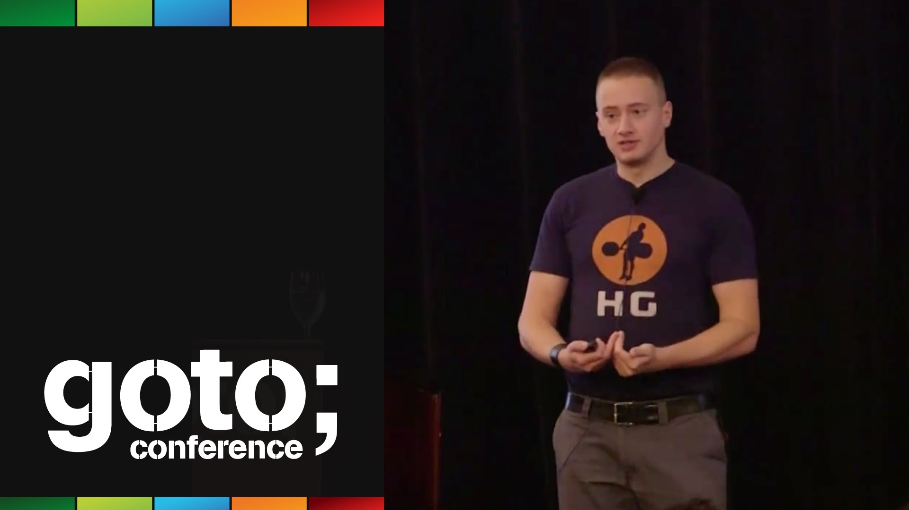

GOTO 2015 • Jepsen IV: Hope Springs Eternal • Kyle Kingsbury

GOTO 2015 • Jepsen IV: Hope Springs Eternal • Kyle Kingsbury
https://www.youtube.com/watch?v=dE3KT7hHkKY
[GOTO Conferences](https://www.youtube.com/channel/UCs_tLP3AiwYKwdUHpltJPuA)
6,976 views views
Published on Jul 15, 2015

|     |
| --- |
| [(L)](https://www.youtube.com/watch?v=dE3KT7hHkKY) |

Description

This presentation was recorded at GOTO Chicago 2015
[http://gotochgo.com](http://gotochgo.com/)

Kyle Kingsbury - Author of Jepsen

ABSTRACT

Stateless applications aren't: they rely on other systems storing and transforming shared state correctly. On the basis of documentation and reputation we assume that our clients and database systems comprise a safe, [...]

Download slides and read the full abstract here:

[http://gotocon.com/chicago-2015/prese...](http://gotocon.com/chicago-2015/presentation/Jepsen%20IV:%20Hope%20Springs%20Eternal)

https://twitter.com/gotochgo
https://www.facebook.com/GOTOConference
[http://gotocon.com](http://gotocon.com/)