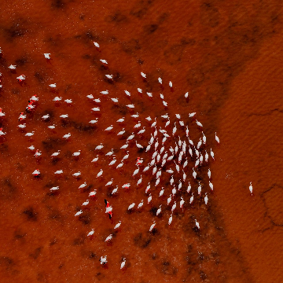

Gallery – Drone Awards

Gallery – Drone Awards

https://droneawards.photo/gallery/

Art Photo Travel About Art Photo Travel is a non-profit association that creates cultural initiatives aimed at spreading, promoting and enhancing photography, art, cultures and natural beauty from all around the world. Initiatives and projects address, not only, those who love photography and culture, but also those interested in the most unknown and less touristy spots of various worldwide locations. Since 2015, Art Photo Travel, has organized the Siena International Photo Awards, one of the most well-known and stunning worldwide photo competitions.