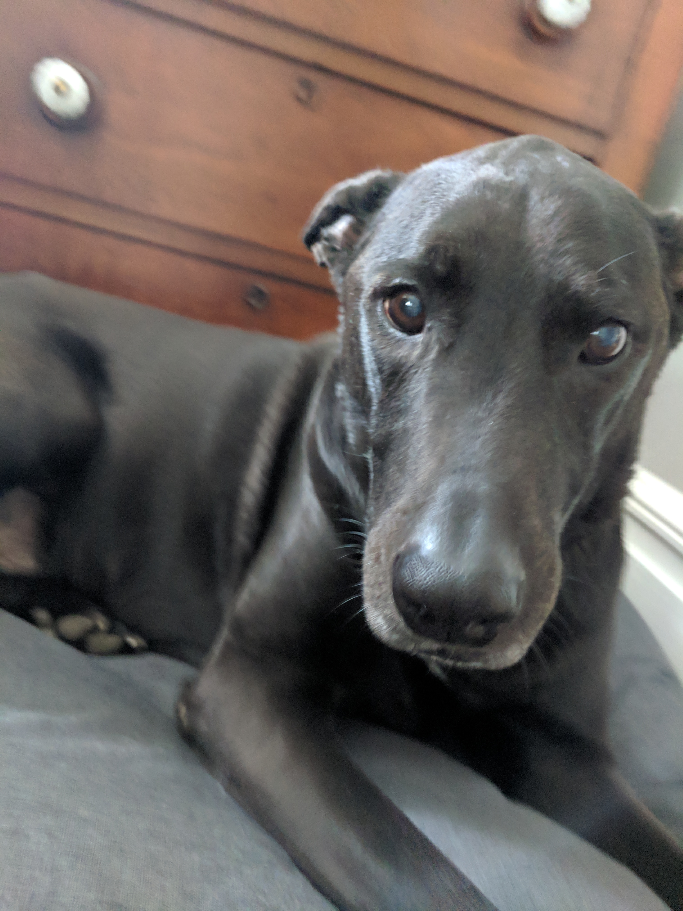
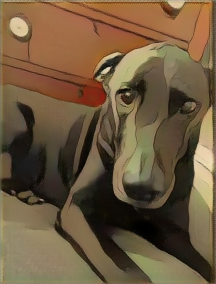
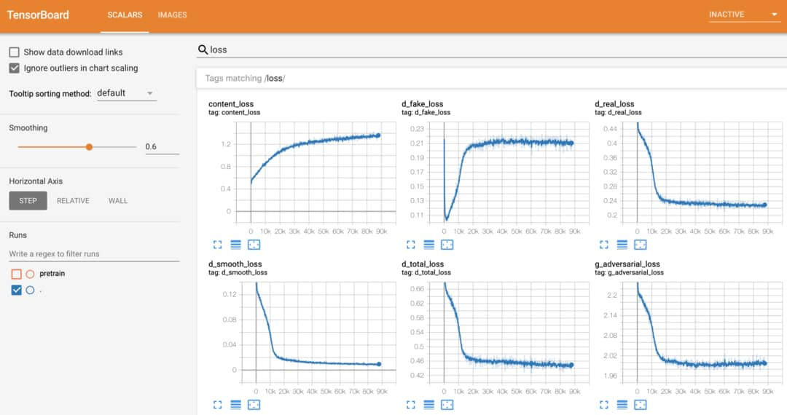
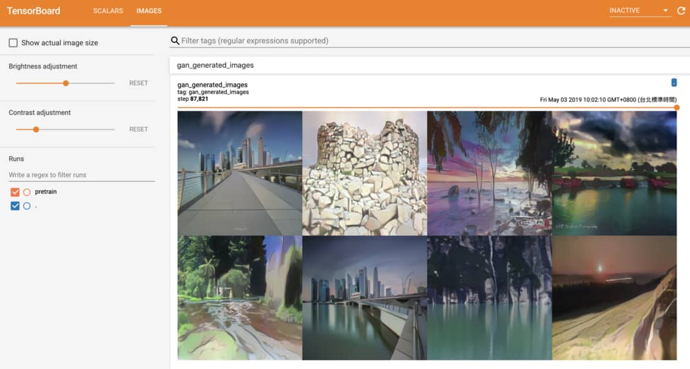
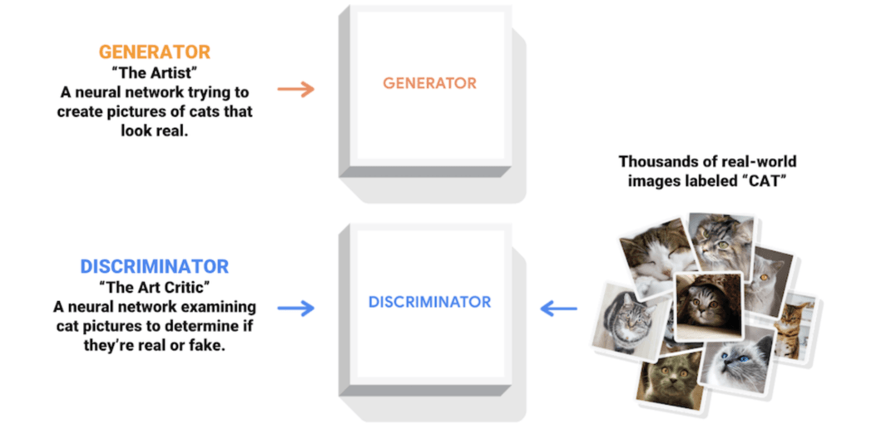
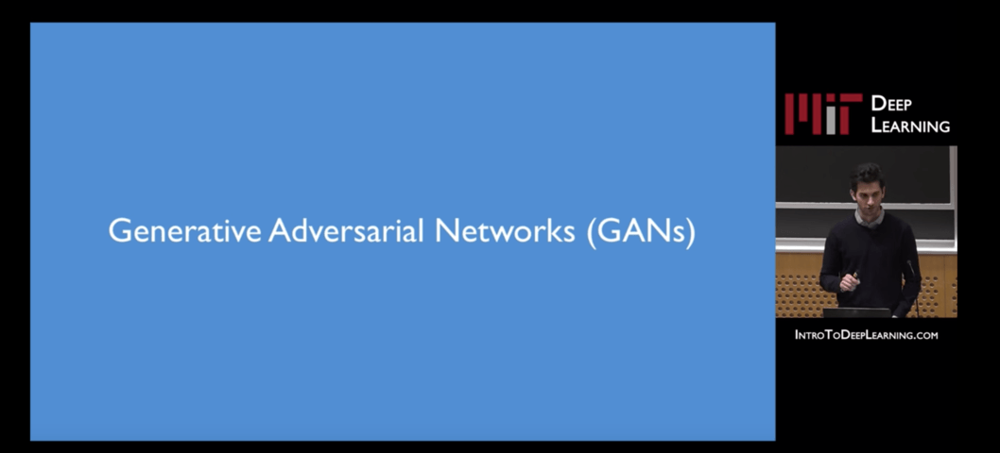

Generate Anime using CartoonGAN and TensorFlow 2.0

 

- [Home](https://leemeng.tw/index.html#home)

- [About](https://leemeng.tw/index.html#about)

- [Projects](https://leemeng.tw/index.html#projects)

- [Blog](https://leemeng.tw/blog.html)

- [Demo](https://demo.leemeng.tw/)

- [Books](https://leemeng.tw/books.html)

- [Contact](https://leemeng.tw/index.html#contact)

 [GAN,](https://leemeng.tw/tag/gan.html)  [TensorFlow,](https://leemeng.tw/tag/tensorflow.html)  [TensorFlow.js,](https://leemeng.tw/tag/tensorflowjs.html)

#   [Generate Anime using CartoonGAN and TensorFlow 2.0](https://leemeng.tw/generate-anime-using-cartoongan-and-tensorflow2-en.html)

- Sun, 05 May 2019

- 1 views

> “

>  What images would you choose to transform if you could turn any of them into anime using AI?

In this post, I will briefly introduce a [CartoonGAN implemented in TensorFlow 2.0 Alpha](https://github.com/mnicnc404/CartoonGan-tensorflow) by my friend [mnicnc404](https://github.com/mnicnc404) and me.

I will also demo a [TensorFlow.js](https://www.tensorflow.org/js) app which allows you to generate anime on your browser directly.

[CartoonGAN (original paper)](http://openaccess.thecvf.com/content_cvpr_2018/papers/Chen_CartoonGAN_Generative_Adversarial_CVPR_2018_paper.pdf) was published in 2018 [CVPR](http://cvpr2019.thecvf.com/) and is a [Generative Adversarial Network (GAN)](https://youtu.be/yFBFl1cLYx8?list=PLtBw6njQRU-rwp5__7C0oIVt26ZgjG9NI&t=1879) which attempts to transform real world images into cartoon-style images.

Top-left corner is real world image, and the other 3 images are generated by CartoonGAN using different anime styles

The ideas demonstrated in the [paper](http://openaccess.thecvf.com/content_cvpr_2018/papers/Chen_CartoonGAN_Generative_Adversarial_CVPR_2018_paper.pdf) are very interesting and the authors also show good results using two of my favorite Japanese animator styles: [Shinkai Makoto](https://en.wikipedia.org/wiki/Makoto_Shinkai) and [Miyazaki Hayao](https://en.wikipedia.org/wiki/Hayao_Miyazaki).

Therefore, I decided to build a [TensorFlow.js](https://www.tensorflow.org/js) app to allow anyone to try CartoonGAN with ease.

Choose your favorite anime style and upload one image, it's just that simple.

Under the hood, TensorFlow.js runs in your browser whilst:

- downloading the pretrained models
- cartoonizing uploaded images

To get the best performance, it is highly recommended that you:

- try the app on a desktop/laptop rather than mobile devices (to speed up transformation)
- try the app when network speed is fast（to minimalize loading time）

## Try CartoonGAN yourself[¶](https://leemeng.tw/generate-anime-using-cartoongan-and-tensorflow2-en.html#Try-CartoonGAN-yourself)

Without further ado, here is the tfjs app:

Upload Image

How does your [anime](https://en.wikipedia.org/wiki/Anime) look?
If the app seems to be stuck:

- `Loading Models`: simply means it's still downloading the model
- `Cartoonizing images`: it might indicate there is no sufficient computation power on your device

You can still generate anime in the next section using [TensorFlow](https://www.tensorflow.org/) if tfjs doesn't work for you.

## Generate anime using TensorFlow 2[¶](https://leemeng.tw/generate-anime-using-cartoongan-and-tensorflow2-en.html#Generate-anime-using-TensorFlow-2)

In addition to TensorFlow.js, we also implemented CartoonGAN using [TensorFlow 2.0 Alpha](https://www.tensorflow.org/alpha). If you want to transform larger images and/or gifs, you can run [this Colab notebook](https://colab.research.google.com/drive/1WIZBHix_cYIGsBKa4phIwCq5qXwO8fRX):

You can use CartoonGAN to transform any images with our colab notebook

[Google Colaboratory](https://colab.research.google.com/) is a cloud [Jupyter notebook](https://jupyter.org/) environment allowing anyone to start their machine learning projects with free GPU available.

In [this notebook](https://colab.research.google.com/drive/1WIZBHix_cYIGsBKa4phIwCq5qXwO8fRX), everything you need is set up for you:

1. Build TensorFlow 2.0 environment

2. Clone [our github repo and download pretrained models](https://github.com/mnicnc404/CartoonGan-tensorflow)

3. Download arbitrary images on the web
4. Transform the images using CartoonGAN

You get the idea. All you have to do is open [the notebook](https://colab.research.google.com/drive/1WIZBHix_cYIGsBKa4phIwCq5qXwO8fRX) and generate your anime. It's that simple.

## Gallery: some anime we generated[¶](https://leemeng.tw/generate-anime-using-cartoongan-and-tensorflow2-en.html#Gallery:-some-anime-we-generated)

Is better to share one's happiness than to enjoy it alone. In this section, we simply share some anime generated with CartoonGAN by ourselves.

For easy comparison, every image below is divided into 4 parts where:

- top-left: original real world image
- top-right: [Shinkai Makoto](https://en.wikipedia.org/wiki/Makoto_Shinkai) style
- bottom-left: [Miyazaki Hayao](https://en.wikipedia.org/wiki/Hayao_Miyazaki) style
- bottom-right: [Hosoda Mamoru](https://en.wikipedia.org/wiki/Mamoru_Hosoda) style

Click the arrows on the left/right to view different results:

Marvel movies, cute cats, scenery or pop idols, the sky is the limit. When trained, we can use CartoonGAN to combine everything with anime.

Using Python script in our [github repo](https://github.com/mnicnc404/CartoonGan-tensorflow), you can generate these results with just one command:

python cartoonize.py \  --styles shinkai hayao hosoda

You can imagine apps with similar features will become much more powerful in the near future. Everyone will be able to generate their own anime using various styles, while animators will be able to test their new ideas and draw drafts much more faster than ever before.

> “

>  Generative models like CartoonGAN can show us many possibilities and inspire us.

## Train your own CartoonGAN[¶](https://leemeng.tw/generate-anime-using-cartoongan-and-tensorflow2-en.html#Train-your-own-CartoonGAN)

You may noticed that we've put a lot of focus on **actual application** rather than the [algorithmic details](http://openaccess.thecvf.com/content_cvpr_2018/papers/Chen_CartoonGAN_Generative_Adversarial_CVPR_2018_paper.pdf) for CartoonGAN. That's because:

- I suspect most readers will be more interested in how to **use** CartoonGAN as a service rather than how to **train** a model themselves
- There are already lots of [great learning resources](https://leemeng.tw/generate-anime-using-cartoongan-and-tensorflow2-en.html#Recommended-learning-resources) on how to train your GANs on the web

For those who are interested in implementation details of CartoonGAN, we suggest you take a look at [our github repo](https://github.com/mnicnc404/CartoonGan-tensorflow). If you have your own datasets, you can even train your own CartoonGAN simply in one command:

Our Python script provides detailed messages which allow you to understand what is happening behind the scenes

Our project can also be used to learn the latest version of TensorFlow since everything is implemented in [Tensorflow 2.0 alpha](https://www.tensorflow.org/alpha):

- Use [tf.keras](https://www.tensorflow.org/alpha/guide/keras/overview) to implement custom layers and GAN
- Use [tf.data](https://www.tensorflow.org/alpha/guide/data_performance) to properly load and process large amount of images
- Write custom train logic and make computation faster using [tf.function](https://youtu.be/Up9CvRLIIIw?list=PLQY2H8rRoyvzoUYI26kHmKSJBedn3SQuB)
- Use [TensorBoard](https://www.tensorflow.org/tensorboard/r2/get_started#using_tensorboard_with_other_methods) to monitor model performance in real-time

As some of you already knew, it is not easy to train a GAN. You must keep monitoring your model's performance to decide how to adjust your hyper-parameters or even model architecture accordingly.

In our [training script](https://github.com/mnicnc404/CartoonGan-tensorflow/blob/master/train.py), TensorBoard is integrated perfectly so you can monitor your model's performance easily:

One result of many experiments we tried on TensorBoard

In addition to metrics and loss functions, it is good practice to keep an eye on the images generated by GAN during training as well.

Using our script, monitoring generated images on TensorBoard is a no-brainer:

the sooner you get feedback, the sooner you can get new ideas and improve your models

Although we only record CartoonGAN-specific metrics and images here, you can easily apply same technique to monitor any other models you like.

Finally, in order to get a sense of how CartoonGAN is doing during the training phase, we can save some images and use them as a validation set.

The idea here is to "test" CartoonGAN using same images periodically so that we can observe how it improves over time:

CartoonGAN becomed better and better transforming validation set into anime

Even before the training is finished, you can tell that CartoonGAN somehow learns to transform real world images into cartoon-like images with clear edges and smooth color shading.

Training a GAN like CartoonGAN is far more difficult than training a [simple classifier](https://www.tensorflow.org/tutorials/keras/basic_classification). But in [our github repo](https://github.com/mnicnc404/CartoonGan-tensorflow), we have tried our best to make the TensorFlow code clear and easy to understand, hoping it will help more people to get started.

Needless to say, you will be able to get a better understanding of our code if you already know some basics. In the next section, I will list some good learning resources for your reference.

## Recommended learning resources[¶](https://leemeng.tw/generate-anime-using-cartoongan-and-tensorflow2-en.html#Recommended-learning-resources)

Recently, deep learning-based generative models are very popular and GAN is one of the most exciting research areas. The CartoonGAN we saw in this post is just a simple application in the ever-growing [GAN zoo](https://github.com/hindupuravinash/the-gan-zoo).

In a typical GAN setting, there are two independent neural networks, called generator and discriminator, competing with each other

For those who want to learn more about GAN, I recommend the following resources:

- [MIT 6.S191 Deep Generative Models](https://www.youtube.com/watch?v=yFBFl1cLYx8&index=1&list=PLtBw6njQRU-rwp5__7C0oIVt26ZgjG9NI)
- [GAN Lab let you train GANs on browser](https://poloclub.github.io/ganlab/)
- [Andrej Karpathy's online GAN demo](https://cs.stanford.edu/people/karpathy/gan/)
- [TensorFlow offical tutorial teach you how to generate MNIST using DCGAN](https://www.tensorflow.org/alpha/tutorials/generative/dcgan)
- [Synced: Reproducing Japanese Anime Styles With CartoonGAN AI](https://medium.com/syncedreview/reproducing-japanese-anime-styles-with-cartoongan-ai-cf30d583736e)
- [Open Questions about Generative Adversarial Networks](https://distill.pub/2019/gan-open-problems/)

MIT 6.S191 Deep Generative Models is a good place to start learning GAN concepts

Research on generative models and GAN are evolving rapidly, but I believe you will be able to implement some simple GANs and understand code written by others after studying these learning resources.

## To sum up[¶](https://leemeng.tw/generate-anime-using-cartoongan-and-tensorflow2-en.html#To-sum-up)

> “

>  AI technology and applications like CartoonGAN should be more accessable to everyone, not only researchers or machine learning practitioners.

With this in mind, I built the project to let you create your own anime in no time and hope it can encourge some of you to explore more about GAN and generative models, and create more interesting AI applications in the future.

Many thanks to the authors of CartoonGAN, TensorFlow/TensorFlow.js teams and my friend [mnicnc404](https://github.com/mnicnc404).

Oh! Also don't forget to share what anime you generate! You can find me on [Twitter](https://twitter.com/leemengtw) or [Facebook](https://www.facebook.com/LeeMengTaiwan). Let the world be filled with anime! :D

 Post Tags    [GAN](https://leemeng.tw/tag/gan.html)  [TensorFlow](https://leemeng.tw/tag/tensorflow.html)  [TensorFlow.js](https://leemeng.tw/tag/tensorflowjs.html)

 [Get Latest Arrivals訂閱最新文章]()

跟資料科學相關的最新文章直接送到家。
只要加入訂閱名單，當新文章出爐時，
你將能馬上收到通知 **

 [  Subscribe   ]()

 [View All Post](https://leemeng.tw/blog.html)

你怎麼想？
0 Responses

讚一個

很有趣

太棒了

好猛喔

生氣氣

嗚嗚嗚

- [0 comments]()
- [**leemengtaiwan**](https://disqus.com/home/forums/leemengtaiwan/)
- [Login](https://disqus.com/embed/comments/?base=default&f=leemengtaiwan&t_u=https%3A%2F%2Fleemeng.tw%2Fgenerate-anime-using-cartoongan-and-tensorflow2-en.html&t_e=Generate%20Anime%20using%20CartoonGAN%20and%20TensorFlow%202.0&t_d=%0A%20%20%20%20%20%20%20%20%20%20%20%20%20%20%20%20%20%20%20%20%20%20%20%20%0A%20%20%20%20%20%20%20%20%20%20%20%20%20%20%20%20%20%20%20%20%20%20%20%20%20%20%20%20Generate%20Anime%20using%20CartoonGAN%20and%20TensorFlow%202.0%0A%20%20%20%20%20%20%20%20%20%20%20%20%20%20%20%20%20%20%20%20%20%20%20%20%0A%20%20%20%20%20%20%20%20%20%20%20%20%20%20%20%20%20%20%20%20&t_t=Generate%20Anime%20using%20CartoonGAN%20and%20TensorFlow%202.0&s_o=default#)
- [](https://disqus.com/home/inbox/)
- [ Recommend](https://disqus.com/embed/comments/?base=default&f=leemengtaiwan&t_u=https%3A%2F%2Fleemeng.tw%2Fgenerate-anime-using-cartoongan-and-tensorflow2-en.html&t_e=Generate%20Anime%20using%20CartoonGAN%20and%20TensorFlow%202.0&t_d=%0A%20%20%20%20%20%20%20%20%20%20%20%20%20%20%20%20%20%20%20%20%20%20%20%20%0A%20%20%20%20%20%20%20%20%20%20%20%20%20%20%20%20%20%20%20%20%20%20%20%20%20%20%20%20Generate%20Anime%20using%20CartoonGAN%20and%20TensorFlow%202.0%0A%20%20%20%20%20%20%20%20%20%20%20%20%20%20%20%20%20%20%20%20%20%20%20%20%0A%20%20%20%20%20%20%20%20%20%20%20%20%20%20%20%20%20%20%20%20&t_t=Generate%20Anime%20using%20CartoonGAN%20and%20TensorFlow%202.0&s_o=default#)
- tTweetfShare
- [Sort by Best](https://disqus.com/embed/comments/?base=default&f=leemengtaiwan&t_u=https%3A%2F%2Fleemeng.tw%2Fgenerate-anime-using-cartoongan-and-tensorflow2-en.html&t_e=Generate%20Anime%20using%20CartoonGAN%20and%20TensorFlow%202.0&t_d=%0A%20%20%20%20%20%20%20%20%20%20%20%20%20%20%20%20%20%20%20%20%20%20%20%20%0A%20%20%20%20%20%20%20%20%20%20%20%20%20%20%20%20%20%20%20%20%20%20%20%20%20%20%20%20Generate%20Anime%20using%20CartoonGAN%20and%20TensorFlow%202.0%0A%20%20%20%20%20%20%20%20%20%20%20%20%20%20%20%20%20%20%20%20%20%20%20%20%0A%20%20%20%20%20%20%20%20%20%20%20%20%20%20%20%20%20%20%20%20&t_t=Generate%20Anime%20using%20CartoonGAN%20and%20TensorFlow%202.0&s_o=default#)

Start the discussion…

[](https://disqus.com/embed/comments/?base=default&f=leemengtaiwan&t_u=https%3A%2F%2Fleemeng.tw%2Fgenerate-anime-using-cartoongan-and-tensorflow2-en.html&t_e=Generate%20Anime%20using%20CartoonGAN%20and%20TensorFlow%202.0&t_d=%0A%20%20%20%20%20%20%20%20%20%20%20%20%20%20%20%20%20%20%20%20%20%20%20%20%0A%20%20%20%20%20%20%20%20%20%20%20%20%20%20%20%20%20%20%20%20%20%20%20%20%20%20%20%20Generate%20Anime%20using%20CartoonGAN%20and%20TensorFlow%202.0%0A%20%20%20%20%20%20%20%20%20%20%20%20%20%20%20%20%20%20%20%20%20%20%20%20%0A%20%20%20%20%20%20%20%20%20%20%20%20%20%20%20%20%20%20%20%20&t_t=Generate%20Anime%20using%20CartoonGAN%20and%20TensorFlow%202.0&s_o=default#)

###### Log in with

-
-
-
-

######  or sign up with Disqus

?

### Disqus is a discussion network

- Disqus never moderates or censors. The rules on this community are its own.
- Don't be a jerk or do anything illegal. Everything is easier that way.

[Read full terms and conditions](https://docs.disqus.com/kb/terms-and-policies/)

Be the first to comment.

## Also on **leemengtaiwan**

- [

### Chartify：讓數據科學家效率加倍的 Python 資料視覺化工具

    - 2 comments •

    - 6 months ago

[Ce Sun—你好你的Blog對於正在學習相關領域的我很有幫助不知您有rss連結嗎我現在接收資訊都用閱讀器會較不會miss的問題謝謝](https://disq.us/?url=https%3A%2F%2Fleemeng.tw%2Fchartify-a-simple-yet-powerful-python-data-visualization-tool-which-boost-your-productivity-as-a-data-scientist.html&key=amL776Z17ukRTyuS1AjxeA)](https://disq.us/?url=https%3A%2F%2Fleemeng.tw%2Fchartify-a-simple-yet-powerful-python-data-visualization-tool-which-boost-your-productivity-as-a-data-scientist.html&key=amL776Z17ukRTyuS1AjxeA)

- [

### 一段 Airflow 與資料工程的故事：談如何用 Python 追漫畫連載

    - 28 comments •

    - 9 months ago

[HsinCheng Huang—請問您文中提到xcom不適合拿來存放大量數據，那如果有大量數據需要經過多個task該如何處理比較適當?](https://disq.us/?url=https%3A%2F%2Fleemeng.tw%2Fa-story-about-airflow-and-data-engineering-using-how-to-use-python-to-catch-up-with-latest-comics-as-an-example.html&key=XLZvEu9h_6UAYDRFxtzKMw)](https://disq.us/?url=https%3A%2F%2Fleemeng.tw%2Fa-story-about-airflow-and-data-engineering-using-how-to-use-python-to-catch-up-with-latest-comics-as-an-example.html&key=XLZvEu9h_6UAYDRFxtzKMw)

- [

### 資料科學家為何需要了解資料工程

    - 6 comments •

    - a year ago

[黃岳涵—在舊金山新創當 DS Intern 工作第二週看到這篇，完整到讀的非常感動! https://media1.giphy.com/me...](https://disq.us/?url=https%3A%2F%2Fleemeng.tw%2Fwhy-you-need-to-learn-data-engineering-as-a-data-scientist.html&key=OQ3pty39vS2ZU2Q2tRxpQQ)](https://disq.us/?url=https%3A%2F%2Fleemeng.tw%2Fwhy-you-need-to-learn-data-engineering-as-a-data-scientist.html&key=OQ3pty39vS2ZU2Q2tRxpQQ)

- [

### 由淺入深的深度學習資源整理

    - 6 comments •

    - 4 months ago

[kevingo—非常實用，感謝分享！](https://disq.us/?url=https%3A%2F%2Fleemeng.tw%2Fdeep-learning-resources.html&key=tYi3uE9qRib44lG28-o95g)](https://disq.us/?url=https%3A%2F%2Fleemeng.tw%2Fdeep-learning-resources.html&key=tYi3uE9qRib44lG28-o95g)

- [Powered by Disqus](https://disqus.com/)
- [*✉*Subscribe*✔*](https://disqus.com/embed/comments/?base=default&f=leemengtaiwan&t_u=https%3A%2F%2Fleemeng.tw%2Fgenerate-anime-using-cartoongan-and-tensorflow2-en.html&t_e=Generate%20Anime%20using%20CartoonGAN%20and%20TensorFlow%202.0&t_d=%0A%20%20%20%20%20%20%20%20%20%20%20%20%20%20%20%20%20%20%20%20%20%20%20%20%0A%20%20%20%20%20%20%20%20%20%20%20%20%20%20%20%20%20%20%20%20%20%20%20%20%20%20%20%20Generate%20Anime%20using%20CartoonGAN%20and%20TensorFlow%202.0%0A%20%20%20%20%20%20%20%20%20%20%20%20%20%20%20%20%20%20%20%20%20%20%20%20%0A%20%20%20%20%20%20%20%20%20%20%20%20%20%20%20%20%20%20%20%20&t_t=Generate%20Anime%20using%20CartoonGAN%20and%20TensorFlow%202.0&s_o=default#)
- [*d*Add Disqus to your site](https://publishers.disqus.com/engage?utm_source=leemengtaiwan&utm_medium=Disqus-Footer)
- [**Disqus' Privacy Policy](https://help.disqus.com/customer/portal/articles/466259-privacy-policy)

 

- [**  Github](https://github.com/leemengtaiwan)|
- [**  Facebook](https://www.facebook.com/LeeMengTaiwan)|
- [**  Instagram](https://www.instagram.com/leemengtaiwan/)|
- [**  LinkedIn](https://www.linkedin.com/in/leemeng1990/)|

 Powered by [Pelican](http://getpelican.com/)|  © Copyright Hola 2017|  Design by [styleshout](https://www.styleshout.com/)|