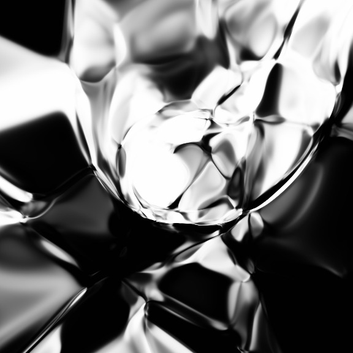
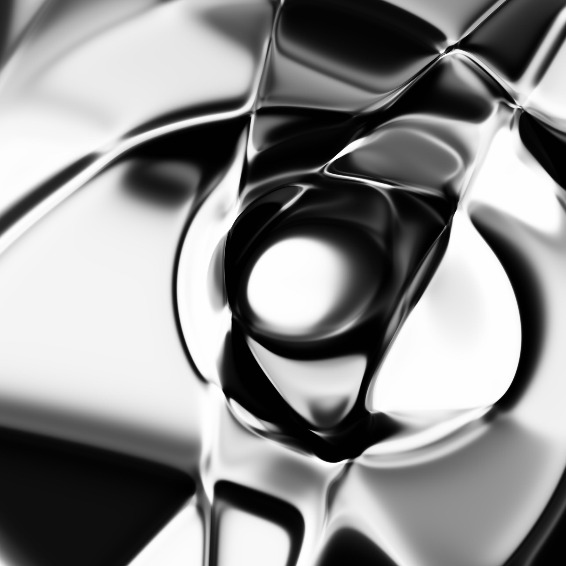
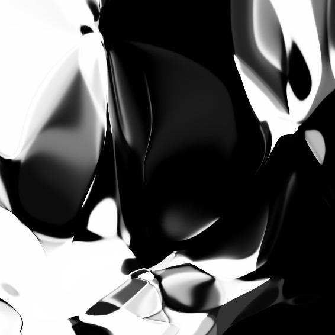
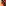
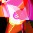
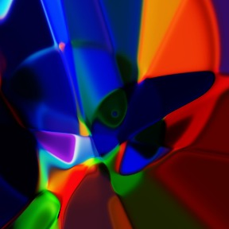
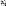
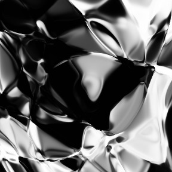
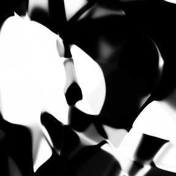
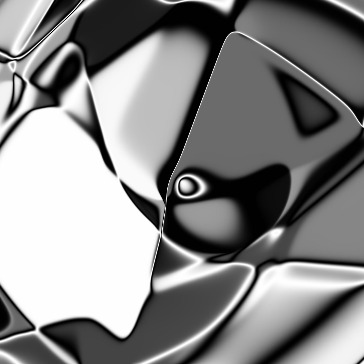

Generating Abstract Patterns with TensorFlow | 大トロ

# Generating Abstract Patterns with TensorFlow

March 25, 2016

*A Diamond is Forever (2016)*

	[[NEWLINE]]

	[Web Demo](http://otoro.net/ml/netart/)

This is the first in a series of posts exploring [Compositional Pattern-Producing Networks](https://en.wikipedia.org/wiki/Compositional_pattern-producing_network) in TensorFlow. I made the code available on a [github](https://github.com/hardmaru/cppn-tensorflow) repo for reference. It may seem overkill to implement CPPNs with TensorFlow when `numpy` would do the job, but we will build onto this work later on.

## Introduction

In recent neural network based image generation techniques, typically the generator network will attempt to draw the entire image at once. For example, if the desired resolution of an output image is `256x256`, then the final layer of the neural network will have `65536` values for a black and white image. It may not be feasible to increase the output resolution to modern image resolutions (`2880x1800`) due to limitations of memory and scalability these algorithms.

In this post I will describe a really simple way to get neural nets to generate a high resolution image. Rather than generating every pixel at once, the neural network’s job is to generate an individual pixel’s intensity or colour, given the location of the pixel. Then, the entire image can be generated by just querying the network once for each pixel in the desired output image. This method can be used to generate very high resolution images, limited by memory, provides an elegant way to allow one to zoom in and out of images, and share some fractal like properties.

There has been some demos on the web experimenting this technique, including karpathy’s convnetjs [drawing demo](http://cs.stanford.edu/people/karpathy/convnetjs/demo/image_regression.html), and javascript implementations of generative [neural network art](http://blog.otoro.net/2015/06/19/neural-network-generative-art/) and [neurogram](http://blog.otoro.net/2015/07/31/neurogram/).

In this post I will describe how to implement this simple technique to generate random abstract art in TensorFlow. The reason I wanted to implement this in TensorFlow is so that it can be used as a base for more interesting work in the future that take advantage of TensorFlow’s machine learning capabilities, so that this type of generative network can be used to create non-random images as well, and I will explain this in future posts.

## Compositional Pattern Producing Network Description

[cppn_schematic.svg](../_resources/980bc6a36a03dee1e2630bc4c8930dcc.bin)
*Schematic for our customised CPPN*

I have explained the basics of CPPN in this earlier [post](http://blog.otoro.net/2015/07/31/neurogram/) when CPPN is combined with the NEAT algorithm to evolve the architecture of the generative neural network.

In essence, CPPN is just a function, c=f(x,y)c = f(x, y)c=f(x,y), that defines the intensity of the image for every point in space. This makes them attractive to generate very high resolution images, as you can just call this function to get the colour or intensity of every pixel, given that pixel’s location.

f(x,y)f(x, y)f(x,y) is just a function that can be built from many mathematical operations. It can also be represented by a neural network, with a set of weights connecting the activation gates that will be held constant when drawing an image. So the entire image can be defined as f(w,x,y)f(w, x, y)f(w,x,y)

Our TensorFlow implementation will deviate a bit from the previous work done with CPPN-NEAT. Like the previous work, our function f(x,y)f(x, y)f(x,y) will return either a single real number between zero and one, to define the intensity of the image at that point (result will be a greyscale image), or a three dimensional vector, each value between (0,1)(0, 1)(0,1), to represent colour intensities (Red, Green, Blue). In addition, similar to CPPN-NEAT, to make the image more interesting, we will also pass in a radius term for each point as the input (defined as r=x2+y2r = \sqrt{x^2+y^2}r=√​x​2​​+y​2​​​​​), so the CPPN function will be f(w,x,y,r)f(w, x, y, r)f(w,x,y,r). The weights www of the neural network will be initialised to a random value from the unit gaussian distribution.

Unlike CPPN-NEAT, the neural network we will be using in this implementation will just be a multi-layered feed forward network, defined by the user. For example, the user can modify the TensorFlow code so that f(w,x,y,r)f(w, x, y, r)f(w,x,y,r) is a feed forward neural network defined by hyperbolic tangent functions, relu’s, softplus, sinusoids, etc. Each layer will also have an extra bias input, omitted in the diagram for clarity.

We will also add an extra input into the CPPN function called a latent vector, zzz, which is a vector of nnn real numbers (where nnn is typically much smaller than the total number of weighted connections in the network), so our generative network is defined as f(w,z,x,y,r)f(w, z, x, y, r)f(w,z,x,y,r). By modifying the values of zzz, our network will generate different images, and the entire space of images that can be possibly generated by our network by changing zzz around is call the latent space. In some sense, zzz can be interpreted as a compressed description of the final image, summarised with nnn real numbers. If we modify zzz by only a small amount, as the network is a continuous function, the output image would also change around only slightly, so we can also visualise how one image in a latent space can slowly morph into another image in the same latent space, by generating images with a latent vector zzz that gradually moves from z1z_1z​1​​ to z2z_2z​2​​.

Note that empty layer in the diagram is just a preprocessing layer where a scaling factor will be applied to xxx, yyy, rrr, and zzz before entering into the first hidden layer.

One argument as to why we need a latent vector as an input, when we can just make gradual adjustments to the weights to get different output images. Practically speaking, there can be in the order of hundreds or thousands of weights in a complicated generative network, and in many generative applications, we want to keep the number of latent vectors smallish. When we eventually train on large datasets, the latent vector can control not only the object being drawn, but also the specific style of the image. Using some tools of probability theory, we can even force zzz to have nice properties, such as being independent and unit gaussian. For example, a subset of zzz can represent the gender of the person, and another subset can represent the mood of the person’s face being drawn by the generative algorithm. In subsequent posts, we will attempt to train this type of CPPN to write numbers, and maybe draw faces, animals, cars, toilets, etc.

## Exploring the Latent Space for a Neural Network

The CPPN model and code required to use it to generate .png and .gif images is available on [github](https://github.com/hardmaru/cppn-tensorflow). I will use that code as a reference point to generate images with an IPython session.

Inside the repo, `model.py` contains the `CPPN` class that generates images using TensorFlow library routines. The `generator` method will be of most interest to experiment with modifying around the CPPN’s neural net architecture, and try some alternative architectures have been commented out there for you to play with. We will use the `Sampler` class inside `sampler.py` which will allow us to interactively query images inside an IPython session.

Inside an IPython session, we first go into the repo’s directory and run
`[object Object]`

Sampler would create a CPPN model that uses latent vectors consisting of 8 real numbers, a scaling of 10x, and contains 32 activations at each neural net layer. Note that these are the default values so we can also call `sampler = Sampler()` next time.

To generate an image, we need to generate a random latent vector zzz containing 8 numbers

`[object Object]`

Afterwards, we can pass zzz into the generator function to see the output image. `img_data` is just a numpy array containing the image data.

`[object Object]`

#### Output

|     |
| --- |
|  |

If we want to reset and randomise the neural network’s weights, we can call the `reinit()` method

`[object Object]`

#### Output

|     |
| --- |
| [*Mask (2016)*](http://blog.otoro.net/assets/20160325/tanh_anim_start.jpeg) |

Note that as we have changed the weights of the network, the latent space has changed and we will see a different output despite passing in the same zzz vector.

We can save files using `sampler.save_png(img_data, 'output.png')`.

### Traversing the Latent Space

Let’s generate another random image in the same latent space
`[object Object]`

#### Output

|     |
| --- |
| [*Bondage (2016)*](http://blog.otoro.net/assets/20160325/tanh_anim_end.jpeg) |

Both images belong to the same latent space, and can be represented compactly in a vector format. If we gradually move from z1z_1z​1​​ to z2z_2z​2​​ in little steps, and generate an image at each step, we can see how the image defined by z1z_1z​1​​ gets morphed into the image by z2z_2z​2​​. I have created a method that creates a `.gif` file to do this. This method has some adjustable settings to tune the timing and size of frames. The default settings will generate a `.gif` file of around 5 megabytes.

`[object Object]`

#### Output

|     |
| --- |
|  |

### Colour Images

If we reset the IPython session and run with this setting to set `c_dim` to 3, we can also generate colour images as well

`[object Object]`

We can get the CPPN to output 3 values for each pixel location, defining RGB value for each pixel. However, I personally found the black and white version more elegant for generative artworks using random weights.

|     |     |     |
| --- | --- | --- |
|   |   |   |

### Modifying Network Architecture

We can also modify the `generate` methid inside `model.py` to change the architecture of the CPPN network.

The default architecture is a few layers of hyperbolic tangent functions
`[object Object]`

#### Examples

|     |     |     |
| --- | --- | --- |
|   |   |   |

Alternatively, we can mix in softplus layers with the tanh layers
`[object Object]`

#### Examples

|     |     |     |
| --- | --- | --- |
|   |   |   |

We can even mix in sinusoidal activations
`[object Object]`

#### Examples

|     |     |
| --- | --- |
|   |   |

I have also experimented with absolute functions, square roots, gaussian activations (self implemented), and residual / ladder type structures.

The `CPPN` class is fairly generic, and has the capability to generate a large batch of images at the same time. Batch processing is really useful for GPU-based training of a neural network in the future when we want to get CPPN to generate something interesting for us.

## Conclusions

The TensorFlow library provides an efficient way to perform vector computations, and can be used in tasks that don’t require gradient computations. But it means whatever work can be extended in the future to take advantage of the deep learning functionality. Just like this example, we can then use this code and try to train our CPPN to do interesting things like draw certain class of images, fonts, or numerical digits of different styles, in high resolution. I will write about this in the upcoming blog post, so please stay tuned.