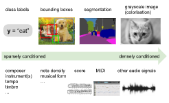
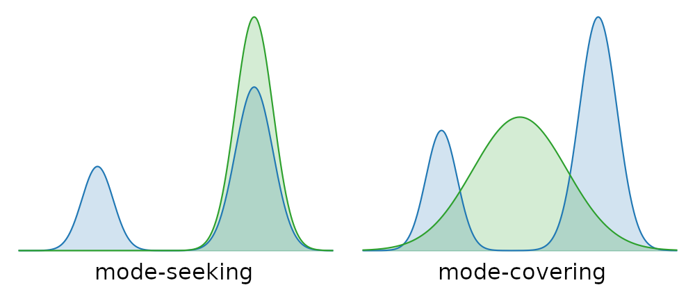
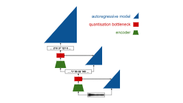

Generating music in the waveform domain – Sander Dieleman

# [Generating music in the waveform domain](https://benanne.github.io/2020/03/24/audio-generation.html)

## March 24, 2020

 ** Reading time ~46 minutes

In November last year, I co-presented a tutorial on **waveform-based music processing with deep learning** with [Jordi Pons](http://www.jordipons.me/) and [Jongpil Lee](https://jongpillee.github.io/) at [ISMIR 2019](https://ismir2019.ewi.tudelft.nl/). Jongpil and Jordi talked about music classification and source separation respectively, and I presented the last part of the tutorial, on music generation in the waveform domain. It was very well received, so I’ve decided to write it up in the form of a blog post.

ISMIR used to be my home conference when I was a PhD student working on music information retrieval, so it was great to be back for the first time in five years. With about 450 attendees (the largest edition yet), it made for a very different experience than what I’m used to with machine learning conferences like ICML, NeurIPS and ICLR, whose audiences tend to number in the thousands these days.

Our tutorial on the first day of the conference gave rise to plenty of interesting questions and discussions throughout, which inspired me to write some of these things down and hopefully provide a basis to continue these discussions online. Note that I will only be covering music generation in this post, but Jordi and Jongpil are working on blog posts about their respective parts. I will share them here when they are published. In the meantime, **the slide deck we used includes all three parts and is now available on [Zenodo (PDF)](https://zenodo.org/record/3529714#.XdBi0dv7Sf5) and on [Google slides](https://docs.google.com/presentation/d/1_ezZXDkyhp9USAYMc5oKJCkUrUhBfo-Di8H8IfypGBM/edit#slide=id.g647f5a8648_0_57)**. I’ve also added a few things to this post that I’ve thought of since giving the tutorial, and some new work that has come out since.

This is also an excellent opportunity to revive my blog, which has lain dormant for the past four years. I have taken the time to update the blog software, so if anything looks odd, that may be why. Please let me know so I can fix it!

 

Presenting our tutorial session at ISMIR 2019 in Delft, The Netherlands. Via [ISMIR2019 on Twitter](https://twitter.com/ismir2019/status/1191341227825934336).

## 1.   Overview

This blog post is divided into a few different sections. I’ll try to motivate why modelling music in the waveform domain is an interesting problem. Then I’ll give an overview of generative models, the various flavours that exist, and some important ways in which they differ from each other. In the next two sections I’ll attempt to cover the state of the art in both likelihood-based and adversarial models of raw music audio. Finally, I’ll raise some observations and discussion points. If you want to skip ahead, just click the section title below to go there.

- *[Motivation](https://benanne.github.io/2020/03/24/audio-generation.html#motivation)*

- *[Generative models](https://benanne.github.io/2020/03/24/audio-generation.html#generative-models)*

- *[Likelihood-based models of waveforms](https://benanne.github.io/2020/03/24/audio-generation.html#likelihood-based-models)*

- *[Adversarial models of waveforms](https://benanne.github.io/2020/03/24/audio-generation.html#adversarial-models)*

- *[Discussion](https://benanne.github.io/2020/03/24/audio-generation.html#discussion)*

- *[Conclusion](https://benanne.github.io/2020/03/24/audio-generation.html#conclusion)*

- *[References](https://benanne.github.io/2020/03/24/audio-generation.html#references)*

Note that this blog post is not intended to provide an exhaustive overview of all the published research in this domain – I have tried to make a selection and I’ve inevitably left out some great work. **Please don’t hesitate to suggest relevant work in the comments section!**

## 2.   Motivation

### 1. counter(h3counter) .  Why audio?

Music generation has traditionally been studied in the **symbolic domain**: the output of the generative process could be a musical score, a sequence of [MIDI events](https://en.wikipedia.org/wiki/MIDI), a simple melody, a sequence of chords, a textual representation[1](https://benanne.github.io/2020/03/24/audio-generation.html#fn:folkrnn) or some other higher-level representation. The physical process through which sound is produced is abstracted away. This dramatically reduces the amount of information that the models are required to produce, which makes the modelling problem more tractable and allows for lower-capacity models to be used effectively.

A very popular representation is the so-called *piano roll*, which dates back to the player pianos of the early 20th century. Holes were punched into a roll of paper to indicate which notes should be played at which time. This representation survives in digital form today and is commonly used in music production. Much of the work on music generation using machine learning has made use of (some variant of) this representation, because it allows for capturing performance-specific aspects of the music without having to model the sound.

   

**Left:** player piano with a physical piano roll inside. **Right:** modern incarnation of a piano roll.

Piano rolls are great for piano performances, because they are able to exactly capture the *timing*, *pitch* and *velocity* (i.e. how hard a piano key is pressed, which is correlated with loudness, but not equivalent to it) of the notes. They are able to very accurately represent piano music, because they cover all the “degrees of freedom” that a performer has at their disposal. However, most other instruments have many more degrees of freedom: think about all the various ways you can play a note on the guitar, for example. You can decide which string to use, where to pick, whether to bend the string or not, play vibrato, … you could even play harmonics, or use two-hand tapping. Such a vast array of different playing techniques endows the performer with a lot more freedom to vary the sound that the instrument produces, and coming up with a high-level representation that can accurately capture all this variety is much more challenging. In practice, a lot of this detail is ignored and a simpler representation is often used when generating music for these instruments.

Modelling the sound that an instrument produces is much more difficult than modelling (some of) the parameters that are controlled by the performer, but it frees us from having to manually design high-level representations that accurately capture all these parameters. Furthermore, it allows our models to capture variability that is beyond the performer’s control: the idiosyncracies of individual instruments, for example (no two violins sound exactly the same!), or the parameters of the recording setup used to obtain the training data for our models. It also makes it possible to model ensembles of instruments, or other sound sources altogether, without having to fundamentally change anything about the model apart from the data it is trained on.

Digital audio representations require a reasonably high bit rate to achieve acceptable fidelity however, and modelling all these bits comes with a cost. **Music audio models will necessarily have to have a much higher capacity than their symbolic counterparts**, which implies higher computational requirements for model training.

### 2. counter(h3counter) .  Why waveforms?

Digital representations of sound come in many shapes and forms. For reproduction, sound is usually stored by encoding the shape of the waveform as it changes over time. For analysis however, we often make use of **[spectrograms](https://en.wikipedia.org/wiki/Spectrogram)**, both for computational methods and for visual inspection by humans. A spectrogram can be obtained from a waveform by computing the Fourier transform of overlapping windows of the signal, and stacking the results into a 2D array. This shows the **local frequency content of the signal over time**.

Spectrograms are complex-valued: they represent both the amplitude and the phase of different frequency components at each point in time. Below is a visualisation of a magnitude spectrogram and its corresponding phase spectrogram. While the magnitude spectrogram clearly exhibits a lot of structure, with sustained frequencies manifesting as horizontal lines and harmonics showing up as parallel horizontal lines, the phase spectrogram looks a lot more random.

   

**Top:** magnitude spectrogram of a piano recording. **Bottom:** the corresponding phase spectrogram.

When extracting information from audio signals, it turns out that we can often just **discard the phase component**, because it is not informative for most of the things we could be interested in. In fact, this is why the magnitude spectrogram is often referred to simply as “the spectrogram”. When generating sound however, phase is very important because it meaningfully affects our perception. Listen below to an original excerpt of a piano piece, and a corresponding excerpt where the original phase has been replaced by random uniform phase information. Note how the harmony is preserved, but the timbre changes completely.

 [Audio with original phase](https://benanne.github.io/files/original_phase.wav)  [Audio with random phase](https://benanne.github.io/files/random_phase.wav)

**Left:** excerpt with original phase. **Right:** the same excerpt with random phase.

The phase component of a spectrogram is tricky to model for a number of reasons:

- it is an **angle**: ϕ∈[0,2π)ϕ∈[0,2π) and it wraps around;

- it becomes **effectively random** as the magnitude tends towards 0, because noise starts to dominate;

- absolute phase is less meaningful, but **relative phase differences over time matter perceptually**.

If we model waveforms directly, we are implicitly modelling their phase as well, but we don’t run into these issues that make modelling phase so cumbersome. There are other strategies to avoid these issues, some of which I will [discuss later](https://benanne.github.io/2020/03/24/audio-generation.html#alternatives), but **waveform modelling currently seems to be the dominant approach in the generative setting**. This is particularly interesting because magnitude spectrograms are by far the most common representation used for discriminative models of audio.

### 3. counter(h3counter) .  Discretising waveforms

When representing a waveform digitally, we need to **discretise it in both time and amplitude**. This is referred to as [pulse code modulation (PCM)](https://en.wikipedia.org/wiki/Pulse-code_modulation). Because audio waveforms are effectively band-limited (humans cannot perceive frequencies above ~20 kHz), the [sampling theorem](https://en.wikipedia.org/wiki/Nyquist%E2%80%93Shannon_sampling_theorem) tells us that we can discretise the waveform in time without any loss of information, as long as the sample rate is high enough (twice the highest frequency). This is why CD quality audio has a sample rate of 44.1 kHz. Much lower sample rates result in an audible loss of fidelity, but since the resulting discrete sequences also end up being much shorter, a compromise is often struck in the context of generative modelling to reduce computational requirements. Most models from literature use sample rates of 16 or 24 kHz.

 

Digital waveform. The individual samples become visible as the zoom level increases. Figure taken from [the original WaveNet blog post](https://deepmind.com/blog/article/wavenet-generative-model-raw-audio).

When we also quantise the amplitude, some loss of fidelity is inevitable. CD quality uses 16 bits per sample, representing 216 equally spaced quantisation levels. If we want to use fewer bits, we can use logarithmically spaced quantisation levels instead to account for our nonlinear perception of loudness. This **[“mu-law companding”](https://en.wikipedia.org/wiki/%CE%9C-law_algorithm)** will result in a smaller perceived loss of fidelity than if the levels were equally spaced.

## 3.   Generative models

Given a dataset XX of examples x∈Xx∈X, which we assume to have been drawn independently from some underlying distribution pX(x)pX(x), a generative model can learn to approximate this distribution pX(x)pX(x). Such a model could be used to generate new samples that look like they could have been part of the original dataset. We distinguish *implicit* and *explicit* generative models: an implicit model can produce new samples x∼pX(x)x∼pX(x), but cannot be used to infer the likelihood of an example (i.e. we cannot tractably compute pX(x)pX(x) given xx). If we have an explicit model, we can do this, though sometimes only up to an unknown normalising constant.

### 1. counter(h3counter) .  Conditional generative models

Generative models become more practically useful when we can exert some influence over the samples we draw from them. We can do this by providing a **conditioning signal**  cc, which contains side information about the kind of samples we want to generate. The model is then fit to the conditional distribution pX(x|c)pX(x|c) instead of pX(x)pX(x).

Conditioning signals can take many shapes or forms, and it is useful to distinguish different levels of information content. The generative modelling problem becomes easier if the conditioning signal cc is richer, because it reduces uncertainty about xx. We will refer to conditioning signals with low information content as *sparse conditioning*, and those with high information content as *dense conditioning*. Examples of conditioning signals in the image domain and the music audio domain are shown below, ordered according to density.

 

Examples of sparse and dense conditioning signals in the image domain (top) and the music audio domain (bottom).

Note that the density of a conditioning signal is often correlated with its level of abstraction: high-level side information tends to be more sparse. Low-level side information isn’t necessarily dense, though. For example, we could condition a generative model of music audio on a low-dimensional vector that captures the overall timbre of an instrument. This is a low-level aspect of the audio signal, but it constitutes a sparse conditioning signal.

### 2. counter(h3counter) .  Likelihood-based models

Likelihood-based models directly parameterise pX(x)pX(x). The parameters θθ are then fit by maximising the likelihood of the data under the model:

Lθ(X)=∑x∈XlogpX(x|θ)θ∗=argmaxθLθ(X).Lθ(X)=∑x∈Xlog⁡pX(x|θ)θ∗=arg⁡maxθLθ(X).

Note that this is typically done in the log-domain because it simplifies computations and improves numerical stability. Because the model directly parameterises pX(x)pX(x), we can **easily infer the likelihood of any**  xx, so we get an explicit model. Three popular flavours of likelihood-based models are autoregressive models, flow-based models and variational autoencoders. The following three subsections provide a brief overview of each.

### 3. counter(h3counter) .  Autoregressive models

In an autoregressive model, we assume that our examples x∈Xx∈X can be treated as sequences {xi}{xi}. We then factorise the distribution into a product of conditionals, using the [chain rule of probability](https://en.wikipedia.org/wiki/Chain_rule_(probability)):

pX(x)=∏ip(xi|x<i).pX(x)=∏ip(xi|x<i).

These conditional distributions are typically scalar-valued and much easier to model. Because we further assume that the distribution of the sequence elements is stationary, we can share parameters and use the same model for all the factors in this product.

For audio signals, this is a very natural thing to do, but we can also do this for other types of structured data by arbitrarily choosing an order (e.g. raster scan order for images, as in PixelRNN[2](https://benanne.github.io/2020/03/24/audio-generation.html#fn:pixelrnn) and PixelCNN[3](https://benanne.github.io/2020/03/24/audio-generation.html#fn:pixelcnn)).

Autoregressive models are attractive because they are able to **accurately capture correlations between the different elements**  xixi in a sequence, and they allow for fast inference (i.e. computing pX(x)pX(x) given xx). Unfortunately they tend to be **slow to sample from**, because samples need to be drawn sequentially from the conditionals for each position in the sequence.

### 4. counter(h3counter) .  Flow-based models

Another strategy for constructing a likelihood-based model is to use the **[change of variables theorem](https://en.wikipedia.org/wiki/Probability_density_function#Function_of_random_variables_and_change_of_variables_in_the_probability_density_function)** to transform pX(x)pX(x) into a simple, factorised distribution pZ(z)pZ(z) (standard Gaussian is a popular choice) using an invertible mapping x=g(z)x=g(z):

pX(x)=pZ(z)⋅|detJ|−1J=dg(z)dz.pX(x)=pZ(z)⋅|detJ|−1J=dg(z)dz.

Here, JJ is the Jacobian of g(z)g(z). Models that use this approach are referred to as normalising flows or flow-based models[4](https://benanne.github.io/2020/03/24/audio-generation.html#fn:nice)[5](https://benanne.github.io/2020/03/24/audio-generation.html#fn:realnvp). They are fast both for inference and sampling, but the **requirement for g(z)g(z) to be invertible significantly constrains the model architecture**, and it makes them less parameter-efficient. In other words: flow-based models need to be quite large to be effective.

For an in-depth treatment of flow-based models, I recommend Eric Jang’s [two-part blog post](https://blog.evjang.com/2018/01/nf1.html) on the subject, and [Papamakarios et al.’s excellent review paper](https://arxiv.org/abs/1912.02762).

### 5. counter(h3counter) .  Variational autoencoders (VAEs)

By far the most popular class of likelihood-based generative models, I can’t avoid mentioning variational[6](https://benanne.github.io/2020/03/24/audio-generation.html#fn:vaerezende) autoencoders[7](https://benanne.github.io/2020/03/24/audio-generation.html#fn:vaekingma) – but **in the context of waveform modelling, they are probably the least popular approach**. In a VAE, we jointly learn two neural networks: an *inference network*  q(z|x)q(z|x) learns to probabilistically map examples xx into a latent space, and a *generative network*  p(x|z)p(x|z) learns the distribution of the data conditioned on a latent representation zz. These are trained to maximise a lower bound on pX(x)pX(x), called the ELBO (Evidence Lower BOund), because computing pX(x)pX(x) given xx (exact inference) is not tractable.

Typical VAEs assume a factorised distribution for p(x|z)p(x|z), which limits the extent to which they can capture dependencies in the data. While this is often an acceptable trade-off, in the case of waveform modelling it turns out to be a problematic restriction in practice. I believe this is why not a lot of work has been published that takes this approach (if you know of any, please point me to it). VAEs can also have more powerful decoders with fewer assumptions (autoregressive decoders, for example), but this may introduce other issues such as posterior collapse[8](https://benanne.github.io/2020/03/24/audio-generation.html#fn:pc).

To learn more about VAEs, check out [Jaan Altosaar’s tutorial](https://jaan.io/what-is-variational-autoencoder-vae-tutorial/).

### 6. counter(h3counter) .  Adversarial models

Generative Adversarial Networks[9](https://benanne.github.io/2020/03/24/audio-generation.html#fn:gans) (GANs) take a very different approach to capturing the data distribution. Two networks are trained simultaneously: a *generator*  GG attempts to produce examples according to the data distribution pX(x)pX(x), given latent vectors zz, while a *discriminator*  DD attempts to tell apart generated examples and real examples. In doing so, the discriminator provides a learning signal for the generator which enables it to better match the data distribution. In the original formulation, the loss function is as follows:

L(x)=Ex[logD(x)]+Ez[log(1−D(G(z)))].L(x)=Ex[log⁡D(x)]+Ez[log(1−D(G(z)))].

The generator is trained to minimise this loss, whereas the discriminator attempts to maximise it. This means the training procedure is a **two-player minimax game**, rather than an optimisation process, as it is for most machine learning models. Balancing this game and keeping training stable has been one of the main challenges for this class of models. Many alternative formulations have been proposed to address this.

While adversarial and likelihood-based models are both ultimately trying to model pX(x)pX(x), they approach this target from very different angles. As a result, **GANs tend to be better at producing realistic examples, but worse at capturing the full diversity of the data distribution**, compared to likelihood-based models.

### 7. counter(h3counter) .  More exotic flavours

Many other strategies to learn models of complicated distributions have been proposed in literature. While research on waveform generation has chiefly focused on the two dominant paradigms of likelihood-based and adversarial models, some of these alternatives may hold promise in this area as well, so I want to mention a few that I’ve come across.

- **Energy-based models** measure the “energy” of examples, and are trained by fitting the model parameters so that examples coming from the dataset have low energy, whereas all other configurations of inputs have high energy. This amounts to fitting an unnormalised density. A nice recent example is [the work by Du & Mordatch at OpenAI](https://openai.com/blog/energy-based-models/)[10](https://benanne.github.io/2020/03/24/audio-generation.html#fn:energy). Energy-based models have been around for a very long time though, and one could argue that likelihood-based models are a special case.

- **Optimal transport** is another approach to measure the discrepancy between probability distributions, which has served as inspiration for new variants of generative adversarial networks[11](https://benanne.github.io/2020/03/24/audio-generation.html#fn:wgan) and autoencoders[12](https://benanne.github.io/2020/03/24/audio-generation.html#fn:swa).

- **Autoregressive implicit quantile networks**[13](https://benanne.github.io/2020/03/24/audio-generation.html#fn:aiqn) use a similar network architecture as likelihood-based autoregressive models, but they are trained using the quantile regression loss, rather than maximimum likelihood.

- Two continuous distributions can be matched by minimising the L2 distance between the gradients of the density functions with respect to their inputs: L(x)=E[||∇xlogpX(x)−∇ylogpY(y)||2]L(x)=E[||∇xlog⁡pX(x)−∇ylog⁡pY(y)||2]. This is called **score matching**[14](https://benanne.github.io/2020/03/24/audio-generation.html#fn:scorematching) and some recent works have revisited this idea for density estimation[15](https://benanne.github.io/2020/03/24/audio-generation.html#fn:ssm) and generative modelling[16](https://benanne.github.io/2020/03/24/audio-generation.html#fn:scorebased).

- Please share any others that I haven’t mentioned in the comments!

### 8. counter(h3counter) .  Mode-covering vs. mode-seeking behaviour

An important consideration when determining which type of generative model is appropriate for a particular application, is the degree to which it is *mode-covering* or *mode-seeking*. When a model does not have enough capacity to capture all the variability in the data, different compromises can be made. If all examples should be reasonably likely under the model, it will have to overgeneralise and put probability mass on interpolations of examples that may not be meaningful (mode-covering). If there is no such requirement, the probability mass can be focused on a subset of examples, but then some parts of the distribution will be ignored by the model (mode-seeking).

 

Illustration of mode-seeking and mode-covering behaviour in model fitting. The blue density represents the data distribution. The green density is our model, which is a single Gaussian. Because the data distribution is multimodal, our model does not have enough capacity to accurately capture it.

**Likelihood-based models are usually mode-covering**. This is a consequence of the fact that they are fit by maximising the joint likelihood of the data. **Adversarial models on the other hand are typically mode-seeking**. A lot of ongoing research is focused on making it possible to control the trade-off between these two behaviours directly, without necessarily having to switch the class of models that are used.

In general, mode-covering behaviour is desirable in sparsely conditioned applications, where we want diversity or we expect a certain degree of “creativity” from the model. Mode-seeking behaviour is more useful in densely-conditioned settings, where most of the variability we care about is captured in the conditioning signal, and we favour realism of the generated output over diversity.

## 4.   Likelihood-based models of waveforms

In this section, I’ll try to summarise some of the key results from the past four years obtained with likelihood-based models of waveforms. While this blog post is supposed to be about music, note that many of these developments were initially targeted at generating speech, so inevitably I will also be talking about some work in the text-to-speech (TTS) domain. I recommend reading the associated papers and/or blog posts to find out more about each of these works.

### 1. counter(h3counter) .  WaveNet & SampleRNN

 

Animation showing sampling from a WaveNet model. The model predicts the distribution of potential signal values for each timestep, given past signal values.

WaveNet[17](https://benanne.github.io/2020/03/24/audio-generation.html#fn:wavenet) and SampleRNN[18](https://benanne.github.io/2020/03/24/audio-generation.html#fn:samplernn) are **autoregressive models of raw waveforms**. While WaveNet is a convolutional neural network, SampleRNN uses a stack of recurrent neural networks. Both papers appeared on arXiv in late 2016 with only a few months in between, signalling that autoregressive waveform-based audio modelling was an idea whose time had come. Before then, this idea had not been seriously considered, as modelling long-term correlations in sequences across thousands of timesteps did not seem feasible with the tools that were available at that point. Furthermore, discriminative models of audio all used spectral input representations, with only a few works investigating the use of raw waveforms in this setting (and usually with worse results).

Although these models have their flaws (including slow sampling due to autoregressivity, and a lack of interpretability w.r.t. what actually happens inside the network), I think they constituted an important *existence proof* that encouraged further research into waveform-based models.

WaveNet’s strategy to deal with long-term correlations is to use *dilated convolutions*: successive convolutional layers use filters with gaps between their inputs, so that the connectivity pattern across many layers forms a tree structure (see figure above). This enables rapid growth of the receptive field, which means that **a WaveNet with only a few layers can learn dependencies across many timesteps**. Note that the convolutions used in WaveNet are causal (no connectivity from future to past), which forces the model to learn to predict what values the signal could take at each position in time.

SampleRNN’s strategy is a bit different: multiple RNNs are stacked on top of each other, with each running at a different frequency. Higher-level RNNs update less frequently, which means they can more easily capture long-range correlations and learn high-level features.

Both models demonstrated excellent text-to-speech results, surpassing the state of the art at the time (concatenative synthesis, for most languages) in terms of naturalness. Both models were also applied to (piano) music generation, which constituted a nice demonstration of the promise of music generation in the waveform domain, but they were clearly limited in their ability to capture longer-term musical structure.

**WaveNet**: [paper](https://arxiv.org/abs/1609.03499) - [blog post](https://deepmind.com/blog/article/wavenet-generative-model-raw-audio)

**SampleRNN**: [paper](https://arxiv.org/abs/1612.07837) - [samples](https://soundcloud.com/samplernn/sets)

### 2. counter(h3counter) .  Parallel WaveNet & ClariNet

Sampling from autoregressive models of raw audio can be quite slow and impractical. To address this issue, Parallel WaveNet[19](https://benanne.github.io/2020/03/24/audio-generation.html#fn:parallelwavenet) uses *probability density distillation* to train a model from which samples can be drawn in a single feed-forward pass. This requires a trained autoregressive WaveNet, which functions as a teacher, and an inverse autoregressive flow (IAF) model which acts as the student and learns to mimic the teacher’s predictions.

While an autoregressive model is slow to sample from, inferring the likelihood of a given example (and thus, maximum-likelihood training) can be done in parallel. **For an inverse autoregressive flow, it’s the other way around: sampling is fast, but inference is slow**. Since most practical applications rely on sampling rather than inference, such a model is often better suited. IAFs are hard to train from scratch though (because that requires inference), and the probability density distillation approach makes training them tractable.

Due to the nature of the probability density distillation objective, the student will end up matching the teacher’s predictions in a way that minimises the *reverse* KL divergence. This is quite unusual: likelihood-based models are typically trained to minimise the forward KL divergence instead, which is equivalent to maximising the likelihood (and minimising the reverse KL is usually intractable). While minimising the forward KL leads to mode-covering behaviour, **minimising the reverse KL will instead lead to mode-seeking behaviour**, which means that the model may end up ignoring certain modes in the data distribution.

In the text-to-speech (TTS) setting, this may actually be exactly what we want: given an excerpt of text, we want the model to generate a realistic utterance corresponding to that excerpt, but we aren’t particularly fussed about being able to generate every possible variation – one good-sounding utterance will do. This is a setting where **realism is clearly more important than diversity**, because all the diversity that we care about is already captured in the conditioning signal that we provide. This is usually the setting where adversarial models excel, because of their inherent mode-seeking behaviour, but using probability density distillation we can also train likelihood-based models this way.

To prevent the model from collapsing, parallel WaveNet uses a few additional loss terms to encourage the produced waveforms to resemble speech (such as a loss on the average power spectrum).

If we want to do music generation, we will typically care more about diversity because the conditioning signals we provide to the model are weaker. I believe this is why we haven’t really seen the Parallel WaveNet approach catch on outside of TTS.

ClariNet[20](https://benanne.github.io/2020/03/24/audio-generation.html#fn:clarinet) was introduced as a variant of Parallel WaveNet which uses a Gaussian inverse autoregressive flow. The Gaussian assumption makes it possible to compute the reverse KL in closed form, rather than having to approximate it by sampling, which stabilises training.

**Parallel WaveNet**: [paper](https://arxiv.org/abs/1711.10433) - [blog post 1](https://deepmind.com/blog/article/high-fidelity-speech-synthesis-wavenet) - [blog post 2](https://deepmind.com/blog/article/wavenet-launches-google-assistant)

**ClariNet**: [paper](https://arxiv.org/abs/1807.07281) - [samples](https://clarinet-demo.github.io/)

### 3. counter(h3counter) .  Flow-based models: WaveGlow, FloWaveNet, WaveFlow, Blow

Training an IAF with probability density distillation isn’t the only way to train a flow-based model: most can be trained by maximum likelihood instead. In that case, the models will be encouraged to capture all the modes of the data distribution. This, in combination with their relatively low parameter efficiency (due to the invertibility requirement), means that they might need to be a bit larger to be effective. On the other hand, **they allow for very fast sampling because all timesteps can be generated in parallel**, so while the computational cost may be higher, sampling will still be faster in practice. Another advantage is that no additional loss terms are required to prevent collapse.

WaveGlow[21](https://benanne.github.io/2020/03/24/audio-generation.html#fn:waveglow) and FloWaveNet[22](https://benanne.github.io/2020/03/24/audio-generation.html#fn:flowavenet), both originally published in late 2018, are flow-based models of raw audio conditioned on mel-spectrograms, which means they can be used as *vocoders*. Because of the limited parameter efficiency of flow-based models, I suspect that it would be difficult to use them for music generation in the waveform domain, where conditioning signals are much more sparse – but they could of course be used to render mel-spectrograms generated by some other model into waveforms (more on that later).

WaveFlow[23](https://benanne.github.io/2020/03/24/audio-generation.html#fn:waveflow) (with an F instead of a G) is a more recent model that improves parameter efficiency by combining the flow-based modelling approach with partial autoregressivity to model local signal structure. This allows for a trade-off between sampling speed and model size. Blow[24](https://benanne.github.io/2020/03/24/audio-generation.html#fn:blow) is a flow-based model of waveforms for non-parallel voice conversion.

**WaveGlow**: [paper](https://arxiv.org/abs/1811.00002) - [code](https://github.com/NVIDIA/waveglow) - [samples](https://nv-adlr.github.io/WaveGlow)

**FloWaveNet**: [paper](https://arxiv.org/abs/1811.02155) - [code](https://github.com/ksw0306/FloWaveNet) - [samples](https://ksw0306.github.io/flowavenet-demo/)

**WaveFlow**: [paper](https://arxiv.org/abs/1912.01219) - [samples](https://waveflow-demo.github.io/)

**Blow**: [paper](https://papers.nips.cc/paper/8904-blow-a-single-scale-hyperconditioned-flow-for-non-parallel-raw-audio-voice-conversion) - [code](https://github.com/joansj/blow) - [samples](https://blowconversions.github.io/)

### 4. counter(h3counter) .  Hierarchical WaveNets

For the purpose of music generation, **WaveNet is limited by its ability to capture longer-term signal structure**, as previously stated. In other words: while it is clearly able to capture local signal structure very well (i.e. the timbre of an instrument), it isn’t able to model the evolution of chord progressions and melodies over longer time periods. This makes the outputs produced by this model sound rather improvisational, to put it nicely.

This may seem counterintuitive at first: the tree structure of the connectivity between the layers of the model should allow for a very rapid growth of its receptive field. So if you have a WaveNet model that captures up to a second of audio at a time (more than sufficient for TTS), stacking a few more dilated convolutional layers on top should suffice to grow the receptive field by several orders of magnitude (up to many minutes). At that point, the model should be able to capture any kind of meaningful musical structure.

In practice, however, we need to train models on excerpts of audio that are at least as long as the longest-range correlations that we want to model. So while the depth of the model has to grow only logarithmically as we increase the desired receptive field, **the computational and memory requirements for training do in fact grow linearly**. If we want to train a model that can learn about musical structure across tens of seconds, that will necessarily be an order of magnitude more expensive – and WaveNets that generate music already have to be quite large as it is, even with a receptive field of just one second, because **music is harder to model than speech**. Note also that one second of audio corresponds to a sequence of 16000 timesteps at 16 kHz, so even at a scale of seconds, we are already modelling very long sequences.

In 10 years, the hardware we would need to train a WaveNet with a receptive field of 30 seconds (or almost half a million timesteps at 16 kHz) may just fit in a desktop computer, so we could just wait until then to give it a try. But if we want to train such models today, we need a different strategy. If we could train separate models to capture structure at different timescales, we could have a dedicated model that focuses on capturing longer-range correlations, without having to also model local signal structure. This seems feasible, seeing as models of high-level representations of music (i.e. scores or MIDI) clearly do a much better job of capturing long-range musical structure already.

We can approach this as a **representation learning** problem: to decouple learning of local and large-scale structure, we need to extract a more compact, high-level representation hh from the audio signals xx, that makes abstraction of local detail and has a much lower sample rate. Ideally, we would learn a model h=f(x)h=f(x) to extract such a representation from data (although using existing high-level representations like MIDI is also possible, as we’ll discuss later).

Then we can split up the task by training two separate models: a WaveNet that models the high-level representation: pH(h)pH(h), and another that models the local signal structure, conditioned on the high-level representation: pX|H(x|h)pX|H(x|h). The former model can focus on learning about long-range correlations, as local signal structure is not present in the representation it operates on. The latter model, on the other hand, can focus on learning about local signal structure, as relevant information about large-scale structure is readily available in its conditioning signal. Combined together, these models can be used to sample new audio signals by first sampling ^h∼pH(h)h^∼pH(h) and then ^x∼pX|H(x|^h)x^∼pX|H(x|h^).

We can learn both f(x)f(x) and pX|H(x|h)pX|H(x|h) together by training an *autoencoder*: f(x)f(x) is the encoder, a feed-forward neural network, and pX|H(x|h)pX|H(x|h) is the decoder, a conditional WaveNet. Learning these jointly will enable f(x)f(x) to adapt to the WaveNet, so that it extracts information that the WaveNet cannot easily model itself.

To make the subsequent modelling of h=f(x)h=f(x) with another WaveNet easier, we use a VQ-VAE[25](https://benanne.github.io/2020/03/24/audio-generation.html#fn:vqvae): an **autoencoder with a discrete bottleneck**. This has two important consequences:

- **Autoregressive models seem to be more effective on discrete sequences** than on continuous ones. Making the high-level representation discrete makes the hierarchical modelling task much easier, as we don’t need to adapt the WaveNet model to work with continuous data.

- The discreteness of the representation also **limits its information capacity**, forcing the autoencoder to encode only the most important information in hh, and to use the autoregressive connections in the WaveNet decoder to capture any local structure that wasn’t encoded in hh.

To split the task into more than two parts, we can apply this procedure again to the high-level representation hh produced by the first application, and **repeat this until we get a hierarchy with as many levels as desired**. Higher levels in the hierarchy make abstraction of more and more of the low-level details of the signal, and have progressively lower sample rates (yielding shorter sequences). a three-level hierarchy is shown in the diagram below. Note that **each level can be trained separately and in sequence**, thus greatly reducing the computational requirements of training a model with a very large receptive field.

 

Hierarchical WaveNet model, consisting of (conditional) autoregressive models of several levels of learnt discrete representations.

My colleagues and I explored this idea and trained hierachical WaveNet models on piano music[26](https://benanne.github.io/2020/03/24/audio-generation.html#fn:challenge). We found that there was a trade-off between audio fidelity and long-range coherence of the generated samples. When more model capacity was repurposed to focus on long-range correlations, this reduced the capability of the model to capture local structure, resulting in lower perceived audio quality. We also conducted a human evaluation study where we asked several listeners to rate both the fidelity and the musicality of some generated samples, to demonstrate that hierarchical models produce samples which sound more musical.

**Hierarchical WaveNet**: [paper](https://papers.nips.cc/paper/8023-the-challenge-of-realistic-music-generation-modelling-raw-audio-at-scale) - [samples](https://drive.google.com/drive/folders/1s7yGi928cMla8gZhfQKNXACPACSrJ9Vg)

### 5. counter(h3counter) .   Wave2Midi2Wave and the MAESTRO dataset

As alluded to earlier, rather than learning high-level representations of music audio from data, we could also **use existing high-level representations such as MIDI** to construct a hierarchical model. We can use a powerful language model to model music in the symbolic domain, and also construct a conditional WaveNet model that generates audio, given a MIDI representation. Together with my colleagues from the Magenta team at Google AI, [we trained such models](https://magenta.tensorflow.org/maestro-wave2midi2wave) on a new dataset called MAESTRO, which features 172 hours of virtuosic piano performances, captured with fine alignment between note labels and audio waveforms[27](https://benanne.github.io/2020/03/24/audio-generation.html#fn:maestro). This dataset is [available to download](https://magenta.tensorflow.org/datasets/maestro) for research purposes.

Compared to hierarchical WaveNets with learnt intermediate representations, this approach yields much better samples in terms of musical structure, but it is limited to instruments and styles of music that MIDI can accurately represent. Manzelli et al. [have demonstrated this approach](http://people.bu.edu/bkulis/projects/music/index.html) for a few instruments other than piano[28](https://benanne.github.io/2020/03/24/audio-generation.html#fn:manzellithakkar), but the lack of available aligned data could pose a problem.

 

Wave2Midi2Wave: a transcription model to go from audio to MIDI, a transformer to model MIDI sequences and a WaveNet to synthesise audio given a MIDI sequence.

**Wave2Midi2Wave**: [paper](https://openreview.net/forum?id=r1lYRjC9F7) - [blog post](https://magenta.tensorflow.org/maestro-wave2midi2wave) - [samples](https://storage.googleapis.com/magentadata/papers/maestro/index.html) - [dataset](https://magenta.tensorflow.org/datasets/maestro)

**Manzelli et al. model**: [paper](https://arxiv.org/abs/1806.09905) - [samples](http://people.bu.edu/bkulis/projects/music/index.html)

### 6. counter(h3counter) .  Sparse transformers

OpenAI introduced the [Sparse Transformer](https://openai.com/blog/sparse-transformer/) model[29](https://benanne.github.io/2020/03/24/audio-generation.html#fn:sparsetransformer), a large transformer[30](https://benanne.github.io/2020/03/24/audio-generation.html#fn:transformer) with a **sparse attention mechanism** that scales better to long sequences than traditional attention (which is quadratic in the length of the modelled sequence). They demonstrated impressive results autoregressively modelling language, images, and music audio using this architecture, with sparse attention enabling their model to cope with waveforms of up to 65k timesteps (about 5 seconds at 12 kHz). The sparse attention mechanism seems like a good alternative to the stacked dilated convolutions of WaveNets, provided that an efficient implementation is available.

**Sparse Transformer**: [paper](https://arxiv.org/abs/1904.10509) - [blog post](https://openai.com/blog/sparse-transformer/) - [samples](https://soundcloud.com/openai_audio/sets/sparse_transformers)

### 7. counter(h3counter) .  Universal music translation network

An interesting conditional waveform modelling problem is that of “music translation” or “music style transfer”: given a waveform, **render a new waveform where the same music is played by a different instrument**. The Universal Music Translation Network[31](https://benanne.github.io/2020/03/24/audio-generation.html#fn:umtn) tackles this by training an autoencoder with multiple WaveNet decoders, where the encoded representation is encouraged to be agnostic to the instrument of the input (using an adversarial loss). A separate decoder is trained for each target instrument, so once this representation is extracted from a waveform, it can be synthesised in an instrument of choice. The separation is not perfect, but it works surprisingly well in practice. I think this is a nice example of a model that combines ideas from both likelihood-based models and the adversarial learning paradigm.

**Universal music translation network**: [paper](https://openreview.net/forum?id=HJGkisCcKm) - [code](https://github.com/facebookresearch/music-translation) - [samples](https://musictranslation.github.io/)

### 8. counter(h3counter) .  Dadabots

[Dadabots](http://dadabots.com/) are a researcher / artist duo who have trained SampleRNN models on various albums (primarily metal) in order to produce more music in the same vein. These models aren’t great at capturing long-range correlations, so it works best for artists whose style is naturally a bit disjointed. Below is a 24 hour livestream they’ve set up with a model generating infinite technical death metal in the style of ‘Relentless Mutation’ by Archspire.

## 5.   Adversarial models of waveforms

Adversarial modelling of audio has only recently started to see some successes, which is why this section is going to be a lot shorter than the previous one on likelihood-based models. The adversarial paradigm has been extremely successful in the image domain, but researchers have had a harder time translating that success to other domains and modalities, compared to likelihood-based models. As a result, published work so far has primarily focused on speech generation and the generation of individual notes or very short clips of music. As a field, we are still very much in the process of figuring out how to make GANs work well for audio at scale.

### 1. counter(h3counter) .  WaveGAN

One of the first works to attempt using GANs for modelling raw audio signals is WaveGAN[32](https://benanne.github.io/2020/03/24/audio-generation.html#fn:wavegan). They trained a GAN on single-word speech recordings, bird vocalisations, individual drum hits and short excerpts of piano music. They also compared their raw audio-based model with a spectrogram-level model called SpecGAN. Although the fidelity of the [resulting samples](https://chrisdonahue.com/wavegan_examples/) is far from perfect in some cases, this work undoubtedly inspired a lot of researchers to take audio modelling with GANs more seriously.

**WaveGAN**: [paper](https://openreview.net/forum?id=ByMVTsR5KQ) - [code](https://github.com/chrisdonahue/wavegan) - [samples](https://chrisdonahue.com/wavegan_examples/) - [demo](https://chrisdonahue.com/wavegan/) - [colab](https://colab.research.google.com/drive/1e9o2NB2GDDjadptGr3rwQwTcw-IrFOnm)

### 2. counter(h3counter) .  GANSynth

So far in this blog post, we have focused on generating audio waveforms directly. However, I don’t want to omit GANSynth[33](https://benanne.github.io/2020/03/24/audio-generation.html#fn:gansynth), even though technically speaking it does not operate directly in the waveform domain. This is because the spectral representation it uses is **exactly invertible** – no other models or phase reconstruction algorithms are used to turn the spectograms it generates into waveforms, which means it shares a lot of the advantages of models that operate directly in the waveform domain.

As [discussed before](https://benanne.github.io/2020/03/24/audio-generation.html#why-waveforms), modelling the phase component of a complex spectrogram is challenging, because the phase of real audio signals can seem essentially random. However, using some of its unique characteristics, we can transform the phase into a quantity that is easier to model and reason about: the *instantaneous frequency*. This is obtained by computing the temporal difference of the *unwrapped* phase between subsequent frames. “Unwrapping” means that we shift the phase component by a multiple of 2π2π for each frame as needed to make it monotonic over time, as shown in the diagram below (because phase is an angle, all values modulo 2π2π are equivalent).

**The instantaneous frequency captures how much the phase of a signal moves from one spectrogram frame to the next**. For harmonic sounds, this quantity is expected to be constant over time, as the phase rotates at a constant velocity. This makes this representation particularly suitable to model musical sounds, which have a lot of harmonic content (and in fact, it might also make the representation less suitable for modelling more general classes of audio signals, though I don’t know if anyone has tried). For harmonic sounds, the instantaneous frequency is almost trivial to predict.

GANSynth is an adversarial model trained to produce the magnitude and instantaneous frequency spectrograms of recordings of individual musical notes. The trained model is also able to generalise to sequences of notes to some degree. [Check out the blog post](https://magenta.tensorflow.org/gansynth) for sound examples and more information.

     

**Top**: waveform with specrogram frame boundaries indicated as dotted lines. **Middle**: from phase to instantaneous frequency. **Bottom**: visualisations of the magnitude, phase, unwrapped phase and instantaneous frequency spectra of a real recording of a note.

**GANSynth**: [paper](https://openreview.net/forum?id=H1xQVn09FX) - [code](http://goo.gl/magenta/gansynth-code) - [samples](http://goo.gl/magenta/gansynth-examples) - [blog post](https://magenta.tensorflow.org/gansynth) - [colab](http://goo.gl/magenta/gansynth-demo)

### 3. counter(h3counter) .   MelGAN & GAN-TTS

Two recent papers demonstrate excellent results using GANs for text-to-speech: MelGAN[34](https://benanne.github.io/2020/03/24/audio-generation.html#fn:melgan) and GAN-TTS[35](https://benanne.github.io/2020/03/24/audio-generation.html#fn:gantts). The former also includes some music synthesis results, although fidelity is still an issue in that domain. The focus of MelGAN is inversion of magnitude spectrograms (potentially generated by other models), whereas as GAN-TTS is conditioned on the same “linguistic features” as the original WaveNet for TTS.

The architectures of both models share some interesting similarities, which shed light on the right inductive biases for raw waveform discriminators. Both models use **multiple discriminators at different scales**, each of which operates on a **random window** of audio extracted from the full sequence produced by the generator. This is similar to the patch-based discriminators that have occasionally been used in GANs for image generation. This windowing strategy seems to dramatically improve the capability of the generator to **correctly model high frequency content** in the audio signals, which is much more crucial to get right for audio than for images because it more strongly affects perceptual quality. The fact that both models benefited from this particular discriminator design indicates that we may be on the way to figuring out how to best design discriminator architectures for raw audio.

There are also some interesting differences: where GAN-TTS uses a combination of conditional and unconditional discriminators, MelGAN uses only unconditional discriminators and instead encourages the generator output to match the ground truth audio by adding an additional *feature matching* loss: the L1 distance between discriminator feature maps of real and generated audio. Both approaches seem to be effective.

Adversarial waveform synthesis is particularly useful for TTS, because it enables the use of highly parallelisable feed-forward models, which tend to have relatively low capacity requirements because they are trained with a mode-seeking loss. This means the models **can more easily be deployed on low-power hardware while still performing audio synthesis in real-time**, compared to autoregressive or flow-based models.

**MelGAN**: [paper](https://papers.nips.cc/paper/9629-melgan-generative-adversarial-networks-for-conditional-waveform-synthesis) - [code](https://github.com/descriptinc/melgan-neurips) - [samples](https://melgan-neurips.github.io/)

**GAN-TTS**: [paper](https://openreview.net/forum?id=r1gfQgSFDr) - [code (FDSD)](https://github.com/mbinkowski/DeepSpeechDistances) - [sample](https://storage.googleapis.com/deepmind-media/research/abstract.wav)

## 6.   Discussion

To wrap up this blog post, I want to summarise a few thoughts about the current state of this area of research, and where things could be moving next.

### 1. counter(h3counter) .  Why the emphasis on likelihood in music modelling?

Clearly, the dominant paradigm for generative models of music in the waveform domain is likelihood-based. This stands in stark contrast to the image domain, where adversarial approaches greatly outnumber likelihood-based ones. I suspect there are a few reasons for this (let me know if you think of any others):

- Compared to likelihood-based models, it seems like it has been harder to translate the successes of adversarial models in the image domain to other domains, and to the audio domain in particular. I think this is because in a GAN, the discriminator fulfills the role of a **domain-specific loss function**, and important prior knowledge that guides learning is encoded in its architecture. We have known about good architectural priors for images for a long time (stacks of convolutions), as evidenced by work on e.g. style transfer[36](https://benanne.github.io/2020/03/24/audio-generation.html#fn:styletransfer) and the deep image prior[37](https://benanne.github.io/2020/03/24/audio-generation.html#fn:deepimageprior). For other modalities, we don’t know as much yet. It seems we are now starting to figure out what kind of architectures work for waveforms (see [MelGAN and GAN-TTS](https://benanne.github.io/2020/03/24/audio-generation.html#melgan-gantts), some relevant work has also been done in the discriminative setting[38](https://benanne.github.io/2020/03/24/audio-generation.html#fn:randomcnn)).

- **Adversarial losses are mode-seeking**, which makes them more suitable for settings where realism is more important than diversity (for example, because the conditioning signal contains most of the required diversity, as in TTS). In music generation, which is primarily a creative application, **diversity is very important**. Improving diversity of GAN samples is the subject of intense study right now, but I think it could be a while before they catch up with likelihood-based models in this sense.

- The current disparity could also simply be a consequence of the fact that **likelihood-based models got a head start** in waveform modelling, with WaveNet and SampleRNN appearing on the scene in 2016 and WaveGAN in 2018.

Another domain where likelihood-based models dominate is language modelling. I believe the underlying reasons for this might be a bit different though: language is inherently **discrete**, and extending GANs to modelling discrete data at scale is very much a work in progress. This is also more likely to be the reason why likelihood-based models are dominant for symbolic music generation as well: most symbolic representations of music are discrete.

### 2. counter(h3counter) .   Alternatives to modelling waveforms directly

Instead of modelling music in the waveform domain, there are many possible alternative approaches. We could model other representations of audio signals, such as spectrograms, as long as we have a way to obtain waveforms from such representations. We have quite a few options for this:

- We could use **invertible spectrograms** (i.e. phase information is not discarded), but in this case modelling the phase poses a considerable challenge. There are ways to make this easier, such as the instantaneous frequency representation used by GANSynth.

- We could also use **magnitude spectrograms** (as is typically done in discriminative models of audio), and then use a **phase reconstruction algorithm** such as the Griffin-Lim algorithm[39](https://benanne.github.io/2020/03/24/audio-generation.html#fn:griffinlim) to infer a plausible phase component, based only on the generated magnitude. This approach was used for the original Tacotron model for TTS[40](https://benanne.github.io/2020/03/24/audio-generation.html#fn:tacotron), and for MelNet[41](https://benanne.github.io/2020/03/24/audio-generation.html#fn:melnet), which models music audio autoregressively in the spectrogram domain.

- Instead of a traditional phase reconstruction algorithm, we could also use a **vocoder** to go from spectrograms to waveforms. A vocoder, in this context, is simply a generative model in the waveform domain, conditioned on spectrograms. Vocoding is a densely conditioned generation task, and many of the models discussed before can and have been used as vocoders (e.g. WaveNet in Tacotron 2[42](https://benanne.github.io/2020/03/24/audio-generation.html#fn:tacotron2), flow-based models of waveforms, or MelGAN). This approach has some advantages: generated magnitude spectrograms are often imperfect, and vocoder models can learn to account for these imperfections. Vocoders can also work with inherently lossy spectrogram representations such as mel-spectrograms and constant-Q spectrograms[43](https://benanne.github.io/2020/03/24/audio-generation.html#fn:constantq).

- If we are generating audio conditioned on an existing audio signal, we could also simply **reuse the phase** of the input signal, rather than reconstructing or generating it. This is commonly done in source separation, and the approach could also be used for music style transfer.

That said, modelling spectrograms **isn’t always easier** than modelling waveforms. Although spectrograms have a much lower temporal resolution, they contain much more information per timestep. In autoregressive models of spectrograms, one would have to condition along both the time and frequency axes to capture all dependencies, which means we end up with roughly as many sequential sampling steps as in the raw waveform case. This is the approach taken by MelNet.

An alternative is to make an **assumption of independence between different frequency bands at each timestep**, given previous timesteps. This enables autoregressive models to produce entire spectrogram frames at a time. This partial independence assumption turns out to be an acceptable compromise in the text-to-speech domain, and is used in Tacotron and Tacotron 2. Vocoder models are particularly useful here as they can attempt to fix the imperfections resulting from this simplification of the model. I’m not sure if anybody has tried, but I would suspect that this independence assumption would cause more problems for music generation.

An interesting new approach combining traditional signal processing ideas with neural networks is [Differentiable Digital Signal Processing (DDSP)](https://magenta.tensorflow.org/ddsp)[44](https://benanne.github.io/2020/03/24/audio-generation.html#fn:ddsp). By creating learnable versions of existing DSP components and incorporating them directly into neural networks, these models are endowed with **much stronger inductive biases about sound and music**, and can learn to produce realistic audio with fewer trainable parameters, while also being more interpretable. I suspect that this research direction may gain a lot of traction in the near future, not in the least because the authors [have made their code publicly available](https://github.com/magenta/ddsp), and also because of its modularity and lower computational requirements.

 

Diagram of an example DDSP model. The yellow boxes represent differentiable signal processing components. Taken from [the original blog post](https://magenta.tensorflow.org/ddsp).

Finally, we could train **symbolic models of music** instead: for many instruments, we already have realistic synthesisers, and we can even train them given enough data (see [Wave2Midi2Wave](https://benanne.github.io/2020/03/24/audio-generation.html#wave2midi2wave)). If we are able to craft symbolic representations that capture the aspects of music we care about, then this is an attractive approach as it is much less computationally intensive. Magenta’s [Music Transformer](https://magenta.tensorflow.org/music-transformer)[45](https://benanne.github.io/2020/03/24/audio-generation.html#fn:musictransformer) and OpenAI’s [MuseNet](https://openai.com/blog/musenet/) are two models that have recently shown impressive results in this domain, and it is likely that other ideas from the language modelling community could bring further improvements.

**DDSP**: [paper](https://openreview.net/forum?id=B1x1ma4tDr) - [code](https://github.com/magenta/ddsp) - [samples](https://g.co/magenta/ddsp-examples) - [blog post](https://magenta.tensorflow.org/ddsp) - [colab](https://g.co/magenta/ddsp-demo)

**Music Transformer**: [paper](https://openreview.net/forum?id=rJe4ShAcF7) - [blog post](https://magenta.tensorflow.org/music-transformer)

**MuseNet**: [blog post](https://openai.com/blog/musenet/)

### 3. counter(h3counter) .  What’s next?

Generative models of music in the waveform domain have seen substantial progress over the past few years, but the best results so far are still relatively easy to distinguish from real recordings, even at fairly short time scales. There is still a lot of room for improvement, but I believe a lot of this will be driven by better availability of computational resources, and not necessarily by radical innovation on the modelling front – we have great tools already, they are simply a bit expensive to use due to **substantial computational requirements**. As time goes on and computers get faster, hopefully this task will garner interest as it becomes accessible to more researchers.

One interesting question is **whether adversarial models are going to catch up** with likelihood-based models in this domain. I think it is quite likely that GANs, having recently made in-roads in the densely conditioned setting, will gradually be made to work for more sparsely conditioned audio generation tasks as well. Fully unconditional generation with long-term coherence seems very challenging however, and I suspect that the mode-seeking behaviour of the adversarial loss will make this much harder to achieve. A hybrid model, where a GAN captures local signal structure and another model with a different objective function captures high-level structure and long-term correlations, seems like a sensible thing to build.

**Hierarchy** is a very important prior for music (and, come to think of it, for pretty much anything else we like to model), so models that explicitly incorporate this are going to have a leg up on models that don’t – at the cost of some additional complexity. Whether this additional complexity will always be worth it remains to be seen, but at the moment, this definitely seems to be the case.

At any rate, **splitting up the problem into multiple stages** that can be solved separately has been fruitful, and I think it will continue to be. So far, hierarchical models (with learnt or handcrafted intermediate representations) and spectrogram-based models with vocoders have worked well, but perhaps there are other ways to “divide and conquer”. A nice example of a different kind of split in the image domain is the one used in Subscale Pixel Networks[46](https://benanne.github.io/2020/03/24/audio-generation.html#fn:spn), where separate networks model the most and least significant bits of the image data.

## 7.   Conclusion

If you made it to the end of this post, congratulations! I hope I’ve convinced you that music modelling in the waveform domain is an interesting research problem. It is also **very far from a solved problem**, so there are lots of opportunities for interesting new work. I have probably missed a lot of relevant references, especially when it comes to more recent work. If you know about relevant work that isn’t discussed here, feel free to share it in the comments! Questions about this blog post and this line of research are very welcome as well.

## 8.   References

1.   Sturm, Santos, Ben-Tal and Korshunova, “[Music transcription modelling and composition using deep learning](https://arxiv.org/pdf/1604.08723)”, Proc. 1st Conf. Computer Simulation of Musical Creativity, Huddersfield, UK, July 2016. [folkrnn.org](https://folkrnn.org/) [↩](https://benanne.github.io/2020/03/24/audio-generation.html#fnref:folkrnn)

2.   Van den Oord, Kalchbrenner and Kavukcuoglu, “[Pixel recurrent neural networks](https://arxiv.org/abs/1601.06759)”, International Conference on Machine Learning, 2016. [↩](https://benanne.github.io/2020/03/24/audio-generation.html#fnref:pixelrnn)

3.   Van den Oord, Kalchbrenner, Espeholt, Vinyals and Graves, “[Conditional image generation with pixelcnn decoders](http://papers.nips.cc/paper/6527-conditional-image-generation-with-pixelcnn-decoders)”, Advances in neural information processing systems 29 (NeurIPS), 2016. [↩](https://benanne.github.io/2020/03/24/audio-generation.html#fnref:pixelcnn)

4.   Dinh, Krueger and Bengio, “[NICE: Non-linear Independent Components Estimation](https://arxiv.org/abs/1410.8516)”, arXiv, 2014. [↩](https://benanne.github.io/2020/03/24/audio-generation.html#fnref:nice)

5.   Dinh, Sohl-Dickstein and Bengio, “[Density estimation using Real NVP](https://arxiv.org/abs/1605.08803)”, arXiv, 2016. [↩](https://benanne.github.io/2020/03/24/audio-generation.html#fnref:realnvp)

6.   Rezende, Mohamed and Wierstra, “[Stochastic Backpropagation and Approximate Inference in Deep Generative Models](https://arxiv.org/abs/1401.4082)”, International Conference on Machine Learning, 2014. [↩](https://benanne.github.io/2020/03/24/audio-generation.html#fnref:vaerezende)

7.   Kingma and Welling, “[Auto-Encoding Variational Bayes](https://arxiv.org/abs/1312.6114)”, International Conference on Learning Representations, 2014. [↩](https://benanne.github.io/2020/03/24/audio-generation.html#fnref:vaekingma)

8.   Bowman, Vilnis, Vinyals, Dai, Jozefowicz and Bengio, “[Generating Sentences from a Continuous Space](https://arxiv.org/abs/1511.06349)”, 20th SIGNLL Conference on Computational Natural Language Learning, 2016. [↩](https://benanne.github.io/2020/03/24/audio-generation.html#fnref:pc)

9.   Goodfellow, Pouget-Abadie, Mirza, Xu, Warde-Farley, Ozair, Courville and Bengio, “[Generative Adversarial Nets](http://papers.nips.cc/paper/5423-generative-adversarial-nets)”, Advances in neural information processing systems 27 (NeurIPS), 2014. [↩](https://benanne.github.io/2020/03/24/audio-generation.html#fnref:gans)

10.   Du and Mordatch, “https://arxiv.org/abs/1903.08689”, arXiv, 2019. [↩](https://benanne.github.io/2020/03/24/audio-generation.html#fnref:energy)

11.   Arjovsky, Chintala and Bottou, “[Wasserstein GAN](https://arxiv.org/abs/1701.07875)”, arXiv, 2017. [↩](https://benanne.github.io/2020/03/24/audio-generation.html#fnref:wgan)

12.   Kolouri, Pope, Martin and Rohde, “[Sliced-Wasserstein Autoencoder: An Embarrassingly Simple Generative Model](https://arxiv.org/abs/1804.01947)”, arXiv, 2018. [↩](https://benanne.github.io/2020/03/24/audio-generation.html#fnref:swa)

13.   Ostrovski, Dabney and Munos, “[Autoregressive Quantile Networks for Generative Modeling](https://arxiv.org/abs/1806.05575)”, International Conference on Machine Learning, 2018. [↩](https://benanne.github.io/2020/03/24/audio-generation.html#fnref:aiqn)

14.   Hyvärinen, “[Estimation of Non-Normalized Statistical Models by Score Matching](http://www.jmlr.org/papers/v6/hyvarinen05a.html)”, Journal of Machine Learning Research, 2005. [↩](https://benanne.github.io/2020/03/24/audio-generation.html#fnref:scorematching)

15.   Song, Garg, Shi and Ermon, “[Sliced Score Matching: A Scalable Approach to Density and Score Estimation](https://arxiv.org/abs/1905.07088)”, UAI, 2019. [↩](https://benanne.github.io/2020/03/24/audio-generation.html#fnref:ssm)

16.   Song and Ermon, “[Generative Modeling by Estimating Gradients of the Data Distribution](http://papers.nips.cc/paper/9361-generative-modeling-by-estimating-gradients-of-the-data-distribution)”, Advances in neural information processing systems 32 (NeurIPS), 2019. [↩](https://benanne.github.io/2020/03/24/audio-generation.html#fnref:scorebased)

17.   Van den Oord, Dieleman, Zen, Simonyan, Vinyals, Graves, Kalchbrenner, Senior and Kavukcuoglu, “[WaveNet: A Generative Model for Raw Audio](https://arxiv.org/abs/1609.03499)”, arXiv, 2016. [↩](https://benanne.github.io/2020/03/24/audio-generation.html#fnref:wavenet)

18.   Mehri, Kumar, Gulrajani, Kumar, Jain, Sotelo, Courville and Bengio, “[SampleRNN: An Unconditional End-to-End Neural Audio Generation Model](https://arxiv.org/abs/1612.07837)”, International Conference on Learning Representations, 2017. [↩](https://benanne.github.io/2020/03/24/audio-generation.html#fnref:samplernn)

19.   Van den Oord, Li, Babuschkin, Simonyan, Vinyals, Kavukcuoglu, van den Driessche, Lockhart, Cobo, Stimberg, Casagrande, Grewe, Noury, Dieleman, Elsen, Kalchbrenner, Zen, Graves, King, Walters, Belov and Hassabis, “[Parallel WaveNet: Fast High-Fidelity Speech Synthesis](https://arxiv.org/abs/1711.10433)”, International Conference on Machine Learning, 2018. [↩](https://benanne.github.io/2020/03/24/audio-generation.html#fnref:parallelwavenet)

20.   Ping, Peng and Chen, “[ClariNet: Parallel Wave Generation in End-to-End Text-to-Speech](https://arxiv.org/abs/1807.07281)”, International Conference on Learning Representations, 2019. [↩](https://benanne.github.io/2020/03/24/audio-generation.html#fnref:clarinet)

21.   Prenger, Valle and Catanzaro, “[WaveGlow: A Flow-based Generative Network for Speech Synthesis](https://arxiv.org/abs/1811.00002)”, International Conference on Acoustics, Speech, and Signal Procesing, 2019 [↩](https://benanne.github.io/2020/03/24/audio-generation.html#fnref:waveglow)

22.   Kim, Lee, Song, Kim and Yoon, “[FloWaveNet : A Generative Flow for Raw Audio](https://arxiv.org/abs/1811.02155)”, International Conference on Machine Learning, 2019. [↩](https://benanne.github.io/2020/03/24/audio-generation.html#fnref:flowavenet)

23.   Ping, Peng, Zhao and Song, “[WaveFlow: A Compact Flow-based Model for Raw Audio](https://arxiv.org/abs/1912.01219)”, ArXiv, 2019. [↩](https://benanne.github.io/2020/03/24/audio-generation.html#fnref:waveflow)

24.   Serrà, Pascual and Segura, “[Blow: a single-scale hyperconditioned flow for non-parallel raw-audio voice conversion](https://papers.nips.cc/paper/8904-blow-a-single-scale-hyperconditioned-flow-for-non-parallel-raw-audio-voice-conversion)”, Advances in neural information processing systems 32 (NeurIPS), 2019. [↩](https://benanne.github.io/2020/03/24/audio-generation.html#fnref:blow)

25.   Van den Oord, Vinyals and Kavukcuoglu, “[Neural Discrete Representation Learning](http://papers.nips.cc/paper/7210-neural-discrete-representation-learning)”, Advances in neural information processing systems 30 (NeurIPS), 2017. [↩](https://benanne.github.io/2020/03/24/audio-generation.html#fnref:vqvae)

26.   Dieleman, Van den Oord and Simonyan, “[The challenge of realistic music generation: modelling raw audio at scale](https://papers.nips.cc/paper/8023-the-challenge-of-realistic-music-generation-modelling-raw-audio-at-scale)”, Advances in neural information processing systems 31 (NeurIPS), 2018. [↩](https://benanne.github.io/2020/03/24/audio-generation.html#fnref:challenge)

27.   Hawthorne, Stasyuk, Roberts, Simon, Huang, Dieleman, Elsen, Engel and Eck, “[Enabling Factorized Piano Music Modeling and Generation with the MAESTRO Dataset](https://openreview.net/forum?id=r1lYRjC9F7)”, International Conference on Learning Representations, 2019. [↩](https://benanne.github.io/2020/03/24/audio-generation.html#fnref:maestro)

28.   Manzelli, Thakkar, Siahkamari and Kulis, “[Conditioning Deep Generative Raw Audio Models for Structured Automatic Music](https://arxiv.org/abs/1806.09905)”, International Society for Music Information Retrieval Conference, 2018. [↩](https://benanne.github.io/2020/03/24/audio-generation.html#fnref:manzellithakkar)

29.   Child, Gray, Radford and Sutskever, “[Generating Long Sequences with Sparse Transformers](https://arxiv.org/abs/1904.10509)”, Arxiv, 2019. [↩](https://benanne.github.io/2020/03/24/audio-generation.html#fnref:sparsetransformer)

30.   Vaswani, Shazeer, Parmar, Uszkoreit, Jones, Gomez, Kaiser and Polosukhin, “[Attention is All you Need](http://papers.nips.cc/paper/7181-attention-is-all-you-need)”, Advances in neural information processing systems 30 (NeurIPS), 2017. [↩](https://benanne.github.io/2020/03/24/audio-generation.html#fnref:transformer)

31.   Mor, Wolf, Polyak and Taigman, “[A Universal Music Translation Network](https://openreview.net/forum?id=HJGkisCcKm)”, International Conference on Learning Representations, 2019. [↩](https://benanne.github.io/2020/03/24/audio-generation.html#fnref:umtn)

32.   Donahue, McAuley and Puckette, “[Adversarial Audio Synthesis](https://openreview.net/forum?id=ByMVTsR5KQ)”, International Conference on Learning Representations, 2019. [↩](https://benanne.github.io/2020/03/24/audio-generation.html#fnref:wavegan)

33.   Engel, Agrawal, Chen, Gulrajani, Donahue and Roberts, “[GANSynth: Adversarial Neural Audio Synthesis](https://openreview.net/forum?id=H1xQVn09FX)”, International Conference on Learning Representations, 2019. [↩](https://benanne.github.io/2020/03/24/audio-generation.html#fnref:gansynth)

34.   Kumar, Kumar, de Boissiere, Gestin, Teoh, Sotelo, de Brébisson, Bengio and Courville, “[MelGAN: Generative Adversarial Networks for Conditional Waveform Synthesis](https://papers.nips.cc/paper/9629-melgan-generative-adversarial-networks-for-conditional-waveform-synthesis)”, Advances in neural information processing systems 32 (NeurIPS), 2019. [↩](https://benanne.github.io/2020/03/24/audio-generation.html#fnref:melgan)

35.   Bińkowski, Donahue, Dieleman, Clark, Elsen, Casagrande, Cobo and Simonyan, “[High Fidelity Speech Synthesis with Adversarial Networks](https://openreview.net/forum?id=r1gfQgSFDr)”, International Conference on Learning Representations, 2020. [↩](https://benanne.github.io/2020/03/24/audio-generation.html#fnref:gantts)

36.   Gatys, Ecker and Bethge, “[Image Style Transfer Using Convolutional Neural Networks](http://openaccess.thecvf.com/content_cvpr_2016/html/Gatys_Image_Style_Transfer_CVPR_2016_paper.html)”, IEEE Conference on Computer Vision and Pattern Recognition, 2016. [↩](https://benanne.github.io/2020/03/24/audio-generation.html#fnref:styletransfer)

37.   Ulyanov, Vedaldi and Lempitsky, “[Deep Image Prior](http://openaccess.thecvf.com/content_cvpr_2018/html/Ulyanov_Deep_Image_Prior_CVPR_2018_paper.html)”, IEEE Conference on Computer Vision and Pattern Recognition, 2018. [↩](https://benanne.github.io/2020/03/24/audio-generation.html#fnref:deepimageprior)

38.   Pons and Serra, “[Randomly weighted CNNs for (music) audio classification](https://arxiv.org/abs/1805.00237)”, IEEE International Conference on Acoustics, Speech and Signal Processing, 2019. [↩](https://benanne.github.io/2020/03/24/audio-generation.html#fnref:randomcnn)

39.   Griffin and Lim, “[Signal estimation from modified short-time Fourier transform](https://ieeexplore.ieee.org/abstract/document/1164317/)”, IEEE Transactions on Acoustics, Speech and Signal Processing, 1984. [↩](https://benanne.github.io/2020/03/24/audio-generation.html#fnref:griffinlim)

40.   Wang, Skerry-Ryan, Stanton, Wu, Weiss, Jaitly, Yang, Xiao, Chen, Bengio, Le, Agiomyrgiannakis, Clark and Saurous, “[Tacotron: Towards end-to-end speech synthesis](https://arxiv.org/abs/1703.10135)”, Interspeech, 2017. [↩](https://benanne.github.io/2020/03/24/audio-generation.html#fnref:tacotron)

41.   Vasquez and Lewis, “[Melnet: A generative model for audio in the frequency domain](https://arxiv.org/abs/1906.01083)”, ArXiv, 2019. [↩](https://benanne.github.io/2020/03/24/audio-generation.html#fnref:melnet)

42.   Shen, Pang, Weiss, Schuster, Jaitly, Yang, Chen, Zhang, Wang, Skerry-Ryan, Saurous, Agiomyrgiannakis, Wu, “[Natural TTS synthesis by conditioning wavenet on mel spectrogram predictions](https://arxiv.org/abs/1712.05884)”, IEEE International Conference on Acoustics, Speech and Signal Processing, 2018. [↩](https://benanne.github.io/2020/03/24/audio-generation.html#fnref:tacotron2)

43.   Schörkhuber and Klapuri, “[Constant-Q transform toolbox for music processing](https://iem.kug.ac.at/fileadmin/media/iem/projects/2010/smc10_schoerkhuber.pdf)”, Sound and Music Computing Conference, 2010. [↩](https://benanne.github.io/2020/03/24/audio-generation.html#fnref:constantq)

44.   Engel, Hantrakul, Gu and Roberts, “[DDSP: Differentiable Digital Signal Processing](https://openreview.net/forum?id=B1x1ma4tDr)”, International Conference on Learning Representations, 2020. [↩](https://benanne.github.io/2020/03/24/audio-generation.html#fnref:ddsp)

45.   Huang, Vaswani, Uszkoreit, Simon, Hawthorne, Shazeer, Dai, Hoffman, Dinculescu and Eck, “[Music Transformer: Generating Music with Long-Term Structure](https://openreview.net/forum?id=rJe4ShAcF7)”, International Conference on Learning Representations, 2019. [↩](https://benanne.github.io/2020/03/24/audio-generation.html#fnref:musictransformer)

46.   Menick and Kalchbrenner, “[Generating High Fidelity Images with Subscale Pixel Networks and Multidimensional Upscaling](https://openreview.net/forum?id=HylzTiC5Km)”, International Conference on Learning Representations, 2019. [↩](https://benanne.github.io/2020/03/24/audio-generation.html#fnref:spn)

 [music](https://benanne.github.io/tags/#music)[audio](https://benanne.github.io/tags/#audio)[waveform](https://benanne.github.io/tags/#waveform)[raw audio](https://benanne.github.io/tags/#raw%20audio)[deep learning](https://benanne.github.io/tags/#deep%20learning)[generative models](https://benanne.github.io/tags/#generative%20models)

- [** Like](https://www.facebook.com/sharer/sharer.php?u=https://benanne.github.io/2020/03/24/audio-generation.html)

- [** Tweet](https://twitter.com/intent/tweet?text=https://benanne.github.io/2020/03/24/audio-generation.html)

- [3 comments]()
- [**Sander Dieleman**](https://disqus.com/home/forums/benanne/)
- [** Disqus' Privacy Policy](https://help.disqus.com/customer/portal/articles/466259-privacy-policy)
- [Marc Cohen](https://disqus.com/embed/comments/?base=default&f=benanne&t_u=https%3A%2F%2Fbenanne.github.io%2F2020%2F03%2F24%2Faudio-generation.html&t_d=Generating%20music%20in%20the%20waveform%20domain&t_t=Generating%20music%20in%20the%20waveform%20domain&s_o=default#)
- [](https://disqus.com/home/inbox/)
- [ Recommend  1](https://disqus.com/embed/comments/?base=default&f=benanne&t_u=https%3A%2F%2Fbenanne.github.io%2F2020%2F03%2F24%2Faudio-generation.html&t_d=Generating%20music%20in%20the%20waveform%20domain&t_t=Generating%20music%20in%20the%20waveform%20domain&s_o=default#)
- tTweetfShare
- [Sort by Best](https://disqus.com/embed/comments/?base=default&f=benanne&t_u=https%3A%2F%2Fbenanne.github.io%2F2020%2F03%2F24%2Faudio-generation.html&t_d=Generating%20music%20in%20the%20waveform%20domain&t_t=Generating%20music%20in%20the%20waveform%20domain&s_o=default#)

Join the discussion…

[(L)](https://disqus.com/embed/comments/?base=default&f=benanne&t_u=https%3A%2F%2Fbenanne.github.io%2F2020%2F03%2F24%2Faudio-generation.html&t_d=Generating%20music%20in%20the%20waveform%20domain&t_t=Generating%20music%20in%20the%20waveform%20domain&s_o=default#)

-

    - [−](https://disqus.com/embed/comments/?base=default&f=benanne&t_u=https%3A%2F%2Fbenanne.github.io%2F2020%2F03%2F24%2Faudio-generation.html&t_d=Generating%20music%20in%20the%20waveform%20domain&t_t=Generating%20music%20in%20the%20waveform%20domain&s_o=default#)
    - [****](https://disqus.com/embed/comments/?base=default&f=benanne&t_u=https%3A%2F%2Fbenanne.github.io%2F2020%2F03%2F24%2Faudio-generation.html&t_d=Generating%20music%20in%20the%20waveform%20domain&t_t=Generating%20music%20in%20the%20waveform%20domain&s_o=default#)

 [code M](https://disqus.com/by/disqus_2ZjcwYpwRx/)    •  [6 days ago](https://benanne.github.io/2020/03/24/audio-generation.html#comment-4848276600)

thanks for the post! in 3.2, shouldnt it read L_{\theta} (X) instead of x? same in the second formula?

    -

        - [−](https://disqus.com/embed/comments/?base=default&f=benanne&t_u=https%3A%2F%2Fbenanne.github.io%2F2020%2F03%2F24%2Faudio-generation.html&t_d=Generating%20music%20in%20the%20waveform%20domain&t_t=Generating%20music%20in%20the%20waveform%20domain&s_o=default#)
        - [****](https://disqus.com/embed/comments/?base=default&f=benanne&t_u=https%3A%2F%2Fbenanne.github.io%2F2020%2F03%2F24%2Faudio-generation.html&t_d=Generating%20music%20in%20the%20waveform%20domain&t_t=Generating%20music%20in%20the%20waveform%20domain&s_o=default#)

 [benanne](https://disqus.com/by/benanne/)  Mod  [*>* code M](https://benanne.github.io/2020/03/24/audio-generation.html#comment-4848276600)  •  [6 days ago](https://benanne.github.io/2020/03/24/audio-generation.html#comment-4848635249)

You're right, good spot! I'll fix it.

-

    - [−](https://disqus.com/embed/comments/?base=default&f=benanne&t_u=https%3A%2F%2Fbenanne.github.io%2F2020%2F03%2F24%2Faudio-generation.html&t_d=Generating%20music%20in%20the%20waveform%20domain&t_t=Generating%20music%20in%20the%20waveform%20domain&s_o=default#)
    - [****](https://disqus.com/embed/comments/?base=default&f=benanne&t_u=https%3A%2F%2Fbenanne.github.io%2F2020%2F03%2F24%2Faudio-generation.html&t_d=Generating%20music%20in%20the%20waveform%20domain&t_t=Generating%20music%20in%20the%20waveform%20domain&s_o=default#)

 [kundan kumar](https://disqus.com/by/disqus_TZ6Wp5ox5b/)    •  [8 days ago](https://benanne.github.io/2020/03/24/audio-generation.html#comment-4846224712)

A great read. Thanks for putting this together.

- [Powered by Disqus](https://disqus.com/)
- [*✉*Subscribe*✔*](https://disqus.com/embed/comments/?base=default&f=benanne&t_u=https%3A%2F%2Fbenanne.github.io%2F2020%2F03%2F24%2Faudio-generation.html&t_d=Generating%20music%20in%20the%20waveform%20domain&t_t=Generating%20music%20in%20the%20waveform%20domain&s_o=default#)
- [*d*Add Disqus to your site](https://publishers.disqus.com/engage?utm_source=benanne&utm_medium=Disqus-Footer)
- [*⚠*Do Not Sell My Data](https://disqus.com/data-sharing-settings/)

 [Read More](https://benanne.github.io/2015/11/10/arbitrary-expressions-as-params.html)

### [New Lasagne feature: arbitrary expressions as layer parameters](https://benanne.github.io/2015/11/10/arbitrary-expressions-as-params.html)

Lasagne now supports arbitrary Theano expressions as layer parameters, creating more flexibility and allowing easier code reuse. [Continue reading](https://benanne.github.io/2015/11/10/arbitrary-expressions-as-params.html)

#### [Paper about my Galaxy Challenge solution](https://benanne.github.io/2015/03/25/gz-paper.html)

 Published on March 25, 2015

#### [Classifying plankton with deep neural networks](https://benanne.github.io/2015/03/17/plankton.html)

 Published on March 17, 2015