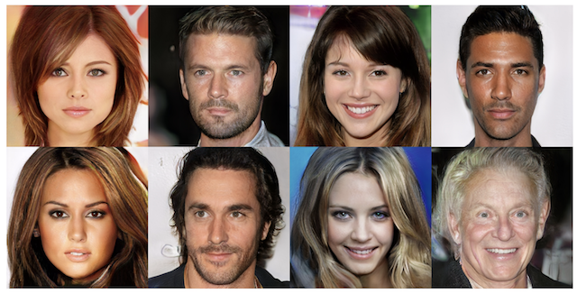
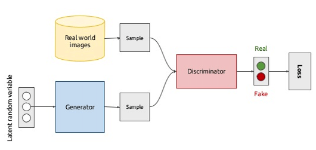
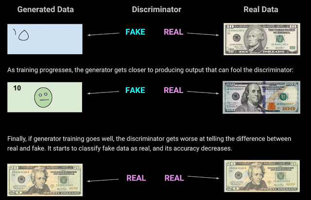

Generative Adversarial Networks - A primer

[January 27, 2020](https://ml-and-me.blogspot.com/2020/01/generative-adversarial-networks-primer.html)

### Generative Adversarial Networks - A primer

—

You must be wondering why I put up these pictures of random people above. Well, what if I told you these people don't even exist and were created by a computer? I was quite amazed myself when I saw this at an AI talk I attended a week back.

The images were produced by a special type of neural network called a Generative Adversarial Network (GAN). GANs have gained a lot of popularity over the past few years, especially in the medical imaging community, because of their ability to produce such realistic data. To understand the value of GANs, let's first explore how they work! In my next post, I’ll cover the uses of these networks in medical imaging. Most of the ideas I'll be discussing are from an amazing review paper, which I've linked at the end of the page - a huge shout out to Dr.Rebecca Pope for sharing this article with me!

GANs basically consist of two networks which are playing a game with each other -- the first network is a **generator** or **"generative model"** while the second network is a **discriminator** or **"discriminative model"**. What does this mean? Well, from the basic definition of these terms, the generator creates new data while the discriminator is trying to differentiate/discriminate between pieces of data.

This definition is too informal though, let's dig deeper to make the idea more concrete. Suppose you gave a piece of paper and pencil to a 5 year old child, let's call him Jack, and asked him "What is a cat?". He would draw the image on the right onto the paper...How did he do this? Well, he's probably seen so many cats...every time he saw a cat, his brain tried to understand "What makes *this* particular animal a "cat"?" and tried to pick out features like the pointy ears, the whiskers, the round face etc.

Now suppose you gave Jack a picture of a cat, a giraffe and a horse and asked him to find a cat, he would glance for a second and then quickly point to the correct picture. He didn't have to sit and examine each picture for its features to identify it, he just spotted the overall differences between the animals and picked out the cat.

This is essentially the difference between generative and discriminative modelling - by asking the question "What is a cat?" or "What makes this image a cat?", the model is forced to extract and learn features that make the object what it is, which is a generative approach. On the other hand, by asking "Which one is a cat?", the model looks at the overall differences, which is a discriminative approach.

Taking this a step further and making it more mathematical, generative models capture the *joint probability* P(image AND "cat") while discriminative models capture CONDITIONAL PROBABILITY - P("cat" | image). [ '|' means "given" so this reads as "probability of the label being "cat" given the image"].

Generative models learn much more than discriminative models because they have to capture complex features in data while discriminative models just have to find a way to separate/differentiate between data. By learning complex features and distributions, generative models are capable of producing new data that can look identical to the real data, like how Jack was able to produce the crude drawing of a cat. If I show Jack enough cats, he could learn so much that one day he could probably produce a really really good cat portrait!

This line which I read on Google's GAN course summarizes this point really well:

*> A generative model for images might capture correlations like "things that look like boats are probably going to appear near things that look like water" and "eyes are unlikely to appear on foreheads." These are very complicated distributions.*

*> In contrast, a discriminative model might learn the difference between "sailboat" or "not sailboat" by just looking for a few tell-tale patterns. It could ignore many of the correlations that the generative model must get right.*

Now that we've got an idea of how generative models and discriminate models work, let's see how they function together in a GAN architecture. Suppose we want to design a GAN that creates a picture of a dollar bill. What's the main goal here? It would be to output a picture that looks as similar as possible to a real dollar bill. The generator network of the GAN would first take some input **z**, which can be just random noise, and then give an output image **x-g** which is the generated "fake" dollar bill. The function **G** that produces this **x-g** would learn a set of weights **θ-g**. If the generator is trained well, we should see an **x-g** that is extremely similar to a real dollar bill **x-r**.

But how does this network ensure that the **x-g** looks as real as possible? This is where the discriminator comes in. The discriminator would perform some function **D** on either **x-g** or **x-r** and then predict a label **y** which can be "Real dollar bill" or "Fake dollar bill". The goal of **D** would be to learn a set of weights **θ-d** that help it distinguish between the real and fake image.

Now at the start of this post, I said that the generator and discriminator are playing a game with each other...what did I mean by this? Well, the generator's goal is making the generated image look as real as possible while the discriminator is trying to do its best to distinguish between the real and fake image. As the generator gets really really good at making realistic-looking data, it starts fooling the discriminator, because now the discriminator is struggling to tell the difference between what's real and what's fake and will perform worse.

Thus, training GANs is quite quite challenging, because you're always going to end up with one of the networks being stronger than the other. If the discriminator is stronger, then it means that it was too easy to detect what's fake, which suggests that the generator didn't do a good job. But if the generator is stronger, then it means that the discriminator is struggling so much that it is just giving random predictions. This may sound like the GAN is performing well, but this can also be bad because if the discriminator shows crap performance, then the generator will learn to dim down its performance and generate crappy images so that the discriminator gets better.

So that's just a quick overview of how GANs work. The model I just discussed is the simplest GAN called the "Vanilla GAN" (not sure why it's called Vanilla!). Over the years, researchers have taken this concept and built on it to create many different GAN architectures like cycleGAN, CGAN, InfoGAN, BEGAN etc for specialized tasks.

Do check out the below links if you want to go deeper into the math...Until then, stay tuned for my next post on how the GAN has benefitted medical imaging!

**
Links:**
https://hub.packtpub.com/getting-know-generative-models-types/
https://developers.google.com/machine-learning/gan
https://www.sciencedirect.com/science/article/abs/pii/S1361841518308430