Genomic ancestry inference with deep learning | Google Cloud Big Data and Machine Learning Blog  |  Google Cloud Platform

 

## Genomic ancestry inference with deep learning

Wednesday, September 27, 2017

 *Posted by Puneith Kaul, Developer Programs Engineer, Cloud Machine Learning; Nicole Deflaux, Software Engineer, Verily; Allen Day, Developer Advocate, Google Cloud Health AI; Elmer Garduno, Software Engineer, Cloud AI*

For the past several years, our goal at Google has been to play a critical role in bringing the benefits of AI to everyone.[Machine learning](https://en.wikipedia.org/wiki/Machine_learning) is at the heart of that goal. In the area of life sciences — or more specifically, the field of[genomics](https://en.wikipedia.org/wiki/Genomics) — we’re using ML to derive insights from the human genome. Additionally, due to the scale of human genomic data, we need new techniques to process the datasets using machine learning and cloud computing.

In this blog post, we’ll delve into ancestry prediction, one use case for genomics data. We’ll examine an analytical technique for verifying the ancestry of a human DNA sample, and show you how to implement it as a system using [Google Cloud Platform](https://cloud.google.com/), [TensorFlow](https://www.tensorflow.org/) and [Google Cloud Machine Learning Engine](https://cloud.google.com/ml-engine/).

### Why is ancestry inference important?

A common problem when analyzing genomic data is ensuring the integrity and quality of samples. Although quality control metrics exist to ensure sufficient DNA has been collected and is not degraded, sample labeling can still be a major source of error. Ancestry inference is one tool in a collection of quality control tests used to verify whether sample swaps or data contamination have occurred. Applying inference as a technique is sometimes used as a checksum to verify a sample’s integrity. For case-control studies, ancestry inference is also used to understand[population stratification](https://en.wikipedia.org/wiki/Population_stratification) across the cohort to help avoid spurious associations that might appear with even subtle ancestry differences between cases and controls.In this blog post, we’ll show you how to build a model for ancestry inference using the [1000 Genomes Project's labels](http://www.internationalgenome.org/faq/which-populations-are-part-your-study), the most detailed public catalog of human genetic variation. We’ll then walk through how we built an end-to-end machine learning pipeline architecture. In the process, we’ll demonstrate the reference architecture of such a system and why we think [Google Cloud Platform](https://cloud.google.com/) is a powerful way to deliver that architecture.

### 1000 Genomes dataset

The 1000 Genomes dataset has already been processed and uploaded to BigQuery table named [1000 Genomes phase 3](https://bigquery.cloud.google.com/table/genomics-public-data:1000_genomes_phase_3.variants_20150220_release?tab=preview). In this section, we’ll describe the processed dataset, and in a later section we’ll process the raw [Variant Call Format](http://samtools.github.io/hts-specs/VCFv4.3.pdf) (VCF) data using [Google Genomics API](https://cloud.google.com/genomics/overview), our implementation of the open standard from [Global Alliance for Genomics and Health](https://genomicsandhealth.org/). The variants data in BigQuery has the following statistics:

|     |     |
| --- | --- |
| **Table ID** | genomics-public-data:1000_genomes_phase_3.variants_20150220_release |
| **Table Size** | 10.5 TB |
| **Long Term Storage Size** | 10.5 TB |
| **Number of Rows** | 84,801,867 |
| **Creation Time** | Jan 8, 2016, 6:53:36 PM |
| **Last Modified** | Jan 15, 2016, 1:35:26 PM |
| **Data Location** | US  |
| **Labels** | None |

Figure 1: 1000 Genomes phase 3 variants statistics

Each row of data represents variation against a [Human Genome Reference](https://en.wikipedia.org/wiki/Reference_genome) and the individuals who have that variation. [This schema](https://bigquery.cloud.google.com/table/genomics-public-data:1000_genomes_phase_3.variants_20150220_release?tab=schema) can help you understand more about the table columns. The dataset can be found [here on BigQuery](https://bigquery.cloud.google.com/table/genomics-public-data:1000_genomes_phase_3.variants_20150220_release).

### Evaluation dataset

Once the model has been trained using 1000 Genomes, we’ll evaluate the model performance using the following data set:

### Simons Genome Diversity Project

The [Simons Genome Diversity Project](http://reichdata.hms.harvard.edu/pub/datasets/sgdp/) (SGDP) hosts complete human genome sequences from more than one hundred diverse human populations. The data is stored on [Google Cloud Storage](https://console.cloud.google.com/storage/genomics-public-data/simons-genome-diversity-project/) and [Google BigQuery](https://bigquery.cloud.google.com/dataset/genomics-public-data:simons_genome_diversity_project).

|     |     |     |
| --- | --- | --- |
| **Super_Population** | **Super_Population_Description** | **cnt** |
| AFR | African | 1018 |
| EUR | European | 669 |
| SAS | South Asian | 661 |
| EAS | East Asian | 617 |
| AMR | American | 535 |

Figure 2: 1000 Genomes labels

You can also run the following SQL on BigQuery to get more information about the labels from the [1000 Genomes Sample Info Dataset](https://bigquery.cloud.google.com/table/genomics-public-data:1000_genomes.sample_info?tab=schema).

hdr_strong

	#standardSQL
	SELECT
	  Super_Population,
	  Super_Population_Description,
	  COUNT(Super_Population) AS cnt
	FROM
	  `genomics-public-data.1000_genomes.sample_info`
	GROUP BY
	  Super_Population,
	  Super_Population_Description
	ORDER BY cnt DESC

Figure 3: SQL BigQuery to get information about ancestry labels

### Model building approach

In order to infer the ancestry of a given sample, we first need to train a machine learning model using an algorithm. We used [TensorFlow](https://www.tensorflow.org/) — an open source library for numerical computation using data flow graphs — to build and define the model, and the code to build this model can be found on [GitHub](https://github.com/googlegenomics/cloudml-examples). We treat the variants on each chromosome as a bag of words, where each word corresponds to a variant, defined as a tuple with five elements as (reference_name,start,end,reference_bases,alternate_bases) the set of all variants present on the dataset for a given chromosome. This defines a sparse space in multiple dimensions where the feature vector for each subject's variants per chromosome lives. Training a model on sparse vectors presents a challenge because we won’t have enough data to train. To solve this problem, we’ll convert the input vector into a lower dimensional dense [embedding](https://en.wikipedia.org/wiki/Word_embedding), resulting in an output which has non-zero values in the lower dimensional representation. We feed this output into a [feed-forward neural network](https://en.wikipedia.org/wiki/Feedforward_neural_network) with a single hidden [relu](https://en.wikipedia.org/wiki/Rectifier_(neural_networks)) layer and a fully connected output layer. To train this model, we need to optimize a [loss function](https://en.wikipedia.org/wiki/Loss_function), which is computed using [cross entropy](https://en.wikipedia.org/wiki/Cross_entropy) by applying [Momentum Optimizer](https://www.tensorflow.org/api_docs/python/tf/train/MomentumOptimizer). In the figure below you can see the [neural network](https://en.wikipedia.org/wiki/Artificial_neural_network) architecture currently employed.

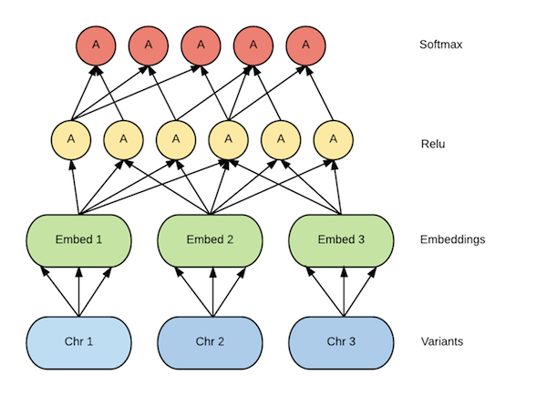
Figure 4: Neural network model architecture

### Reference architecture

The end-to-end architecture uses Google Cloud Platform services and makes it easy to manage a very complex workflow.

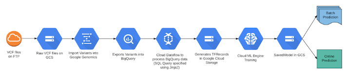
Figure 5: End-to-end processing using Google Cloud Platform services

### Transform data into actions

In this section we’ll take you through the steps needed to deliver the machine learning model. You can replicate these steps and achieve the same end goal for your problem.

### Data ingestion

Data ingestion involves taking your raw dataset and ingesting into Google Cloud Platform. You can do this in a few different ways using [Google Cloud Bigtable](https://cloud.google.com/bigquery/external-data-bigtable), [Google Cloud Storage](https://cloud.google.com/bigquery/external-data-cloud-storage) or [Google Drive](https://cloud.google.com/bigquery/external-data-drive), but for the purposes of this blog post, we’ll show you how to ingest raw VCF data into Google Cloud Storage. You can access raw VCF data from the [1000 Genomes FTP](https://cloud.google.com/blog/big-data/2017/09/genomic-ancestry-inference-with-deep-learningftp://ftp.1000genomes.ebi.ac.uk/vol1/ftp/phase1/analysis_results/integrated_call_sets/) and copy the files to Google Cloud Storage using gsutil. Alternatively, you could use the [Cloud Storage Transfer Service](https://cloud.google.com/storage/transfer/) for different ingestion options. To simplify this walkthrough, we’ve already copied the [raw VCF](https://console.cloud.google.com/storage/genomics-public-data/1000-genomes-phase-3/vcf-20150220) data to Google Cloud Storage.

### Data preparation

Next, we take the raw VCF dataset in Google Cloud Storage and process it through [Google Genomics API](https://cloud.google.com/genomics/overview). We’ll be performing two steps in this phase. The first will be to import the variants into Google Genomics, and the second will be to export the variants to BigQuery. The steps you’ll need to take to achieve this can be found in the [Loading Genomic Variants](https://cloud.google.com/genomics/v1/load-variants) guide. The output of this phase will be the variants dataset in BigQuery, which we have already pre-computed.

### Pre-computed data and model — Requires quota increase

In order to perform the data pre-processing and model training in the next few steps, you will need a quota increase. To save you compute and storage costs, we’ve already processed the data for you for this tutorial. The processed datasets and model locations are listed in the table below.

**Important Note:** The model size exceeds the 250MB limit placed by the prediction service. If you decide to send requests from your project, make sure to request a quota increase up to 0.5GB. To submit your model size request, click on the [quota link](https://console.cloud.google.com/apis/api/ml.googleapis.com/quotas), select any of the quota edit (pencil logo) links, apply for higher quota, and submit your form request.

|     |     |
| --- | --- |
| **Dataset/Model** | **Cloud Storage / BigQuery Location** |
| 1000 Genomes processed | [gs://human-genome/1000-genomes/20170819-142122](https://console.cloud.google.com/storage/browser/human-genome/1000-genomes/20170819-142122) |
| SGDP processed | [gs://human-genome/sgdp/20170823-063047](https://console.cloud.google.com/storage/browser/human-genome/sgdp/20170823-063047) |
| Cloud ML Engine model | [gs://human-genome/models/1000-genomes](https://console.cloud.google.com/storage/browser/human-genome/models/1000-genomes) |
| SGDP batch predictions | [gs://human-genome/predictions/sgdp](https://console.cloud.google.com/storage/browser/human-genome/predictions/sgdp) |
| SGDP BigQuery predictions | [https://bigquery.cloud.google.com/table/sgdp_predictions](https://bigquery.cloud.google.com/table/triple-team-177713:sgdp_predictions.predictions?tab=schema) |

Table 1: Google Cloud Storage locations for processed data and model

### Data pre-processing

To perform pre-processing, we run a pipeline on Google Cloud using [Apache Beam](https://beam.apache.org/) and [Cloud Dataflow](https://cloud.google.com/dataflow/). The pre-processing code is run on two datasets i.e., 1000 Genomes training data and SGDP validation data from BigQuery.

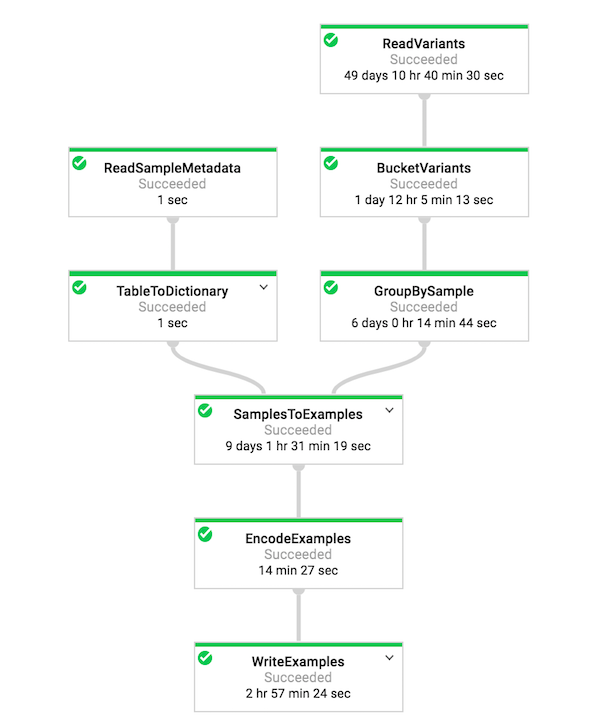
Figure 6: Dataflow DAG visualizer on Google Cloud which shows the Pipeline

### Storage of pre-processed data

Once the two Dataflow jobs are completed, make sure you have the data available in Google Cloud Storage. The data will be available in the location specified by the output flag in the code [here](https://github.com/googlegenomics/cloudml-examples#pre-processing-using-apache-beam). It’s this pre-processed data which we will use for training our ML model on [Cloud ML Engine](https://cloud.google.com/ml-engine/) in the following steps.

### Model training using Cloud ML Engine

[Cloud Machine Learning Engine](https://cloud.google.com/ml-engine/) is a managed service that enables you to easily build machine learning models that work on any type of data and size. We will now take our TensorFlow code, as described in the model building approach section, and train the model in the cloud using Cloud ML Engine. Take a look at the code on [GitHub](https://github.com/googlegenomics/cloudml-examples#training-using-cloudml).

### Hyperparameter tuning

Hyperparameter tuning is a critical aspect of model architecture design, and Cloud ML Engine provides out of the box support for it as a service called [Hypertune](https://cloud.google.com/ml-engine/docs/concepts/hyperparameter-tuning-overview). The sophistication of [Hypertune](https://cloud.google.com/blog/big-data/2017/08/hyperparameter-tuning-in-cloud-machine-learning-engine-using-bayesian-optimization), compared to traditional methods of hyperparameter tuning, makes it particularly helpful. We will use the Hypertune service to determine the model’s learning rate. In this particular experiment setup, we ran 10 experiments with Hypertune to discover the ideal learning rate. You can check out the output of the Hypertune job on cloud console and identify the most optimized run. Take a look at the code on [GitHub](https://github.com/googlegenomics/cloudml-examples#hyperparameter-tuning).

### TensorBoard

You can inspect the training behavior using a powerful tool called [TensorBoard](https://www.tensorflow.org/get_started/summaries_and_tensorboard). It allows you to visualize the graph and plot quantitative metrics about the execution of the graph. Once the training process is complete, you can point TensorBoard to the summary logs produced during training [as described on GitHub](https://github.com/googlegenomics/cloudml-examples#training-using-cloudml). Check out the images below from TensorBoard to see the network performance based on 20% of the 1000 Genomes data held out for evaluation.

|     |     |
| --- | --- |
| 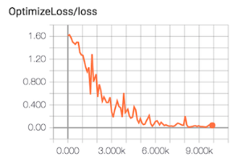 | 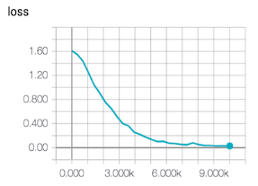 |
| 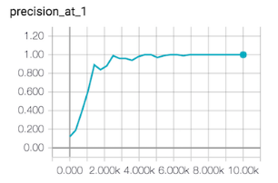 | 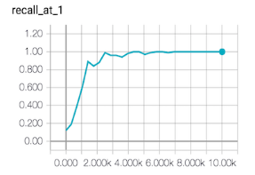 |
| 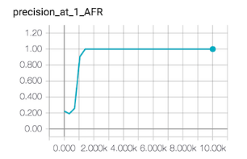 | 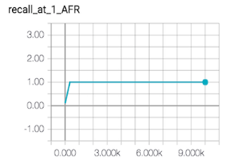 |
| 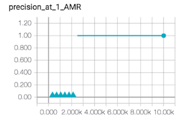 | 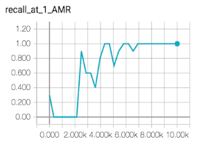 |
| 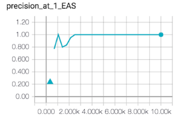 | 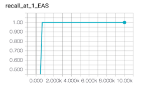 |
| 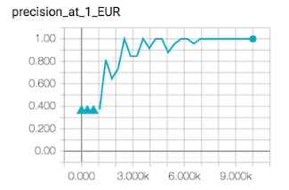 | 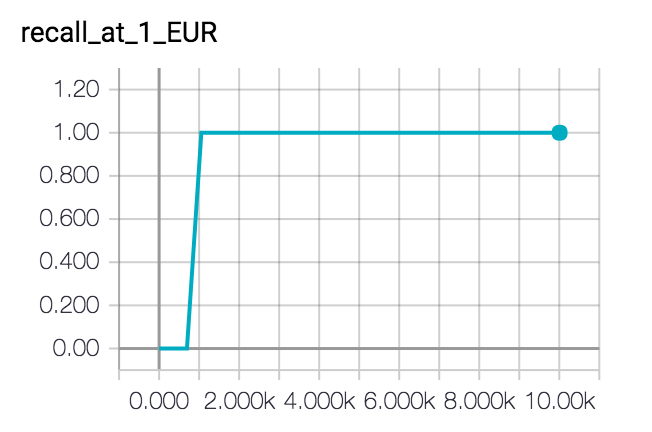 |
| 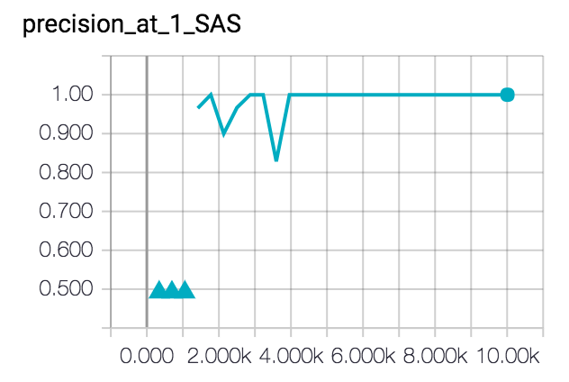 | 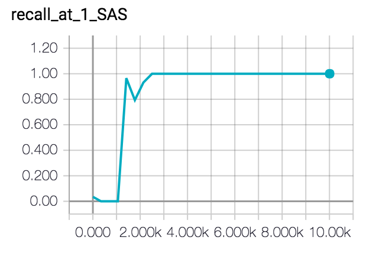 |

### Prediction using the trained model

If you simply want to create the prediction service and try it out, perform the following steps in your project and make sure you’ve requested increased quota as mentioned above.

hdr_strong

	MODEL=genomes1kgp
	BINARIES=<YOUR CLOUD STORAGE LOCATION WHERE YOU COPIED THE MODEL TO>
	gcloud ml-engine models create $MODEL --regions us-central1
	gcloud ml-engine versions create v1 --model $MODEL --origin $BINARIES --runtime-version 1.2

You can also run a batch prediction job on Cloud ML Engine as shown [here](https://github.com/googlegenomics/cloudml-examples#batch-predict).

### Confusion matrix

[Google Datalab](https://cloud.google.com/datalab/) is an interactive tool that lets you explore, analyze, visualize and build powerful machine learning models on Google Cloud Platform. With two simple lines of code, we can create a confusion matrix from the [BigQuery SGDP prediction table](https://bigquery.cloud.google.com/table/triple-team-177713:sgdp_predictions.predictions).

hdr_strong

	from google.datalab.ml import *
	ConfusionMatrix.from_bigquery('triple-team-177713.sgdp_predictions.predictions').plot()

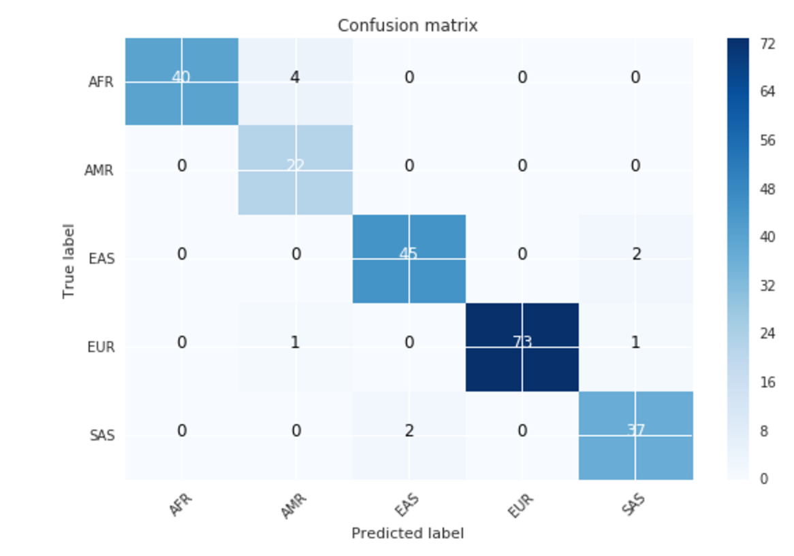

Figure 7: Confusion matrix

The confusion matrix above has 10 samples that don’t match their target and can be seen in the table below. These predictions are for sub populations at the boundaries of the super population groupings. For more information, please see [Simons Genome Diversity Project publication.](http://www.nature.com/nature/journal/v538/n7624/full/nature18964.html)

|     |     |     |     |     |     |     |     |     |
| --- | --- | --- | --- | --- | --- | --- | --- | --- |
| **vcf_key** | **population** | **target** | **predicted** | **AFR** | **AMR** | **EAS** | **EUR** | **SAS** |
| LP6005441-DNA_G08 | Mozabite | AFR | AMR | 0.0644 | 0.760 | 4.42E-05 | 0.164 | 0.011 |
| LP6005441-DNA_H08 | Mozabite | AFR | AMR | 0.169 | 0.794 | 1.61E-05 | 0.033 | 0.003 |
| LP6005619-DNA_B01 | Saharawi | AFR | AMR | 0.0657 | 0.836 | 8.29E-05 | 0.083 | 0.014 |
| LP6005619-DNA_C01 | Saharawi | AFR | AMR | 0.09 | 0.839 | 4.65E-05 | 0.062 | 0.008 |
| LP6005442-DNA_B01 | Uygur | EAS | SAS | 0.0002 | 0.164 | 0.2417 | 0.003 | 0.591 |
| LP6005443-DNA_B02 | Uygur | EAS | SAS | 0.0002 | 0.198 | 0.1776 | 0.004 | 0.619 |
| LP6005443-DNA_C09 | Kusunda | SAS | EAS | 1.11E-05 | 0.018 | 0.6197 | 5.58E-05 | 0.362 |
| LP6005443-DNA_D09 | Kusunda | SAS | EAS | 8.38E-06 | 0.013 | 0.6511 | 4.43E-05 | 0.336 |
| LP6005592-DNA_D01 | Saami | EUR | AMR | 0.0014 | 0.415 | 0.0055 | 0.335 | 0.243 |
| LP6005519-DNA_C03 | Tajik | EUR | SAS | 0.001 | 0.243 | 0.0036 | 0.281 | 0.471 |

Table 2: Mismatched samples with super population probabilities

### Conclusion

Hopefully this blog post gave you deeper insight into implementing a complex use case like ancestry prediction in human genomics on Google Cloud Platform. If you ever need to build something similar, we encourage you to revisit this blog post as a reference implementation. We also recommend considering multiple GCP services. We designed them to work well together and deliver a solution that’s easy to maintain.

### References

1. [A global reference for human genetic variation](http://www.nature.com/nature/journal/v526/n7571/full/nature15393.html?foxtrotcallback=true)

2. [The Simons Genome Diversity Project: 300 genomes from 142 diverse populations](http://www.nature.com/nature/journal/v538/n7624/full/nature18964.html)

3. [Cloud-based interactive analysis for terabytes of genomic variants data](https://academic.oup.com/bioinformatics/article-abstract/doi/10.1093/bioinformatics/btx468/4036385/Cloud-based-Interactive-Analytics-for-Terabytes-of)