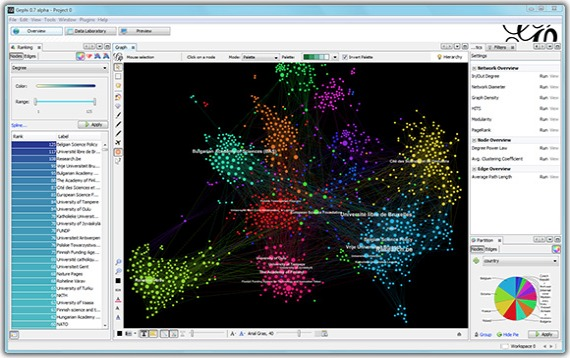
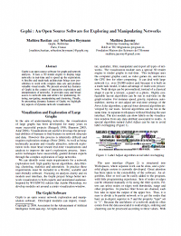

Gephi - The Open Graph Viz Platform

 

- [Home](https://gephi.org/)

- [Features](https://gephi.org/features/)

- [Learn](https://gephi.org/users/)

- [Develop](https://gephi.org/developers/)

- [Plugins](https://marketplace.gephi.org/)

- [Services](https://marketplace.gephi.org/services/)

- [Consortium](https://consortium.gephi.org/)

 [Download](https://gephi.org/users/download/) | [Blog](http://gephi.wordpress.com/) | [Wiki](https://github.com/gephi/gephi/wiki) | [Forum](http://forum-gephi.org/) | [Support](https://gephi.org/users/support/) | [Bug tracker](https://github.com/gephi/gephi)

# The Open Graph Viz Platform

Gephi is the leading visualization and exploration software for all kinds of graphs and networks. Gephi is open-source and free.

Runs on Windows, Mac OS X and Linux.
 [Learn More on Gephi Platform »](https://gephi.org/features/)
 [(L)](https://gephi.org/users/download/)

 [Release Notes](https://github.com/gephi/gephi/wiki/Releases) | [System Requirements](https://gephi.org/users/requirements/)

- [Features](https://gephi.org/features/)

- [Screenshots](https://gephi.org/screenshots/)

- [Quick start](https://gephi.org/users/quick-start/)

- [Videos](https://gephi.org/videos/)

 

Support us! We are [non-profit](https://consortium.gephi.org/). Help us to [innovate](https://github.com/gephi/gephi/wiki/Manifesto) and [empower](https://marketplace.gephi.org/) the community by donating only 8€:

## Applications

**Exploratory Data Analysis**: intuition-oriented analysis by networks manipulations in real time.

**Link Analysis**: revealing the underlying structures of associations between objects.

**Social Network Analysis**: easy creation of social data connectors to map community organizations and small-world networks.

**Biological Network analysis**: representing patterns of biological data.

**Poster creation**: scientific work promotion with hi-quality printable maps.
 [Learn More »](https://gephi.org/features/)
* * *

## Metrics ready

**Centrality**: used in sociology to indicate how well a node is connected. Available: degree (power-law), betweenness, closeness.

**And more**: density, path length, diameter, HITS, modularity, clustering coefficient.

 [Learn More »](https://gephi.org/features/)
* * *

## Technology

**Ergonomic interface**: no programming skills needed

**High-performance**: built-in rendering engine.

**Native file formats**: GDF (GUESS), GraphML (NodeXL), GML, NET (Pajek), GEXF and [more](https://gephi.org/users/supported-graph-formats/).

**Customizable by plugins**: layouts, metrics, data sources, manipulation tools, rendering presets and more.

 [Learn More »](https://gephi.org/features/)

Like Photoshop™ for graphs.
 — the Community

* * *

## Latest News

- [Gephi updates with 0.9.1 version](https://gephi.wordpress.com/2016/02/15/gephi-updates-with-0-9-1-version/)

- [A close look at the Gephi user community](https://gephi.wordpress.com/2016/02/06/a-close-look-at-the-gephi-user-community/)

- [Gephi 0.9 released: Play with network data again](https://gephi.wordpress.com/2015/12/21/gephi-0-9-released-play-with-network-data-again/)

- [Gephi boosts its performance with new “GraphStore” core](https://gephi.wordpress.com/2015/12/04/gephi-boosts-its-performance-with-new-graphstore-core/)

 [See All »](https://gephi.wordpress.com/)
* * *

## Papers

 

Bastian M., Heymann S., Jacomy M. (2009). *Gephi: an open source software for exploring and manipulating networks.* International AAAI Conference on Weblogs and Social Media. From [AAAI](http://www.aaai.org/ocs/index.php/ICWSM/09/paper/view/154) [[PDF](https://gephi.org/publications/gephi-bastian-feb09.pdf)].

 [Learn More »](https://gephi.org/users/publications/)
* * *

## Gephi 0.9.1 is here!

 

The latest Gephi version just got released, let us know what you think on [Twitter](https://twitter.com/gephi) or [Facebook](https://www.facebook.com/groups/gephi/).

 [Learn More »](https://github.com/gephi/gephi/releases/tag/v0.9.1)

[Gephi.org](https://gephi.org/) © All Rights Reserved 2008-2017

 [home](https://gephi.org/)  [legal](https://gephi.org/legal/)  [about](https://gephi.org/about/)  [spread!](https://gephi.org/users/marketing/spread-users/)  [press](https://gephi.org/about/press/)            

[(L)](https://gephi.org/#)Window size:  x
Viewport size:  x