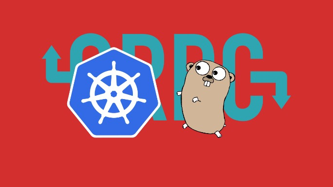

Getting Started with Microservices using Go, gRPC and Kubernetes - Outcrawl

# Getting Started with Microservices using Go, gRPC and Kubernetes

[Tin Rabzelj](https://outcrawl.com/authors/tin-rabzelj/)
27 October, 2017

[(L)](https://twitter.com/intent/tweet?url=https://outcrawl.comgetting-started-microservices-go-grpc-kubernetes/&text=Getting%20Started%20with%20Microservices%20using%20Go,%20gRPC%20and%20Kubernetes)[(L)](https://www.facebook.com/sharer/sharer.php?u=https://outcrawl.comgetting-started-microservices-go-grpc-kubernetes/)[(L)](https://plus.google.com/share?url=https://outcrawl.comgetting-started-microservices-go-grpc-kubernetes/)

 

This article aims to provide a simple introduction to building microservices in Go, using gRPC, and deploying them to a Kubernetes cluster. It shows how to set up two containerized, scalable services, talking to each other using request/response mechanism.

One microservice will be responsible for calculating the greatest common divisor (GCD) of two integers. That's not something that requires building a separate service, but it will serve as an introductory example just fine. The other will serve a public REST API, and depend on first service when needed.

##  Prerequisites

The best way to get a running Kubernetes cluster for development, at least for now, is to use Minikube.

Install [Minikube](https://github.com/kubernetes/minikube), [kubectl](https://kubernetes.io/docs/tasks/tools/install-kubectl/), [Docker](https://docs.docker.com/engine/installation/) and Protocol Buffers [compiler](https://github.com/google/protobuf).

Run Minikube. Certain commands will require root privileges.

	$ minikube start [--vm-driver=<driver>]
	$ kubectl cluster-info

To speed up the development, set docker to reuse Docker daemon running inside the Minikube virtual machine.

`$ eval $(minikube docker-env)`

This way, you don't have to push images to a Docker registry. For running your apps on [Google Container Engine](https://cloud.google.com/container-engine/) you'd use [Container Registry](https://cloud.google.com/container-registry/) or set up a [private container registry](https://github.com/kubernetes/kubernetes/tree/master/cluster/addons/registry) inside the cluster.

##  Defining communication protocol

Services will interact synchronously, which means a client calls a service and waits for the response. One of the popular frameworks, that provides this functionality, is gRPC. To use it, you need to write definitions for message types and services in Protocol Buffer's [interface definition language](https://developers.google.com/protocol-buffers/docs/proto3) and compile them.

Create `gcd.proto` file inside `pb` directory, which is located inside your project's root directory.

	syntax = "proto3";

	package pb;

	message GCDRequest {
	  uint64 a = 1;
	  uint64 b = 2;
	}

	message GCDResponse {
	  uint64 result = 1;
	}

	service GCDService {
	  rpc Compute (GCDRequest) returns (GCDResponse) {}
	}

Navigate to the `pb` directory and run the following command.

`$ protoc -I . --go_out=plugins=grpc:. ./*.proto`

Compilation should produce `gcd.pb.go` file.

##  Greatest common divisor service

The GCD service will use auto-generated code to serve a RPC endpoint which calculates the GCD.

Create `main.go` file inside `gcd` directory. Make sure you import correct packages.

	package main
	import (
		"log"
	  "net"
	  // Change this for your own project
		"github.com/tinrab/kubernetes-go-grpc-tutorial/pb"
		context "golang.org/x/net/context"
		"google.golang.org/grpc"
		"google.golang.org/grpc/reflection"
	)

In the `main` function, register a server type which will handle requests. Then start the gRPC server.

	type server struct{}

	func main() {
		lis, err := net.Listen("tcp", ":3000")
		if err != nil {
			log.Fatalf("Failed to listen: %v", err)
		}
		s := grpc.NewServer()
		pb.RegisterGCDServiceServer(s, &server{})
		reflection.Register(s)
		if err := s.Serve(lis); err != nil {
			log.Fatalf("Failed to serve: %v", err)
		}
	}

Declare the `Compute` handler function. This makes the `server` type conform to the auto-generated `pb.GCDServiceServer` interface.

	func (s *server) Compute(ctx context.Context, r *pb.GCDRequest) (*pb.GCDResponse, error) {
		a, b := r.A, r.B
		for b != 0 {
			a, b = b, a%b
		}
		return &pb.GCDResponse{Result: a}, nil
	}

##  Frontend API service

Frontend service uses [gin](https://github.com/gin-gonic/gin) web framework to serve a REST API and calls the GCD service for the actual calculation.

Create a client to communicate with the GCD service inside `main` function. Because Kubernetes (v1.3+) has a built-in DNS service, you can refer to the GCD service with the name "gcd-service", defined later on.

	func main() {
		conn, err := grpc.Dial("gcd-service:3000", grpc.WithInsecure())
		if err != nil {
			log.Fatalf("Dial failed: %v", err)
		}
		gcdClient := pb.NewGCDServiceClient(conn)
	}

After that, declare a handler for `/gcd/:a/:b` endpoint which reads parameters `A` and `B`, and then calls the GCD service.

	r := gin.Default()
	r.GET("/gcd/:a/:b", func(c *gin.Context) {
	  // Parse parameters
	  a, err := strconv.ParseUint(c.Param("a"), 10, 64)
	  if err != nil {
	    c.JSON(http.StatusBadRequest, gin.H{"error": "Invalid parameter A"})
	    return
	  }
	  b, err := strconv.ParseUint(c.Param("b"), 10, 64)
	  if err != nil {
	    c.JSON(http.StatusBadRequest, gin.H{"error": "Invalid parameter B"})
	    return
	  }
	  // Call GCD service
	  req := &pb.GCDRequest{A: a, B: b}
	  if res, err := gcdClient.Compute(c, req); err == nil {
	    c.JSON(http.StatusOK, gin.H{
	      "result": fmt.Sprint(res.Result),
	    })
	  } else {
	    c.JSON(http.StatusInternalServerError, gin.H{"error": err.Error()})
	  }
	})

Run the server.

	if err := r.Run(":3000"); err != nil {
	  log.Fatalf("Failed to run server: %v", err)
	}

##  Building Docker images

Now that your services are ready, you need to containerize them. Create Dockerfiles, one for each service, inside your project's root directory. Dockerfiles can't be located in a subdirectory, because Docker's `COPY` command can't copy files from the parent directory, which is needed in this example.

Create `Dockerfile.api`.

	FROM golang:1.9.1

	# Change this path!
	WORKDIR /go/src/github.com/tinrab/kubernetes-go-grpc-tutorial/api
	COPY api .
	COPY pb ../pb

	RUN go get -v ./...
	RUN go install -v ./...

	EXPOSE 3000

	CMD [ "api" ]

And the `Dockerfile.gcd`.

	FROM golang:1.9.1

	WORKDIR /go/src/github.com/tinrab/kubernetes-go-grpc-tutorial/gcd
	COPY gcd .
	COPY pb ../pb

	RUN go get -v ./...
	RUN go install -v ./...

	EXPOSE 3000

	CMD [ "gcd" ]

Build both images. If you switched to Minikube's Docker daemon, they will become available inside the VM.

	$ docker build -t local/gcd -f Dockerfile.gcd .
	$ docker build -t local/api -f Dockerfile.api .

##  Deploying to Kubernetes cluster

For each service, you'll need to configure two Kubernetes objects—a [deployment](https://kubernetes.io/docs/concepts/workloads/controllers/deployment/) and a [service](https://kubernetes.io/docs/concepts/services-networking/service/).

Explained simply, **deployments** manage sets of pods to keep the "desired state" of the cluster. **Pods** are collections of containers. Because they are created and destroyed dynamically, **services** are needed to provide fixed addresses by which to access them. Which pods are targeted by which services, is determined by label selectors.

Configuration files below are fairly standard. The important parts to keep note of are the ports, names of Docker images built earlier, and labels. Also, `imagePullPolicy` is set to `Never` to ensure Kubernetes uses images built locally.

Create `gcd.yaml` file. It declares a deployment and a service in the same file. Another practice is to separate them into `gcd-deployment.yaml` and `gcd-service.yaml`.

	apiVersion: apps/v1beta1
	kind: Deployment
	metadata:
	  name: gcd-deployment
	  labels:
	    app: gcd
	spec:
	  selector:
	    matchLabels:
	      app: gcd
	  replicas: 3
	  template:
	    metadata:
	      labels:
	        app: gcd
	    spec:
	      containers:

	      - name: gcd

	        image: local/gcd
	        imagePullPolicy: Never
	        ports:

	        - name: gcd-service

	          containerPort: 3000
	---
	apiVersion: v1
	kind: Service
	metadata:
	  name: gcd-service
	spec:
	  selector:
	    app: gcd
	  ports:

	  - port: 3000

	    targetPort: gcd-service

Create `api.yaml` file. The service type is set to `NodePort`, which makes this service accessible outside of the cluster. For the GCD service, this is set to a default value of `ClusterIP`, which means a "cluster-internal" IP address.

	apiVersion: apps/v1beta1
	kind: Deployment
	metadata:
	  name: api-deployment
	  labels:
	    app: api
	spec:
	  selector:
	    matchLabels:
	      app: api
	  replicas: 1
	  template:
	    metadata:
	      labels:
	        app: api
	    spec:
	      containers:

	      - name: api

	        image: local/api
	        imagePullPolicy: Never
	        ports:

	        - name: api-service

	          containerPort: 3000
	---
	apiVersion: v1
	kind: Service
	metadata:
	  name: api-service
	spec:
	  type: NodePort
	  selector:
	    app: api
	  ports:

	  - port: 3000

	    targetPort: api-service

To create these resources inside the cluster, run the following commands.

	$ kubectl create -f api.yaml
	$ kubectl create -f gcd.yaml

Check if all pods are running. By specifying `-w` flag, you can watch for changes.

	$ kubectl get pods -w
	NAME                             READY     STATUS    RESTARTS   AGE
	api-deployment-778049682-3vd0z   1/1       Running   0          3s
	gcd-deployment-544390878-0zgc8   1/1       Running   0          2s
	gcd-deployment-544390878-p78g0   1/1       Running   0          2s
	gcd-deployment-544390878-r26nx   1/1       Running   0          2s

As set in the configuration files, API service runs on a single pod and the GCD service runs on 3.

Get the URL of the API service.

`$ minikube service api-service --url`

Finally, try it out.

`$ curl http://192.168.99.100:32602/gcd/294/462`

##  Conclusion

This article showed how to get a simple stateless application running on a Kubernetes cluster. Future posts will demonstrate more thorough and interesting examples of building applications with Go and Kubernetes.

Until then, learn more about [concepts](https://kubernetes.io/docs/concepts/) of Kubernetes and find out how to perform specific [tasks](https://kubernetes.io/docs/tasks/).

Entire source code is available on [GitHub](https://github.com/tinrab/kubernetes-go-grpc-tutorial).