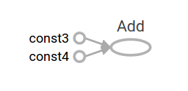
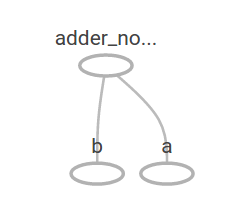
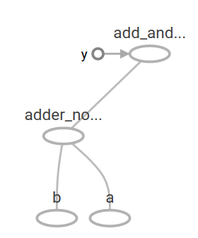
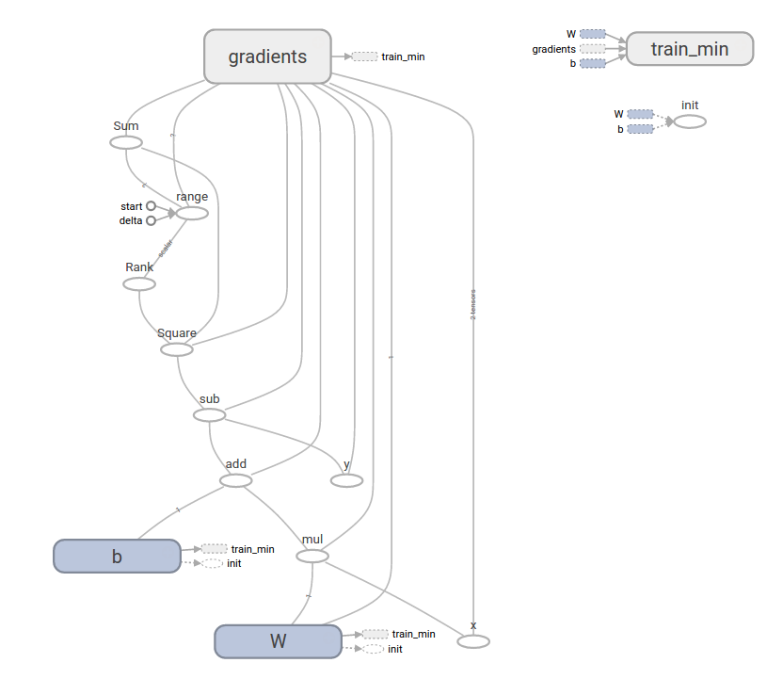

Getting Started With TensorFlow  |  TensorFlow

#  Getting Started With TensorFlow

- [Contents](https://www.tensorflow.org/get_started/get_started#top_of_page)
- [TensorFlow Core tutorial](https://www.tensorflow.org/get_started/get_started#tensorflow_core_tutorial)
    - [Importing TensorFlow](https://www.tensorflow.org/get_started/get_started#importing_tensorflow)
    - [The Computational Graph](https://www.tensorflow.org/get_started/get_started#the_computational_graph)
- [tf.train API](https://www.tensorflow.org/get_started/get_started#tftrain_api)

    -
-
    -
    -
-
-

This guide gets you started programming in TensorFlow. Before using this guide,[install TensorFlow](https://www.tensorflow.org/install/index). To get the most out of this guide, you should know the following:

- How to program in Python.
- At least a little bit about arrays.
- Ideally, something about machine learning. However, if you know little or nothing about machine learning, then this is still the first guide you should read.

TensorFlow provides multiple APIs. The lowest level API--TensorFlow Core-- provides you with complete programming control. We recommend TensorFlow Core for machine learning researchers and others who require fine levels of control over their models. The higher level APIs are built on top of TensorFlow Core. These higher level APIs are typically easier to learn and use than TensorFlow Core. In addition, the higher level APIs make repetitive tasks easier and more consistent between different users. A high-level API like tf.contrib.learn helps you manage data sets, estimators, training and inference. Note that a few of the high-level TensorFlow APIs--those whose method names contain `contrib`-- are still in development. It is possible that some `contrib` methods will change or become obsolete in subsequent TensorFlow releases.

This guide begins with a tutorial on TensorFlow Core. Later, we demonstrate how to implement the same model in tf.contrib.learn. Knowing TensorFlow Core principles will give you a great mental model of how things are working internally when you use the more compact higher level API.

# Tensors

The central unit of data in TensorFlow is the **tensor**. A tensor consists of a set of primitive values shaped into an array of any number of dimensions. A tensor's **rank** is its number of dimensions. Here are some examples of tensors:

hdr_strong
content_copy

`3 # a rank 0 tensor; this is a scalar with shape [][[NEWLINE]][1. ,2., 3.] # a rank 1 tensor; this is a vector with shape [3][[NEWLINE]][[1., 2., 3.], [4., 5., 6.]] # a rank 2 tensor; a matrix with shape [2, 3][[NEWLINE]][[[1., 2., 3.]], [[7., 8., 9.]]] # a rank 3 tensor with shape [2, 1, 3][[NEWLINE]]`

## [arrow_upward](https://www.tensorflow.org/get_started/get_started#top_of_page)TensorFlow Core tutorial

### Importing TensorFlow

The canonical import statement for TensorFlow programs is as follows:
hdr_strong
content_copy
`import tensorflow as tf[[NEWLINE]][[NEWLINE]]`

This gives Python access to all of TensorFlow's classes, methods, and symbols. Most of the documentation assumes you have already done this.

### The Computational Graph

You might think of TensorFlow Core programs as consisting of two discrete sections:

1. Building the computational graph.
2. Running the computational graph.

A **computational graph** is a series of TensorFlow operations arranged into a graph of nodes. Let's build a simple computational graph. Each node takes zero or more tensors as inputs and produces a tensor as an output. One type of node is a constant. Like all TensorFlow constants, it takes no inputs, and it outputs a value it stores internally. We can create two floating point Tensors `node1`and `node2` as follows:

hdr_strong
content_copy

`node1 = tf.constant(3.0, tf.float32)[[NEWLINE]]node2 = tf.constant(4.0) # also tf.float32 implicitly[[NEWLINE]]print(node1, node2)[[NEWLINE]]`

The final print statement produces
hdr_strong
content_copy

`Tensor("Const:0", shape=(), dtype=float32) Tensor("Const_1:0", shape=(), dtype=float32)[[NEWLINE]]`

Notice that printing the nodes does not output the values `3.0` and `4.0` as you might expect. Instead, they are nodes that, when evaluated, would produce 3.0 and 4.0, respectively. To actually evaluate the nodes, we must run the computational graph within a **session**. A session encapsulates the control and state of the TensorFlow runtime.

The following code creates a `Session` object and then invokes its `run` method to run enough of the computational graph to evaluate `node1` and `node2`. By running the computational graph in a session as follows:

hdr_strong
content_copy
`sess = tf.Session()[[NEWLINE]]print(sess.run([node1, node2]))[[NEWLINE]]`
we see the expected values of 3.0 and 4.0:
hdr_strong
content_copy
`[3.0, 4.0][[NEWLINE]]`

We can build more complicated computations by combining `Tensor` nodes with operations (Operations are also nodes.). For example, we can add our two constant nodes and produce a new graph as follows:

hdr_strong
content_copy

`node3 = tf.add(node1, node2)[[NEWLINE]]print("node3: ", node3)[[NEWLINE]]print("sess.run(node3): ",sess.run(node3))[[NEWLINE]]`

The last two print statements produce
hdr_strong
content_copy

`node3:  Tensor("Add_2:0", shape=(), dtype=float32)[[NEWLINE]]sess.run(node3):  7.0[[NEWLINE]]`

TensorFlow provides a utility called TensorBoard that can display a picture of the computational graph. Here is a screenshot showing how TensorBoard visualizes the graph:

As it stands, this graph is not especially interesting because it always produces a constant result. A graph can be parameterized to accept external inputs, known as **placeholders**. A **placeholder** is a promise to provide a value later.

hdr_strong
content_copy

`a = tf.placeholder(tf.float32)[[NEWLINE]]b = tf.placeholder(tf.float32)[[NEWLINE]]adder_node = a + b  # + provides a shortcut for tf.add(a, b)[[NEWLINE]]`

The preceding three lines are a bit like a function or a lambda in which we define two input parameters (a and b) and then an operation on them. We can evaluate this graph with multiple inputs by using the feed_dict parameter to specify Tensors that provide concrete values to these placeholders:

hdr_strong
content_copy

`print(sess.run(adder_node, {a: 3, b:4.5}))[[NEWLINE]]print(sess.run(adder_node, {a: [1,3], b: [2, 4]}))[[NEWLINE]]`

resulting in the output
hdr_strong
content_copy
`7.5[[NEWLINE]][ 3.  7.][[NEWLINE]]`
In TensorBoard, the graph looks like this:

We can make the computational graph more complex by adding another operation. For example,

hdr_strong
content_copy

`add_and_triple = adder_node * 3.[[NEWLINE]]print(sess.run(add_and_triple, {a: 3, b:4.5}))[[NEWLINE]]`

produces the output
hdr_strong
content_copy
`22.5[[NEWLINE]]`
The preceding computational graph would look as follows in TensorBoard:

In machine learning we will typically want a model that can take arbitrary inputs, such as the one above. To make the model trainable, we need to be able to modify the graph to get new outputs with the same input. **Variables** allow us to add trainable parameters to a graph. They are constructed with a type and initial value:

hdr_strong
content_copy

`W = tf.Variable([.3], tf.float32)[[NEWLINE]]b = tf.Variable([-.3], tf.float32)[[NEWLINE]]x = tf.placeholder(tf.float32)[[NEWLINE]]linear_model = W * x + b[[NEWLINE]]`

Constants are initialized when you call `tf.constant`, and their value can never change. By contrast, variables are not initialized when you call `tf.Variable`. To initialize all the variables in a TensorFlow program, you must explicitly call a special operation as follows:

hdr_strong
content_copy
`init = tf.global_variables_initializer()[[NEWLINE]]sess.run(init)[[NEWLINE]]`

It is important to realize `init` is a handle to the TensorFlow sub-graph that initializes all the global variables. Until we call `sess.run`, the variables are uninitialized.

Since `x` is a placeholder, we can evaluate `linear_model` for several values of`x` simultaneously as follows:

hdr_strong
content_copy
`print(sess.run(linear_model, {x:[1,2,3,4]}))[[NEWLINE]]`
to produce the output
hdr_strong
content_copy
`[ 0.          0.30000001  0.60000002  0.90000004][[NEWLINE]]`

We've created a model, but we don't know how good it is yet. To evaluate the model on training data, we need a `y` placeholder to provide the desired values, and we need to write a loss function.

A loss function measures how far apart the current model is from the provided data. We'll use a standard loss model for linear regression, which sums the squares of the deltas between the current model and the provided data. `linear_model - y` creates a vector where each element is the corresponding example's error delta. We call `tf.square` to square that error. Then, we sum all the squared errors to create a single scalar that abstracts the error of all examples using `tf.reduce_sum`:

hdr_strong
content_copy

`y = tf.placeholder(tf.float32)[[NEWLINE]]squared_deltas = tf.square(linear_model - y)[[NEWLINE]]loss = tf.reduce_sum(squared_deltas)[[NEWLINE]]print(sess.run(loss, {x:[1,2,3,4], y:[0,-1,-2,-3]}))[[NEWLINE]]`

producing the loss value
hdr_strong
content_copy
`23.66[[NEWLINE]]`

We could improve this manually by reassigning the values of `W` and `b` to the perfect values of -1 and 1. A variable is initialized to the value provided to`tf.Variable` but can be changed using operations like `tf.assign`. For example,`W=-1` and `b=1` are the optimal parameters for our model. We can change `W` and`b` accordingly:

hdr_strong
content_copy

`fixW = tf.assign(W, [-1.])[[NEWLINE]]fixb = tf.assign(b, [1.])[[NEWLINE]]sess.run([fixW, fixb])[[NEWLINE]]print(sess.run(loss, {x:[1,2,3,4], y:[0,-1,-2,-3]}))[[NEWLINE]]`

The final print shows the loss now is zero.
hdr_strong
content_copy
`0.0[[NEWLINE]]`

We guessed the "perfect" values of `W` and `b`, but the whole point of machine learning is to find the correct model parameters automatically. We will show how to accomplish this in the next section.

## [arrow_upward](https://www.tensorflow.org/get_started/get_started#top_of_page)tf.train API

A complete discussion of machine learning is out of the scope of this tutorial. However, TensorFlow provides **optimizers** that slowly change each variable in order to minimize the loss function. The simplest optimizer is **gradient descent**. It modifies each variable according to the magnitude of the derivative of loss with respect to that variable. In general, computing symbolic derivatives manually is tedious and error-prone. Consequently, TensorFlow can automatically produce derivatives given only a description of the model using the function `tf.gradients`. For simplicity, optimizers typically do this for you. For example,

hdr_strong
content_copy

`optimizer = tf.train.GradientDescentOptimizer(0.01)[[NEWLINE]]train = optimizer.minimize(loss)[[NEWLINE]]`

hdr_strong
content_copy

`sess.run(init) # reset values to incorrect defaults.[[NEWLINE]]for i in range(1000):[[NEWLINE]]  sess.run(train, {x:[1,2,3,4], y:[0,-1,-2,-3]})[[NEWLINE]][[NEWLINE]]print(sess.run([W, b]))[[NEWLINE]]`

results in the final model parameters:
hdr_strong
content_copy

`[array([-0.9999969], dtype=float32), array([ 0.99999082],[[NEWLINE]] dtype=float32)][[NEWLINE]]`

Now we have done actual machine learning! Although doing this simple linear regression doesn't require much TensorFlow core code, more complicated models and methods to feed data into your model necessitate more code. Thus TensorFlow provides higher level abstractions for common patterns, structures, and functionality. We will learn how to use some of these abstractions in the next section.

### Complete program

The completed trainable linear regression model is shown here:
hdr_strong
content_copy

`import numpy as np[[NEWLINE]]import tensorflow as tf[[NEWLINE]][[NEWLINE]]# Model parameters[[NEWLINE]]W = tf.Variable([.3], tf.float32)[[NEWLINE]]b = tf.Variable([-.3], tf.float32)[[NEWLINE]]# Model input and output[[NEWLINE]]x = tf.placeholder(tf.float32)[[NEWLINE]]linear_model = W * x + b[[NEWLINE]]y = tf.placeholder(tf.float32)[[NEWLINE]]# loss[[NEWLINE]]loss = tf.reduce_sum(tf.square(linear_model - y)) # sum of the squares[[NEWLINE]]# optimizer[[NEWLINE]]optimizer = tf.train.GradientDescentOptimizer(0.01)[[NEWLINE]]train = optimizer.minimize(loss)[[NEWLINE]]# training data[[NEWLINE]]x_train = [1,2,3,4][[NEWLINE]]y_train = [0,-1,-2,-3][[NEWLINE]]# training loop[[NEWLINE]]init = tf.global_variables_initializer()[[NEWLINE]]sess = tf.Session()[[NEWLINE]]sess.run(init) # reset values to wrong[[NEWLINE]]for i in range(1000):[[NEWLINE]]  sess.run(train, {x:x_train, y:y_train})[[NEWLINE]][[NEWLINE]]# evaluate training accuracy[[NEWLINE]]curr_W, curr_b, curr_loss  = sess.run([W, b, loss], {x:x_train, y:y_train})[[NEWLINE]]print("W: %s b: %s loss: %s"%(curr_W, curr_b, curr_loss))[[NEWLINE]]`

When run, it produces
hdr_strong
content_copy
`W: [-0.9999969] b: [ 0.99999082] loss: 5.69997e-11[[NEWLINE]]`

This more complicated program can still be visualized in TensorBoard

## [arrow_upward](https://www.tensorflow.org/get_started/get_started#top_of_page)`tf.contrib.learn`

`tf.contrib.learn` is a high-level TensorFlow library that simplifies the mechanics of machine learning, including the following:

- running training loops
- running evaluation loops
- managing data sets
- managing feeding

tf.contrib.learn defines many common models.

### Basic usage

Notice how much simpler the linear regression program becomes with`tf.contrib.learn`:

hdr_strong
content_copy

`import tensorflow as tf[[NEWLINE]]# NumPy is often used to load, manipulate and preprocess data.[[NEWLINE]]import numpy as np[[NEWLINE]][[NEWLINE]]# Declare list of features. We only have one real-valued feature. There are many[[NEWLINE]]# other types of columns that are more complicated and useful.[[NEWLINE]]features = [tf.contrib.layers.real_valued_column("x", dimension=1)][[NEWLINE]][[NEWLINE]]# An estimator is the front end to invoke training (fitting) and evaluation[[NEWLINE]]# (inference). There are many predefined types like linear regression,[[NEWLINE]]# logistic regression, linear classification, logistic classification, and[[NEWLINE]]# many neural network classifiers and regressors. The following code[[NEWLINE]]# provides an estimator that does linear regression.[[NEWLINE]]estimator = tf.contrib.learn.LinearRegressor(feature_columns=features)[[NEWLINE]][[NEWLINE]]# TensorFlow provides many helper methods to read and set up data sets.[[NEWLINE]]# Here we use `numpy_input_fn`. We have to tell the function how many batches[[NEWLINE]]# of data (num_epochs) we want and how big each batch should be.[[NEWLINE]]x = np.array([1., 2., 3., 4.])[[NEWLINE]]y = np.array([0., -1., -2., -3.])[[NEWLINE]]input_fn = tf.contrib.learn.io.numpy_input_fn({"x":x}, y, batch_size=4,[[NEWLINE]]                                              num_epochs=1000)[[NEWLINE]][[NEWLINE]]# We can invoke 1000 training steps by invoking the `fit` method and passing the[[NEWLINE]]# training data set.[[NEWLINE]]estimator.fit(input_fn=input_fn, steps=1000)[[NEWLINE]][[NEWLINE]]# Here we evaluate how well our model did. In a real example, we would want[[NEWLINE]]# to use a separate validation and testing data set to avoid overfitting.[[NEWLINE]]estimator.evaluate(input_fn=input_fn)[[NEWLINE]]`

When run, it produces
hdr_strong
content_copy
`    {'global_step': 1000, 'loss': 1.9650059e-11}[[NEWLINE]]`

### A custom model

`tf.contrib.learn` does not lock you into its predefined models. Suppose we wanted to create a custom model that is not built into TensorFlow. We can still retain the high level abstraction of data set, feeding, training, etc. of`tf.contrib.learn`. For illustration, we will show how to implement our own equivalent model to `LinearRegressor` using our knowledge of the lower level TensorFlow API.

To define a custom model that works with `tf.contrib.learn`, we need to use`tf.contrib.learn.Estimator`. `tf.contrib.learn.LinearRegressor` is actually a sub-class of `tf.contrib.learn.Estimator`. Instead of sub-classing`Estimator`, we simply provide `Estimator` a function `model_fn` that tells`tf.contrib.learn` how it can evaluate predictions, training steps, and loss. The code is as follows:

hdr_strong
content_copy

`import numpy as np[[NEWLINE]]import tensorflow as tf[[NEWLINE]]# Declare list of features, we only have one real-valued feature[[NEWLINE]]def model(features, labels, mode):[[NEWLINE]]  # Build a linear model and predict values[[NEWLINE]]  W = tf.get_variable("W", [1], dtype=tf.float64)[[NEWLINE]]  b = tf.get_variable("b", [1], dtype=tf.float64)[[NEWLINE]]  y = W*features['x'] + b[[NEWLINE]]  # Loss sub-graph[[NEWLINE]]  loss = tf.reduce_sum(tf.square(y - labels))[[NEWLINE]]  # Training sub-graph[[NEWLINE]]  global_step = tf.train.get_global_step()[[NEWLINE]]  optimizer = tf.train.GradientDescentOptimizer(0.01)[[NEWLINE]]  train = tf.group(optimizer.minimize(loss),[[NEWLINE]]                   tf.assign_add(global_step, 1))[[NEWLINE]]  # ModelFnOps connects subgraphs we built to the[[NEWLINE]]  # appropriate functionality.[[NEWLINE]]  return tf.contrib.learn.ModelFnOps([[NEWLINE]]      mode=mode, predictions=y,[[NEWLINE]]      loss=loss,[[NEWLINE]]      train_op=train)[[NEWLINE]][[NEWLINE]]estimator = tf.contrib.learn.Estimator(model_fn=model)[[NEWLINE]]# define our data set[[NEWLINE]]x = np.array([1., 2., 3., 4.])[[NEWLINE]]y = np.array([0., -1., -2., -3.])[[NEWLINE]]input_fn = tf.contrib.learn.io.numpy_input_fn({"x": x}, y, 4, num_epochs=1000)[[NEWLINE]][[NEWLINE]]# train[[NEWLINE]]estimator.fit(input_fn=input_fn, steps=1000)[[NEWLINE]]# evaluate our model[[NEWLINE]]print(estimator.evaluate(input_fn=input_fn, steps=10))[[NEWLINE]]`

When run, it produces
hdr_strong
content_copy
`{'loss': 5.9819476e-11, 'global_step': 1000}[[NEWLINE]]`

Notice how the contents of the custom `model()` function are very similar to our manual model training loop from the lower level API.

## [arrow_upward](https://www.tensorflow.org/get_started/get_started#top_of_page)Next steps

Now you have a working knowledge of the basics of TensorFlow. We have several more tutorials that you can look at to learn more. If you are a beginner in machine learning see [MNIST for beginners](https://www.tensorflow.org/get_started/mnist/beginners), otherwise see [Deep MNIST for experts](https://www.tensorflow.org/get_started/mnist/pros).

Except as otherwise noted, the content of this page is licensed under the [Creative Commons Attribution 3.0 License](http://creativecommons.org/licenses/by/3.0/), and code samples are licensed under the [Apache 2.0 License](http://www.apache.org/licenses/LICENSE-2.0). For details, see our [Site Policies](https://developers.google.com/terms/site-policies). Java is a registered trademark of Oracle and/or its affiliates.

Last updated March 8, 2017.