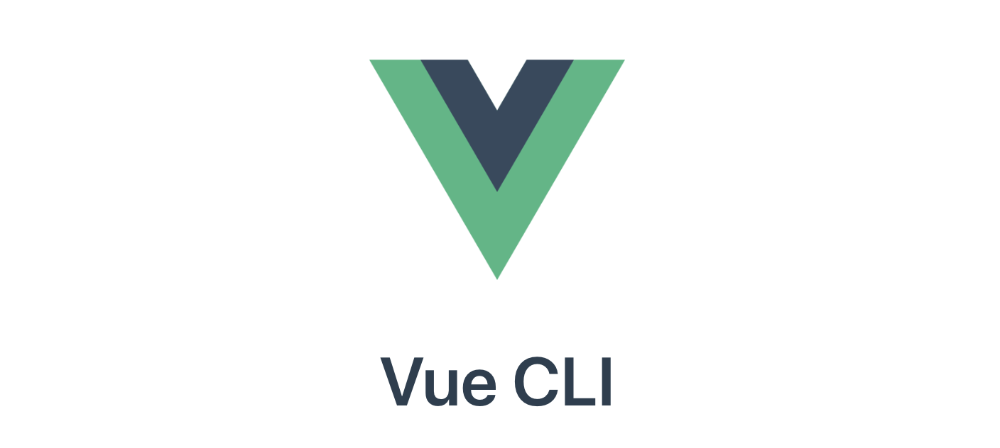
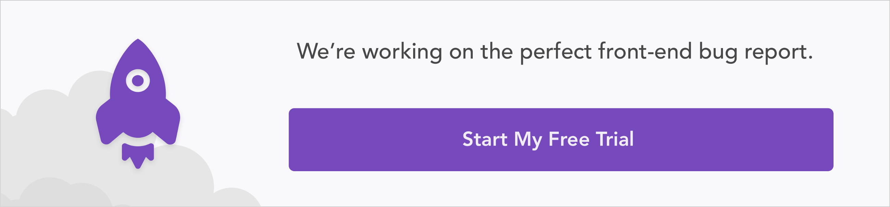
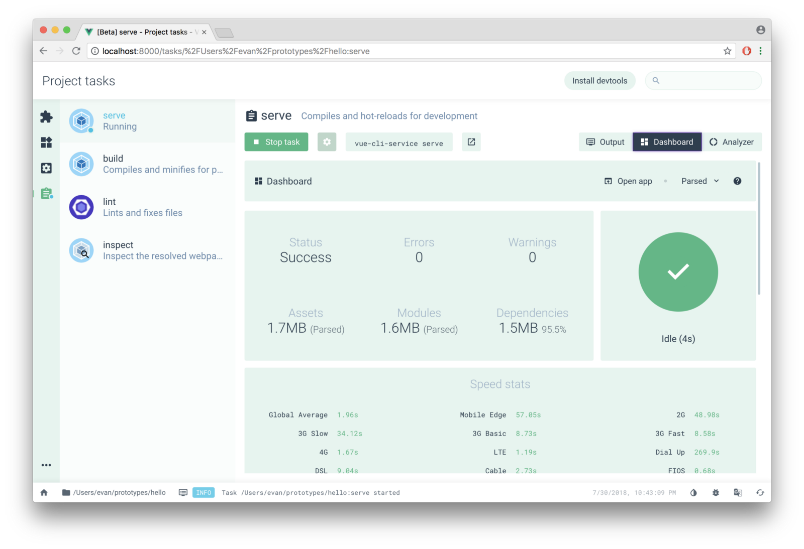
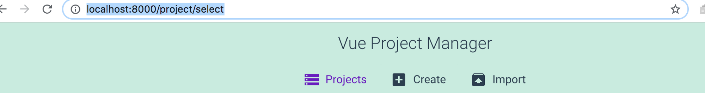
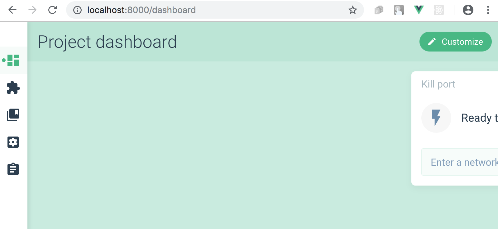
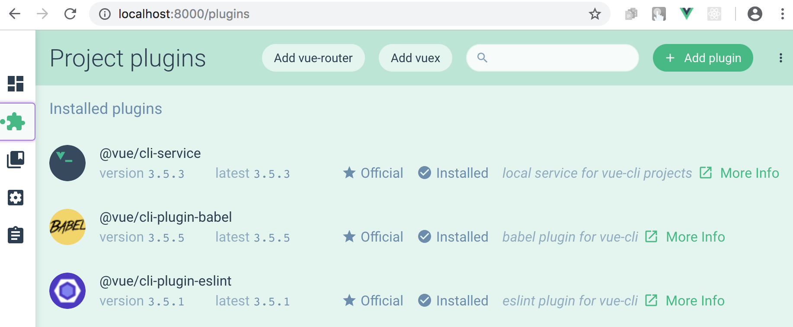
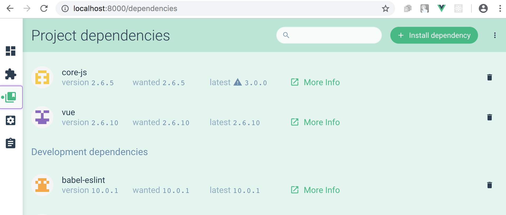
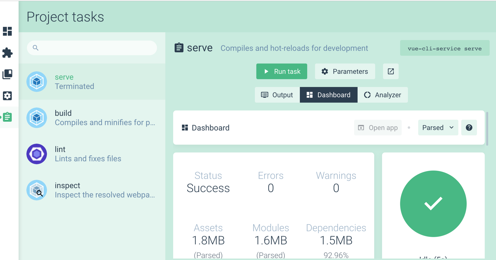
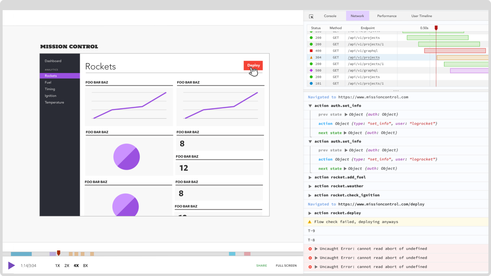

Getting started with the new Vue CLI 3 – LogRocket

# Getting started with the new Vue CLI 3

[Nwose Lotanna](https://blog.logrocket.com/@viclotana)
Apr 22·9 min read

*> TL;DR: *> This article will take you through all of the steps required to use Vue CLI 3, the new graphical user interface and the instant prototyping feature.

### Introduction

Vue JS, created by [Evan You](https://twitter.com/youyuxi?ref_src=twsrc%5Egoogle%7Ctwcamp%5Eserp%7Ctwgr%5Eauthor)  [and 234+ open source community lovers with more than 121,000 stars on GitHub](https://github.com/vuejs/vue), is a very progressive framework for building user interfaces. It consists of an approachable core library that focuses developers on the view layer of the web applications only, and an ecosystem of supporting libraries that helps you tackle complexity in large single-page applications.

[Vue CLI 3](https://medium.com/the-vue-point/vue-cli-3-0-is-here-c42bebe28fbb?source=collection_home---6------3---------------------)was released a few months ago by the Vue team. This article will take you through all of the steps required to get you started using Vue CLI 3, the new graphical user interface and the instant prototyping feature.

### Before you start

This post is suited for intermediate front-end developers that use Vue JS, being conversant with beginner concepts and installation processes is assumed. Here are a few prerequisites you should already have before you start to use Vue CLI 3 throughout this article.

You will need:

- •[Node.js 10.x](https://nodejs.org/) and above installed. You can verify if you do by running node -v in your terminal/command prompt
- •The [Node Package Manager 6.7 or above (NPM)](https://nodejs.org/) also installed
- •A code editor: Visual Studio Code is highly recommended
- •[Vue latest version](https://vuejs.org/) installed globally on your machine
- •[Vue CLI 3.0](https://vuejs.org/) installed on your machine. To do this, uninstall the old CLI version first:

`npm uninstall -g vue-cli`
then install the new one:
`npm install -g @vue/cli`

### Graphical user interface

One of the features that the Vue CLI 3 shipped with is the GUI tool, it is a web interface option of the terminal for people who would prefer a graphical interface over command line interface. You can create projects, install plugins and install dependencies with this tool. You can also run tasks like serving up or building the application for production.

This article breaks down the major parts of getting started with Vue with both the CLI and the GUI tools respectively, it also addresses other things like instant prototyping you can only currently do with the CLI tool alone.

### Starting a new project

There are two ways to start a new Vue project:

- •The graphical user interface technique
- •The command line interface technique

### The graphical user interface technique

The graphical user interface technique involves using the GUI tool to create a new project in a few clicks and selections.

Open the terminal on your machine and run the GUI command below:
`vue ui`

It automatically opens up the GUI tool on your browser on http://localhost:8000/project/select. It looks like this on start:

To create a new project, click the *create* button and see a file manager open in the same interface. Navigating through your (project) files, you notice that previously created Vue projects have a Vue sign on them (to signal that they are Vue projects). Choose the folder you want your new application to be created in and click the *create new project here* button on the page. This will take you through two easy stages of registration.

1. 1.**Details:** Here you expected to choose a project name, choose a package manager to use either yarn or npm. You can also toggle an option to overwrite the folder content if it already exists. Finally, you can decide if you want a git repository created for the project, it comes with an option to choose an initial commit message of your choice

2. 2.**Presets:** A preset is an association of plugins and configurations. After you have selected features, you can optionally save it as a preset so that you can reuse it for future projects, without having to reconfigure everything again. There are three categories of presets: default presets contains just babel and eslint plugins and Vue basic configurations, custom presets lets you choose your own plugins and the remote presets lets you choose a preset from a remote git repository (yes, this is possible)

After a few seconds, you will get a *new project created* notification, and a project dashboard opens up in the interface for your application.

### Command line interface technique

The old option of using the CLI itself still exists but with a new syntax, to create a new project you only have to run this command on your terminal:

`vue create vue-test`

where *Vue-test* is the name of the application you want to build. This command leads to a series of prompts that are going to ask for exactly the same things as the GUI but all in the terminal. When you answer all of the prompts and have configured the app the way you want, the CLI builds it out for you.

### Installing plugins

The new CLI was built to be plugin-based. Features in Vue and even third-party features are now identified as plugins, plugins are used by the new CLI to modify the configs of our project set up at any point in time. They are basically dependencies with extra powers of editing the Webpack config.

### The graphical user interface technique

The project dashboard sidebar has five icons, the second icon is for plugins. When you click on it, you will see the plugins you installed at the registration stage at the start of this post: eslint, babel and the cli-service which is the service on which the plugins work.

Adding a new plugin is easy, click on the *add plugin* button and a list of plugins appear, you can use the search bar which queries the service and returns a list of available plugins based on your search term. If you choose a plugin like [Vuetify](https://vuetifyjs.com/en/), you will see an *install* button, which will install the plugin to your project and make the Webpack config changes for the plugin automatically.

### Command line interface technique

To use the CLI directly to install the Vuetify plugin, you navigate into the project directory and use the add command like this:

`vue add Vuetify`

This installs the Vuetify plugin into your Vue projects and modifies all the files the plugin will affect. Some plugins come with follow-up prompts that lead to their installation. In my opinion, I think the plugin concept implemented in the new CLI was inspired by Angular CLI.

### Installing dependencies

Dependencies in Vue are made of the main Vue core dependencies and the development dependencies. These can be installed in both through the GUI and the CLI technique.

### The graphical user interface technique

The project dashboard sidebar has five icons, the third icon is for dependencies. The main section has the Vue and the core dependencies, the dev dependencies consists of the template compiler, eslint dev dependencies and a lot more.

If you want to install the Bootstrap dependency in your project to be able to use bootstrap classes, you click the *install dependency* button and then search for bootstrap and click *install*. It will take a few seconds and then notify you of the new installation.

### Command line interface technique

To use the CLI directly to install the Bootstrap dependency, you navigate into the project directory and use the install command like this:

`npm install bootstrap`

### Running tasks

Tasks are like commands that take action on our Vue projects, it can be to serve it up on a dev server or to build it out for production or to perform linting. All of these tasks can be achieved with both the GUI and the CLI tools.

### The graphical user interface technique

The last icon on the sidebar of the project dashboard is for tasks. You can see the following tasks shown in the interface:

1. 1.**Serve:** This serves up your application in a local development server on localhost. It has a very intuitive dashboard that shows error logs and messages, assets, modules and dependencies used. It has a data visualized analyzer and it is very easy to terminate task by just clicking *stop task*

2. 2.**Build:** The interface looks very similar to the serve but it minifies and builds out the application for production in a *dist* folder

3. 3.**Lint:** This task handles linting with the eslint standard you have already chosen when you created the application

4. 4.**Inspect:** This task handles inspection of the resolved Webpack configurations you set for your application implicitly when you created the project

### Command line interface technique

To use the CLI directly to run these tasks you the following syntax:

- •Serve

`npm run serve`

- •Build

`npm run build`

- •Lint

`npm run lint`

### Configurations

You can make changes to the original configurations you set for your Vue project in the configurations tab, which is the fourth icon on the sidebar of the project dashboard.

You can change directory locations and the location of the *dist* folder for production. You can also change the CSS settings to maybe a pre-processor along with the lint settings from lint on save.

### Instant prototyping

Have you ever wanted to create a single Vue component without having to create an entire project? Well, it is now possible to do so with the new Vue CLI feature called **instant prototyping**, it abstracts all the config needed to create a single component on any saved *.vue *file. All you have to do is install the Vue CLI service globally on your machine and you can do so:

`npm install -g @vue/cli-service-global`

With the service now installed, you can create a single Vue component anywhere on your computer with the same powers as though it were a full Vue project.

### Creating a single Vue component

Open up a folder of your choice and create a new file, call it helloworld.vue, copy the code below into the file and save:

`// helloword.vue file`
`<template>`
`
`
`<h1>{{ msg }}</h1>`
`<h3>Installed CLI Plugins</h3>`
`<h3>Essential Links</h3>`
`<h3>Ecosystem</h3>`
`
`
`</template>`
``
You can run it on the dev server with this command:
`vue serve helloWorld.vue`

This spins up a Vue single component on your localhost exactly like a full project will.

### Conclusion

We have gone through a stage-by-stage process of getting started with the new Vue CLI 3.0 and the awesome GUI tool that ships with it. At the time of this writing, the GUI tool cannot create or run tasks on a single component by instant prototyping using the GUI tool, but that can be done on the CLI itself. I hope you find this guide very helpful, happy coding!

### Plug: [LogRocket](https://logrocket.com/signup/), a DVR for web apps

https://logrocket.com/signup/

[LogRocket](https://logrocket.com/signup/) is a frontend logging tool that lets you replay problems as if they happened in your own browser. Instead of guessing why errors happen, or asking users for screenshots and log dumps, LogRocket lets you replay the session to quickly understand what went wrong. It works perfectly with any app, regardless of framework, and has plugins to log additional context from Redux, Vuex, and @ngrx/store.

In addition to logging Redux actions and state, LogRocket records console logs, JavaScript errors, stacktraces, network requests/responses with headers + bodies, browser metadata, and custom logs. It also instruments the DOM to record the HTML and CSS on the page, recreating pixel-perfect videos of even the most complex single-page apps.

[Try it for free](https://logrocket.com/signup/).