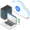
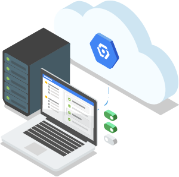
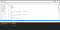

Getting the Best out of Google Cloud Shell - Google Cloud - Community - Medium

# Getting the Best out of Google Cloud Shell

[Raju Dawadi](https://medium.com/@dwdraju?source=post_page-----3d6ca64bc741----------------------)

[Feb 8](https://medium.com/google-cloud/getting-the-best-out-of-google-cloud-shell-3d6ca64bc741?source=post_page-----3d6ca64bc741----------------------) · 4 min read

When it comes to accessing google cloud resources or giving ssh access or doing some actions on cloud, we think of creating a standalone VM aka jump server. Running dedicated instance or getting full access to local system could also be option. And what about mobile when we need quick access? All these hurdles can be avoided by one solution: [Google Cloud Shell](https://cloud.google.com/shell/).

Google Cloud Shell is a command line machine which is available for every google cloud account user for free and provides shell access from browser from where we can access and manage cloud resources and projects. This secured shell with 5GB storage is pre-installed with favorite tools like: MySql client, Kubernetes, and Docker. The shell is account wide so by staying on same shell, we can connect to cloud resources of multiple project with access.

Let’s see how you can make life easier by getting the best of Google Cloud Shell.

## 1. Start the shell in few seconds by one click

The machine pre-loaded with debian starts in few seconds in the same browser by clicking on “Activate Cloud Shell” icon on top right of the google cloud console. If you haven’t been using the shell since long time or trying out for first time, it might take half a minute or so. The shell has built-in authorization with gcloud credential, so you can access any cloud resources for which you have IAM access in any project.

starting google cloud shell

## 2. Connect to cloud shell from local

Google Cloud Shell is not limited to browser access but from any gcloud sdk installed and account activated terminal. Authenticate your local system with gcloud IAM and access the google cloud shell:

$ gcloud auth login$ gcloud alpha cloud-shell ssh

## 3. Easy SSH access to compute engine instances

From the Cloud Shell, one with [SSH access](https://cloud.google.com/compute/docs/access/#granting_users_ssh_access_to_vm_instances) can easily connect to compute engine instance using gcloud command.

gcloud compute ssh [instance-name] --project [project-name] --zone [zone]

Even if the compute instance is not assigned with public ip, the instance can be accessed through cloud shell.

## 4. Web preview on of running service

Its not only shell but is a real tool for debugging. We can start any service or run docker and preview the output on nice url with “Web Preview”.

Cloud Shell web preview

By running multiple service on background or on different tab of the shell, we can preview them on different port.

## 5. Boost power of cloud shell for higher performance

By default, cloud shell runs on *g1-small* machine type which provides 1 vCPU short periods of bursting and 1.70 GB memory. Sometimes, this isn’t enough if you have to work with multiple tabs and run few services.

The newly introduced power boosting feature of cloud shell allows upgrade of the shell *n1-standard-1* VM instance which offers 1vCPU and 3.75GB memory for 24 hours.

To activate the boost mode, click ‘Enable Boost Mode’ option under the ‘More’ menu of the cloud shell.

## 6. Its more than shell — Code Editor and run VS Code

Google Cloud Shell’s integrated code editor based on [Theia IDE](https://theia-ide.org/) makes it easy to edit files and folders in the shell from browser.

Cloud Shell integrated code editor

Clicking on *Launch Editor*(edit icon) on the top of the cloud shell opens a new tab on browser with all access to files and folder in the root of shell.

Also, we can run VS Code with Cloud shell. By simply running [cdr/code-server](https://github.com/cdr/code-server/) through docker or [shell](https://medium.com/google-cloud/how-to-run-visual-studio-code-in-google-cloud-shell-354d125d5748) inside cloud shell, we can preview nice VS code UI on http port.

## 7. Easy connect to Cloud SQL

Whether it be creating mysql user, database or any operation on Cloud SQL instance, using Cloud Shell makes it easier.

$ gcloud sql connect myinstance --user=root

## 8. Shell access from mobile app with advanced key

The cloud shell access is not limited from web browser and computer but also from mobile device. We can connect to shell from [Cloud Console Mobile App](https://cloud.google.com/console-app/) apart from getting alert notification, manage GCP resources and access compute engine instances.

Cloud Shell access from mobile

## 9. Deploy to Cloud Run in single click

Deploying containerized serverless application to Google Cloud Run button is possible with cloud shell. The newly introduced “Run on Google Cloud” button makes it super easy to deploy new image to cloud run service.

Read more about the application structure for the setup from [GoogleCloudPlatform/cloud-run-button](https://github.com/GoogleCloudPlatform/cloud-run-button) repo.