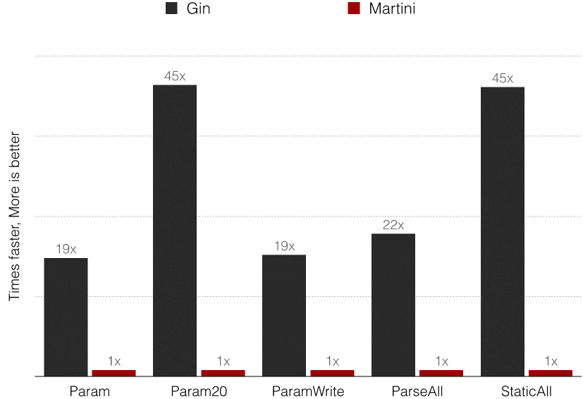
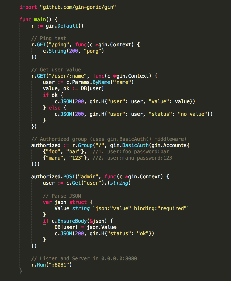
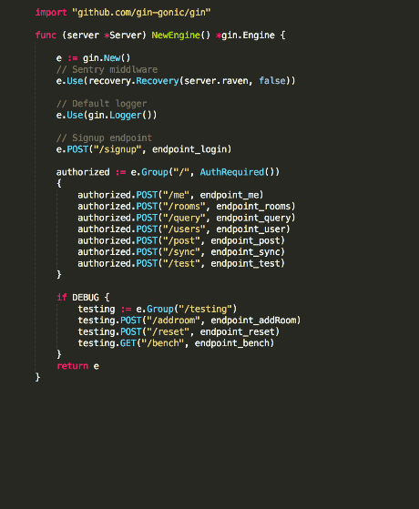

Gin Web Framework

# Gin Gonic

The fastest full-featured web framework for Golang. **Crystal clear.**

[github pagE](https://github.com/gin-gonic/gin)[API REFERENCE](http://godoc.org/github.com/gin-gonic/gin)

$ go get github.com/gin-gonic/gin

## Performance and productivity can work together

Gin is a web framework written in Golang. It features a martini-like API with much better performance, up to 40 times faster. If you need performance and good productivity, you will love Gin.

 
2,3 GHz Intel Core i7 8 GB 1600 MHz DDR3,  OS X 10.9.3

[Check out the benchmark suite](https://github.com/gin-gonic/go-http-routing-benchmark)

## Low Overhead Powerful API

You can add global, per-group, and per-route middlewares, thousands of nested groups, nice JSON validation and rendering. And the performance will be still great. Gin uses **httprouter** internally, the fastest HTTP router for Golang. Httprouter was created by Julien Schmidt and it’s based in a [Radix Tree](http://en.wikipedia.org/wiki/Radix_tree) algorithm.

### Some cool middlewares

If you used Martini before, Gin will be familiar to you. If you don’t, you will need 10 minutes to learn everything.

[Check out the Sentry midDlEware](https://github.com/gin-gonic/gin-sentry)
More coming soon

### Crystal Clear

If you used Martini before, Gin will be familiar to you. If you don’t, you will need 10 minutes to learn everything.

 
 



[More examples in the README.md](https://github.com/gin-gonic/gin/blob/master/README.md)

## Full Featured

 **

### Fast

Radix tree based routing, small memory foot print. No reflection. Predictable API performance.

 **

### Middleware support

A incoming HTTP request can be handled by a chain of middlewares and the final action.

For example: Logger, Authorization, GZIP and finally post a message in the DB.

 **

### Crash-free

Gin can catch a panic occurred during a HTTP request and recover it. This way, your server will be always available. It’s also possible to report this panic to Sentry for example!

 **

### JSON validation

Gin can parse and validate the JSON of a request, checking for example the existence of required values.

 **

### Routes grouping

Organize your routes better. Authorization required vs non required, different API versions... In addition, the groups can be nested unlimitedly without degrading performance.

 **

### Error management

Gin provides a convenient way to collect all the errors occurred during a HTTP request. Eventually, a middleware can write them to a log file, to a database and send them through the network.

 **

### Rendering built-in

Gin provides a easy to use API for JSON, XML and HTML rendering.

 **

### Extendable

Creating a new middleware is so easy, just check out the sample codes.

## How to contribute?

Gin uses a MIT license, this means that you can do whatever you want, but please, keep the reference to the original authors! To contribute you should [fork it in Github](https://github.com/gin-gonic/gin), add some changes and start posting Pull Requests, we would love to merge them.

1. Fork

 

2. Commit
 

3. Pull request
 

Gin is developed and maintained by *[Manu Martinez-Almeida](https://github.com/manucorporat)*.

It uses the fantastic *[Julien Schmidt](https://github.com/julienschmidt) *’s httprouter.