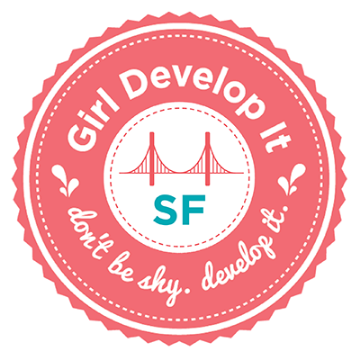

Girl Develop It SF - Teaching Materials

Girl Develop It SF - Teaching Materials

https://www.teaching-materials.org/

Girl Develop It San Francisco - Teaching Materials Girl Develop It SF hosts a variety of CC-licensed programming & web development curriculum created for our workshops on the teaching-materials.org domain. Our curriculum is designed to be taught in person, but may be useful to self-learners as well. Interested in teaching any of it? Consult our teaching guide . Report issues and open pull requests on the gdisf/teaching-materials Github repo . Let us know about what you taught where. Interested in contributing?