Give Firefox A Chance For A Faster, Calmer And Distraction-Free Internet – marko.fyi

 Categories
 [Firefox](https://marko.fyi/category/firefox/)

# Give Firefox A Chance For A Faster, Calmer And Distraction-Free Internet

- Post author       By [Marko Saric](https://marko.fyi/author/marko/)
- Post date  ![](data:image/svg+xml,%3csvg class='svg-icon js-evernote-checked' aria-hidden='true' role='img' focusable='false' xmlns='http://www.w3.org/2000/svg' width='18' height='19' viewBox='0 0 18 19' data-evernote-id='287'%3e%3cpath fill='' d='M4.60069444%2c4.09375 L3.25%2c4.09375 C2.47334957%2c4.09375 1.84375%2c4.72334957 1.84375%2c5.5 L1.84375%2c7.26736111 L16.15625%2c7.26736111 L16.15625%2c5.5 C16.15625%2c4.72334957 15.5266504%2c4.09375 14.75%2c4.09375 L13.3993056%2c4.09375 L13.3993056%2c4.55555556 C13.3993056%2c5.02154581 13.0215458%2c5.39930556 12.5555556%2c5.39930556 C12.0895653%2c5.39930556 11.7118056%2c5.02154581 11.7118056%2c4.55555556 L11.7118056%2c4.09375 L6.28819444%2c4.09375 L6.28819444%2c4.55555556 C6.28819444%2c5.02154581 5.9104347%2c5.39930556 5.44444444%2c5.39930556 C4.97845419%2c5.39930556 4.60069444%2c5.02154581 4.60069444%2c4.55555556 L4.60069444%2c4.09375 Z M6.28819444%2c2.40625 L11.7118056%2c2.40625 L11.7118056%2c1 C11.7118056%2c0.534009742 12.0895653%2c0.15625 12.5555556%2c0.15625 C13.0215458%2c0.15625 13.3993056%2c0.534009742 13.3993056%2c1 L13.3993056%2c2.40625 L14.75%2c2.40625 C16.4586309%2c2.40625 17.84375%2c3.79136906 17.84375%2c5.5 L17.84375%2c15.875 C17.84375%2c17.5836309 16.4586309%2c18.96875 14.75%2c18.96875 L3.25%2c18.96875 C1.54136906%2c18.96875 0.15625%2c17.5836309 0.15625%2c15.875 L0.15625%2c5.5 C0.15625%2c3.79136906 1.54136906%2c2.40625 3.25%2c2.40625 L4.60069444%2c2.40625 L4.60069444%2c1 C4.60069444%2c0.534009742 4.97845419%2c0.15625 5.44444444%2c0.15625 C5.9104347%2c0.15625 6.28819444%2c0.534009742 6.28819444%2c1 L6.28819444%2c2.40625 Z M1.84375%2c8.95486111 L1.84375%2c15.875 C1.84375%2c16.6516504 2.47334957%2c17.28125 3.25%2c17.28125 L14.75%2c17.28125 C15.5266504%2c17.28125 16.15625%2c16.6516504 16.15625%2c15.875 L16.15625%2c8.95486111 L1.84375%2c8.95486111 Z' data-evernote-id='288' class='js-evernote-checked'%3e%3c/path%3e%3c/svg%3e)      [November 9, 2019](https://marko.fyi/firefox/)

 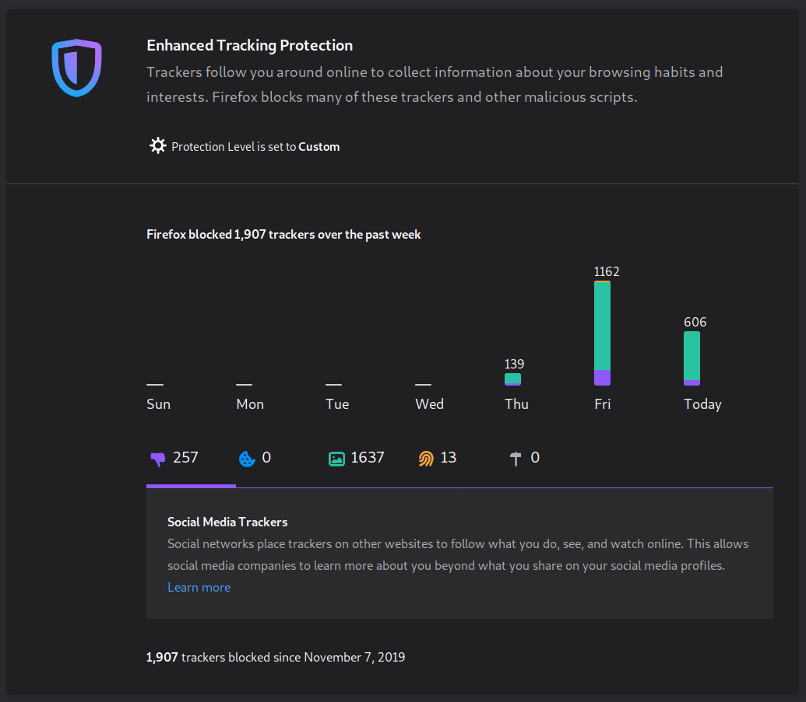
From surfing the web unprotected to using Firefox to block 1000+ trackers a day

We’re living in the Google Chrome browser dominance age ([65%](https://gs.statcounter.com/browser-market-share) of the market share worldwide) but for the first time in a few years, Chrome has some very serious competition.

[Firefox](https://www.mozilla.org/en-US/) is an open-source browser made by a non-profit organization named Mozilla. [The mission](https://www.mozilla.org/en-US/about/manifesto/) of the Mozilla Foundation is to help build a healthier, more open and accessible internet.

### Use Firefox For A Better Internet Experience

Over the last year Firefox has got a lot faster and more resource friendly.

The team behind it has made some ethical and people friendly decisions that make the web more private, much faster and distraction free for everyone.

Using Firefox gives you peace of mind and keeps you away from the advertising companies constantly following you around, profiling you and tempting you to purchase their products.

Firefox currently stands at 4% of the browser market share worldwide and that’s a shame. Many more people would find great value in using it.

You can simply install Firefox and start surfing right away, but here’s a brief look at some of the Firefox features you can explore.

1. [The Look And Feel](https://marko.fyi/firefox/#1-the-look-and-feel)
2. [Default Search Engine](https://marko.fyi/firefox/#2-default-search-engine)

3. [Advertising And Tracking](https://marko.fyi/firefox/#5-advertising-and-tracking)

4. [The Reader View](https://marko.fyi/firefox/#6-the-reader-view)

5. [Hidden Preferences In The Configuration Editor](https://marko.fyi/firefox/#7-hidden-preferences-in-the-configuration-editor)

6. [There's So Much More In The World Of Firefox](https://marko.fyi/firefox/#8-theres-so-much-more-in-the-world-of-firefox)

## The Look And Feel

When I install Firefox, the first thing I do is to use the **Customize Firefox** section. Many interesting options in there let you make Firefox look and feel the way you want to.

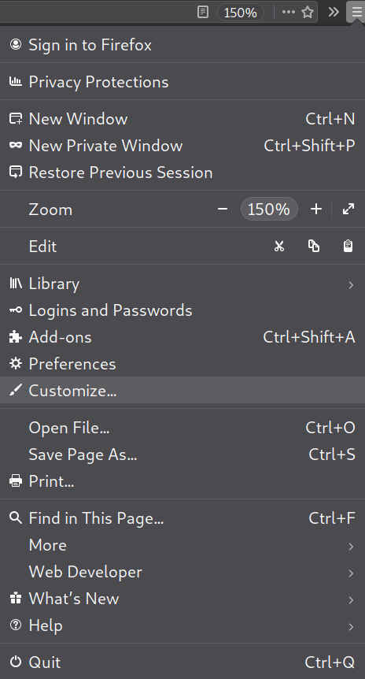

I remove everything from the toolbar. I hide the title bar, menu bar and bookmarks bar. I select a dark theme and put the density at compact. This gives me a nice, clean and minimal browser.

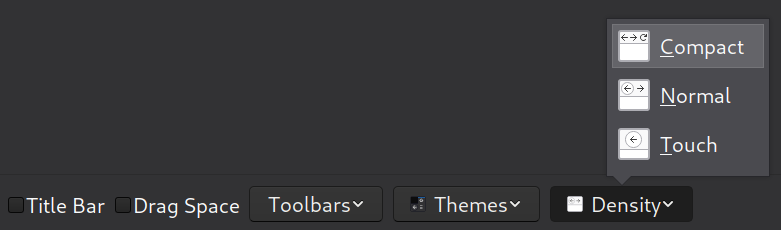
Density, themes and title bar
In **Preferences -> Home**
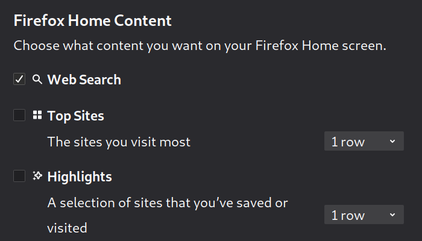
Firefox home preference

I untick everything in this section with the result being a nice blank, dark home page and new tab page.

You can tick on “**Web Search**” if you prefer a minimalist home page with a nice Firefox logo and a search box like this:

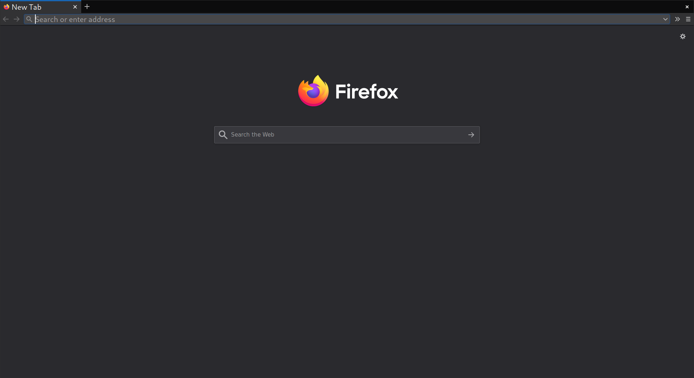
Minimalist home page with a nice Firefox logo and a search box

## Default Search Engine

In **Preferences -> Search -> Default Search Engine**
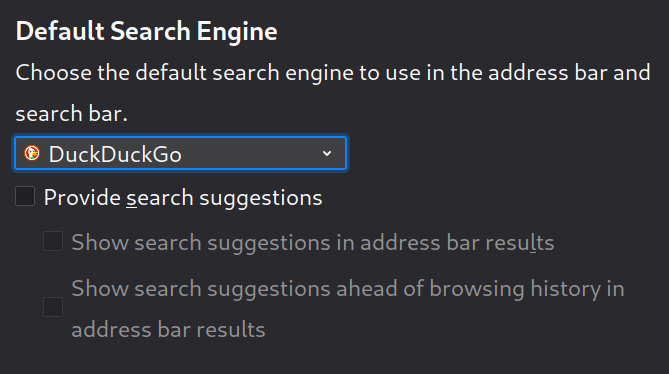
Default search engine

Select a more human friendly search engine. [DuckDuckGo](https://duckduckgo.com/) is the best option from all the default choices.

### Want To Use A Search Engine Not On The Default List?

In **Preferences -> Search -> Search Bar**
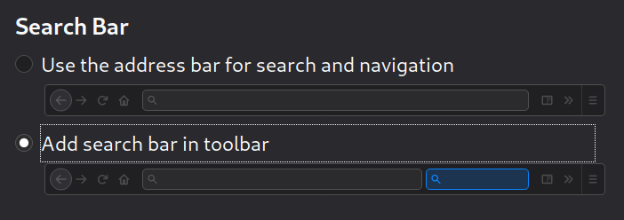
Select “**Add search bar in toolbar**“.
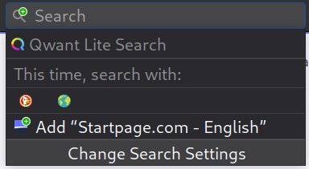

Then visit the search engine you’d like to use as the default. Click on the search box on the right-hand side of your toolbar and select “**Add**” to add it.

Now go back to your Search Preferences and select the newly added search engine as your new default.

You can now also remove the search bar from the toolbar if you wish.

### Three Ethical And Human Friendly Search Engines

Want more options for good Google alternatives? These are three that I like:

1.   [StartPage.com](https://www.startpage.com/) – Gives you exact same search results as Google but without all that tracking and profiling.

2.   [Qwant.com](https://www.qwant.com/) – A private search engine with similar philosophy to DuckDuckGo but based in France, Europe.

3.   [Ecosia.org](https://www.ecosia.org/) – They plant trees for each search that you make.

## Advertising And Tracking

In **Preferences -> Privacy & Security -> [Enhanced Tracking Protection](https://support.mozilla.org/en-US/kb/enhanced-tracking-protection-firefox-desktop)**

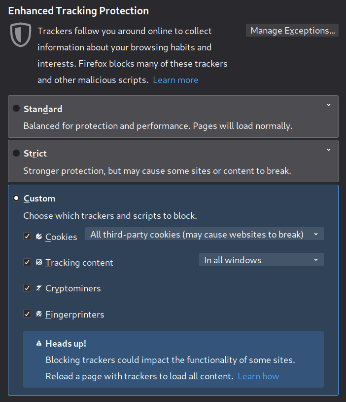
Enhanced Tracking Protection set to custom
Choose “**Strict**” or go “**Custom**” to make it even stricter.

In “**Cookies**” block “**All third-party cookies**” and in “**Tracking Content**” select “**All Windows**“. Tick “**Cryptominers**” and “**Fingerprinters**” too.

This way I am a bit safer from all the trackers. All the third-party trackers and cookies are blocked automatically. As a side effect of this, pretty much all the intrusive advertising is blocked.

Some ads that are served from the first party, that are not personalized and that have no tracking are visible. Examples are ads on DuckDuckGo, Twitter and Reddit.

If you want to block all the ads (and do even more content blocking) you’ll need an ad blocker such as [uBlock Origin](https://addons.mozilla.org/en-US/firefox/addon/ublock-origin/).

I’m happy to be exposed to contextual and text based ads without tracking, personalization and surveillance so plain Firefox without any extensions works well.

### So what difference does all this tracking protection make?

Big difference.

On a typical Wired.com article, Firefox blocks four **social media trackers** from Facebook, Twitter and Linkedin.

In addition, it also blocks 24 pieces of **tracking content** from companies such as Hotjar and Amazon.

And last but not least, it blocks eight **third-party cookies** from companies such as Google and Snapchat.

- 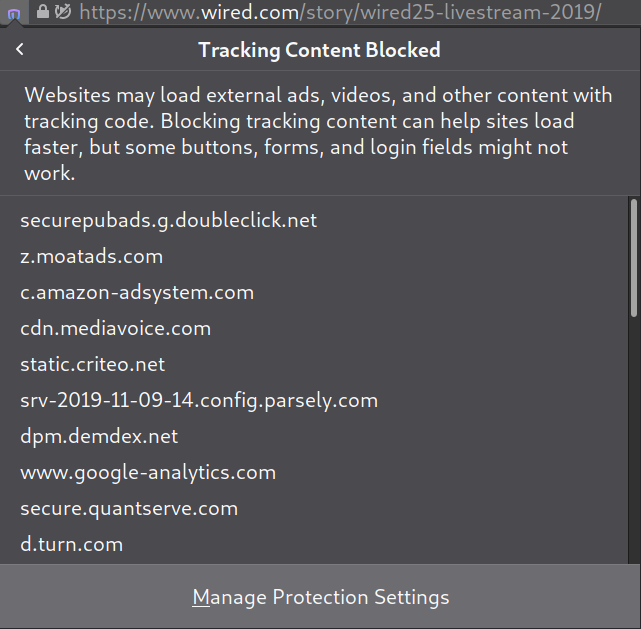
- 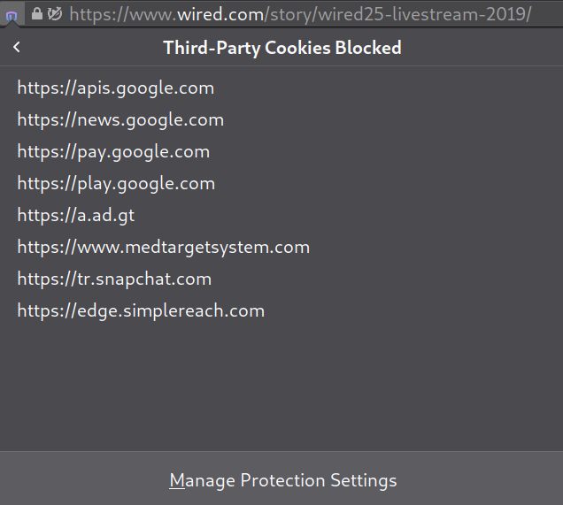
- 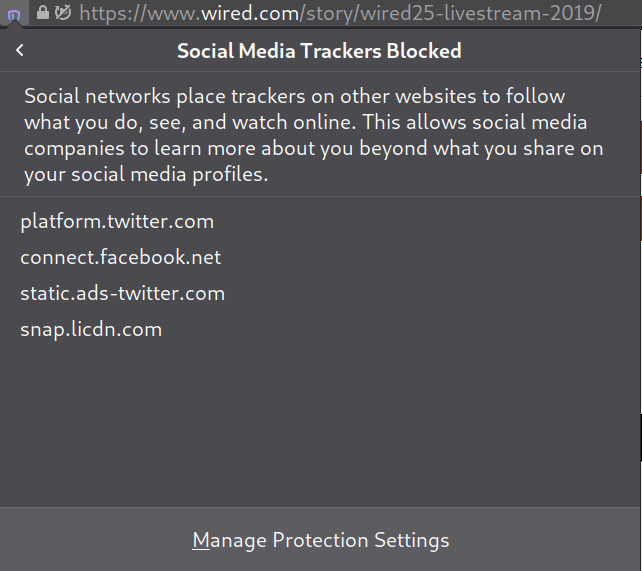

That’s more than 35 blocks on every page load.

Firefox actually ends up blocking majority of the data Wired tries to load but all the content still looks the same as it would look without any of the blocks.

And Wired still gets to place some non-intrusive advertising such as them promoting the option to subscribe to the magazine.

In **Preferences -> Privacy & Security -> Cookies and Site Data**
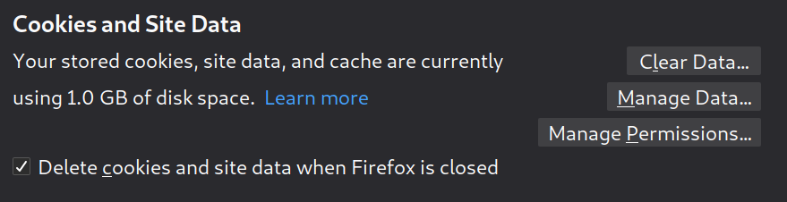
Cookies and site data

I tick “**Delete cookies and site data when Firefox is closed**” while I use “**Manage Permissions**” to allow cookies from websites I want to stay logged into not to be deleted.

In **Preferences -> Privacy & Security -> Logins and Passwords**
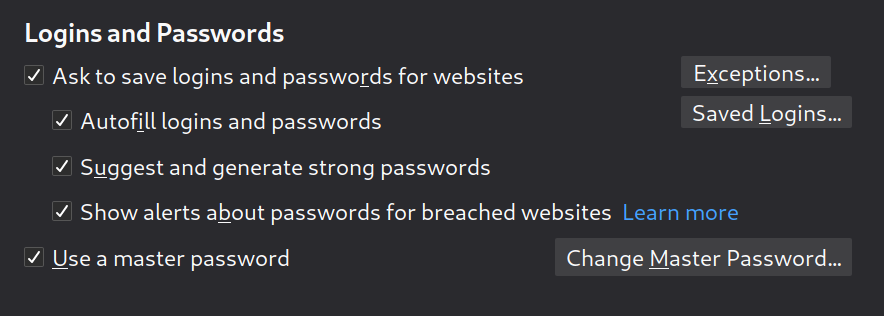
Logins and passwords

I recommend you enable everything here. Especially if you’re not using a password manager.

Firefox will not only save all your passwords, but it will also auto-fill them, it will generate strong passwords for you when signing up for new accounts and even alert you in case websites you visit have been breached.

In **Preferences -> Privacy & Security -> Permissions**
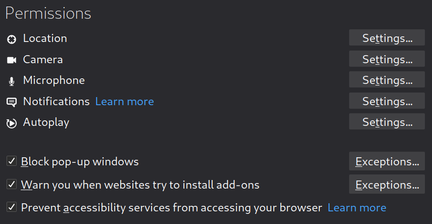
Firefox permissions

I block new requests asking for access to things such as “**Notifications**“, “**Location**” and “**Autoplay**” of video and audio.

Simply click on the “**Settings**” button next to the different items and select “**Block new requests asking to access**“.

The web is so much calmer without all those prompts asking you to enable or allow this and that.

I manually enable it for specific sites that I really need or want to.

## The Reader View

I love the [Firefox Reader View](https://support.mozilla.org/en-US/kb/firefox-reader-view-clutter-free-web-pages). A “**Reader View**” icon will show on the right-hand side of your toolbar on available sites. It looks like this:

Reader View basically strips away all the distractions such as buttons, ads and other website elements. It gives you pure content and content only.

You can even change the default layout of the Reader View by choosing a light or dark mode, changing the font and the font size.

Here’s how a typical **The New York Times** article looks with the Reader View off and on:

- 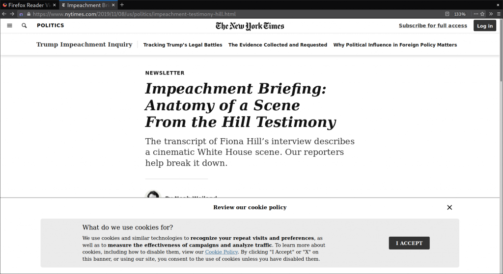

Reader View off

- 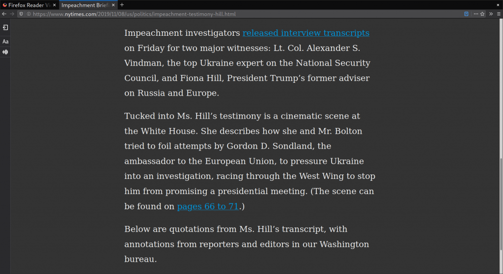

Reader View on

## Hidden Preferences In The Configuration Editor

Type **about:config** in the address bar to visit the **Configuration Editor** which is full of hidden Firefox preferences aimed at advanced users.

Click on “**I accept the risk!**” button on the humorous “**This might void your warranty!**” warning message.

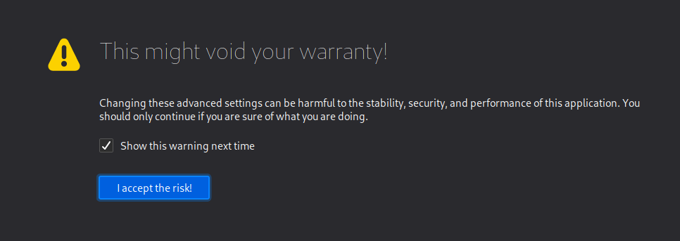
About:config warning message
Search for “**privacy.firstparty.isolate**” and set its value to “**true**“.

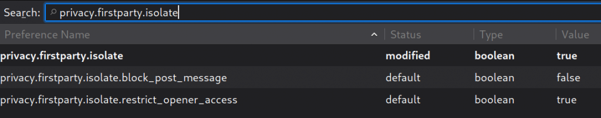

First-Party Isolation

**First-Party Isolation** is a great feature and I expect it to make it into default settings in the near future.

This feature restricts cookies, cache and other site data so it can only be accessed by the first party domain name.

This stops advertising companies from being able to follow and track your behavior across the different sites that you visit.

## There’s So Much More In The World Of Firefox

This was meant as a brief beginner introduction to what Firefox offers out of the box and using the in-built preferences.

Firefox features many other options such as [containers](https://support.mozilla.org/en-US/kb/containers), [themes](https://addons.mozilla.org/en-US/firefox/themes/) and thousands of [extensions](https://addons.mozilla.org/en-US/firefox/) that you can enable to add any feature that you may wish for.

This is something you can start to explore as you get more used to Firefox and more comfortable within the Firefox environment.

Give [Firefox](https://www.mozilla.org/en-US/firefox/new/) a chance now and enjoy a more open, private and human-centric web experience!

##  By Marko Saric

I’m a digital marketer by profession but I do care about user freedom and human friendly technology. And this is my random talk blog. Read more [about me](https://marko.fyi/me/).

* * *

 [→Postmortem of my Firefox Guide Hitting Hacker News and Driving 30,000 Visitors](https://marko.fyi/hacker-news/)

* * *