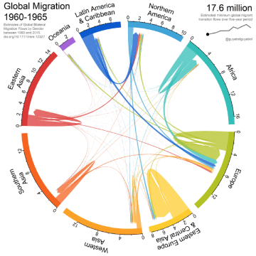

Global Migration, animated with R

Global Migration, animated with R

http://blog.revolutionanalytics.com/2018/06/global-migration-animated-with-r.html

The animation below, by Shanghai University professor Guy Abel, shows migration within and between regions of the world from 1960 to 2015. The data and the methodology behind the chart is described in this paper. The curved bars around the outside represent the peak migrant flows for each region; globally, migration peaked during the 2005-2010 period and the declined in 2010-2015, the latest data available. This animated chord chart was created entirely using the R language. The chord plot showing the flo