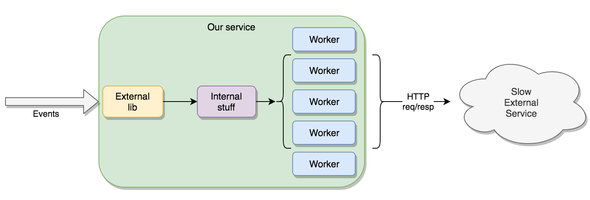
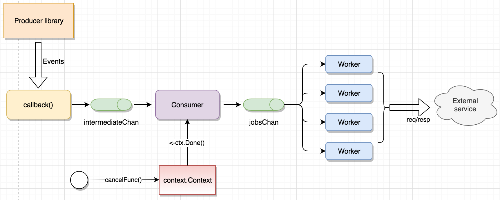

Go - graceful shutdown of worker goroutines | Callista

 

##   [Go - graceful shutdown of worker goroutines](https://callistaenterprise.se/blogg/teknik/2019/10/05/go-worker-cancellation/)

###    05 October 2019  // [Erik Lupander](https://callistaenterprise.se/om/medarbetare/eriklupander/)

In this blog post we’ll take a look at gracefully shutting down a Go program having worker goroutines performing tasks that must be completed before allowing the program to shut down.

# Introduction

In a recent project we had a use-case where a Go-based microservice was consuming events emitted from a 3rd party library. These events would undergo a bit of processing before resulting in a call to an external service. That external service handles each request quite slowly, but can on the other hand handle many concurrent requests. Therefore, we implemented a simple internal worker-pool to fanout incoming events onto several concurrently executing goroutines.

On a general level, it looks like this:

However, we needed to make sure that if the microservice is shutting down, any currently running requests to the external service must be allowed to finish with the outcome persisted to our internal backend.

## Worker pools and Sigterm handling

The [worker pool pattern](https://gobyexample.com/worker-pools) is a well known Go pattern for worker-pools and there are numerous examples on how to do [SIGTERM notification based graceful shutdown](https://gobyexample.com/signals), but we realized that a number of our requirements made our use-case somewhat more complicated.

When the program receives a SIGTERM / SIGINT signal - for example, from our container orchestrator scaling down the number of replicas - any currently executing worker goroutines must be allowed to finish their long-running work before terminating the program.

To make things slightly more complicated, we had no control over the producer-side library. We get to register a callback function which is invoked each time the library has a new event for us. The library blocks until the callback function has finished executing and then invokes it again if there’s more events.

The worker-pool goroutines are fed with events to process using the standard “range over channel” construct, e.g:

	func workerFunc() {
	    for event := range jobsChan { // blocks until an event is received or channel is closed.
	        // handle the event...
	    }
	}

Which means that the cleanest way to let a worker “finish” is to close that “jobsChan” channel.

## Closing on the producer side

One of the first things you first learn about closing channels in Go is that the program will panic if a send occurs on a closed channel. This boils down to a very simple rule:

	"Always close a channel on the producer side"

What’s the producer side anyway? Well, typically the *goroutine* that is putting events on that channel:

	func callbackFunc(event int) {
		jobsChan<-event
	}

This is our callbackFunc that we’ve registered with the external library that passes events to us. *(To keep these examples simple, I’ve replaced the real events with a simple int as payload.)*

How do you *safely* protect the piece of code above from sending on a closed channel? It’s not trivial to go down the route of Mutexes and boolean flags and if-statements to determine if some *other* goroutine has closed the channel and to control whether a send should be allowed or not. Very open to potential race conditions and non-deterministic behaviour.

Our solution was to introduce an intermediate channel and an internal “consumer” that acts as a proxy between the callback and the jobs channel:

The consumer function looks like this:

	func startConsumer(ctx context.Context) {
	    // Loop until a ctx.Done() is received. Note that select{} blocks until either case happens
	    for {
	            select {
	            case event := <-intermediateChan:
	                jobsChan <- event
	            case _ <- ctx.Done():
	                close(jobsChan)
	                return             // exit this function so we don't consume anything more from the intermediate chan
	            }
	    }
	}

Ok, wait a minute. What’s this “select” and “ctx.Done()”?

The [select](https://gobyexample.com/select) statement is IMHO one of the absolutely most awesome things about Go. It allows waiting and coordinating on multiple channels. In this particular case, we will either receive an event on the intermediate channel to pass to the jobsChan or a cancellation signal from the [context.Context](https://golang.org/pkg/context/#WithCancel).

The *return* statement after closing the jobsChan will step us out from the for-loop and function which makes sure *no new events can be passed* to the jobsChan and *no events* will be consumed from the intermediateChan.

So either an event is passed to the jobs (which the workers consume from) or the jobsChan is closed *in the same goroutine* as the producer.

Closing the jobsChan means all workers will stop ranging on the jobsChan on the consumer side:

	for event := range jobsChan { // <- on the close(jobsChan), all goroutines waiting for jobs here will exit the for-loop
	    // handle the event...
	}

## Issuing the cancellation signal

Waiting for a Go program to terminate is a well-known pattern:

	func main() {
	    ... rest of program ...

	    termChan := make(chan os.Signal)
	    signal.Notify(termChan, syscall.SIGINT, syscall.SIGTERM)
	    <-termChan // Blocks here until either SIGINT or SIGTERM is received.
	    // what now?
	}

At “what now?” the main goroutine resumes execution after capturing SIGINT or SIGTERM. We need to tell the consumer goroutine that passes events from the intermediateChan to the jobsChan to close the jobsChan across goroutine boundaries.

Again, it is technically possible - but rather awkward and error prone - to solve this using Mutexes and conditional statements. Instead, we’ll utilize the cancellation support of context.Context we touched on earlier.

Somewhere in our *func main()* we set up a root background context with cancellation support:

	func main() {
	    ctx, cancelFunc := context.WithCancel(ctx.Background())
	    // ... some omitted code ...

	    go startConsumer(ctx) // pass the cancellable context to the consumer function

	    // ... some more omitted code ...
	    <-termChan

	    cancelFunc() // call the cancelfunc to notify the consumer it's time to shut stuff down.
	}

This is how the *<-ctx.Done()* select case becomes invoked, starting the graceful teardown of channels and workers.

## Using WaitGroups

There’s only one problem with the solution above - the program will exit immediately after the *cancelFunc()* invocation, which means our worker goroutines having in-flight invocations won’t have time to finish, potentially leaving transactions in our system in an indeterminate state.

We need to halt shutdown until all workers report that they’re done with whatever stuff they were doing. Enter [sync.WaitGroup](https://golang.org/pkg/sync/#WaitGroup) that lets us wait for an arbitrary number of goroutines to finish!

When starting our workers, we pass along a pointer to a WaitGroup created in *func main()*:

	const numberOfWorkers = 4

	func main() {
	    // ... omitted ...
	    wg := &sync.WaitGroup{}
	    wg.Add(numberOfWorkers)

	    // Start [workerPoolSize] workers
	    for i := 0; i < workerPoolSize; i++ {
	        go workerFunc(wg)
	    }

	    // ... more omitted stuff ...

	    <-termChan    // wait for SIGINT / SIGTERM
	    cancelFunc()  // send the shutdown signal through the context.Context
	    wg.Wait()     // program will wait here until all worker goroutines have reported that they're done
	    fmt.Println("Workers done, shutting down!")
	}

This changes our worker startup function a little:

	func workerFunc(wg *sync.WaitGroup) {
	    defer wg.Done() // Mark this goroutine as done! once the function exits
	    for event := range jobsChan {
	        // handle the event...
	    }
	}

The *wg.Done()* decrements the waitgroup by one and once the internal counter reaches 0, the main goroutine will continue past the *wg.Wait()*. Graceful shutdown complete!

### Running

The source for the final program comes in the next section. In it, I’ve added some logging statements so we can follow what happens.

Here’s the output for an execution of the program with 4 worker goroutines, where I use Ctrl+C to stop the program:

	$ go run main.go
	  Worker 3 starting
	  Worker 2 starting
	  Worker 1 starting
	  Worker 0 starting
	  Worker 3 finished processing job 0
	  Worker 0 finished processing job 3
	  ^C*********************************     <-- HERE I PRESS CTRL+C
	  Shutdown signal received
	  *********************************
	  Worker 3 finished processing job 4
	  Worker 2 finished processing job 1
	  Worker 1 finished processing job 2
	  Consumer received cancellation signal, closing jobsChan!   <-- Here, the consumer receives the <-ctx.Done()
	  Worker 3 finished processing job 6
	  Worker 0 finished processing job 5
	  Worker 1 finished processing job 8
	  Worker 2 finished processing job 7
	  Worker 0 finished processing job 10
	  Worker 0 interrupted                    <-- Worker 0 has finished job #10, 3 left
	  Worker 2 finished processing job 12
	  Worker 2 interrupted                    <-- Worker 2 has finished job #12, 2 left
	  Worker 3 finished processing job 9
	  Worker 3 interrupted                    <-- Worker 3 has finished job #9, 1 left
	  Worker 1 finished processing job 11
	  Worker 1 interrupted                    <-- Worker 1 has finished job #11, all done
	  All workers done, shutting down!

As one may observe that the point in time where the consumer receives *<-ctx.Done()* is actually non-deterministic due to how the Go runtime schedules communications on channels into the select statement. The Go specification says:

	"If one or more of the communications can proceed, a single one that can proceed is chosen via a uniform pseudo-random selection."

This is why jobs may be passed to the workers even after CTRL+C is pressed.

Another peculiar thing is that it seems as jobs (jobs 9-12) are passed to the workers even *after* the jobsChan has been closed. Well - they were actually passed *before* the channel was closed. The reason for this is our use of a buffered channel with 4 “slots”. This means that if all four workers have consumed a job from the channel and are processing them, there are potentially four new jobs waiting to be consumed by workers on the channel given that our 3rd party producer is constantly passing new events to us at a higher rate than our workers can manage. Closing a channel doesn’t affect data already buffered into the channel - Go allows consumers to consume those.

If we change the jobsChan to be unbuffered:

	jobsChan := make(chan int)

And run again:

	$ go run main.go
	.... omitted for brevity ....
	^C*********************************
	Shutdown signal received
	*********************************
	Worker 3 finished processing job 3
	Worker 3 started job 5
	Worker 0 finished processing job 4
	Worker 0 started job 6
	Consumer received cancellation signal, closing jobsChan! <-- again, it may take some time until the consumer is handed <-ctx.Done()
	Consumer closed jobsChan
	Worker 1 finished processing job 1     <-- From here on, we see that each worker finishes exactly one job before being interrupted.
	Worker 1 interrupted
	Worker 2 finished processing job 2
	Worker 2 interrupted
	Worker 0 finished processing job 6
	Worker 0 interrupted
	Worker 3 finished processing job 5
	Worker 3 interrupted
	All workers done, shutting down!

This time we don’t see any “unexpected” jobs being consumed by the workers after the channel was closed. Having a channel buffer the same size as the number of workers is a however a common optimization to keep workers fed with data without unnecessary stalling on the producer side.

# The full program

The snippets above are somewhat simplified to keep them as concise as possible. The full program with some structs for encapsulation and simulation of the 3rd-party producer follows here:

	package main

	import (
		"context"
		"fmt"
		"math/rand"
		"os"
		"os/signal"
		"sync"
		"syscall"
		"time"
	)

	const workerPoolSize = 4

	func main() {
		// create the consumer
		consumer := Consumer{
			ingestChan: make(chan int, 1),
			jobsChan:   make(chan int, workerPoolSize),
		}

		// Simulate external lib sending us 10 events per second
		producer := Producer{callbackFunc: consumer.callbackFunc}
		go producer.start()

		// Set up cancellation context and waitgroup
		ctx, cancelFunc := context.WithCancel(context.Background())
		wg := &sync.WaitGroup{}

		// Start consumer with cancellation context passed
		go consumer.startConsumer(ctx)

		// Start workers and Add [workerPoolSize] to WaitGroup
		wg.Add(workerPoolSize)
		for i := 0; i < workerPoolSize; i++ {
			go consumer.workerFunc(wg, i)
		}

		// Handle sigterm and await termChan signal
		termChan := make(chan os.Signal)
		signal.Notify(termChan, syscall.SIGINT, syscall.SIGTERM)

		<-termChan         // Blocks here until interrupted

		// Handle shutdown
		fmt.Println("*********************************\nShutdown signal received\n*********************************")
		cancelFunc()       // Signal cancellation to context.Context
		wg.Wait()          // Block here until are workers are done

		fmt.Println("All workers done, shutting down!")
	}

The consumer struct:

	// -- Consumer below here!
	type Consumer struct {
		ingestChan chan int
		jobsChan   chan int
	}

	// callbackFunc is invoked each time the external lib passes an event to us.
	func (c Consumer) callbackFunc(event int) {
		c.ingestChan <- event
	}

	// workerFunc starts a single worker function that will range on the jobsChan until that channel closes.
	func (c Consumer) workerFunc(wg *sync.WaitGroup, index int) {
		defer wg.Done()

		fmt.Printf("Worker %d starting\n", index)
		for eventIndex := range c.jobsChan {
			// simulate work  taking between 1-3 seconds
			fmt.Printf("Worker %d started job %d\n", index, eventIndex)
			time.Sleep(time.Millisecond * time.Duration(1000+rand.Intn(2000)))
			fmt.Printf("Worker %d finished processing job %d\n", index, eventIndex)
		}
		fmt.Printf("Worker %d interrupted\n", index)
	}

	// startConsumer acts as the proxy between the ingestChan and jobsChan, with a select to support graceful shutdown.
	func (c Consumer) startConsumer(ctx context.Context) {
		for {
			select {
			case job := <-c.ingestChan:
				c.jobsChan <- job
			case <-ctx.Done():
				fmt.Println("Consumer received cancellation signal, closing jobsChan!")
				close(c.jobsChan)
				fmt.Println("Consumer closed jobsChan")
				return
			}
		}
	}

Finally, the Producer struct that simulates our external library:

	// -- Producer simulates an external library that invokes the
	// registered callback when it has new data for us once per 100ms.
	type Producer struct {
	    callbackFunc func(event int)
	}
	func (p Producer) start() {
	    eventIndex := 0
	    for {
	        p.callbackFunc(eventIndex)
	        eventIndex++
	        time.Sleep(time.Millisecond * 100)
	    }
	}

# Summary

I hope this little blog post have given a simple example of goroutine-based worker pools and how to gracefully shut them down using context-based cancellation, WaitGroups and producer-side closing of channels.

Tack för att du läser Callistas blogg.

Hjälp oss att nå ut med information genom att dela nyheter och artiklar i ditt nätverk.

 [(L)](https://twitter.com/intent/tweet?text=Go%20Worker%20Cancellation&url=https://callistaenterprise.se/blogg/teknik/2019/10/05/go-worker-cancellation/&via=callistaent&hashtags=)  [(L)](https://www.facebook.com/sharer/sharer.php?t=Go%20Worker%20Cancellation&u=https://callistaenterprise.se/blogg/teknik/2019/10/05/go-worker-cancellation/)  [(L)](http://www.linkedin.com/shareArticle?mini=true&title=Go%20Worker%20Cancellation&url=https://callistaenterprise.se/blogg/teknik/2019/10/05/go-worker-cancellation/&source=http%3a%2f%2fzhangwenli.com)