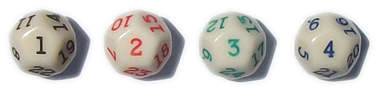
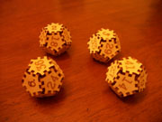
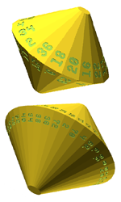
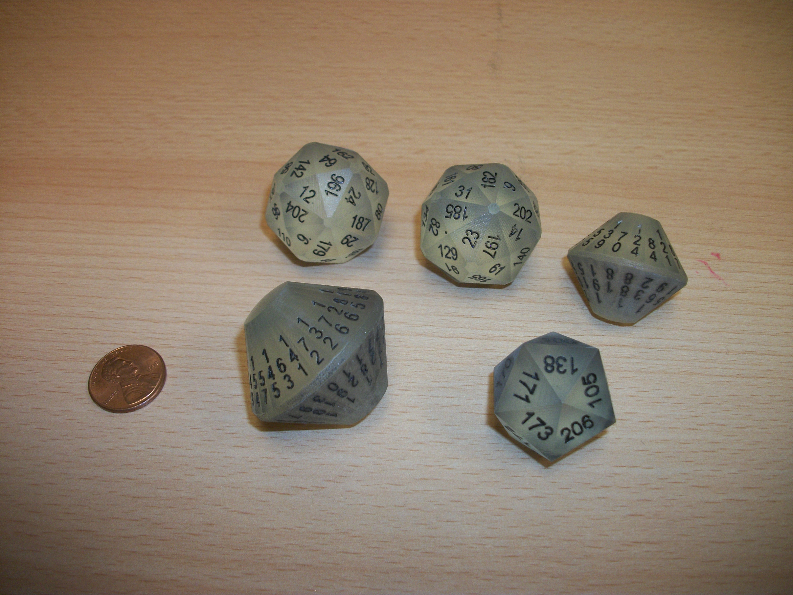
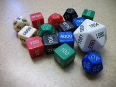
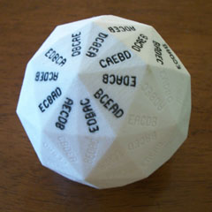
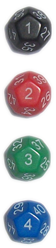

Go First Dice

|     |
| --- |
|  # Go First Dice by Eric Harshbarger * * * Available in the U.S. from [The Dice Shop at MathArtFun](http://mathartfun.com/dSpecial.html) and in the U.K. from [Maths Gear](http://mathsgear.co.uk/collections/dice/products/go-first-dice)! * * * [## Abstract]()"Go First Dice" are a set of dice that allows some number of players to each roll a different single die (picked arbitrarily from the set) and the following conditions hold: 1. There will never be ties. 2. Each possible ordering of the players (determined by highest result, next highest result, etc) has a mathematically equal chance of occurring. 3. The above conditions hold for every subset of the whole set. This document details the history of such sets of dice, some of the mathematics behind them, what advances may still be made in the research, and where such sets may be purchased.[## History]()The concept of Go First Dice was first proposed to me during the summer of 2010 by James Ernest (founder of [Cheapass Games](http://www.cheapass.com/)). At the time he asked if I might be able to develop a set of dice (presumedly 6-sided) that would have "go first" properties. We both understood that this was really a "solution looking for a problem" (there are plenty of perfectly acceptable ways to quickly determine who might go first in a game), but mathematically, wouldn't it be great if a set of dice could be created such that players could each take any one of the dice and roll against one another such that: 1. There would not be a tie, 2. Each player has an equal chance of rolling highest (note this is a weaker condition than stated above in the Abstract -- more on that soon), 3. And, we would like the above conditions to hold even if any *subset* of eight players roll against one another (for example, if only five players are participating, each would take a die, and roll and each would then have exacly a 1/5 chance of rolling the high number). The first condition is easy to satisfy: simply use different numbers on each die. For example, if eight 6-sided dice were being used, just figure out how to distribute the numbers 1 through 48 across the forty-eight faces among all the dice. There could never be a tie then. The real work, of course, is "just" figuring out how to do that. Not only so that each of eight players would have a 1/8 chance of rolling high, but such that this equal-chance condition holds *for any subset* of the dice. I could not immediately come up with a configuration of numbers that would work, but the problem certainly got me thinking. My initial idea was to number the dice in a "serpentine" fashion: Die 1: 1, 16, 17, 32, 33, 48 Die 2: 2, 15, 18, 31, 34, 47 Die 3: 3, 14, 19, 30, 35, 46 Die 4: 4, 13, 20, 29, 36, 45 Die 5: 5, 12, 21, 28, 37, 44 Die 6: 6, 11, 22, 27, 38, 43 Die 7: 7, 10, 23, 26, 39, 42 Die 8: 8, 9, 24, 25, 40, 41 but, by no means did I see that this would work, it was just my first stab at an answer. And it was soon pointed out to me that such a serpentine numbering would *not* work. ## [Mathematics]() The friend who pointed this out to me was Robert Ford, someone I had grown up with and who had recently become a Professor of Mathematics after getting his Ph.D. from [Auburn University](http://www.auburn.edu/) (I had gotten my Masters Degree in Mathematics from Auburn back in 1993). After a few days of toying with the Go First Problem, I mentioned it to Robert and he soon pointed out a couple of things. First, my serpentine method would definitely not suffice (the probabilities for most arbitrary subsets simply did not work out), and more troubling, if we were limiting ourselves to just 6-sided dice, then this problem, as originally stated, would *never* be possible. Specifically, a subset for 5-players would never be achievable. The proof behind this is pretty easy to understand. If we are only using 6-sided dice, then only 6-sided dice are ever rolled against one another. But that means that the number of possible outcomes will be 6*n* (six to the nth power), where *n* is the number of players rolling. But the total number of these outcomes must be evenly divisible by that number of players, *n*, for each player to have an exactly equal chance of rolling highest. For five players, however, 6*n* will *never* be divisible by 5 (because the only factors being multiplied are 2 and 3; a 5 never gets into the mix). So, as originally stated, the Go First Problem was unsolvable. However, James's original request for eight 6-sided dice was not set in stone, those were simply choices he thought would be great if doable. Robert and I still had a couple of options if we wanted to develop *some* type of Go First Dice. First, we could lower the upper bound of players (maybe a set with four players maximum instead of eight?) Alternately, we could possibly use different shaped dice. Having grown up playing plenty of table-top role-playing games, we were fully aware of polyhedral dice. Of great interest was the fact that 30-sided dice existed, and 30 certainly *was* divisible by 5, so it might be possible to find five (or six!) 30-sided dice that would be "go first" fair (we decided by this point to forgo seven players altogether). Over the next few weeks (this was during August of 2010), we made more progress. - Robert discovered a set of 3d6 (this is fairly standard notation for "three-die-six", that is, three 6-sided dice) which was "go first fair": Die 1: 1, 5, 10, 11, 13, 17 Die 2: 3, 4, 7, 12, 15, 16 Die 3: 2, 6, 8, 9, 14, 18 (I have heard that a similarly configured set of 3d6 was already available for sale at this point in time, for the same "determine who goes first" reasons, but I have never actually seen a set for sale. If anyone has information, please let me know.) - By this time I was writing computer programs to help us quickly analyze possible dice sets, and by the end of August 2010 I was able to rule out the existence of a 4d6 Go First Dice set (I had exhaustively searched the 4d6 space, and no set was "go first fair"). So, not even a 4d6 set was going to be possible (a reader might think, "well of course not, since 6, the number of sides, is not divisible by 4, the number of players", but keep in mind that 4 *does* divide evenly into 6*n* anytime *n* ≥ 2 -- and you'd always have at least two players participating, so it might have been possible). This was discouraging, but the disappointment was offset a week later when Robert discovered this configuration using four 12-sided dice: Die 1: 1, 8, 11, 14, 19, 22, 27, 30, 35, 38, 41, 48 Die 2: 2, 7, 10, 15, 18, 23, 26, 31, 34, 39, 42, 47 Die 3: 3, 6, 12, 13, 17, 24, 25, 32, 36, 37, 43, 46 Die 4: 4, 5, 9, 16, 20, 21, 28, 29, 33, 40, 44, 45 (he had found this "by hand", not with the aid of computer crunching). That 4d12 configuration is, in fact, "go first fair". The very first prototype of this set is pictured to the right (laser-cut and engraved basswood faces assembled by hand). By January 2012 I started engraving commercially available blank d12s. During that year and a half between discovery and actual implementation, Robert and I researched "go firstness" more. In addition to searching for a 5d30 set, we also realized that we needed to distinguish between "levels of fairness." ## [Types Of Fairness]() The 4d12 set above is certainly "go first fair" in the way that had originally been sought: each player (or any subset of up to four players) has an equal chance of rolling the highest number. But it turns out that the above set is even stronger than that. Let's consider the follow three "levels of fairness", starting with the "weakest": 1. **Go-first-fair.** This is as originally sought. Each player has an equal chance of rolling the highest number, and that person would go first. 2. **Place-fair.** Here, each player has an equal chance of not only rolling highest, but also ending up in any ranking/position. For example, each player would also have an equal chance of rolling the second highest number, the third highest number (if three or more players rolling), and so on. 3. **Permutation-fair.** This is the strongest type of fairness. Not only does each player have an equal chance of ending up in any position in the ordering, but every possible ordering (permutation) of players has an equal chance of occurring. To the casual reader "place-fairness" and "permutation-fairness" might sound like the same thing, but they are different. It is quite possible for a set of dice to be "place-fair" without being "permutation-fair". In such a case, each player would be equally likely to end up in any position of the hierarchy, but some overall orderings of players would be more likely to occur (for example, if the dice are colored Black, Red, Green, and Blue, any color would be equally likely to end up in any of the four sorted positions, but maybe "Green, Red, Black, Blue" ordering comes up more often, than say, "Red, Blue, Black, Green" -- individually the colors are equally likely to end up in positions 1-4, but how their positions relate to the other colors might not be equi-probable). Achieving that equi-probability of the permutations only happens with "permutation-fairness". And it turns out that our set of 4d12 Go First Dice that Robert had found was, in fact, this strongest type of fairness. If you want to see the evidence of this, by the way, [here's a LARGE text file that is a complete analysis of the Go First Dice](http://www.ericharshbarger.org/dice/4d12_fairness_report.txt). It tallies up every possible set of outcomes for all possible subsets of the dice and verifies that each permutation/ordering is equally likely to occur. So, calling the set "Go First Dice" is actually a misnomer. The set is far better than just "go first" fair. It's even better than "place" fair. It is "permutation" fair. But we didn't realize this for quite some time, and by then we were used to referring to our set as "Go First Dice", so the name has pretty much stuck (plus, I think "Go First Dice" gets the message across well enough, and, in fact, more intuitively, to casual -- non-mathematician -- players, than "Permutation Fair Dice"). ## [Beyond Four Players]() For several years now, I've been engraving and selling this Go First Dice set, but you can probably guess the most common question I get in feedback: "what about 5 or more players?" (since many board games allow more than four people to participate). Well, we're still working on that. Since 2010 we've been working on it, and not just Robert and I; several other very competent computer and/or math folks have been helping (call-outs to Landon Kryger, Brandon Enright, Carl Hoff, Paul Vanetti, Alex Byaly, and Zachary Sarver are due at this point). Our search methods have become much faster, our studies of various symmetries has increased, and our accumulated data has increased enormously, but as of yet, we have not yet found an "acceptable" set of dice that works for five or more players. Here are some of the advances and insights we *have* made (from now on, unless otherwise stated, the "fairness" achieved is the strongest type -- "permutation-fairness"): 1. If a particular die has consecutive numbers on it, the greater of the two numbers can be reduced by one so that the die simply has two copies of the lower number on it. In this way, the total number of distinct intergers used within a set may be reduced. For example, in the 4d12 discussed above Die #3 has "12" and "13" on it; these could be replaced with two instances of "12" and the fairness would not be altered. All of the numbers above 13 (on all of the dice) could then be reduced by one, and only the numbers 1-47 would appear in the set (12 appearing twice). The process could be repeated until all consecutive pairs on dice are removed. This is not terribly helpful in the grand scheme of this project, but it could create some interesting configurations. 2. The 4d12 set above has a few interesting types of symmetry:     1. **Opposite Face (aka Mirror) Symmetry.** The die with the lowest number (1) on it also has the highest number on it (48). The second lowest number (2) is on the same die as the second highest number (47), and so on. This allows us to make opposite faces always sum up to the same number (here 49).     2. **Column-Grouped Symmetry.** There are four dice in the set, and the numbers 1-4 are each on a separate die. The next four numbers (5-8) are also on separate dice, and so on.     3. **Paired-Column Symmetry.** Note that for each of the four dice the two lowest numbers add up to 9, the next two lowest numbers add up to 25, the next two always sum to 41, and so on. None of these above types of symmetry is necessary to achieve permutation-fairness in general (consider the 3d6 example at top which is permutation-fair but exhibits none of these symmetries). Nor are these symmetries sufficient (obviously). 3. The 4d12 that Robert found is not the only 4d12, perm-fair set. In fact, there are 3372 such sets (not all exhibiting all of the symmetry types described above). 4. It turns out, somewhat surprisingly, that the number of faces on the dice need not be equal. For example, there is a set comprising a d4, d6, d8, and d12 that is perm-fair. This d4+d6+d8+d12 has only 30 faces total, among all of its dice, and represents the "smallest" (4-player) set that is permutation fair. 5. If a fair set uses dice of different sizes (different face counts), the face counts may be made equal by "augmenting" each die (by repeating numbers, for example) up to a number of faces equal to the least-common-multiple of the different face counts. For example, the d4+d6+d8+d12 set mentioned above could have each of its dice augmented up to a 24-sided die so that the fairness remains (24 = LCM(4,6,8,12)). 6. If a set has dice with varied face counts, the total number of outcomes for a particular subset of size *n* must still be evenly divisible by *n*, of course. This puts some restrictions on what face counts can work together. For example, there can, at most, be only two dice in the whole set that do not have a face count divisble by 3 (if three dice did have face counts relatively prime to 3, then that group of three dice would not work as a valid subset). Likewise, at most only one die of the whole set can have an odd number of sides (odd face counts may be "faked" by duplicating numbers on even-sided dice -- like making a d3 by numbering a cube 1, 1, 2, 2, 3, 3).  7. As of yet, no 5-player, permutation-fair set has initially been found by computer search. However, using mathematical techniques developed by hand (the details of which are too involved for this webpage), I have been able to find many sets that would work, and if the geometric shapes were cooperative, then a 5-player set could be made. The smallest such set requires a total of 200 faces across these five dice: d20+d24+d36+d48+d72. While there are ways one could techincally make geometrically fair shapes for these face counts, the d36 and d72 (pictured right) would be very ugly and unwieldy. 8. The above smallest set has face counts with a least common multiple of 360. A set with a better LCM has been found: d20+2d36+d60+d180 (LCM = 180), but the total face count is much larger (20 + 36 + 36 + 60 + 180 = 332). The lowest LCM I've found for a 6-player set is 720 sides (= LCM(80, 90, 144, 144, 240, 720). 9. In January 2018 I discovered a permutation-fair 5-dice configuration with sides: d20+d36+d48+d48+d54 (LCM=2160); shown at right. The total side count is 206, not a record for smallest; however, the set *does* have the smallest-largest die yet found in such a set; the 54-sided die is getting very close to a usable/readable dipyramidal shape (the largest dipyramidal die I've seen for sale -- outside of custom 3d-printing -- [is a 50-sided die](https://www.mathartfun.com/d141518.html)). 10. The geometries of fair dice present yet another problem when searching for manufacturable sets of Go First Dice. As mentioned above, a d36 and d72 are theoretically possible, but not very pleasing aesthetically ([more information about geometrically fair shapes for dice may be found at this website](http://www.mathpuzzle.com/Fairdice.htm)). Other 5-player sets that I have produced theoretically/mathematically include a 4d48+d90 set and a 4d60+d144 set. The former is *so* close to being makeable (decent 48-sided dice are definitely possible -- say, with a [disdyakis dodecahedron](http://mathworld.wolfram.com/DisdyakisDodecahedron.html)), but the 90-sided fifth die poses a problem. Similarly, the 4d60 in the latter example are certainly possible, but the d144 is out of the question. A 144-sided die could be simulated by rolling two 12-sided (12×12 = 144), but reconciling the numbering of those along with the 4d60 would be a nightmare. 11. Of all the 5-player sets I've been able to create mathematically, a factor of 9 always seems to crop up in at least one of the necessary face counts. This is serious problem, because, other than a few clunky triangular-dihedral or barrel designs, a fair geometric polyhedron cannot be formed with 9n sides. The 4d48+d90 set mentioned above is particularly irksome since a d60 is definitely makeable ([a deltoidal hexecontahedron](http://mathworld.wolfram.com/DeltoidalHexecontahedron.html), for example), and a 120-sided is also doable ([disdyakis triacontahedron](http://mathworld.wolfram.com/DisdyakisTriacontahedron.html)); but you can't split the difference to get 90 sides. There might be other mathematical techniques that could induce 5-player sets while avoiding the "factor of 9" problem, but I have not yet found any. 12. The possibility of a permutation-fair 5d30 set has not been ruled out. For that matter, neither has a 6d30 set which would work for up to six players. The problem, of course, is that the search spaces through which computers crunch are *massive* (like far, far more than the number-of-atoms-in-the-universe massive). Restricting the search space by requiring certain combinations of symmetries has ruled out 5d30 in some of those subspaces (for example, despite there existing about a quarter of a billion 4d30 sets with Mirror+ColumnGroup Symmetries, we know that there is *not* such a 5d30 set; that subspace had only about 1.28 × 1029 configurations to analyze...). With no symmetry requirements, however, the question is still open.  13. [I]() have been able to make a valid 6-player, permutation-fair set by using multiple dice in each "color group". This is not as elegant as the 4d12 set for four players, because it requires players to add the face-up numbers on their dice, but with numbers picked for convenience, the adding can be made trivial. To the right is a picture of the 6-player collection. There are six colors of dice; the black, red, green, and blue groups each have 2d6+d12. The ivory group is a d6+d20, and the white is a single d20 (at jumbo size since I had to fit 4-digit numbers on its faces). This is permutation-fair for 6 players (and thus any subset as well). Each person takes all of the dice of a particular color, rolls them, and adds the face-up numbers (the numbers on the d6s are rounded to either 100s or 1000s, so the adding is easy). With all six groups rolled, there 83,588,441,702,400 possible outcomes. Each of the 720 (= 6!) possible orderings get *exactly* the same number of outcomes: 116,095,057,920 (I don't have a text file listing all of the reuslt because it would be HUGE... you'll just have to take my word on it).  14. 5-player permutation-fairness can actually be achieved on a *single* die, if that die is 120-sided (and, again, [there is such a shape](http://mathworld.wolfram.com/DisdyakisTriacontahedron.html)). The number of ways five players can be ordered is 5! (5-factorial), which equals exactly 120. So, one could label the 120 sides of such a die with all possible orderings of the letters A, B, C, D, and E. When players are ready to determine an order for game-play, they each decide on one of those letters (or maybe let the person with the alphabetically first name name be "A" and so on). The d120 would be rolled, and then the "ABCDE" (or "BCEAD" or whatever) result that comes up, determines the order (reading the five character string left to right). This would work for any subset with fewer than five players too, just ignore the letters that are not used. There are some aesthetic issues with this, however. First, the d120 is a *big* die (I have a partially inked prototype pictured to the right -- it's the size of a baseball and weighs about 3/4 of a pound). Second, having so many sides means it rolls for a long time; this is a problem with all dice above 30 faces or so. Finally, part of the enjoyment of a "traditional" Go First Dice set is that everyone gets to roll their own die (which they got to choose). Even though this d120 scheme would work, with a single roll, it's just not as much fun. And, of course, this could not ever be extended up to 6 players, because that would require a single 720-sided die (= 6!) 15. If you are only concerned about the weakest, "go first", type of fairness, it is fairly easy to show that a set can be constructed for just about any number of players if you set restrictions on which dice are used based on the number of players actually rolling. For example, imagine the following set of six dice: d2: 5,5 d4: 6,6,4,4 d6: 7,7,3,3,3,3 d8: 8,8,2,2,2,2,2,2 d10: 9,9,1,1,1,1,1,1,1,1 d12: 10,10,0,0,0,0,0,0,0,0,0,0 It would work for up to six players ("go-first" fairness only) *if* you require that players always choose from the lowest available dice (for example, if only three players were rolling, they could only choose their dice from the three smallest sizes: d2, d4, d6). This restriction, in my opinion, ruins much of the elegance of the original problem (where you may always choose any die). It also, of course, loses the permutation-fairness. For these reasons, I have not paid much attention to such sets. [## More Information]()I have occasionally given talks about Go First Dice, and those talks have, at times been video recorded. - [Here is one such talk when I had only 6-7 minutes to talk about "Advances with Go First Dice" at the 12th Gathering 4 Gardner in Atlanta, Georgia, 2016](https://youtu.be/lOu8au63hhk). There's really nothing in that quick talk that isn't already mentioned on this page. [## Acquiring Your Own Go First Dice]()Even though a reasonable 5- (or 6-) player set has not yet been found, plenty of board gamers have found the 4d12 set useful (and educational, and, frankly, fun). People generally hear about these dice through word-of-mouth, [the webpage on Board Game Geek](http://boardgamegeek.com/boardgame/130357/go-first-dice), or through sporadic web publicity (they have been written about in [*The Guardian*](http://www.guardian.co.uk/science/alexs-adventures-in-numberland/2012/sep/18/puzzler-go-first-dice) and featured on an episode of [*TableTop!*](https://www.youtube.com/watch?v=OG0zfMslfQs)). [The Dice Shop at MathArtFun](http://mathartfun.com/dSpecial.html) sells colored Go First Dice in the U.S. and [Maths Gear](http://mathsgear.co.uk/collections/dice/products/go-first-dice) sells them in the U.K. * * * Copyright © 2015 Eric Harshbarger |