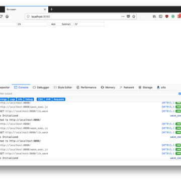

Go WebAssembly — Building a Calculator Tutorial – Hacker Noon

Go WebAssembly — Building a Calculator Tutorial – Hacker Noon

https://hackernoon.com/go-webassembly-building-a-calculator-tutorial-70fff89db6a9

Welcome All! With Go v1.11 having just been released with an experimental port to WebAssembly included, I thought it would be awesome to…