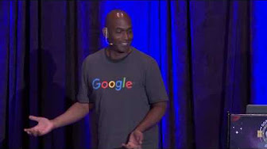
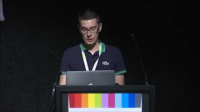
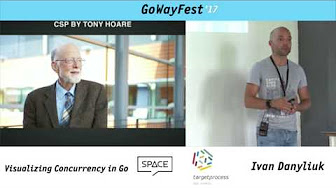
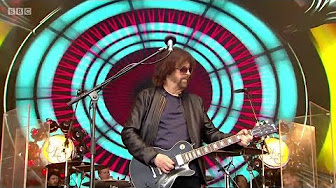
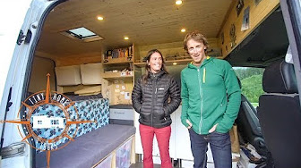
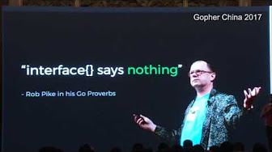
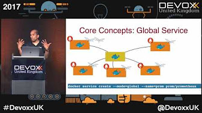
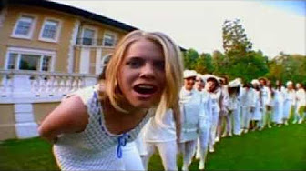
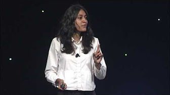

GoWayFest 2017 - Eyal Post - Why Go Scales? - YouTube

Up next

Autoplay

   [        22:03](https://www.youtube.com/watch?v=XPC-hFL-4lU)    [ ###        GopherCon 2017: Kelsey Hightower - Self Deploying Kubernetes Applications                 Gopher Academy               3.4K views](https://www.youtube.com/watch?v=XPC-hFL-4lU)

   [        37:47](https://www.youtube.com/watch?v=SCV5froaArg)    [ ###        Max Tepkeev - Do I need to switch to Go(lang) ?                 EuroPython Conference               21K views](https://www.youtube.com/watch?v=SCV5froaArg)

   [        4:06](https://www.youtube.com/watch?v=elPp3c2eA_o)    [ ###        The Beatles/Paul McCartney finishing off Hey Jude. Paul finally gets George's approval frm the booth                 Beatle Stories               Recommended for you                               New](https://www.youtube.com/watch?v=elPp3c2eA_o)

   [        34:16](https://www.youtube.com/watch?v=QNY2QcmxVJQ)    [ ###        GoWayFest 2017 - Ivan Danyliuk - Visualizing Concurrency in Go                 EventSpaceBy Video               71 views](https://www.youtube.com/watch?v=QNY2QcmxVJQ)

   [        59:40](https://www.youtube.com/watch?v=nhNRj8gcix8)    [ ###        Jeff Lynne's ELO - Live at Glastonbury Festival 2016 (The Best on YouTube)                 J.G. Soriano               16K views](https://www.youtube.com/watch?v=nhNRj8gcix8)

   [        24:01](https://www.youtube.com/watch?v=ooOoDx2NxkU)    [ ###        Couple Builds Ultimate DIY Stealth Sprinter Camper Van ~ Tons Of GREAT Ideas                 Tiny Home Tours               Recommended for you](https://www.youtube.com/watch?v=ooOoDx2NxkU)

   [        49:49](https://www.youtube.com/watch?v=F4wUrj6pmSI)    [ ###        2 4 Google Understanding Go Interfaces                 Asta Xie               10K views](https://www.youtube.com/watch?v=F4wUrj6pmSI)

   [        45:38](https://www.youtube.com/watch?v=1dgUXNVQS5o)    [ ###        Docker Swarm or Kubernetes or Mesos - pick your framework! by Arun Gupta                 Devoxx               3.2K views](https://www.youtube.com/watch?v=1dgUXNVQS5o)

   [        3:38](https://www.youtube.com/watch?v=aX-B0jY6H1k)    [ ###        Angry White House reporter at press briefing: 'I can't take it anymore!' YELLS at Huckabee Sanders                 NedtheDestroyer               795K views](https://www.youtube.com/watch?v=aX-B0jY6H1k)

   [        16:31](https://www.youtube.com/watch?v=hdKR5t-LHV4)    [ ###        Noel Gallagher plagiarism (you can find more)                 miamilan               147K views](https://www.youtube.com/watch?v=hdKR5t-LHV4)

   [        21:45](https://www.youtube.com/watch?v=KBZlN0izeiY)    [ ###        GopherCon 2017: Kavya Joshi - Understanding Channels                 Gopher Academy               6.7K views](https://www.youtube.com/watch?v=KBZlN0izeiY)

   [        59:36](https://www.youtube.com/watch?v=Y7-ladC3eAQ)    [ ###        The Kate Bush Story - Running up That Hill (2014 BBC Documentary) [HD]                 Treasures OD               Recommended for you](https://www.youtube.com/watch?v=Y7-ladC3eAQ)

   [    1:26:35](https://www.youtube.com/watch?v=7Nruo7YOHng)    [ ###        ferris bueller's day off-inside story                 movies/tv shows               399K views](https://www.youtube.com/watch?v=7Nruo7YOHng)

   [    31:18](https://www.youtube.com/watch?v=ENLWEfi0Tkg)    [ ###        Gopherfest 2017: Upspin (Rob Pike)                 The Go Programming Language                                                     11K views](https://www.youtube.com/watch?v=ENLWEfi0Tkg)

   [    31:22](https://www.youtube.com/watch?v=cN_DpYBzKso)    [ ###        Rob Pike - 'Concurrency Is Not Parallelism'                 afriza na               102K views](https://www.youtube.com/watch?v=cN_DpYBzKso)

   [    38:14](https://www.youtube.com/watch?v=ltqV6pDKZD8)    [ ###        GopherCon 2017: Edward Muller - Go Anti-Patterns                 Gopher Academy               5.3K views](https://www.youtube.com/watch?v=ltqV6pDKZD8)

   [    59:01](https://www.youtube.com/watch?v=cVHGLdZQgEw)    [ ###        The Pink Floyd Story Which One Is Pink (FULL Documentary).avi                 01aleph               702K views](https://www.youtube.com/watch?v=cVHGLdZQgEw)

   [    8:10](https://www.youtube.com/watch?v=C1EtfDnsdDs)    [ ###        GopherCon 2017 - Lightning Talk: Bryan C Mills - An overview of sync.Map                 Gopher Academy               2.5K views](https://www.youtube.com/watch?v=C1EtfDnsdDs)

   [    36:22](https://www.youtube.com/watch?v=T5w6i5EVQSU)    [ ###        Al Franken at the 1996 White House Correspondents Dinner (Apr 1996)                 Josh Burdick               Recommended for you](https://www.youtube.com/watch?v=T5w6i5EVQSU)

   [    15:11](https://www.youtube.com/watch?v=aoCETky6KmI)    [ ###        A banjo player overcomes the PR disaster of the movie deliverance | Howard Goldthwaite | TEDxSMU                 TEDx Talks               102K views](https://www.youtube.com/watch?v=aoCETky6KmI)

     Show more

# GoWayFest 2017 - Eyal Post - Why Go Scales?

3,445 views

[59]()[2]()[Share]()

[EventSpaceBy Video](https://www.youtube.com/channel/UCX5g8IOR_tw1OkiFAzAZHaA)

Published on Aug 22, 2017

   Subscribe 732

 Go is repeatedly being marketed as a language suited for developing high performance server applications, but what exactly makes Go programs scale? In this session we'll look at the design of the Go language and runtime, compare it to other technologies and understand how it works internally and what makes it perfect for high performance applications. If you want to learn about the language that was used to develop Kubernetes, Docker, Gett, Juno and other well known high traffic systems, this is the session for you!

     Show less      Show more

##   4 Comments

Sort by

 
 Add a public comment...

 

 [ Eyal Post](https://www.youtube.com/channel/UC0GcxvOwyWmuf8XOjz_9k7w)      [1 week ago](https://www.youtube.com/watch?v=e2QVjmN5IF4&lc=z22twpnitozbepjw404t1aokgyrtmbexenqof5je4552bk0h00410)     •

   The slides are available here: [https://www.slideshare.net/EyalPost/why-go-scales](https://www.slideshare.net/EyalPost/why-go-scales)

   Show less      Read more

#  The slides are available here: https://www.slideshare.net/EyalPost/why-go-scales

 [Reply]()   3

     Show More

  Hide replies

  View all 3 replies

 

 [ Samuel El-Borai](https://www.youtube.com/channel/UCxfvr881PuGfMsqBdwcYCMg)      [1 week ago (edited)](https://www.youtube.com/watch?v=e2QVjmN5IF4&lc=z22twpnitozbepjw404t1aokgyrtmbexenqof5je4552bk0h00410.1503667308246938)     •

   Hi Eyal, thank you for the talk, that was very interesting!

Could you please share a link to the Cloudflare blog article that you mention at [30:18](https://www.youtube.com/watch?v=e2QVjmN5IF4&t=1818s) ? :)

   Show less      Read more

#  Hi Eyal, thank you for the talk, that was very interesting!

Could you please share a link to the Cloudflare blog article that you mention at 30:18 ? :)

 [Reply]()   1

 

 [ Eyal Post](https://www.youtube.com/channel/UC0GcxvOwyWmuf8XOjz_9k7w)      [1 week ago](https://www.youtube.com/watch?v=e2QVjmN5IF4&lc=z22twpnitozbepjw404t1aokgyrtmbexenqof5je4552bk0h00410.1503673880277164)     •

   Thanks! Here's the link: [https://blog.cloudflare.com/how-stacks-are-handled-in-go/](https://blog.cloudflare.com/how-stacks-are-handled-in-go/)

   Show less      Read more

#  Thanks! Here's the link: https://blog.cloudflare.com/how-stacks-are-handled-in-go/

 [Reply]()   1