Godot Engine - Free and open source 2D and 3D game engine

 [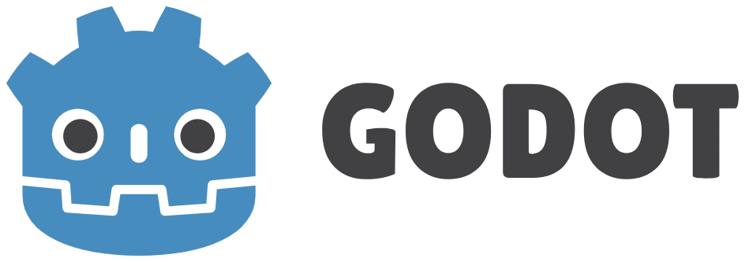](https://godotengine.org/)    

## The game engine you waited for.

Godot provides a huge set of common tools, so you can just focus on making your game without reinventing the wheel.

Godot is completely free and open-source under the very permissive MIT license. No strings attached, no royalties, nothing. Your game is yours, down to the last line of engine code.

 [ Download  3.2](https://godotengine.org/download)  [Learn more](https://godotengine.org/features)

 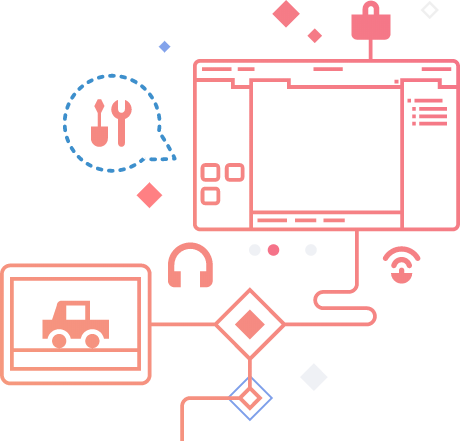

 [  #### Godot 4.0 will get a new, modernized lightmapper    In most game engines, a lightmap is baked for a whole scene and there is only one of it at the same time. In Godot, different scenes can have their own ligthmaps and you can mix and match them however...](https://godotengine.org/article/godot-40-will-get-new-modernized-lightmapper)

### news

* * *

 [**Dev snapshot: Godot 3.2.2 beta 2**](https://godotengine.org/article/dev-snapshot-godot-3-2-2-beta-2)

* * *

 [**GDScript progress report: Writing a tokenizer**](https://godotengine.org/article/gdscript-progress-report-writing-tokenizer)

* * *

 [**Vulkan Progress Report #7**](https://godotengine.org/article/vulkan-progress-report-7)

* * *

[more](https://godotengine.org/news)

## A different way to make games

 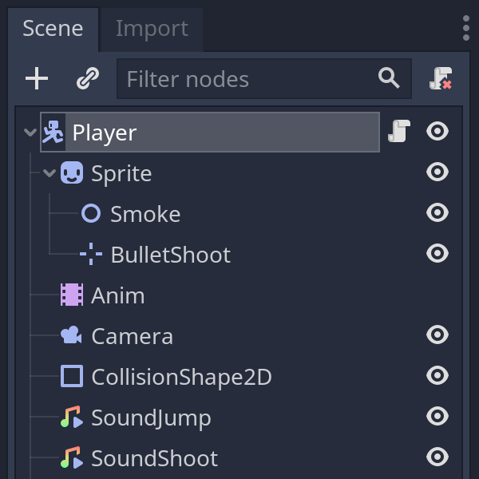

#### Innovative Design

Big or small ideas adapt seamlessly to Godot's node-based architecture, making your life easier.

 

#### Gorgeous 3D

Innovative 3D renderer design, which makes your art look great with minimal effort.

 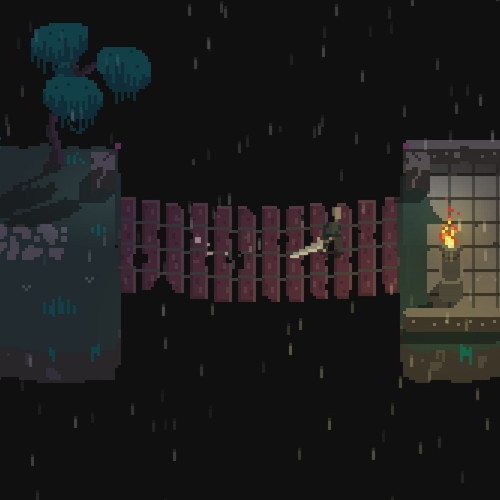

#### Beautiful 2D

Dedicated 2D engine that works in pixel coordinates, with plenty of built-in tools.

 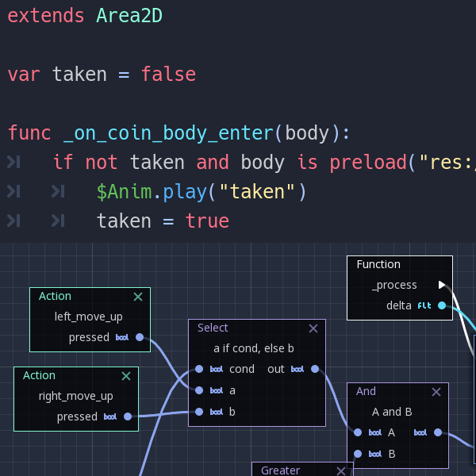

#### Easy to program

Object-oriented API with language options such as GDScript, C#, C++ and visual scripting.

 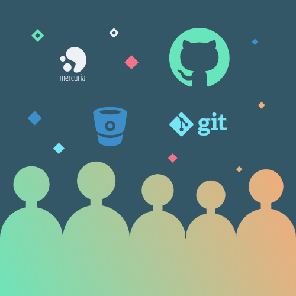

#### Team-Friendly

From architecture and tools to VCS integration, Godot is designed for everyone in your team.

 

#### Open Source

Truly open development: anyone who contributes to Godot benefits equally from others’ contributions.

## Get involved

Join the community and help create a game engine that belongs to everybody.

 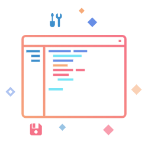

#### code

If you know how to code, and enjoy fun and challenging problems, you can help by fixing bugs or creating cool new features.

 [learn more](https://docs.godotengine.org/en/stable/community/contributing/ways_to_contribute.html#contributing-code)

 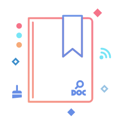

#### document

Documentation quality is essential in a game engine; help make it better by updating the API reference, writing new guides or submitting corrections.

 [learn more](https://docs.godotengine.org/en/stable/community/contributing/ways_to_contribute.html#contributing-to-the-documentation)

 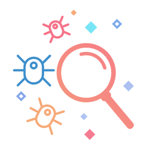

#### report

Found a problem with the engine? Don't forget to report it so that developers can track it down.

 [learn more](https://docs.godotengine.org/en/stable/community/contributing/ways_to_contribute.html#testing-and-reporting-issues)

 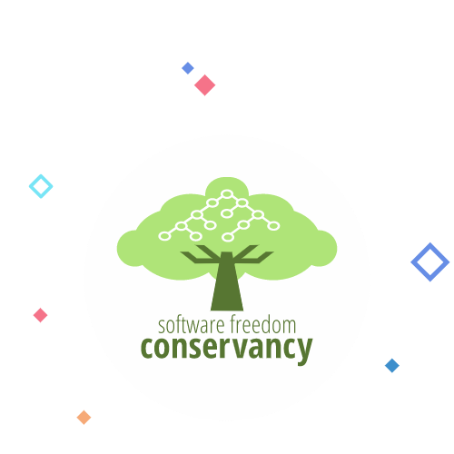

### donate

You don't need to be an engine developer to help Godot. Consider donating to speed up development and make Godot Engine even more awesome!

 [Learn more](https://godotengine.org/donate)

## Sponsored by

   [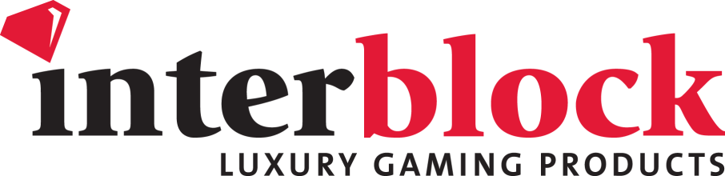](http://www.interblockgaming.com/)

   [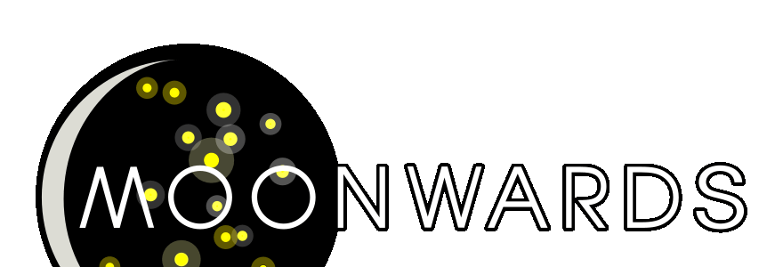](https://www.moonwards.com/)

© 2007-2020 Juan Linietsky, Ariel Manzur and [contributors](https://github.com/godotengine/godot/blob/master/AUTHORS.md)

Godot is a member of the [Software Freedom Conservancy](https://sfconservancy.org/)

Kindly hosted by [TuxFamily.org](https://tuxfamily.org/)

- [News](https://godotengine.org/news)

- [Community](https://godotengine.org/community)

- [Features](https://godotengine.org/features)

- [Documentation](https://docs.godotengine.org/)

- [Download](https://godotengine.org/download)

- [Donate](https://godotengine.org/donate)

#### [Contact us](https://godotengine.org/contact)

         