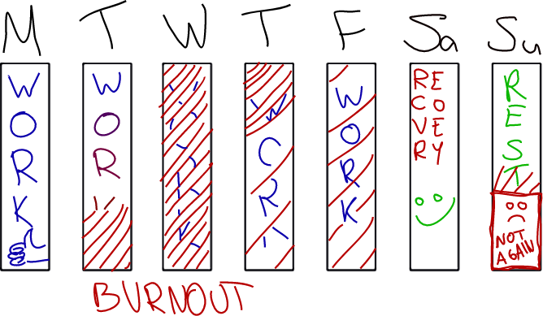
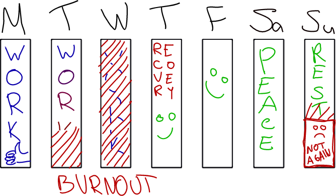
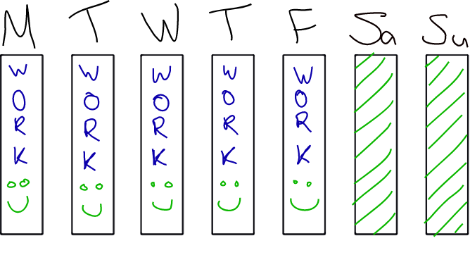

Going for the 5 hour workday

# Going for the 5 hour workday

 01 May 2017

*Update: it's been a month since my proposal was approved - details at the end.*

Before my month long vacation I was in a crisis. Now I'm back at work and regardless of the great team and awesome project - I'm feeling the crisis creeping back. It's not the job, it's the time.

8 hours and 5 days a week is killing me. Every workday I put all my effort into the project. Then I put more effort in to fill the remaining hours and burnout becomes a weekly experience. I even grow do dislike going to work on monday.

This weekly burnout causes my free time to transform from enjoyable health inducing activities to just recovering from work. If there's any time left from chores and running errands that is. In turn rarely do I get enough sleep to be fresh for the next day. Who exactly is benefiting from this? Even the weekends get spent for just recovery from work.

## Moving to a sensible part-time solution

Usually part-time means fewer full days of work. So in case of going to 60% work load:

Honestly I would feel best if the company gets the work that it paid for. So clearly this solution is not ideal. Because of the burnout the company doesn't get what it needs and I'm not satisfied with my results or life. I still end up hating going to work on sundays (even if monday turns out to be a great day).

So my solution that I propose is a 5 hour day, 5 days a week.

I think we can all agree that this solution is way better than the 3 days * 8 hours one. I would even argue it's better than the 8 hours. That's a tall claim, I know. I have no evidence to back it up. But there are many benefits to this approach.

1. More focused time, because you know you have less of it.
2. More time to generate ideas (while relaxing out of the office).
3. More time to be happy and healthy. Less sick days, better atmosphere.

Everyone I know knows that there is only about 4 hours of effective time per day. Yet we stick to the 8 hour workday like it's a religion.

From personal experience an 8 hour workday means my priority is surviving the day and getting something done meanwhile. So I open up my personal inbox or check the news. After lunch I know I'll be sitting here for like 5 more hours so might as well entertain myself a little on Reddit. At 2pm I'm just tired so focusing on work feels like a long drag - an hour long task can easily take 3 (a sign of burning out). How about instead I finish at 2pm and prioritize work over surviving?

## Whiny little bitch

Where I come from work is a religious thing and you better do a lot of it. In my mind quality beats quantity, but talking about this topic will certainly get some angry opinions.

I know not everyone needs this and [not all companies would even benefit](http://www.independent.co.uk/news/business/news/sweden-six-hour-working-day-too-expensive-scrapped-experiment-cothenburg-pilot-scheme-a7508581.html). I do know however how I function and in what conditions I produce the best work. It would seem to me that I am actually weaker than many others in this regard. People tell me I should "suck it up" and "that's life, get on with it", but for me that is not an option. Without getting overly dramatic the reality is I get seriously depressed and will eventually quit my job. The only reason for me to take a full-time job is for the money and if I sign such a contract I am fully aware it wont last for more than a few months.

I guess what I'm saying is I have a disability. I don't need a doctors note for proof, I've gone through this many times. I'm also not expecting special treatment. I am saying I want to work, but in a way that benefits both the company and myself. A pay cut is fine just to even the corners of this experiment. But since I'm giving the company the best hours of the day I would ask 80% of pay for the 60% of workload.

Also please read [more success stories](https://www.fastcompany.com/3051448/why-sweden-is-shifting-to-a-6-hour-work-day) and check out [a little history](https://en.wikipedia.org/wiki/Eight-hour_day) about productivity and hours worked. Then keep in mind how our work has transformed from physical labor to brain power over time and how that affects stamina.

## Boss FAQ

Here are my answers to what a classical boss might say.

###### What if all the employees will want the same deal? I'm losing work here.

Well you may not in fact be losing work. But to be sure you can just run this as an experiment for a few months to see what the reality is.

In any case to keep things fair a pay cut for less hours seems reasonable, not everyone is willing to go through with that trade.

###### This will hurt moral for people working 8 hours.

Do part-time workers hurt morale? If I would get the same pay as a full-time employee that would certainly hurt morale. So let's make it clear to everyone that my pay is indeed cut and that my contract is part-time.

###### Sounds to me like you don't even want to work here!

Not true. I am exited to work on this project with these people. In fact, I would like to be more exited, but the amount of time I have to put in is really weighing the experience down. A pay cut too large is also not very motivating.

###### Well fine, but I better see results!

Measuring results is fine, but breathing down my neck is not. Just make sure you're realistic about your expectations.

# Results

My boss(es) approved my proposal just as I suggested and it's been a month since. Here is what I've found so far.

While I can't measure the total work done, I can measure how many effective hours I put in during the week.

**Overall** productivity per hour has definitely increased. Do I get more work done than on a 8 hour day? Well, probably not. However getting 80% done with a 60% part-time schedule is not a problem (so far).

## First two weeks

This was like working on steroids (and I don't drink coffee). Amazing productivity at work and after. I thought I had hit a gold mine. "Everybody should have these hours" I thought. Well, now I know it was euphoria. I probably performed at full-time equivalent since time was critical and using it effectively became a priority. Spending time with non-work related stuff during work hours was down to 20 minutes - only the bare essentials.

As time was so critical I found myself being super efficient by cutting nice-to-have corners and being super focused. **The only time I could not make more effective were meetings.**

After work I got twice as much done - there was a whole day ahead still. **I was happier, better rested and more productive all around.**

## Two more weeks

**Productivity fell, but stayed at 80% of a full-time job** (at least). The euphoria has passed, but I'm sure I'm still pretty productive, because procrastination per hour is still way down. **Time is still critical. The new mindset is still here**.

**Burnouts are back**. But it's more like low motivation, not a "crash and burn" kind of thing. Something I can manage and think about (provide solutions). And usually this is limited to a single day, and I still get stuff done during it.

**Free time has filled up**. I still get more stuff done, but personal development still requires proper scheduling and planning. The allure of "I'll have time for everything" has gone.

# Conclusion

My time is way better spent improving myself and having happier after-work hours. So this is definitely working out for me.

The company gets proper output from me while paying less than before and my temper is better in the work place. I'd say they're also benefiting from it.

Productivity is up per hour for sure, could be down per day, but over the week I'd say it's still as good as with a 80% workload. Claiming it's as good as 8 hours is a stretch. I bet another 2 months will clear this up more.

The results are a bit more hazy than I initially had thought. So if you're thinking about this consider it as a two month experiment rather than a solution to some problem.

 [(L)](http://code.krister.ee/author/krister-viirsaar/)

#### [Krister Viirsaar](http://code.krister.ee/author/krister-viirsaar/)

Read [more posts](http://code.krister.ee/author/krister-viirsaar/) by this author.

#### Share this post

 [](https://twitter.com/intent/tweet?text=Going%20for%20the%205%20hour%20workday&url=http://code.krister.ee/going-for-the-5-hour-workday/)  [](https://www.facebook.com/sharer/sharer.php?u=http://code.krister.ee/going-for-the-5-hour-workday/)  [](https://plus.google.com/share?url=http://code.krister.ee/going-for-the-5-hour-workday/)

### Subscribe to Krister's coding adventures

Get the latest posts delivered right to your inbox.

 or subscribe [via RSS](http://cloud.feedly.com/#subscription/feed/http://code.krister.ee/rss/) with Feedly!

* * *

- [2 comments]()
- [**Krister's code**](https://disqus.com/home/forums/kristerscode/)
- [Login](https://disqus.com/embed/comments/?base=default&f=kristerscode&t_u=http%3A%2F%2Fcode.krister.ee%2Fgoing-for-the-5-hour-workday%2F&t_d=Going%20for%20the%205%20hour%20workday&t_t=Going%20for%20the%205%20hour%20workday&s_o=default#)
- [1](https://disqus.com/home/inbox/)
- [ Recommend](https://disqus.com/embed/comments/?base=default&f=kristerscode&t_u=http%3A%2F%2Fcode.krister.ee%2Fgoing-for-the-5-hour-workday%2F&t_d=Going%20for%20the%205%20hour%20workday&t_t=Going%20for%20the%205%20hour%20workday&s_o=default#)
- [⤤Share](https://disqus.com/embed/comments/?base=default&f=kristerscode&t_u=http%3A%2F%2Fcode.krister.ee%2Fgoing-for-the-5-hour-workday%2F&t_d=Going%20for%20the%205%20hour%20workday&t_t=Going%20for%20the%205%20hour%20workday&s_o=default#)
- [Sort by Best](https://disqus.com/embed/comments/?base=default&f=kristerscode&t_u=http%3A%2F%2Fcode.krister.ee%2Fgoing-for-the-5-hour-workday%2F&t_d=Going%20for%20the%205%20hour%20workday&t_t=Going%20for%20the%205%20hour%20workday&s_o=default#)

Join the discussion…

- [Attach](https://disqus.com/embed/comments/?base=default&f=kristerscode&t_u=http%3A%2F%2Fcode.krister.ee%2Fgoing-for-the-5-hour-workday%2F&t_d=Going%20for%20the%205%20hour%20workday&t_t=Going%20for%20the%205%20hour%20workday&s_o=default#)

-

    - [−](https://disqus.com/embed/comments/?base=default&f=kristerscode&t_u=http%3A%2F%2Fcode.krister.ee%2Fgoing-for-the-5-hour-workday%2F&t_d=Going%20for%20the%205%20hour%20workday&t_t=Going%20for%20the%205%20hour%20workday&s_o=default#)
    - [*⚑*](https://disqus.com/embed/comments/?base=default&f=kristerscode&t_u=http%3A%2F%2Fcode.krister.ee%2Fgoing-for-the-5-hour-workday%2F&t_d=Going%20for%20the%205%20hour%20workday&t_t=Going%20for%20the%205%20hour%20workday&s_o=default#)

[Carlo](https://disqus.com/by/disqus_yHghQdm02n/)•[42 minutes ago](http://code.krister.ee/going-for-the-5-hour-workday/#comment-3332954532)

I am glad you managed to find the right balance, while I was reading the post I could see myself in every detail.

- [Powered by Disqus](https://disqus.com/)
- [*✉*Subscribe*✔*](https://disqus.com/embed/comments/?base=default&f=kristerscode&t_u=http%3A%2F%2Fcode.krister.ee%2Fgoing-for-the-5-hour-workday%2F&t_d=Going%20for%20the%205%20hour%20workday&t_t=Going%20for%20the%205%20hour%20workday&s_o=default#)
- [*d*Add Disqus to your site](https://publishers.disqus.com/engage?utm_source=kristerscode&utm_medium=Disqus-Footer)
- [*🔒*Privacy](https://help.disqus.com/customer/portal/articles/1657951?utm_source=disqus&utm_medium=embed-footer&utm_content=privacy-btn)

