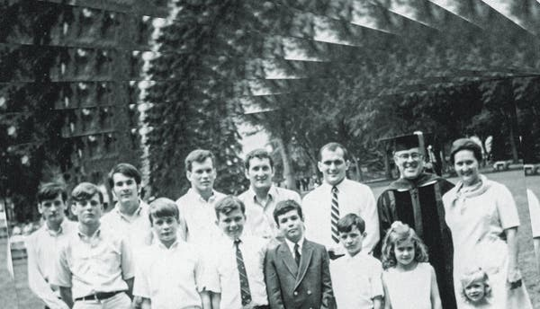

Good Looks Ran in the Family. So Did Schizophrenia. - The New York Times

Nonfiction

# Good Looks Ran in the Family. So Did Schizophrenia.

Don and Mimi had 12 children. Six of them developed schizophrenia.Credit...Photograph via the Galvin family; Illustration by Matt Dorfman

By [Sam Dolnick](https://www.nytimes.com/by/sam-dolnick)

- April 3, 2020

-

    - 
    - 
    - [](https://www.nytimes.com/2020/04/03/books/review/hidden-valley-road-robert-kolker.htmlmailto:?subject=NYTimes.com%3A%20Good%20Looks%20Ran%20in%20the%20Family.%20So%20Did%20Schizophrenia.&body=From%20The%20New%20York%20Times%3A%0A%0AGood%20Looks%20Ran%20in%20the%20Family.%20So%20Did%20Schizophrenia.%0A%0AIn%20%E2%80%9CHidden%20Valley%20Road%2C%E2%80%9D%20Robert%20Kolker%20unspools%20the%20story%20of%20Mimi%20and%20Don%20Galvin%20and%20their%2012%20children%2C%20six%20of%20whom%20developed%20schizophrenia.%0A%0Ahttps%3A%2F%2Fwww.nytimes.com%2F2020%2F04%2F03%2Fbooks%2Freview%2Fhidden-valley-road-robert-kolker.html%3Fsmid%3Dem-share)

    -
    -
    -

**HIDDEN VALLEY ROAD**
**Inside the Mind of an American Family**
By Robert Kolker

Amid the rugged beauty of Colorado Springs, Don Galvin, a gregarious and confident Air Force Academy official, and his wife, Mimi, a sparkplug from an upper-crust Texas family, were raising their family of 12 — count ’em, 12 — children.

Don was named Father of the Year in 1965 by a local civic group, and Mimi, sewing the children’s clothing herself, was an engine of unflappable can-do industriousness. The Galvins seemed to embody American optimism, an emblem of the bountiful American century.

But Donald, the oldest son, knew something was wrong. “He’d known for a while,” Robert Kolker writes, ominously, toward the beginning of his fascinating and upsetting new book, “Hidden Valley Road.”

There was the time when Donald, without explanation, stood at the sink and smashed 10 dishes to pieces. Another when he jumped straight into a bonfire. Another when he apparently killed a cat, “slowly and painfully.”

Advertisement

[Continue reading the main story](https://www.nytimes.com/2020/04/03/books/review/hidden-valley-road-robert-kolker.html#after-story-ad-1)

Donald, who had the all-American good looks of his father, was descending into madness. And then, one by one, in a gruesome and chaotic parade, five of his nine brothers joined him.

“Hidden Valley Road” tells the terrifying story of a family swallowed whole by schizophrenia, a disease that no one understood, not doctors or researchers, and certainly not the Galvins.

Kolker carefully reconstructs the story of the household falling into bedlam as the strong, athletic brothers warred with their demons and one another in flights of violent rage, each one slipping further away. There was the Thanksgiving where the perfectly set table, Mimi’s last fingernail grip on normalcy, was completely toppled over in one of the brothers’ outbursts. The parents, ashamed and overwhelmed, tried to cope, while the other siblings searched for escape, secretly wondering if they would be the next to fall.

Six sons with schizophrenia — the curse of the Galvin family is the stuff of Greek tragedy. Kolker tells their story with great compassion, burrowing inside the particular delusions and hospitalizations of each brother while chronicling the family’s increasingly desperate search for help.

But “Hidden Valley Road” is more than a narrative of despair, and some of the most compelling chapters come from its other half, as a medical mystery. What clues, if any, might the Galvins’ misery hold for doctors and scientists trying to understand the roots of this unfathomable disease?

Advertisement

[Continue reading the main story](https://www.nytimes.com/2020/04/03/books/review/hidden-valley-road-robert-kolker.html#after-story-ad-2)

The medical community’s long misunderstanding of schizophrenia is largely a story of relentless failure, every theory proving more misguided than the last. Some experts championed shock therapy, others called for institutionalization; some psychotherapists saw madness as a metaphor and some doctors prescribed catatonia by tranquilizers. Perhaps most troubling of all, a generation of psychotherapists blamed the mother for causing the disease by either overparenting or underparenting. (You want to stand up and applaud when Kolker quotes one psychiatrist’s rebuttal: “If bad parenting caused any of these diseases, we’d all be in big, big trouble.”)

Through it all, the Galvins’ suffering is baroque and shattering. This is a world so bleak that serial incest rape — one of the ill brothers raped his two younger sisters for years — is just one of the horrors lurking in the attic.

The story of the geneticists’ quest to understand the disease comes as a relief to the family’s anguish. And one researcher, Lynn DeLisi, whom we meet as a young mother in a decidedly male field, emerges as something of a hero.

Years ahead of her time, DeLisi is convinced that schizophrenia is largely a genetic disease and through force of will, she seeks to make the case. The Galvin household, then, becomes one filled not only with pain, but perhaps with tantalizing clues as well. When she finally meets Mimi, halfway through the book, you are praying for a breakthrough.

Kolker follows DeLisi and other researchers on their decades-long search for the disease’s genetic markers, following misadventures in research funding and mazes filled with dead ends. There are promising discoveries in experiments to detect familiar traits and identify the disease’s warning signs — complicated science that Kolker ably explains.

If there were justice in the world, the Galvins’ genes would have provided the key to understanding and preventing schizophrenia, perhaps redeeming some measure of their pain.

Unfortunately, science doesn’t indulge in narrative satisfaction. While the Galvins’ blood samples have proved central to important research into the genetics of the disease, DeLisi remains an outsider rather than a leader in the field, and the Galvins’ genes seem to hold no silver bullet, no Rosetta Stone.

Advertisement

[Continue reading the main story](https://www.nytimes.com/2020/04/03/books/review/hidden-valley-road-robert-kolker.html#after-story-ad-3)

Indeed, the medical community appears not much closer today to finding a “cure” for schizophrenia, if such a thing exists. But Kolker argues that’s the wrong ship to wait for. More promising developments emerge in early detection, and in “soft intervention” techniques that combine therapy, family support and minimal medication.

A gifted storyteller, Kolker brings each family member to life — there’s Michael, who found solace in a Tennessee hippie commune; Brian, who moved to California to become a rock star; Mary, who changed her name to Lindsay as soon as she got to boarding school. But he’s also able to widen the aperture, describing how mental illness reshapes the lives of everyone within sight. “For a family, schizophrenia is, primarily, a felt experience, as if the foundation of the family is permanently tilted in the direction of the sick family member,” Kolker writes.

Kolker is used to prowling worlds of pain. His first book, “[Lost Girls](https://www.nytimes.com/2013/07/07/books/review/lost-girls-by-robert-kolker.html),” about the murders of prostitutes on Long Island, is filled with similar compassion without indulging in tawdry gore. He manages the same balancing act here, narrating the stuff of tabloid nightmares — one of the brothers kills himself and his ex-girlfriend with a .22-caliber rifle — without ever resorting to rubbernecking.

Kolker is a restrained and unshowy writer who is able to effectively set a mood. As the walls begin closing in for the Galvins, he subtly recreates their feeling of claustrophobia, erasing the outside world that has offered so little help. The political tumult of the 1960s exists somewhere out there, but only as an aside: “They prayed for the president who died just a few weeks after their move to Hidden Valley Road, and they prayed for the president who had taken his place.” What are politics and presidents in the face of your sick children?

Kolker spends several chapters with the two sisters, who responded in different ways to the trauma of their brother who preyed on them, and the other horrors of their lives.

But it’s Mimi, the matriarch, who sticks with me. Toward the end of the book, she reflects on the chasm that nearly engulfed her and everyone she loved.

Hearing her plain, stubborn, shellshocked voice, you can’t help wondering what defenses any of us could muster in the face of madness and monsters and genetic mysteries we may never understand.

“I was crushed,” she says. “Because I thought I was such a good mother. I baked a cake and a pie every night. Or at least had Jell-O with whipped cream.”

Advertisement

[Continue reading the main story](https://www.nytimes.com/2020/04/03/books/review/hidden-valley-road-robert-kolker.html#after-bottom)