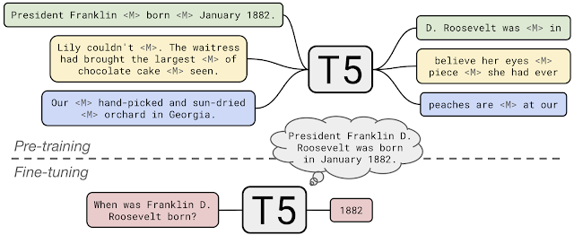
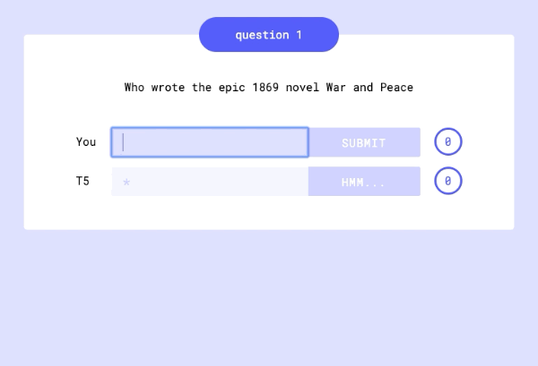

Google AI Blog: Exploring Transfer Learning with T5: the Text-To-Text Transfer Transformer

## [Exploring Transfer Learning with T5: the Text-To-Text Transfer Transformer](http://ai.googleblog.com/2020/02/exploring-transfer-learning-with-t5.html)

Monday, February 24, 2020

 Posted by Adam Roberts, Staff Software Engineer and Colin Raffel, Senior Research Scientist, Google Research

Over the past few years, transfer learning has led to a new wave of state-of-the-art results in [natural language processing](https://en.wikipedia.org/wiki/Natural_language_processing) (NLP). Transfer learning's effectiveness comes from pre-training a model on abundantly-available unlabeled text data with a self-supervised task, such as language modeling or filling in missing words. After that, the model can be fine-tuned on smaller labeled datasets, often resulting in (far) better performance than training on the labeled data alone. The recent success of transfer learning was ignited in 2018 by [GPT](https://s3-us-west-2.amazonaws.com/openai-assets/research-covers/language-unsupervised/language_understanding_paper.pdf), [ULMFiT](https://arxiv.org/abs/1801.06146), [ELMo](https://arxiv.org/abs/1802.05365), and [BERT](https://ai.googleblog.com/2018/11/open-sourcing-bert-state-of-art-pre.html), and 2019 saw the development of a huge diversity of new methods like [XLNet](https://arxiv.org/abs/1906.08237), [RoBERTa](https://arxiv.org/abs/1907.11692), [ALBERT](https://ai.googleblog.com/2019/12/albert-lite-bert-for-self-supervised.html), [Reformer](https://ai.googleblog.com/2020/01/reformer-efficient-transformer.html), and [MT-DNN](https://arxiv.org/abs/1901.11504). The rate of progress in the field has made it difficult to evaluate which improvements are most meaningful and how effective they are when combined.

In “[Exploring the Limits of Transfer Learning with a Unified Text-to-Text Transformer](https://arxiv.org/abs/1910.10683)”, we present a large-scale empirical survey to determine which transfer learning techniques work best and apply these insights at scale to create a new model that we call the Text-To-Text Transfer Transformer (T5). We also introduce a new open-source pre-training dataset, called the [Colossal Clean Crawled Corpus](https://www.tensorflow.org/datasets/catalog/c4) (C4). The T5 model, pre-trained on C4, achieves state-of-the-art results on many NLP benchmarks while being flexible enough to be fine-tuned to a variety of important downstream tasks. In order for our results to be extended and reproduced, we provide the [code](https://github.com/google-research/text-to-text-transfer-transformer) and [pre-trained models](https://github.com/google-research/text-to-text-transfer-transformer#released-model-checkpoints), along with an easy-to-use [Colab Notebook](http://tiny.cc/t5-colab) to help get started.

**A Shared Text-To-Text Framework**

With T5, we propose reframing all NLP tasks into a unified text-to-text-format where the input and output are always text strings, in contrast to BERT-style models that can only output either a class label or a span of the input. Our text-to-text framework allows us to use the same model, loss function, and hyperparameters on *any* NLP task, including machine translation, document summarization, question answering, and classification tasks (e.g., sentiment analysis). We can even apply T5 to regression tasks by training it to predict the string representation of a number instead of the number itself.

|     |
| --- |
|  |
| Diagram of our text-to-text framework. Every task we consider uses text as input to the model, which is trained to generate some target text. This allows us to use the same model, loss function, and hyperparameters across our diverse set of tasks including translation (green), linguistic acceptability (red), sentence similarity (yellow), and document summarization (blue). It also provides a standard testbed for the methods included in our empirical survey. |

**A Large Pre-training Dataset (C4)**

An important ingredient for transfer learning is the unlabeled dataset used for pre-training. To accurately measure the effect of scaling up the amount of pre-training, one needs a dataset that is not only high quality and diverse, but also massive. Existing pre-training datasets don’t meet all three of these criteria — for example, text from [Wikipedia](https://www.wikipedia.org/) is high quality, but uniform in style and relatively small for our purposes, while the [Common Crawl](https://commoncrawl.org/) web scrapes are enormous and highly diverse, but fairly low quality.

To satisfy these requirements, we developed the Colossal Clean Crawled Corpus (C4), a cleaned version of Common Crawl that is* two orders of magnitude larger than Wikipedia*. Our cleaning process involved deduplication, discarding incomplete sentences, and removing offensive or noisy content. This filtering led to better results on downstream tasks, while the additional size allowed the model size to increase without overfitting during pre-training. C4 is available through [TensorFlow Datasets](https://www.tensorflow.org/datasets/catalog/c4).

**A Systematic Study of Transfer Learning Methodology**

With the T5 text-to-text framework and the new pre-training dataset (C4), we surveyed the vast landscape of ideas and methods introduced for NLP transfer learning over the past few years. The full details of the investigation can be found in our paper, including experiments on:

- *model architectures*, where we found that encoder-decoder models generally outperformed "decoder-only" language models;
- *pre-training objectives*, where we confirmed that fill-in-the-blank-style denoising objectives (where the model is trained to recover missing words in the input) worked best and that the most important factor was the computational cost;
- *unlabeled datasets*, where we showed that training on in-domain data can be beneficial but that pre-training on smaller datasets can lead to detrimental overfitting;
- *training strategies*, where we found that multitask learning could be close to competitive with a pre-train-then-fine-tune approach but requires carefully choosing how often the model is trained on each task;
- and *scale*, where we compare scaling up the model size, the training time, and the number of ensembled models to determine how to make the best use of fixed compute power.

**Insights + Scale = State-of-the-Art**

To explore the current limits of transfer learning for NLP, we ran a final set of experiments where we combined all of the best methods from our systematic study and scaled up our approach with [Google Cloud TPU accelerators](https://cloud.google.com/tpu/). Our largest model had 11 billion parameters and achieved state-of-the-art on the [GLUE](https://gluebenchmark.com/), [SuperGLUE](https://super.gluebenchmark.com/), [SQuAD](https://rajpurkar.github.io/SQuAD-explorer/), and [CNN/Daily Mail](https://github.com/abisee/cnn-dailymail) benchmarks. One particularly exciting result was that we achieved a near-human score on the SuperGLUE natural language understanding benchmark, which was specifically designed to be difficult for machine learning models but easy for humans.

**Extensions**

T5 is flexible enough to be easily modified for application to many tasks beyond those considered in our paper, often with great success. Below, we apply T5 to two novel tasks: closed-book question answering and fill-in-the-blank text generation with variable-sized blanks.

*Closed-Book Question Answering*

One way to use the text-to-text framework is on reading comprehension problems, where the model is fed some context along with a question and is trained to find the question's answer from the context. For example, one might feed the model the text from the Wikipedia article about [Hurricane Connie](https://en.wikipedia.org/wiki/Hurricane_Connie) along with the question "*On what date did Hurricane Connie occur?*" The model would then be trained to find the date "August 3rd, 1955" in the article. In fact, we achieved state-of-the-art results on the Stanford Question Answering Dataset (SQuAD) with this approach.

In our [Colab](https://colab.research.google.com/github/google-research/text-to-text-transfer-transformer/blob/master/notebooks/t5-trivia.ipynb) demo and follow-up [paper](https://arxiv.org/abs/2002.08910), we trained T5 to answer trivia questions in a more difficult "closed-book" setting, *without access to any external knowledge*. In other words, in order to answer a question T5 can only use knowledge stored in its parameters that it picked up during unsupervised pre-training. This can be considered a constrained form of [open-domain question answering](https://en.wikipedia.org/wiki/Question_answering#Open_domain_question_answering).

|     |
| --- |
|  |
| During pre-training, T5 learns to fill in dropped-out spans of text (denoted by <M>) from documents in C4. To apply T5 to closed-book question answer, we fine-tuned it to answer questions without inputting any additional information or context. This forces T5 to answer questions based on “knowledge” that it internalized during pre-training. |

T5 is surprisingly good at this task. The full 11-billion parameter model produces the exact text of the answer 50.1%, 37.4%, and 34.5% of the time on [TriviaQA](https://nlp.cs.washington.edu/triviaqa/), [WebQuestions](https://worksheets.codalab.org/worksheets/0xba659fe363cb46e7a505c5b6a774dc8a), and [Natural Questions](https://ai.googleblog.com/2019/01/natural-questions-new-corpus-and.html), respectively. To put these results in perspective, the T5 team went head-to-head with the model in a pub trivia challenge and lost! Try it yourself by clicking the animation below.

*Fill-in-the-Blank Text Generation*

Large language models like [GPT-2](https://d4mucfpksywv.cloudfront.net/better-language-models/language_models_are_unsupervised_multitask_learners.pdf) excel at generating very realistic looking-text since they are trained to predict what words come next after an input prompt. This has led to numerous creative applications like [Talk To Transformer](https://talktotransformer.com/) and the text-based game [AI Dungeon](https://aidungeon.io/). The pre-training objective used by T5 aligns more closely with a fill-in-the-blank task where the model predicts missing words within a corrupted piece of text. This objective is a generalization of the continuation task, since the “blanks” can appear at the end of the text as well.

To make use of this objective, we created a new downstream task called *sized fill-in-the-blank*, where the model is asked to replace a blank with a specified number of words. For example, if we give the model the input “*I like to eat peanut butter and `_4_` sandwiches,*” we would train it to fill in the blank with approximately 4 words.

We fine-tuned T5 on this task using C4 and found the resulting outputs to be quite realistic. It’s especially fun to see how the model adjusts its predictions based on the requested size for the missing text. For example, with the input, “*I love peanut butter and _N_ sandwiches,*” the outputs looked like:

- N=1

I love peanut butter and *jelly* sandwiches.

- N=2
- N=4
- N=8
- N=16
- N=32
- N=64
- N=512

**Conclusion**

We are excited to see how people use our [findings](https://arxiv.org/abs/1910.10683), [code](https://tiny.cc/t5-code), and [pre-trained models](https://github.com/google-research/text-to-text-transfer-transformer#released-model-checkpoints) to help jump-start their projects. Check out the [Colab Notebook](http://tiny.cc/t5-colab) to get started, and share how you use it with us on Twitter!

**Acknowledgements**

*This work has been a collaborative effort involving Colin Raffel, Noam Shazeer, Adam Roberts, Katherine Lee, Sharan Narang, Michael Matena, Yanqi Zhou, Wei Li, Peter J. Liu, Karishma Malkan, Noah Fiedel, and Monica Dinculescu.*

