Google AI’s ALBERT claims top spot in multiple NLP performance benchmarks

[(L)](https://share.flipboard.com/bookmarklet/popout?v=2&title=Google%20AI%27s%20ALBERT%20claims%20top%20spot%20in%20multiple%20NLP%20performance%20benchmarks%20%7C%20VentureBeat&url=https%3A%2F%2Fventurebeat.com%2F2019%2F09%2F26%2Fgoogle-ais-albert-claims-top-spot-in-multiple-nlp-performance-benchmarks%2F&t=1570120296806&utm_campaign=tools&utm_medium=article-share&utm_source=venturebeat.com)

[AI](https://venturebeat.com/category/ai)

# Google AI’s ALBERT claims top spot in multiple NLP performance benchmarks

[Khari Johnson](https://venturebeat.com/author/kjohnson/)[@kharijohnson](https://www.twitter.com/kharijohnson)September 26, 2019 12:41 PM

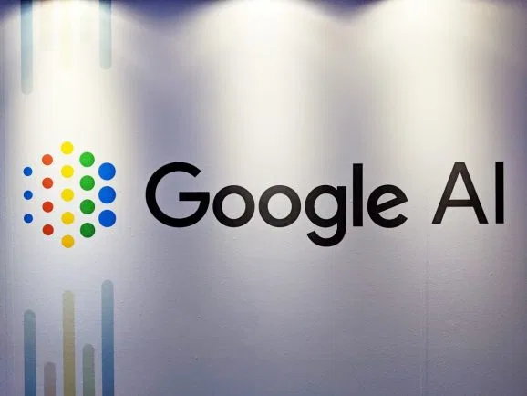
Image Credit: Khari Johnson / VentureBeat

## MOST READ

- [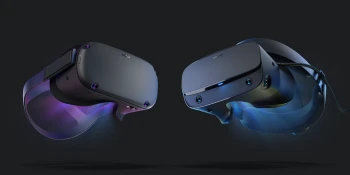](https://venturebeat.com/2019/10/02/the-problem-with-pc-vr-is-the-pc/)

[The problem with PC VR is the PC](https://venturebeat.com/2019/10/02/the-problem-with-pc-vr-is-the-pc/)

## UPCOMING EVENTS

- [BLUEPRINT](https://vbevents.venturebeat.com/events/BlueprintGreenBay)March 3-5, 2020
- [GamesBeat Summit 2020](https://www.gamesbeatsummit.com/)April 28-29, 2020
- [Transform](https://vbtransform.com/)July 15-16, 2020

Researchers from Google AI (formerly Google Research) and Toyota Technological Institute of Chicago have created ALBERT, an AI model that achieves state-of-the-art results that exceed human performance. ALBERT now claims first place on major NLP performance leaderboards for benchmarks like [GLUE](https://gluebenchmark.com/leaderboard/) and [SQuAD 2.0](https://rajpurkar.github.io/SQuAD-explorer/), and high [RACE](http://www.qizhexie.com/data/RACE_leaderboard.html) performance score.

On the Stanford Question Answering Dataset benchmark ([SQUAD](https://rajpurkar.github.io/SQuAD-explorer/)), ALBERT achieves a score of 92.2, on General Language Understanding Evaluation ([GLUE](https://gluebenchmark.com/leaderboard)) benchmark, ALBERT achieves a score of 89.4, and on ReAding Comprehension from English Examinations (RACE) benchmark, ALBERT gets a score of 89.4%.

Recommended videos
Powered by [AnyClip](https://anyclip.com/)

 [           Customer Service Is Changing Rapidly](https://venturebeat.com/2019/09/26/google-ais-albert-claims-top-spot-in-multiple-nlp-performance-benchmarks/)

 [        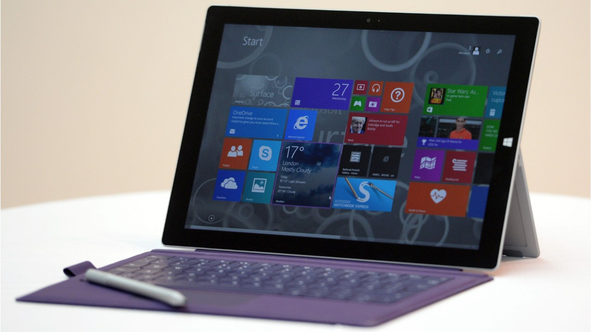   Microsoft Finally Agrees to Replace Surface Pro 4s With Horrible Screen Flickering That Can't Be Patched](https://venturebeat.com/2019/09/26/google-ais-albert-claims-top-spot-in-multiple-nlp-performance-benchmarks/)

 [        Now Playing  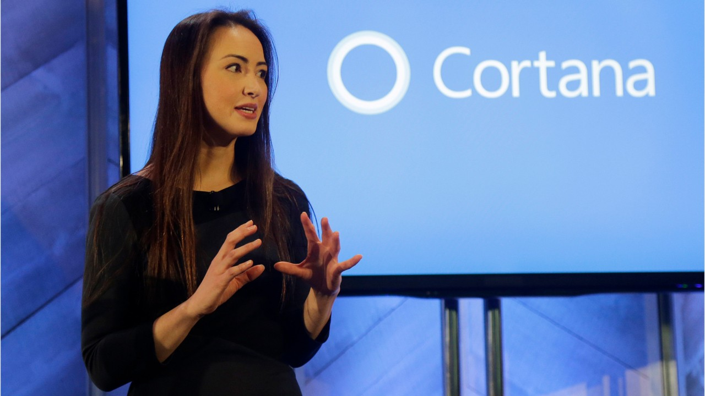   Fix Cortana Security Flaw With PC Update](https://venturebeat.com/2019/09/26/google-ais-albert-claims-top-spot-in-multiple-nlp-performance-benchmarks/)

 [        Up Next  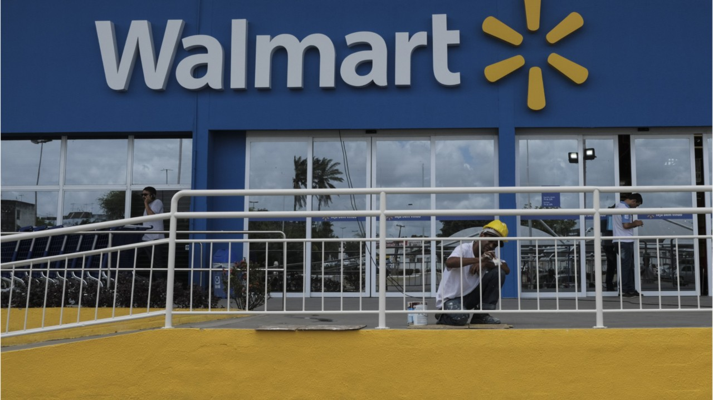   Walmart And Microsoft Partner To Tackle Amazon](https://venturebeat.com/2019/09/26/google-ais-albert-claims-top-spot-in-multiple-nlp-performance-benchmarks/)

 [        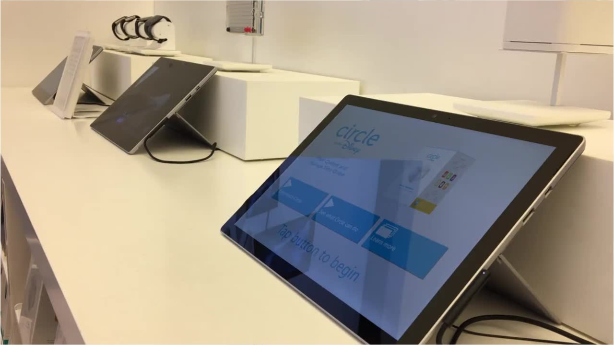   Microsoft Patent Filing Hints At Wireless Charging For Future Surface PCs](https://venturebeat.com/2019/09/26/google-ais-albert-claims-top-spot-in-multiple-nlp-performance-benchmarks/)

 [           Volkswagen partners with Microsoft on connected car platform](https://venturebeat.com/2019/09/26/google-ais-albert-claims-top-spot-in-multiple-nlp-performance-benchmarks/)

 [        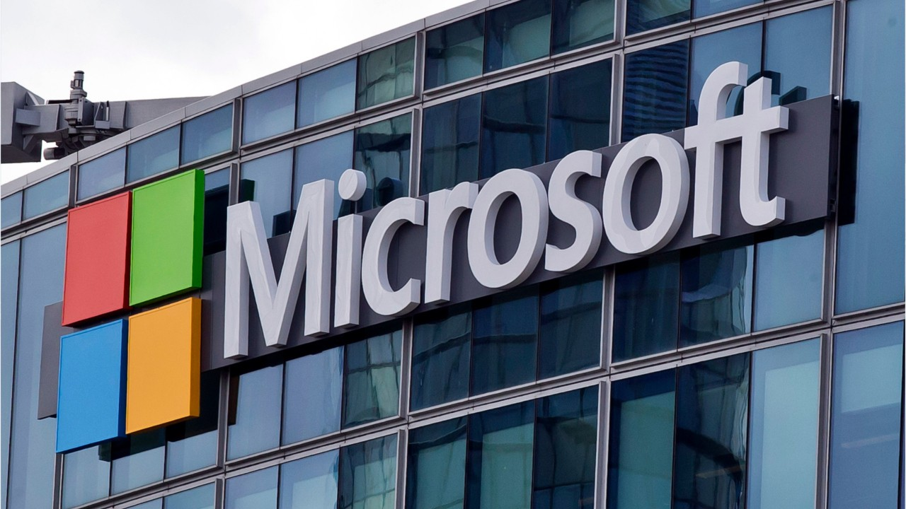   Microsoft's $7.5 Billion GitHub Deal Set For EU Approval](https://venturebeat.com/2019/09/26/google-ais-albert-claims-top-spot-in-multiple-nlp-performance-benchmarks/)

ALBERT is a version of Transformer-based [BERT](https://venturebeat.com/2018/11/02/google-open-sources-bert-a-state-of-the-art-training-technique-for-natural-language-processing/) that “uses parameter reduction techniques to lower memory consumption and increase the training speed of BERT,” according to a paper published on [OpenReview.net Wednesday](https://openreview.net/forum?id=H1eA7AEtvS) and on [arXiv on Thursday](https://arxiv.org/abs/1909.11942). The paper was published [alongside other papers being considered for publication](https://openreview.net/group?id=ICLR.cc/2020/Conference) as part of the International Conference of Learning Representations, which will take place in April 2020 in Addis Ababa, Ethiopia. ICLR will be the [first international AI community conference held in Africa](https://venturebeat.com/2018/11/19/major-ai-conference-is-moving-to-africa-in-2020-due-to-visa-issues/).

“Our proposed methods lead to models that scale much better compared to the original BERT. We also use a self-supervised loss that focuses on modeling inter-sentence coherence, and show it consistently helps downstream tasks with multi-sentence inputs,” the paper reads.

ALBERT is the latest derivative of BERT to claim a top spot in major benchmark tests. In late July, [Facebook AI Research introduced RoBERTa](https://venturebeat.com/2019/07/29/facebook-ais-roberta-improves-googles-bert-pretraining-methods/), a model that achieved state-of-the-art results, and in May, Microsoft AI researchers introduced Multi-Task Deep Neural Network (MT-DNN), a model that achieved top marks in 7 of 9 GLUE benchmarks.

Each of the models achieves performance that outpaces average human performance.

In other Transformer-related news, Hugging Face, a startup whose PyTorch library for easy use of major Transformer models like BERT, [Open AI’s GPT-2](https://venturebeat.com/2019/02/14/openai-let-us-generate-text-with-an-ai-model-that-achieves-state-of-the-art-performance-in-several-nlp-tasks/) and [Google’s XLNet](https://venturebeat.com/2019/06/21/google-brains-xlnet-bests-bert-at-20-nlp-tasks/) today [made that library available for TensorFlow](https://venturebeat.com/2019/09/26/hugging-face-launches-popular-transformers-nlp-library-for-tensorflow/). PyTorch-Transformers has seen more than 500,000 Pip installs since the start of year, Hugging Face CEO Clément Delangue told VentureBeat.

*More to come.*

# Google rolls out AutoML Vision Edge and AutoML Video upgrades

[Kyle Wiggers](https://venturebeat.com/author/kylewiggers/)[@Kyle_L_Wiggers](https://twitter.com/Kyle_L_Wiggers)October 01, 2019 09:44 AM

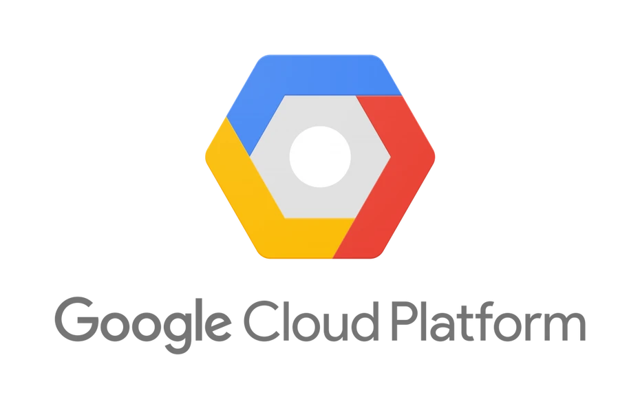
Image Credit: Google

## MOST READ

- 

[The problem with PC VR is the PC](https://venturebeat.com/2019/10/02/the-problem-with-pc-vr-is-the-pc/)

- [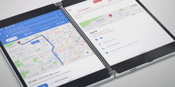](https://venturebeat.com/2019/10/02/everything-microsoft-announced-at-its-2019-surface-event/)

[Everything Microsoft announced at its 2019 Surface event](https://venturebeat.com/2019/10/02/everything-microsoft-announced-at-its-2019-surface-event/)

- [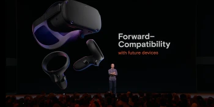](https://venturebeat.com/2019/10/02/oculus-quest-gets-go-apps-passthrough-and-easier-firmware-updates/)

[Oculus Quest gets Go apps, Passthrough+, and easier firmware updates](https://venturebeat.com/2019/10/02/oculus-quest-gets-go-apps-passthrough-and-easier-firmware-updates/)

- [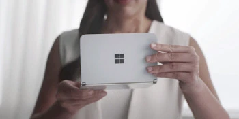](https://venturebeat.com/2019/10/02/microsofts-surface-duo-is-a-foldable-android-phone/)

[Microsoft’s Surface Duo is a foldable Android phone](https://venturebeat.com/2019/10/02/microsofts-surface-duo-is-a-foldable-android-phone/)

## UPCOMING EVENTS

- [BLUEPRINT](https://vbevents.venturebeat.com/events/BlueprintGreenBay)March 3-5, 2020
- [GamesBeat Summit 2020](https://www.gamesbeatsummit.com/)April 28-29, 2020
- [Transform](https://vbtransform.com/)July 15-16, 2020

Roughly a year ago, ahead of the launch of its [ML Kit](https://venturebeat.com/2018/05/08/google-launches-ml-kit-for-android-and-ios-developers/) machine learning tools for Firebase, Google debuted [Cloud AutoML](https://venturebeat.com/2019/04/12/google-cloud-is-using-anthos-and-automl-to-differentiate-itself-from-aws-and-azure/), a cloud platform for creating custom AI models. Since then, the Mountain View company has nearly continually added prebuilt AI models addressing text translation, image classification, and other use cases to its suite’s portfolio. And today, it’s [updating](https://cloud.google.com/blog/products/ai-machine-learning/announcing-updates-to-automl-vision-edge-automl-video-and-video-intelligence-api) a subset of those — [AutoML Vision Edge](https://venturebeat.com/2019/05/07/google-adds-language-translation-object-detection-and-tracking-and-automl-vision-vision-edge-to-ml-kit/) and [AutoML Video](https://venturebeat.com/2019/04/10/google-debuts-automl-video-and-automl-tables-for-structured-data/) — with enhanced capabilities.

Google also this week announced the rollout in beta of [AI-based recommenders](https://cloud.google.com/blog/products/gcp/optimize-your-google-cloud-environment-with-new-ai-based-recommenders) for Google Cloud Platform, which automatically suggest ways to make cloud deployments more secure and cost-effective without compromising performance. As of today, recommenders for Identity and Access Management (IAM) and Compute Engine are available to all Google Cloud customers.

## AutoML Vision Edge

On the AutoML Vision Edge front, Google says that AutoML Vision Edge can now perform object detection as well as image classification on edge devices, including those using Nvidia, Arm, or other chipsets and running operating systems like Android and iOS. One customer — Tryon, an AI-enabled startup specialized in designing and producing augmented reality software for jewelry ecommerce and retail stores — has already tapped it to power an augmented reality shopping experience.

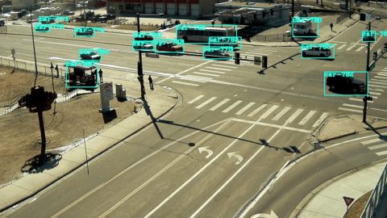

Above: Tracking traffic patterns with the new object recognition capabilities of AutoML Video.

*Image Credit: Google*

In related news, Google says that AutoML Video, a toolset designed to make it easier for businesses to train video-parsing AI models, can now track the movement of multiple items between frames. Furthermore, the latest version of the Video Intelligence API — which boasts pretrained algorithms capable of recognizing a range of objects, places, and actions — can now detect and recognize the logos of over 100,000 popular businesses and organizations in stored and streaming clips, which Google characterizes as a boon for brand safety, ad placement, and sports sponsorship scenarios.

## AI-based recommenders

One of the first of the aforementioned Google Cloud recommenders out of the gate is the IAM Recommender, which detects overly permissive access policies in a given organization and makes adjustments based on the patterns of similar users. Google says the suggestions are generated by analyzing the IAM permissions for each customer individually to create an overall model to recommend more secure IAM policies, taking into account the environment.

As for the other recommender available in beta — the Compute Engine Rightsizing Recommender for VM instances — it analyzes processor and memory utilization over the previous eight days to identify the right machine type for the workload, preventing the provisioning of machines too small or large. Helpfully, its suggestions can be accessed programmatically through an API.

You’ll find both the IAM Recommender and the Compute Engine Rightsizing Recommender in the Cloud Console, from where you can view and optimize the policy bindings. To opt out of suggestions from either, head to the Recommendation section in the Security & Privacy navigation panel from the Cloud Console.