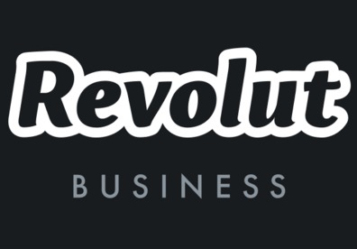
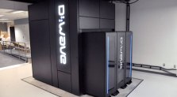

Google Claims 'Quantum Supremacy,' Marking a Major Milestone in Computing

[Tech•](https://fortune.com/section/tech/)[quantum computing](https://fortune.com/tag/quantum-computing/)

# Google Claims ‘Quantum Supremacy,’ Marking a Major Milestone in Computing

By
[Robert Hackett](https://fortune.com/author/robert-hackett/)
September 20, 2019

- 
- 
- 
- 

In what may be a huge milestone in computing, [Google](https://fortune.com/fortune500/alphabet/) says it has achieved "[quantum supremacy](https://fortune.com/2019/09/20/what-is-quantum-supremacy/)," an experimental demonstration of the superiority of a [quantum computer](https://fortune.com/longform/business-quantum-computing/) over a traditional one.

The claim, made in a new scientific paper, is the most serious indication yet that the promise of quantum computers—an emerging but unproven type of machine—is becoming reality, including their potential to solve formerly ungraspable mathematical problems.

Essentially, Google purports to have pulled off a stunt on a quantum computer that no classical machine—not even the world's most powerful supercomputer—can replicate.

 [  [68EDB98B94B34DD5AB65613084358DEE.webp](../_resources/7ac5f71744c302bf60dc1ff77d42a9c5.webp)](https://fortune.com/sponsored?prx_t=XTgFAazo7AoPEQA&ntv_fr)

Paid Content

 [Corporate Responsibilities for Future Generations](https://fortune.com/sponsored?prx_t=XTgFAazo7AoPEQA&ntv_fr)

From [Samsung](https://fortune.com/sponsored?prx_t=XTgFAazo7AoPEQA&ntv_fr)

*Fortune* obtained a copy of Google's paper, which was posted to NASA.gov earlier this week [before being taken down](https://ntrs.nasa.gov/search.jsp?R=20190030475). The *Financial Times*[first reported](https://www.ft.com/content/b9bb4e54-dbc1-11e9-8f9b-77216ebe1f17) the news.

A Google spokesperson declined to confirm the authenticity of the paper and its results. NASA did not respond immediately to a request for comment.

A source at Google familiar with the situation suggested, however, that NASA accidentally published the paper early, before its team's claims could be thoroughly vetted through scientific peer review, a process that could take anywhere from weeks to months.

If the paper holds up under the scrutiny of the scientific community, it will herald a watershed moment in quantum science. Its central claim counters doubt that some unforeseen law of nature may prevent quantum computers from operating as hoped.

"Quantum speedup is achievable in a real-world system and is not precluded by any hidden physical laws," the Google researchers write.

Further, they predict that quantum computing power will "grow at a double exponential rate," besting even the exponential rate that defined Moore's Law, a trend that observed traditional computing power to double roughly every two years.

## The experiment

The experiment described in the paper sampled randomly generated numbers produced through a specialized scenario involving quantum phenomena. The researchers said they determined that their quantum computer beat regular computers at the task, which involved calculating the output of certain specialized circuits.

"While our processor takes about 200 seconds to sample one instance of the quantum circuit 1 million times, a state-of-the-art supercomputer would require approximately 10,000 years to perform the equivalent task," the researchers said.

Google's quantum computer, dubbed "Sycamore," contained 53-qubits, or "quantum bits," a measure of the machine's potential power. The team scaled back from a 72-qubit device, dubbed "Bristlecone," it had previously designed.

The researchers estimate that performing the same experiment on a Google Cloud server would take 50 trillion hours—too long to be feasible. On the quantum processor, it took only 30 seconds, they said.

"Quantum processors based on superconducting qubits can now perform computations...beyond the reach of the fastest classical supercomputers available today," the researchers write. "To our knowledge, this experiment marks the first computation that can only be performed on a quantum processor."

## Outlook

Businesses are hoping the advancement of quantum computers—by tech giants such as Google, [IBM](https://fortune.com/fortune500/ibm-31/), and [Intel](https://fortune.com/fortune500/intel-51/), as well as startups such as Rigetti Computing—will lead to unprecedented scientific and technical breakthroughs in the coming years. They're eyeing applications from new chemical reactions for the development of drugs, fertilizers, and batteries, to the improvement of optimization algorithms and mathematical modeling.

As exciting as Google's result is, other researchers caution against overhyping it, fearing that inflated expectations of imminent advances will lead to a popped bubble.

Dario Gil, head of IBM Research, advises against using quantum supremacy as a metric with which to measure progress in the field. "The experiment and the 'supremacy' term will be misunderstood by nearly all," he told *Fortune*.

Gil described the experiment as a highly special case "laboratory experiment" that has "no practical applications." He added, "Quantum computers will never reign 'supreme' over classical computers, but will rather work in concert with them, since each have their unique strengths."

Jim Clarke, Intel Labs' director of quantum hardware, called Google's update "a notable mile marker." He said that "a commercially viable quantum computer will require" many R&D advancements before becoming a reality.

"While development is still at mile one of this marathon, we strongly believe in the potential of this technology," Clarke added.

The Google team, which first wrote about their goal in a *[Nature](https://www.nature.com/articles/nature23458)*[article two years ago](https://www.nature.com/articles/nature23458), appears to be more hopeful about the short-term prospects of its findings. "As a result of these developments, quantum computing is transitioning from a research topic to a technology that unlocks new computational capabilities," the researchers write.

"We are only one creative algorithm away from valuable near-term applications."

### More must-read stories from *Fortune*:

—The [cheapest mobile plans](https://fortune.com/2019/09/18/cheapest-iphone-11-plans/) for your iPhone 11—The second episode of the [Bill Gates Netflix documentary](https://fortune.com/2019/09/20/bill-gates-netflix-documentary-episode-to-watch/) is the one to watch

—[‘Security’ cameras are dry powder for hackers.](https://fortune.com/2019/09/19/security-cameras-are-dry-powder-for-hackers-heres-why/) Here’s why

—You can now [pay cash when shopping on Amazon.](https://fortune.com/2019/09/19/you-can-now-pay-cash-when-shopping-on-amazon-heres-how/) Here’s how

—[‘Call of Duty: Mobile’](https://fortune.com/2019/09/18/call-of-duty-mobile-october-1-launch-ios-android/) launching Oct. 1*

**Catch up with**  *[*Data Sheet*](https://cloud.newsletters.fortune.com/fortune/nloptin?nl=DATA_SHEET&source=LinkStack)*, Fortune's daily digest on the business of tech.*

Sponsored Video by  

[Investing for income? Find out investment companies’ unique benefits.](https://www.dianomi.com/click.epl?pn=50542&offer=12711300&savid=131955&said=4955&adv=7143&cf=887.14.Fortune&vid=XYeN67vWRzoANB1XJY@YfAAAAAg&click_type_id=11)

[Click to Find Out](https://www.dianomi.com/click.epl?pn=50542&offer=12711300&savid=131955&said=4955&adv=7143&cf=887.14.Fortune&vid=XYeN67vWRzoANB1XJY@YfAAAAAg&click_type_id=11)

Video Ad by 

Sponsored Financial Content

[  Top Trending LSE Penny Stocks That Investors Should Watch in 2019  Kalkine](https://www.dianomi.com/click.epl?pn=47163&offer=12447053&savid=123383&said=4954&adv=7142&cf=887.14.Fortune&unique_id=XYeN6xW@L2JdQPeuNrxGiwAAAA8&smartreferer=https%3A%2F%2Ffortune.com%2F2019%2F09%2F20%2Fgoogle-claims-quantum-supremacy%2F)

[  Producers of Marlboro and Corona Got invested Into Cannabis Stock  CAPEX](https://www.dianomi.com/click.epl?pn=51041&offer=12787354&savid=131683&said=4954&adv=7142&cf=887.14.Fortune&unique_id=XYeN6xW@L2JdQPeuNrxGiwAAAA8&smartreferer=https%3A%2F%2Ffortune.com%2F2019%2F09%2F20%2Fgoogle-claims-quantum-supremacy%2F)

[  The man who bought bitcoin for $12 now says…  Crypto Revolution](https://www.dianomi.com/click.epl?pn=50202&offer=12640672&savid=133104&said=4954&adv=7142&cf=887.14.Fortune&unique_id=XYeN6xW@L2JdQPeuNrxGiwAAAA8&smartreferer=https%3A%2F%2Ffortune.com%2F2019%2F09%2F20%2Fgoogle-claims-quantum-supremacy%2F)

[  How Far Does £1 Million Go in Retirement?  Fisher Investments UK](https://www.dianomi.com/click.epl?pn=39279&offer=10331894&savid=104953&said=4954&adv=7142&cf=887.14.Fortune&unique_id=XYeN6xW@L2JdQPeuNrxGiwAAAA8&smartreferer=https%3A%2F%2Ffortune.com%2F2019%2F09%2F20%2Fgoogle-claims-quantum-supremacy%2F)

[  What does a Boris Brexit mean for the markets?  eToro](https://www.dianomi.com/click.epl?pn=51674&offer=12946553&savid=132891&said=4954&adv=7142&cf=887.14.Fortune&unique_id=XYeN6xW@L2JdQPeuNrxGiwAAAA8&smartreferer=https%3A%2F%2Ffortune.com%2F2019%2F09%2F20%2Fgoogle-claims-quantum-supremacy%2F)

[  Building a business is an adventure - What account should you use?  Revolut Ltd](https://www.dianomi.com/click.epl?pn=49922&offer=12575620&savid=129551&said=4954&adv=7142&cf=887.14.Fortune&unique_id=XYeN6xW@L2JdQPeuNrxGiwAAAA8&smartreferer=https%3A%2F%2Ffortune.com%2F2019%2F09%2F20%2Fgoogle-claims-quantum-supremacy%2F)

[  Essential Guide to Inheritance Tax - Free 7 page Guide  Buckingham Gate FP](https://www.dianomi.com/brochures.epl?pn=4122&offer=3305522&savid=6562&said=4954&adv=7142&cf=887.14.Fortune&unique_id=XYeN6xW@L2JdQPeuNrxGiwAAAA8&smartreferer=https%3A%2F%2Ffortune.com%2F2019%2F09%2F20%2Fgoogle-claims-quantum-supremacy%2F)

[  The role of ESG in an endgame portfolio  Aberdeen Standard Investments](https://www.dianomi.com/brochures.epl?pn=51735&offer=12950578&savid=133059&said=4954&adv=7142&cf=887.14.Fortune&unique_id=XYeN6xW@L2JdQPeuNrxGiwAAAA8&smartreferer=https%3A%2F%2Ffortune.com%2F2019%2F09%2F20%2Fgoogle-claims-quantum-supremacy%2F)

[  Want to Retire Comfortably  Fisher Investments UK](https://www.dianomi.com/click.epl?pn=43731&offer=11371331&savid=115783&said=4954&adv=7142&cf=887.14.Fortune&unique_id=XYeN6xW@L2JdQPeuNrxGiwAAAA8&smartreferer=https%3A%2F%2Ffortune.com%2F2019%2F09%2F20%2Fgoogle-claims-quantum-supremacy%2F)

[  3 ISA Millionaires Reveal Their Secrets  Hargreaves Lansdown](https://www.dianomi.com/click.epl?pn=7610&offer=3473711&savid=130159&said=4954&adv=7142&cf=887.14.Fortune&unique_id=XYeN6xW@L2JdQPeuNrxGiwAAAA8&smartreferer=https%3A%2F%2Ffortune.com%2F2019%2F09%2F20%2Fgoogle-claims-quantum-supremacy%2F)

#### You May Like

- [Paid Content](https://fortune.com/sponsored?prx_t=EjsFAqGY7AnvEQA&ntv_fr)  [ For Manufacturers, Energy Sustainability Is Good for the...](https://fortune.com/sponsored?prx_t=EjsFAqGY7AnvEQA&ntv_fr)  [From Boston Scientific](https://fortune.com/sponsored?prx_t=EjsFAqGY7AnvEQA&ntv_fr)

 [    [E27E0A0BA3014218BC90C2B684FF1517.webp](../_resources/7b2b7193eb229bce0ab9efdb98592fb4.webp)](https://fortune.com/sponsored?prx_t=EjsFAqGY7AnvEQA&ntv_fr)

- [Tech](https://fortune.com/section/tech/)[IBM Opens Quantum Computer Center in Poughkeepsie, N.Y., Home of the Mainframe Computer](https://fortune.com/2019/09/18/ibm-opens-quantum-computer-center-in-poughkeepsie-n-y-home-of-the-mainframe-computer/)

- [Tech](https://fortune.com/section/tech/)[Amazon Prime Boss Named CEO of Google-Backed Quantum Computing Startup](https://fortune.com/2019/05/21/amazon-prime-google-quantum-computing-startup-ceo/)

- [Tech](https://fortune.com/section/tech/)[Microsoft Quantum Algorithm Boosts Medical Imaging](https://fortune.com/2019/07/15/microsoft-quantum-algorithm-boosts-medical-imaging/)

- [Tech](https://fortune.com/section/tech/)[Google and NASA Show Off Blazingly Fast Computer](https://fortune.com/2015/12/08/google-nasa-quantum-computing/)

- [Tech](https://fortune.com/section/tech/)[Microsoft Simulator Brings Quantum Computing One Step Closer to the Masses](https://fortune.com/2015/11/13/microsoft-quantum-computing-simulator/)

### Most Popular Posts

- [Google Claims ‘Quantum Supremacy,’ Marking a Major Milestone in Computing](https://fortune.com/2019/09/20/google-claims-quantum-supremacy/)

[Robert Hackett](https://fortune.com/author/robert-hackett/)

- [With iOS 13 and iPadOS’s Release, These iPhones and iPads Are Now Obsolete](https://fortune.com/2019/09/19/iphone-ipad-obsolete-ios-13-ipados/)

[Lisa Marie Segarra](https://fortune.com/author/lisa-marie-segarra/)

- [Will the Bakkt Launch Help Bitcoin Go Mainstream?](https://fortune.com/2019/09/20/bitcoin-futures-bakkt-launch/)

[Shawn Tully](https://fortune.com/author/shawn-tully/)

- [What Is Quantum Supremacy, and Why Is It Such a Computing Milestone?](https://fortune.com/2019/09/20/what-is-quantum-supremacy/)

[Jeremy Kahn](https://fortune.com/author/jeremy-kahn/)

Sponsored Financial Content

[  How Far Does £1 Million Go in Retirement?  Fisher Investments UK](https://www.dianomi.com/click.epl?pn=39279&offer=10331894&savid=104953&said=4953&adv=7141&unique_id=XYeN6qz4xxhl5sMHNkckjgAAAAM&smartreferer=https%3A%2F%2Ffortune.com%2F2019%2F09%2F20%2Fgoogle-claims-quantum-supremacy%2F)

[  The man who bought bitcoin for $12 now says…  Crypto Revolution](https://www.dianomi.com/click.epl?pn=50202&offer=12640672&savid=133104&said=4953&adv=7141&unique_id=XYeN6qz4xxhl5sMHNkckjgAAAAM&smartreferer=https%3A%2F%2Ffortune.com%2F2019%2F09%2F20%2Fgoogle-claims-quantum-supremacy%2F)

[  Cashflow Driven Investing - A Solution for DB Pensions  Aberdeen Standard Investments](https://www.dianomi.com/brochures.epl?pn=51733&offer=12949980&savid=133057&said=4953&adv=7141&unique_id=XYeN6qz4xxhl5sMHNkckjgAAAAM&smartreferer=https%3A%2F%2Ffortune.com%2F2019%2F09%2F20%2Fgoogle-claims-quantum-supremacy%2F)

[  Has volatility made these 5 blue-chip stocks bargains?  eToro](https://www.dianomi.com/click.epl?pn=47416&offer=12214705&savid=123926&said=4953&adv=7141&unique_id=XYeN6qz4xxhl5sMHNkckjgAAAAM&smartreferer=https%3A%2F%2Ffortune.com%2F2019%2F09%2F20%2Fgoogle-claims-quantum-supremacy%2F)