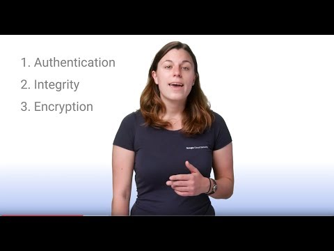

Google Cloud Encryption in Transit - YouTube

Google Cloud Encryption in Transit

https://www.youtube.com/watch?v=Dzju5aALHRQ&list=PLIivdWyY5sqIbgKFiUuYfboTmp0MJ-YWt&index=21

[Google Cloud](https://www.youtube.com/channel/UCJS9pqu9BzkAMNTmzNMNhvg)
1,506 views views
Published on Dec 12, 2017

|     |
| --- |
| [(L)](https://www.youtube.com/watch?v=Dzju5aALHRQ&list=PLIivdWyY5sqIbgKFiUuYfboTmp0MJ-YWt&index=21) |

Description

Watch this video to learn how Google Cloud encrypts data as it moves within and across Google Cloud datacenters. To learn more, read our whitepaper: [https://cloud.google.com/security/enc...](https://www.youtube.com/redirect?q=https%3A%2F%2Fcloud.google.com%2Fsecurity%2Fencryption-in-transit&v=Dzju5aALHRQ&redir_token=qsdIoe_Dc1T_Pmc9HcdlvLXrmdR8MTUxNDMyNzE4OUAxNTE0MjQwNzg5&event=video_description).