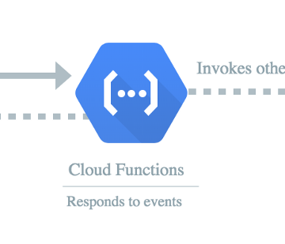

Google Cloud Functions Tutorial Series – Romin Irani’s Blog

Google Cloud Functions Tutorial Series – Romin Irani’s Blog

https://rominirani.com/google-cloud-functions-tutorial-series-f04b2db739cd

This is a tutorial series on Google Cloud Functions, an Event-driven Serverless Compute Platform.