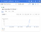
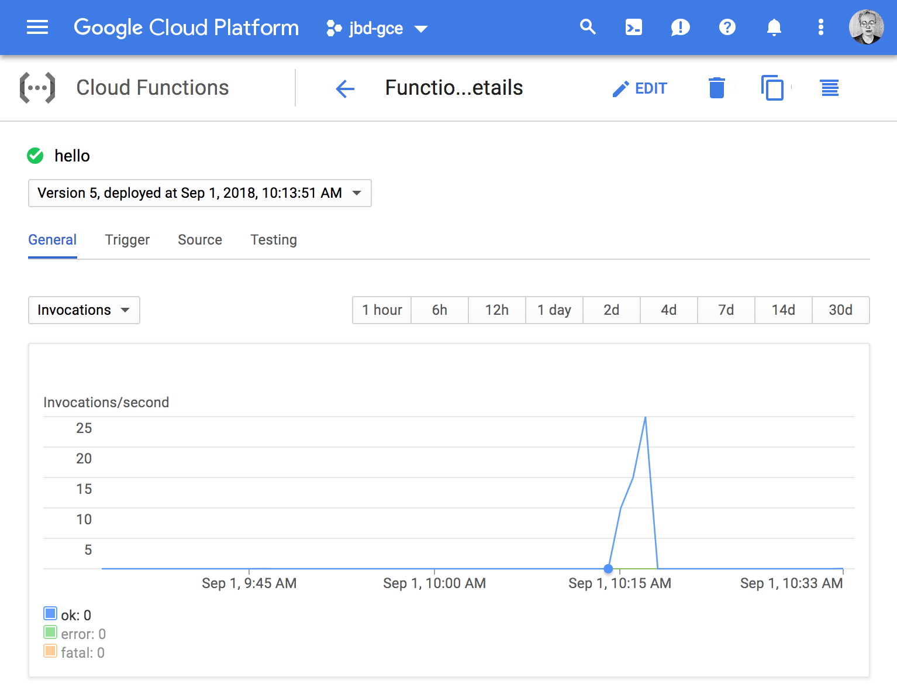
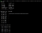
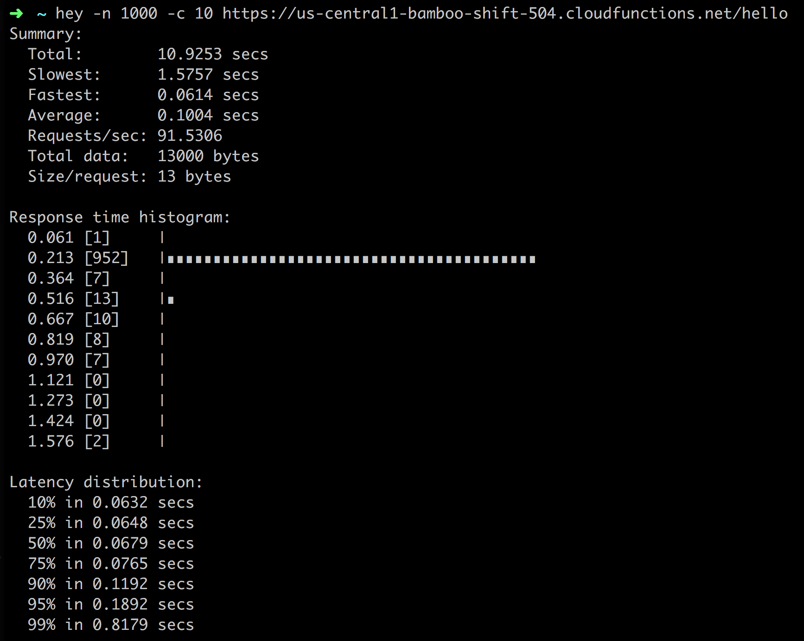

Google Cloud Functions for Go - Google Cloud Platform - Community - Medium

# Google Cloud Functions for Go

[Jaana B. Dogan](https://medium.com/@rakyll?source=post_page-----57e4af9b10da----------------------)

[Sep 1, 2018](https://medium.com/google-cloud/google-cloud-functions-for-go-57e4af9b10da?source=post_page-----57e4af9b10da----------------------) · 4 min read

*In January 2019, Google Cloud Functions finally announced beta support for Go. Check out *[*the official blog post*](https://cloud.google.com/blog/products/application-development/cloud-functions-go-1-11-is-now-a-supported-language)* for more details.*

## Hello World

Let me start with a simple “hello world” to introduce you to the overall build+deploy experience. GCF expects an http.HandlerFunc to be the entry point. Create a package called “hello” and add a trivial handler:

$ cat hello/fn.go
package helloimport (
"fmt"
"net/http"
)func HelloWorld(w http.ResponseWriter, r *http.Request) {
fmt.Fprintf(w, "Hello, World!")
}

In order to deploy, use the following command. It will create a new function called hello and will use HelloWorld as the entry point. The Go runtime to be used will be Go.11.

$ gcloud functions deploy hello --entry-point HelloWorld --runtime go111 --trigger-http

Deploying function (may take a while - up to 2 minutes)...

Deploying may take a while as it is noted. Once deployed, you will be able to see the HTTP endpoints on your terminal. You can also view your functions at the [Cloud Console](https://console.cloud.google.com/functions/list).

On the console, you can see “hello” function is deployed. You can access to logs and basic metrics such as number of invocations, execution time and memory usage.

## Dependencies

If you have external dependencies, go.mod file will be used to get the dependencies. You can also vendor them under the function module. I imported the golang.org/x/sync/errgroup package as an example. See [GCF guideline on dependencies](https://cloud.google.com/functions/docs/concepts/go-runtime#specifying_dependencies) if you need more information.

$ export GO111MODULE=on
$ cd hello
$ go mod init
$ tree
hello
├── fn.go
├── go.mod
├── go.sum
...
The dependency is going to be go-getted when I redeploy the function again.

$ gcloud functions deploy hello --entry-point HelloWorld --runtime go111 --trigger-http

Deploying function (may take a while - up to 2 minutes)...
availableMemoryMb: 256
entryPoint: HelloWorld
httpsTrigger:
url: https://us-central1-bamboo-shift-504.cloudfunctions.net/hello
...

Function is redeployed at https://us-central1-bamboo-shift-504.cloudfunctions.net/hello. See it yourself. You can also call the function from command line:

$ gcloud functions call hello
executionId: x71xpor7tasd
result: Hello, World!

I also generated some load from my laptop to the function to provide you a more realistic response time data. I made 1000 requests, 10 concurrently at a time. You can see that there are some outliers but most calls fall into the 213 milliseconds bucket.

## Code Organization

In Go, we organize packages by [responsibility](https://rakyll.org/style-packages/). This also fits well with serverless design patterns — a function is representing one responsibility. I create a new module for each function, provide function-specific other APIs from the same module.

The main entry point handler is always in **fn.go**, this helps me to quickly find the main handler the way main.go would help me to find the main function.

Common functionality lives in a separate module and vendored on the function package because GCF CLI uploads and deploys only one module at a time. We are thinking about how this situation can be improved but, currently a module should contain all of its dependencies itself.

An example tree is below. Package config contains configuration-related common functionality. It is a module and is imported and vendored by the other functions (hello and user).

$ tree
fns
├── config (commonly used module)
│ ├── config.go
│ ├── go.mod
│ └── go.sum
├── hello
│ ├── fn.go
│ ├── go.mod
│ ├── go.sum
│ └── vendor (contains all dependencies + config)
│ ├── ...
│ └── modules.txt
└── user
├── fn.go
├── go.mod
└── vendor (contains all dependencies + config)
├── ...
└── modules.txt

## Chaining Handlers

Unlike other providers, we decided to go with Go idiomatic handler APIs (func(ResponseWriter, *Request)) as the main entry point. This allows you to utilize existing middlewares available in the Go ecosystem more easily. For example, in the following example, I am using ochttp to automatically create traces for incoming HTTP requests.

package helloimport (
"fmt"
"net/http" "go.opencensus.io/plugin/ochttp"
)func HelloWorld(w http.ResponseWriter, r *http.Request) {
fn := func(w http.ResponseWriter, r *http.Request) {
fmt.Fprintln(w, "Hello world")
}
traced := &ochttp.Handler{
Handler: http.HandlerFunc(fn),
}
traced.ServeHTTP(w, r)
}

For each incoming request, an incoming trace span is created. If you register an exporter, you can upload the traces to [any backend](https://github.com/census-instrumentation/opencensus-go#exporters) we support including Stackdriver Trace of course.