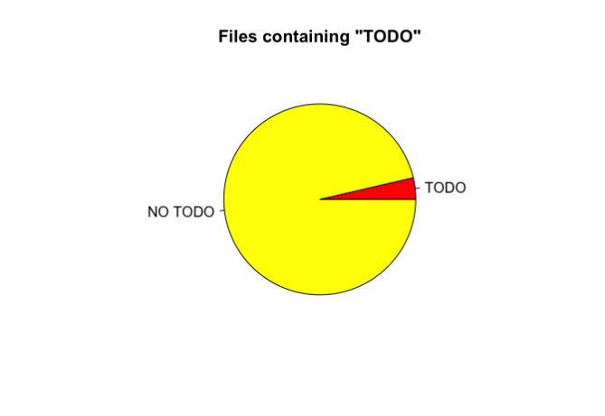
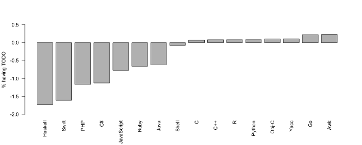
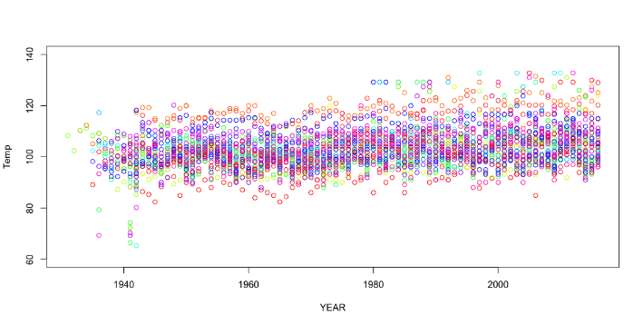
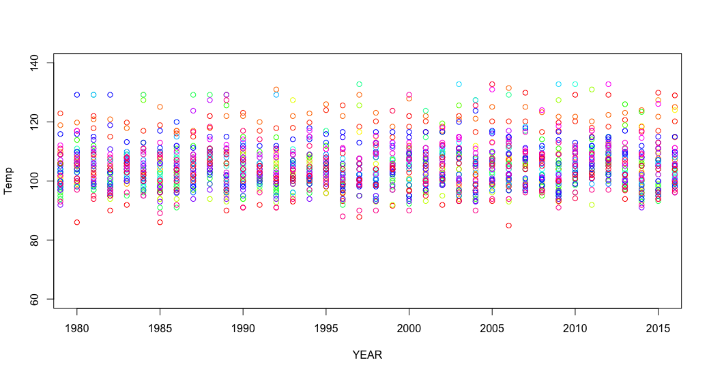
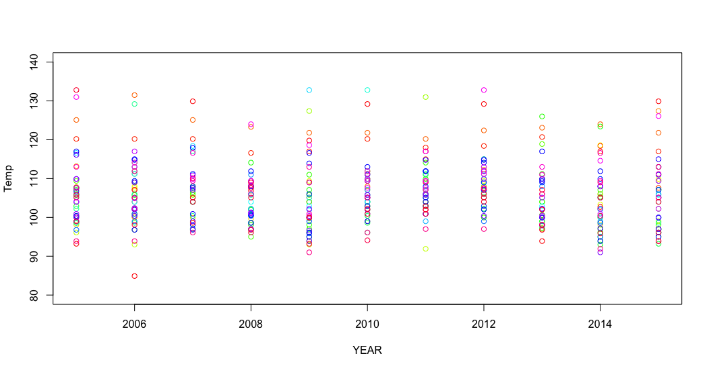

Google Cloud Platform for Data Scientists: Using R with Google BigQuery | Google Cloud Big Data and Machine Learning Blog  |  Google Cloud Platform

 

## [Google Cloud Platform for Data Scientists: Using R with Google BigQuery](https://cloud.google.com/blog/big-data/2017/04/google-cloud-platform-for-data-scientists-using-r-with-google-bigquery.html)

Tuesday, April 4, 2017

*By Gus Class, Developer Programs Engineer, Google Cloud*

**Learn how to connect to a public BigQuery dataset and analyze that data using R. **

In my [previous blog post](https://cloud.google.com/blog/big-data/2017/03/google-cloud-platform-for-data-scientists-using-r-with-google-cloud-sql-for-mysql) covering R-language topics for Google Cloud, I provided a short introduction to R in the context of Google Cloud and discussed accessing [Google Cloud SQL](https://cloud.google.com/sql/) for MySQL from R. Cloud SQL is convenient for sharing access between engineering and analytic teams but it's far from the only tool at the disposal of data scientists and engineering teams working on Google Cloud. For very large data sets, you may experience performance and filesystem limits from SQL that require significant work to scale to the size of your data. In other cases, you may have data warehoused in another data source that's not a native SQL database. For this scale of data or approach to warehousing, [Google BigQuery](https://cloud.google.com/bigquery/) is an ideal choice.

BigQuery allows you to query and manipulate even very large (petabyte-scale) sets of data using a SQL-like syntax. Queries to BigQuery are run against data warehoused on Google as[BigQuery storage](https://cloud.google.com/bigquery/what-is-bigquery#storage) or external datasets stored in formats such as CSV, JSON, or Google Sheets. For additional background on BigQuery, check out the [excellent developer documentation](https://cloud.google.com/bigquery/docs/).

In this post, I’ll describe an example of connecting to a public BigQuery dataset and analyzing that data using R.

### Prerequisites

For the purposes of this post, we'll be using [bigrquery](https://cran.r-project.org/web/packages/bigrquery/index.html), an [open source library for R](https://github.com/rstats-db/bigrquery) created by [Hadley Wickham](https://github.com/hadley). To install the library, run the following command from R:

hdr_strong
install.packages("bigrquery")

Note that we'll be using a feature, `useLegacySql`, that's currently only in the development version of the library, so you should instead install with the following command.

hdr_strong

# install.packages('devtools') devtools::install_github("rstats-db/bigrquery")

You'll also need to have set up a Cloud platform project, enabled billing, and ensured the BigQuery API is enabled as described in the [Cloud BigQuery documentation](https://cloud.google.com/bigquery/quickstart-web-ui). For the purposes of this exercise, you'll need to make note of your project ID from the [Google Cloud Console](https://cloud.google.com/console).

### Basic example using the GitHub public dataset

Let's start with a simple example using the public dataset for GitHub.
The pattern for performing a query is:
1. Import the library.
2. Specify a project ID from the Google Cloud Console.
3. Form your query string.
4. Call `query_exec` with your project ID and query string.

**Note**: The first time that you use the library, you'll need to authorize the application to access Google Cloud services. As documented on [the Authentication section of the bigrquery GitHub page](https://github.com/rstats-db/bigrquery#authentication), you'll follow the prompts within R to open the authorization URL and later copy the authorization code back to R. You'll only need to authorize the library once, requests performed after the first authorized one will refresh access credentials.

The following example selects the count of copies for files containing the string TODO.

hdr_strong

	# install.packages('devtools') devtools::install_github("rstats-db/bigrquery")

	# Use your project ID here
	project <- "your-project-id" # put your project ID here

	# Example query - select copies of files with content containing "TODO"
	sql <- "SELECT SUM(copies)
	FROM `bigquery-public-data.github_repos.sample_contents`
	WHERE NOT binary AND content LIKE '%TODO%'"

	# Execute the query and store the result
	todo_copies <- query_exec(sql, project = project, useLegacySql = FALSE)

Next, let's select the count of copies for files and draw a pie chart showing the ratio of files containing TODO strings:

hdr_strong

	# Example query - select count of copies in the sample contents table
	sql <- "SELECT SUM(copies)
	FROM `bigquery-public-data.github_repos.sample_contents`
	WHERE NOT binary"

	# Execute the query and store the result
	sum_copies <- query_exec(sql, project = project, useLegacySql = FALSE)

	copy_counts <- c(sum_copies[1,1] - todo_copies[1,1], todo_copies[1,1])
	labels <- c("TODO", "NO TODO")
	pie(rev(copy_counts), labels = labels, col=heat.colors(2),
	    main="Files containing \"TODO\"")

	# Store the average for later
	mean_todo <- 100 * todo_copies[1,1] / sum_copies[1,1]

The output plot will look something like the following illustration:

Aside from looking like PacMan, this isn't the most interesting graphic, just a tiny slice of text files within GitHub contain a TODO string. The low frequency of files containing TODO comments indicates we should look at the frequency relative to a mean so that relative observed differences are made more significant.

Next, let's join our query to the language table so we can break down this data by programming language.

hdr_strong

	# install.packages('devtools') devtools::install_github("rstats-db/bigrquery")

	# Use your project ID here
	project <- "your-project-id" # put your project ID here

	# Standard SQL query string for count of copies by language name.
	sql <- 'CREATE TEMPORARY FUNCTION maxBytesLanguage(languages ARRAY>)
	RETURNS STRING LANGUAGE js AS """
	var out = ""
	var maxBytes = 0
	for (var i=0; i < languages.length; i++) {
	var lang = languages[i]
	if (lang.bytes > maxBytes) {
	maxBytes = lang.bytes
	out = lang.name
	}
	}
	return out
	""";

	SELECT SUM(copies) as copies, language_name
	FROM (
	    SELECT
	    sc.copies as copies,
	    maxBytesLanguage(l.language) as language_name
	    FROM `bigquery-public-data.github_repos.sample_contents` as sc
	    JOIN `bigquery-public-data.github_repos.languages` as l
	    ON sc.sample_repo_name = l.repo_name
	    WHERE NOT binary
	)
	WHERE language_name in ("Awk","C", "C++", "C#", "Go", "Haskell", "Java",
	                        "JavaScript", "Objective-C", "PHP", "Python", "R",
	                        "Ruby", "Shell", "Swift", "Yacc")
	GROUP BY language_name
	ORDER BY language_name asc'

	# Standard SQL query string for total count of copies by language name.
	total_copy_counts <- query_exec(sql, project = project, useLegacySql = FALSE)

	# Query string for count of file copies by language name where file contains TODO.
	sql <- 'CREATE TEMPORARY FUNCTION maxBytesLanguage(languages ARRAY>)
	RETURNS STRING LANGUAGE js AS """
	var out = ""
	var maxBytes = 0
	for (var i=0; i < languages.length; i++) {
	var lang = languages[i]
	if (lang.bytes > maxBytes) {
	maxBytes = lang.bytes
	out = lang.name
	}
	}
	return out
	""";

	SELECT SUM(copies) as copies, language_name
	FROM (
	    SELECT
	    sc.copies as copies,
	    maxBytesLanguage(l.language) as language_name
	    FROM `bigquery-public-data.github_repos.sample_contents` as sc
	    JOIN `bigquery-public-data.github_repos.languages` as l
	    ON sc.sample_repo_name = l.repo_name
	    WHERE NOT binary AND content LIKE "%TODO%"
	)
	WHERE language_name in ("Awk","C", "C++", "C#", "Go", "Haskell", "Java",
	                        "JavaScript", "Objective-C", "PHP", "Python", "R",
	                        "Ruby", "Shell", "Swift", "Yacc")
	GROUP BY language_name
	ORDER BY language_name asc'

	# Standard SQL query string for total count of copies by language name.
	total_copy_counts <- query_exec(sql, project = project, useLegacySql = FALSE)

	# Store total copy counts for files by language
	todo_copy_counts <- query_exec(sql, project = project, useLegacySql = FALSE)

	# Calculate the % copies with TODO comments relative to mean from earlier.
	lang_ratios <- c((100 * todo_copy_counts$copies / total_copy_counts$copies) - mean_todo)

	# Manually clean up the Objective-C label
	total_copy_counts$l_language_name[9] <-"Obj-C"

	# Sort
	data <- data.frame(lang_ratios, total_copy_counts$l_language_name)
	data <- data[order(data[1], decreasing=FALSE),]

	# Plot the results
	barplot(data$lang_ratios,
	    names.arg = data$total_copy_counts.l_language_name,
	    ylab="% having TODO", las=2, ylim=c(-2,0.5) )

Now you can see a plot showing the relative frequency of file copies containing "TODO" split out by language.

At a glance, it appears that project file copies with Awk, Go and Yacc language labels are more likely to contain TODO comments than file copies with C#, Swift, PHP or Haskell labels and R contains similar percentages of files with TODO blocks to C and C++. The data doesn't really tell a very compelling story yet but I'll leave diving deeper into observations of language label to the reader.

Now that you've seen the basics, let's take a deeper dive with a more complex example.

### More complex example using NOAA data

Let's take a look at a more complex example using the National Oceanic and Atmospheric Administration (NOAA) Global Surface Summary of the Day (GSOD) database (one of BigQuery’s [public datasets](https://cloud.google.com/bigquery/public-data/noaa-gsod)). This database contains weather measurements over time as captured by NOAA. The data is stored with separate BigQuery tables, so you must dynamically select data from each table and annotate it with the year in order to group the data historically.

Let's query for all of the historical max temperatures by state across the US and plot the data using consistent plot colors for each state. First, you'll need to retrieve and aggregate the data for each year's table. (**Note**: The program will run for a few minutes due to the number of queries and volume of queried data.)

hdr_strong

	# install.packages('devtools') devtools::install_github("rstats-db/bigrquery")

	# Use your project ID here
	project <- "your-project-id" # put your project ID here

	# Create a data frame to store results by year
	year_results <- data.frame(matrix(nrow = 0, ncol = 0))

	for (year in 1931:2016) {
	  sql <- paste("SELECT MAX(max) as HIGH, state, year ",
	    "FROM ",
	    "  ( ",
	    "    SELECT max, ",
	    "      SAFE_CAST(stn as INT64) as istn,",
	    "      SAFE_CAST(wban as INT64) as iwban, year",
	    "    FROM `bigquery-public-data.noaa_gsod.gsod", year,"`",
	    "  ) a ",
	    "JOIN `bigquery-public-data.noaa_gsod.stations` b ",
	    "ON a.istn = b.usaf ",
	    "  AND a.iwban = b.wban ",
	    "WHERE state in (",
	    "  'AL', 'AK', 'AZ', 'AR', 'CA', 'CO', 'CT', 'DE', 'FL', 'GA', 'HI', ",
	    "  'IA', 'ID', 'IL', 'IN', 'KS', 'KY', 'LA', 'MA', 'MD', 'ME', 'MI', ",
	    "  'MN', 'MO', 'MS', 'MT', 'NC', 'ND', 'NE', 'NH', 'NJ', 'NM', 'NV', ",
	    "  'NY', 'OH', 'OK', 'OR', 'PA', 'RI', 'SC', 'SD', 'TN', 'TX', 'UT', ",
	    "  'VA', 'VT', 'WA', 'WI', 'WV', 'WY')",
	    "  AND max < 1000 ",
	    "  AND country = 'US' ",
	    "GROUP BY state, year ",
	    "ORDER BY year desc, state asc",
	    sep = ""
	    )
	  res <- query_exec(sql, project = project, useLegacySql = FALSE)

	  # Store result for this table query in year_results
	  if (nrow(year_results) == 0) {
	    year_results <- res
	  } else {
	    year_results <- rbind(year_results, res)
	  }
	}

Now the `year_results` variable will contain summary data of maximum observed temperatures by year in each state. Let's plot the data.

hdr_strong

	# Create mapping of state name to rainbow color
	colIndex <- c(1:50)
	abbrevs <- c('AL', 'AK', 'AZ', 'AR', 'CA', 'CO', 'CT', 'DE', 'FL', 'GA',
	    'HI', 'IA', 'ID', 'IL', 'IN', 'KS', 'KY', 'LA', 'MA', 'MD', 'ME',
	    'MI', 'MN', 'MO', 'MS', 'MT', 'NC', 'ND', 'NE', 'NH', 'NJ', 'NM',
	    'NV', 'NY', 'OH', 'OK', 'OR', 'PA', 'RI', 'SC', 'SD', 'TN', 'TX',
	    'UT', 'VA', 'VT', 'WA', 'WI', 'WV', 'WY')
	names(colIndex) <- abbrevs

	# Plot data using color defined by state
	plot(year_results$year, year_results$HIGH, xlab="YEAR", ylab="Temp",
	    col=rainbow(50)[colIndex[year_results$state]], ylim=c(60, 140))

The following graph shows the plot with thousands of aggregate data frames showing temperature over time. The outliers in the resulting plot show maximum observed temperature outliers moving from below the clustered temperatures to above them.

Adjusting the plot parameters allows you to slice the plot to various time frames and temperature ranges. For example, the following plot shows the changes between 1980 and the last recorded data in 2015.

hdr_strong

	plot(year_results$year, year_results$HIGH, xlab="YEAR", ylab="Temp",
	    col=rainbow(50)[colIndex[year_results$state]],
	    ylim=c(60, 140), xlim=c(1980, 2015))

In this plot, the maximum observed temperature clustering follows a rising and lowering cycle of maximum observed temperatures. Let's look one more time at the last 10 years of observations.

hdr_strong

	plot(year_results$year, year_results$HIGH, xlab="YEAR", ylab="Temp",
	    col=rainbow(50)[colIndex[year_results$state]],
	    ylim=c(80, 140), xlim=c(2005, 2015))

In the observed data, the cyclical clustering of the maximum temperature is made more prominent. The year 2013 shows tighter clustering of data points, with 2015 and 2005 showing a larger spread. As with previous examples, conclusions should not be reached just from this small framing of the data, but instead should be scrutinized with other correlations between variables.

### Next steps

In this post, you learned how to connect BigQuery to R in order to analyze large sets of data. In practice, data scientists and researchers can use these tools to gather insights on large corpuses of enterprise data for predictions and analytics. When your data set is too large for SQL or you're already warehousing your data in a way that Google can access it, BigQuery can be a powerful tool for complementing your current data warehousing approach.

To learn more:

- Experiment with [Google BigQuery public datasets](https://cloud.google.com/bigquery/public-data/) for your own observations.
- Better yet, [load your own data](https://cloud.google.com/bigquery/loading-data) and query from your R projects using the [legacy SQL](https://cloud.google.com/bigquery/docs/reference/legacy-sql) or [standard SQL](https://cloud.google.com/bigquery/docs/reference/standard-sql/) syntaxes.
- Check out the [language reference for R](https://cran.r-project.org/doc/manuals/R-lang.html) on the CRAN site.

` `