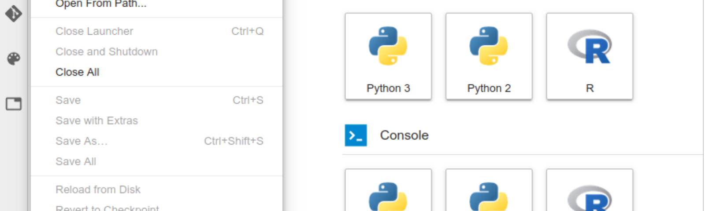
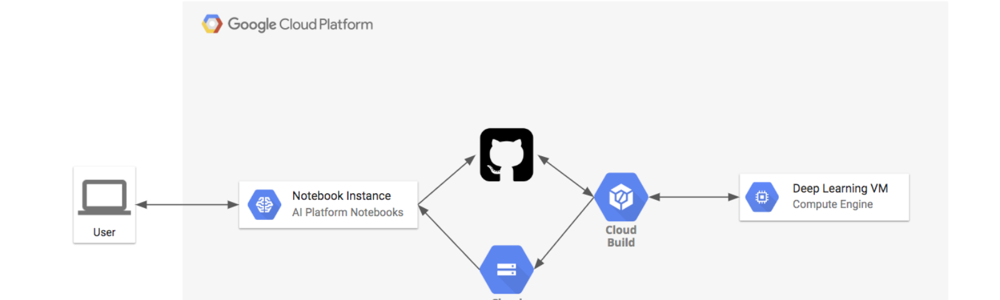
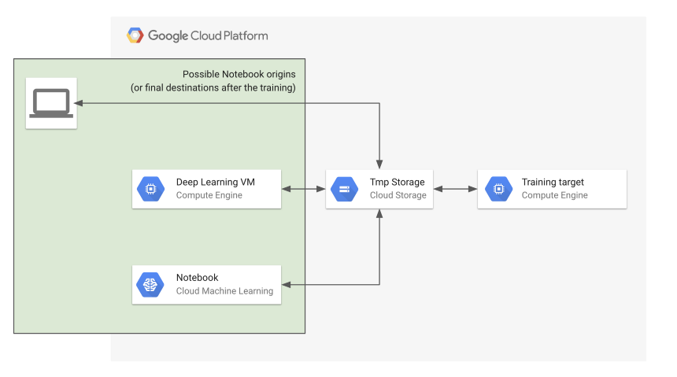
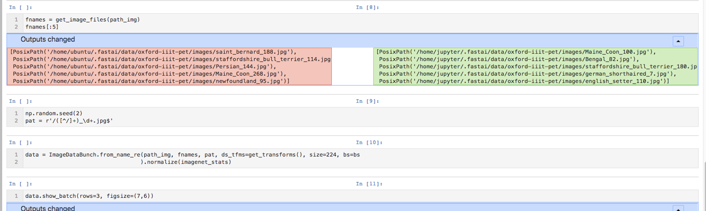

Google Cloud Platform – Deep Learning as I See It

Tagged in

# Google Cloud Platform

[Zain Rizvi](https://blog.kovalevskyi.com/@ZainRzv?source=---------0-----------------------) in [Deep Learning as I See It](https://blog.kovalevskyi.com/?source=---------0-----------------------)

[Aug 4](https://blog.kovalevskyi.com/authenticating-to-bigrquery-on-gcp-ai-platform-notebooks-8128322a4c46?source=---------0-----------------------)·3 min read

[          ### Authenticating to BigRQuery on GCP AI Platform Notebooks  #### When you’re using Jupyter Notebooks with R…](https://blog.kovalevskyi.com/authenticating-to-bigrquery-on-gcp-ai-platform-notebooks-8128322a4c46?source=---------0-----------------------)

[Read more…](https://blog.kovalevskyi.com/authenticating-to-bigrquery-on-gcp-ai-platform-notebooks-8128322a4c46?source=---------0-----------------------)

[Viacheslav Kovalevskyi](https://blog.kovalevskyi.com/@b0noi?source=---------1-----------------------) in [Deep Learning as I See It](https://blog.kovalevskyi.com/?source=---------1-----------------------)

[Jul 27](https://blog.kovalevskyi.com/automating-ai-platform-notebook-instance-creation-with-gcp-deployment-manager-d4f704c786d1?source=---------1-----------------------)·3 min read

[          ### Automating AI Platform Notebook Instance Creation With GCP Deployment Manager](https://blog.kovalevskyi.com/automating-ai-platform-notebook-instance-creation-with-gcp-deployment-manager-d4f704c786d1?source=---------1-----------------------)

[Read more…](https://blog.kovalevskyi.com/automating-ai-platform-notebook-instance-creation-with-gcp-deployment-manager-d4f704c786d1?source=---------1-----------------------)

[Viacheslav Kovalevskyi](https://blog.kovalevskyi.com/@b0noi?source=---------2-----------------------) in [Deep Learning as I See It](https://blog.kovalevskyi.com/?source=---------2-----------------------)

[Jul 20](https://blog.kovalevskyi.com/aiplatform-notebooks-and-vms-auto-shutdown-on-idle-dd94ed3d4724?source=---------2-----------------------)·2 min read

[          ### AIPlatform Notebooks (and VMs) Auto Shutdown On Idle](https://blog.kovalevskyi.com/aiplatform-notebooks-and-vms-auto-shutdown-on-idle-dd94ed3d4724?source=---------2-----------------------)

[Read more…](https://blog.kovalevskyi.com/aiplatform-notebooks-and-vms-auto-shutdown-on-idle-dd94ed3d4724?source=---------2-----------------------)

[Viacheslav Kovalevskyi](https://blog.kovalevskyi.com/@b0noi?source=---------3-----------------------) in [Deep Learning as I See It](https://blog.kovalevskyi.com/?source=---------3-----------------------)

[Jun 4](https://blog.kovalevskyi.com/r-lang-gcp-5f1b76e5c6af?source=---------3-----------------------)·2 min read

[          ### R lang + GCP =   #### In this article we will see how to use R with AI Platform Notebooks. We also will…](https://blog.kovalevskyi.com/r-lang-gcp-5f1b76e5c6af?source=---------3-----------------------)

[Read more…](https://blog.kovalevskyi.com/r-lang-gcp-5f1b76e5c6af?source=---------3-----------------------)

[Viacheslav Kovalevskyi](https://blog.kovalevskyi.com/@b0noi?source=---------4-----------------------) in [Deep Learning as I See It](https://blog.kovalevskyi.com/?source=---------4-----------------------)

[May 3](https://blog.kovalevskyi.com/ai-platform-notebooks-vms-release-m25-18b25f756240?source=---------4-----------------------)·2 min read

[          ### AI Platform Notebooks/VMs Release M25  Recently we have released a big update to the AI Platform (M25). This updated includes many…](https://blog.kovalevskyi.com/ai-platform-notebooks-vms-release-m25-18b25f756240?source=---------4-----------------------)

[Read more…](https://blog.kovalevskyi.com/ai-platform-notebooks-vms-release-m25-18b25f756240?source=---------4-----------------------)

[Viacheslav Kovalevskyi](https://blog.kovalevskyi.com/@b0noi?source=---------5-----------------------) in [Deep Learning as I See It](https://blog.kovalevskyi.com/?source=---------5-----------------------)

[Apr 13](https://blog.kovalevskyi.com/list-of-useful-links-about-ai-platform-notebooks-and-or-deep-learning-vms-31f89e5a3705?source=---------5-----------------------)·2 min read

[          ### List Of Useful Links About AI Platform Notebooks And/Or Deep Learning VMs](https://blog.kovalevskyi.com/list-of-useful-links-about-ai-platform-notebooks-and-or-deep-learning-vms-31f89e5a3705?source=---------5-----------------------)

[Read more…](https://blog.kovalevskyi.com/list-of-useful-links-about-ai-platform-notebooks-and-or-deep-learning-vms-31f89e5a3705?source=---------5-----------------------)

[Viacheslav Kovalevskyi](https://blog.kovalevskyi.com/@b0noi?source=---------6-----------------------) in [Deep Learning as I See It](https://blog.kovalevskyi.com/?source=---------6-----------------------)

[Apr 8](https://blog.kovalevskyi.com/continues-integration-for-your-jupyter-notebooks-on-github-with-gcp-f72af5b08bcd?source=---------6-----------------------)·4 min read

[          ### **Continuous** Integration For Your Jupyter Notebooks On GitHub With GCP](https://blog.kovalevskyi.com/continues-integration-for-your-jupyter-notebooks-on-github-with-gcp-f72af5b08bcd?source=---------6-----------------------)

[Read more…](https://blog.kovalevskyi.com/continues-integration-for-your-jupyter-notebooks-on-github-with-gcp-f72af5b08bcd?source=---------6-----------------------)

[Viacheslav Kovalevskyi](https://blog.kovalevskyi.com/@b0noi?source=---------7-----------------------) in [Deep Learning as I See It](https://blog.kovalevskyi.com/?source=---------7-----------------------)

[Apr 6](https://blog.kovalevskyi.com/gcp-notebook-executor-v0-1-2-8e37abd6fae1?source=---------7-----------------------)·3 min read

[    ### GCP Notebook Executor v0.1.2          Do you ever wanted to submit a notebook for 2-day training and forget about it till after it has been…](https://blog.kovalevskyi.com/gcp-notebook-executor-v0-1-2-8e37abd6fae1?source=---------7-----------------------)

[Read more…](https://blog.kovalevskyi.com/gcp-notebook-executor-v0-1-2-8e37abd6fae1?source=---------7-----------------------)

[Viacheslav Kovalevskyi](https://blog.kovalevskyi.com/@b0noi?source=---------8-----------------------) in [Deep Learning as I See It](https://blog.kovalevskyi.com/?source=---------8-----------------------)

[Mar 5](https://blog.kovalevskyi.com/deeplearning-images-revision-m21-8f9830d61de5?source=---------8-----------------------)·3 min read

[          ### DeepLearning Images Revision M21. TensorFlow 1.13 and better git integration with Notebooks!](https://blog.kovalevskyi.com/deeplearning-images-revision-m21-8f9830d61de5?source=---------8-----------------------)

[Read more…](https://blog.kovalevskyi.com/deeplearning-images-revision-m21-8f9830d61de5?source=---------8-----------------------)

[1 response](https://blog.kovalevskyi.com/deeplearning-images-revision-m21-8f9830d61de5?source=---------8-----------------------#--responses)

[Viacheslav Kovalevskyi](https://blog.kovalevskyi.com/@b0noi?source=---------9-----------------------) in [Deep Learning as I See It](https://blog.kovalevskyi.com/?source=---------9-----------------------)

[Feb 16](https://blog.kovalevskyi.com/jupyter-notebooks-development-manifesto-88a1ddb24581?source=---------9-----------------------)·3 min read

[          ### Jupyter Notebooks Development Manifesto  #### Jupyter Notebook is a relatively young tool, it does not yet…](https://blog.kovalevskyi.com/jupyter-notebooks-development-manifesto-88a1ddb24581?source=---------9-----------------------)

[Read more…](https://blog.kovalevskyi.com/jupyter-notebooks-development-manifesto-88a1ddb24581?source=---------9-----------------------)