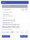
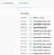
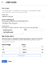
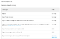
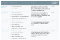
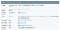
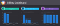

Google Cloud Platform — Factors to control and understand your costs

# Google Cloud Platform — Factors to control and understand your costs

This blog post provides general guidelines to help understand various factors that you should take into consideration while trying to understand your monthly cloud bill.

This is a guide for beginners to start thinking in terms of costs and making informed decisions to keep costs in control, especially during development. The goal is to make developers think from a financial point of view too and not just assume that they have nothing to do with it.

This is by no means a complete guide but a general direction to make you aware of these recommendations/suggestions. I might be wrong on a few points too since cloud billing can get fairly complex and would appreciate you pointing it out in the comments, it will help me better inform readers.

*> Best practice is still to regularly analyze your monthly cloud bills and take actions based on that.*

In no order of preference, here are some points to consider:

### Free Trial

Google Cloud Platform comes along with a generous [Free Trial](https://console.cloud.google.com/billing/freetrial) when you sign up. This has been repeated often enough so I want to go into the details here. In summary, when you sign up with your credit card, you get $300 and 12 months to try it, whichever is consumed earlier. This is good enough to try out the cloud and if you are looking to understand what you could do with $300 of the credit, I have written an article earlier on the same : [You have $700 GCP Credit — Now What?](https://rominirani.com/you-have-700-gcp-credit-now-what-9a0defd8f6b9) . Most of it should it apply.

One thing to note here — Your credit card will not be charged if you say exhaust your $300 credit. You will be notified of the same first. ***This is the #1 question that I get asked from folks who want to try out Google Cloud Platform. See the 3rd point in the right infobar below, when you go to the Free Trial page.***

### Free Tiers

This is a top feature on Google Cloud Platform and available on other cloud platforms too. A free tier actually means “[**an always free tier**](https://cloud.google.com/free/)” and what that means in practical terms is that you are given a little bit of most services and if you are within those limits, you will not be charged anything.

The above screenshot is just a few of the services and the free tier capabilities. For e.g. you get a Google Compute Engine instance for free (f1-micro instance) and so on.

The best part of the free tier is that they provide you as an individual developer, just about enough services that will help you try out things and even run things for the while. The key thing to understand here is that the free tier is baked into the monthly costs and hence all charges will be for resources that you utilized above the free tier limits.

Do note that some services might **not be available** at all in the ***Free tier***

Study these in detail and chances are you are good for a long time:

- GCP Free Tier : https://cloud.google.com/free/

Remember that the Free tier do not come with any SLAs and that is to be expected. Also this offer could be withdrawn at any time but given the dynamics and competition between the Cloud providers to bring new customers to the platform, this is likely to stay in some form or the other.

### Use GCP Cost Calculator

Get familiar with the [Cost Calculator](https://cloud.google.com/products/calculator/) provided by GCP. This should be your first step to understand what it is going to cost you. Again, the cloud is all about elasticity and the fact that you might end up using more than one service or two, while you are trying out things, which is fine.

The whole idea of the cost calculator is to give you a sense of what it will be cost you. Try your best to fill in some values. One of the things that you should immediately notice is which services end up costing more, which Virtual Machine configurations end up being costly and so on.

#### **Total Cost of Ownership**

If you are migrating your workloads to the cloud, it is recommended that you use the Total Cost of Ownership, which is a much more accurate measure of the savings that you might incur, if you were to manage the workloads on your own.

If you would like a JSON file of the current prices, take a look [here](https://cloudpricingcalculator.appspot.com/static/data/pricelist.json).

### Setup/Shutdown/Destroy Scripts

It is recommended that you have setup/shutdown/destroy scripts for all the resources that you create. You can script this out using the [**gcloud**](https://cloud.google.com/sdk/gcloud/), which is a command-line interface to Google Cloud Platform. Via gcloud commands, you can manage most resources and it is recommended that you have scripts to start and stop these services.

Image Reference : https://www.specialtystoreservices.com/ProductImages/4164.jpg

The reason for this is simple and it applies especially to compute resources. One of the costs is how much time you keep these resources in an Active State. For e.g. if you provision a Compute Engine instance and you leave it in the RUNNING state, then you are being charged for it. So the general guideline is that during development or in general, you should optimize and keep the resources in STOPPED state if you are not using them. This is not just from a cost point of view but also you will prevent them for potentially being misused too.

The best way is to be a bit disciplined from the start and have the scripts ready to execute and get into the habit of running the startup / shutdown scripts as needed.

> Google Cloud Platform have introduced pricing innovations like > [> Sustained Use Discounts](https://cloud.google.com/compute/docs/sustained-use-discounts)> , where an automatic discount is applied if you commit to using the resources for longer period. For e.g. you would get a 30% discount if you use a Compute Engine instance for a period of 30 days. You could possibly look at these options too as you move along and be aware that the more you use , you will be given the discount automatically.

Do take a look at the Google Cloud Console Dashboard too. Click on the **Activity **tab to see what is going on in the project too. A sample snapshot from my console is shown below:

### Storage Space Allocation

You are charged for the storage space that you allocate and not for the space that you have used. So if you have allocated a 100GB drive, you will be charged for that and not for the 10GB space that you are using out of it.

Storage is cheap and prices continue to fall but multiply that by hundreds of storage drives and the cost could end up quickly. Do keep in mind that at times, you might to allocate much more storage space than you actually need due to the fact that certain compute configurations and IOPS requirements might demand a bigger storage drive for better performance.

#### SSD is expensive

As a thumb rule, SSDs are much more expensive and you should keep that factor in mind, unless you are clear on the performance requirements of your applications.

For e.g. here is the pricing on Persistent disks (Standard and SSD) in the Northern Virginia region:

### Identify Expensive Resources

One of the things to pay attention to is to identify resources that are expensive.

Image Credit : http://img.izismile.com/img/img10/20170424/640/most_expensive_materials_in_the_world_640_02.jpg

One way to learn is to play with the cost calculator and see the itemized cost that is provided to you. Identify resources that you will be charged for even if you do not use them. For e.g. consider a Load Balancer. A typical charge for the Load Balancer depends on the number of rules that you set and also the traffic moving in and out across to the different VMs that you have put behind the load balancer. This could easily go into several dollars a month, even if you do not put it to use. So be careful while assigning such resources, review your rules, where the VMs are and more.

For e.g. take a look at the pricing example given here: https://cloud.google.com/compute/pricing#lb

### Setup Budgets

This is a very important feature and can go a long way in ensuring that you remain friends with your manager and finance team. Google Cloud Platform allows you to set up Budgets and Alerts for your project.

Image Credit : https://www.ncmic.com/webres/Image/learning-center/money-credit/money-management/Budgets.jpg

You can set a monthly spending limit, which will help keep the costs under control and also protect you from any unexpected surge in traffic and even a possible misuse/external attack. Check out the [documentation](https://cloud.google.com/billing/docs/how-to/budgets) that details how you can set up a Budget. It is easily accessible from the Google Cloud Console via **Billing → Budgets and Alerts**.

But before you set some arbitrary monthly limit, get a sense of a few days of usage and what it is costing and then set the right limits. If you run out of these limits, one should expect the services to fail.

#### Billing Alerts

Along with a budget, you should also setup Billing Alerts. Billing Alerts will notify you if you reach a certain percentage of your spending limit. This can help alert you before things could get out of control. So definitely setup Billing Alerts.

A sample screenshot is shown below. Notice that you can set the Budget amount to be either a specific amount or limiting it to last month’s spend.

### Understand Ingress / Egress

This is a difficult metric to track but the point here is that you need to understand the traffic flowing into your resources and out of them.

Google Cloud Platform does not charge for Ingress but puts a charge for Egress i.e. traffic flowing out of their infrastructure. Again it depends if you are talking to a service with the same region, different region, outside of Google infrastructure, same zone, different zone and so on.

For e.g. if you make an API call from your instances hosted in Cloud A to another Cloud Providers infrastructure, you are going to be charged for the Egress. Also be cognizant of the fact that you have different services of GCP that talk to each other but are provisioned in different zones/regions.

Here is the Network pricing table for Compute Engine at the time of writing this article and it should give you a good idea of different combinations. It is not the easiest of things to predict and a lot depends on how well you understand the different services and the interactions between them in your application.

Try to come up with a rough number for the Egress but this is best judged once you have a few billing cycles in place and can see what the data is looking at. Always provision for a bit more when estimating the cost.

### Auto-scaling : Boon or Bane?

One of the best features of the cloud is elasticity. Cloud providers have gone to great extents to help your application scale without you taking the trouble of managing the compute that needs to be provisioned on the fly to meet your application demand.

If you see a checkbox or two, that allows you to auto-scale, keep in mind that it means that Google is provisioning additional resources for you and you will be charged for that. As the demand goes down, it will scale things down too. But you need to understand and consider this factor.

You will have to make a decision if you would like to manually reserve a fixed number of instances or let the cloud provider auto-scale. There is a cost opportunity to everything.

### Pricing by Zone/Region

Google Cloud Platform services are available across several regions. Pricing is not the same across regions. You might be able to bring down your costs by considering a region that is cheaper for that particular service. But do keep in mind that you ideally want your services to be as close as possible to your customers and latency does kick in, which could hamper the user experience. So consider cost v/s latency when choosing which regions to host your services.

Additionally, there are some services that are global, multi-region or just zonal. Take some time to understand that and the costs that could kick in.

### Storage Classes

One of the most popular services on Google Cloud Platform is [Google Cloud Storage](https://cloud.google.com/storage/), a globally available object store. Google Cloud Platform has a class for a Storage bucket, the container in which you store your objects.

The classes at a high level, differentiate across each other via things like how frequently you may want to access the data stored in the buckets and also the latency to access the data. If you are ok with the latency and your needs for frequency of accessing that data is low, you could opt for different storage class, which can definitely reduce the cost by a large extent.

Take a look at this table with different classes for the buckets and how it can affect costs.

Image Reference : https://cloud.google.com/storage/docs/storage-classes

For e.g. if you are looking at storing data for archival purpose, log files that you might access later, etc — your best options could be Nearline Storage and you could cut your cost by half. Just look at the price column in the table above and understand the various Use Cases that are best served by the respective Storage classes.

### Hidden Costs

I would not like to label this section as hidden costs but it usually surprises anyone the first time. It typically applies to services where you think you are paying for just querying the data but you often overlook that to save your data, the cloud provider has to end up using cloud storage and hence will have to charge you for the storage costs too.

For e.g. consider a service that allows you to do streaming inserts of data, stores the data for you and allows you to query that data too. What does that mean in terms of cost. Well, there could be multiple things and which at a high level could be:

1. Incoming Traffic cost
2. Outgoing Traffic cost
3. Number of Requests
4. Storage space required

5. Compute instances assigned to fulfill that request or a price factored in for that

Let us consider BigQuery pricing as shown below:

Image Credit : https://cloud.google.com/bigquery/pricing

Hope you get the gist of what this means and why you are being charged for the different operations that helps Google deliver the BigQuery service to you. Google Cloud Platform is transparent by explaining to you the different costs and states that explicitly.

Paying attention to these factors will help you retain your sanity when you are faced with an itemized bill that does not make too much sense in terms of additional costs for using a particular service.

### Managed Services

Managed Services are great for everyone but they come with an additional cost, which is well worth it but it is something that you need to look at. For e.g. consider the Managed Cloud SQL service that is provided. Google Cloud Platform takes care of the maintenance, patches and a lot more while all you need to do is specify the configuration, click a button and you have a Database Service abstracted and running for you.

However, if you have the operations chops, you could provision a Compute Engine instance, install MySQL on it, expose a few ports, setup incoming network restrictions and get going too. The latter will be cheaper compared to the fully managed service that is provided.

During development phase, you might not have a need for Automatic Backup, Failover and Replica features that are provided as part of the Cloud SQL offering .

On the flip side, certain Managed Services will definitely help you save costs especially those in the Big Data services provided on Google Cloud Platform. For e.g. setting up and running your own Hadoop / Spark cluster is going to be both time consuming and difficult to manage and limit costs. On the other hand with a service like [Dataproc](https://cloud.google.com/dataproc/), you could focus on running your jobs and spin up and tear down the Hadoop cluster with ease, thereby just charging you for the resources used for that period of time that you kept things running.

### Billing Data Export

Google Cloud Platform provides an API for accessing your Billing data and optionally exporting this information into other tools for Analysis. It would definitely help to consider this if you are having a system in production and need to continuously monitor costs.

Check out the [Getting Started guide with the Billing API](https://cloud.google.com/billing/v1/getting-started). The Billing API provides multiple operations that include getting information on your billing accounts, projects under that, billing data for your project and more.

It is also advisable to setup a Dashboard where you can visualize your running costs. Check out the guide to [Visualize Spend over time with Data Studio](https://cloud.google.com/billing/docs/how-to/visualize-data), an interesting approach to exporting your Billing Data over to BigQuery and then visualizing that data via [Data Studio](https://datastudio.google.com/u/0/).

### Summary

We have just touched upon a few high level points that you should look at to better understand and control costs on Google Cloud Platform. This is just a start and for each service, you should ideally be spending time in the Pricing section to understand it better.