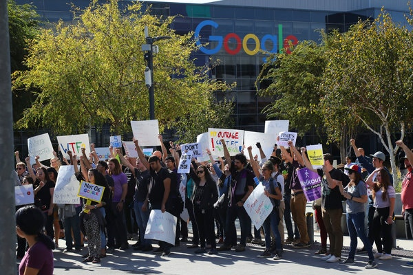

Google Hires Firm Known for Anti-Union Efforts - The New York Times

# Google Hires Firm Known for Anti-Union EffortsGoogle Hires Firm Known for Anti-Union Efforts

After nearly two years of unrest, the company appears to be cracking down on employee activism.

Google employees walked out at the company’s headquarters in Mountain View, Calif., in November 2018 to protest how it handled sexual harassment complaints.Credit...Jim Wilson/The New York Times

By [Noam Scheiber](https://www.nytimes.com/by/noam-scheiber) and [Daisuke Wakabayashi](https://www.nytimes.com/by/daisuke-wakabayashi)

- Nov. 20, 2019, 2:51 p.m. ET

-

    - 
    - 
    - 

    -
    -
    -

Google has hired an anti-union consulting firm to advise management as it deals with widespread worker unrest, including accusations that it has [retaliated against organizers](https://www.nytimes.com/2019/04/22/technology/google-walkout-employees-retaliation.html?module=inline) of a [global walkout](https://www.nytimes.com/2018/11/01/technology/google-walkout-sexual-harassment.html?module=inline) and [cracked down on dissent](https://www.bloomberg.com/news/articles/2019-10-23/google-accused-of-creating-spy-tool-to-squelch-worker-dissent) inside the company.

The firm, called [IRI Consultants](https://iriconsultants.com/), appears to work frequently for hospitals and other health care organizations. Its website [advertises “union vulnerability assessments”](https://iriconsultants.com/iri-product-solutions/#toggle-id-2) and [boasts about IRI’s success](https://iriconsultants.com/portfolio-item/labor-campaigns/) in helping a large national health care company persuade employees to avoid a union election despite the unions’ “dedicating millions of dollars to their organizing campaigns.”

Google’s work with IRI is the latest evidence of escalation in a feud between a group of activist workers at Google and management that has tested the limits of the company’s traditionally transparent, worker-friendly culture. Since Google was founded two decades ago, employees had been able to ask management tough questions at weekly meetings, and anyone who worked there could look through documents related to almost any company activity.

That Google hired a consulting firm known for its anti-union work is a surprising turn in Silicon Valley. Union organization — even labor unrest — has traditionally been rare among big tech companies because their employees have usually been treated and paid well. Google, in particular, has been known for its perks, like free meals and shuttle buses to the office.

Advertisement

[Continue reading the main story](https://www.nytimes.com/2019/11/20/technology/Google-union-consultant.html#after-story-ad-1)

There does not appear to be any serious effort underway at Google to create a formally certified union, but employers sometimes bring in firms like IRI to pre-empt unionization amid widespread discontent among workers.

Last fall, Google employees around the world walked out to protest the company’s handling of sexual harassment complaints. And discussions on the company’s internal message boards have at times turned into contentious debates about politics or company policies that [have become public embarrassments.](https://www.nytimes.com/2017/08/07/business/google-women-engineer-fired-memo.html?module=inline)

- The perfect gift for everyone on your list.

[Gift subscriptions to The New York Times. Starting at £20.](https://www.nytimes.com/subscription/gift?campaignId=9L998)

Google recently cracked down on some of those discussions and limited how much employees can peer into the work of others. Last week, Sundar Pichai, Google’s chief executive, announced that Google was making its free-flowing weekly all-hands meetings — a hallmark of its open culture — into [monthly affairs with restrictions](https://www.theverge.com/2019/11/15/20966718/google-weekly-all-hands-tgif-staff-meeting-changes-ceo-sundar-pichai) on what can be discussed.

Google employees stumbled upon the company’s relationship with IRI in October, according to two employees familiar with the discovery who spoke on the condition of anonymity because of the fear of retaliation. They unearthed internal calendar entries indicating that Google had hired IRI, according to screenshots shared with The New York Times.

Chloe Cooper, a Google spokeswoman, said the company engages “dozens of outside firms to provide us with their advice on a wide range of topics.” IRI did not respond to repeated requests for comment.

Advertisement

[Continue reading the main story](https://www.nytimes.com/2019/11/20/technology/Google-union-consultant.html#after-story-ad-2)

At the time of the discovery, Google had recently installed a tool on employees’ web browsers that would flag internal calendar events requiring more than 10 meeting rooms or 100 participants.

Many employees believed that the so-called browser extension, which was first reported [by Bloomberg](https://www.bloomberg.com/news/articles/2019-10-23/google-accused-of-creating-spy-tool-to-squelch-worker-dissent), was a surveillance tool designed to crack down on organizing among workers. The company said at the time that it simply wanted to reduce internal spam and that the tool does not collect personally identifiable information.

To learn more about the extension and a calendar policy change that the tool would reinforce, employees began to search the calendar of the Google human resources official who had requested the policy change, according to the two employees knowledgeable about the situation.

While searching that official’s calendar, which was open to other Google employees at the time, these employees discovered that she had been part of a group of Google human resources, legal and communications officials who for months had been invited to meetings with officials from IRI, according to the two employees.

They noticed that the group had a meeting scheduled only a few hours before the human resources official requested the change in calendar policy. The Times obtained screenshots of portions of the official’s calendar and two posts on an internal ticketing system discussing the change.

Asked whether IRI advised the company on these matters, Ms. Cooper, the Google spokeswoman, said that “to suggest this particular firm had anything whatsoever to do with the recent calendar extension — or any internal policies whatsoever — is absolutely false.”

Google employees have chafed for months at what they said was a series of moves by management designed to make it harder for them to confront the company, whether it was over government contracts they objected to, or policies like its handling of sexual harassment, the issue that triggered last year’s walkout.

Advertisement

[Continue reading the main story](https://www.nytimes.com/2019/11/20/technology/Google-union-consultant.html#after-story-ad-3)

In August, the company handed down new “[community guideline](https://about.google/community-guidelines/)s” that prohibited employees from insulting one another on internal forums and “disrupting the workday to have a raging debate over politics or the latest news story.” Many employees saw it as a way to stifle the internal debate that had long defined the company.

Then, earlier this month, two Google employees were [placed on administrative leave](https://www.bloomberg.com/news/articles/2019-11-12/one-google-staffer-fired-two-others-put-on-leave-amid-tensions) over possible violations of company rules. According to a memo circulated internally and [obtained by CNBC](https://www.cnbc.com/2019/11/19/google-employees-protested-security-team-interrogation-memo-says.html), some employees believed the administrative leave was a form of retaliation because the two suspended workers had engaged in activism at the company.

Google said one of the employees had searched for, gained access to and shared sensitive documents, though other employees have questioned the documents’ sensitivity. The company said the second suspended employee had set up email alerts to track the calendars of several Google officials, which made them feel unsafe, but did not say that setting up such alerts broke company rules.

Mr. Pichai’s announcement about the staff meetings came on the heels of a particularly contentious meeting last month when employees challenged management about the browser extension and the hiring of a former Department of Homeland Security official, [who had defended](https://www.buzzfeednews.com/article/ryanmac/google-miles-taylor-dhs-muslim-travel-ban-nielsen) a version of the White House’s [ban on travel](https://www.nytimes.com/2018/06/26/us/politics/supreme-court-trump-travel-ban.html?module=inline) from several mostly Muslim countries.

In leaked audio of the meeting, [reported earlier](https://www.washingtonpost.com/technology/2019/10/25/google-ceo-leaked-video-says-company-is-genuinely-struggling-with-employee-trust/) by The Washington Post, Mr. Pichai said that Google was struggling with how to adapt the principles of openness to a global behemoth with more than 100,000 employees and a roughly equivalent number of contractors.

Last month, Google management in Zurich [caused an uproar](https://www.vox.com/recode/2019/10/21/20924697/google-unionization-switzerland-zurich-syndicom-zooglers) when it tried to cancel an employee discussion about unionization and proposed its own discussion about labor laws and employee rights. In September, a small group of contractors who work for Google voted to unionize with the United Steelworkers.

Some Google employees oppose their colleagues’ organizing efforts and believe that Mr. Pichai hasn’t gone far enough in reining in the chaos that they say the organizers have created. And most Google employees, even those active in efforts to organize co-workers, [appear to be skeptical](https://www.nytimes.com/2019/10/10/business/economy/labor-book.html?module=inline) of trying to create a formally certified union.

Advertisement

[Continue reading the main story](https://www.nytimes.com/2019/11/20/technology/Google-union-consultant.html#after-story-ad-4)

Still, many appear to favor creating some kind of worker organization, and thousands continue to engage in collective action, like [signing a petition in August](https://medium.com/@no.gcp.for.cbp/google-must-stand-against-human-rights-abuses-nogcpforcbp-88c60e1fc35e) urging the company not to enter a forthcoming competition for a contract with the U.S. Customs and Border Protection agency, which it had [indicated an interest in pursuing](https://www.businessinsider.com/us-customs-border-protection-testing-google-cloud-anthos-2019-8).

Meredith Whittaker, a walkout organizer who [left the company](https://medium.com/@GoogleWalkout/onward-another-googlewalkout-goodbye-b733fa134a7d) in July after 13 years, said the hiring of IRI showed that Google has “begun to do what most large companies and bosses do, which is figure out how to fight worker power using a fairly routine bag of union-busting tricks.”

Ms. Whittaker added that all the recent policy changes and actions that affected workers’ ability to organize “need to be read through the light of hiring a firm that specializes in busting worker organizations and discrediting organizers.”

Google said IRI did not participate in any of the recent high-profile policy changes, but would not elaborate on the work it did.

A detailed public account of IRI’s involvement in a past union campaign, at the Yale New Haven Hospital in Connecticut in 2006, shows that the firm prepared a training manual more than 30 pages long for managers at the hospital, on such topics as how to cast the union in a negative light.

In one passage of the manual, which was obtained by the [Yale Daily News](https://yaledailynews.com/blog/2007/03/14/hospital-document-suggests-anti-union-mentality/) and whose authenticity was confirmed by a hospital spokesman at the time, the document instructed managers to speak to employees about the history of Mafia influence and corruption in organized labor.

According to an [arbitrator’s report](https://www.ctemploymentlawblog.com/arbitration%20proceeding.pdf) on the case from October 2007, IRI and the hospital created six teams, a number of which included both consultants and hospital officials and met biweekly or weekly.

Advertisement

[Continue reading the main story](https://www.nytimes.com/2019/11/20/technology/Google-union-consultant.html#after-story-ad-5)

John Logan, an expert on anti-union consultants at San Francisco State University, said it was difficult to determine the effectiveness of firms like IRI because employers often keep these relationships secret and can deploy the same tactics even without hiring consultants. But, he said, the tactics tend to work.

“There are so many things an employer can do that have devastating impact on the likely success of an organizing campaign,” Mr. Logan said. “In that sense, there’s no question they’re effective.”

Advertisement

[Continue reading the main story](https://www.nytimes.com/2019/11/20/technology/Google-union-consultant.html#after-bottom)