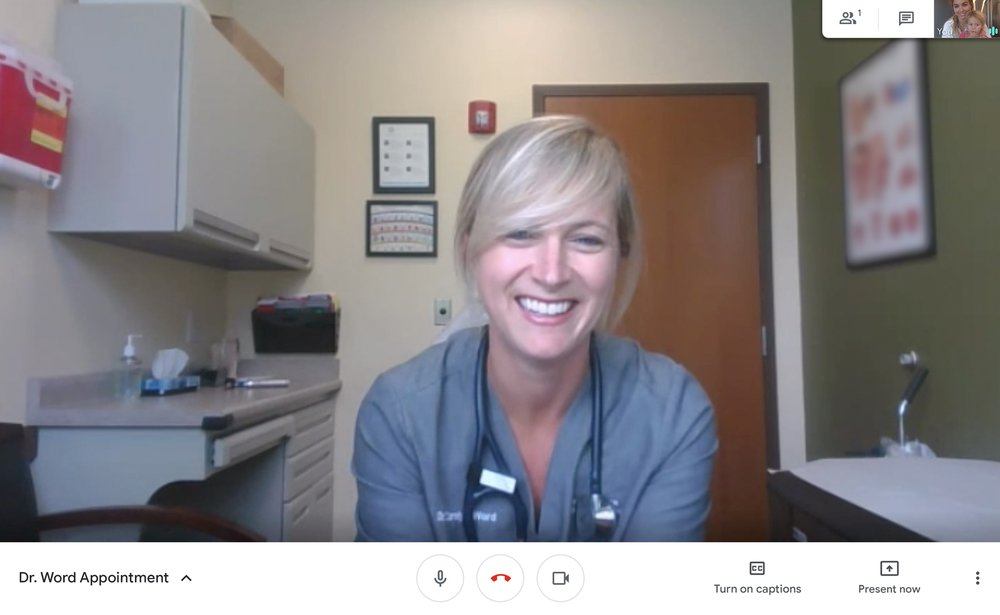
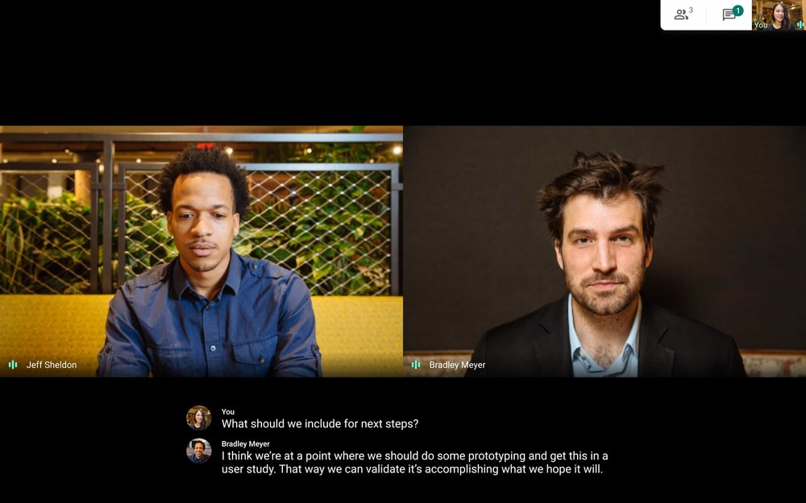
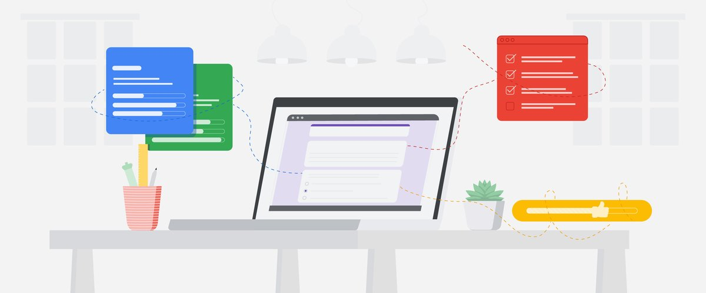
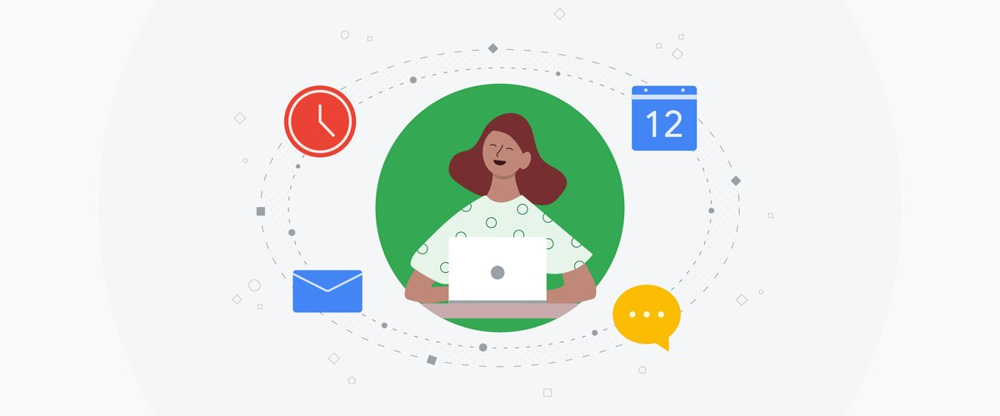
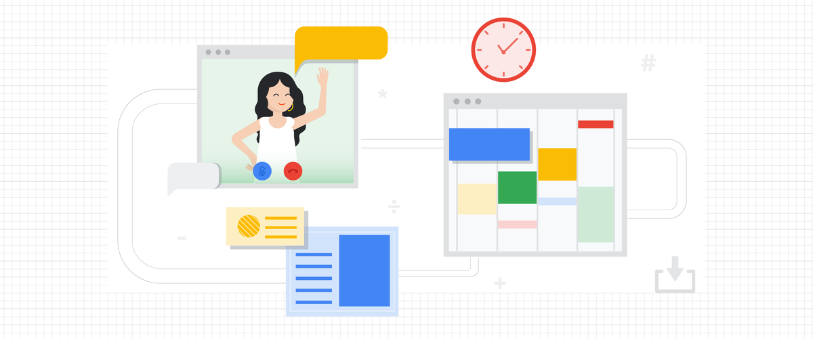

Google Meet Now Available for Free - The Keyword

 [Meet](https://www.blog.google/products/meet/)

# Google Meet premium video meetings—free for everyone

 Google Meet

Javier Soltero

Vice President & GM, G Suite

 Published Apr 29, 2020

Stay updated on Meet

Google’s premium video meetings are free for everyone and will roll out in the coming days.

 [NOTIFY ME](https://landing.google.com/googlemeet)

Technology that connects us while we're apart helps keep us safe and productive. Over the past few months, we’ve seen the power of video meetings bring us together—whether we’re working with teammates, talking to healthcare professionals, sharing with loved ones, or learning from home.

Today, we’re making Google Meet, our premium video conferencing product, free for everyone, with availability rolling out over the coming weeks. We’ve invested years in making Meet a secure and reliable video conferencing solution that’s trusted by schools, governments and enterprises around the world, and in recent months we’ve[accelerated the release](https://cloud.google.com/blog/products/productivity-collaboration/introducing-tiled-view-and-other-top-requested-features-in-google-meet) of top-requested features to make it even more helpful. Starting in early May, anyone with an email address can sign up for Meet and enjoy many of the same features available to our business and education users, such as simple scheduling and screen sharing, real-time captions, and layouts that adapt to your preference, including an expanded tiled view.

It’s important that everyone who uses Meet has a secure and reliable experience from the start, so beginning next week, we’ll be gradually expanding its availability to more and more people over the following weeks. This means you might not be able to create meetings at [meet.google.com](http://meet.google.com/) right away, but you can [sign up to be notified when it’s available](https://landing.google.com/googlemeet).

 

Meet operates on a secure foundation, keeping users safe, data secure, and information private—including between patients and caregivers.

### Video meetings built on a secure foundation

Meet is designed, built and operated to be secure at scale. Since January, we’ve seen Meet’s peak daily usage grow by 30x. As of this month, Meet is hosting 3 billion minutes of video meetings and adding roughly 3 million new users every day. And as of last week, Meet’s daily meeting participants surpassed 100 million. With this growth comes great responsibility. Privacy and security are paramount, no matter if it’s a doctor sharing confidential health information with a patient, a financial advisor hosting a client meeting, or people virtually connecting with each other for graduations, holidays and happy hours.

Our approach to security is simple: make products safe by default. We designed Meet to operate on a secure foundation, providing the protections needed to keep our users safe, their data secure, and their information private. Here are just a few of our default-on [safety measures](https://support.google.com/meet/answer/9852160):

- We provide a strong set of host controls such as the ability to admit or deny entry to a meeting, and mute or remove participants, if needed.
- We do not allow anonymous users (i.e., without a Google Account) to join meetings created by individual accounts.
- Meet meeting codes are complex by default and therefore resilient to brute-force “guessing.”
- Meet video meetings are encrypted in transit, and all recordings stored in Google Drive are encrypted in transit and at rest.
- We don’t require plugins to use Meet on the web. It works entirely in Chrome and other modern [browsers](https://support.google.com/meet/answer/7317473?hl=en), so it’s less vulnerable to security threats.
- On mobile, we have dedicated Google Meet apps in the Apple [App Store](https://apps.apple.com/app/id1013231476) and Google [Play Store](https://play.google.com/store/apps/details?id=com.google.android.apps.meetings&hl=en_US).
- Meet users can enroll their account in Google’s [Advanced Protection Program](http://g.co/advancedprotection)—our strongest protections available against phishing and account hijacking.
- Google Cloud undergoes regular rigorous security and privacy audits for all its [services](https://cloud.google.com/security/privacy). Our global compliance certifications can help support regulatory requirements such as GDPR and HIPAA, as well as COPPA and FERPA for education.
- Your Meet data is not used for advertising, and we don't sell your data to third parties.

We operate a highly secure and resilient private [network](https://www.blog.google/inside-google/infrastructure/keeping-our-network-infrastructure-strong-amid-covid-19/) that encircles the globe and connects our data centers to each other—ensuring that your data stays safe. Trust is built on transparency and we publish the [locations](https://www.google.com/about/datacenters/locations/) of all our data centers. You can learn more about how Meet keeps your video meetings safe [in this post](https://cloud.google.com/blog/products/g-suite/how-google-meet-keeps-video-conferences-secure).

### Free Google Meet accounts for individuals

You can use Meet to schedule, join or start secure video meetings with anyone—for a virtual yoga class, weekly book club, neighborhood meeting, or happy hour with friends. Until now, Meet has only been available as part of [G Suite](https://gsuite.google.com/), our collaboration and productivity solution for businesses, organizations and schools. Going forward, Meet will be available to anyone for free on the web at [meet.google.com](https://meet.google.com/) and via mobile apps for [iOS](https://apps.apple.com/app/id1013231476) or [Android](https://play.google.com/store/apps/details?id=com.google.android.apps.meetings). And if you use Gmail or Google Calendar, you’ll be able to easily start or join from there, too.

 

Use your existing Google Account to start a secure meeting in Google Meet

If you have an existing Google Account (for example, if you’re a @gmail.com user), sign in at [meet.google.com](https://meet.google.com/) to get started. If you don’t have a free Google Account, it only takes a minute to [create one](https://support.google.com/accounts/answer/27441?hl=en) using your work or personal email address of choice (we require this step as a security measure, and you’ll only need to do this once).

Meetings are limited to 60 minutes for the free product, though we won’t enforce this time limit until after Sept. 30. Creating a trusted meeting space is important, and being mindful when sharing meeting links in public forums can help create a safe experience for all attendees. For more tips on how to use Meet securely and effectively, visit our [Help Center](https://support.google.com/a/users/answer/9845199).

### Google Meet for groups and teams

Groups within an organization can also use Meet to create video meetings that help coworkers connect one-on-one, collaborate as a team, and more. For organizations that aren’t already G Suite customers, today we’re announcing G Suite Essentials. G Suite Essentials is perfect for teams that need access to Meet’s more advanced features, such as dial-in phone numbers, larger meetings, and meeting recording. G Suite Essentials also includes Google Drive for easy and secure access to all of a team’s content, and Docs, Sheets and Slides for content creation and real-time collaboration.

Through Sept. 30, we’re providing G Suite Essentials and all of these advanced features free of charge. If you’re interested in G Suite Essentials, [complete this form](https://inthecloud.withgoogle.com/google-meet/dl-cd.html?utm_source=google&utm_medium=website&utm_campaign=FY20-Q2-global-demandgen-operational-cs-google_meet_interest_page_utm&utm_content=blogFX3VpFWQ4rvwu0jF4hhv9G9xw/edit#) to get in touch with our sales team.

### Google Meet for businesses and organizations

Whether it’s hospitals supporting patients via telehealth, banks working with loan applicants, retailers assisting customers remotely, or manufacturers interacting safely with warehouse technicians, businesses across every industry are using Meet to stay connected. If you’re one of the [6 million companies and organizations](https://cloud.google.com/blog/products/g-suite/how-google-meet-supports-two-million-new-users-each-day) that use G Suite to power remote productivity, you already have access to Meet. Admins simply need to enable Meet by following instructions outlined on our [Help Center](https://support.google.com/a/answer/9760270). In the spirit of being helpful during this time, we’re providing three ways for new and current enterprise customers to access Meet through Sept. 30:

- Free access to Meet’s [advanced features](https://cloud.google.com/blog/products/g-suite/helping-businesses-and-schools-stay-connected-in-response-to-coronavirus) for all G Suite customers, such as the ability to live stream for up to 100,000 viewers within your domain.
- Free additional Meet licenses for existing G Suite customers without any amendments to their current contract.
- Free G Suite Essentials for enterprise customers.

Enterprises can [get in touch with our sales team](https://gsuite.google.com/contact/) to learn more.

 

Google Meet includes live captions powered by Google’s speech recognition technology

### Google Meet in schools and higher-ed institutions

Many schools and colleges today use Meet to power secure virtual classes, PTA meetings, parent-teacher conferences, tutoring, and even school socials. Meet is included in G Suite for Education, which serves more than 120 million students and teachers globally. If your school already uses G Suite for Education, your administrator can [enable Meet](https://support.google.com/a/answer/9760270) at no additional cost. If your school doesn’t use G Suite for Education, you can [sign up here](https://gsuite.google.com/signup/edu/welcome#0). To access resources for distance learning, visit [Teach from Home](https://teachfromhome.google/intl/en/).

Our hope is that by making Meet and G Suite more readily available for all, it will be easier to securely stay connected and productive—now and in the future.

 Posted in:

- [Meet](https://www.blog.google/products/meet/)  —

- [G Suite](https://www.blog.google/products/g-suite/)  —

- [Education](https://www.blog.google/outreach-initiatives/education/)  —

- [Google Cloud](https://www.blog.google/products/google-cloud/)  —

### Related stories

- [                  ##### Education    #### Check in on emotional well-being during distance learning           By  Alicia Salmeron   -    Apr 17, 2020     ](https://www.blog.google/outreach-initiatives/education/social-emotional-learning-covid19/)

- [                  ##### Google Earth    #### Tips for learning at home with Google Earth           By  Emily Henderson   -    Apr 17, 2020     ](https://www.blog.google/products/earth/tips-to-learn-at-home-with-google-earth/)

- [                  ##### Nonprofits    #### Google for Nonprofits adds new countries and G Suite discounts           By  Isha Mishra   -    Apr 15, 2020     ](https://www.blog.google/outreach-initiatives/nonprofits/new-countries-g-suite-discounts/)

- [                  ##### Education    #### Advice for educators learning to teach from home           By  Mette Jakobsen   & Stu Blackmore   -    Apr 15, 2020     ](https://www.blog.google/outreach-initiatives/education/advice-for-supporting-educators/)

- [                  ##### Education    #### New Meet features to improve distance learning           By  Zach Yeskel   -    Apr 9, 2020     ](https://www.blog.google/outreach-initiatives/education/meet-for-edu/)

- [                  ##### Education    #### 5 tips for effective distance learning during school closures           By  Michael de la Cruz   -    Apr 8, 2020     ](https://www.blog.google/outreach-initiatives/education/5-tips-distance-learning/)

- .