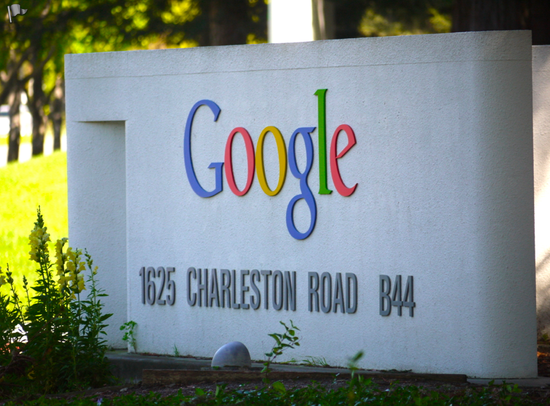
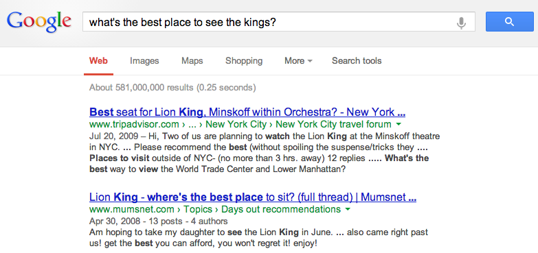
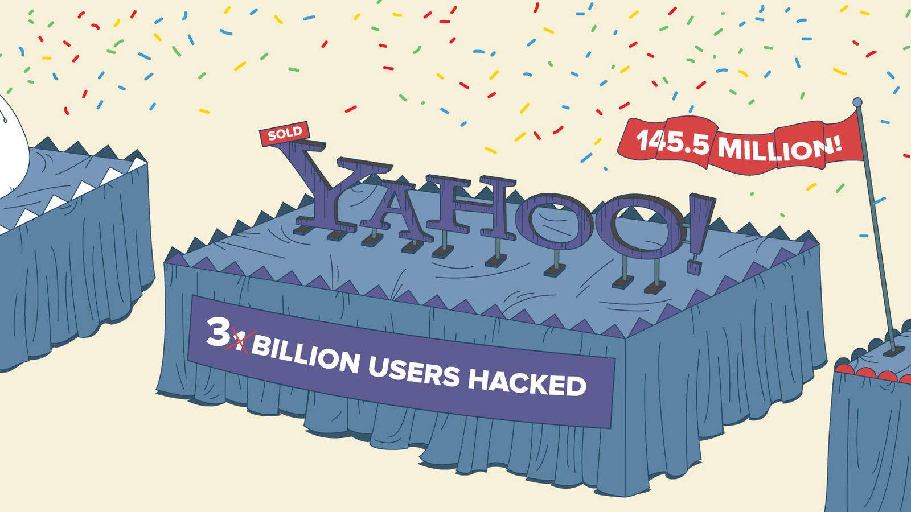
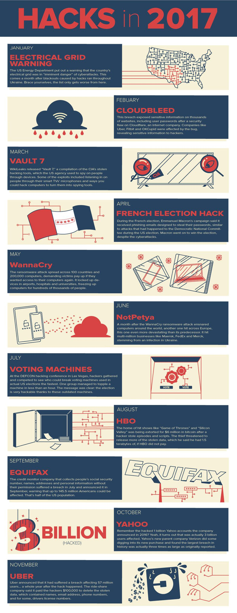

Google Search scratches its brain 500 million times a day

 [Internet](https://www.cnet.com/topics/internet/)

# Google Search scratches its brain 500 million times a day

On a daily basis, 15 percent of queries submitted have never been seen before by Google's search engine.

by

- [Dan Farber](https://www.cnet.com/profiles/dfarber/)

/ May 13, 2013  6:16 PM PDT

-

-

-

-

-

- [(L)](https://www.cnet.com/news/google-search-scratches-its-brain-500-million-times-a-day/#comments)

price drop

[(L)](https://adclick.g.doubleclick.net/aclk?sa=l&ai=CIMLuWl4kWt30AouqoAPqmZCAA7Li3YJP0siJ6dEGwI23ARABIN76whVg5crlg7QOoAGaydeXA8gBCakC9U8roBKoUD7gAgCoAwGqBOUBT9AsQRBA6Z84Os7SeWI4N5aZCUUVtxEDlli2yNkocKYZVpuFaXKHmBv44mDC7OjQizK4ih87ljA0lBSuHpgFXsk_xNACddSd5l4XJH0cwsMxPGTvX9qUbczPCexIfcLuheW3uKy3_aYfnBgQYakCMTPIfoWO3OXRu8Q2lHoW3NSiQpDlVRPYCwqJf9S8kf-WKyvsQJwb3D189gu6bPXLKdpY6KLkftphQFF08_MPfnjnMG4VzL0un5X7hsLxJEtzRPJco9X9wJyUOMvg0fKgRG003mxhU3ll8oJTxqEHHgBdjwv1IeAEAfoFBgglEAEYAKAGLoAHzraoaKgHpr4b2AcAwAgB0ggHCIxjEAEYA4AKA9gTDA&num=1&sig=AOD64_3ZSfQwrl1PSJ4ojuN_nngIaLzRJw&adurl=http://tracking-in.sokrati.com/click%3Fclient_id%3D17391%26tag%3DGOOGLE-TAG%26svt%3D2%7C7306860992%7C846028513%7C43538188459%7Ckwd-0%7C%7C%7Cd%7C31affabe381790c2.anonymous.google%7C236616393581%7Cnone%7C%26redirect_url%3Dhttp://www.ajio.com/ajio-panelled-legging-with-stirrup-hem/p/460039921_greymelange&client=ca-pub-2679103605715789)

price drop

[(L)](https://adclick.g.doubleclick.net/aclk?sa=l&ai=Ch33zWl4kWt30AouqoAPqmZCAA7Li3YJP0siJ6dEGwI23ARABIN76whVg5crlg7QOoAGaydeXA8gBCakC9U8roBKoUD7gAgCoAwGqBOUBT9AsQRBA6Z84Os7SeWI4N5aZCUUVtxEDlli2yNkocKYZVpuFaXKHmBv44mDC7OjQizK4ih87ljA0lBSuHpgFXsk_xNACddSd5l4XJH0cwsMxPGTvX9qUbczPCexIfcLuheW3uKy3_aYfnBgQYakCMTPIfoWO3OXRu8Q2lHoW3NSiQpDlVRPYCwqJf9S8kf-WKyvsQJwb3D189gu6bPXLKdpY6KLkftphQFF08_MPfnjnMG4VzL0un5X7hsLxJEtzRPJco9X9wJyUOMvg0fKgRG003mxhU3ll8oJTxqEHHgBdjwv1IeAEAfoFBgglEAEYAaAGLoAHzraoaKgHpr4b2AcAwAgC0ggHCIxjEAEYA4AKA9gTDA&num=1&sig=AOD64_0aBAPg_oeW3PTNXfysAyf_WmjSRA&adurl=http://tracking-in.sokrati.com/click%3Fclient_id%3D17391%26tag%3DGOOGLE-TAG%26svt%3D2%7C7306860992%7C846028513%7C43538188459%7Ckwd-0%7C%7C%7Cd%7C31affabe381790c2.anonymous.google%7C236616393581%7Cnone%7C%26redirect_url%3Dhttp://www.ajio.com/parmita-semi-stitched-lehenga-choli-set/p/460130795_maroon&client=ca-pub-2679103605715789)

price drop

[(L)](https://adclick.g.doubleclick.net/aclk?sa=l&ai=C97uAWl4kWt30AouqoAPqmZCAA7Li3YJP0siJ6dEGwI23ARABIN76whVg5crlg7QOoAGaydeXA8gBCakC9U8roBKoUD7gAgCoAwGqBOUBT9AsQRBA6Z84Os7SeWI4N5aZCUUVtxEDlli2yNkocKYZVpuFaXKHmBv44mDC7OjQizK4ih87ljA0lBSuHpgFXsk_xNACddSd5l4XJH0cwsMxPGTvX9qUbczPCexIfcLuheW3uKy3_aYfnBgQYakCMTPIfoWO3OXRu8Q2lHoW3NSiQpDlVRPYCwqJf9S8kf-WKyvsQJwb3D189gu6bPXLKdpY6KLkftphQFF08_MPfnjnMG4VzL0un5X7hsLxJEtzRPJco9X9wJyUOMvg0fKgRG003mxhU3ll8oJTxqEHHgBdjwv1IeAEAfoFBgglEAEYAqAGLoAHzraoaKgHpr4b2AcAwAgD0ggHCIxjEAEYA4AKA9gTDA&num=1&sig=AOD64_0EHl7ECznKDvraYIBPOlPWhCgx0Q&adurl=http://tracking-in.sokrati.com/click%3Fclient_id%3D17391%26tag%3DGOOGLE-TAG%26svt%3D2%7C7306860992%7C846028513%7C43538188459%7Ckwd-0%7C%7C%7Cd%7C31affabe381790c2.anonymous.google%7C236616393581%7Cnone%7C%26redirect_url%3Dhttp://www.ajio.com/ajio-cape-style-jacket-with-floral-embroidery/p/460090160_ivory&client=ca-pub-2679103605715789)

price drop

[(L)](https://adclick.g.doubleclick.net/aclk?sa=l&ai=CfxiiWl4kWt30AouqoAPqmZCAA7Li3YJP0siJ6dEGwI23ARABIN76whVg5crlg7QOoAGaydeXA8gBCakC9U8roBKoUD7gAgCoAwGqBOUBT9AsQRBA6Z84Os7SeWI4N5aZCUUVtxEDlli2yNkocKYZVpuFaXKHmBv44mDC7OjQizK4ih87ljA0lBSuHpgFXsk_xNACddSd5l4XJH0cwsMxPGTvX9qUbczPCexIfcLuheW3uKy3_aYfnBgQYakCMTPIfoWO3OXRu8Q2lHoW3NSiQpDlVRPYCwqJf9S8kf-WKyvsQJwb3D189gu6bPXLKdpY6KLkftphQFF08_MPfnjnMG4VzL0un5X7hsLxJEtzRPJco9X9wJyUOMvg0fKgRG003mxhU3ll8oJTxqEHHgBdjwv1IeAEAfoFBgglEAEYA6AGLoAHzraoaKgHpr4b2AcAwAgE0ggHCIxjEAEYA4AKA9gTDA&num=1&sig=AOD64_2xjqgsC3JMsIdQnXCEV0pYdhrUug&adurl=http://tracking-in.sokrati.com/click%3Fclient_id%3D17391%26tag%3DGOOGLE-TAG%26svt%3D2%7C7306860992%7C846028513%7C43538188459%7Ckwd-0%7C%7C%7Cd%7C31affabe381790c2.anonymous.google%7C236616393581%7Cnone%7C%26redirect_url%3Dhttp://www.ajio.com/ajio-embroidered-straight-kurta/p/460089578_green&client=ca-pub-2679103605715789)

price drop

[(L)](https://adclick.g.doubleclick.net/aclk?sa=l&ai=CjZtzWl4kWt30AouqoAPqmZCAA7Li3YJP0siJ6dEGwI23ARABIN76whVg5crlg7QOoAGaydeXA8gBCakC9U8roBKoUD7gAgCoAwGqBOUBT9AsQRBA6Z84Os7SeWI4N5aZCUUVtxEDlli2yNkocKYZVpuFaXKHmBv44mDC7OjQizK4ih87ljA0lBSuHpgFXsk_xNACddSd5l4XJH0cwsMxPGTvX9qUbczPCexIfcLuheW3uKy3_aYfnBgQYakCMTPIfoWO3OXRu8Q2lHoW3NSiQpDlVRPYCwqJf9S8kf-WKyvsQJwb3D189gu6bPXLKdpY6KLkftphQFF08_MPfnjnMG4VzL0un5X7hsLxJEtzRPJco9X9wJyUOMvg0fKgRG003mxhU3ll8oJTxqEHHgBdjwv1IeAEAfoFBgglEAEYBKAGLoAHzraoaKgHpr4b2AcAwAgF0ggHCIxjEAEYA4AKA9gTDA&num=1&sig=AOD64_32wWkRsL7PwInKwsulTClv1ehrMQ&adurl=http://tracking-in.sokrati.com/click%3Fclient_id%3D17391%26tag%3DGOOGLE-TAG%26svt%3D2%7C7306860992%7C846028513%7C43538188459%7Ckwd-0%7C%7C%7Cd%7C31affabe381790c2.anonymous.google%7C236616393581%7Cnone%7C%26redirect_url%3Dhttp://www.ajio.com/ajio-flared-top-with-embroidery/p/460053527_yellow&client=ca-pub-2679103605715789)

price drop

[(L)](https://adclick.g.doubleclick.net/aclk?sa=l&ai=CadFnWl4kWt30AouqoAPqmZCAA7Li3YJP0siJ6dEGwI23ARABIN76whVg5crlg7QOoAGaydeXA8gBCakC9U8roBKoUD7gAgCoAwGqBOUBT9AsQRBA6Z84Os7SeWI4N5aZCUUVtxEDlli2yNkocKYZVpuFaXKHmBv44mDC7OjQizK4ih87ljA0lBSuHpgFXsk_xNACddSd5l4XJH0cwsMxPGTvX9qUbczPCexIfcLuheW3uKy3_aYfnBgQYakCMTPIfoWO3OXRu8Q2lHoW3NSiQpDlVRPYCwqJf9S8kf-WKyvsQJwb3D189gu6bPXLKdpY6KLkftphQFF08_MPfnjnMG4VzL0un5X7hsLxJEtzRPJco9X9wJyUOMvg0fKgRG003mxhU3ll8oJTxqEHHgBdjwv1IeAEAfoFBgglEAEYBaAGLoAHzraoaKgHpr4b2AcAwAgG0ggHCIxjEAEYA4AKA9gTDA&num=1&sig=AOD64_15tppuj-L8umFzj8N3irC9X7-xhg&adurl=http://tracking-in.sokrati.com/click%3Fclient_id%3D17391%26tag%3DGOOGLE-TAG%26svt%3D2%7C7306860992%7C846028513%7C43538188459%7Ckwd-0%7C%7C%7Cd%7C31affabe381790c2.anonymous.google%7C236616393581%7Cnone%7C%26redirect_url%3Dhttp://www.ajio.com/ajio-ankle-strap-stilettos-with-criss-cross-upper/p/460054634_tan&client=ca-pub-2679103605715789)

[(L)](https://adclick.g.doubleclick.net/aclk?sa=l&ai=CIMLuWl4kWt30AouqoAPqmZCAA7Li3YJP0siJ6dEGwI23ARABIN76whVg5crlg7QOoAGaydeXA8gBCakC9U8roBKoUD7gAgCoAwGqBOUBT9AsQRBA6Z84Os7SeWI4N5aZCUUVtxEDlli2yNkocKYZVpuFaXKHmBv44mDC7OjQizK4ih87ljA0lBSuHpgFXsk_xNACddSd5l4XJH0cwsMxPGTvX9qUbczPCexIfcLuheW3uKy3_aYfnBgQYakCMTPIfoWO3OXRu8Q2lHoW3NSiQpDlVRPYCwqJf9S8kf-WKyvsQJwb3D189gu6bPXLKdpY6KLkftphQFF08_MPfnjnMG4VzL0un5X7hsLxJEtzRPJco9X9wJyUOMvg0fKgRG003mxhU3ll8oJTxqEHHgBdjwv1IeAEAfoFBgglEAEYAKAGLoAHzraoaKgHpr4b2AcAwAgB0ggHCIxjEAEYA4AKA9gTDA&num=1&sig=AOD64_3ZSfQwrl1PSJ4ojuN_nngIaLzRJw&adurl=http://tracking-in.sokrati.com/click%3Fclient_id%3D17391%26tag%3DGOOGLE-TAG%26svt%3D2%7C7306860992%7C846028513%7C43538188459%7Ckwd-0%7C%7C%7Cd%7C31affabe381790c2.anonymous.google%7C236616393581%7Cnone%7C%26redirect_url%3Dhttp://www.ajio.com/ajio-panelled-legging-with-stirrup-hem/p/460039921_greymelange&client=ca-pub-2679103605715789)

Google Search receives 500 million never-before-seen queries per day. Dan Farber

Google's search engine is powerful, but not all-knowing. Every month Google processes 100 billion queries, and typically returns results with microsecond speed. However, on a fairly regular basis, Google's search engine has to think a bit harder to render a result. On a daily basis, 15 percent of queries submitted -- 500 million -- have never been seen before by Google's search engine, and that has continued for the nearly 15 years the company has existed, according to John Wiley, the lead designer for Google Search.

"We have to solve that problem," an understated [Wiley said in an interview with Bloomberg TV](http://www.bloomberg.com/video/behind-google-s-obsession-with-perfecting-search-c6KcoGikT0m2KFqHuzYGoA.html).

In the process of trying to know more and reduce the 15 percent of new, previously unread or unheard queries, Google crawls 20 billion Web sites per day in search of new data that it can turn into results.

A key part of Google's quest to reduce the percentage of unseen queries, and provide answers rather than lists of links, is the Knowledge Graph. It's a vast database that understand entities -- such as topics, people, and events -- and the connections among them, somewhat like the human brain. Knowledge Graph has more than 570 million entities and 18 billion facts about connections between them, by Google's count.

**Read: **[Google: The future of search is Now](https://www.cnet.com/news/google-the-future-of-search-is-now/)

Knowledge Graph, which is an integral part of Google Search, can parse the meaning of a new query, but deliver more precise results than traditional search. If a user searches for "the best place to see the kings," for example, the Knowledge Graph knows about different kinds of kings. Based on the user's profile and other contextual information, Google Search could determine which "kings," such as the L.A. Kings hockey team, the user is asking about and be primed to answer more questions on the same topic.

This kind of query may not be new, but it's not easy to for Google Search to understand the user intent. Google screenshot

However, Google admits that the Knowledge Graph's actual knowledge is tiny compared with the human brain and the calculating of its estimated 100 billion neurons and 100 trillion synapses.

"Knowledge Graph has good coverage of people, places, things, and events, but there is plenty it doesn't know about. We are at 1 percent," [said John Giannandrea, director of engineering for Knowledge Graph](https://www.cnet.com/news/google-the-future-of-search-is-now/). So, between the 15 percent of unseen before queries daily and the Knowledge Graph's 1 percent solution, Google has plenty of work to do.

## Share your voice

 [    6 Comments](https://www.cnet.com/news/google-search-scratches-its-brain-500-million-times-a-day/#comments)

## [Tags](https://www.cnet.com/tags/)

 [Internet](https://www.cnet.com/topics/internet/)  [Google](https://www.cnet.com/google/)

Tech TodayAutoplayOn00:00/01:36

price drop

[(L)](https://adclick.g.doubleclick.net/aclk?sa=l&ai=Cu32QWl4kWsqVA9e9oAOIq5pgsuLdgk_SyInp0QbAjbcBEAEg3vrCFWDlyuWDtA6gAZrJ15cDyAEJqQL1TyugEqhQPuACAKgDAaoE7AFP0KL9QJ5VLFS4ktK_iVglGQR_XkiXgNlW6-AlrLUNhYfztrPMUi8Hgn-Exi-uK_CzU9VbGOB6H2hTozcCy38idxGGmK0BCYF_vC49XuVBN58Co1P5a4xj3L4Opnh1qNw1t3-hTCTV8i09n9oD90BG3XjKPfVim9CIpJfzULkeYq-gog3jPQIXg-RKdldyi1E6hSHRrxxQe28WABG-6Co_CvK7xsnTlVpnk4jt0VlvATPUB8hOtfFDzCtXZr4Gacv3wBTEHl-B7VQr9qYKevSTCdO8H4pJmt_4qB-rIM9mCFnKDBwl_5_6bHIDg-AEAfoFBgglEAEYAKAGLoAHzraoaKgHpr4b2AcAwAgB0ggHCIxjEAEYA4AKA9gTDA&num=1&sig=AOD64_2ZSQFyb0GE1SZ7WMXJTUibFkZeIw&adurl=http://tracking-in.sokrati.com/click%3Fclient_id%3D17391%26tag%3DGOOGLE-TAG%26svt%3D2%7C7306860992%7C846028513%7C43538188459%7Ckwd-0%7C%7C%7Cd%7C31affabe381790c2.anonymous.google%7C236616393581%7Cnone%7C%26redirect_url%3Dhttp://www.ajio.com/ajio-embroidered-straight-kurta/p/460089578_green&client=ca-pub-2679103605715789)

price drop

[(L)](https://adclick.g.doubleclick.net/aclk?sa=l&ai=CxNzfWl4kWsqVA9e9oAOIq5pgsuLdgk_SyInp0QbAjbcBEAEg3vrCFWDlyuWDtA6gAZrJ15cDyAEJqQL1TyugEqhQPuACAKgDAaoE7AFP0KL9QJ5VLFS4ktK_iVglGQR_XkiXgNlW6-AlrLUNhYfztrPMUi8Hgn-Exi-uK_CzU9VbGOB6H2hTozcCy38idxGGmK0BCYF_vC49XuVBN58Co1P5a4xj3L4Opnh1qNw1t3-hTCTV8i09n9oD90BG3XjKPfVim9CIpJfzULkeYq-gog3jPQIXg-RKdldyi1E6hSHRrxxQe28WABG-6Co_CvK7xsnTlVpnk4jt0VlvATPUB8hOtfFDzCtXZr4Gacv3wBTEHl-B7VQr9qYKevSTCdO8H4pJmt_4qB-rIM9mCFnKDBwl_5_6bHIDg-AEAfoFBgglEAEYAaAGLoAHzraoaKgHpr4b2AcAwAgC0ggHCIxjEAEYA4AKA9gTDA&num=1&sig=AOD64_1Jw0hlWijif5agUL2RsdXDa3l1Qw&adurl=http://tracking-in.sokrati.com/click%3Fclient_id%3D17391%26tag%3DGOOGLE-TAG%26svt%3D2%7C7306860992%7C846028513%7C43538188459%7Ckwd-0%7C%7C%7Cd%7C31affabe381790c2.anonymous.google%7C236616393581%7Cnone%7C%26redirect_url%3Dhttp://www.ajio.com/ajio-panelled-legging-with-stirrup-hem/p/460039921_greymelange&client=ca-pub-2679103605715789)

price drop

[(L)](https://adclick.g.doubleclick.net/aclk?sa=l&ai=C8rcuWl4kWsqVA9e9oAOIq5pgsuLdgk_SyInp0QbAjbcBEAEg3vrCFWDlyuWDtA6gAZrJ15cDyAEJqQL1TyugEqhQPuACAKgDAaoE7AFP0KL9QJ5VLFS4ktK_iVglGQR_XkiXgNlW6-AlrLUNhYfztrPMUi8Hgn-Exi-uK_CzU9VbGOB6H2hTozcCy38idxGGmK0BCYF_vC49XuVBN58Co1P5a4xj3L4Opnh1qNw1t3-hTCTV8i09n9oD90BG3XjKPfVim9CIpJfzULkeYq-gog3jPQIXg-RKdldyi1E6hSHRrxxQe28WABG-6Co_CvK7xsnTlVpnk4jt0VlvATPUB8hOtfFDzCtXZr4Gacv3wBTEHl-B7VQr9qYKevSTCdO8H4pJmt_4qB-rIM9mCFnKDBwl_5_6bHIDg-AEAfoFBgglEAEYAqAGLoAHzraoaKgHpr4b2AcAwAgD0ggHCIxjEAEYA4AKA9gTDA&num=1&sig=AOD64_0WrWMGCn9Zi7dfZszXY0k4B5-GCA&adurl=http://tracking-in.sokrati.com/click%3Fclient_id%3D17391%26tag%3DGOOGLE-TAG%26svt%3D2%7C7306860992%7C846028513%7C43538188459%7Ckwd-0%7C%7C%7Cd%7C31affabe381790c2.anonymous.google%7C236616393581%7Cnone%7C%26redirect_url%3Dhttp://www.ajio.com/parmita-semi-stitched-lehenga-choli-set/p/460130795_maroon&client=ca-pub-2679103605715789)

price drop

[(L)](https://adclick.g.doubleclick.net/aclk?sa=l&ai=CR-p1Wl4kWsqVA9e9oAOIq5pgsuLdgk_SyInp0QbAjbcBEAEg3vrCFWDlyuWDtA6gAZrJ15cDyAEJqQL1TyugEqhQPuACAKgDAaoE7AFP0KL9QJ5VLFS4ktK_iVglGQR_XkiXgNlW6-AlrLUNhYfztrPMUi8Hgn-Exi-uK_CzU9VbGOB6H2hTozcCy38idxGGmK0BCYF_vC49XuVBN58Co1P5a4xj3L4Opnh1qNw1t3-hTCTV8i09n9oD90BG3XjKPfVim9CIpJfzULkeYq-gog3jPQIXg-RKdldyi1E6hSHRrxxQe28WABG-6Co_CvK7xsnTlVpnk4jt0VlvATPUB8hOtfFDzCtXZr4Gacv3wBTEHl-B7VQr9qYKevSTCdO8H4pJmt_4qB-rIM9mCFnKDBwl_5_6bHIDg-AEAfoFBgglEAEYA6AGLoAHzraoaKgHpr4b2AcAwAgE0ggHCIxjEAEYA4AKA9gTDA&num=1&sig=AOD64_0EaQovMMr-ATSXOxekxmr-iCTfMQ&adurl=http://tracking-in.sokrati.com/click%3Fclient_id%3D17391%26tag%3DGOOGLE-TAG%26svt%3D2%7C7306860992%7C846028513%7C43538188459%7Ckwd-0%7C%7C%7Cd%7C31affabe381790c2.anonymous.google%7C236616393581%7Cnone%7C%26redirect_url%3Dhttp://www.ajio.com/ajio-cape-style-jacket-with-floral-embroidery/p/460090160_ivory&client=ca-pub-2679103605715789)

price drop

[(L)](https://adclick.g.doubleclick.net/aclk?sa=l&ai=CdjD7Wl4kWsqVA9e9oAOIq5pgsuLdgk_SyInp0QbAjbcBEAEg3vrCFWDlyuWDtA6gAZrJ15cDyAEJqQL1TyugEqhQPuACAKgDAaoE7AFP0KL9QJ5VLFS4ktK_iVglGQR_XkiXgNlW6-AlrLUNhYfztrPMUi8Hgn-Exi-uK_CzU9VbGOB6H2hTozcCy38idxGGmK0BCYF_vC49XuVBN58Co1P5a4xj3L4Opnh1qNw1t3-hTCTV8i09n9oD90BG3XjKPfVim9CIpJfzULkeYq-gog3jPQIXg-RKdldyi1E6hSHRrxxQe28WABG-6Co_CvK7xsnTlVpnk4jt0VlvATPUB8hOtfFDzCtXZr4Gacv3wBTEHl-B7VQr9qYKevSTCdO8H4pJmt_4qB-rIM9mCFnKDBwl_5_6bHIDg-AEAfoFBgglEAEYBKAGLoAHzraoaKgHpr4b2AcAwAgF0ggHCIxjEAEYA4AKA9gTDA&num=1&sig=AOD64_0pdFCnw3DFkXBlcu5UItwQk90YkA&adurl=http://tracking-in.sokrati.com/click%3Fclient_id%3D17391%26tag%3DGOOGLE-TAG%26svt%3D2%7C7306860992%7C846028513%7C43538188459%7Ckwd-0%7C%7C%7Cd%7C31affabe381790c2.anonymous.google%7C236616393581%7Cnone%7C%26redirect_url%3Dhttp://www.ajio.com/ajio-ankle-strap-stilettos-with-criss-cross-upper/p/460054634_tan&client=ca-pub-2679103605715789)

price drop

[(L)](https://adclick.g.doubleclick.net/aclk?sa=l&ai=CICKBWl4kWsqVA9e9oAOIq5pgsuLdgk_SyInp0QbAjbcBEAEg3vrCFWDlyuWDtA6gAZrJ15cDyAEJqQL1TyugEqhQPuACAKgDAaoE7AFP0KL9QJ5VLFS4ktK_iVglGQR_XkiXgNlW6-AlrLUNhYfztrPMUi8Hgn-Exi-uK_CzU9VbGOB6H2hTozcCy38idxGGmK0BCYF_vC49XuVBN58Co1P5a4xj3L4Opnh1qNw1t3-hTCTV8i09n9oD90BG3XjKPfVim9CIpJfzULkeYq-gog3jPQIXg-RKdldyi1E6hSHRrxxQe28WABG-6Co_CvK7xsnTlVpnk4jt0VlvATPUB8hOtfFDzCtXZr4Gacv3wBTEHl-B7VQr9qYKevSTCdO8H4pJmt_4qB-rIM9mCFnKDBwl_5_6bHIDg-AEAfoFBgglEAEYBaAGLoAHzraoaKgHpr4b2AcAwAgG0ggHCIxjEAEYA4AKA9gTDA&num=1&sig=AOD64_1baCQBz3vaVdLYZFjngsTe8m1jBQ&adurl=http://tracking-in.sokrati.com/click%3Fclient_id%3D17391%26tag%3DGOOGLE-TAG%26svt%3D2%7C7306860992%7C846028513%7C43538188459%7Ckwd-0%7C%7C%7Cd%7C31affabe381790c2.anonymous.google%7C236616393581%7Cnone%7C%26redirect_url%3Dhttp://www.ajio.com/ajio-flared-top-with-embroidery/p/460053527_yellow&client=ca-pub-2679103605715789)

[(L)](https://adclick.g.doubleclick.net/aclk?sa=l&ai=Cu32QWl4kWsqVA9e9oAOIq5pgsuLdgk_SyInp0QbAjbcBEAEg3vrCFWDlyuWDtA6gAZrJ15cDyAEJqQL1TyugEqhQPuACAKgDAaoE7AFP0KL9QJ5VLFS4ktK_iVglGQR_XkiXgNlW6-AlrLUNhYfztrPMUi8Hgn-Exi-uK_CzU9VbGOB6H2hTozcCy38idxGGmK0BCYF_vC49XuVBN58Co1P5a4xj3L4Opnh1qNw1t3-hTCTV8i09n9oD90BG3XjKPfVim9CIpJfzULkeYq-gog3jPQIXg-RKdldyi1E6hSHRrxxQe28WABG-6Co_CvK7xsnTlVpnk4jt0VlvATPUB8hOtfFDzCtXZr4Gacv3wBTEHl-B7VQr9qYKevSTCdO8H4pJmt_4qB-rIM9mCFnKDBwl_5_6bHIDg-AEAfoFBgglEAEYAKAGLoAHzraoaKgHpr4b2AcAwAgB0ggHCIxjEAEYA4AKA9gTDA&num=1&sig=AOD64_2ZSQFyb0GE1SZ7WMXJTUibFkZeIw&adurl=http://tracking-in.sokrati.com/click%3Fclient_id%3D17391%26tag%3DGOOGLE-TAG%26svt%3D2%7C7306860992%7C846028513%7C43538188459%7Ckwd-0%7C%7C%7Cd%7C31affabe381790c2.anonymous.google%7C236616393581%7Cnone%7C%26redirect_url%3Dhttp://www.ajio.com/ajio-embroidered-straight-kurta/p/460089578_green&client=ca-pub-2679103605715789)

Close

Be respectful, keep it clean and stay on topic. We'll remove comments that violate our policy.

Please read our [Comment Policy](https://www.cnet.com/community-guidelines/) before commenting.

 [Next Article:Security finally got the awareness it needed in 2017. Now what?](https://www.cnet.com/news/google-search-scratches-its-brain-500-million-times-a-day/#page-security-awareness-finally-in-2017-now-what)

 [Security](https://www.cnet.com/topics/security/)

# Security finally got the awareness it needed in 2017. Now what?

Chatter about getting hacked isn’t just for gadget and security enthusiasts anymore. Cybersecurity has gone mainstream.

by

- [Alfred Ng](https://www.cnet.com/profiles/alfred.ng/)

/ December 1, 2017  5:00 AM PST

-

-

-

-

-

- [(L)](https://www.cnet.com/news/google-search-scratches-its-brain-500-million-times-a-day/#comments)

Aaron Robinson/CNET

The first week of October's [Cybersecurity Awareness Month](https://www.whitehouse.gov/the-press-office/2017/09/30/president-donald-j-trump-proclaims-october-2017-national-cybersecurity) kicked off with a bang.

But it wasn't so much because the campaign itself succeeded at generating awareness about digital threats. Just three days into the month, former Equifax CEO Rick Smith testified to Congress about how the [credit-monitoring company lost sensitive data on 145.5 million Americans](https://www.cnet.com/news/equifax-ex-ceo-blames-breach-on-one-person-and-a-bad-scanner/), and Yahoo said that the infamous hack of its website actually compromised [3 billion accounts,](https://www.cnet.com/news/yahoo-announces-all-3-billion-accounts-hit-in-2013-breach/) not 1 billion.

Experts like Michael Kaiser and Phil Reitinger have dedicated their careers to warning the world about online threats from bad security. The National Cyber Security Alliance, where Kaiser serves as executive director, helped create the awareness campaign in 2004, but nothing has been more effective than the hacks of 2017 at making security a household word.

After being largely ignored for years, cybersecurity has shouted and shoved its way into the national conversation, thanks to significant attacks that affected personal finances, home devices and the political scene. Researchers saw the writing on the wall for years but often had a difficult time getting the public to listen to their warnings.

"It was my job to be responsible for things like raising awareness of cybersecurity risk," said Reitinger, CEO of the Global Cyber Alliance and a former cybersecurity director at the Department of Homeland Security. "And I have abjectly failed over the last 20 years, as has everyone else in the industry."

Talking about security can be complicated, and conversations are usually reactive, not proactive. You might have heard about the [Apache Struts vulnerability](http://www.zdnet.com/article/critical-security-bug-threatens-fortune-100-companies/) only after [Equifax failed to update a patch](https://www.cnet.com/news/equifax-ceo-data-breach-heres-what-went-wrong/), or about the [EternalBlue](https://www.cnet.com/news/microsoft-issues-security-update-for-risk-from-nation-state-activity/) exploit only after the WannaCry attack locked up [more than 200,000 computers worldwide](https://www.cnet.com/news/wannacry-ransomware-patched-updated-virus-kill-switch/).

Even now those names may leave you scratching your head.

It's a problem in other areas, too: We regularly hear about wildfires, but we don't talk much about fire prevention. And wow, were there some security infernos in 2017. At least once a month came revelations of a major hack, breach or [security flaw](https://www.techrepublic.com/article/the-most-damaging-software-vulnerabilities-of-2017-so-far/). Here's a list of all the heavy hitters (we compiled this in November but will update it for the end of the year):

[Enlarge Image]()
What a year it's been for security in 2017.
Aaron Robinson/CNET

Security experts now have a rare moment when there's awareness in spades. Here's how we arrived at this point.

## **Hitting home**

Massive data breaches have happened before, striking businesses such as [Target](https://www.cnet.com/news/target-to-pay-10-million-to-victims-of-data-breach/), [Whole Foods](https://www.cnet.com/news/whole-foods-hit-by-credit-card-data-hack-at-several-stores/) and various [hotel chains](https://www.cnet.com/news/trump-hotels-sabre-hack-data-breach-again/). But none has had the lasting effect of the Equifax breach.

The credit-monitoring company collected Social Security numbers, credit histories, addresses, names and birth dates on Americans as part of its business. Then in September, it acknowledged that an attack had exposed the data of 145.5 million people.

At least in the Target and Whole Foods hacks, the victims had decided to go to the store, and they could choose to cancel the credit card they used. With Equifax, it's a different story.

"They had no choice that companies are taking their personal information and monetizing it," Sen. Catherine Cortez Masto, a Democrat from Nevada, said during a [Nov. 8 hearing on Equifax and Yahoo](https://www.c-span.org/video/?437016-1/former-equifax-yahoo-ceos-testify-data-breaches&start=5181). "They get stuck for the rest of their lives dealing with the results of a breach."

With most cyberattacks, the attention fades away after the news cycle moves on. But Equifax victims will be grappling with the damages for a long time. The exposed data has much more potential for harm than stolen passwords and credit card numbers.

## **Numbers game**

The National Cyber Security Alliance's Kaiser has been warning about ransomware since 1989. But it wasn't until this year that the malware had a breakout moment and people started listening.

The WannaCry attack [spread using a stolen NSA hacking tool](https://www.cnet.com/news/wannacry-ransomware-patched-updated-virus-kill-switch/), jumping from computer to computer across [hospitals, universities, phone companies, airports and elsewhere](https://www.cnet.com/news/england-hospitals-hit-by-ransomware-attack-in-widespread-hack/). Within a day, the malware was found on computers in 150 countries, particularly on outdated versions of Windows. It was a particularly nasty example of ransomware, which is malicious software that locks devices until victims pay up.

"To have this massive number in a very short period of time, those kinds of events wake people up to the fact that they could be victims," Kaiser said.

The scale of the attacks grabbed the public's attention. Yahoo gave the public 3 billion reasons to worry about security. The Equifax breach affected nearly half the US population.

"We've never seen impact on consumers bigger than this year," said Tyler Shields, vice president of strategy for security company Signal Science. "Pretty much everybody was affected. That's what brought security into the mainstream lexicon."

## **Now what?**

Security advocates finally seem to have the public's attention, and the hope is that people -- including lawmakers -- will take their advice more seriously.

Over the last year, [Congress has held hearings on major breaches](https://www.cnet.com/news/yahoo-equifax-breach-senate-congress-hearing-marissa-mayer-rick-smith/), proposed bills to help shore up [shoddy security for the internet of things](https://www.cnet.com/news/congress-senate-iot-device-makers-your-security-sucks/), and [investigated foreign hacking related to the 2016 presidential election](https://www.cnet.com/news/jeff-sessions-trump-russian-hacking-attorney-general/). It's a good start, but security researchers hope the new awareness isn't just a phase.

"We've got [the public's] attention, and now we've really got to go out there and help them step up their game," Kevin Haley, a director of security response at Symantec. "It's going to have to be people like us providing simple solutions. We're not going to turn every person into a security expert."

The security industry has an opportunity, but it can't drag its feet. Shields noted that every breach has a "decay period of awareness," meaning that eventually people will forget about it. Still, he said, "the awareness that comes out of these breaches, if we do it right, is very valuable."

Doing it right means explaining security concepts in a way that's easy to understand -- and getting people to actually adopt safe practices. Remember, Equifax was completely aware of its security flaws, but it didn't fix them. That's the challenging part. Making it happen could come through legislation, but that would be enforceable only with organizations.

The change won't happen all at once in 2018, or even in the next five years, Reitinger said. He actually thinks things will get worse over the next year, but that eventually, by the next decade, life should be better.

"The situation has gotten worse and the level of awareness has clearly gotten up," he said. "But it's not yet where it needs to be."

Sponsored

Family Festive Fun is in your Hands

Here's how you, your phone and a little imagination little knowledge from O2 and the NSPCC can create a family Christmas that's fun for everyone.

Ad By O2

[**iHate**](https://www.cnet.com/ihate/)**:** CNET looks at how intolerance is taking over the internet.

[**Special Reports**](https://www.cnet.com/special-reports/)**:** CNET's in-depth features in one place.

## Share your voice

 [    1 Comment](https://www.cnet.com/news/google-search-scratches-its-brain-500-million-times-a-day/#comments)

## [Tags](https://www.cnet.com/tags/)

 [Security](https://www.cnet.com/topics/security/)  [WannaCry](https://www.cnet.com/tags/wannacry/)  [Equifax](https://www.cnet.com/tags/equifax/)  [Hacking](https://www.cnet.com/tags/hacking/)  [Yahoo](https://www.cnet.com/tags/yahoo/)

Close

Be respectful, keep it clean and stay on topic. We'll remove comments that violate our policy.

Please read our [Comment Policy](https://www.cnet.com/community-guidelines/) before commenting.

 [Next Article:The honeymoon is over in Silicon Valley](https://www.cnet.com/news/google-search-scratches-its-brain-500-million-times-a-day/#page-the-honeymoon-is-over-in-silicon-valley-facebook-google-twitter)