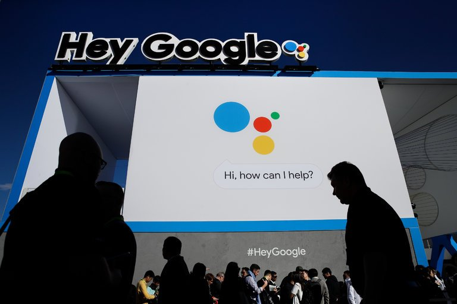
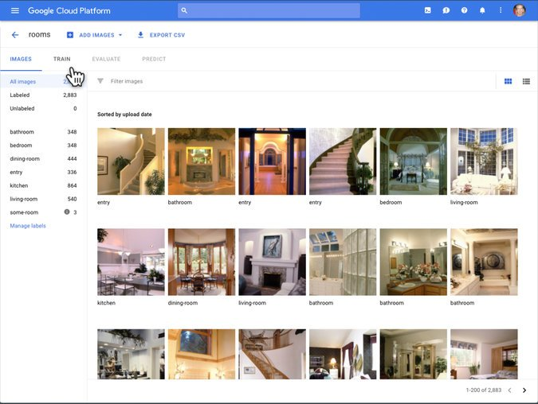

Google Sells A.I. for Building A.I. (Novices Welcome)

# Google Sells A.I. for Building A.I. (Novices Welcome)

Photo

The Google booth at the CES electronics trade show in Las Vegas this month. “You don’t need a Ph.D. in machine learning,” said Diane Greene, who oversees Google’s cloud computing group. “But you can still build a highly accurate machine learning model.” Credit Jae C. Hong/Associated Press

SAN FRANCISCO — Google has been using artificial intelligence to build other artificially intelligent systems for the last several months.

Now the company plans to sell this kind of “automated machine learning” technology to other businesses across the globe. On Wednesday, Google introduced a cloud-computing service that it bills as a way to build a so-called computer vision system that suits your particular needs — even if you have little or no experience with the concepts that drive it.

If you are a radiologist, for example, you can use CT scans to automatically train a computer algorithm that identifies signs of lung cancer. If you run a real estate website, you can build an algorithm that distinguishes between living rooms and kitchens, bathrooms and bedrooms.

At least that is the pitch. “You don’t need a Ph.D. in machine learning,” said Diane Greene, who oversees Google’s cloud computing group. “But you can still build a highly accurate machine learning model.”

Like many of the world’s largest internet companies in recent years, Google has begun relying on machine learning — computer algorithms that can learn tasks on their own by analyzing large amounts of data. These include systems that learn to recognize commands spoken into smartphones or translate one language into another. They also include [algorithms that learn to build other machine learning systems](https://www.nytimes.com/2017/11/05/technology/machine-learning-artificial-intelligence-ai.html).

 [Continue reading the main story](https://www.nytimes.com/2018/01/17/technology/google-sells-ai.html?_r=0#story-continues-2)

Advertisement

[Continue reading the main story](https://www.nytimes.com/2018/01/17/technology/google-sells-ai.html?_r=0#story-continues-3)

Google uses the technique while building systems that can recognize faces, products, landmarks and other objects in photos. In some cases, these algorithms are more accurate than something that is designed solely by engineers.

The new service is part of a widespread effort to expand the power of modern A.I. to businesses that are largely unfamiliar with this rapidly evolving technology. Like Google, a New York start-up called Clarifai offers an online service that helps customers train computer vision algorithms.

At the same time, several other start-ups, like Boston’s DataRobot and Silicon Valley’s H2O.ai, offer services designed to help businesses analyze the way products, customers, markets and employees behaved in the past and predict how they will perform in the future.

“They aim to automate data science in general,” said Randy Olson, a data scientist at Life Epigenetics, a company in Portland, Ore.

Tech giants like Google, Amazon and Microsoft have [hired a large portion of the people who specialize](https://www.nytimes.com/2017/10/22/technology/artificial-intelligence-experts-salaries.html) in the machine learning techniques that are rapidly accelerating the progress of A.I. — a community of only 10,000 researchers worldwide, according to one estimate. That means most businesses don’t have the talent needed to explore the latest machine learning.

Photo

Google’s artificial intelligence system asks customers to upload images so it can learn to identify objects on its own. Credit Google Cloud AI

The question is whether these new services will work as advertised and how rapidly they will evolve in the years to come.

Google, Amazon, Microsoft and others already offer cloud-computing services that let businesses add existing machine learning algorithms to their own products. A company can take a Microsoft computer vision algorithm, for example, and slip it into a new smartphone app.

But with its new service, Google goes a step further, providing an automated way for businesses to build new algorithms. Businesses can upload their own images, provide a list of objects pictured in these images and train their own computer vision systems, tackling tasks that aren’t necessarily handled by existing technology, according to Google.

## Newsletter Sign Up

 [Continue reading the main story](https://www.nytimes.com/2018/01/17/technology/google-sells-ai.html?_r=0#continues-post-newsletter)

### Interested in All Things Tech?

The daily Bits newsletter will keep you updated on the latest from Silicon Valley and the technology industry, plus exclusive analysis from our reporters and editors.

 You agree to receive occasional updates and special offers for The New York Times's products and services.

Initially, Google will open this service only to a small group of businesses. A Google product manager, Rajen Sheth, said the company would work with these customers to determine the price.

Risto Miikkulainen, a professor of computer science at the University of Texas at Austin who has long explored the kind of technology that underpins Google’s new service, agreed that it had the potential to help other businesses build their own A.I.

“It is really powerful technology,” said Mr. Miikkulainen, who is also vice president of research at Sentient Technologies.

But sometimes, there is no substitute for good old human labor. With Google’s new service, humans must label the data before the system can learn from it. Google can provide the human labelers, as do companies like CrowdFlower.

And even when an online service successfully automates a task, it’s not necessarily worth using.

James Bradley and his London company, NMT Vision, once used Clarifai to train and operate algorithms to identify websites that are selling products that infringe on copyrights. But he and his company now handle this on their own, mainly because the cost is lower.

Services like DataRobot and H20.ai may bill themselves as automated data scientists, but here, too, automation has its limits. “These services are only as good as their parts,” said Patrick Dougherty, a data scientist with the Seattle-based firm Slalom Consulting. “And humans still supply some of the parts.”

Google says that once images are labeled, its new service operates without human involvement. In a matter of minutes, it can retrain an existing algorithm using the customer’s images. Given more time, it can build a model from scratch, specifically for the problem at hand.

If you are a zoologist who wants an algorithm that identifies jaguars and giraffes, said Fei-Fei Li, chief scientist inside the Google cloud group, all you have to do is supply the right images. “You upload jaguars and giraffes,” she said. “And you are done.”

All that remains is determining how well it works.

Follow Cade Metz on Twitter: [@CadeMetz](https://twitter.com/CadeMetz?ref_src=twsrc%5Egoogle%7Ctwcamp%5Eserp%7Ctwgr%5Eauthor).

A version of this article appears in print on January 18, 2018, on Page B1 of the New York edition with the headline: Google Selling A.I. Technology That Helps Others Create A.I. [Order Reprints](http://www.nytreprints.com/)| [Today's Paper](http://www.nytimes.com/pages/todayspaper/index.html)|[Subscribe](http://www.nytimes.com/subscriptions/Multiproduct/lp839RF.html?campaignId=48JQY)

 [Continue reading the main story](https://www.nytimes.com/2018/01/17/technology/google-sells-ai.html?_r=0#whats-next)